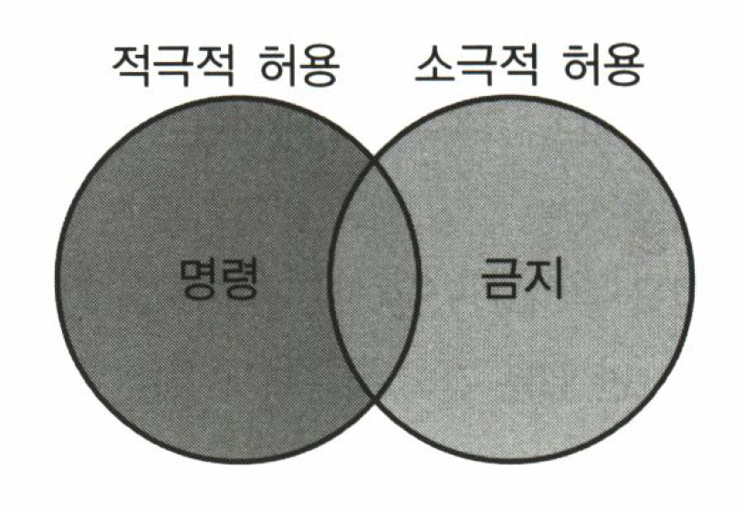
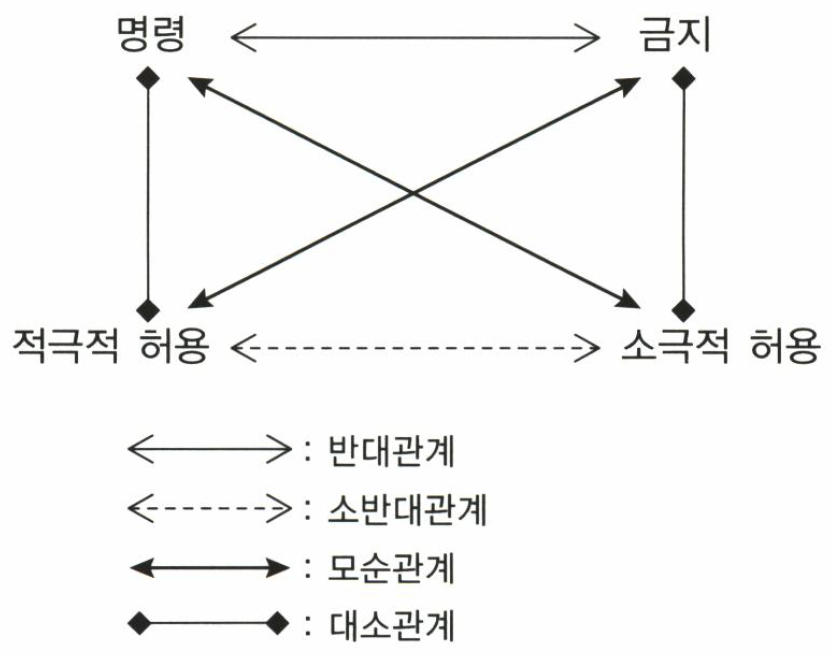

# 출제방향

## 1. 문항 유형

언어이해 영역에서는 국어, 인문, 사회, 과학ㆍ기술, 문학ㆍ예술 등 5개 분야에서 총 35문항을 출제하였다. 이 중 ‘국어’ 분야를 제외한 4개 분야는 지문을 기반으로 문항을 출제하였다. 지문을 활용하는 문항 세트는 지문 특성에 따라 종합적인 독해 능력을 평가하거나 특정한 평가 기준을 적용하여 평가하도록 설계하였다.

‘국어’ 분야에서는 법학 계열에서 빈번하게 등장하면서도 그 뜻을 곧잘 혼동하여 사용하는 한자어들의 어휘 사용 맥락을 분별하게 하는 문항과 어의와 어법을 명확히 이해하고 사용하는지를 평가하는 문항들을 개발하였다.

‘인문’ 분야에서는 사학과 철학 지문을 다루었다. 사학 지문에서는 향리의 행적을 다룬 『연조귀감(掾曹龜鑑)』의 서문을 다루면서 ‘서문’이라는 형식으로부터 원저작이 담고 있는 사실과 그에 대한 해석적 평가를 변별하게 하고 지문의 역사성을 고려한 상소문 쓰기에 적용해 보게 하였다. 철학 지문에서는 역사적 특수성을 갖고 있으면서도 그 시대의 최상위 가치 판단의 근거가 되는 상위선에 대한 공동체주의적 논의를 다루어 도덕적 가치 판단의 객관성과 상대성에 관한 지문의 논지를 이해하고 해석할 수 있는지를 평가하였다.

‘사회’ 분야에서는 정치학, 경제학, 교육학, 법제사학, 법철학 지문을 다루었다. 정치학 지문에서는 선거에서의 유권자의 정치적 선택을 설명하는 사회심리학 이론과 합리적 선택 이론을 다루면서 이론이 현실적인 설명력을 갖기 위해 어떻게 발전하는지를 지문에 근거하여 파악하게 하고 이와 함께 가상의 정치적 상황에 적용한 이론적 예측을 평가하게 하였다. 경제학 지문에서는 자본 구조와 기업의 가치 간의 상관성을 평가하는 완전 자본 시장 이론과 불완전 자본 시장 이론을 제시하여 이론들의 관계를 바르게 이해하고 이를 기업 평가에 적용할 수 있는지를 물었으며, 교육학 지문에서는 근접 발달 영역과 협동적 상호작용을 주요 개념으로 삼는 비고츠키 교육 이론을 다루면서 개념들을 정확히 이해하고 적용할 수 있는지를 물었다. 법제사학 지문에서는 해방 후 헌법위원회를 제헌 헌법에 조문화하는 과정에서 위헌 법률의 판단 주체를 놓고 삼권 분립 문제를 고심했던 과정을 다루면서 조문에 담긴 정치적, 역사적 배경을 이해하는지를 물었으며, 법철학 지문에서는 분석 법학을 다루면서 폐쇄적 법체계와 개방적 법체계의 법 논리가 어떤 가치 판단에 근거하고 있는지 파악하게 하였다.

‘과학ㆍ기술’ 분야에서는 물리학과 생물학 지문을 다루었다. 물리학 지문에서는 자기 열량 효과를 활용한 자기 냉각 기술에 대해 다루면서 지문에 제시된 자기 물질의 열역학적 순환 과정을 개념 관계를 고려하여 정확히 이해하는지를 평가하는 문항들을 개발하였다. 생물학 지문에서는 내장 지방세포와 둔부 및 대퇴부 지방세포를 중심으로 지방의 저장과 분해, 그리고 그에 영향을 미치는 효소 및 호르몬의 관계를 다루면서 그 기전과 작용 과정을 바르게 이해하며 적용 사례에 맞추어 평가할 수 있는지를 묻는 문항들을 개발하였다.

‘문학ㆍ예술’ 분야에서는 문학과 예술 지문을 다루었다. 문학에서는 한국 현대 소설 작품으로 박영한의 「지상의 방 한 칸」을 선정하여 대화를 통해 드러나는 인물의 내면 심리와 작중 상황을 추리하도록 하였으며, 예술에서는 근대 멜로드라마를 소재로 삼아 멜로드라마의 발전 과정 속에서 어떤 장르적 특성이 형성되고 어떤 양식적 가능성이 모색되었는지를 파악하도록 하였다.

## 2. 난이도

2012학년도 법학적성시험에서는 지문과 문항의 난이도를 2011학년도와 비슷하게 유지하였다. 전체 지문에서 익숙한 내용과 낯선 내용이 고루 갖추어지게 하였고, 정보량이 많은 지문과 비교적 평이한 지문을 함께 고려하여 다양한 성격의 지문을 읽을 수 있는 능력을 측정하고자 하였다. 하지만 낯설거나 정보량이 많은 지문이라 하더라도 특정 전공의 배경 지식이 유리한 변인이 되지 않도록 조정하였다.

## 3. 문항 출제 시의 유의점 및 강조점

ㆍ언어이해 영역에서 평가하고자 하는 능력이 주로 통합적 이해력과 심층 분석력에 있다는 점을 고려하여 지문 분량에 융통성을 두었다. 다소 어려운 지문의 경우 분석적 이해를 주로 평가할 때에는 지문 분량을 늘리고, 추론 능력을 주로 평가할 때에는 지문 분량을 줄였다. 비교적 쉬운 지문의 경우에는 지문의 분량을 늘렸다.

ㆍ선지식에 의해 풀게 되거나 전공에 따른 유불리가 분명해지는 지문의 선택과 문항의 출제를 지양하였다.

ㆍ출제 의도를 감추거나 오해의 소지가 있는 문두의 선택을 피하고, 평가하고자 하는 능력을 정확히 평가할 수 있도록 간명한 형식을 취하였다.

ㆍ문항 및 답지 간의 간섭을 최소화하고, 답지 선택에서 능력에 따른 변별이 이루어질 수 있도록 하였다.

---

# 문항별 해설

## 01

### 문항구분

* 문항유형 : 어휘
* 내용영역 : 국어
* 평가 목표 : 유의어의 용법 차이에 대한 이해
* 정답 : (1)

### 문항 해설

단어들의 관계, 곧 유의 관계, 반의 관계, 상ㆍ하위 관계 등을 파악하여 단어들 사이의 관련성을 이해하는 것이 어휘력의 핵심이다. 어휘력은 단어들 사이의 관계에 대한 파악에만 그치는 것이 아니라 이들 유의어들의 차이점에 대한 이해를 바탕으로 적절한 문맥이나 화맥(話脈) 속에서 적절한 어휘를 사용할 수 있는 능력까지 포함한다. 이 문항에서는 이 가운데 유의 관계에 있는 단어들을 대상으로 그 의미와 용법의 차이를 파악하고 있는지를 묻고 있다.

### 선택지별 해설

(1) ‘단절되다’는 “(1) 유대나 연관 관계가 끊어지다.”, “(2) 흐름이 연속되지 않다.”의 의미를 지닌 단어이다. 이 가운데 (1)의 의미로는 ‘두절되다’와 서로 넘나들면서 사용되는 경우가 있지만, 답지 (1)과 같이 ‘연락(어떤 사실을 상대편에게 알리는 일)’이 특정한 누군가의 의도에 의해 끊어지는 경우가 아닐 때에는 ‘두절되다’를 쓰는 것이 정확하다.

(2) ‘중수(重修)하다’와 ‘중창(重創)하다’는 기존 건물이 낡았거나 일부가 무너졌을 경우 등 많은 경우에 서로 넘나들면서 사용될 수 있지만, 여기에서와 같이 소실(燒失)되거나 무너져 이미 사라진 건물을 다시 짓는 일에 대해서는 ‘중수하다’를 사용할 수 없다. ‘중수하다’는 기존 건물이 낡거나 일부가 무너지는 등 기존 건물이 남아 있는 경우에만 사용된다. ‘중창하다’의 사용 영역이 ‘중수하다’에 비해 더 넓다고 할 수 있다.

(3) ‘몰입(沒入)하다’는 “어떤 일에 깊이 파고들거나 빠지다.”의 의미를 지닌 단어이고, ‘골몰(汨沒)하다’는 “다른 생각을 할 여유도 없이 한 가지 일에만 파묻히다.”의 의미를 지닌 단어로서 유의어 관계에 있다. 그러나 ‘몰입하다’는 ‘학문에/감정에/연구에 몰입하다’와 같이 추상적인 일이나 심리적 상태에 빠져드는 상황에서 사용되고, 해결해야 할 구체적인 과제의 해결을 위하여 궁리에 빠지는 상황에서는 ‘골몰하다’나 ‘몰두하다’가 사용된다.

(4) ‘구호(救護)하다’는 “재해나 재난 따위로 어려움에 처한 사람을 도와 보호하다.”, “병자나 부상자를 간호하거나 치료하다.”의 의미를 지닌 동사이고, ‘구제하다’는 “자연적인 재해나 사회적인 피해를 당하여 어려운 처지에 있는 사람을 도와주다.”의 의미를 지닌 단어로서 유의 관계에 있는 단어이다. 그러나 여기에서와 같이 어떤 대상을 어떤 상태로부터 벗어나도록 도와주는 상황(‘A를 B에서 …하다’)에서는 ‘구제하다’만이 사용된다.

(5) ‘대치(代置)하다’는 “다른 것으로 바꾸어 놓다.”의 의미를 지닌 동사이고, ‘대체(代替)하다’는 “다른 것으로 대신하다.”의 의미를 지닌 동사로서 유의 관계에 있는 단어이다. 그러나 여기에서와 같이 ‘대신하다’ 또는 ‘갈음하다’의 의미를 표시하는 상황에서는 ‘대치하다’가 사용될 수 없고 ‘대체하다’가 사용된다.

## 02

### 문항구분

* 문항유형 : 어법
* 내용영역 : 국어
* 평가 목표 : 문장이 지닌 어법상의 문제점 파악
* 정답 : (5)

### 문항 해설

적절한 문장을 쓸 수 있는 능력을 평가하기 위한 문항이다. 적절한 문장이 되지 못하는 이유 가운데 많은 부분은 실수에 의한 것도 있지만 어법적으로 잘못된 것임에도 문제가 없는 것처럼 오해하기 때문에 나타난다. 여기에서는 평소에 문제가 없는 것처럼 사용하고 있는 문장들을 대상으로 그 문장이 지닌 문제점을 찾아낼 수 있는지를 묻고자 하였다.

### 선택지별 해설

(1) 이 문장의 서술어 ‘비난하다’는 타동사로서 목적어 성분을 필요로 한다. 곧 이 동사는 ‘A를 비난하다’ 또는 ‘A에 대하여/대해 비난하다’와 같이 쓰인다. 그런데 이 문장에서는 목적어에 해당하는 성분이 ‘판단에’와 같은 처격어로 나타나 있어 적절하지 않은 문장이 되었다. 이 문장이 적절한 것이 되기 위해서는, ‘판단에’는 ‘판단에 대하여’ 또는 ‘판단을’로 나타나야 한다.

(2) 이 문장의 서술어 동사 ‘적용하다’는 앞에 목적어와 여격어를 필요로 한다. 곧 ‘A를 B에/에게 적용하다’와 같은 형식으로 사용된다. 이때의 여격어 ‘B에/에게’는 ‘적용하다’가 요구하는 필수 성분으로서 그 문장이든 문맥에서 반드시 나타나야 한다. 그런데 이 문장에서는 이러한 여격어 성분으로 볼 수 있는 요소가 ‘정규직 사원뿐만 아니라 비정규직 사원까지’로 나타나 있는데, 이때의 ‘까지’는 어떤 범위의 끝을 표시해 주는 보조사로서 여격어를 표시하는 여격조사의 역할을 할 수 없다. 따라서 이 문장이 적절한 것이 되기 위해서는 ‘정규직 사원뿐만 아니라 비정규직 사원에게까지’와 같이 여격조사가 반드시 나타나야 한다.

(3) ‘-시키다’는 동작성을 지니거나 서술성을 지닌 일부 명사 뒤에 붙어서 ‘사동’의 의미를 더해 주는 접미사이다. 그런데 이 문장은 정부가 발표를 통해 책임을 학원에 떠넘긴다는 의미를 표시하는 것이므로 사동적인 의미가 필요 없는 문맥이다. 단순히 ‘떠넘기다’의 의미라면, ‘전가(轉嫁)’에 이미 “잘못이나 책임을 남에게 뒤집어씌움”이라는 뜻이 있으므로 ‘전가하다’로 충분하다. ‘전가하다’가 아니라 여기에서와 같이 ‘전가시키다’가 사용되었을 경우에는 어떤 행동 주체(사동주)가 또 다른 행동 주체(피사동주)로 하여금 ‘전가하게/떠넘기게 하다’의 의미로 해석되므로, “정부가 어떤 다른 사람으로 하여금/다른 사람을 시켜서 전가하게 하다.”의 의미로 해석된다. 그런데 이 문장에서는 이러한 사동적 의미가 나타날 상황이 아니므로 ‘전가시키다’가 사용되어서는 안 되고, ‘전가하다’가 사용되어야 한다.

(4) 이 문장은 ‘높이다’의 목적어가 ‘심사의 일관성 유지와 심사 결과의 예측성’으로 나타나 있다. 곧 ‘\[심사의 일관성 유지와 심사 결과의 예측성]을 높일’의 구조로서 ‘-을 높일’의 목적어로 ‘심사의 일관성 유지’와 ‘심사 결과의 예측성’이 공유되어 있다. 이때 ‘심사 결과의 예측성을 높이다’는 적격하지만, ‘심사의 일관성 유지를 높이다’는 부적격하므로 ‘높이다’의 목적어가 부당하게 공유되어 있다. 이 문장이 적절하게 표현되려면 ‘새로운 심사 기준은 심사의 일관성을 유지하고 심사 결과의 예측성을 높일 수 있을 것으로 기대된다.’와 같이 서술어가 달리 표현되어야 한다.

(5) 이 문장은 주어가 ‘지금은’이고 서술어가 ‘때이다’인 문장이다. 여기에서 서술어 명사 ‘때’를 관형절이 수식해 주는 구조로서 그 관형절이 ‘시장 상황의 변화로 어려움을 겪고 있는 농민들의 문제를 해결하기 위해 정부가 적극적으로 노력해야 할’이다. 관형절의 주어는 ‘정부가’이며 서술부는 선행절 ‘시장 상황의 변화로 어려움을 겪고 있는 농민들의 문제를 해결하기 위해’와 후행절 ‘(정부가) 적극적으로 노력해야 할’이 접속되어 있다. 그리고 ‘시장 상황의 변화로 어려움을 겪고 있는’이 ‘농민들’을 수식해 주고 있는 구조이다. 관형절 내부의 구조가 복잡하기는 하지만 어법적으로 아무런 문제가 없는 문장이다.

## 03

### 문항구분

* 문항유형 : 표현
* 내용영역 : 국어
* 평가 목표 : 글로 표현할 때, 문제가 되는 잘못된 단어와 표현의 문제점 파악 및 교정
* 정답 : (5)

### 문항 해설

잘못된 하나의 단어나 표현으로 인하여 전체적인 의미가 달라질 수 있다는 사실을 분명히 인식하는 일은, 정확한 문장을 써서 다른 해석의 가능성을 막아야 하는 예비 법조인에게 반드시 요구되는 능력이다. 이 문항은 글을 쓸 때 다른 의미로 해석될 수 있게 하는 잘못이나 문제점을 정확히 파악하여 바르게 고쳐 쓸 수 있는지를 평가하기 위한 것이다.

### 선택지별 해설

(1) ㉠의 ‘호리지차(毫釐之差)’는 ‘아주 적은 차이, 아주 근소한 차이’를 표시하는 한자 성어이다. 그런데 \<보기>의 문맥에서는 ‘차이가 크다’는 의미가 나타나야 하므로 이 문맥에서 ‘호리지차’는 의미상 모순이어서 잘못이다. 따라서 ‘차이가 크다’는 의미를 표시하는 한자 성어인 ‘천양지차(天壤之差)’, ‘소양지차(霄壤之差)’, ‘운니지차(雲泥之差)’ 등으로 바로잡은 것은 적절하다.

(2) ‘빈발(頻發)하다’는 “어떤 일이나 현상이 자주 일어나다.”의 의미를 지닌 동사이다. 그런데 \<보기>의 문맥은 “자주 빈발해 왔다.”이므로 앞에 온 부사 ‘자주’와 ‘빈발하다’의 의미가 중복적으로 쓰이고 있다. 따라서 앞에 ‘자주’가 있으므로 이 부사와 함께 사용되면서 “전쟁이 일어나다.”의 의미를 표시할 수 있는 동사, 즉 ‘자주’의 의미를 지니지 않고 전쟁이 일어남을 표시하는 동사인 ‘발발(勃發)하다’로 바로잡은 것은 적절하다.

(3) 우선 ㉢의 서술어 ‘지나치지’는 형용사이므로 그 부정 보조 용언은 보조 형용사 ‘아니하다’가 와야 한다. 그런데 여기의 ‘않는다’의 ‘-는다’는 동사에 통합할 수 있는 어미이므로 ‘않는다’는 동사의 활용형이다. 따라서 앞의 ‘지나치지’와 함께 쓰일 수 있는 ‘아니하다/않다’로 바로잡은 것은 적절하다. 그리고 외국어의 번역체라고 하여 무조건 문제가 되는 것이 아니라, 그 문장의 질서가 국어의 질서와 상충되느냐 그렇지 않으냐 하는 문제 때문에 문장의 적격성이 문제가 된다는 사실에 유의할 필요가 있다. 이렇게 볼 때 ‘전쟁의 역사라고 해도 전혀 지나치지 않다’의 경우 ‘지나치다’는 형용사로 쓰인 것인 만큼 보조 형용사로 ‘않다’가 사용되는 것이 적절하며, 문맥적으로 볼 때 이때의 ‘전쟁의 역사라고 해도’ 뒤에서는 ‘이는’ 또는 ‘이러한 말은’ 정도의 요소가 자연스럽게 상정되므로 ‘전쟁의 역사라고 해도 전혀 지나치지 않다’는 문제가 없는 문장이다.

(4) ‘결단코’는 ‘마음먹은 대로 반드시’의 뜻을 지닌 부사로서 주체의 강한 의지를 표시할 때 사용된다. 따라서 ‘결단코 보답을 해 주겠다’라는 문장은 화자가 자신의 강한 의지를 표시할 때 사용하는 것이다. 그런데 \<보기>의 문맥에서 이 문장은 국민들이 확신하는 내용에 해당하는 것이다. 이렇게 국민들이 자신의 강한 의지를 표시하는 것이 아니라 국민들이 확신하는 내용을 표시해야 하기 때문에, 화자의 강한 의지를 표시하는 ‘결단코 보답을 해 주겠다’는 부적절하다. 따라서 국민들이 틀림없다고 생각하는 내용에 해당하는 표현이 되려면 의지와는 무관하게 ‘반드시’의 의미를 표시하는 부사가 사용되어야 하고, ‘추측, 확신’ 등의 양태를 표시하는 요소가 와야 하므로 ‘기필코/반드시/틀림없이 보답을 해 주리라고’ 또는 ‘기필코/반드시/틀림없이 보답을 해 줄 것이라고’와 같이 바로잡는 것은 적절하다.

(5) ‘이후(以後)’는 독립적으로 쓰였을 때는 “지금으로부터 뒤”의 의미를 표시하고 그 기준이 앞에 제시된 경우에는 “기준이 되는 때를 포함하여 그보다 뒤”의 의미를 표시한다. 그런데 \<보기> 글의 문맥에서는 ‘우리의 국가적 보훈’이 ‘일제 강점기’가 지난 다음 시기부터 이루어졌음을 알 수 있다. 이러한 문맥인데 ‘그 시기 이후에’라고 하면 ‘일제 강점기를 포함하여 그 뒤에’의 의미이므로 문맥과 맞지 않는다. 따라서 이는 ‘그 시기(일제 강점기) 후에/후부터/다음부터’로 표현되어야 맞다. 이렇게 이 문장은 ‘후’를 써야 하는 상황에서 ‘이후’를 썼기 때문에 잘못된 것이다. ‘그 시기 이후에’는 ‘일제 강점기를 포함하여 그 다음 시기에’라는 의미이고 ‘그 시기 이후부터’는 ‘일제 강점기를 포함하여 다음 시기부터’라는 의미이므로 조사를 바꾸어 쓴다고 해서 이 문장의 잘못이 바로잡히지 않는다.

## 04

### 문항구분

* 문항유형 : 분석
* 내용영역 : 인문
* 평가 목표 : 세부 정보 파악
* 정답 : (2)

### 문항 해설

이 문항은 향리들의 역사서인 『연조귀감』의 특징을 이해하고 있는가를 확인하고자 마련되었다. 지문을 통해 『연조귀감』의 특징, 간행 배경, 수록 내용 등을 파악하는 것이 필요하다. 『연조귀감』은 삼국 시대 이래 향리들의 실태를 파악할 수 있는 귀중한 자료이며, 조선 후기의 새로운 역사의식을 담은 서술이라는 점에서 사학사적으로도 자료적 의의를 높이 평가받고 있다.

### 선택지별 해설

(1) 지문 세 번째 문단의 “그 글들은 근거가 확실하고 상소의 언사 또한 가히 추려 쓸 만한 것이 많으며, 힘써 선함을 권하고 악함을 깨우치는 기록이 연이어져 있어 가히 읽을 만하다. 그러므로 이 책에 실린 내용은 마땅히 향리들만이 거울로 삼아야 하는 것이 아니라, 생각건대 사대부 또한 가히 버려서는 안 될 것이니, 이 또한 아름답지 아니한가.”라는 구절과 지문 일곱 번째 문단의 “이 책 속에 기록된 내용이 이 같은 뜻을 잘 드러냈으니 취하고 버리는 것의 분별이 분명하다고 할 만하다.”라는 구절을 통해서 확인할 수 있다.

(2) 지문 세 번째 문단의 “본관이 월성인 사과 벼슬의 이진흥은 신라와 고려 이래로 이서로서 가문을 일으킨 인물을 널리 고찰하여 「관감록」 한 편을 지었다. 그리고는 부친 통덕랑 이경번이 지은 「이직명목해」 및 「감은시」ㆍ「호장소」ㆍ「향공소」를 그 앞에 합하여, 『연조귀감』이라 하였다.”라는 구절과 지문 마지막 문단의 “사과 이진흥의 후손인 이명구가 이 책을 간행하려고 하면서, 나에게 서문을 써 줄 것을 청해 왔다. … 다만 사과 부자가 명을 다스리고 실에 힘썼음을 기쁘게 생각한다는 말을 하려고 하였을 뿐이다.”라는 구절을 통해 『연조귀감』이 여러 가문이 함께 간행한 것이 아니라는 것을 알 수 있다.

(3) 지문 세 번째 문단의 “신라와 고려 이래로 이서로서 가문을 일으킨 인물을 널리 고찰하여 「관감록」 한 편을 지었다. … 위아래 오륙백 년 사이에 행적이 많이 흩어져 버려 진기한 꽃이나 특이한 나무 같은 뛰어난 인재를 많이 채록할 수 없었으니, 이 또한 문지 때문에 그리된 것이다.”라는 구절을 통해서 확인할 수 있다.

(4) 지문 세 번째 문단의 “「관감록」 한 편을 지었다. 그리고는 부친 통덕랑 이경번이 지은 「이직명목해」 및 「감은시」ㆍ「호장소」ㆍ「향공소」를 그 앞에 합하여, 『연조귀감』이라 하였다. 그 글들은 근거가 확실하고 상소의 언사 또한 가히 추려 쓸 만한 것이 많으며…”라는 구절을 통해 『연조귀감』이 다양한 형식의 글을 수록하고 있었음을 알 수 있다.

(5) 지문 두 번째 문단의 “반면에 오로지 주현에서 벼슬살이하는 자는 그 문지가 변변치 못하고 맡은 바 직무가 아주 낮으며 명성도 한 지역을 넘어 떨치지 못한다. 혹 높은 식견과 뛰어난 재주를 지녔다고 하더라도 모두 묻혀 사라져서 드러나지 않는다. 이러하니 비록 그 같은 인재를 자랑하여 기록하려고 한들 그렇게 할 수 있겠는가. 이 같은 사실을 나는 심히 한스럽게 생각한다.”라는 구절과 지문 세 번째 문단의 “다만 위아래 오륙백 년 사이에 행적이 많이 흩어져 버려 진기한 꽃이나 특이한 나무 같은 뛰어난 인재를 많이 채록할 수 없었으니, 이 또한 문지 때문에 그리된 것이다.”라는 구절을 통해서 확인할 수 있다.

## 05

### 문항구분

* 문항유형 : 비판
* 내용영역 : 인문
* 평가 목표 : 화제 정보의 종합적 평가
* 정답 : (2)

### 문항 해설

이 문항은 \<보기>에 나타난 글쓴이의 인재 선발에 관한 관점을 해석하고, 이러한 관점을 바르게 적용할 수 있는지를 평가하기 위한 것이다.

### 선택지별 해설

(1) 내직이 외직에 비하여 특전이 많으므로 고위 내직 승급 시에는 외직을 거치도록 하는 것을 요청하는 글로 글쓴이의 취지인 인재 선발 시 문지가 아닌 개인의 능력에 따라 해야 한다는 내용이 없으므로 틀린 진술이다.

(2) 지문 네 번째 문단과 다섯 번째 문단에서 글쓴이는 “옛적에는 사람을 등용할 때 재와 덕으로써 그 기준을 삼았으며 문지로써 그렇게 한 것은 아니었다.”고 하면서, “후세에는 그렇지가 않아서 오로지 문지로써만 사람을 등용하였다. 그러므로 뛰어나고 특이한 능력을 지닌 선비라도 미천한 집안에서 태어나면 길이 막혀 벼슬할 수가 없”는 현실을 개탄하고 있다. \<보기>의 취지는 문지만으로 인재를 선발해서는 안 된다는 것이므로, \<보기>의 취지대로 상소문을 올린다면 “버림받은 집안의 사람이라도 뛰어난 자는 등용하는 데 구애됨이 없게 하소서.” 정도가 될 것이다.

(3) 서얼이 적자와 같은 부친의 소생임에도 불구하고 족보 편찬 시에 기재상 차이가 나는 점의 시정을 요청하는 글로 글쓴이의 취지인 인재 선발 시 문지가 아닌 개인의 능력에 따라 해야 한다는 내용이 없으므로 틀린 진술이다.

(4) 서북 지방의 사람들이 다른 지역보다 많이 부과되는 세금으로 고통을 받고 있어 세금의 삭감을 요청하는 글로 글쓴이의 취지인 인재 선발 시 문지가 아닌 개인의 능력에 따라 해야 한다는 내용이 없으므로 틀린 진술이다.

(5) 천민을 상민과 같이 군역을 지게 해 주기를 요청하는 글로 글쓴이의 취지인 인재 선발 시 문지가 아닌 개인의 능력에 따라 해야 한다는 내용이 없으므로 틀린 진술이다.

## 06

### 문항구분

* 문항유형 : 추론
* 내용영역 : 인문
* 평가 목표 : 맥락에 근거한 세부 정보 추리
* 정답 : (4)

### 문항 해설

이 문항은 지문을 읽고 글쓴이가 이해한 ‘향리’의 실상을 정확하게 파악하고 있는지를 확인하기 위한 것이다. 역사적으로 보면 고려 시대의 향리는 지방 토착 세력으로서 과거시험과 이직을 통하여 얼마든지 지배층으로 상승할 수 있었다. 그러나 고려 말에 이르러 지배층의 수가 급증하자 향리가 과거를 통하여 양반이 되는 길은 대폭 제한되었고 조선 초기부터는 그들에게 주던 외역전과 녹봉도 주어지지 않게 되었다. 향리의 지위는 지방 지배자에서 지방의 행정실무자로 격하되었다. 따라서 향리의 역은 고역으로 여겨져 왔고 그 때문에 역을 기피하려는 사람들이 많았다. 『연조귀감』은 이러한 시대적 배경 아래에서 편찬되었다.

### 선택지별 해설

(1) 지문 세 번째 문단의 “힘써 선함을 권하고 악함을 깨우치는 기록이 연이어져 있어 가히 읽을 만하다.”라는 구절과 지문 일곱 번째 문단의 “황무진은 가리였으나 몸을 다해 충효에 뛰어나 원주 사람들은 지금까지도 그를 모시는 제사를 지낸다.”라는 구절에서 당시 향리들이 충과 효 등 유교적 가치를 수용했음을 알 수 있다.

(2) 지문 네 번째 문단의 “내가 듣기에 옛적에는 … 주현에서 벼슬살이하던 사람을 조정에 등용하는 것은 단지 관부의 책임자로 승진시키는 정도이니, 생각건대 어려운 일이 아니었다.”라는 구절을 통해서 향리 중에 조정에 등용된 자도 있었음을 알 수 있다.

(3) 지문 첫 번째 문단의 “이 둘은 비록 그 명칭이 같지 아니하고 지위의 높고 낮음에 차등이 있다 하더라도, 다스리는 일을 나누어 맡는다는 의미에서는 일찍이 서로 다른 적이 없었다.”라는 구절에서 확인할 수 있다.

(4) 지문 세 번째 문단의 “본관이 월성인 사과 벼슬의 이진흥은 신라와 고려 이래로 이서로서 가문을 일으킨 인물을 널리 고찰하여 「관감록」 한 편을 지었다. … 다만 위아래 오륙백 년 사이에 행적이 많이 흩어져 버려 진기한 꽃이나 특이한 나무 같은 뛰어난 인재를 많이 채록할 수 없었으니…”라는 구절과 지문 네 번째 문단의 “내가 듣기에 옛적에는 … 주현에서 벼슬살이하던 사람을 조정에 등용하는 것은 단지 관부의 책임자로 승진시키는 정도이니, 생각건대 어려운 일이 아니었다.”라는 구절, 그리고 지문 다섯 번째 문단의 “그러나 후세에는 그렇지가 않아서 오로지 문지로써만 사람을 등용하였다. 그러므로 뛰어나고 특이한 능력을 지닌 선비라도 미천한 집안에서 태어나면 길이 막혀 벼슬할 수가 없으며, 주현에서 벼슬살이하던 사람은 연자방앗간에서 맷돌을 돌리는 당나귀와 같아서 종신토록 벗어날 수가 없다.”라는 구절을 통해서 향리의 지위가 이전 시대에 비하여 점차 나빠지고 있음을 알 수 있다.

(5) 지문 첫 번째 문단의 “조선의 관제는 주나라의 육전 제도를 근본으로 삼고 있으며, 주현의 향리는 조정의 여러 관직을 모범으로 삼아 본뜬 것이다.”라는 구절에서 확인할 수 있다.

## 07

### 문항구분

* 문항유형 : 추론
* 내용영역 : 사회
* 평가 목표 : 핵심 정보 간의 관계 추리
* 정답 : (3)

### 문항 해설

이 문항은 헌법위원회가 형성되는 과정에서 작용한 이론적 근거를 이해하고 있는지 평가하기 위한 것이다.

### 선택지별 해설

(1) ㉠은 “일반 시민생활에 대한 법 적용, 즉 민사 재판과 형사 재판”만을 법원의 권한으로 보아 위헌 법률 심사권은 법원의 권한에서 제외된다고 본 반면, ㉡은 “모든 법의 적용을 법원\[사법권]의 권한”으로 보아 위헌 법률 심사권도 법원의 권한으로 보았다.

(2) ㉠은 “법률이 헌법에 위반되는지 여부에 대한 판단을 의회의 자율에 맡겨야 한다.”는 입장인 반면에, ㉢은 별도의 헌법위원회에서 위헌 법률 심사를 담당해야 한다는 입장이었기 때문에, 양자는 위헌 법률 심사 기관에 대해 다른 입장을 가졌다.

(3) 미국식 사법 심사제를 주장한 법원 측 인사들은 “법의 적용에 숙달된 판사들이 법리적 관점에서” 위헌 법률 심사를 해야 한다고 주장하였다. 반면, 유진오는 “선출되지 않은 대법관 몇 명이 \[법리적 관점에서만 판단하여] 국민의 대표 기관이 제정한 법률을 무효로 할 수 있는 사법 심사제는 위험하다.”고 판단하였다. 유진오는 위헌 법률 심사의 “정치적 성격”에 주목하여 헌법위원회를 법관들이 아니라, 대통령, 양원 의장, 대법원장, 대통령이 참의원의 동의를 받아 임명하는 3인이 구성하도록 하는 제도를 구상하였다.

(4) ㉡과 ㉢은 모두 위헌 법률 심사 자체는 필요하다고 보았기 때문에, 이 점에서 양자의 입장은 동일하다.

(5) ㉢은 ㉡에 기초한 “미국식의 삼권 분립 제도는 개인의 자유와 권리를 확보하기 위하여 국가 기관이 상호 견제하는 제도이므로, 국가 수립에 필요한 수많은 과제를 국가 권력이 개입하여 시급히 해결해야 하는 당시의 현실에는 적합하지 않다.”고 비판했다.

## 08

### 문항구분

* 문항유형 : 창의
* 내용영역 : 사회
* 평가 목표 : 외적 단서를 통한 내용의 창의적 적용
* 정답 : (4)

### 문항 해설

이 문항은 헌법위원회가 형성되는 과정의 제 요소 및 경과와 그 결과와의 관계를 잘 이해하고 있는지를 평가하기 위한 것이다.

### \<보기> 해설

(가) “헌법기초위원회 심의 기준안은 법원 측의 강력한 요청에 의하여 사법 심사제를 채택”하였으나, 헌법기초위원회 심의 과정에서 헌법위원회 규정으로 변경되었고, 이것이 국회 본회의를 통과하여 제헌 헌법 규정에 반영되었다.

(나) “입법부와 사법부 어느 한쪽이 우월하다는 시비가 나지 않도록 양 기관이 동등하게 참여하게 한 것”이 규정의 의도이다.

(다) 국회의 입장은 법률이 위헌 심사에 의해 무효로 되는 것에 부정적이었던 반면에, 법원의 입장은 법원에 의해 위헌 심사가 철저히 이루어져야 한다는 것이었다. 따라서 위헌 결정의 의결 정족수에 관한 가중 규정을 새롭게 추가한 것은 위헌을 어렵게 한 것으로 국회의 입장이 더 반영된 것이다.

(라) ㉣에 따라 제정되어야 할 헌법위원회법이 늦게 제정됨으로써 제도 시행이 늦추어지게 되었다. “헌법에 의해 헌법위원회가 공식화된 이후에도 위헌 법률 심사제에 소극적이었던 국회의원들이 후속 법률의 제정을 미루었기 때문”이다. 이런 연유로 “헌법위원회는 많은 시간이 지난 후에야 비로소 제도적으로 완비될 수 있었다.”

## 09

### 문항구분

* 문항유형 : 분석
* 내용영역 : 사회
* 평가 목표 : 글의 핵심 정보 파악
* 정답 : (2)

### 문항 해설

이 문항은 유권자의 정치적 선택을 설명하는 이론인 사회심리학 이론과 합리적 선택 이론 중에서, 합리적 선택 이론을 대표하는 공간 이론의 내용을 잘 파악하고 있는지를 평가하려는 의도를 지니고 있다.

### 선택지별 해설

(1) 지문 첫 번째 문단의 “초기 사회심리학 이론은 유권자 대부분이 일관된 이념 체계를 지니고 있지 않다고 보았다. 그럼에도 유권자들이 투표 선택에서 특정 정당에 대해 지속적인 지지를 보내는 현상은 그 정당에 대한 심리적 일체감 때문이라고 주장했다.”라는 구절에서 확인할 수 있듯이, 초기 사회심리학 이론도 유권자의 투표 선택이 정당 일체감에 의해 일관성을 유지하고 있음을 인정하고 있다.

(2) 지문 첫 번째 문단의 “합리적 선택 이론은 유권자를 정당이 제시한 이념이 자신의 사회적 요구에 얼마나 부응하는지 그 효용을 계산하는 합리적인 존재로 보았다. 공간 이론은 이러한 합리적 선택 이론을 대표하는 이론으로, 근접 이론과 방향 이론으로 나뉜다.”라는 구절과 지문 두 번째 문단의 “근접 이론은 X와 A, B 간의 이념 거리를 각각 $|X-A|$와 $|X-B|$로 계산한 다음, 만약 X와 A의 이념 거리가 X와 B의 경우보다 더 가깝다면 X는 A에 더 큰 효용을 느끼고 투표할 것이라고 본다. … 방향 이론은 진보와 보수를 구분하는 이념 원점을 상정하고, 이를 기준으로 정당의 이념이 유권자의 이념과 같은 방향이되 이념 원점에서 더 먼 쪽에 위치할수록 그 정당에 대한 유권자의 효용이 증가하며, 반대로 정당의 이념이 유권자의 이념과 다른 방향일 경우에는 효용이 감소한다고 본다.”라는 구절을 통해서 알 수 있다.

(3) 지문 다섯 번째 문단의 “한편 공간 이론의 두 이론은 유권자의 효용 계산과 정당의 득표 최대화 예측에서 이론적 경쟁 관계를 계속 유지했을 뿐만 아니라 현실 설명력에서도 두드러진 차이를 보였다.”라는 구절에서 확인할 수 있다. 초기 공간 이론은 각자의 현실 정합성의 부족 때문에 후기 이론으로 발전했으며, 후기에도 여전히 경쟁적인 관계에 있었기 때문에 이견이 해소되었다고 볼 수는 없다.

(4) 지문 네 번째 문단의 “이러한 후기 공간 이론의 발전은 이념적 중위나 극단을 득표 최대화 지점으로 보았던 초기 공간 이론의 문제점을 극복하려 한 결과였다. 그러나 이는 정당 일체감이나 그 밖의 심리학적 개념들을 그대로 수용한 결과이기도 하였다.”라는 구절을 통해서 확인할 수 있다. 후기 공간 이론은 초기 사회심리학 이론이 주요하게 다루었던 정당 일체감이나 그 밖의 심리학적 개념들을 수용하여 유권자의 투표 선택을 설명했기에, 이념 그 자체로서의 비중은 약화되었다고 보는 것이 타당하다.

(5) 지문 네 번째 문단의 “이러한 후기 공간 이론의 발전은 이념적 중위나 극단을 득표 최대화 지점으로 보았던 초기 공간 이론의 문제점을 극복하려 한 결과였다. 그러나 이는 정당 일체감이나 그 밖의 심리학적 개념들을 그대로 수용한 결과이기도 하였다.”라는 구절을 통해서 확인할 수 있다. 후기 공간 이론이 정당 일체감을 수용하여 유권자의 투표 선택을 설명하기는 했지만, 정당 일체감을 합리성의 개념으로 사용한 것은 아니었다.

## 10

### 문항구분

* 문항유형 : 추론
* 내용영역 : 사회
* 평가 목표 : 내용 연관성 분석을 통한 세부 정보 추론
* 정답 : (3)

### 문항 해설

공간 이론이 현실 정치에 적용될 경우 다양한 효과를 지니는데, 이는 특히 정당의 득표 최대화를 목표로 한 선거 전략에 영향을 미친다. 이 문항은 이론을 현실에 적용했을 때 어떠한 양상으로 나타나는지 추론할 수 있는가를 평가하기 위한 것이다.

### 선택지별 해설

(1) 지문 두 번째 문단의 “근접 이론은 X와 A, B 간의 이념 거리를 각각 $|X-A|$와 $|X-B|$로 계산한 다음, 만약 X와 A의 이념 거리가 X와 B의 경우보다 더 가깝다면 X는 A에 더 큰 효용을 느끼고 투표할 것이라고 본다. 이는 유권자 분포의 중간 지점인 중위 유권자의 위치가 양당의 선거 경쟁에서 득표 최대화 지점임을 의미한다.”라는 구절을 통해서 알 수 있다. 양당제 아래 소선거구제로 선거를 치르는 경우 근접 이론이 정당의 득표 최대화 전략을 더 잘 설명한다. 여당이 중위 유권자를 겨냥해 이동하는 것은 초기 근접 이론에 부합하므로 답지 (1)은 타당하다.

(2) 지문 두 번째 문단의 “근접 이론은 X와 A, B 간의 이념 거리를 각각 $|X-A|$와 $|X-B|$로 계산한 다음, 만약 X와 A의 이념 거리가 X와 B의 경우보다 더 가깝다면 X는 A에 더 큰 효용을 느끼고 투표할 것이라고 본다. 이는 유권자 분포의 중간 지점인 중위 유권자의 위치가 양당의 선거 경쟁에서 득표 최대화 지점임을 의미한다.”라는 구절과 지문 세 번째 문단의 “이에 근접 이론은 정당이 정당 일체감을 지닌 유권자(정당 일체자)들로부터 멀어질 경우 지지가 감소할 수 있다는 점을 고려해서 실제로는 중위로부터 다소 벗어난 지점에 위치하게 된다고 이론적 틀을 보완했다.”라는 구절을 통해서 알 수 있다. 양당제 아래 소선거구제로 선거를 치르는 경우 근접 이론이 방향 이론보다 정당의 득표 최대화 전략을 더 잘 설명한다. 아울러 후기 근접 이론에 의하면 자신의 정당 일체자의 지지 감소를 우려해 과도한 중위 전략을 구사할 수 없다. 따라서 답지 (2)는 타당하다.

(3) 지문 다섯 번째 문단의 “방향 이론은 유럽 국가들처럼 다당제 아래 비례대표제로 치러지는 선거를 더 잘 설명해 왔다.”라는 구절과 지문 두 번째 문단의 “방향 이론은 진보와 보수를 구분하는 이념 원점을 상정하고, 이를 기준으로 정당의 이념이 유권자의 이념과 같은 방향이되 이념 원점에서 더 먼 쪽에 위치할수록 그 정당에 대한 유권자의 효용이 증가하며, 반대로 정당의 이념이 유권자의 이념과 다른 방향일 경우에는 효용이 감소한다고 본다. … 따라서 방향 이론에서 정당에 대한 유권자의 효용은 그 정당이 유권자와 같은 이념 방향의 극단에 있을 때 최대화된다.”라는 구절, 그리고 지문 세 번째 문단의 “방향 이론은 유럽 국가들에서 이념적 극단에 있는 정당이 실제로 수권한 경우가 드물다는 비판에 각각 직면했다. … 또 방향 이론은 유권자들이 심리적으로 허용할 수 있는 이념 범위인 관용 경계라는 개념을 도입하여 정당이 관용 경계 밖에 위치하면 오히려 유권자의 효용이 감소한다는 점을 이론에 반영했다.”라는 구절을 통해서 알 수 있다. 다당제 아래 비례대표제로 선거를 치르는 경우 방향 이론이 정당의 득표 최대화 전략을 더 잘 설명한다. 후기 방향 이론의 전략은 한편으로 이념적 극단을 지향하면서도, 특히 중도적 유권자의 관용 경계를 의식해 지나치게 극단적 정체성을 지니면 안 된다는 것이다. 그러나 답지 (3)은 중위 유권자 전략을 제시하고 있는데, 이는 근접 이론의 전략이다.

(4) 지문 두 번째 문단의 “근접 이론은 X와 A, B 간의 이념 거리를 각각 $|X-A|$와 $|X-B|$로 계산한 다음, 만약 X와 A의 이념 거리가 X와 B의 경우보다 더 가깝다면 X는 A에 더 큰 효용을 느끼고 투표할 것이라고 본다. 이는 유권자 분포의 중간 지점인 중위 유권자의 위치가 양당의 선거 경쟁에서 득표 최대화 지점임을 의미한다.”라는 구절을 통해서 알 수 있다. 다당제 아래 소선거구제로 선거를 치를 때, 여당의 경우에는 근접 이론이 정당의 득표 최대화 전략을 설명하는 데 방향 이론보다 더 유용하다. 그리고 중위 유권자의 위치로 이동하는 여당의 전술은 초기 근접 이론에 부합한다.

(5) 지문 다섯 번째 문단의 “방향 이론은 유럽 국가들처럼 다당제 아래 비례대표제로 치러지는 선거를 더 잘 설명해 왔다.”라는 구절과 지문 두 번째 문단의 “방향 이론은 진보와 보수를 구분하는 이념 원점을 상정하고, 이를 기준으로 정당의 이념이 유권자의 이념과 같은 방향이되 이념 원점에서 더 먼 쪽에 위치할수록 그 정당에 대한 유권자의 효용이 증가하며, 반대로 정당의 이념이 유권자의 이념과 다른 방향일 경우에는 효용이 감소한다고 본다. … 따라서 방향 이론에서 정당에 대한 유권자의 효용은 그 정당이 유권자와 같은 이념 방향의 극단에 있을 때 최대화된다.”라는 구절, 그리고 지문 세 번째 문단의 “방향 이론은 유럽 국가들에서 이념적 극단에 있는 정당이 실제로 수권한 경우가 드물다는 비판에 각각 직면했다. … 또 방향 이론은 유권자들이 심리적으로 허용할 수 있는 이념 범위인 관용 경계라는 개념을 도입하여 정당이 관용 경계 밖에 위치하면 오히려 유권자의 효용이 감소한다는 점을 이론에 반영했다.”라는 구절을 통해서 알 수 있다. 다당제 아래 소선거구제로 선거를 치를 때, 야당의 경우에는 방향 이론이 정당의 득표 최대화 전략을 설명하는 데 근접 이론보다 더 유용하다. 따라서 야당이 이념적 극단 전략을 취해야 하나, 중도적 유권자의 관용 경계를 의식하여 지나치게 극단화하지 못하는 것은 초기 방향 이론으로는 설명할 수 없고 후기 방향으로만 설명할 수 있는 내용이므로 답지 (5)는 타당하다.

## 11

### 문항구분

* 문항유형 : 창의
* 내용영역 : 사회
* 평가 목표 : 주요 정보의 가상적 상황에의 응용
* 정답 : (5)

### 문항 해설

이 문항은 근접 이론과 방향 이론을 적용해 실제 선거에서 승자를 예측해 봄으로써, 제시된 지문이 다루고 있는 핵심 내용을 이해하고 있는지를 평가하기 위한 것이다.

### 선택지별 해설

(1) 초기 근접 이론을 적용하여 승자를 예측할 경우 A당의 예선에서 A2가, B당의 예선에서 B1이 각각 A당과 B당 정당 일체자의 중위 유권자 위치에 가깝기 때문에 승리한다. 따라서 B1이 본선에 진출할 것이라는 대답은 옳다.

(2) 초기 근접 이론에 의하면, A2와 B1이 본선에 진출하는데, A2가 B1보다 전체 유권자의 중위 위치에 가깝기 때문에 A2가 승리한다.

(3) 초기 방향 이론에 의하면, 예선에서 A1과 B2가 각각 이념 원점을 기준으로 A2와 B1보다 극단에 위치해 있기에 예선을 통과한다. 그러나 본선에서 이념 원점(5)에 위치한 유권자는 A1과 B2에 대한 효용이 각각 0이기에 효용이 같아 기권한다. 나머지 유권자들의 경우 0에서 5 미만의 유권자들은 A1을 지지하고, 5를 초과해 10 이하의 유권자들은 B2를 지지해 A1과 B2는 동률이 된다. 따라서 초기 방향 이론은 승자가 없을 것으로 예측할 것이다.

(4) 후기 근접 이론을 적용하면, A2와 B1이 초기 근접 이론과 마찬가지로 각각 정당 일체자의 중위 유권자에 가깝기 때문에 예선을 통과하여 본선에 진출한다. 그리고 본선에서 A2가 B1보다 중위 유권자에 가깝기에 B1에게 승리한다. 아울러 A2나 B1은 각 당의 정당 일체자의 범위 밖으로 이동하지 않았기에 정당 일체자의 지지 감소가 적을 것으로 예측할 수 있다. 설령 공간 상에서 정당 일체자의 지지 감소를 고려하더라도 A당 정당 일체자의 지지 감소는 0과 1 사이의 A당 정당 일체자의 감소량을 상정할 수 있다. 그러나 A2가 이념 공간 상 1부터 5.5까지의 유권자로부터의 지지를 획득하기 때문에 B1보다 실제 중도 유권자 분포 5에서 5.5까지의 유권자 지지를 더 많이 획득한다. 따라서 이러한 득표량은 A당 정당 일체자의 지지 감소분을 능가하고도 남는다.

(5) 예선에서는 A2와 B1의 위치가 A당과 B당의 정당 일체자의 관용 경계 안에 있기에 기권하지 않으며, 방향 이론의 효용 계산 방법에 의해 투표하게 된다. 이 경우 A1과 B2가 본선에 진출한다. 본선에서는 유권자의 관용 경계가 적용되는데, 이 경우 이념 위치 2를 초과해 7 미만의 유권자들이 기권하게 된다. 따라서 전체 유권자 분포 상 A1은 0과 2 사이의 유권자의 지지를 획득하게 되고, B2의 경우 7과 10 사이의 유권자의 지지를 얻어 최종적으로 B2가 승리하게 된다.

## 12

### 문항구분

* 문항유형 : 분석
* 내용영역 : 인문
* 평가 목표 : 글의 핵심 정보 파악
* 정답 : (1)

### 문항 해설

지문에서 언급하고 있는 ‘상위선’ 개념을 제대로 이해하고 있는지를 평가하는 문항이다.

### 선택지별 해설

(1) 지문 여섯 번째 문단에서 볼 수 있듯이 “진정한 자아실현은 … 개인이 속한 사회의 삶의 지평이 되는 상위선을 고려하여 다루어야 한다.” 그리고 지문 두 번째 문단에서 볼 수 있듯이 “상위선은 역사적으로 형성되어 자리 잡은 것으로 사회나 문화에 따라 다를 수 있”기 때문에 보편적 가치가 아니다. 따라서 “참된 자아실현의 문제는 보편적 가치인 상위선과 독립적이다.”라는 답지 (1)의 내용은 지문의 견해와 일치하지 않는다.

(2) 지문 첫 번째 문단 하단 및 지문 두 번째 문단 상단에서 볼 수 있듯이 “상위선은 우리 자신의 욕구나 성향, 선택에 의해 형성되는 것이 아니라 그것들로부터 독립적으로 주어지며”, “역사적으로 형성되어 자리 잡은 것”이다.

(3) 지문 네 번째 문단에서 볼 수 있듯이 “근대의 도덕 철학 자체도 그 시대의 특정한 상위선을 배경으로 형성된 것”이다. 따라서 절차주의적 도덕 이론도 “이성적 주체의 자율성 같은 상위선을 배경으로 형성”된 것에 불과하다.

(4) 지문 첫 번째 문단 및 두 번째 문단에서 볼 수 있듯이 “상위선은 역사적으로 형성되어 자리 잡은 것으로 사회나 문화에 따라 다를 수 있으며”, “상위선은 … 여러 도덕적 가치 평가들의 근거가 되며”, “각 사회의 상위선은 … 구성원들의 도덕적 판단이나 직관, 반응의 배경이 된다.”

(5) 지문 세 번째 문단에서 볼 수 있듯이 “이와 같은 근대의 도덕 철학은 좋은 삶과 관련된 삶의 목적이나 의미 등에 대해 다루지 않고”, “도덕성 개념을 협소화시켜 … 상위선을 포착할 수 없게 만들었다.” 따라서 이와 같은 근대의 도덕 철학의 한 형태가 의무론이기 때문에 “상위선의 문제가 의무론에서는 제대로 다루어지지 못하고 있다.”는 답지는 지문의 견해와 일치한다.

## 13

### 문항구분

* 문항유형 : 추론
* 내용영역 : 인문
* 평가 목표 : 외적 단서를 통한 내용 추론
* 정답 : (4)

### 문항 해설

지문에 언급된 도덕 철학의 과제를 이해하고 이를 실제적 문제에 적용할 수 있는지를 평가하기 위한 것이다.

지문에서 언급하고 있는 도덕 철학의 과제는 두 가지이다. 하나는 지문 두 번째 문단 하단에서 말하고 있는 “도덕 철학의 주요 과제들 중의 하나는 도덕적 판단들의 배후에 있는 가치, 즉 상위선을 탐구하여 밝히는 것이며,” 다른 하나는 지문 다섯 번째 문단에서 말하고 있는 “도덕 철학의 또 다른 과제는 어떤 삶이 좋은 삶인지에 대해 답하는 것이다.” 즉, 도덕 철학의 두 가지 과제란 (1) 도덕적 판단들의 배후에 있는 상위선을 밝히는 것과 (2) 어떤 삶이 좋은 삶인지에 대해 답하는 것이다.

### \<보기> 해설

ㄱ. 이것은 어떤 삶이 좋은 삶인지에 대해 답하는 것과 관련된 것이기 때문에 도덕 철학의 과제 (2)를 수행하고 있다. 고대 그리스의 폴리스에서 덕이 있는 삶이란 ‘좋은 삶’의 의미를 갖고 있으며, 이는 폴리스라는 공동체에 속한 시민으로서의 책무를 충실히 수행하는 삶이라고 볼 수 있다.

ㄴ. 이것은 (2) 어떤 삶이 좋은 삶인지에 대해 다루는 것도 아니고, (1) 도덕적 판단들의 배후에 있는 상위선을 탐구하는 것도 아니다. 그리고 지문의 내용에 비추어 보더라도, 보편타당한 도덕규범은 존재하지 않으며, 그것이 상위선인 것도 아니고, 그것이 좋은 삶에 대해 말하는 것도 아니다. 따라서 ㄴ은 도덕 철학의 과제를 수행하고 있지 못하다. ㄴ을 과제로 삼고 있는 도덕 철학은 의무론이나 절차주의적 도덕 이론과 같은 근대의 도덕 철학이며, 글쓴이는 이에 대해 비판하고 있다.

ㄷ. 지문에서 글쓴이는 담론 윤리학이 절차주의적 도덕 이론의 한 형태이며, 절차주의적 도덕 이론도 자율성과 같은 상위선을 바탕으로 형성되었다고 밝히고 있다. 따라서 담론 윤리학적 가치 판단이 어떤 도덕적 판단 근거에 바탕을 두고 있는지를 다루는 것은 도덕적 판단들의 배후에 있는 상위선을 밝히는 작업으로 볼 수 있다. 이것은 (1)의 과제를 수행하고 있는 것이다.

따라서 \<보기>에서 (1)이나 (2)와 같은 도덕 철학의 과제를 수행하고 있는 사례는 ㄱ과 ㄷ이다.

## 14

### 문항구분

* 문항유형 : 비판
* 내용영역 : 인문
* 평가 목표 : 화제 정보의 종합적 평가
* 정답 : (5)

### 문항 해설

이 문항은 지문에 나타난 글쓴이의 주장을 이해하고, 이러한 글쓴이의 주장이 가질 수 있는 문제점을 비판할 수 있는지를 확인하기 위한 것이다.

### 선택지별 해설

(1) 지문 세 번째 문단 및 다섯 번째 문단에서 볼 수 있듯이 근대의 도덕 철학이 도덕성 개념을 협소하게 규정하고 있기 때문에 도덕 철학의 전통에서 벗어난 것이므로, 답지의 내용은 오히려 근대의 도덕 철학에 대한 비판에 해당된다.

(2) 지문은 상위선을 근거로 좋은 삶이나 바람직한 자아실현의 방향에 대해 구체적으로 다루어야 한다고 주장하기 때문에 지문이 도덕규범의 실질적인 내용을 다루지 않는다거나 현실적인 행위 지침을 제시하지 못한다는 비판은 적절하지 않다. 오히려 지문 다섯 번째 문단의 “담론 윤리학은 … 좋은 삶의 모습과 같은 실질적인 문제는 합리적 논의의 대상에서 배제한다.”라는 구절에서 알 수 있듯이, 답지 (2)의 내용은 담론 윤리학과 같은 근대의 도덕 철학에 대한 비판에 해당된다.

(3) 지문 두 번째 문단, 세 번째 문단, 네 번째 문단에서 볼 수 있듯이 이러한 근대의 도덕 철학이 추구하는 옳음 등의 가치는 상위선, 즉 좋음을 바탕으로 형성된 것이며, 옳음(정의)도 역사적 맥락 속에서 파악하고 있다. 따라서 지문이 좋음보다 옳음을 우선시하여 정의 개념의 형성 과정을 역사적 맥락에서 파악하지 못한다고 보는 것은 적절하지 않다. 오히려 답지의 내용은 의무론이나 담론 윤리학과 같은 근대의 도덕 철학에 대한 비판에 해당된다.

(4) 지문 첫 번째 문단, 두 번째 문단에서 볼 수 있듯이 지문의 주장을 따를 경우에 사회마다 좋은 삶이 다르면 도덕적 판단의 기준도 달라지기 때문에 보편적인 도덕적 판단 기준의 존재를 부인하는 도덕적 상대주의에 빠질 수 있지만, 그렇다고 도덕 자체에 대해 회의하는 데까지 나아갈 수 있다는 것은 잘못된 비판으로 적절하지 않다. 지문의 주장은 각각의 사회나 문화에 특정한 상위선을 바탕으로 한 도덕적 판단 기준이 존재한다는 점을 강조하고 있기 때문에 이것은 도덕적 상대주의 입장이다. 그러므로 이것을 모든 도덕적 가치를 부정하거나 도덕적 가치 판단의 인식 불가능성을 주장하는 회의론적 입장에 빠질 수 있다고 비판하는 것은 부적절하다. 글쓴이가 도덕에 대해 회의론적 입장을 취하고 있는 부분은 전혀 없으며, 각 사회나 문화에는 상위선을 바탕으로 하여 좋은 삶의 기준이나 도덕적 가치 판단의 기준이 존재한다는 점을 분명하게 밝히고 있다.

(5) 지문 첫 번째 문단의 “상위선은 여러 선들 중에서 최고의 가치를 지닌 선으로 … 여러 도덕적 가치 평가들의 근거가 된다.”, “상위선은 도덕적 판단들의 근거가 되는 도덕적 원천인 것이다.”라는 내용에서 볼 수 있듯이 상위선은 최고의 가치를 지닌 선으로 최고의 가치 평가의 기준이다. 따라서 답지에서처럼 “최고의 가치 평가 기준을 근거로 도덕적 판단”을 한다는 것은 상위선을 근거로 도덕적 판단을 한다는 의미이다. 그런데 상위선은 사회나 문화에 따라 다르지만 한 사회나 문화에서는 최고의 가치 평가의 기준이 된다. 따라서 특정 사회에서는 상위선에 부합하는 가치관은 긍정적으로 수용되지만 그 상위선에 어긋나거나 그 상위선과 충돌하는 가치관에 대해서는 부정적으로 배척될 수 있다. 즉, 상위선을 기준으로 볼 때 이와 상충하는 어떤 가치관이 한 사회에 공존하는 것에 대해 부정적 태도를 가질 수 있다. 이는 기존의 상위선에 부합하지 않는 가치관에 대해 비판하거나 부정하는 태도를 가진다는 것으로 다른 가치관이나 새로운 가치관을 부정하거나 배척하는 보수주의적 태도를 가진다는 의미이다. 그리고 지문 세 번째 문단 상단에서 볼 수 있듯이 상위선에 근거하여 좋은 삶의 모습을 제시하는 것은 다양성을 훼손할 수도 있다는 근대 도덕 철학의 주장에서도, 상위선에 입각한 도덕적 판단이 다양성의 인정과 거리가 멀다는 힌트를 얻을 수 있다. 따라서 답지 (5)가 지문의 주장에 대한 적절한 비판이다.

## 15

### 문항구분

* 문항유형 : 분석
* 내용영역 : 과학ㆍ기술
* 평가 목표 : 세부 정보의 대비적 이해
* 정답 : (1)

### 문항 해설

이 문항은 주어진 지문을 읽고 전체의 논지를 이해하고 지문에 기술된 세부 정보를 정확히 파악하는 능력을 평가한다. 형식은 \<내용 확인> 문제지만, 지문 내에 제시된 근접한 정보들 사이의 관계를 파악하고 대응시키는 능력을 요구한다.

### 선택지별 해설

(1) 지문 두 번째 문단의 “지방세포에 저장된 중성지방은 다시 지방산과 글리세롤로 분해된 후 혈액으로 분비되어 신체 기관에 필요한 에너지를 만드는 데 중요한 에너지원이 된다. 이러한 중성지방의 분해는 카테콜아민이라는 신경 전달 물질에 의한 지방세포 내 호르몬-민감 리파아제의 활성화를 통해 일어나는 카테콜아민-자극 지방 분해와…”로부터 카테콜아민은 카테콜아민-자극 지방 분해 방법을 통해 지방세포 내 호르몬-민감 리파아제를 활성화시켜 지방세포 내에 저장되어 있는 중성지방을 지방산과 글리세롤로 분해하는 데 관여하는 것을 알 수 있다. 지문 첫 번째 문단에서 알 수 있듯이 에스테르화는 지방산과 글리세롤이 합쳐져 중성지방이 되는 화학반응이다.

(2) “지방세포에 저장된 중성지방은 다시 지방산과 글리세롤로 분해된 후 혈액으로 분비되어 신체 기관에 필요한 에너지를 만드는 데 중요한 에너지원이 된다.”는 지문 두 번째 문단의 내용으로부터 지방세포 내에 저장된 중성지방이 지방산과 글리세롤로 분해되어 혈액으로 분비되어야만 에너지원으로 사용될 수 있음을 알 수 있다.

(3) “최근 연구들은 여성의 경우 둔부와 대퇴부의 피부 조직 아래의 피하 지방세포에 지방이 더 많이 축적되는 데 비해 남성의 경우 복부 창자의 내장 지방세포에 더 많이 축적된다는 사실로부터…”라는 지문 네 번째 문단의 내용으로부터 여성과 남성에서 특정 부위에 지방세포가 더 많이 축적된다는 것을 알 수 있다.

(4) “이 과정을 살펴보면, 음식물 형태로 섭취된 지방은 소화 과정에서 효소들의 작용에 의해 중성지방으로 전환되어 … 이 과정에서 중성지방은 작은창자의 세포 내로 직접 흡수되지 못하기 때문에 췌장에서 분비한 지방 분해 효소인 리파아제에 의해 지방산과 글리세롤로 분해되어 흡수된다.”라는 지문 첫 번째 문단의 내용으로부터 음식물 형태의 지방은 작은창자에 흡수되기 위해 효소의 작용이 필요함을 알 수 있다.

(5) “일반적으로 기초 지방 분해 과정에 의한 중성지방의 분해 속도는 지방세포의 크기가 클수록 빨라진다.”라는 지문 두 번째 문단의 내용으로부터 지방세포의 크기와 지방 분해 속도가 서로 비례하는 것을 알 수 있다.

## 16

### 문항구분

* 문항유형 : 추론
* 내용영역 : 과학ㆍ기술
* 평가 목표 : 내용의 통합적 이해를 통한 핵심 정보 추론
* 정답 : (2)

### 문항 해설

이 문항은 주어진 지문을 읽고 전체의 논지를 이해하고, 지문 내에 주어진 세부 정보를 지문 내에 주어진 다른 세부 정보와 결부할 수 있는지를 알아보기 위한 것이다. 이를 위해서는 음식물로부터 얻어진 지방을 지방세포 내 중성지방으로 저장하는 과정과 저장된 중성지방을 에너지원으로 사용하기 위해 분해하는 과정을 이해해야 한다. 이러한 과정에 관여하는 리파아제로는 총 3종류가 있으며, 각 리파아제마다 작용하는 단계와 목적이 다르다는 사실을 지문을 통해 파악할 수 있어야 문항을 해결할 수 있다.

### 선택지별 해설

(1) 지문 세 번째 문단의 “성장 호르몬은 카테콜아민-자극에 대한 민감도를 증가시켜 지방 분해를 촉진하는 동시에…”라는 구절과 지문 두 번째 문단의 “카테콜아민이라는 신경 전달 물질에 의한 지방세포 내 호르몬-민감 리파아제의 활성화를 통해 일어나는 카테콜아민-자극 지방 분해”라는 구절로부터, 성장 호르몬이 지방세포에서 카테콜아민-자극 지방 분해를 증가시켜 지방 분해를 촉진시키는 것을 알 수 있다. 카테콜아민-자극 지방 분해를 증가시키기 위해서는 호르몬-민감 리파아제의 활성이 증가되어야 하기 때문에 결국 성장 호르몬이 호르몬-민감 리파아제의 활성을 증가시킨다는 것을 추론할 수 있다.

(2) 지문의 내용으로부터, 지방세포로 지방(중성지방)을 저장하고 저장된 지방세포로부터 지방을 분해하여 에너지원으로 만드는 과정에는 총 3종류의 ‘리파아제’가 관여하고 있음을 알 수 있다. 첫 번째 ‘리파아제’는 췌장에서 분비되어 작은창자에서 중성지방을 지방산과 글리세롤로 분해하여 작은창자 세포 내로 중성지방을 이동시키는 데 관여한다. 두 번째 ‘리파아제’는 지방세포에서 분비되어 모세혈관의 세포막에 붙어 있는 것이다. 이 ‘리파아제’는 작은창자에서 흡수된 후 혈관으로 방출되어 혈액을 따라 이동하는 중성지방을 지방산과 글리세롤로 분해하는 데 관여한다. 이렇게 분해된 지방산과 글리세롤은 지방세포 내로 흡수된 후 에스테르화 과정을 통해 합쳐져서 다시 중성지방이 되고 지방세포 내에 저장된다. 따라서 지방세포에서 분비된 ‘리파아제’의 주요 기능은 지방세포 내에 저장될 혈액 내에 존재하는 중성지방을 분해하는 역할을 한다. 마지막 ‘리파아제’는 호르몬-민감 리파아제로서 지방세포 내에 저장된 중성지방이 다른 조직에서 에너지원으로 사용될 수 있도록 지방산과 글리세롤로 분해하는 데 관여한다. 이 ‘리파아제’는 지방세포 내에 존재하며, 카테콜아민의 자극에 의해 활성화되고 활성화된 호르몬-민감 리파아제는 중성지방을 지방산과 글리세롤로 분해한다. 결국, 지문에 언급된 세 종류의 ‘리파아제’는 공통적으로 중성지방을 지방산과 글리세롤로 분해할 수 있는 지방 분해 효소이지만 만들어지는 곳, 존재하는 장소, 그리고 작용하는 단계가 서로 다르다는 것을 알 수 있다. 이러한 ‘리파아제’의 종류에 대한 설명으로부터 지방세포에서 분비된 ‘리파아제’는 혈액 내에 있는 중성지방을 지방산과 글리세롤로 분해하여 지방세포 내로 이동하게 하는 중성지방의 저장에 관여하는 효소이지 지방세포에서 지방산 분비에 관여하는 ‘리파아제’가 아니며 지방산 분비와 상관이 없다는 것을 알 수 있다. 따라서 답지 (2)의 내용은 틀린 진술이다.

(3) 지문 첫 번째 문단의 “중성지방은 작은창자의 세포 내로 직접 흡수되지 못하기 때문에 췌장에서 분비된 지방 분해 효소인 리파아제에 의해 지방산과 글리세롤로 분해되어 흡수된다. 이렇게 작은창자의 세포에 흡수된 지방산과 글리세롤은 에스테르화라는 화학 반응을 통해 다시 합쳐져서 중성지방이 된다. 이 중성지방은 작은창자의 세포 내에서 혈관으로 방출되어 신체의 여러 부위로 이동한다.”라는 내용으로부터 작은창자 내에 있는 중성지방이 작은창자 세포에 의해 흡수되기 위해서는 췌장에서 분비된 리파아제가 활성화되어야 하는데 이 효소의 활성이 억제되면 작은창자 세포에 흡수되는 중성지방의 양이 감소하게 될 것이라는 사실을 알 수 있다. 그렇게 되면 작은창자 세포로부터 혈액으로 방출되는 중성지방의 양이 감소하게 되고 따라서 신체로 이동되는 중성지방의 양이 감소하기 때문에 체내에 축적되는 지방의 양이 감소하게 될 것이라는 사실을 추론할 수 있다.

(4) 지문 두 번째 문단의 “이러한 중성지방의 분해는 카테콜아민이라는 신경 전달 물질에 의한 지방세포 내 호르몬-민감 리파아제의 활성화를 통해 일어나는 카테콜아민-자극 지방 분해와 카테콜아민의 작용 없이 일어나는 기초 지방 분해로 나뉜다. 이 가운데 기초 지방 분해는 특별히 많은 에너지가 필요 없는 평상시에 일어나며, 카테콜아민-자극 지방 분해는 격한 운동을 할 때와 같이 에너지가 많이 필요할 때 일어난다.”라는 내용으로부터 신체 내에서 에너지 요구량이 많아지면 카테콜아민-자극 지방 분해가 증가하게 되고 이 분해 방법이 증가하기 위해서는 카테콜아민-자극 지방 분해에 관여하는 호르몬-민감 리파아제의 활성이 증가해야 한다는 것을 추론할 수 있다.

(5) 지문 첫 번째 문단의 “중성지방이 지방세포 근처의 모세혈관에 도달하였을 때, 모세혈관 세포의 세포막에 붙어 있는 리파아제에 의해 다시 지방산과 글리세롤로 분해된 후 지방세포 내로 흡수된다. 이때의 리파아제는 지방 흡수를 위해 지방세포에서 분비되어 옮겨진 것이다. 지방세포는 흡수된 지방산과 글리세롤을 다시 에스테르화하여 중성지방의 형태로 저장한다.”라는 내용으로부터 모세혈관의 세포막에 붙어 있는 리파아제의 활성이 증가하면 혈액 내 중성지방이 지방산과 글리세롤로 분해되는 양이 증가하고 지방세포에 흡수되는 지방산과 글리세롤의 양이 많아지면서 지방세포 내에 중성지방의 형태로 저장하기 위해 에스테르화되는 지방산과 글리세롤의 양이 증가할 것이라는 사실을 추론할 수 있다.

## 17

### 문항구분

* 문항유형 : 창의
* 내용영역 : 과학ㆍ기술
* 평가 목표 : 핵심 정보의 실제 상황에의 적용
* 정답 : (1)

### 문항 해설

이 문항은 주어진 지문을 읽고 전체의 논지를 이해하고 지문 내에 주어진 정보를 종합적으로 판단하여 실제 실험 상황에 적용시킬 수 있는지 알아보기 위한 것이다. 신체 내에 지방세포가 축적되는 부위는 남녀에 따라 차이가 있으며, 이 차이는 성장 호르몬과 성 호르몬에 의해 조절된다는 것을 지문으로부터 알아내는 것이 중요하다.

지문의 내용을 다음과 같이 정리할 수 있다. 이러한 지문의 정보로부터 본 문항을 해결해야 한다.

성장 호르몬은 남녀 모두의 지방세포에서 중성지방 저장을 억제하고 분해를 촉진한다. 여성 성 호르몬은 여성의 둔부와 대퇴부의 피하 지방세포에서 중성지방 저장을 촉진하고 분해를 억제하여 남성에 비교하여 여성의 둔부와 대퇴부에 지방이 잘 축적되도록 한다. 남성 성 호르몬은 남성의 내장세포에서 중성지방의 저장을 촉진하고 분해를 억제하여 지방 축적이 둔부와 대퇴부 피하보다는 내장에서 더 잘 일어나게 한다.

### \<보기> 해설

ㄱ. 여성 성 호르몬은 대퇴부의 피하 지방세포에 중성지방의 저장을 촉진하기 때문에 이 실험으로부터 대퇴부 피하지방의 양이 증가할 것이다.

ㄴ. 혈중 여성 성 호르몬 농도가 매우 낮은 70세 여성의 경우에 여성 성 호르몬의 혈중 농도가 낮기 때문에 내장에 지방세포가 축적되면서 내장지방의 무게가 정상적인 혈중 여성 성 호르몬 농도를 가지고 있는 여성의 내장지방의 무게보다 무겁다. 이렇게 여성 성 호르몬 농도가 매우 낮은 70세 여성은 이미 무거운 내장지방을 가지고 있는데, 남성 성 호르몬을 투여하면 남성 성 호르몬이 내장 지방세포에서 중성지방의 저장을 촉진하고 분해를 감소시킬 것이기 때문에 내장지방의 양이 더 증가할 것이다.

ㄷ. 성장 호르몬은 지방세포 내로 중성지방의 저장을 억제하고 지방세포에서 중성지방의 분해를 촉진하기 때문에, 이 피험자의 내장지방은 성장 호르몬이 정상적으로 분비되는 남성보다 더 많은 내장지방을 가지고 있다. 그러나 본 실험에서 성장 호르몬을 투여 받음으로써 축적되어 있는 내장지방에 중성지방의 저장이 억제되고 중성지방의 분해가 촉진되면서 내장지방의 양이 감소할 것이다.

ㄹ. 혈중 여성 성 호르몬 농도가 매우 낮은 35세 여성은 여성 성 호르몬이 내장지방의 축적을 억제하는 작용이 없어지면서 정상적인 혈중 여성 성 호르몬 농도를 가지고 있는 여성에 비해 더 무거운 내장지방을 가지고 있게 된다. 그러나 이 피험자가 본 실험에서 여성 성 호르몬을 투여 받게 되면 여성 성 호르몬의 영향으로 대퇴부의 피하 지방세포에 중성지방의 저장이 촉진되고, 내장 지방세포에 중성지방의 저장은 감소할 것이다. 따라서 여성 성 호르몬을 투입하는 경우 내장지방의 양이 감소할 것이다.

따라서, \<보기>와 같은 실험을 수행한다고 했을 때, ㄱ, ㄴ의 경우에 지방량 증가가 예상된다.

## 18

### 문항구분

* 문항유형 : 분석
* 내용영역 : 사회
* 평가 목표 : 세부 정보의 정확한 이해
* 정답 : (4)

### 문항 해설

이 문항은 지문이 다루고 있는 내용을 정확히 독해함으로써 지문의 논리와 내용을 이해하고 재구성할 수 있는지를 평가하기 위한 것이다.

### 선택지별 해설

(1) 지문 두 번째 문단의 “모딜리아니-밀러 이론이 제시된 이후, 완전 자본 시장 가정의 비현실성에 주안점을 두어 세금, 기업의 파산에 따른 처리 비용(파산 비용), 경영자와 투자자, 채권자 같은 경제 주체들 사이의 정보량의 차이(정보 비대칭) 등을 감안하는 자본 구조 이론들이 발전해 왔다.”라는 구절과 지문 네 번째 문단의 “이와는 달리 자본 조달 순서 이론은 정보 비대칭의 정도가 작은 순서에 따라 자본 조달이 순차적으로 이루어진다고 설명한다.”라는 구절에서 알 수 있듯이, 여러 이론들은 자본 시장의 불완전성을 야기하는 여러 요인들을 결합하거나 아니면 하나의 요인을 가지고 논의를 전개한다. 따라서 경제 주체들 사이의 정보 비대칭만으로도 자본 시장의 불완전성을 논할 수 있다.

(2) 지문 첫 번째 문단의 “이 이론에 따르면, 기업의 영업 이익에 대한 법인세 등의 세금이 없고 거래 비용이 없으며 모든 기업이 완전히 동일한 정도로 위험에 처해 있다면, 기업의 가치는 기업 내부 여유 자금이나 주식 같은 자기 자본을 활용하든지 부채 같은 타인 자본을 활용하든지 간에 어떤 영향도 받지 않는다.”라는 구절에서 알 수 있듯이, 자본 구조 이론은 기업의 가치가 부채 비율에 미치는 영향을 연구하기보다는 부채 비율이 자본 구조에 미치는 영향을 연구한다.

(3) 지문 네 번째 문단의 “이 이론에 따르면, 기업들은 투자가 필요할 경우 내부 여유 자금을 우선적으로 쓰며, 그 자금이 투자액에 미달될 경우에 외부 자금을 조달하게 되고, 외부 자금을 조달해야 할 때에도 정보 비대칭의 문제로 주식의 발행보다 부채의 사용을 선호한다는 것이다.”라는 구절에서 알 수 있듯이, 자본 조달 순서 이론은 기업이 내부 여유 자금, 부채, 주식의 순으로 투자 자금을 조달한다고 주장한다.

(4) 지문 다섯 번째 문단의 “상충 이론과 자본 조달 순서 이론은 기업들의 부채 비율 결정과 관련된 이론적 예측을 제공한다. 기업 규모와 관련하여 상충 이론은 기업 규모가 클 경우 부채 비율이 높을 것이라고 예측한다. 대기업은 소규모 기업에 비해 사업 다각화의 정도가 높아 파산할 위험이 낮으므로 기대 파산 비용도 낮아서 부채 수용 능력이 높은 데다가 법인세 감세 효과를 극대화하기 위해서도 더 많은 부채를 차입하려 할 것이기 때문이다. 그러나 자본 조달 순서 이론은 기업 규모가 클 경우 부채 비율이 낮을 것이라고 예측한다. 기업 규모가 클 경우 기업 회계가 투명해지는 등 투자자들에게 정보 비대칭으로 발생하는 문제가 적기 때문에 금융 중개 기관을 이용하여 자본을 조달하기보다는 주식 시장을 통해 자본을 조달할 것이기 때문이다.”라는 구절에서 알 수 있듯이, 상충 이론과 자본 조달 순서 이론은 기업의 규모가 부채 비율에 미치는 효과에 대해 상반된 해석을 하고 있다.

(5) 지문 첫 번째 문단의 “모딜리아니-밀러 이론은 현실적으로 타당한 이론을 제시했다기보다는 현대 자본 구조 이론의 출발점을 제시하였다는 데 중요한 의미가 있다.”라는 구절과 지문 두 번째 문단의 “모딜리아니-밀러 이론이 제시된 이후, 완전 자본 시장 가정의 비현실성에 주안점을 두어 세금, 기업의 파산에 따른 처리 비용(파산 비용), 경영자와 투자자, 채권자 같은 경제 주체들 사이의 정보량의 차이(정보 비대칭) 등을 감안하는 자본 구조 이론들이 발전해 왔다.”라는 구절에서 알 수 있듯이, 불완전 자본 시장을 가정하는 자본 구조 이론들은 모딜리아니-밀러 이론의 가정 혹은 전제를 주로 비판했다.

## 19

### 문항구분

* 문항유형 : 추론
* 내용영역 : 사회
* 평가 목표 : 핵심 정보 간의 관계 추리
* 정답 : (5)

### 문항 해설

이 문항은 현대 자본 구조 이론의 출발점을 제시한 모딜리아니-밀러 이론과 이 이론을 수정 보완한 이론인 밀러 이론의 공통점과 차이점을 정확히 이해하고, 이를 기반으로 하여 논리적 추론을 할 수 있는지 평가하기 위한 것이다.

### 선택지별 해설

(1) 지문 두 번째 문단의 “모딜리아니-밀러 이론이 제시된 이후, 완전 자본 시장 가정의 비현실성에 주안점을 두어 세금, 기업의 파산에 따른 처리 비용(파산 비용), 경영자와 투자자, 채권자 같은 경제 주체들 사이의 정보량의 차이(정보 비대칭) 등을 감안하는 자본 구조 이론들이 발전해 왔다.”라는 구절과 지문 여섯 번째 문단의 “불완전 자본 시장을 가정하는 자본 구조 이론들이 모딜리아니-밀러 이론을 비판한 것에 대하여 밀러는 모딜리아니-밀러 이론을 수정 보완하는 자신의 이론을 제시하였다. 그는 자본 구조의 설명에 있어 파산 비용이 미치는 영향이 미약하여 이를 고려할 필요가 없다고 보았다.”라는 구절에서 알 수 있듯이, ㉠과 ㉡은 모두 기업의 파산 비용을 고려하고 있지 않다.

(2) 지문 첫 번째 문단의 “자본 구조가 기업의 가치와 무관하다는 명제로 표현되는 ㉠ 모딜리아니-밀러 이론은 완전 자본 시장 가정, 곧 자본 시장에 불완전성을 가져올 수 있는 모든 마찰 요인이 전혀 없다는 가정에 기초한 자본 구조 이론이다.”라는 구절과 지문 여섯 번째 문단의 “㉡ 밀러의 이론에 의하면, 경제 전체의 자본 구조가 최적일 경우에는 법인세율과 이자 소득세율이 정확히 일치함으로써 개별 기업의 입장에서 보면 타인 자본의 사용으로 인한 기업 가치의 변화는 없다. 결국 기업의 최적 자본 구조는 결정될 수 없고 자본 구조와 기업의 가치는 무관하다는 것이다.”라는 구절에서 알 수 있듯이, ㉠과 ㉡ 모두 기업의 최적 자본 구조가 존재하지 않는다고 주장하고 있다. 그리고 ㉠은 개별 기업을 대상으로 분석하고 있는 반면, ㉡은 자본 시장 전체를 대상으로 하고 있다.

(3) 지문 첫 번째 문단의 “자본 구조가 기업의 가치와 무관하다는 명제로 표현되는 ㉠ 모딜리아니-밀러 이론은 완전 자본 시장 가정, 곧 자본 시장에 불완전성을 가져올 수 있는 모든 마찰 요인이 전혀 없다는 가정에 기초한 자본 구조 이론이다.”라는 구절과 지문 두 번째 문단의 “모딜리아니-밀러 이론이 제시된 이후, 완전 자본 시장 가정의 비현실성에 주안점을 두어 세금, 기업의 파산에 따른 처리 비용(파산 비용), 경영자와 투자자, 채권자 같은 경제 주체들 사이의 정보량의 차이(정보 비대칭) 등을 감안하는 자본 구조 이론들이 발전해 왔다.”라는 구절, 그리고 지문 여섯 번째 문단의 “이와 함께 법인세의 감세 효과가 기업의 자본 구조 결정에 크게 반영되지는 않는다는 점에 착안하여 자본 구조 결정에 세금이 미치는 효과에 대한 재정립을 시도하였다. 현실에서는 법인세뿐만 아니라 기업에 투자한 채권자들이 받는 이자 소득에 대해서도 소득세가 부과되는데, 이러한 소득세는 채권자의 자산 투자에 영향을 미침으로써 기업의 자금 조달에도 영향을 미칠 수 있다. 밀러는 이러한 현실을 반영하고…”라는 구절에서 알 수 있듯이, ㉡은 법인세 이외에 소득세도 이론적 논의에 포함시켰지만, ㉠은 법인세조차 고려하지 않는 완전 자본 시장 가정에 입각해 있었다.

(4) 지문 여섯 번째 문단의 “㉡ 밀러의 이론에 의하면, 경제 전체의 자본 구조가 최적일 경우에는 법인세율과 이자 소득세율이 정확히 일치함으로써 개별 기업의 입장에서 보면 타인 자본의 사용으로 인한 기업 가치의 변화는 없다. 결국 기업의 최적 자본 구조는 결정될 수 없고 자본 구조와 기업의 가치는 무관하다는 것이다.”라는 구절에서 알 수 있듯이, ㉡은 기업의 가치가 타인 자본의 사용에 의해 영향을 받지 않는다고 주장하였다.

(5) 지문 첫 번째 문단의 “자본 구조가 기업의 가치와 무관하다는 명제로 표현되는 ㉠ 모딜리아니-밀러 이론은 완전 자본 시장 가정, 곧 자본 시장에 불완전성을 가져올 수 있는 모든 마찰 요인이 전혀 없다는 가정에 기초한 자본 구조 이론이다.”라는 구절과 지문 여섯 번째 문단의 “㉡ 밀러의 이론에 의하면, 경제 전체의 자본 구조가 최적일 경우에는 법인세율과 이자 소득세율이 정확히 일치함으로써 개별 기업의 입장에서 보면 타인 자본의 사용으로 인한 기업 가치의 변화는 없다. 결국 기업의 최적 자본 구조는 결정될 수 없고 자본 구조와 기업의 가치는 무관하다는 것이다.”라는 구절에서 알 수 있듯이, ㉠은 완전 자본 시장을 가정함으로써 자본 구조와 기업 가치의 무연관성을 주장했다면, ㉡은 불완전 자본 시장(법인세와 소득세의 존재)을 가정하여 동일한 명제를 도출하였다.

## 20

### 문항구분

* 문항유형 : 창의
* 내용영역 : 사회
* 평가 목표 : 주요 정보의 실제 상황에의 응용
* 정답 : (3)

### 문항 해설

이 문항은 지문이 다루고 있는 내용과 논리를 구체적 예에 적용해 보도록 함으로써 지문의 내용과 논리를 정확히 독해하고 있는지를 평가하기 위한 것이다.

### 선택지별 해설

(1) 지문 다섯 번째 문단의 “기업 규모와 관련하여 상충 이론은 기업 규모가 클 경우 부채 비율이 높을 것이라고 예측한다. 대기업은 소규모 기업에 비해 사업 다각화의 정도가 높아 파산할 위험이 낮으므로 기대 파산 비용도 낮아서 부채 수용 능력이 높은 데다가 법인세 감세 효과를 극대화하기 위해서도 더 많은 부채를 차입하려 할 것이기 때문이다.”라는 구절에서 알 수 있듯이, 상충 이론은 기업 규모가 클 경우 부채 비율이 클 것이라고 예측하기 때문에 A씨는 기업 규모가 작은 B 기업의 경우에는 부채 비율이 낮을 것이라고 평가할 것이다.

(2) 지문 세 번째 문단의 “여기서 법인세 감세 효과란 부채에 대한 이자가 비용으로 처리됨으로써 얻게 되는 세금 이득을 가리킨다. 이렇게 가정할 경우 상충 이론은 부채의 사용이 증가함에 따라 법인세 감세 효과에 의해 기업의 가치가 증가하는 반면, 기대 파산 비용도 증가함으로써 기업의 가치가 감소하는 효과도 나타난다고 본다.”라는 구절에서 알 수 있듯이, 상충 이론에 의할 때 B 기업은 부채가 많기 때문에 이자 비용에 따른 법인세 감세 효과가 크다. 따라서 A씨는 B 기업의 법인세 감세 효과가 클 것이라고 평가할 것이다.

(3) 지문 세 번째 문단의 “상충 이론이란 부채의 사용에 따른 편익과 비용을 비교하여 기업의 최적 자본 구조를 결정하는 이론이다. 이러한 편익과 비용을 구성하는 요인들에는 여러 가지가 있지만, 그중 편익으로는 법인세 감세 효과만을, 비용으로는 파산 비용만 있는 경우를 가정하여 이 이론을 설명해 볼 수 있다. 여기서 법인세 감세 효과란 부채에 대한 이자가 비용으로 처리됨으로써 얻게 되는 세금 이득을 가리킨다. 이렇게 가정할 경우 상충 이론은 부채의 사용이 증가함에 따라 법인세 감세 효과에 의해 기업의 가치가 증가하는 반면, 기대 파산 비용도 증가함으로써 기업의 가치가 감소하는 효과도 나타난다고 본다. 이 상반된 효과를 계산하여 기업의 가치를 가장 크게 하는 부채 비율 곧 최적 부채 비율이 결정되는 것이다.”라는 구절에서 알 수 있듯이, A씨는 상충 이론에 따라 부채 비율, 즉 자기 자본 대비 타인 자본 비율이 기업의 가치에 영향을 미칠 것이라고 평가할 것이다.

(4) 지문 다섯 번째 문단의 “기업 규모와 관련하여 상충 이론은 기업 규모가 클 경우 부채 비율이 높을 것이라고 예측한다. 대기업은 소규모 기업에 비해 사업 다각화의 정도가 높아 파산할 위험이 낮으므로 기대 파산 비용도 낮아서…”라는 구절과 “성장성이 높은 기업들에 대하여, 상충 이론은 법인세 감세 효과보다는 기대 파산 비용이 더 크기 때문에 부채 비율이 낮을 것이라고 예측하는 반면…”이라는 구절에서 알 수 있듯이, A씨는 상충 이론에 따라 기업 규모가 작고 성장성이 높은 B 기업의 기대 파산 비용이 크다고 평가할 것이다.

(5) 지문 다섯 번째 문단의 “기업 규모와 관련하여 상충 이론은 기업 규모가 클 경우 부채 비율이 높을 것이라고 예측한다. 대기업은 소규모 기업에 비해 사업 다각화의 정도가 높아 파산할 위험이 낮으므로 기대 파산 비용도 낮아서…”라는 구절과 “성장성이 높은 기업들에 대하여, 상충 이론은 법인세 감세 효과보다는 기대 파산 비용이 더 크기 때문에 부채 비율이 낮을 것이라고 예측하는 반면…”이라는 구절에서 알 수 있듯이, 상충 이론에 의할 때 기업 규모가 작고 성장성이 높은 B 기업의 경우 최적 부채 비율 산정 시 부채 비율이 낮을 것이다. 따라서 A씨는 B 기업의 생산 시설 확충을 위한 투자 자금을 타인 자본보다는 자기 자본으로 조달하는 것이 더 낫다고 평가할 것이다.

## 21

### 문항구분

* 문항유형 : 분석
* 내용영역 : 사회
* 평가 목표 : 세부 정보의 분석적 이해
* 정답 : (4)

### 문항 해설

지문은 분석법학의 규범논리에 대한 연구와 이에 대한 비판의 함의를 갖는 이른바 ‘법으로부터 자유로운 영역’의 이론이 취하고 있는 입장, 그리고 후자에 대해 분석법학이 취할 것으로 보이는 재비판의 지점들을 기술하고 있다. 이 문항은 이러한 지문을 읽고 분석법학의 입장을 옹호하고 있는 글쓴이의 견해를 정확히 이해할 수 있는지를 묻기 위한 것이다.

### 선택지별 해설

(1) 지문 일곱 번째 문단의 “비록 일도양단의 논리적인 선택만을 인정함으로써 현실의 변화에 유연하게 대처하지 못하고, 자칫 부당한 법 상태를 옹호하게 될 수 있다는 한계도 있지만”이라는 구절로부터 불명확한 형태를 취함으로써 유연한 적응력을 가지는 법이나, 법의 해석 작업을 유연하게 해야 한다는 것은 분석법학의 입장이 아니라는 사실을 알 수 있다.

(2) 지문 다섯 번째 문단의 “폐쇄적 법체계 내에서 인간의 자유란 단지 소극적 허용과 적극적 허용이 동시에 주어져 있는 상태, 즉 명령도 금지도 존재하지 않는 상태에 놓여 있음을 뜻할 뿐이다. 따라서 인간의 자유란 게으른 법의 침묵 덕에 어쩌다 누리게 되는 반사적인 이익에 불과할 뿐 규범적 질량을 가지는 권리일 수는 없게 된다.”라는 구절로부터 알 수 있다. 19세기 분석법학은 법 이전에 존재하는 권리로서의 자유 개념을 인정하고 있지 않으며, 오로지 법이 특유의 금지, 명령, 허용의 영역을 확정하면 비로소 인간에게 ‘법으로 보장된 자유의 영역’이 어디까지인지 확정된다는 입장이다. 한편, 답지와 같이 법 이전에 존재하는 권리로서의 자유 개념을 인정하는 입장에서는 “실정법에 의해 승인”되었다는 점을 자유의 지표로 삼을 일이 없다.

(3) 지문 일곱 번째 문단의 “비록 일도양단의 논리적인 선택만을 인정함으로써”라는 구절과 “이른바 결과의 합당성을 고려해야 한다는 이유를 들어 명시적인 규정에 반하는 자의적 판결을 내리려는 시도에 대하여, 판결은 법률의 문언에 충실해야 한다는 점을 일깨우고 있기 때문이다.”라는 구절로부터 알 수 있다. 분석법학은 논리학상의 배중률이 규범 양상들 사이에서도 적용된다고 보기 때문에 행위의 허용성 여부를 판단할 때는 항상 일도양단의 논리적 선택, 즉 적법한 것인지 위법한 것인지의 두 가지 선택지만을 인정하게 된다. 분석법학이 이러한 입장을 취하는 것은 그것이 법의 자의적 적용을 방지함으로써 법의 지배에 도움이 된다고 보기 때문이다.

(4) 지문 일곱 번째 문단의 “비록 일도양단의 논리적인 선택만을 인정함으로써 현실의 변화에 유연하게 대처하지 못하고, 자칫 부당한 법 상태를 옹호하게 될 수 있다는 한계도 있지만”이라는 구절과 “이른바 결과의 합당성을 고려해야 한다는 이유를 들어 명시적인 규정에 반하는 자의적 판결을 내리려는 시도에 대하여, 판결은 법률의 문언에 충실해야 한다는 점을 일깨우고 있기 때문이다.”라는 구절로부터 첫째, 법 그 자체가 잘못된 내용을 담고 있다면, 분석적 엄밀성을 추구하는 것이 오히려 잘못된 법의 충실한 실현이 되어버릴 위험이 있다는 점과 둘째, 법의 문언을 왜곡하면서까지 결과의 합당성을 추구하고자 하는 것은 오히려 판사의 자의적인 독단을 허용하는 것이므로 분석법학은 이를 인정하지 않는다는 점에서 분석적 엄밀성의 추구와 결과의 합당성을 구분해서 보아야 하는 이유를 찾을 수 있다.

(5) 지문 여섯 번째 문단의 “금지되지 않은 것이 곧 허용된 것이라고 말할 수 없다면, 변덕스러운 법이 언제고 비집고 들어올 수 있다는 것과 같아서, 인간이 누리게 되는 자유의 질은 오히려 현저히 저하될 수밖에 없을 것이다.”라는 구절로부터 알 수 있다. 법으로부터 자유로운 영역은 마치 자유의 측면에서 중요한 개선을 가져올 수 있는 것처럼 오해될 수도 있지만, 그들이 규범 양상들 사이의 배중률을 포기함으로써 가져오게 될 자유의 질 저하를 고려하면 오히려 자유의 확보에 기여하지 못할 것이라는 것이 글쓴이의 견해이다.

## 22

### 문항구분

* 문항유형 : 비판
* 내용영역 : 사회
* 평가 목표 : 외적 단서를 통한 비판적 이해
* 정답 : (2)

### 문항 해설

이 문항은 분석법학이 전제로 하고 있는 폐쇄적 법체계와 법으로부터 자유로운 영역의 이론이 주장하고 있는 개방적 법체계의 차이점, 즉 후자의 경우에는 금지와 허용 사이의 배중률이 배제되는 것으로 보게 된다는 점을 지문을 통해 파악하고 이를 구체적인 특정 규범의 해석 작업과 관련해서도 확인 가능한지 여부를 알아보고자 마련되었다.

### 선택지별 해설

(1) 태아를 죽게 하는 것은 \<보기>에 해당하지 않으므로 ‘허용’되어야 하나, 다른 이유에서 허용되지 않는 것으로 결론내리고 있으므로 배중률이 배제되고 있어 오답이다.

(2) 지문 네 번째 문단에서 알 수 있듯이 “개방적 법체계 내에서는 금지되지 않은 것이 곧 허용된 것이라고 말할 수는 없기 때문에, 적극적 허용이 금지를 부정한다는 명제는 성립하지 않는다.” 답지에서는 \<보기>로 제시된 ‘금지’의 법 조항(누구든지 타인의 생명을 침해해서는 안 된다.)의 해석과 관련하여 자살 행위와 자살을 돕는 행위라는 두 개의 상이한 행위에 대하여 판단하고 있다. 자살 행위는 법 조항의 해석에 의해 금지되지 않는 것이며, 자살을 돕는 행위는 여전히 법 조항에서 금하고 있는 타인에 대한 생명 침해 행위로 보아 금지되는 것으로 판단하고 있는 것이다. 이러한 해석과 관련해서는 배중률의 배제를 노정시키지 않아도 되므로 폐쇄적 법체계를 전제해도 도출 가능한 해석적 결론이 된다.

(3) 생명 유지 장치를 제거하는 행위를 \<보기>가 금지하고 있는 생명 침해 행위로 해석하고 있음에도 불구하고, 환자의 존엄성을 이유로 한 경우에는 허용되는 것으로 결론내리고 있으므로 배중률이 배제되고 있어 오답이다.

(4) \<보기>에서 금지하고 있는 생명 침해 행위의 뜻이 적극적인 구조 의무까지를 포함하는 것이 아님을 밝히고 있음에도 불구하고, 자신과 무관한 타인의 생명이 침해되는 것을 보고만 있는 것이 허용되지 않는다고 함으로써 배중률이 배제되고 있어 오답이다.

(5) 타인의 생명을 침해하는 것이 어떤 경우에도 금지되어 있다고 밝히면서도, 긴급 행위 중에서 아주 예외적인 상황에서는 타인의 생명 침해를 유발하는 행위가 허용된다고 말하고 있으므로 배중률이 배제되고 있어 오답이다.

## 23

### 문항구분

* 문항유형 : 추론
* 내용영역 : 사회
* 평가 목표 : 맥락에 근거한 세부 정보 추리
* 정답 : (4)

### 문항 해설

이 문항은 규범 양상들 상호 간의 의미론적 및 논리적 관계를 지문에서 확인하고, 그것이 구체적으로 어떠한 관계들을 서로 성립시키고 있는지를 정확히 추론해 낼 수 있는지 알아보기 위한 것이다.

### 선택지별 해설

(1) 명령과 적극적 허용의 관계는 대소관계이고, 금지와 소극적 허용의 관계도 대소관계이다. 답지는 대소관계의 기본 규정에 부합한다. 그리고 벤다이어그램으로 확인하더라도 맞는 설명이다.

(2) 금지와 적극적 허용의 관계는 모순관계이다. 답지는 모순관계의 기본 규정에 부합한다. 그리고 벤다이어그램으로 확인하더라도 맞는 설명이다.

(3) 명령과 금지의 관계는 반대관계이다. 답지는 반대관계의 기본 규정에 부합한다. 그리고 벤다이어그램으로 확인하더라도 맞는 설명이다.

(4) \[A]를 벤다이어그램으로 나타내면 다음과 같다.

즉, 적극적 허용의 영역(좌측 원)에서 교집합을 빼면 명령의 영역이고, 소극적 허용의 영역(우측 원)에서 교집합을 빼면 금지의 영역이다. 그리고 적극적 허용과 소극적 허용의 합집합은 전체집합이 된다. 따라서 만일 어떤 행위가 명령의 대상이 된다면 절대로 소극적 허용의 대상이 되지 않는다. 그리고 명령의 대상이 되지 않는다면 반드시 소극적 허용의 대상이 되는 것이다.

이 문제는 다음과 같은 규범 대당 사각형을 그려서도 해결할 수 있다.

♣ \[A]의 내용 중 “명령은 소극적 허용의 부정이지만 적극적 허용을 함축하며”라는 문장에서 일단 다음과 같은 내용을 알 수 있다.(금지의 경우도 마찬가지이다.)

1. 명령은 적극적 허용의 부분집합이다.
2. 명령과 소극적 허용 사이의 교집합은 존재하지 않는다.
3. 명령은 소극적 허용의 여집합이다.

보통 3번 항목을 간과하기 쉽다. “명령이 소극적 허용의 부정”이라는 점에서 이미 적극적 허용 중에 명령도 아니고, 적극적 허용과 소극적 허용의 교집합도 아닌, 어떤 부분이란 존재하지 않음을 추론해야 한다.

(5) 적극적 허용과 소극적 허용의 관계는 소반대관계이다. 답지는 소반대관계의 기본 규정에 부합한다. 그리고 벤다이어그램으로 확인하더라도 맞는 설명이다.

## 24

### 문항구분

* 문항유형 : 분석
* 내용영역 : 사회
* 평가 목표 : 세부 정보의 정확한 이해
* 정답 : (2)

### 문항 해설

이 지문은 비고츠키의 핵심적인 이론을 소개하고 그것이 교육에 어떻게 적용될 수 있는지를 요약하여 보여주고 있다. 비고츠키는 ‘심리학계의 모차르트’라는 찬사를 받으며 인지 심리학과 사회 언어학 분야에 지대한 영향을 준 학자이다. 최근에는 그의 이론을 바탕으로 한 다양한 교육적 연구들이 활발하게 이루어지고 있다. 이 문항은 각 답지들을 비고츠키 이론의 핵심적인 개념과 내용으로 구성하였는데, 이것은 지문의 전체적인 대의를 파악하고 있는지를 평가하기 위한 것이다.

### 선택지별 해설

(1) 지문 첫 번째 문단의 “개인은 심리적 도구인 기호의 매개를 통해 사회적 관계 속에 존재하는 고등 정신 기능을 내면화한다.”라는 구절에서 심리적 도구인 기호의 매개를 통해 고등 정신 기능을 내면화한다고 밝히고 있기 때문에 기호를 매개로 한 심리적 활동이 사고 발달을 견인한다는 답지의 내용은 지문과 일치한다.

(2) 지문 첫 번째 문단의 “표상의 대상은 개인이 인식하기 이전에 이미 사회적으로 존재한 것이다.”라는 구절에서 표상의 대상은 개인이 인식하기 이전에 이미 사회적으로 존재한 것이라고 밝히고 있기 때문에 개인의 내면에 존재하던 것이라는 답지의 내용은 지문과 일치하지 않는다.

(3) 지문 첫 번째 문단의 “고등 정신 기능은 두 국면에서 나타나는데, 먼저 사회적 국면은 심리 간 범주인 사람 사이에서 나타나고, 다음으로 심리적 국면은 심리 내 범주인 인간의 내부에서 나타난다.”라는 구절과 지문 네 번째 문단의 “그렇다면 근접 발달 영역에서 교수ㆍ학습은 구체적으로 어떻게 이루어질 수 있을까? 1단계는 학습자가 더 유능한 타인의 도움을 받아 학습 과제를 수행하는 단계이다. … 2단계는 학습자 스스로 학습 과제를 수행하는 단계이다. … 3단계는 학습 과제 수행이 완수되어 학습 목표가 성취된 단계이다. … 마지막 4단계는 학습자가 혼자서 해결할 수 없는 또 다른 새로운 성취 목표에 직면하게 됨에 따라 다음 근접 발달 영역으로 나아가는 단계를 말한다.”라는 구절로부터 알 수 있다. 지문의 관련 부분에서 고등 정신 기능의 발달은 심리 간 범주와 심리 내 범주에서 나타난다고 하고 있으며, 구체적인 교수ㆍ학습의 사례에서도 타인 조절에 의한 과정과 자기 조절에 의한 과정이 명시적으로 드러나 있기 때문에 교수ㆍ학습의 과정은 심리 간 범주와 심리 내 범주에서 일어난다는 답지의 내용은 지문과 일치한다.

(4) 지문 세 번째 문단의 “근접 발달 영역 안에 존재하는 정신 기능은 미래에 성숙할 것이지만 현재는 미성숙 상태에 있는 정신 기능이다. 실제적 발달 수준은 이미 이루어진 정신 발달 수준을 나타내는 반면, 잠재적 발달 수준은 앞으로 기대되는 정신 발달 수준을 나타낸다.”라는 구절에서 실제적 발달 수준은 현재의 정신 발달 수준을 나타내고 잠재적 발달 수준은 미래에 기대되는 발달 수준이라는 점을 밝히고 있기 때문에 현재의 잠재적 발달 수준이 미래의 실제적 발달 수준이 될 수 있다는 답지의 내용은 지문과 일치한다.

(5) 지문 첫 번째 문단의 “여기서 심리 간 범주는 고등 정신 기능의 발달을 위해 구체적인 사회적 상호 작용에서 타인의 도움을 받는 과정을 뜻하며, 심리 내 범주는 그것이 개인 내부에서 습득되는 과정을 말한다.”라는 구절과 지문 두 번째 문단의 “여기서 중요한 것은 심리 간 범주에서 일어나는 상호 작용의 내용이 심리 내 범주로 있는 그대로 옮겨 가는 것이 아니라는 점이다. 즉 인식의 주체인 개인은 자기 조절 과정을 거치면서 심리 간 범주의 상호 작용의 내용을 스스로 의미 있게 이해해 간다.”라는 구절에서 알 수 있다. 지문은 심리 간 범주에서 일어나는 상호 작용의 내용이 심리 내 범주의 활동을 거쳐 습득된다고 하고 있다. 지문에 제시되어 있는 바대로, 여기서 심리 간 범주는 사회적 국면의 활동이고 심리 내 범주는 심리적 국면의 활동을 말한다. 따라서 인지 발달에서 사회적 국면의 활동은 심리적 국면의 활동으로 전환된다는 답지의 내용은 지문과 일치한다.

## 25

### 문항구분

* 문항유형 : 추론
* 내용영역 : 사회
* 평가 목표 : 내용 종합을 통한 핵심 정보의 추론
* 정답 : (4)

### 문항 해설

이 문항은 지문의 내용을 통하여 비고츠키의 인지 발달 이론을 이해하고 이를 바탕으로 한 학습 원리를 추론해 낼 수 있는지를 평가하기 위한 것이다.

### 선택지별 해설

(1) “반복적 강화를 통한 숙달”은 주로 훈련 등 외적인 작용에 의해 특정 기술이나 기능을 익숙하게 익히는 과정을 말한다. 이것은 지문에서 강조하고 있는 인식 주체의 내면에서 일어나는 자율적인 이해의 과정을 담아내고 있지 못하다. 또한 학습 내용 측면에서 보더라도, “사회적 태도”는 지문에 나타난 ‘표상이 사용되는 맥락과 의미’를 학습하는 것과 관계가 없다.

(2) “개인적 경험을 통한 확인”은 지문에 나타난 외적인 사회적 상호 작용(성인과의 상호 작용)을 전제하고 있지 않다. 또한 학습 내용 측면에서 보더라도, “선험적 관념”은 지문에서 강조하고 있는 개인이 인식하기 이전에 이미 사회적으로 존재하는 사회적 관계들의 총체와는 전혀 다르다.

(3) “단계적 설명”은 지문에서 강조하는 외적인 상호 작용의 과정으로도 볼 수 있으나, “사실적 지식을 주입”하는 행위는 지문에서 강조하고 있는 인식 주체의 내면에서 일어나는 자율적인 이해의 과정을 담아내고 있지 못하다. 또한 “심리 간 범주에서 일어나는 상호 작용의 내용이 심리 내 범주로 있는 그대로 옮겨 가는 것이 아니”다.

(4) 지문 두 번째 문단의 “여기서 중요한 것은 심리 간 범주에서 일어나는 상호 작용의 내용이 심리 내 범주로 있는 그대로 옮겨 가는 것이 아니라는 점이다. 즉 인식의 주체인 개인은 자기 조절 과정을 거치면서 심리 간 범주의 상호 작용의 내용을 스스로 의미 있게 이해해 간다. 예를 들어, 성인과 아동이 어떤 대상이나 사건에 대해 서로 다른 표상을 갖고 있다고 하자. 아동은 처음에는 아무 의미 없이 성인이 표상을 사용하는 방식을 모방할 수 있지만, 곧 성인과의 상호 작용을 통해 표상이 사용되는 맥락과 의미를 깨닫게 된다. 자신의 이해를 바탕으로, 아동은 스스로 다시 표상을 사용하며 성인과 상호 작용하게 된다. 이런 과정을 반복하면서 아동은 표상의 맥락과 의미를 점차 알아가게 되고, 최종적으로는 성인의 도움 없이 혼자 힘으로 맥락과 의미에 맞게 표상을 사용할 수 있게 된다.”라는 구절을 통해 알 수 있다. 지문에 나타난 비고츠키의 학습 원리는 성인이나 혹은 더 유능한 동료와의 상호 작용의 내용을 학습자로서의 개인이 자율적 혹은 능동적으로 이해해 나가는 것이다. 다시 말해 인식 주체의 학습 과정은 외적 작용의 내적 재구성이라고 할 수 있는데, “교수적 소통”은 외적 작용을 말하며, “개념의 능동적 형성”은 내적 재구성이라고 할 수 있다.

(5) “성찰적 숙고”는 지문에 나타난 외적인 사회적 상호 작용(성인과의 상호 작용)을 전제하고 있지 않다. 지문에서 추론할 수 있는 비고츠키의 이론에 기초한 학습 원리는 인식 주체의 ‘원리의 직관적 통찰’이 아니라 ‘외적 상호 작용을 통한 개념의 변증적 이해의 과정’이라고 할 수 있다.

## 26

### 문항구분

* 문항유형 : 창의
* 내용영역 : 사회
* 평가 목표 : 핵심 정보의 실제 상황에의 적용
* 정답 : (3)

### 문항 해설

이 문항은 지문에 제시된 비고츠키의 인지 발달 이론을 이해하여 이를 기반으로 실험 설계를 완성하게 함으로써 글에서 말하고자 하는 핵심 내용을 파악하고 있는지를 평가하기 위한 것이다.

### 선택지별 해설

(1) 비고츠키 이론을 지지하는 가설을 검증하는 실험은 ‘하위 수준 학생이 교수자로서의 상위 수준 학생과 협동적으로 문제를 해결하는 것과 하위 수준 학생이 개별적으로 문제를 해결하는 것의 결과를 비교하는 실험’이 되어야 한다.

(2) 고난도 학습 과제는 하위 수준 학생의 근접 발달 영역을 벗어난 과제이기 때문에 지문에 나타난 비고츠키의 이론을 지지하는 가설을 검증하기 위한 실험이라고 할 수 없다.

(3) 지문에 나타난 비고츠키의 학습 원리는 성인이나 혹은 더 유능한 동료와의 상호 작용의 내용을 학습자로서의 개인이 자율적 혹은 능동적으로 이해해 나가는 것이다. 이는 지문 세 번째 문단의 “잠재적 발달 수준은 성인의 안내 혹은 더 유능한 동료와의 협동을 통해서 문제를 해결할 수 있는 능력에 의해 결정된다.”라는 구절과 “아동의 근접 발달 영역 안에서 성인이나 더 유능한 동료가 교수ㆍ학습적인 도움을 제공해 줌으로써 발달을 촉진할 수 있다고 하였다.”라는 구절 등을 통해서 확인할 수 있다. 따라서 비고츠키 이론을 지지하는 가설을 검증하는 실험은 ‘하위 수준 학생이 교수자로서의 상위 수준 학생과 협동적으로 문제를 해결하는 것과 하위 수준 학생이 개별적으로 문제를 해결하는 것의 결과를 비교하는 실험’이 되어야 한다는 것을 알 수 있다.

(4) 총 학습 시간의 차이를 두는 것이나 평가 문제의 난도에 차이를 두는 것은 비고츠키의 이론을 지지하는 가설을 검증하는 실험이라고 보기 어렵다. 두 비교집단 사이의 차이는 사회적 상호 작용이 있었는가의 여부가 되어야 한다.

(5) 총 학습 시간의 차이를 두는 것이나 평가 문제의 난도에 차이를 두는 것은 비고츠키의 이론을 지지하는 가설을 검증하는 실험이라고 보기 어렵다. 두 비교집단 사이의 차이는 사회적 상호 작용이 있었는가의 여부가 되어야 한다.

## 27

### 문항구분

* 문항유형 : 분석
* 내용영역 : 문학ㆍ예술
* 평가 목표 : 특정 대화 부분에 나타난 인물의 심리 파악
* 정답 : (5)

### 문항 해설

지문은 가난한 작가가 글을 써서 생활 문제를 해결해야 하는 절박한 상황에서, 최소한의 글쓰기 공간마저 소음으로 방해 받고 더구나 마을 사람들의 몰이해로 글쓰기가 힘든 상황에서 겪는 내적 갈등과 외적 갈등을 통해 한 작가의 글쓰기가 가진 의미를 탐색하고 있다. 작품 창조를 통한 자기 구원과 가난한 현실이라는 물리적 환경과의 갈등 문제는 예술이 상품이 된 현실에서 예술과 사회의 유관성이라는 근본적 문제 제기와 함께 창조 정신의 길항관계를 보여준다. 이 문항은 지문의 내용을 읽고 전체의 내용 파악과 더불어 세부 정보를 정확히 파악하는 능력을 확인하기 위한 것이다.

### 선택지별 해설

(1) 아내는 ‘나’가 해야 할 일이 무엇인지에 대한 동의는 하지만 이사는 아니다. 이사에 대해서는 완강하게도 역시 거부 의사를 밝히고 있다.

(2) 대화 내용의 상황은 ‘나’ 역시 아내가 생각하고 있는 문제가 무엇인지 알고 있다는 태도이다. 곧 ‘나’ 역시 이사와 관계한 문제는 생각하고 있다는 의도의 표현이다.

(3) 대화 내용의 상황은 ‘나’ 역시 아내가 이야기하는 바가 무엇인지 알고 있음을 보여주고 있는 표현이다.

(4) 대화 내용의 상황은 ‘나’가 자신이 미처 생각하지 못한 계약서가 문제가 됨을 새삼 깨달았음을 알게 되어 아내에게 동의하는 표현이다.

(5) 아내가 이야기하는 고비를 이겨내야 한다는 사실에 대한 인정과 동의를 하면서 이사 문제에 있어서 가장 고려해야 할 대상이 송아지라는 사실을 다시금 확인하게 된다. 그것은 ‘나’와 아내에게 생활을 위한 희망이었기 때문이다.

## 28

### 문항구분

* 문항유형 : 추론
* 내용영역 : 문학ㆍ예술
* 평가 목표 : 세부 정보로부터의 내용 추론
* 정답 : (2)

### 문항 해설

이 문항은 회상 장면의 요약적 제시 내용으로부터 사건이나 상황 이해에 필요한 맥락 정보들을 추출하는 능력을 평가하는 문항이다.

### 선택지별 해설

(1) ‘나’는 (1) 장끼놈은 붙들네의 개가 쳐들어와 물어 죽여 버리고, (2) 까투리는 목 너머 마을 양계장집 누렁이가, (3) 술이 억병으로 취한 붙들 아비가 우리네 장닭 모가지를 탁 틀어쥐고 꼼지며 날개죽지의 깃털을 몽땅몽땅 쥐어뜯으면서, 그걸 잡아먹겠다고 동네방네 고함을 치며 돌아다니는 광경 등을 경험하면서 특히 (3)의 사건을 경험한 후, “그때 이미 내 마음에는 작정이 서 있었던 것이다.”라고 이사를 결심한다.

(2) \[A] 부분에서 벌어지는 사건은 (1) 장끼놈은 붙들네의 개가 쳐들어와 물어 죽여 버리고, (2) 까투리는 목 너머 마을 양계장집 누렁이가, (3) 술이 억병으로 취한 붙들 아비가 우리네 장닭 모가지를 탁 틀어쥐고 꼼지며 날개죽지의 깃털을 몽땅몽땅 쥐어뜯으면서, 그걸 잡아먹겠다고 동네방네 고함을 치며 돌아다니는 광경 등이다. “그때 이미 내 마음에는 작정이 서 있었던 것이다. 그때 아내에게 나는 말했었다.”라는 구절에서 알 수 있듯이, 이들 사건들은 과거의 회상 장면이라는 것을 알 수 있다. 더욱이 사건 (1)과 (2)는 더 먼 과거에 일어난 일이기 때문에 긴박감을 느낄 수는 없다.

(3) (1) 장끼놈은 붙들네의 개가 쳐들어와 물어 죽여 버리고, (2) 까투리는 목 너머 마을 양계장집 누렁이가, (3) 술이 억병으로 취한 붙들 아비가 우리네 장닭 모가지를 탁 틀어쥐고 꼼지며 날개죽지의 깃털을 몽땅몽땅 쥐어뜯으면서, 그걸 잡아먹겠다고 동네방네 고함을 치며 돌아다니는 광경 등의 경험을 통해 주인공인 ‘나’가 동네 사람들과의 관계가 좋지 않았을 것임을 추론할 수 있다. 관계가 좋다면 동네 사람들이 그런 위악스런 행위를 하지는 않았을 것이기 때문이다. 이는 ‘나’가 “끔찍한 동네야.”라고 말하는 부분에서도 드러난다.

(4) \[A]에서 ‘나’는 “끔찍하다”라는 표현을 사용하여 농촌 생활에서 받은 정서적 충격을 드러내고 있다. 그리고 이러한 ‘나’의 심리는 “에미, 넌 내가 글 한 줄 제대로 못 쓰고 이 집에서 정신병자가 되어 미쳐 나가도 좋단 말이지?”라는 말을 통해서도 간접적으로 알 수 있다.

(5) (1) 장끼놈은 붙들네의 개가 쳐들어와 물어 죽여 버리고, (2) 까투리는 목 너머 마을 양계장집 누렁이가, (3) 술이 억병으로 취한 붙들 아비가 우리네 장닭 모가지를 탁 틀어쥐고 꼼지며 날개죽지의 깃털을 몽땅몽땅 쥐어뜯으면서, 그걸 잡아먹겠다고 동네방네 고함을 치며 돌아다니는 광경 등의 사건에서 주인공인 ‘나’가 물리적으로 대응하지 못하고 있고, 특히 (3)의 사건에서 “그때 이미 내 마음에는 작정이 서 있었던 것이다.”라는 말은 도피로서의 이사를 결심한다는 것이므로, 현실에 직접 대응하지 못하는 주인공의 성격을 드러내고 있다. 또한 “저런 사람들 때문에 우리가 이 집에서 물러서란 말예요?”라는 아내의 말은 이사가 적극적 대응이 될 수 없음을 간접적으로 보여준다.

## 29

### 문항구분

* 문항유형 : 추론
* 내용영역 : 문학ㆍ예술
* 평가 목표 : 맥락에 근거한 세부 정보 추리
* 정답 : (1)

### 문항 해설

이 문항은 작중 주인공이 처한 상황과 경험 등을 통해 외부적 환경 및 자신의 정체성 문제 등을 폭넓게 추론할 수 있는지를 평가하기 위한 것이다.

### 선택지별 해설

(1) 작가인 ‘나’는 잡문이나 여성지 따위의 글이 아닌 진정한 예술로서의 글을 쓰고 싶어 한다. 그래서 ‘나’는 이사를 주장하고, 아내 역시 ‘나’가 하고 싶은 일에 대한 동의를 하는 입장에서 이 역경을 이겨 내야만 진정한 글쓰기도 할 수 있다는 믿음을 보여주고 있다. 따라서 ‘나’와 아내의 갈등은 이사를 하느냐 마느냐의 문제이지 작가의 정체성에 대한 문제는 아니다. 제시문의 대화 가운데 “정말 내가 두려워하는 것은 저네들이 아니야. 에미야, 넌 지금껏 내가 어떤 일을 해 왔고, 앞으로 어떤 일을 해 내지 않으면 안 된다는 걸 알고 있겠지?”와 “알고 말고요. 그걸 명심하고 있기 때문에 더더욱 여길 떠날 수 없다는 거예요.”라는 내용은 아내가 남편의 일에 충분히 동의하고 있을 뿐 아니라 인정하고 있음을 보여준다.

(2) 작가인 ‘나’는 지금은 잡문이나 여성지 연재를 하고 있지만 그가 진정 하고 싶은 어떤 일은 송아지를 키우거나 직장생활을 해서 어느 정도 경제 생활이 가능하면 다시 창조적인 글쓰기를 하고 싶은 일념을 가지고 있다는 점에서 작가로서의 사명감을 지키려 하고 있다.

(3) 지문에서 작가인 ‘나’는 비록 작은 골방이지만 최소한의 글쓰기의 조건인 방음만 되면 글쓰기를 할 수 있다는 사실을 보여주고 있으며, 또한 처음 이사를 하면서 그가 쓴 현판이 “청정재(淸靜齋), 아내가 좋아하는 정결과 나의 비원인 조용함을 강조한 현판이었다.”라는 점에서 ‘나’가 이사를 하고자 하는 것은 글쓰기가 가능한 조용한 공간을 마련하기 위한 것임을 알 수 있다.

(4) 동네 사람들과의 갈등은 작가로서의 ‘나’를 전혀 고려하거나 인정하지 않고 위악적인 태도를 보이거나 경제적 이익만을 생각하고 가난한 작가인 자신을 동네 사람들이 전혀 인정하지 않는 데 있다. 그러므로 작가인 ‘나’는 “끔찍한 동네야. 저게 소위 한 작가를 대접하는 이 사회의 한 가지 방식이야.”라고 말하는 것이다. 이는 작가로서의 사회적 지위를 인정받기를 원하는 ‘나’와 이를 전혀 인정하지 않는 동네 사람들의 입장 차이를 분명히 드러내 보이는 지점이다.

(5) 작가인 ‘나’가 잡문이나 여성지 연재를 하는 이유는 최소한의 경제활동을 해야 하는 가장이자 생활인이기 때문이다. 이는 송아지를 키우거나 직장 생활을 하려는 이유와도 같은 것으로 생활인으로서 살아갈 수밖에 없는 작가의 모습을 보여주는 것이다.

## 30

### 문항구분

* 문항유형 : 분석
* 내용영역 : 과학ㆍ기술
* 평가 목표 : 세부 정보 간의 내용 연관성 분석
* 정답 : (1)

### 문항 해설

지문은 물질의 자화가 어떻게 발현되며 자화 물질의 자기 열량 효과가 자기 냉각장치에 어떻게 이용되어 냉장고에 활용되는가를 설명하고 있다. 이 문항은 가스 냉매를 쓰는 일반 냉장고와 자기 물질을 쓰는 자기 냉장고의 작동 원리 및 열역학적 순환 과정에서의 차이점과 유사점에 대하여 이해하고 있는지를 평가하기 위한 것이다.

### 선택지별 해설

(1) 지문 첫 번째 문단의 “일반 냉장고는 가스 냉매가 압축될 때 열을 방출하고 팽창될 때 열을 흡수하는 열역학적 순환 과정을 이용하여 냉장고 내부의 열을 외부로 방출시킨다.”라는 구절과 지문 세 번째 문단의 “과정 I에서는, 자기 쌍극자들이 무질서하게 배열되어 있던, 온도가 T인 작용물질에 외부와의 열 출입이 차단된 상태에서 자기장을 가하면 작용물질의 쌍극자들이 자기장의 방향으로 정렬하면서…”라는 구절을 통해서 알 수 있다. 일반 냉장고에서의 부피 변화에 대응하는 것은, 자기 냉장고에서 엔트로피 변화이다. 온도변화는 (가)와 (나) 모두 추구하는 목적이 되며, 이를 위한 수단이 되는 것이 (가)에서는 부피 변화이고, (나)에서는 엔트로피의 변화이다.

(2) 지문 첫 번째 문단의 “일반 냉장고는 가스 냉매가 압축될 때 열을 방출하고 팽창될 때 열을 흡수하는 열역학적 순환 과정을 이용하여 냉장고 내부의 열을 외부로 방출시킨다.”라는 구절과 지문 세 번째 문단의 “과정 I에서는, 자기 쌍극자들이 무질서하게 배열되어 있던, 온도가 T인 작용물질에 외부와의 열 출입이 차단된 상태에서 자기장을 가하면 작용물질의 쌍극자들이 자기장의 방향으로 정렬하면서…”라는 구절을 통해서 (가)의 압력 변화는 (나)의 자기장의 변화에 대응하고, (가)의 가스 냉매는 (나)의 자기 물질에 대응한다는 사실을 알 수 있다.

(3) 지문 첫 번째 문단의 “일반 냉장고는 가스 냉매가 압축될 때 열을 방출하고 팽창될 때 열을 흡수하는 열역학적 순환 과정을 이용하여 냉장고 내부의 열을 외부로 방출시킨다.”라는 구절과 지문 세 번째 문단의 “과정 I에서는, 자기 쌍극자들이 무질서하게 배열되어 있던, 온도가 T인 작용물질에 외부와의 열 출입이 차단된 상태에서 자기장을 가하면 작용물질의 쌍극자들이 자기장의 방향으로 정렬하면서…”라는 구절을 통해서 (가)의 압력 변화는 (나)의 자기장의 변화에 대응하고, (가)의 가스 냉매는 (나)의 자기 물질에 대응한다는 사실을 알 수 있다.

(4) 지문 첫 번째 문단의 “일반 냉장고는 가스 냉매가 압축될 때 열을 방출하고 팽창될 때 열을 흡수하는 열역학적 순환 과정을 이용하여 냉장고 내부의 열을 외부로 방출시킨다.”라는 구절과 지문 세 번째 문단의 “자기 냉장고는 이 효과를 이용한 열역학적 순환 과정을 통해 냉장고 내부의 열을 외부로 방출한다. … 자기 냉장고에서 열역학적 순환 과정은 다음의 I, II, III, IV 네 과정을 거치면서 진행된다.”라는 구절을 통해서 (가)와 (나) 모두 열역학적 순환 과정을 이용하고 있다는 사실을 알 수 있다.

(5) 지문 첫 번째 문단의 “일반 냉장고는 가스 냉매가 압축될 때 열을 방출하고 팽창될 때 열을 흡수하는 열역학적 순환 과정을 이용하여 냉장고 내부의 열을 외부로 방출시킨다.”라는 구절과 지문 세 번째 문단의 “이러한 순환 과정에서 작용물질이 열을 흡수할 때는 작용물질을 냉장고 내부와 접촉시키고 열을 방출할 때에는 냉장고 외부와 접촉시킨다. 이를 반복하면 작용물질은 냉장고의 내부에서 외부로 열을 퍼내는 열펌프의 역할을 하게 된다.”라는 구절을 통해서 (가)와 (나) 모두 열펌프의 기능이 있음을 알 수 있다.

## 31

### 문항구분

* 문항유형 : 추론
* 내용영역 : 과학ㆍ기술
* 평가 목표 : 맥락에 근거한 세부 정보 추리
* 정답 : (3)

### 문항 해설

이 문항은 자기 냉장고의 열역학적 순환 과정에서 외부 자기장의 변화 및 다른 열역학적 환경 변화에 따른 작용물질의 특성 변화를 이해하고 있는지를 평가하기 위한 것이다. 이 문항을 풀기 위해서는 기본적으로 열역학적 순환 과정을 통하여 어떻게 냉각 효과가 발현되는지에 관한 전반적인 이해가 필요하다.

### 선택지별 해설

(1) 지문 세 번째 문단의 “과정 I에서는, 자기 쌍극자들이 무질서하게 배열되어 있던, 온도가 T인 작용물질에 외부와의 열 출입이 차단된 상태에서 자기장을 가하면 작용물질의 쌍극자들이 자기장의 방향으로 정렬하면서…”라는 구절로부터 추론할 수 있다.

(2) 지문 세 번째 문단의 “과정 II에서는, 외부 자기장을 그대로 유지한 상태로 작용물질과 외부와의 열 출입을 허용하면 이 작용물질은 열을 방출하고 차가워진다.”라는 구절로부터 추론할 수 있다.

(3) 지문 세 번째 문단의 “이 순환 과정은 열 출입이 없는 두 과정과 자기장이 일정한 두 과정으로 구성된다. 여기서 열 출입이 없는 열역학적 과정에서는 엔트로피 변화가 없다.”라는 구절과 “과정 III에서는, 다시 작용물질과 외부와의 열 출입을 차단한 상태에서 외부의 자기장을 제거하면 쌍극자의 배열이 무질서해지면서 작용물질의 온도가 하강한다.”라는 구절로부터 알 수 있다. 과정 III에서는 엔트로피의 변화가 없어야 한다.

(4) 지문 세 번째 문단의 “과정 IV에서는, 작용물질과 외부와의 열 출입을 허용하면 이 작용물질은 열을 흡수하고… 이러한 순환 과정에서 작용물질이 열을 흡수할 때는 작용물질을 냉장고 내부와 접촉시키고…”라는 구절로부터 추론할 수 있다.

(5) 지문 세 번째 문단의 “과정 I에서는, 자기 쌍극자들이 무질서하게 배열되어 있던, 온도가 T인 작용물질에 외부와의 열 출입이 차단된 상태에서 자기장을 가하면 작용물질의 쌍극자들이 자기장의 방향으로 정렬하면서 열이 발생하고 작용물질의 온도가 상승한다. 이때 자기장이 강할수록 작용물질에서 더 많은 열이 발생한다. 과정 II에서는, 외부 자기장을 그대로 유지한 상태로 작용물질과 외부와의 열 출입을 허용하면 이 작용물질은 열을 방출하고…”라는 구절로부터 자기장의 변화가 클수록 과정 I에서 작용물질의 온도가 더 높아지고 따라서 과정 II에서 작용물질이 외부와 접촉했을 때 방출되는 열량이 더 크게 될 것이라는 사실을 추론할 수 있다.

## 32

### 문항구분

* 문항유형 : 창의
* 내용영역 : 과학ㆍ기술
* 평가 목표 : 핵심 정보의 실제 상황에의 적용
* 정답 : (3)

### 문항 해설

이 문항은 자기 냉장고에 사용되는 작용물질인 자기 물질의 물리적 특성이 자기 냉장고에 어떻게 이용되는가를 이해하여, 발견된 여러 가지 물질의 임계온도와 엔트로피 변화 등을 통하여 실온 자기 냉장고의 작용물질로서의 적합성을 판단할 수 있는지를 평가하기 위한 것이다.

### 선택지별 해설

(1) C와 비교해 보면 임계온도가 실온보다 낮고 높은 자기장이 걸릴 때도 엔트로피 감소량이 C보다 적다.

(2) C와 비교해 보면, 같은 자기장이 걸릴 때 엔트로피 감소량이 C보다 적다.

(3) 지문 네 번째 문단의 “자기 냉장고에서 1회의 순환 과정에서 빠져 나가는 열량은 외부 자기장을 가하기 전과 후의 엔트로피 변화와 밀접한 관련이 있다. 엔트로피는 물질의 자기 상태가 변하는 임계온도에서 가장 큰 폭으로 변한다. 그러므로 작용물질이 상전이하는 임계온도가 냉장고의 작동 온도 근처에 있을 때 그것의 자기 냉각 효과가 크다.”라는 구절과 \<보기>의 자료를 통하여 판단해 보면, C는 임계온도가 실온이고, 적은 자기장에서 가장 큰 엔트로피 감소량을 보이므로 실온 자기 냉장고의 작용물질로 가장 적당하다는 것을 알 수 있다.

(4) C와 비교해 보면, 높은 자기장이 걸렸음에도 엔트로피 감소량 총량이 C와 비슷하다.

(5) C와 비교해 보면, 임계온도가 실온보다 높고, 높은 자기장이 걸렸음에도 엔트로피 감소량이 C보다 적다.

## 33

### 문항구분

* 문항유형 : 분석
* 내용영역 : 문학ㆍ예술
* 평가 목표 : 핵심 정보의 파악
* 정답 : (2)

### 문항 해설

이 지문은 18세기 대중 연극에서 시작한 멜로드라마가 20세기 영화 매체로 발전하면서 그 주요한 특징이 당대의 사회적 요구에 따라 어떻게 유지ㆍ변화되었고 거기에는 어떤 맥락이 들어있는지를 보여준다. ‘부적절한 리얼리즘’이나 ‘여성용 최루물’ 등의 비하하는 말로 언급되곤 하던 멜로드라마를 기본적으로 대중과 소통하는 방식이자 재현 체계라는 관점에서 역사적 의미를 살펴봄으로써 대중문화에 대한 감수성을 높이고 보다 풍부한 문화에 대한 이해를 고양시키고자 하였다. 이 문항은 이러한 지문의 내용을 읽고 전체의 논지와 더불어 세부 정보를 정확히 파악하는 능력, 그리고 지문 내용에서 각각의 구성 요소들 간의 논리적 관계를 이해하는 능력을 평가하기 위한 것이다.

### 선택지별 해설

(1) 멜로드라마는 (강한 인물에 의해 고통 받는 약자, 사회적 모순에 따른 억압적 상황에서 고통 받는 약자, 시대에 따라 부르주아에서 여성들에 이르기까지의 인물들이 등장하여) 그들이 겪는 갈등이 파생시키는 파토스를 이끌어내기는 하였으나, “사회적 모순을 적극적으로 타개하는 데에는 이르지 못한 채”라는 지문의 표현을 보듯이 사회적 모순을 적극적으로 극복하려는 내용은 없었다. 즉, 고통받고 갈등에 처한 약자들은 사회적 모순을 파생시킨 현실과 타협하거나 멜로드라마의 ‘사회적 모순에 눈 감은 채 주인공의 성공에 안도하는 기존의 행복한 결말’에 만족하는 데 안주하기도 했기 때문이다.

(2) 멜로드라마는 18세기 프랑스에서 “대중의 관심을 끄는 통속적 이야기”로 시작해서 연극에서 영화로 전환되는데도 “통속성과 스펙터클을 만들어 내기에도 적절했다는 점”을 들어 ‘통속성’을 멜로드라마의 주요한 특징이자 의미로 주목한다. 마찬가지로 1950년대에 할리우드의 ‘가족 멜로드라마’에서도 “통속적 서사의 틀을 유지”했다는 지문에서의 언급은 멜로드라마에서 ‘통속성’이라는 특성이 지속적이었다는 것을 알 수 있다.

“(사실의 재현보다는) 파토스(pathos)의 조성이 부각되었다.”, “곧 약자가 겪는 고통과 슬픔을 과장되게 보여 주면서 감성을 자극하는 것이 주된 관심사였다.”, “(연극에서 영화로 옮겨가는데) 음악을 통해 과잉된 정서를 표현하기에 효과적이었기 때문이다.”는 지문의 내용을 통해 멜로드라마에서 정서 표출의 중요성을 알 수 있다.

서크의 작업에서도 통속적인 소재를 사실적인 재현이 아닌 “고도로 표현적인 미장센(장면화)을 통해” 그것이 ‘만들어진 현실’이라는 점을 보여 주려고 했다는 점을 알 수 있다.

(3) 19세기 자본주의 발달과 더불어 가족의 위기, 불가능한 사랑, 방해받는 모성, 불가피한 이별 등으로 주인공이 고통을 겪다가 행복해지는 과정을 다룬다거나 “사회 어디에도 말할 수 없었던 약자들의 고통과 슬픔이 표출”된다거나 하는 것은 본격적으로 사회의 문제가 개인의 문제로 전환되어 나타난 것을 보여 주는 것이다. 특히, 사회적 갈등의 축도와도 같은 미국 중산층 핵가족에 주목한 1950년대 미국 할리우드의 가족 멜로드라마는 자본이나 가부장제 같은 사회 권력이 작동하는 무대로서 1950년대 미국 가족제도가 파생시키는 사회문제를 개인과 가족의 문제로 보여 주었다.

(4) 18세기 연극 멜로드라마에서의 “비약이나 우연 같은 의외성”에 의한 이야기 전개는 서크의 〈천국이 허락한 모든 것〉에서 ‘자식들의 반대로 사랑을 포기했던 그녀가 거듭된 우연 끝에 병상의 정원사와 재회하게 되는 결말’이 보여주듯이 인물들이 처한 문제를 해소하기 위해 우연과 비약에 의한 작위적인 서사가 등장하였다.

(5) 시간이 흐름에 따라 18세기와 19세기의 선악 대립에 의한 파토스의 조성보다는 사회적 모순에 따른 억압적 상황에서 고통 받는 약자, 특히 여성들로부터 파토스를 이끌어 냈다. 예를 들어, 〈스텔라 달라스〉에서는 희생적 모성이라는 이데올로기와 타협하고 결국 고통 어린 만족을 선택한 모성에 공감의 눈물을 흘리는 것으로 나아갔고, 〈천국이 허락한 모든 것〉에서는 여주인공이 사랑의 고통과 희생을 담보한 시련으로 파토스를 발생시키고 있다.

## 34

### 문항구분

* 문항유형 : 추론
* 내용영역 : 문학ㆍ예술
* 평가 목표 : 내용 연관성 분석을 통한 세부 정보의 추론
* 정답 : (5)

### 문항 해설

이 문항은 〈스텔라 달라스〉와 〈천국이 허락한 모든 것〉, 이 두 작품을 단순 비교하는 것이라기보다는 해당 영화와 관련해서 지문에 나온 정보와 이전에 멜로드라마의 특징에 대해 제시된 사전 정보를 견주어 보면서 세부 정보를 추론할 수 있는지를 평가하는 문항이라고 할 수 있다.

### 선택지별 해설

(1) 20세기에 들어, 멜로드라마는 연극에서 “음악을 통해 과잉된 정서를 표현”하는 영화로 중심이 옮겨가게 되었다. 특히 ㉡의 경우에는 “가족 멜로드라마로서 이 영화는 시대의 변화 속에서 지속되어 온 멜로드라마의 주요한 특징들을 담고 있으면서도 멜로드라마의 또 다른 가능성을 열어 놓았다.”고 직접적으로 언급하고 있다. 이로 미루어 볼 때, 두 영화 모두 영화 안에서 음악을 통해 인물의 고통과 슬픔을 표현했을 것이라고 추론할 수 있다.

(2) “자신들이 보고 있는 것이 ‘만들어진 현실’이며 행복한 결말은 인위적인 허구 안에서만 가능하다는 것을 생각하게 하고”, “고도로 표현적인 미장센(장면화)을 통해 여주인공이 누리는 삶의 풍요로움이 오히려 중산층의 지배적 가치와 규범으로 인한 억압과 소외의 상황임을 드러내고자 했던” ㉡은 오히려 영화 속 재현된 현실인 ‘낯설게 하기’를 시도하고 있다고 볼 수 있다. ㉠의 경우 “딸의 결혼식을 창밖에서 바라보던 어머니가 입가에 미소를 띤 채 눈물을 흘리는 마지막 장면에서 관객들은 고통 어린 만족을 선택한 모성에 공감의 눈물을 흘리게 된다.”

(3) ㉡은 “사회적 모순에 눈 감은 채 주인공의 성공에 안도하는 기존의 ‘행복한 결말’과는 구별되는 ‘행복하지 않은 해피엔딩’을 경험하게 한다.” “서크는 여전히 근본적인 갈등이 해소되지 않은 결말에 관객들이 주목하게 하여” 관객들이 좀 더 능동적으로 영화를 관람하기를 바랐다는 점에서, 멜로드라마가 갖고 있는 파토스에 기반한 눈물과 공감에 기댄 ㉠에 비해 더 능동적인 감상을 이끌어 내려 했을 것이라고 추론할 수 있다.

(4) 20세기에 들어서 멜로드라마는 “악인에게 괴롭힘을 당하는 약자로부터가 아니라 사회적 모순에 따른 억압적 상황에서 고통 받는 약자, 특히 여성들로부터 파토스를 이끌어 냈다. 이들은 가부장제나 계층적인 차이로 고통 받으면서도 허락되지 않은 삶의 지평을 갈망하는 ‘어찌할 수 없음’의 상황에 놓인 존재들이다.” ㉠에서는 상류 계급의 문화적 장벽을 넘지 못하고 남편과 헤어진 여성이, 그러한 억압적인 현실 속에서 그녀 자신은 이루지 못했던 소망을 딸을 통해서 이루어내고 있다. ㉡에서의 여주인공도 역시 “삶의 풍요로움이 오히려 중산층의 지배적 가치와 규범으로 인한 억압과 소외의 상황”이었는데, 여기서 그녀는 계층과 나이 등에서 가부장제의 규범을 위반하는 사랑을 성취하고자 하였다.

(5) ㉠ 〈스텔라 달라스〉에서 스텔라가 자신의 딸을 남편이 사는 상류층 사회로 보냄으로서 가부장제에 기반한 자신의 소망을 위해 자본주의 및 가부장제와 타협한 것은 맞지만 위기에 빠진 중산층 가족의 가치 회복이 그녀의 행위 목적은 아니었고, ㉡ 서크의 〈천국이 허락한 모든 것〉은 미국 중산층 가족 안에 도사리고 있는 모순에 대해서 질문을 하는 영화이지 그것의 가치 회복에 대한 주제 의식을 담고 있지는 않다. 따라서 두 작품 모두 위기에 빠진 중산층 가족의 가치 회복이라는 주제 의식을 담고 있지 않다.

## 35

### 문항구분

* 문항유형 : 추론
* 내용영역 : 문학ㆍ예술
* 평가 목표 : 개념의 구체적 적용
* 정답 : (3)

### 문항 해설

이 문항은 지문에서 제시된 멜로드라마에 대한 정보를 풍부하게 활용하여 현실 속에서 만나는 멜로드라마에 적용시켜 보고자 한 문항이다.

### 선택지별 해설

(1) 사악한 봉건 귀족에게 핍박받는 선하되 약한 부르주아의 이야기가 부르주아의 관점에서 전개되던 초기 멜로드라마 연극에서처럼 〈장한몽〉은 선악 대립과 낭만적인 사랑에 대한 꿈을 다룬 신파극으로 나중에 영화로 제작되었다. 하지만 현재 이 감상 태도에서 현실에 종속되면서도 현실을 넘어서려는 절박한 요구가 있었다고 볼 수는 없다.

(2) 사회적 약자의 말할 수 없는 슬픔과 이루어질 수 없는 꿈을 전달하는 서사로 멜로드라마에는 해당되지만 이러한 작품에 대한 감상 태도는 현실에 종속되면서도 현실을 넘어서려는 절박한 요구를 담고 있다고 볼 수는 없다.

(3) 멜로드라마는 사회적 약자의 말할 수 없는 슬픔과 이루어질 수 없는 꿈을 전달하는 서사이면서 사회적 모순에 대한 아이러니한 반응으로도 읽힐 수 있다. 지문의 ⓐ의 “현실에 종속되면서도 그 현실을 넘어서려는 절박한 요구”라는 표현은 앞에서 언급했듯이 멜로드라마가 갖고 있는 오해와 한계에 대한 도전의 의미를 묻는 문제이다. 따라서 〈자유부인〉에서 춤바람이 났다가 집으로 돌아온 상황은 이중적으로 읽힐 수 있다. 즉 결국 집으로 돌아올 수밖에 없는 가정주부라는 점(현실에 종속)이지만 그녀가 춤바람이 난 것은 기존의 가부장제 하의 현실을 넘어서려는 절박한 요구가 있었기 때문이다.

(4) 약자의 어찌할 수 없음이라는 점에서 멜로드라마 서사이기는 하지만 현실에 종속되면서도 현실을 넘어서려는 절박한 요구를 담고 있지는 않다.

(5) 도시화와 산업화로 인한 인간 소외라는 사회적 모순으로 인한 약자의 고통은 나타나 있지만, 멜로드라마라는 것이 무엇인가를 ‘사실적으로 보여주는’ 양식이 아닐 뿐만 아니라, 이 영화가 현실을 넘어서려는 절박한 요구를 담고 있다고 볼 수도 없다.
