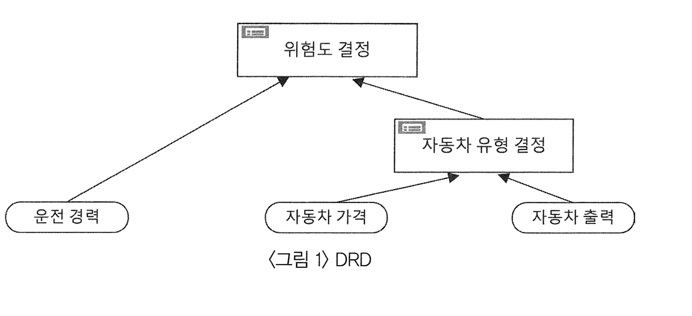
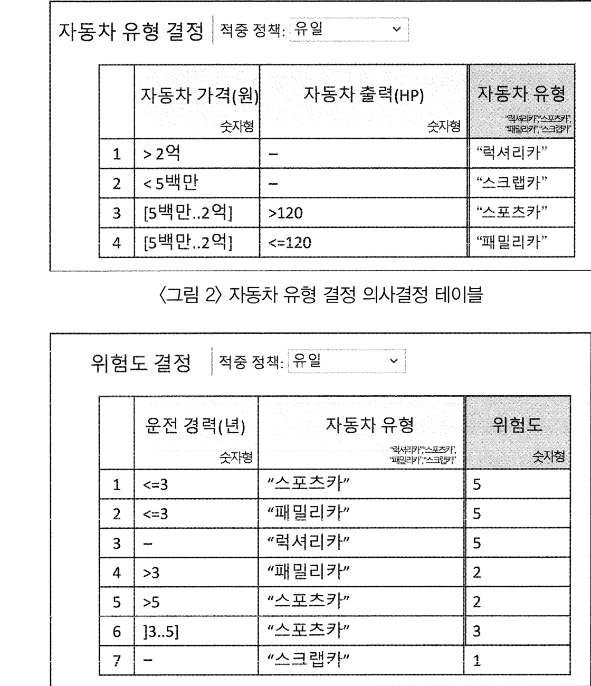

# 출제방향

## 1. 출제의 기본 방향

언어이해 영역은 예비 법조인이 갖추어야 할 언어 능력과 소양에 대한 정확한 평가를 그 목표로 삼는다. 2026학년도 언어이해 영역은 인문학, 사회과학, 자연과학, 기술학, 법학 등 다양한 분야에서 선정한 제시문을 제시한 후, 그 제시문에 담긴 내용에 대한 이해와 비판, 추론, 적용 능력을 평가하는 것을 출제의 기본 방향으로 삼는다.

* 내용 및 표현에서 교육적 가치가 높은 텍스트, 특히 법조인에게 요구되는 수준 높은 교양과 통찰이 담긴 텍스트를 제시문으로 활용한다.
* 정보의 위계와 조직 방식들을 고려하여 텍스트에 담긴 정보를 이해하고 재조직하는 능력을 갖추었는지 평가한다.
* 텍스트에 담긴 정보에서 새로운 정보를 추론하거나 그러한 정보를 비판하고 나아가 새로운 문제 상황에 적용할 수 있는 능력을 갖추었는지 평가한다.

## 2. 출제 범위

언어이해 영역에서는 다양한 학문 분야에서 엄선한 텍스트를 바탕으로 제시문을 구성한 후, 그 제시문에 담긴 고차적·입체적 정보들을 이해하는 능력, 그 정보들을 재구성하고 종합하는 능력, 새로운 정보를 추론하거나 그 정보를 새로운 문제 상황에 적용하여 평가·비판하는 능력 등을 측정한다. 이를 위해 이번 시험에서는 인문학, 사회과학, 자연과학, 기술학, 법학 등 여러 학문 분야의 담론이나 연구 내용을 기본으로 삼되, 각 학문에 대한 배경적 지식을 갖추지 않아도 대학의 교양교육을 성실하게 이수한 수험생이라면 문제를 풀 수 있도록 문항을 설계하였다.

이번 시험의 출제는 다음 사항을 고려하여 진행하였다.

* 표준화된 모델들을 기반으로 문항 세트를 설계함으로써 제시문에 사용된 개념이나 범주들을 이해하고 활용할 수 있는지 평가한다.
* 여러 학문 분야의 최신 이론이나 담론을 중심으로 제시문을 작성하되, 제시문의 정보 위계를 정확하게 파악하고 문제 상황에 적용할 만한 독해력을 갖추었는지 측정하는 문항들을 출제한다.
* 특정 전공, 특히 법학 전공의 배경적 지식이 없어도 제시문에 주어진 정보만으로 문제를 풀 수 있게 제시문과 문항을 구성한다.

## 3. 제시문 및 문항

언어이해 영역의 출제 목표를 달성하려면 완성도 높은 제시문으로 독해력을 측정해야 한다. 논의의 완결성은 물론 표현의 가독성을 함께 갖춘 제시문을 제시하되, 주어진 수험 시간 내에 처리할 만한 정보량을 갖추는 것도 중요하다. 이런 기본 조건들을 고려하면서도 학문적·교양적 가치가 담긴 주제나 논의를 담은 제시문들을 개발하였다.

각 제시문에 따른 문항들은 ‘주제, 구조, 관점 파악’, ‘정보의 확인과 재구성’, ‘정보의 추론과 해석’, ‘정보의 평가와 적용’ 등 여러 독해 능력을 균형 있게 평가하도록 설계하였다. 이와 함께 제시문과 <보기>를 연결하는 문항을 다수 출제하여 추론 및 비판, 적용 능력을 종합적으로 평가하고자 하였다.

이번 시험의 내용 영역은 예년과 같이 ‘인문’, ‘사회’, ‘과학기술’, ‘규범’의 4개 영역이며, 문항은 각 세트당 3문항, 총 10세트 30문항으로 구성하였다. 각 내용 영역별로 제시문에서 다루고 있는 주제는 다음과 같다.

<인문 분야>에서는 문학 관련 주제로 ‘서구적 보편성’과 ‘인간적 보편성’의 문제를 다룬 최인훈의 소설이 제시문으로 주어졌다. 사학 관련 주제로는 조선 시대의 과거 제도인 ‘현량과’의 시행을 둘러싼 찬반논쟁이, 철학 관련 주제로는 믿음의 성격을 둘러싼 ‘인식적 수의주의’와 ‘인식적 불수의주의’의 정당화 논변이 제시문으로 주어졌다.

<사회과학 분야>에서는 정치 관련 주제로, ‘민주주의의 퇴행’을 설명하는 ‘스볼릭 모델’과 ‘루오와 쉐보르스키 모델’에 대해 다룬 제시문이 주어졌다. 경제 관련 주제로는 ‘제도와 경제성장의 인과적 관계’를 밝히려는 2024년 노벨경제학상 수상자 아제모을루 등의 이론을 설명하는 내용이 제시문으로 주어졌다.

<과학기술 분야>에서는 과학 관련 주제로 물질의 특성으로 인한 ‘혼합물의 부피의 증감 현상’을 다룬 제시문이 주어졌다. 기술 주제와 관련해서는 의사결정과정을 모델링한 ‘DMN’에 대해 설명하는 내용이 제시문으로 주어졌다.

<규범 분야>에서는 환경법 주제와 관련하여 인간 중심의 법학 전통을 비판하고 자연의 권리 주체를 인정하는 ‘지구법학’의 사상적 흐름을 설명하는 내용이 제시문으로 주어졌다. 법사학 주제와 관련해서는 대한제국 시기부터 점차 나타나기 시작한 ‘민주공화제’ 사상의 형성 과정을 설명하는 내용이 제시문으로 주어졌다. 윤리학 주제와 관련해서는 행위에는 책임을 물을 수 있지만 무위에는 책임을 물을 수 없음을 주장하는 ‘행위와 무위의 비대칭성 논제’를 둘러싼 논변을 설명하는 내용이 제시문으로 주어졌다.

이번 시험의 제시문들은 다양한 고전과 현대 논의를 바탕으로 인간과 사회에 대한 깊이 있는 성찰을 유도하는 내용으로 구성되어 있다. 이런 제시문들은 법학전문대학원 수학 능력을 평가하는 데 활용이 될 뿐만 아니라 수험생들이 예비 법조인으로서 수준 높은 교양을 쌓는 데 동기를 부여할 것으로 본다.

## 4. 난이도

2026학년도 언어이해 영역 시험에서는 내용과 표현이 난삽한 제시문을 최대한 줄이고, 측정 목표가 분명하도록 문항을 설계하여 수험생의 독해력과 사고력을 제대로 평가하려고 하였다. 제시문의 정보량을 다소 줄이고 가독성은 최대한 높여 비본질적인 측정 요소가 평가에 개입하는 것을 최대한 차단하였다. 이와 함께 제시문의 정보를 다양한 외부 자료에 적용하여 추론·비판·평가하는 문제해결 능력을 측정하는 다수의 문항도 설계하였다.

## 5. 출제 시 유의점

이번 시험의 문항 출제 과정에서 유의점은 다음과 같다.

* 사설 학원을 비롯한 다양한 출처의 문제들을 풀어본 경험, 특히 기술적인 방법으로 문제 풀이에 접근하는 태도만으로는 해결하기 힘든 문항을 설계한다.
* 특정 전공에 따른 유·불리 현상을 최소화하기 위해, 법학을 비롯한 여러 학문 분야에 대한 배경 지식의 유무 자체가 문제 풀이에 큰 영향을 미치지 않도록 문항을 설계한다.
* 지나치게 어려운 제시문과 문항 설계로 수험생의 혼란을 유발하지 않으면서도 적절한 변별력을 갖춘 문항과 답지를 설계한다.

***

# 문항별 해설

## 01

### 문항구분

* 문항유형 : 정보의 확인과 재구성
* 내용영역 : 규범
* 평가 목표 : 이 문항에서는 제시문에서 다루고 있는 지구법학의 등장 배경과 특징, 사례들에 대해 정확하게 이해하고 있는지를 평가하고자 한다.
* 정답 : (4)

### 문항 해설

제시문 첫 번째 단락에서는 자연을 집단 혹은 개인의 소유 대상으로 보아온 법학 전통의 특징과 한계, 그리고 인간중심적 법규범을 문제화하며 지구법학이 도입된 계기를 설명하고 있다. 두 번째 단락에서는 비인간 존재자에게 어디까지 어떠한 권리를 인정할 수 있는지에 관한 논의들을 소개한 후 지구법학의 주된 특징들을 다루고 있다. 본 문항에서는 이 내용을 정확히 이해하고 각 선택지의 진위 여부를 파악하도록 한다.

### 선택지별 해설

(1) 제시문 첫 번째 단락의 “법적 인격만을 권리와 의무의 주체로 보고 인격 아닌 모든 존재자는 행위의 객체인 물건으로 보는 법은 자연의 가치를 인간의 손익과 관련지어 평가할 뿐 존중하진 않았다.”에서 인간중심적 법규범은 인간의 권리만을 인정하고 자연의 권리는 인정하지 않음을 알 수 있다. 또한 두 번째 단락의 “지구법학은 우주의 질서 안에 무언가가 존재한다는 사실 자체에서 그것이 권리를 가진다는 규범적 결론을 끌어낸다.”에서 자연의 권리 근거를 ‘존재함’ 자체로부터 구하고자 한 것은 인간중심적 법규범이 아니라 지구법학임을 알 수 있다.

(2) 제시문 두 번째 단락의 “강은 강의 권리를, 새는 새의 권리를, 인간은 인간의 권리를 가지며, 각 권리의 존재 양태는 저마다 다르다.”에서 지구법학은 모든 개체가 지닌 권리의 존재 양태가 동일하지 않다고 이해한다는 것을 알 수 있다.

(3) 제시문 첫 번째 단락의 “최장 시간에 걸쳐 최대 다수에게 이익을 가져다주는 방식으로 자연자원을 향유하기 위해 보호해야 한다는 보전주의적 관점 역시 근본적으로 인간을 중심에 둔다.”에서 법적 권리 주체에 대한 보전주의적 관점에서의 인식은 법학 전통에 따른 것이며 이에 근본적인 인식 전환이 전제되어 있지 않음을 알 수 있다.

(4) 제시문 두 번째 단락의 “물리적으로 지속되는 실체를 갖거나 일정한 지리적 영역을 점하는 존재자인 무생물의 권리도 인정된다.”에서 지구법학이 무생물의 권리주체성을 인정하며, ‘물리적으로 지속되는 실체를 갖는’ 것과 ‘지리적 영역을 점하는’ 것은 무생물의 특성을 설명하기 위한 나열된 수식어구로 이해할 수 있다. 따라서 “지구권을 인정하는 입장에서는 지리적 영역을 점한다는 사실에서 권리주체성을 도출한다.”는 진술은 제시문과 일치한다.

(5) 제시문 두 번째 단락의 “컬리넌은 다양한 창조물들의 생존과 안녕은 인간이 아니라 지구 행성으로부터 주어지는 것임을 강조하며 권리 주체에 대한 과감한 인식 전환을 촉구한다. 인류는 그간 법에서 억눌러 왔던 감성과 감각을 되살려 지구공동체의 춤에 참여하고, 그 박자에 스스로 몸짓을 맞추어야 한다는 것이다.”에서 컬리넌은 기존 법학이 인간과 비인간 존재의 감응 능력을 중시하지 않았다고 이해했음을 알 수 있다.

## 02

### 문항구분

* 문항유형 : 정보의 추론과 해석
* 내용영역 : 규범
* 평가 목표 : 이 문항은 지구법학의 권리 개념을 수용하여 구체적인 법의 근거로 채택한 사례들에 관한 정보를 정확히 해석하는지 평가하는 문항이다.
* 정답 : (2)

### 문항 해설

지구법학의 권리 개념을 수용하여 구체적인 법의 근거로 채택한 사례들을 정확히 이해한 후 에콰도르의 법제와 뉴질랜드의 법제, 그리고 에콰도르 헌법과 <어머니 지구의 권리에 관한 법>과 <테 아와 투푸아법>의 특성과 차이를 비교하여 각 선택지의 진위 여부를 확인하도록 한다.

### 선택지별 해설

(1) 제시문 세 번째 단락의 “‘우리가 그 일부이자 우리의 생존에 필수적인 어머니 지구’와의 조화를 언급한 에콰도르 헌법”과 “에콰도르는 ‘생명의 순환과 진화 과정을 유지하고 재생을 존중받을 권리’와 ‘자연이 스스로를 원상회복할 권리’를 헌법에 규정한다.”에서 에콰도르는 자연의 권리를 포괄적으로 규정했음을 알 수 있다. 또한 “한편 뉴질랜드는 전체로서의 자연의 권리를 보호하는 방식 대신 특정 생태계나 종의 권리를 개별적으로 보호하는 방식을 택한다.”에서 뉴질랜드는 앞서 본 에콰도르의 경우와 달리 사안별로 자연의 권리를 규정한다는 것을 알 수 있다.

(2) 제시문 세 번째 단락의 “<어머니 지구의 권리에 관한 법>에서 자연의 고유한 권리를 인정하고”와 “황거누이강을 법적 인격체로 규정하고”에서 <어머니 지구의 권리에 관한 법>과 <테 아와 투푸아법>은 둘 다 자연의 독자적인 권리주체성을 인정한다는 것을 알 수 있다. 따라서 “<어머니 지구의 권리에 관한 법>과 달리, <테 아와 투푸아법>은 자연의 독자적인 권리주체성을 인정한다.”는 진술은 ㉡에 대한 적절한 설명이 아니다.

(3) 제시문 세 번째 단락에 의하면 에콰도르 헌법은 “청원권을 행사하여 자연의 권리를 집행”하는 인간의 역할을 규정하고 있고, 볼리비아의 법도 “생태계가 본성 그대로 유지·회복하는 과정을 도울 국민의 의무”를 규정하고 있다. 따라서 에콰도르와 볼리비아 모두 지구공동체의 유지 및 재생을 조력할 인간의 역할에 관해 법에 명시했음을 알 수 있다.

(4) 제시문 세 번째 단락의 “누구든 청원권을 행사하여 자연의 권리를 집행할 수 있음을 명시한다.”에서 에콰도르 헌법상 누구나 자연을 법적으로 대변할 수 있음을 알 수 있다. 또한 “특정 생태계나 종의 권리를 개별적으로 보호하는 방식을 택한다.”와 “그 권리는 법이 정한 후견인이 강의 이름으로 강을 대리하여 집행할 것을 명시한 <테 아와 투푸아법>이 그 예이다.”에서 <테 아와 투푸아법>에 따르면 특정인만이 특정 생태계를 법적으로 대변할 수 있음을 알 수 있다.

(5) 세 번째 단락의 “자연이 스스로를 원상회복할 권리”를 헌법에 규정한다는 내용과 “볼리비아는 <어머니 지구의 권리에 관한 법>에서 자연의 고유한 권리를 인정하고 생태계가 본성 그대로 유지·회복하는 과정”에서 에콰도르 헌법과 <어머니 지구의 권리에 관한 법>은 모두 침해된 자연에서 살아가는 인간의 권리와 별도로 자연도 회복할 권리를 인정한다는 것을 알 수 있다.

## 03

### 문항구분

* 문항유형 : 정보의 평가와 적용
* 내용영역 : 규범
* 평가 목표 : 이 문항은 제시문에 제시된 학자들의 입장을 자연의 권리주체성이 쟁점화된 법적 사안에 적절히 대응하여 적용할 수 있는지 묻는 문항이다.
* 정답 : (3)

### 문항 해설

이 문항은 제시문에 제시된 레건, 테일러, 베리, 컬리넌이 각자 취하는 입장을 자연의 권리주체성을 다룬 세 사안 \[A], \[B], \[C]에 대응하여 각 선택지의 진위 여부를 확인하도록 한다.

두 번째 단락의 “레건은 살아있음을 넘어 스스로가 삶의 주체임을 경험할 수 있는 존재는 상대적으로 더 월등한 존재의 이익을 위해 자신의 이익을 희생당하지 않아야 한다는 논거로써 동물의 권리를 옹호한다.”에서 레건의 입장에서는 동물의 권리주체성을 인정할 것임을 알 수 있다. 또한 테일러는 “모든 생명체는 자신의 선을 가지며 그 고유한 가치의 잠재성이 실현되어야” 한다고 보기 때문에 식물을 포함한 생명체까지를 권리주체성을 인정할 것임을 알 수 있다. 한편 지구법학자인 베리와 컬리넌은 “우주의 질서 안에 무언가가 존재한다는 사실 자체에서 그것이 권리를 가진다는 규범적 결론”을 도출하기 때문에, 무생물의 권리주체성까지도 인정할 것임을 알 수 있다.

사례 \[A]는 무생물의 권리주체성을 부정하였고, 사례 \[B]는 식물의 권리주체성을 인정하였으며, 사례 \[C]는 동물의 권리주체성을 인정하였다.

### 선택지별 해설

(1) 무생물의 권리주체성을 부정한 \[A]에 대해 동물의 권리주체성까지만 인정한 레건은 동의할 것이고, 무생물의 권리주체성까지 인정한 컬리넌은 동의하지 않을 것이다.

(2) 식물의 권리주체성을 인정한 \[B]에 대해 무생물의 권리주체성까지 인정한 베리는 동의하고, 동물의 권리주체성까지만 인정한 레건은 동의하지 않을 것이다.

(3) 동물의 권리주체성을 인정한 \[C]에 대해 무생물의 권리주체성까지 인정한 베리와 식물을 포함하는 생물의 권리주체성까지 인정한 테일러는 둘 다 동의할 것이다. 따라서 “\[C]에 대해 베리는 동의하고 테일러는 동의하지 않겠군.”이라는 진술은 <보기>의 판결에 대한 이해로 적절하지 않다.

(4) 식물을 포함한 생물의 권리주체성을 인정한 테일러는 무생물의 권리주체성을 부정한 \[A]와 식물의 권리주체성을 인정한 \[B] 모두에 대해 동의할 것이다.

(5) 무생물의 권리주체성까지 인정한 컬리넌은 식물의 권리주체성을 인정한 \[B]와 동물의 권리주체성을 인정한 \[C] 모두에 대해 동의할 것이다.

## 04

### 문항구분

* 문항유형 : 정보의 확인과 재구성
* 내용영역 : 과학기술
* 평가 목표 : 이 문항은 오늘날 기업의 운영 의사결정을 모델링하기 위한 도구인 DMN에 대해 제시문에 주어진 정보를 제대로 이해하고 있는지 평가하는 문항이다.
* 정답 : (2)

### 문항 해설

경영 의사결정의 유형, DMN과 BPMN의 관계, DMN 적용 시 장점, DRD와 의사결정 테이블의 작성 방법 등 제시문에 주어진 설명을 확인하여 제시문과 부합하는 선택지를 골라야 한다.

### 선택지별 해설

(1) 제시문 첫 번째 단락의 “전략적 의사결정은 의사결정 규칙이 불명확하고, 다양한 분석이 요구되므로 모델링하여 자동화하기는 매우 어렵다.”에서 전략적 의사결정은 그 규칙이 명확하지 않으며, 또한 확정되어 있지 않다는 것을 알 수 있다.

(2) 제시문 두 번째 단락의 “이 문제는 DMN을 사용하면 그래픽 다이어그램과 테이블 형태로 의사결정을 명시적으로 모델링하여 해결할 수 있다. 이처럼 의사결정 로직을 애플리케이션에서 분리하여 모델링하면, 개발자에게 의존하지 않고 업무 담당자가 자신이 주관하는 업무 규칙을 빠르고 유연하게 변경할 수 있다.”에서 DMN 사용의 장점이 의사결정 로직의 구현과 유지보수가 쉽다는 점이라는 것을 알 수 있다. 따라서 “DMN을 사용하여 의사결정 로직을 애플리케이션과 따로 모델링하면 규칙의 구현, 유지보수가 쉽다.”는 진술은 제시문과 일치한다.

(3) 제시문 네 번째 단락의 “‘<’와 ‘>=’는 값의 크기를 비교하는 연산자이며, ‘\[a..b]’는 경계값을 포함하는 숫자 구간을 나타낸다. 예를 들어 \[2..5]는 2 이상 5 이하, ]2..5\[는 2 초과 5 미만의 구간을 의미한다.”에서 의사결정 테이블의 조건부에서 경계값을 포함하는 구간뿐만 아니라 경계값을 포함하지 않는 구간도 조건식으로 나타낼 수 있다는 것을 알 수 있다.

(4) 제시문 첫 번째 단락의 “BPMN 모델의 비즈니스 규칙 태스크에서 DMN 모델의 의사결정 테이블을 호출하는 방식으로 두 표준이 연동되어 활용된다.”와 세 번째 단락의 의사결정 테이블에 대한 설명을 종합해 보면, BPMN은 의사결정 테이블에 포함되는 것이 아니라 의사결정 로직을 구성하는 세부 규칙이 작성된 의사결정 테이블을 호출한다는 것을 알 수 있다. 따라서 “운영 의사결정을 자동화하려면 의사결정 테이블에 BPMN 비즈니스 규칙 태스크를 포함하여 조건식을 작성해야 한다.”는 진술은 제시문과 일치하지 않는다.

(5) 제시문 세 번째 단락의 “의사결정 로직은 의사결정 테이블로 세부 규칙을 작성하는데, 이를 위해 간단하고 직관적인 문법을 제공하여 업무 담당자와 개발자가 모두 쉽게 활용할 수 있는 FEEL이라는 언어를 사용한다.”에서 업무 담당자는 의사결정의 세부 로직을 FEEL을 사용하여 의사결정 테이블로 작성한다는 것을 알 수 있다. 업무 담당자는 DMN으로 의사결정 로직을 분리하여 모델링하면 업무 규칙을 스스로 관리할 수 있지만, 여전히 애플리케이션은 업무 담당자가 아닌 개발자가 프로그래밍 언어를 이용하여 개발해야 한다.

## 05

### 문항구분

* 문항유형 : 정보의 추론과 해석
* 내용영역 : 과학기술
* 평가 목표 : 이 문항은 DMN 모델링 과정에 대해 주어진 정보를 파악하여 선택지로 제시된 사항이 적절한지 아닌지를 추론해 내는 능력을 평가하는 문항이다.
* 정답 : (1)

### 문항 해설

DMN 모델링 과정에 대한 제시문의 설명을 통해 DRD의 구성 요소와 연결관계, FEEL을 사용한 의사결정 테이블 작성과정을 정확히 이해하고, 이를 바탕으로 참으로 추론되는 선택지를 골라야 한다.

### 선택지별 해설

(1) 제시문 네 번째 단락의 “오버랩을 허용하지 않고 동시에 하나의 규칙만 만족되도록 규칙을 관리하는 방식인 ‘유일’ 정책이 기본값이다. 한 번에 여러 규칙이 적용 가능한 경우에는 처음으로 만족되는 규칙을 적용하는 ‘최초’ 정책과 규칙의 우선순위 값에 따라 적용 규칙을 선정하는 방식인 ‘우선순위’ 정책 등 상황에 따라 적절한 적중 정책을 지정한다.”를 통해 적중 정책의 기본값인 ‘유일’ 정책은 동시에 만족되는 규칙이 서로 오버랩되지 않는 경우에 사용한다는 것을 알 수 있다. 또한 같은 입력값으로 여러 규칙이 동시에 만족될 수 있는 경우 적중 정책을 ‘최초’, ‘우선순위’ 등 다른 정책으로 설정해야 한다는 것을 파악할 수 있다.

(2) 제시문 세 번째 단락의 “규칙의 조건 열에는 의사결정의 입력을 표기하며, 조건 열이 여럿인 경우 각 조건을 AND로 해서 논릿값을 계산한다.”를 통해 어떤 규칙의 조건식이 모두 참인 경우에 그 규칙이 만족된다는 것을 알 수 있다.

(3) 제시문의 <그림 1>에서 입력 데이터인 신청 금액은 수익성을 결정하는 데에도 사용되고, 리스크를 결정하는 데에도 사용된다는 것을 알 수 있다. 따라서 어떤 의사결정 로직의 입력으로 사용되는 데이터가 다른 의사결정 로직의 입력으로 활용될 수 없다는 것은 적절하지 않다.

(4) 제시문의 <그림 1>의 전체적인 구조를 보면, 맨 하위의 입력 데이터는 중간 단계의 의사결정에 직접 연결되어 이들의 의사결정에 사용되고, 또 그 결과가 최상위 의사결정 노드에 전달되어 활용된다는 것을 알 수 있다. 따라서 최상위의 의사결정 노드에 직접 연결되지 않은 최하위의 입력 데이터가 최상위의 의사결정에 영향을 미치지 않는다는 것은 적절하지 않다.

(5) 제시문 세 번째 단락의 “입력 데이터는 의사결정 노드의 입력으로 제공되며, 하위 의사결정 노드의 결과로 생성된 데이터는 상위 노드의 입력으로 전달된다.”를 통해 의사결정 노드의 출력은 자신보다 상위 노드에 제공될 수 있는 것이지, 반대 방향으로 전달되는 것이 아니라는 것을 알 수 있다.

## 06

### 문항구분

* 문항유형 : 정보의 평가와 적용
* 내용영역 : 과학기술
* 평가 목표 : 이 문항은 <보기>의 상황에서 DMN 의사결정 모델의 구성요소인 DRD와 의사결정 테이블을 단계적으로 작성할 수 있는 능력을 평가하는 문항이다.
* 정답 : (4)

### 문항 해설

<보기>에 제시된 의사결정 요구사항과 의사결정 논리를 DMN 모델로 작성할 수 있어야 한다. 우선, 의사결정 요구사항을 반영하여 <그림 1>과 같은 형태의 DRD를 생성하고, 제시문의 FEEL에 대한 설명을 토대로 ‘자동차 유형 결정’ 의사결정 테이블과 최종 단계인 ‘위험도 결정’ 의사결정 테이블을 각각 <그림 2>, <그림 3>과 같은 형태로 작성할 수 있어야 한다.

<그림 3> 위험도 결정 의사결정 테이블

### 선택지별 해설

(1) 단계 1에서 작성한 <그림 1>의 DRD에 포함된 의사결정 노드인 자동차 유형 결정과 위험도 결정은, 각각 단계 2에서 <그림 2>와 <그림 3>에 제시된 것과 같이 구체적인 규칙으로 구성된 의사결정 테이블로 작성된다. 따라서 단계 1에서 작성한 DRD에 포함된 2개의 의사결정 노드가 단계 2와 단계 3을 통해 구체화된다는 것은 적절하다.

(2) <그림 2>와 <그림 3>에 제시된 것과 같이 각 의사결정 테이블은 입력 열이 2개, 결과 열이 1개이다. 따라서 단계 2와 단계 3에서 작성하는 각 의사결정 테이블은 입력으로 2개의 열을, 결과로 1개의 열을 포함한다는 것은 적절하다.

(3) 단계 3의 Ⓒ에서 스포츠카의 위험도는 <그림 3>에서 보는 것처럼 운전 경력에 따라 두 개의 규칙으로 의사결정 테이블에 작성된다. 따라서 단계 2의 결과가 스포츠카로 결정되는 경우 단계 3의 Ⓒ가 요구하는 규칙을 작성하려면, 의사결정 테이블에 2개의 행이 요구된다는 것은 적절하다.

(4) 단계 2의 Ⓒ가 요구하는 자동차 출력 조건식은 120 HP 초과인 경우 ‘>120’으로, 120 HP 이하인 경우 ‘<=120’으로 표현된다. 또한, 단계 3의 Ⓑ가 요구하는 운전 경력 조건식은 ‘>3’으로 표현된다. 모든 조건식에서 숫자의 크기 비교 연산자가 사용되며, 숫자 구간은 사용되지 않는다. 따라서 단계 2의 Ⓒ가 요구하는 자동차 출력 조건식과 단계 3의 Ⓑ가 요구하는 운전 경력 조건식에서 모두 숫자 구간이 사용된다는 것은 적절하지 않다.

(5) 단계 3에서 Ⓓ를 고려하여 Ⓐ가 요구하는 규칙을 작성하려면, <그림 3>의 위험도 결정 의사결정 테이블의 1번이나 2번과 같은 형태의 규칙이 필요하다. 즉, 운전 경력 조건식과 자동차 유형 조건식이 모두 포함된 조건식이 요구된다. Ⓓ의 내용인 ‘자동차 유형이 스크랩카인 경우 운전 경력과 무관하게 위험도가 1’이라는 것을 고려하여, ‘3년 이하의 운전 경력을 위험도 5’로 하려면, 운전 경력이 3년 이하이면서 자동차 유형이 스크랩카가 아닌 경우에 위험도를 5로 정하는 규칙을 작성해야 한다. Ⓐ에서 럭셔리카면 위험도를 5로 한다고 했으므로, 운전 경력이 3년 이하이면서 자동차 유형이 패밀리카인 경우의 위험도를 5로 하는 규칙(1번 규칙)과 운전 경력이 3년 이하이면서 자동차 유형이 스포츠카인 경우의 위험도를 5로 하는 규칙(2번 규칙)을 추가하면 된다.

## 07

### 문항구분

* 문항유형 : 정보의 확인과 재구성
* 내용영역 : 사회
* 평가 목표 : 이 문항은 제시문의 주제인 민주주의 퇴행의 구조를 정확하게 이해하고 있는지 확인하는 문항이다.
* 정답 : (2)

### 문항 해설

민주주의 퇴행을 유권자가 용인하는 이유와 관련한 두 가지 설명을 중심으로 각 선택지의 진위 여부를 확인하도록 한다.

### 선택지별 해설

(1) 제시문 두 번째 단락의 “유권자는 민주주의 가치에 대해서도 내재적으로 선호한다고 가정된다.”에서 스볼릭 모델의 유권자들이 민주주의 자체에 대해 내재적 가치를 부여한다는 것을 알 수 있다. 네 번째 단락의 “이처럼 시민들이 민주주의 자체에 내재적인 가치를 부여하지 않는 경우라도, 더 매력적인 정치인들에게 통치받고 싶어 할 것이므로 시민들은 누구에게 통치받을지를 자신들이 결정할 수 있는 능력을 중시한다.”에서 루오와 쉐보르스키 모델의 유권자들은 민주주의 자체에 대하여 내재적 가치를 부여하지 않는다는 것을 알 수 있다.

(2) 제시문 세 번째 단락은 스볼릭 모델에서 유권자(정책이념 대 민주주의 가치)와 집권자(득표 증가 대 감소)가 직면한 트레이드오프 상황에 관하여 설명한다. 제시문 네 번째 단락과 다섯 번째 단락은 각각 루오와 쉐보르스키 모델에서 유권자의 트레이드오프(후보자의 매력 대 미래 민주주의 능력) 상황과 집권자의 트레이드오프 상황(재집권 가능성 대 잠재적 도전자의 매력)을 설명한다.

(3) 제시문 두 번째 단락의 “유권자는 후보자의 정책이념과 자신의 정책이념 사이의 거리와 반비례하는 효용의 크기에 따라 지지 후보를 선택”한다는 것과 세 번째 단락에서 제시하는 사례를 통해 중도 성향의 유권자도 자신의 정책이념과 민주주의 가치를 투표선택에 포함시킨다는 것을 알 수 있다.

(4) 제시문 여섯 번째 단락의 “집권자의 매력이 높아서 시민들이 집권자에 매우 만족하고 도전자가 더 매력적일 가능성이 작을 때, 집권자는 조작에 거리낌을 갖지 않는데 이를 ‘지지 속의 퇴행’이라 한다.”에서 ‘지지 속의 퇴행’은 집권 정부의 매력이 매우 높을 때 일어난다는 것을 알 수 있다.

(5) 제시문 다섯 번째 단락의 “프리미엄이 0인 상태에서 시작하여 지도자와 유권자 사이에 게임이 반복되는”을 통해 ‘집권자 프리미엄’은 게임을 반복하게 되는 결과 0에 수렴하는 것이 아니라 0에서 시작하는 반복게임이라는 것을 알 수 있다.

## 08

### 문항구분

* 문항유형 : 정보의 추론과 해석
* 내용영역 : 사회
* 평가 목표 : 이 문항은 민주주의 퇴행 관련 두 가지 모델의 정보를 추론하고 해석해 내는 능력을 평가하는 문항이다.
* 정답 : (3)

### 문항 해설

㉠의 스볼릭 모델과 ㉡의 루오와 쉐보르스키 모델에서의 유권자와 집권자의 선택, 트레이드오프, 조작의 정도, 퇴행의 이유 등의 정보를 해석하고 추론하여 각 선택지의 진위 여부를 판단하여야 한다.

### 선택지별 해설

(1) 제시문 네 번째 단락의 “선거에 당면하여 유권자들은 현재 선택되는 후보자의 매력, 즉 선거로 들어설 정부의 질로부터 얻는 효용과 미래의 민주주의 역량, 즉 시민들이 미래에 더 나은 도전자가 등장할 때 언제든지 선거로 집권당을 교체할 수 있는 능력으로부터 얻는 효용 사이의 트레이드오프에 직면한다.”를 통해 ㉡ 모델은 유권자가 잠재적 도전자의 집권 가능성을 고려 대상에 포함한다는 것을 알 수 있다.

(2) ㉠에서 후보자들의 이념성향이 비슷할 경우 유권자는 민주주의 가치만을 따질 것이기 때문에, 집권자가 조작 수준을 높일 경우 감표요인이 될 것이므로 조작 수준을 높이기 힘들다. 이는 민주주의 퇴행이 아니다. 제시문 다섯 번째 단락의 “잠재적 도전자가 가질 매력의 기댓값에 비해 집권자의 매력이 매우 높거나 매우 낮은 경우에 민주주의가 위협받게 된다.”에서 ㉡은 집권자와 도전자의 매력도 차이가 클 때 민주주의 퇴행이 심해질 수 있다고 본다는 것을 알 수 있다.

(3) 제시문 두 번째 단락의 “후보자의 정책이념과 자신의 정책이념 사이의 거리와 반비례하는 효용의 크기에 따라 지지 후보를 선택하는데, 후보자 가운데 집권자를 판단할 때는 그가 행한 조작의 정도에 비례하여 생기는 효용의 감소를 계산에 넣는다.”와 세 번째 단락의 사례를 통해 ㉠에서 유권자는 정책이념과 민주주의 가치 사이의 트레이드오프를 하게 된다는 것을 알 수 있다. ㉡의 유권자는 제시문 네 번째 단락의 “선거에 당면하여 유권자들은 현재 선택되는 후보자의 매력, 즉 선거로 들어설 정부의 질로부터 얻는 효용과 미래의 민주주의 역량, 즉 시민들이 미래에 더 나은 도전자가 등장할 때 언제든지 선거로 집권당을 교체할 수 있는 능력으로부터 얻는 효용 사이의 트레이드오프에 직면한다.”와 다섯 번째 단락의 사례를 통해 새 정부의 매력과 미래 민주주의 역량 사이의 트레이드오프를 한다는 것을 알 수 있다.

(4) 집권자가 조작의 정도를 결정할 때, ㉠은 제시문 세 번째 단락의 “집권자는 득실을 비교하여 선거에서 가장 많이 득표할 수준에서 조작의 정도를 결정하게 된다.”를 통해 조작에 따라 기대되는 득표와 감표의 차이를 따지는 것을 알 수 있다. 반면 ㉡의 경우 제시문에서 집권자가 기존의 프리미엄과 앞으로 형성될 프리미엄의 차이를 고려한다는 언급이 없으며 맥락에도 맞지 않는다.

(5) ㉠의 경우 제시문 세 번째 단락의 “극단적인 우파 유권자는 좌파 도전자의 집권이라는 최악의 상황을 피하려고 민주주의 훼손을 감수하고라도 집권자에게 투표할 가능성이 훨씬 크다.”에서 후보자와의 이념적 친밀도 때문에 민주주의 퇴행이 나올 수 있다는 점을 알 수 있다. ㉡의 경우 시민이 조작을 용인하는 것은 도전자가 아닌 집권자의 매력이 높을 때(지지 속의 퇴행)이다.

## 09

### 문항구분

* 문항유형 : 정보의 평가와 적용
* 내용영역 : 사회
* 평가 목표 : 이 문항은 제시문에서 스볼릭 모델에 따라 정책이념과 민주주의 가치에 대한 트레이드오프를 정확하게 이해하고 보기의 가상 유권자와 가상 정치인 사례에 적절하게 평가하고 적용할 수 있는지 평가하는 문항이다.
* 정답 : (4)

### 문항 해설

<보기>는 다가오는 선거에 대하여 후보자들의 정책이념과 민주적 절차에 대한 태도를 설명한다. <그림 1>은 정책이념과 민주주의 가치를 두 축으로 2차원상에 후보자와 유권자를 위치시켜 이들 간의 거리와 지지 여부를 판단한다. <그림 2>는 시기에 따른 이념성향 분포 변화를 통해 양극화된 정치상황을 묘사한다.

### 선택지별 해설

(1) <그림 1>에서 극좌 성향의 유권자 V3는 우파 후보인 D와 정책이념의 차이가 크기 때문에 지지할 확률이 낮은 반면, 중도 좌파 성향의 유권자 V2의 입장에서는 집권당의 좌파 성향 L 후보의 민주주의 훼손에 따른 효용 감소가 R 후보와의 이념성향 관련 효용의 감소보다 커지므로 그 차이가 상쇄된다. 따라서 V2가 V3에 비해 L 후보를 지지할 가능성이 더 크다.

(2) <그림 1>의 우파 성향 유권자 V4는 민주주의 가치 차원뿐만 아니라 정책이념 차원에서도 L 후보를 지지할 확률은 매우 낮다. 오히려 민주주의 신념도와 이념 성향이 상대적으로 가까운 D 후보를 지지할 것이다.

(3) <그림 2>에서 2026년은 2015년에 비하여 중도층이 줄고 극단적 이념층이 늘어 양극화가 심화된 상황이다. 이 경우 제시문 세 번째 단락의 “득표 감소는 주로 중도 혹은 중도우파 유권자 집단에서 발생한다.”에 따라 민주주의 훼손으로 득표가 감소할 집권자의 손실은 2026년이 2015년보다 작을 것이다.

(4) 제시문 세 번째 단락의 사례 설명과 <그림 1>에서 알 수 있듯이, 민주주의 훼손 정도가 높은 L 후보가 2026년 선거에서 승리했다는 것은 ‘민주주의 훼손 정도를 감내하더라도 정책 관련 효용의 증가가 크다고 여긴 유권자’가 감소한 것이 아니라 증가했기 때문이다.

(5) <그림 1>의 V1에 해당하는 유권자는 중도층이며, <그림 2>에서 중도층 비율이 감소한 것을 알 수 있다. 중도층의 감소, 즉 양극화는 집권자의 민주주의 훼손으로 인한 득표 감소가 줄어드는 상황이므로, 집권당 후보자인 L 후보의 조작을 부추기는 환경이 될 것이다.

## 10

### 문항구분

* 문항유형 : 정보의 확인과 재구성
* 내용영역 : 인문
* 평가 목표 : 이 문항에서는 조선의 과거제도와 이를 보완한다며 한때 시행되었던 현량과에 대한 주요 정보를 제시문에서 잘 파악하여 이해하고 있는지를 평가하고자 한다.
* 정답 : (1)

### 문항 해설

기존의 과거제도와 천거제로 시행되었던 현량과에 대한 제시문의 설명을 뚜렷하게 이해하고 각 선택지의 진위를 판단해야 한다.

### 선택지별 해설

(1) 제시문 첫 번째 단락에서 “유학적 소양을 선발 기준으로 하는 과거는 성리학을 표방한 국가에 매우 적합한 제도”와 “또 다른 소양이라 할 품행과 덕성을 키우지 못한다고도”를 통해 성리학적 소양에는 학문적 능력과 덕성 있는 품행이 들어가는 것을 알 수 있다. 두 번째 단락에서 조광조의 사림파가 “기존의 과거가 글재주만 시험할 뿐 관료로서의 재능이나 인품, 행실 등은 보지 못한다고 하면서, 진정한 교화를 실현하기 위한 보완으로서” 현량과의 도입을 제안하였다는 데서, 과거제의 목적을 제대로 실현하기 위해 천거제가 필요하다고 주장한 것이라 이해할 수 있다.

(2) 제시문 네 번째 단락에서 현량과 시행의 결과로 “28명의 문과 합격자가 나왔다. 다수가 서울 지역 거주자였다.”라고 설명하고 있으므로, 초야에 묻힌 지방 선비들이 대거 관직에 진출하게 되었다는 것을 현량과의 결과로 보는 것은 적절하지 않다.

(3) 제시문 두 번째 단락의 “과거의 최종 합격은 벼슬할 자격만 주어지는 것”이라 하였으며, 이어지는 설명에서 ‘최종 합격’이란 전시까지 마치는 것이며, ‘벼슬할 자격’은 품계를 받는 것에 대응되는 것임을 알 수 있다. 반면, 세 번째 단락의 “원칙적으로 생원이나 진사라야 문과에 응시할 수 있다.”를 통해 생원·진사시의 합격은 문과 초시에 응시할 자격밖에 주어지지 않는 것임을 대비하여 설명하고 있다. 따라서 관직을 받을 자격이 생원·진사시의 합격의 결과라고 설명하는 것은 적절하지 않다.

(4) 제시문 세 번째 단락의 “경전의 암기와 해석뿐 아니라 작문과 논술의 능력까지 평가한다는 점”과 “전시는 품계를 내리기 위해 등수를 정하는 논술 필기고사로서 임금이 주관한다.”를 통해 과거가 논리적으로 서술하는 시험이 아니라고 이해하는 것은 적절하지 않다.

(5) 제시문 두 번째 단락의 “노비가 아니라면 백성은 누구든지 응시할 수 있는, 형식적으로는 평등하고 공정한 시험이었다.”를 통해 노비는 과거를 볼 수 없었다는 것을 알 수 있다. 따라서 조선에 사는 이라면 누구나 과거에 응시할 수 있었다고 설명하는 것은 적절하지 않다.

## 11

### 문항구분

* 문항유형 : 정보의 추론과 해석
* 내용영역 : 인문
* 평가 목표 : 이 문항에서는 과거제도에 대한 이해를 바탕으로 제시문에 서술된 정보로써 전체 맥락을 추론할 수 있는지를 평가하고자 한다.
* 정답 : (3)

### 문항 해설

제시문에 나온 정보를 이용하여 과거제도의 운영과 현량과의 시행에 관해 폭넓은 파악을 할 수 있는지 확인하는 문항이다.

### 선택지별 해설

(1) 제시문 세 번째 단락의 “등급 때문에 다시 과거를 보기도 했다.”와 네 번째 단락에서 현량과의 합격자 중에 “12명의 관직 보유자가 포함”되었다는 점을 통해, 관료가 다시 과거에 응시하여 더 높은 품계를 받을 수 있었다는 추론은 적절하다.

(2) 제시문 두 번째 단락의 “현실적으로 과거 응시를 위한 학업에 경제적 뒷받침은 필수적이었다.”와 “급제한 뒤에 실직을 받아 관료로 성장하려면 어느 정도의 후원과 인맥이 필요했다.”를 통해 양반 지배층이 출세 기회를 높이기 위하여 현실적으로 필요한 정보, 인맥, 재력을 활용할 수 있다고 본 것은 적절한 추론이다.

(3) 제시문 세 번째 단락의 “현량과는 덕망과 행실로 각처에서 천거된 이들로 한 번의 논술 시험을 치러 합격자를 선발하는 방식인 것이다. 게다가 급제자들에게는 일반 과거보다도 높은 품계를 주려 하였다.”를 통해 현량과에 대하여 추천된 이들을 대상으로 한 번의 시험으로 선발하여 품계를 정해 주었다는 것을 알 수 있다. 이에 반해 같은 단락에서 과거의 문과는 초시와 복시를 거쳐 품계를 받을 33인이 뽑히고 그들의 품계를 정하기 위해 전시를 치른다고 한 데서 보면, 품계를 받을 총원을 정했다는 것은 전시보다는 복시에 상응하는 것이라 추론할 수 있다.

(4) 제시문 네 번째 단락의 “장원은 조광조와 친분이 두터운 김식이었고, 사림파의 후원자로 알려진 안당은 세 아들이 모두 합격하였다. 자파 세력 키우기라는 정적들의 비난은 피할 수 없었다.”와 “지나친 당파 형성”이라는 중종의 의심이 있었다는 점에서도, 현량과의 도입은 사림 세력을 일거에 등용하려 한 의도였다는 비판이 있었음을 알 수 있다.

(5) 제시문 네 번째 단락의 “천거제에 대하여 훈구 세력의 반발은 컸다. 시험 없이 쉽게 관리가 되는 것은 공정성의 원칙을 무너뜨리는 것이고, 추천으로 선발하는 것이 오히려 부당한 특혜로 작용한다는 비판을 제기하였다.”에서 훈구 세력은 현량과 도입을 편파성을 이유로 반대하였다는 점을 알 수 있다.

## 12

### 문항구분

* 문항유형 : 정보의 평가와 적용
* 내용영역 : 인문
* 평가 목표 : 이 문항에서는 실제 역사에서 관련 인물들이 한 주장들을 소개하면서, 그 의미에 관하여 제시문에서 서술하고 있는 내용을 기반으로 하여 연결된 맥락으로 이해할 수 있는지 평가하고자 한다.
* 정답 : (1)

### 문항 해설

제시문의 이해를 바탕으로 현량과에 관한 정보를 <보기>에 제시된 여러 입장들에 대하여 적용하고 평가하는 문항이다.

### 선택지별 해설

(1) 제시문 첫 번째 단락의 “많은 현능한 이들이 추천되어 어진 교화를 도울 수 있도록 할 방법을 의논”하라는 중종의 주문을 통해 <보기>의 “명과 실이 어긋날 염려”의 지적은 “천거로 말미암을 폐단에 대한 인식과 경계”라 평가하는 것은 적절하다.

(2) <보기>의 정광필과 남곤은 천거제의 폐단을 언급하며 현량과의 도입에 반대하고 있으나, 김정은 천거제의 폐단을 “사소한 폐단”이라 하여 현량과 도입에 찬성하는 입장이라 할 수 있다.

(3) 제시문 두 번째 단락의 “조광조가 주도하는 사림 세력은 기존의 과거가 글재주만 시험할 뿐 관료로서의 재능이나 인품, 행실 등은 보지 못한다고 하면서, 진정한 교화를 실현하기 위한 보완으로서 과거제도에 천거제인 현량과를 도입하기를 청하였다.”와 <보기>의 “재주 있는 이도 여전히 뽑힐 수 있다”고 말하는 조광조의 태도를 통해, 조광조는 기존 과거제도를 유지하는 전제에서 현량과를 도입하고자 하는 것을 알 수 있으므로, 조광조의 주장에 대해 관리 선발의 시험제도를 천거제로 대체한다고 이해하는 것은 적절하지 않다.

(4) <보기>의 남곤이 중국에서 현량과가 실패했다는 역사적 경험을 언급하면서, 중종이 명과 실이 어긋난 천거에 대한 우려를 지적한 데 대하여도 그럴 경우에 천거인을 벌주기는 어려운 일이라고 대답하는 데서 남곤은 현량과 시행에 반대하는 입장이라는 것을 알 수 있다.

(5) 제시문 두 번째 단락에서 현량과 도입을 주장하는 사림파가 “진정한 교화”의 실현을 내세우고 있다는 것과 <보기>에서 이를 언급하면서 사소한 폐단에 얽매이지 말고 앞으로 나아가자는 데서, 김정은 변화, 곧 현량과의 도입을 주장하는 사림파의 입장에서 주장한다는 것을 추론할 수 있고, 그렇다면 그가 지적하는 폐단은 현량과 도입에 대한 비판으로 드는 폐단이라는 것을 알 수 있으므로, 사림 세력이 기존 과거제에 관하여 지적하는 폐단으로 <보기>의 “사소한 폐단”을 이해하는 것은 적절하지 않다.

## 13

### 문항구분

* 문항유형 : 정보의 확인과 재구성
* 내용영역 : 인문
* 평가 목표 : 이 문항은 제시문의 내용을 정확하게 이해하고 있는지 평가하는 문항이다.
* 정답 : (2)

### 문항 해설

전체 제시문에 나온 정보들을 정확히 이해하여 각 선택지의 진위 여부를 확인하도록 한다.

### 선택지별 해설

(1) 제시문 첫 번째 단락의 “어떤 믿음은 인간이 수의적으로 즉, 자기 뜻대로 즉각적으로 믿을 수 있다는”과 세 번째 단락의 “우리가 장기적인 행위나 습관 형성을 통해 자신의 믿음에 간접적 영향을 줄 수는 있지만, 올스턴에 따르면 이는 수의적으로 믿음을 변경한 것이 아니다.”에서 수의적으로 어떤 믿음을 가진다는 것은 “즉각적”이라는 것을 알 수 있다.

(2) 제시문 첫 번째 단락의 “그렇게 상상하거나 또는 그렇게 믿는 듯이 행동하는 것은 원하기만 하면 할 수 있다. 하지만 무엇을 믿는다는 것은 그것이 참이라고 믿는 것인데, 원한다고 해서 ‘해는 서쪽에서 뜬다.’라는 명제가 참이라고 실제로 믿을 수 있을까?”에서 해가 서쪽에서 뜨는 상황을 상상하는 것은 원한다면 얼마든지 할 수 있지만 실제로 해가 서쪽에서 뜬다고 믿는 것은 원한다고 즉각적으로 하기는 어렵다는 것을 알 수 있다.

(3) 제시문 두 번째 단락의 “수의주의가 옳으냐는 질문은 우리가 자신의 믿음에 대해 의무나 책임을 질 수 있느냐는 질문과 연관된다. 사람들은 종종 판단이나 믿음을 평가하고 심지어 비난하기도 한다.”와 “불수의주의가 옳다면 우리는 각자가 가진 믿음에 대해 의무나 책임을 질 수 없다.”에서 불수의주의는 믿음에 대한 직접적인 의무나 책임을 부인하고 수의주의는 최소한 어떤 믿음에 대해서는 행위의 경우와 비슷한 의무, 책임이 있다고 주장하여 둘 간에 학문적 다툼이 있음을 알 수 있다.

(4) 제시문 네 번째 단락의 “믿음의 개념 분석에 기반한 불수의주의도 있다.”와 다섯 번째 단락의 “히로니미 역시 ‘수의성’과 ‘믿음’의 정의에 기반해 수의주의에 반대한다.”에서, 윌리엄스와 히로니미는 심리적 근거가 아니라 개념 정의에 기반한 선험적인 논변으로 수의주의를 반박한다는 것을 알 수 있다.

(5) 제시문 두 번째 단락의 “그런데 ‘당위는 능력을 함축한다.’라는 칸트의 원칙에 따르면, 우리는 어떤 행위를 할지 안 할지 선택할 능력을 지닌 경우에만 그 행위에 대한 의무나 책임을 질 수 있다.”에서 칸트의 당위-능력 원칙에 따를 경우 하늘을 나는 것은 인간이 할 수 있는 것이 아니기 때문에 날지 못한다고 비난할 수 없다는 것을 알 수 있다.

## 14

### 문항구분

* 문항유형 : 정보의 추론과 해석
* 내용영역 : 인문
* 평가 목표 : 이 문항은 제시문에서 설명하는 수의주의와 불수의주의에 대해 정확히 이해하고 있는지를 확인하는 문항이다.
* 정답 : (3)

### 문항 해설

㉠ 수의주의와 ㉡ 불수의주의의 주장의 내용과 서로의 관계, 당위-능력 원칙과의 관련성, 공통의 전제 등을 정확히 이해했는지를 확인한다.

### 선택지별 해설

(1) 제시문 두 번째 단락의 “이 원칙을 믿음에 적용하면, 우리는 오직 자신의 믿음을 뜻대로 선택할 능력이 있는 경우에만 믿음에 대한 의무나 책임을 질 수 있다.”에서 알 수 있듯이, 수의주의는 칸트의 ‘당위-능력 원칙’을 행위에 적용하는 것처럼 최소한 어떤 믿음에는 적용할 수 있다는 입장이다.

(2) 제시문 세 번째 단락의 “그는 ‘해가 서쪽에서 뜬다.’처럼 거짓임이 분명한 명제의 경우에는 누구도 수의적으로 믿을 수 없다는 것이 명백한 경험적 사실이라고 주장한다.”와 네 번째 단락과 다섯 번째 단락의 설명을 통해, 불수의주의는 명백하게 거짓인 명제에 대하여 수의적으로 믿음을 형성할 수 없다는 입장임을 알 수 있다.

(3) 제시문 첫 번째 단락의 “최소한 어떤 믿음은 인간이 수의적으로 즉, 자기 뜻대로 즉각적으로 믿을 수 있다는 입장을 인식적 수의주의라 하고 그런 믿음은 없다는 입장을 인식적 불수의주의라 한다.”를 통해 수의주의는 최소한 어떤 믿음은 수의적이라고 주장하는 입장임을 알 수 있으므로, 수의주의가 모든 믿음이 수의적이라고 주장하는 것으로 이해하는 것은 적절하지 않다.

(4) 제시문 첫 번째 단락의 “하지만 무엇을 믿는다는 것은 그것이 참이라고 믿는 것인데”를 통해 인식론 논의 일반에서 믿음이란 그 내용이 참이라고 믿는 것이라는 것이 전제된다는 것을 알 수 있다.

(5) 제시문 두 번째 단락의 “따라서 불수의주의가 옳다면 우리는 각자가 가진 믿음에 대해 의무나 책임을 질 수 없다.”에서 수의주의는 불수의주의에 비해 믿음에 의무나 책임을 부과하는 우리의 언어 관행을 더 수월하게 설명한다는 것을 알 수 있다.

## 15

### 문항구분

* 문항유형 : 정보의 평가와 적용
* 내용영역 : 인문
* 평가 목표 : 이 문항에서는 제시문에서 이해한 바를 <보기>에 정확히 적용할 수 있는지를 확인하고자 한다.
* 정답 : (3)

### 문항 해설

<보기>는 갑이 수의적인 믿음을 가진 경우라고 생각할 수 있는 예인데, 이 예를 여러 불수의주의 철학자들의 관점을 사용해 어떻게 판단할 수 있는지를 정확히 서술할 것을 요구하는 문항이다.

### 선택지별 해설

(1) 제시문 세 번째 단락의 “그 상황에서 p를 정말로 믿게 되었다면, 이는 그 순간 p가 조금이나마 더 그럴듯해 보였기 때문에 믿음이 생겨난 것이다.”를 통해, 올스턴은 한 명제를 지지하는 근거와 반대하는 근거가 비등한 경우에 진정한 믿음이 생겼다면 근거 간 증거력의 차이가 있었기 때문이라고 판단할 것이라 볼 수 있다.

(2) 제시문 네 번째 단락의 “명제 p를 수의적으로 믿는다는 것은 p가 참인지와 무관하게 p를 믿을 능력을 필요로 한다.”와 “우리 자신이 명제의 참·거짓 여부와 무관하게 명제를 믿을 능력이 있다고 우리가 알게 되는 경우는 있을 수 없고 결국 어떤 믿음을 수의적으로 가진다는 것은 불가능하다.”를 통해, 윌리엄스는 ㉠의 참·거짓 여부와 무관하게 믿을 능력은 있을 수 없다고 주장한다는 것을 알 수 있다.

(3) 제시문 다섯 번째 단락의 “p라고 믿는다는 것은 ‘p가 참인가?’라는 의문을 해결함으로써 갖게 되는 태도라는 의미에서 참을 목표로 하는 태도이다.”를 통해 히로니미의 주장에서 “참을 목표로” 한다는 것은 “참으로 만들려고” 한다는 의미가 아님을 알 수 있다.

(4) 제시문 다섯 번째 단락의 “후자는 ‘p라는 믿음을 갖는 것이 좋은가?’라는 질문에 대답하는 이유이고”와 “비가 온다고 믿으면 내 기분이 좋아질 것이라는 사실은 후자이다.”에서 히로니미는 믿음을 지지할 수 있는 이유 중 태도 관련 이유를 설명한다. <보기>에서 갑의 “자신이 합격할 것이라는 믿음”은 그 믿음을 가지면 합격할 것이라는 점에서 ‘그 믿음을 갖는 것이 좋은가?’라는 질문에 대답하는 이유, 즉 태도 관련 이유이다.

(5) 윌리엄스와 히로니미는 각각 제시문 네 번째 단락과 다섯 번째 단락에서 “개념 분석”과 “정의”에 기반하여 수의주의에 반대한다. 개념 정의에 기반한 선험적인 논변으로 이 논변이 성공적이라면 수의주의는 개념적으로 불가능하다(둥근 사각형은 개념적으로 불가능하다). 따라서 윌리엄스와 히로니미는 초인적인 존재라도 믿음을 수의적으로 형성하는 것이 불가능하다고 할 것이다. 제시문 다섯 번째 단락의 “우리에게 이런 능력은 있을 수 없으므로”는 이러한 사태가 단지 사실인 우연적 사태가 아니라 불가능성을 뜻함을 명시하고 있다.

## 16

### 문항구분

* 문항유형 : 정보의 확인과 재구성
* 내용영역 : 사회
* 평가 목표 : 이 문항은 제시문의 세부 정보를 정확하게 이해하고 있는지 평가하는 문항이다.
* 정답 : (4)

### 문항 해설

제시문 두 번째 단락에서 설명변수와 종속변수, 도구변수, 인과관계, 상관관계 등의 기초 개념과 이 개념들 사이의 관계를 이해하고, 세 번째 단락의 아제모을루 등의 연구에 사용된 각 변수의 의미에 대해 잘 이해하여야 한다.

### 선택지별 해설

(1) 제시문 세 번째 단락의 “어떤 지역은 착취적 제도의 발달로 인해 정체하거나 더디게 성장한 반면 다른 지역은 포용적 제도의 발달로 인해 빠르게 성장했다는 주장”에서 포용적 제도가 착취적 제도보다 발전 수준이 더 높은 제도라는 것을 알 수 있다.

(2) 제시문 세 번째 단락의 “식민지가 되기 전에 부유했던 지역은 오늘날 가난하고, 가난했던 지역은 오늘날 부유한 경향이 있음을 확인한 이들은, 이러한 번영의 역전”에서 번영의 역전은 과거에 1인당 소득 수준이 높았던 지역의 오늘날 1인당 소득 수준이 낮은 반면, 1인당 소득 수준이 낮았던 지역의 오늘날 1인당 소득 수준이 높은 현상을 가리킨다는 것을 알 수 있다.

(3) 제시문 세 번째 단락의 “이러한 번영의 역전이 제도적 역전의 결과라고 보았다. 유럽인들이 상대적으로 발전된 문명을 만난 지역에서는 광물과 농작물을 빼앗아 가기 위해 착취적 제도를 세웠고, 발전되지 못하고 인구가 희박한 지역에서는 대규모 정착을 선택하여 유럽인 이민을 불러들이기 위해 포용적 제도를 발전시켰던 것이 번영의 역전을 낳았다는 것이다.”에서 부유했던 지역에 비해 가난했던 지역에서 제도가 더 발전한 것이 제도의 역전을 의미한다는 것을 알 수 있다.

(4) “두 변수의 표본으로부터 추정한 기울기가 0이 아니라면 둘 사이에 인과관계가 있다고 추론하는 것이 타당하다.”라는 진술은, 제시문 두 번째 단락의 “흔히 사용하는 통계적 방법”에 해당한다. 제시문은 이 방법이 타당하지 않은 경우와 그 경우에 어떻게 하는 것이 좋은 방법인지에 대해 설명하고 있다. 따라서 이 진술은 윗글의 내용과 일치하지 않는다.

(5) 제시문 첫 번째 단락의 “제도의 발전과 경제의 번영 사이에 높은 상관관계가 있음을 확인하는 것만으로는 제도가 성장의 원인이라는 주장을 지지하기 어렵다.”에서 상관관계가 인과관계를 의미하지 않는다는 것을 알 수 있다. 두 번째 단락의 “x가 y에 영향을 주지만 y도 x에 영향을 미치거나, x와 y 모두와 상관관계가 있는데 미처 고려하지 못한 제3의 요인이 존재하거나, 혹은 x의 관측값이 정확하게 측정되지 않은 값일 경우”에서 인과관계로 보기 어려운 경우의 예를 알 수 있다. 따라서 x와 y 모두와 상관관계가 있는 제3의 요인이 존재하는 경우의 x와 y 사이의 상관관계가 인과관계를 의미하지는 않는다.

## 17

### 문항구분

* 문항유형 : 정보의 추론과 해석
* 내용영역 : 사회
* 평가 목표 : 이 문항에서는 제시문 내용에 대한 올바른 이해를 바탕으로 핵심 정보를 추론할 수 있는지 확인하고자 한다.
* 정답 : (5)

### 문항 해설

제시문 전반에 걸친 정보를 이용하여, 식민지 초기 유럽인 사망률을 도구변수로 사용해 제도와 성장 사이의 인과관계를 밝힌 아제모을루와 두 동료의 연구에서 좋은 도구변수의 조건과 관련한 연구자들의 생각을 추론할 수 있는지 평가하는 문항이다.

### 선택지별 해설

(1) 제시문 네 번째 단락의 “오늘날의 경제 활동에 영향을 주는 기후나 지리적 환경과 상관관계가 있다는 비판에 대해 당시 원주민 사망률이나 오늘날 사망률이 아니므로 문제가 없다고 주장한다.”를 통해 아제모을루 등은 식민지 초기 유럽인 정착민 사망률과 달리 오늘날 각 지역의 사망률은 경제 활동에 영향을 주는 기후 등의 요인과 상관관계를 갖는다고 생각한다고 추론할 수 있다.

(2) 제시문 네 번째 단락에서 아제모을루 등은 식민지 초기 유럽인 정착민 사망률이 좋은 도구변수가 아니라는 비판에 반박하면서 당시 원주민 사망률과 초기 유럽인 정착민 사망률이 다르다고 주장한다. 따라서 “식민지 초기 원주민 사망률과 정착 유럽인 사망률은 별로 차이가 없다고 볼 것이다.”라는 진술은 생각을 추론한 것으로 적절하지 않다.

(3) 제시문 네 번째 단락의 “아제모을루 등은 식민지 초기 유럽인들의 사망률에 영향을 받아 채택된 식민지 전략을 반영하여 과거에 형성된 제도들은 많은 변화에도 불구하고 오늘날의 제도 발달 수준과 높은 상관관계를 가질 정도로 지속성이 있었다고 반박한다.”에서 아제모을루 등은 식민지 정책을 반영하여 형성된 과거의 제도들이 오늘날의 제도 발달 수준과 높은 상관관계를 가진다고 생각하지만, 많은 변화를 거쳤다는 점을 인정한다는 것을 알 수 있다. 게다가 “식민지 정책에 의해 제도 발달 수준이 이미 결정”되었다면 x와 도구변수로 추정한 제도 발전 수준의 예측값, 즉 x̂가 같게 되므로 도구변수를 사용할 이유도 없게 된다.

(4) 제시문의 첫 번째 단락의 “좋은 제도가 성장을 초래하기도 하지만 경제가 성장하여 제도가 개선되는 거꾸로 된 인과관계도 존재”한다는 부분과 두 번째 단락의 “거꾸로 된 인과관계나 제3의 요인의 영향, 측정오차 등에 영향을 받는, 표본에서 관측한 x값이 아니라 … 도구변수로부터 추정한 x에 따른 y의 기울기를 추정하여 그것이 0이 아니라는 신뢰할 만한 추론을 할 수 있어야 한다.”를 통해 거꾸로 된 인과관계의 경우에는 도구변수를 이용하여 인과관계를 확인할 수 있다는 것을 알 수 있다. 또한 세 번째 단락의 “아제모을루 등은 식민지 초기 유럽인 정착민들의 사망률을 도구변수로 사용해 추정한 오늘날 제도적 발전 수준의 예측값과 오늘날 소득 수준의 관측값 사이의 높은 상관관계를 인과관계의 증거로 제시했다.”에서 관측한 x값에서 도구변수를 이용하여 거꾸로 된 인과관계로 인한 영향을 제거한 x̂를 구하고자 했음을 알 수 있다.

(5) 제시문에서 아제모을루 등은 초기 정착민의 사망률이 좋은 도구변수라고 주장한다. 제시문 네 번째 단락의 “과거 유럽인 사망률이 제도를 통한 영향을 제외하면 오늘날의 소득 수준과 상관관계가 없다고 반박한다.”에 대하여, 두 번째 단락의 “x와 상관관계가 크지만 x 외에 y에 영향을 주는 다른 어떤 요인과도 상관관계가 없는 도구변수 z”를 대입하면, 아제모을루 등은 초기 정착민 사망률이 식민지 정책의 결정에 영향을 주어 제도의 발전에 영향을 주는 경로를 통해 오늘날의 소득 수준과 상관관계를 갖고 그 외에 y에 영향을 주는 어떤 요인과도 상관관계가 없다고 생각한다는 것을 알 수 있다. 따라서 발전된 기술의 도입과 그로 인한 기술의 진보라는 요인이 오늘날 소득 수준에 영향을 줄 가능성을 중시하지 않을 것이라고 추론할 수 있다.

## 18

### 문항구분

* 문항유형 : 정보의 평가와 적용
* 내용영역 : 사회
* 평가 목표 : 이 문항에서는 제시문의 핵심 내용을 이해하여 다른 상황에 적용할 수 있는지 평가하고자 한다.
* 정답 : (4)

### 문항 해설

제시문에서 설명한 도구변수를 이용하여 인과관계를 추론하는 방법을 다른 상황에 적용한 연구의 의도를 정확하게 파악하는지 평가하는 문항이다.

### 선택지별 해설

(1) <보기>에서 1968년 4월의 강우량은 도구변수이고 당시 폭동 수준은 원인에 해당하는 설명변수 x이다. 제시문 두 번째 단락에서 도구변수는 x와 상관관계가 크다고 설명하고 있으므로, 경제학자가 1968년 4월의 강우량이 당시 폭동 수준과 상관관계가 높다고 생각했다는 것을 추론할 수 있다.

(2) <보기>에서 경제학자가 “각 도시의 당시 폭동 수준에 따른 오늘날 흑인들의 소득 수준의 기울기가 음(-)인 선형관계”를 관찰했고, 이를 통해 경제학자가 당시 흑인들의 폭동 수준과 오늘날 흑인들의 소득 수준이 반비례하는 상관관계를 관찰한 것임을 알 수 있다. 즉, 오늘날 흑인들의 소득 수준이 낮은 도시에서 당시 폭동 수준도 높았을 가능성이 크다고 생각했다고 추론할 수 있다.

(3) <보기>에서 1968년 4월의 강우량은 도구변수이고 당시 폭동 수준은 원인에 해당하는 설명변수 x이며 오늘날 흑인들의 소득 수준은 결과에 해당하는 종속변수 y이다. 제시문 두 번째 단락을 통해 도구변수는 x를 통해서만 y와 연관되어야 한다는 것을 알 수 있다. 따라서 경제학자가 1968년 4월의 강우량은 당시 폭동 수준을 통해서만 오늘날 흑인들의 소득 수준과 연관된다고 보았다고 추론한 것은 적절하다.

(4) “당시 흑인들의 소득 수준이 낮은 도시일수록 폭동이 더 심각함에 따라 발생하는 인과관계상의 추론 문제를 검토하기 위해” 도구변수를 사용했다는 <보기>의 서술로부터 경제학자가 당시 흑인들의 소득 수준이 원인에 해당하는 당시 폭동 수준과 결과에 해당하는 오늘날 흑인들의 소득 수준 모두와 상관관계가 높은 제3의 요인일 가능성이 크다고 생각한다는 것을 알 수 있다. <보기>에서 당시 흑인들의 소득 수준과 당시 폭동 수준 사이에 음(-)의 상관관계가 있고 당시 폭동 수준과 오늘날 흑인들의 소득 수준 사이에도 음(-)의 상관관계가 있음을 알 수 있으므로, 경제학자는 흑인들의 당시 소득 수준과 오늘날 소득 수준 사이에는 양(+)의 상관관계가 높다고 생각할 것이라 추론할 수 있다.

(5) 제시문의 두 번째 단락을 통해 도구변수로 추정한 x값인 x̂에 따른 y의 기울기가 0이 아니라는 추론이 신뢰할 만하여야 인과관계를 인정할 수 있다는 것을 알 수 있다. 따라서 경제학자가 1968년 4월 강우량으로 추정한 폭동 수준과 오늘날 흑인들의 소득 수준 사이에 상관관계가 높아야 둘 사이의 인과관계를 인정할 수 있다고 평가한 것은 적절하다.

## 19

### 문항구분

* 문항유형 : 정보의 확인과 재구성
* 내용영역 : 인문
* 평가 목표 : 이 문항은 소설의 세부적 내용을 정확히 파악할 수 있는지를 묻는 문항이다.
* 정답 : (3)

### 문항 해설

제시문의 정보를 적절히 조합하여 소설의 세부적 내용을 정확히 파악한다.

### 선택지별 해설

(1) 제시문 \[A]에서 ‘고양이’는 비유적인 표현으로써, 실제로 노파가 고양이와 시간을 보낸 것이 아니라는 것을 확인할 수 있다.

(2) 제시문 \[A]에서 “공과계통의 학생”이라는 표현과 “수학이나 물리학을 하는 사람에게는 그렇게 쉽사리 말할 수 있을지 모르나 자기로서는”이라는 표현을 통해 두 인물의 전공이 다르다는 점을 확인할 수 있다.

(3) 제시문 \[C]에서 “이렇게 말했다는 거야.”라고 진술하는 부분에서 노파의 임종에 관해 전해 들은 말을 전하는 것임을 알 수 있다.

(4) 제시문 \[C]에서 노파가 “사랑하는 사람과 함께 지낼 수” 있었기 때문에 “성경을 이용했을 뿐”이라고 진술하는 부분에서 노파가 애인이 죽은 슬픔을 신앙을 통해 극복하려 한 것은 아님을 알 수 있다.

(5) 제시문 \[A]의 “그의 생각은 그의 것과 달랐지만 그 다른 점을 설명하자면 미상불 많은 시간을 들여야 하리라고 생각하고 그는 입을 다물었던 것이다.”라는 서술에서 두 인물이 논쟁을 한 것은 아님을 확인할 수 있다.

## 20

### 문항구분

* 문항유형 : 주제, 구조, 관점 파악
* 내용영역 : 인문
* 평가 목표 : 이 문항은 소설의 서술단위 사이의 내용상의 관계 및 각 서술단위의 서사적 기능을 적절히 파악할 수 있는지를 묻는 문항이다.
* 정답 : (2)

### 문항 해설

제시문 \[A], \[B], \[C] 사이의 내용상 관계를 파악하는 한편, 각 서술단위의 서사적 기능을 적절히 파악할 수 있는지를 묻는 문제이다. \[A]에서는 노파의 기이한 행동이 소개되며, 노파의 행동에 대한 ‘그’와 다른 인물의 상이한 해석이 대립된다. \[B]에서는 노파와 ‘그’ 사이에 벌어진 사건을 통해 ‘그’가 자신의 생각을 확인한다. \[C]에서는 노파가 감추어 온 비밀이 노파의 고백을 통해 드러나는 한편, 이를 통해 \[A]와 \[B]에 나타난 노파의 행동을 다른 관점에서 설명한다.

### 선택지별 해설

(1) 제시문 \[A]에서 노파와 ‘그’의 성격은 \[B]를 통해 다시 한 번 강조되고, 다른 인물은 \[B]에 등장하지 않는다는 점에서, 인물들의 성격이 변화한다는 설명은 적절하지 않다.

(2) 제시문 \[A]에 제시된 노파의 ‘사람 만나기를 싫어하는’ 태도는 노파가 다른 사람이 알면 안 되는 비밀을 간직하고 있다는 것을 암시할 수 있다는 점에서 \[C]의 복선으로 기능한다.

(3) 제시문 \[A]에서 제시된 노파의 기이한 행동에 대한 의문은 \[C]를 통해 해소된다는 점에서, 의문이 심화된다는 설명은 적절하지 않다.

(4) 제시문 \[B]와 \[C]는 서로 다른 사건을 다루고 있으므로, \[C]에서 \[B]에 제시된 사건이 다른 서술자의 관점을 통해 재진술된다는 설명은 적절하지 않다.

(5) 제시문 \[B]에서 형성된 노파와 ‘그’의 갈등은 \[C]에서 \[B]에서의 노파의 행동의 동기가 새롭게 밝혀지며 완화된다는 점에서, 갈등이 심화된다는 설명은 적절하지 않다.

## 21

### 문항구분

* 문항유형 : 정보의 평가와 적용
* 내용영역 : 인문
* 평가 목표 : 이 문항은 작품에 대한 비평적 견해를 작품에 적용하여 이해할 수 있는지를 묻는 문항이다.
* 정답 : (5)

### 문항 해설

<보기>에 제시된 작품에 대한 비평적 견해를 작품에 적용하여 이해할 수 있는지를 묻는 문제이다. <보기>는 탈식민주의적 관점에서 주변부 지식인이 근대적 보편성에 접근하려는 노력과 그 어려움이라는 주제를 중심으로 작품의 의미를 해석하고 있는 글이다.

### 선택지별 해설

(1) 제시문 \[A]에서 노파가 성경을 ‘살아있는 물건’으로 보는 ‘그’의 시선은, “그 철의 유행에 따라 옷을 입듯이 그렇게는 안 된다는 걸세.”라는 표현 등을 통해 서구의 경우 종교적 관념이 확고한 전통과 이어져 있다는 그의 인식을 형성하며, 다시 이는 그가 <보기>의 “서구의 관념이 실은 그들의 견고한 전통에 기초함을 발견”하는 것과 관계된다. 이때 이러한 발견은 ‘겸손한 이방인’이 자신들의 전통을 생각하는 방식과 연결되는데, 이는 <보기>의 “서구의 지식과 문화를 그 토대가 결여된 채 받아들였던 한국적 근대의 부박함에 대한 인식”과 이어진다.

(2) 제시문 \[A]에서 ‘그’가 “이르는 곳마다” ‘육중한 벽’을 본다는 것은 그가 서양에서 마주치는 모든 것을 근본적으로 이해하기 어려워하는 상황을 비유적으로 드러낸다. 제시문에서 그 어려움의 이유는 “개성”의 차이라고 표현되는 서구와 비서구의 문화적 차이 때문으로 설명된다. 그가 겪고 있는 어려움은 <보기>의 “우리는 결코 보편적인 것에 닿지 못할 것이라는 주변부 지식인의 절망감”과 관계된 것이다.

(3) 제시문 \[A]에서 ‘문화차별론자’라는 표현은 그가 자신과 자신의 문화를 스스로 폄하하는 표현이라는 점에서 자조적이다. 이러한 자조적 표현은 그가 노파의 행동을 계기로 <보기>의 “서구의 관념이 실은 그들의 견고한 전통에 기초함을 발견”하는 반면, 자신의 문화는 그렇지 않다고 느끼기 때문이다.

(4) 제시문 \[B]에서 ‘그’가 노파의 ‘얼굴’에서 ‘두려움과 미움’을 발견하는 것은, 노파의 진정한 동기나 사정을 알지 못한 채 ‘그’의 관점에서 노파의 표정을 보고 추측한 것으로, 작품에서 서구의 문화를 상징하는 성경에 “외국 학생”인 그가 접근하는 것이 허용되지 않는다는 ‘그’의 생각을 보여준다. 이는 <보기>에서 언급하는 “유학 중 겪은 소외”의 사례이며, <보기>는 이러한 소외가 주변부 지식인의 “절망감”을 드러낸다고 언급하고 있다.

(5) 제시문 \[C]의 “사랑이라는 가장 인간적인 동기”라는 표현 등에서 성경에 대한 노파의 애착이 ‘사랑’ 때문이었다는 전언은 <보기>의 “서구적 기원으로 환원되지 않는 인간적 보편성을 탐색”하려는 노력과 관계된 것으로 볼 수 있다.

## 22

### 문항구분

* 문항유형 : 정보의 확인과 재구성
* 내용영역 : 규범
* 평가 목표 : 이 문항은 제시문의 주제인 행위와 무위의 구별, 대안 가능성의 원칙, 행위와 무위의 비대칭성 논제를 정확하게 이해하고 있는지 평가하는 문항이다.
* 정답 : (2)

### 문항 해설

제시문 첫 번째 단락에서 행위와 무위의 구별과 대안 가능성의 원칙을, 네 번째 단락에서 행위와 무위의 비대칭성 논제를 설명하고 있다. 이 개념들을 정확히 이해하고 각 선택지의 진위 여부를 확인하도록 한다.

### 선택지별 해설

(1) 첫 번째 단락의 “‘무위’는 ‘행위’보다 도덕적으로 덜 비난받는다.”에서 무위도 행위와 정도는 다르지만 도덕적으로 비난을 받는다는 것을 알 수 있다.

(2) 제시문의 세 번째 단락의 “‘프랭크퍼트 스타일 사례’라고 불리는 <사례 1>의 경우, 대안 가능성이 없어도 도덕적 책임을 부여하는 것이 우리의 직관”이라고 말하고 있다. 달리 행동할 수 없는 행위인데도 도덕적으로 비난받는 사례는 바로 이 <사례 1>을 말한다.

(3) 제시문 네 번째 단락의 “행위는 그 결과가 실제와 다를 수 없는 경우에도 행위자가 그 행위에 책임이 있을 수 있지만, 무위는 그 결과가 실제와 다를 수 없는 경우 무위자는 무위에 책임이 있을 수 없다.”에서 ‘행위와 무위의 비대칭성 논제’에서는 행위와 무위 모두 대안 가능성이 없다는 것을 알 수 있다.

(4) 제시문 두 번째 단락에서 “다음과 같은 두 사례는 이 원칙이 행위와 무위의 경우에 똑같이 적용되지 않음을 보여 준다.”라고 말하고, 그다음에 ‘프랭크퍼트 스타일 사례’라고 불리는 <사례 1>은 <사례 2>와 함께 ‘행위와 무위의 비대칭성 논제’를 보여 주는 데 이용되고 있다. 따라서 프랭크퍼트 스타일 사례가 애초에 행위와 무위가 대칭적임을 보여 주는 데 이용된다는 진술은 윗글의 내용과 일치하지 않는다.

(5) 제시문 첫 번째 단락의 “행위자가 달리 행동할 수 있었을 경우에만 행위에 책임이 있다는 ‘대안 가능성의 원칙’도 상식적으로 받아들여진다.”에서 대안 가능성의 원칙은 상식적으로 받아들여진다는 것을 알 수 있다. 이와 달리 ‘행위와 무위의 비대칭성 논제’는 두 번째 및 세 번째 단락에서 알 수 있듯이 상식적으로 받아들여지는 것은 아니다.

## 23

### 문항구분

* 문항유형 : 정보의 추론과 해석
* 내용영역 : 규범
* 평가 목표 : 이 문항은 제시문에서 주어진 정보를 정확하게 이해하고 차이점을 추론할 수 있는지 평가하는 문항이다.
* 정답 : (1)

### 문항 해설

제시문에서 중요하게 다루고 있는 <사례 1>\~<사례 3>의 내용을 정확하게 이해해야 한다. <사례 1>은 프랭크퍼트 스타일 사례로서 행위에 대하여 대안 가능성이 없음에도 도덕적 책임이 인정되는 경우이다. <사례 2>는 무위에 대하여 대안 가능성이 없기 때문에 도덕적 책임이 인정되지 않는 경우이다. <사례 3>은 <사례 2>에 대한 변형으로서 무위에 대하여 대안 가능성이 없지만 도덕적 책임이 인정될 수 있다는 것을 보여 주는 사례이다.

### 선택지별 해설

(1) 제시문 세 번째 단락의 “<사례 1>의 경우, 대안 가능성이 없어도 도덕적 책임을 부여하는 것이 우리의 직관이다.”와 “반면 <사례 2>에서는 대안 가능성이 없기에 나는 아이의 죽음에 책임이 없다.”를 통해, <사례 1>과 <사례 2> 모두 대안 가능성이 없다는 것을 알 수 있다. 다만 <사례 1>은 행위에 대하여 도덕적 책임을 묻고, <사례 2>는 무위에 대하여 도덕적 책임을 묻지 않는다는 점이 다르다.

(2) 제시문 두 번째 단락의 “다음과 같은 두 사례는 이 원칙이 행위와 무위의 경우에 똑같이 적용되지 않음을 보여 준다.”와 세 번째 단락의 “<사례 1>의 경우, 대안 가능성이 없어도 도덕적 책임을 부여하는 것이 우리의 직관이다.”를 통해 <사례 1>은 행위에 책임을 묻기 위한 것임을 알 수 있다. 한편, 네 번째 단락의 “무위는 그 결과가 실제와 다를 수 없는 경우 무위자는 무위에 책임이 있을 수 없다. … 그러나 이 논제를 비판하는 사람들은 <사례 2>를 다음과 같이 프랭크퍼트 스타일로 바꾸면 비대칭성이 사라진다고 말한다.”를 통해 ‘행위와 무위의 비대칭성 논제’를 비판하는 사람은 <사례 2>를 <사례 3>으로 바꾼다는 것, 즉 <사례 3>은 무위에 책임을 묻기 위한 것임을 알 수 있다.

(3) <사례 1>은 내가 아이를 죽이기로 결심하고 아이를 물속으로 밀어 넣어 죽였다고 말한다. 사악한 신경과학자가 방해했을 수 있지만 내 마음이 흔들리지 않았으므로 실제로는 개입할 필요가 없었음을 알 수 있다. 한편 <사례 3>은 아이가 연못에 빠졌는데, 나는 아이를 쉽게 구할 수 있음을 알면서도 그렇게 하지 않았고, 아이는 결국 죽었다고 말한다. 사악한 신경과학자가 방해했을 수 있지만 내 마음이 흔들리지 않았으므로 실제로는 개입할 필요가 없었음을 알 수 있다.

(4) 제시문 세 번째 단락의 “아이를 구하지 않기로 결심한 것은 나에게 책임이 있고 그래서 나쁜 사람이라고 비난받을 수는 있지만, 나는 아이의 죽음에는 책임이 없다.”에서 <사례 2>는 아이를 구하지 않기로 한 결심에는 책임을 묻지만 아이의 죽음에는 책임을 묻지 않는다는 것을 알 수 있다. 반면, 다섯 번째 단락에서 <사례 3>의 경우 “그럼에도 결심했다면 아이를 구하려고 할 수 있었다. 나는 내 결심에 책임이 있으므로 나는 아이의 죽음에 책임이 있다는 결론이 나온다.”라고 말한다. 따라서 <사례 3>은 <사례 2>와 달리 아이의 죽음이 나의 결심에 달려 있음을 보이려는 것이라는 진술은 적절하다.

(5) 제시문 세 번째 단락의 “나는 죽이기로 자유의사로 결심했고 그에 따라 자유롭게 행동했기 때문이다.”를 통해 <사례 1>의 경우 나의 행위는 나의 자유로운 의사에 따른 것임을 알 수 있다. 또한 “아이를 구하지 않기로 결심한 것은 나에게 책임이 있고”를 통해 <사례 2>의 무위도 나의 의사에 따른 것임을 알 수 있다. 마지막으로 다섯 번째 단락의 “나는 내 결심에 책임이 있으므로”를 통해 <사례 3>에서 무위에 대하여 책임이 있다는 것은 자유로운 결심에 의한 것임을 추론할 수 있다.

## 24

### 문항구분

* 문항유형 : 정보의 평가와 적용
* 내용영역 : 규범
* 평가 목표 : 이 문항은 프랭크퍼트 스타일의 사례를 통해 비대칭성에 반대하는 사람들의 논변을 비판하는 사토리오의 논변을 비판적으로 평가할 수 있는지 확인하는 문항이다.
* 정답 : (5)

### 문항 해설

사토리오는 <사례 3>을 이용하여 행위와 무위의 비대칭성을 반대하는 주장에 대하여 제시문 여섯 번째 단락에서 그 논변을 정리하고 그중 (2)가 틀렸다고 주장한다. 그리고 일곱 번째 단락에서 그 논변은 다음과 같이 대체되어야 한다고 주장한다.

(1) <사례 3>에서, 나는 아이를 구하겠다고 결심하지 않은 데 책임이 있다.

(2) 아이를 구하겠다고 결심하지 않은 것은 아이의 죽음의 원인이다.

(3) 내가 x에 책임이 있고 x가 y의 원인이라면, 나는 y에 책임이 있다.

(4) 따라서 나는 아이의 죽음에 책임이 있다.

사토리오는 위 논변에서 (2)는 참이지만, (1)은 증명해야 할 것을 가정하고 있다고 주장한다. “심적 행위”(구하지 ‘않겠다고 결심한’ 것)가 아닌 “심적 무위”(구하겠다고 ‘결심하지 않은’ 것)에 대해서 책임을 물을 수 있는지는 논란이 된다는 것이다. 사토리오에 대한 반론은 이런 논변 과정에 대해서 이루어져야 한다.

### <보기> 해설

ㄱ. 제시문 일곱 번째 단락의 “내가 아이를 구하겠다고 결심하지 않은 것이 아이가 죽은 원인이라는 전제로 바꿀 것이다. 이 전제는 참이다.”와 “내가 아이를 구하겠다고 결심하지 않은 것에 책임이 있다는 전제로 바꿔야 하는데, 이 전제는 논란거리이다.”를 통해 사토리오가 (2)는 참으로 보지만 (1)은 증명이 필요하다고 본다는 것을 알 수 있다. ‘무엇인가를 하겠다고 결심하지 않은 것이 어떤 사건의 원인’이라는 부분은 사토리오가 대체되어야 한다고 말한 논변에서 (2)에 해당하고, ‘무엇인가를 하겠다고 결심하지 않은 것에 책임이 없다’는 (1)이 틀렸다고 말하는 것으로서, ‘무엇인가를 하겠다고 결심하지 않은 것이 어떤 사건의 원인이더라도, 무엇인가를 하겠다고 결심하지 않은 것에 책임이 없다.’라는 진술은 사토리오에 대한 반론이 아니고 동조하는 것이다.

ㄴ. 제시문 일곱 번째 단락의 “전제 (3)에는 y가 x로부터 나온다는 것을 예측할 수 있어야 한다는 조건이 숨어 있다. <사례 3>에서 아이를 구하지 않기로 한 나의 결심에서 아이의 죽음이 초래된다는 것은 충분히 예측 가능하다.”와 사토리오가 전제 (2)는 (2)로 바뀌어야 한다고 말하는 부분을 통해, 행위와 무위의 비대칭성을 반대하는 논변이 성공하기 위해서는 아이를 구하겠다고 결심하지 않은 것에서 아이의 죽음이 초래된다는 것이 충분히 예측 가능해야 한다고 사토리오가 판단한다는 것을 알 수 있다. 그런데 ‘아이의 죽음이 초래되는 것은 아이를 구하지 않기로 한 나의 결심에서는 예측 가능하지만, 내가 아이를 구하겠다고 결심하지 않은 것에서는 예측 불가능하다.’라는 진술은 오히려 위 논변이 성공하지 못한다는 것을 보여 주는 것이므로, 위 논변을 반대하는 사토리오를 지지하는 것이지 그에 대한 반론이 아니다.

ㄷ. 제시문 일곱 번째 단락의 “아이가 죽은 원인은 내가 구하지 ‘않기로 결심해서’가 아니라 구하겠다고 ‘결심하지 않아서’인데, 둘은 전혀 다른 심적 상태이기 때문이다.”를 통해 사토리오는 전자와 후자는 전혀 다르고, 전자가 아닌 후자가 아이가 죽은 것의 원인이라고 주장한 것임을 알 수 있다. 따라서 후자가 전자가 단초가 되어 일어났다고 말한다면 그것은 사토리오에 대한 반론이 될 수 있다.

ㄹ. 제시문 일곱 번째 단락에서 사토리오의 주장은 ‘무엇인가를 하겠다고 결심하지 않은 것(심적 무위)’과 ‘무엇인가를 하지 않겠다고 결심하는 것(심적 행위)’은 전혀 다르다는 것이다. 따라서 후자가 결국 전자와 동일하다고 평가받는 사례는 사토리오에 대한 반론이 될 수 있다.

<보기>에서 ㄷ과 ㄹ만이 적절한 반론이므로 (5)가 정답이다.

## 25

### 문항구분

* 문항유형 : 정보의 확인과 재구성
* 내용영역 : 과학기술
* 평가 목표 : 이 문항에서는 분몰 부피, 깁스 에너지 변화의 개념에 관한 정보를 정확하게 이해하였는가를 물어 사실적 독해 능력을 파악하고자 한다.
* 정답 : (5)

### 문항 해설

이 문항은 제시문의 세부 정보 내용을 파악하였는가를 확인하는 문항이다. 얼마나 제시문을 꼼꼼하게 읽었으며 그 내용을 알고 있는가를 측정한다. 특히 제시문과 관련하여 분몰 부피의 개념, 반응의 자발성, 순물질의 결합, 혼합물의 형성 등을 다루는 내용을 이해해야 한다.

### 선택지별 해설

(1) 제시문 세 번째 단락의 “순수한 물에서는 물 분자들을 특정 거리로 유지해 주던 수소 결합 네트워크”에서 물이 순수한 물질일 때 물 분자 간에는 수소 결합이 존재한다는 것을 알 수 있다.

(2) 제시문 두 번째 단락의 “또한 어떤 반응이 자발적이면 그 역반응은 비자발적이다.”에서 어떤 반응이 자발적이면 그 역반응은 자발적으로 일어나지 않는다는 것을 알 수 있다.

(3) 제시문 세 번째 단락의 “특정 온도에서 어떤 순수한 물질 1몰의 부피는 물질마다 고유하다.”에서 물질이 다르면 각 순수한 물질 1몰의 부피가 달라진다는 것을 알 수 있다.

(4) 제시문 네 번째 단락의 “2가지 성분의 혼합물 계에서 한 물질의 분몰 부피는 다른 물질의 분몰 부피와 관계를 갖는데, 이를 설명하는 식이 깁스-뒤엠 식”이라는 설명을 통해, 깁스-뒤엠 식이 서로 다른 성분의 분몰 부피 사이의 관계를 나타낸 수학식이라는 것을 알 수 있다.

(5) 제시문 세 번째 단락의 “혼합 시에 이종 분자 간에 반발력이 작용한다면, 첨가한 부피보다 혼합물의 부피가 더 증가한다. 이때에도 혼합물 부피의 증가 정도는 혼합물 구성 성분의 비율에 따라 달라진다.”에서 이종 분자 간에 반발력이 작용할 때 혼합물의 분몰 부피는 혼합물 구성 성분의 비율에 따라서 달라진다는 것을 알 수 있다.

## 26

### 문항구분

* 문항유형 : 정보의 추론과 해석
* 내용영역 : 과학기술
* 평가 목표 : 이 문항에서는 분몰 부피, 깁스 에너지 변화의 개념을 기술한 제시문에 숨어 있는 정보를 추론하는 능력을 평가하고자 한다.
* 정답 : (2)

### 문항 해설

제시문의 정보를 정확하게 이해하고 깁스 에너지를 결정하는 엔트로피와 혼합열의 단위 관계, 분몰 부피의 값에 따른 그 의미, 혼합에서의 엔트로피, 혼합에 따른 밀도의 변화, 혼합물을 구성하는 성분의 상호 작용 등을 추론할 수 있어야 한다.

### 선택지별 해설

(1) 제시문 세 번째 단락의 “혼합 후의 전체 부피는 화학식이 서로 다른 물질로 이루어진 어떤 혼합물이든 혼합 전 부피의 산술적 합이 아니다.”를 통해 혼합물의 부피는 혼합 전 각 물질 부피의 합과 같지 않다는 것을 알 수 있다. 따라서 밀도가 다른 두 물질을 서로 같은 부피로 섞으면 질량은 산술적인 합이 되지만 부피는 산술적인 합이 되지 않는다. 따라서 밀도는 어떠한 경우든 두 순물질 밀도의 평균값을 가질 수 없다.

(2) 제시문 세 번째 단락의 “물과 에탄올의 혼합물과는 달리 혼합 시에 이종 분자 간에 반발력이 작용한다면, 첨가한 부피보다 혼합물의 부피가 더 증가한다.”를 통해 물과 에탄올은 이종 분자 간에 인력이 작용하는 경우이므로 두 성분의 비율에 상관없이 혼합 후에는 혼합 전의 두 물질의 합보다는 전체 부피가 작음을 알 수 있다. 또한 다섯 번째 단락의 “순수한 물에 황산마그네슘을 극소량 첨가했을 때 황산마그네슘의 분몰 부피는 -1.4cm³/mol이고, 이는 많은 양의 물에 황산마그네슘 1몰을 넣으면 부피가 1.4cm³ 감소한다는 것을 의미한다.”를 통해 황산마그네슘이 물에 극소량 첨가되면 혼합물의 부피가 감소한다는 것을 알 수 있다. 따라서 황산마그네슘-물, 에탄올-물의 혼합물의 부피는 모두 혼합 전 이종 물질의 부피 합보다 작다는 것을 추론할 수 있다.

(3) 제시문 두 번째 단락의 “한 순물질이 다른 순물질과 혼합물을 이루면 계의 엔트로피, 즉 무질서도가 증가한다.”에서 혼합물을 이루면 계의 엔트로피가 증가한다는 것을 알 수 있다. 제시문에서 분몰 부피가 양수인 경우의 예시로서 물과 에탄올의 혼합물과 분몰 부피가 음수인 경우의 예시인 물과 황산마그네슘의 혼합물에 관하여 설명한다. 이 두 경우 모두 서로 다른 순물질이 혼합물을 이루는 경우로서 엔트로피가 증가하는 경우임을 알 수 있다.

(4) 제시문 세 번째 단락의 “수소 결합에 기인한 물 분자들 간의 인력보다 물과 에탄올 분자의 인력이 더 크기 때문이며, 깨어진 수소 결합 네트워크로 인해 전체 부피 증가가 덜하다.”에서 물과 에탄올 혼합물에서 분자들 간의 거리 평균이 순수한 물에서 분자들 간 거리의 평균보다 크지 않다는 것을 추론할 수 있다.

(5) 제시문 첫 번째 단락의 “계에서의 혼합 시에 깁스 에너지 변화는 엔트로피 변화에 절대 온도를 곱한 값을 혼합열에서 뺀 값이다.”를 통해 서로 다른 단위를 갖는 물리량은 셈이 불가능하므로 깁스 에너지 변화의 단위와 엔트로피 변화에 절대 온도를 곱한 값의 단위가 서로 같아야 한다는 것을 추론할 수 있다. 따라서 깁스 에너지의 단위에 절대 온도의 단위를 곱하면 엔트로피의 단위와 동일한 단위가 된다는 진술은 적절하지 않다.

## 27

### 문항구분

* 문항유형 : 정보의 평가와 적용
* 내용영역 : 과학기술
* 평가 목표 : 이 문항에서는 제시문에 설명되어 있는 분몰 부피, 깁스-뒤엠 관계식에 대한 개념 이해를 바탕으로 <보기>에 제시된 혼합 실험의 결과에 적용할 수 있는지 확인하고자 한다.
* 정답 : (3)

### 문항 해설

제시문에서 이해한 정보를 그래프로 주어진 실험 데이터에 적용하는 문항이다. <보기>의 그래프는 2성분계 혼합물에서 한 성분이 다른 성분에 첨가되면서 혼합물 전체 부피를 보여 주는 것으로, 분몰 부피, 깁스-뒤엠 식 등의 개념을 적용하여 실험 데이터를 이해하고 평가할 수 있어야 한다.

### 선택지별 해설

(1) 제시문 세 번째 단락의 “이 식은 성분 i의 분몰 부피가 온도(T), 압력(P), 다른 성분 j의 몰수가 일정할 때, 혼합물의 부피(V)를 성분 i의 몰수 ni로 미분한 값이라는 뜻이다. 이는 성분 i의 몰수에 따른 혼합물의 부피 그래프에서 접선의 기울기를 의미한다.”에서 분몰 부피는 성분 i의 몰수에 따른 혼합물의 부피 그래프에서 접선의 기울기라는 것을 알 수 있다. <보기>에 주어진 성분 R에 대한 전체 부피의 그래프에서 a와 b의 분몰 부피는 각 지점에서 접선의 기울기이며, 따라서 a보다 b의 분몰 부피가 크다고 추론한 것은 적절하다.

(2) <보기> 그래프의 a와 b 사이의 구간에서 R을 조금씩 첨가하면서 접선의 기울기가 증가하므로 R의 분몰 부피는 증가한다는 것을 알 수 있다. R의 분몰 부피와 S의 분몰 부피의 관계는 제시문 네 번째 단락의 “이 관계식에 의하면 두 성분의 분몰 부피는 비율이 변함에 따라 독립적으로 변할 수 없으며 증감의 방향은 서로 반대이다.”를 통해 확인할 수 있다. 따라서 R의 분몰 부피가 증가하면 S의 분몰 부피는 감소한다고 추론한 것은 적절하다.

(3) 제시문 네 번째 단락의 “한 성분이 희석된 상태에서의 다른 성분의 분몰 부피 변화의 관계도 알 수 있다. 물의 비율이 매우 작은 영역에서는 물 분자를 둘러싼 에탄올이 물 분자의 수소 결합 네트워크를 깨는 양이 많아져 물의 분몰 부피가 급격히 변하지만, 에탄올의 분몰 부피는 물의 상대적인 양이 극도로 작으므로 완만한 변화를 보인다. 반면, 에탄올이 많이 희석된 상태에서는 에탄올의 분몰 부피가 급격히 변하며 물의 분몰 부피는 그렇지 않다.”를 통해 한 성분이 희석된 상태에서는 그 성분의 분몰 부피가 급격히 변하지만 다른 성분의 분몰 부피는 완만한 변화를 보인다는 분몰 부피의 관계를 알 수 있다. <보기> 그래프에서 a에서 b로 R의 양이 늘어가는 구간은 R의 비율이 매우 작은 영역이므로 R의 분몰 부피의 변화가 급격한 정도와 달리 S의 분몰 부피는 완만한 변화를 보일 것이라고 추론할 수 있다.

(4) <보기> 그래프에서 생략된 부분의 R의 분몰 부피(접선의 기울기)는 R의 양에 따라 증가하다가 감소하고 있다. 따라서 그래프의 생략된 부분에서 이러한 경향이 전환되는 지점이 적어도 하나는 있어야 한다. 기울기의 증감이 전환되는 지점은 기울기가 0이고, 이 지점에서는 R이 소량 첨가되어도 혼합물의 전체 부피가 변하지 않는 지점이다.

(5) 제시문 다섯 번째 단락에 따르면 분몰 부피가 음의 값이면 한 성분이 극소량 첨가될 때 몰당 혼합물의 부피가 줄어드는 정도를 의미한다. <보기> 그래프에서 c와 d에서의 접선의 기울기는 모두 음수이며 따라서 혼합물의 전체 부피는 줄어든다. 줄어드는 정도는 기울기의 절댓값으로 판단할 수 있으며, c의 기울기 절댓값이 d의 기울기 절댓값보다 크다. 따라서 혼합물의 부피가 줄어드는 정도는 d에서 더 작을 것이라는 추론은 적절하다.

## 28

### 문항구분

* 문항유형 : 정보의 확인과 재구성
* 내용영역 : 규범
* 평가 목표 : 이 문항은 대한제국기로부터 대한민국임시정부의 대한민국임시헌장 채택까지 국내외에 전개되었던 여러 정치 운동이 대한민국 국체를 민주공화로 확정하는 과정에서 보여 준 변천과 흐름, 군주제·공화제와 관련한 사상의 개요를 소개하는 제시문을 정확하게 이해하는지를 평가하는 문항이다.
* 정답 : (4)

### 문항 해설

제시문은 대한제국기로부터 본격적으로 논의되기 시작된 중요 정치사상의 흐름을 소개한다. 이에 의하면 대한제국기 지식인은 군민공치를, 이상설은 국민주권제 기반의 입헌군주제를, 유인석은 절대군주제를, 신한혁명당은 독립전쟁 준비의 편의상 제정을, 대한광복회는 공화제를, 대동단결선언은 국민주권주의 및 입헌공화제를 지지하였다.

### 선택지별 해설

(1) 제시문 여섯 번째 단락의 “1917년 대동단결선언도 국민주권론을 기초로 헌법을 제정하고 공화제 정부를 건설하자는 주장을 체계적으로 제시했다.”에서 대동단결선언이 국민주권주의와 입헌공화제를 선포했음을 알 수 있다.

(2) 제시문 두 번째 단락의 “이상설은 군주제 부정을 주장하지는 않았는데, 그에게는 입헌군주제가 유일한 선택지였다.”와 세 번째 단락의 “유인석은 임금의 절대적 권위를 인정하고 서양의 입헌정치에는 반대했다.”에서 이상설과 유인석은 입헌주의의 채택에 대해서는 입장이 달랐으나 군주제에 대해서는 같은 입장이었음을 알 수 있다.

(3) 제시문 세 번째 단락의 “유인석은 이상설과 함께 1910년 7월 고종에게 연해주로 가서 망명정부를 세우고 독립운동을 영도해 줄 것을 청했다.”와 네 번째 단락의 “신한혁명당은 고종을 당수이자 미래 정부의 원수로 추대했다.”에서 망명정부 수립을 추진한 세력에 이상설과 유인석, 그리고 신한혁명당이 포함된다는 것을 알 수 있다. 대한제국기(1897.10.12.\~1910.8.29.)는 1910년 일본에 의해 병합될 때까지이며, 신한혁명당이 결성된 시기는 1915년 3월로 대한제국 이후의 시기이다. 따라서 유인석과 이상설이 군주제를 선호했다는 진술은 일치한다.

(4) 제시문 다섯 번째 단락의 “그런데 이 시기에 일어난 신해혁명은 만주족의 지배에 저항하는 혁명인 동시에 군주정체를 전복하는 혁명이었다. 이는 독립운동가들이 ‘반일 및 공화 혁명’이라는 이중 혁명을 지향하는 데에 영향을 주었다.”에서 중국의 신해혁명은 한편으로 외세를 배격하는 독립운동이면서 다른 한편으로 정체를 군주정에서 공화정으로 변경하는 이중 혁명이라는 점을 알 수 있다. 네 번째 단락의 “1915년 3월 상하이에서 결성된 신한혁명당은 … 독립전쟁에서 두 나라의 지지를 얻으려면 제정을 표방하는 것이 유리하다고 보았다.”에서 신한혁명당은 일본에 대한 독립전쟁을 준비하였으나 공화정이 아닌 제정을 선택하였다는 것을 알 수 있다. 반일에 관하여 신해혁명의 영향이 다소 있다고 할 수 있으나 공화 혁명의 영향을 받았다고 할 수 없다는 점에서, 신한혁명당이 이중 혁명의 내용을 제도적으로 실현하려 했다는 진술은 제시문의 내용과 일치하지 않는다.

(5) 제시문 첫 번째 단락의 “대한제국기 지식인은 대체로 군민공치 체제를 주장했다. 이들은 유교를 기반으로 서구 학문을 받아들였기에 급격한 체제 변화를 경계했다. … 민주공화제를 채택하기에는 일반 국민의 정치적 능력이 불완전하다는 인식도 컸기 때문이다.”에서 대한제국 시기에 유교적 전통을 가진 지식인들은 민주공화제 채택에는 부정적이었으며 군민공치를 주장했다는 것을 알 수 있다.

## 29

### 문항구분

* 문항유형 : 정보의 추론과 해석
* 내용영역 : 규범
* 평가 목표 : 제시문의 내용을 토대로 각 정치주체별로 정치사상의 내용과 중요한 특징을 추론해 내는지 평가한다.
* 정답 : (1)

### 문항 해설

제시문은 대한제국 시기의 입헌주의자, 이상설과 유인석, 대동단결선언 등 대한제국 이후 정치사상의 흐름을 소개하고 있다. 이에 의하면 초기 입헌주의자들은 입헌군주제를 지지했고 유인석은 입헌주의에 반대했다. 대동단결선언은 국민주권제 및 입헌공화제를 선포했다.

### 선택지별 해설

(1) 제시문 여섯 번째 단락의 “황제가 주권을 포기한 날은 곧 우리가 주권을 계승한 날이라는 것이다.”를 통해 황실이 국민에게 곧바로 주권을 직접 이양한 것은 아니지만 황실이 주권을 포기함으로써 황실이 가졌던 주권이 국민으로 이양되었다고 추론할 수 있다.

(2) 제시문 첫 번째 단락에 의하면 대한제국기 지식인이 급격한 체제변화를 경계한 것은 사실이지만, 국민주권을 부정한 것은 “일반 국민의 정치적 능력이 불완전하다.”고 인식하였기 때문이다.

(3) 제시문 첫 번째 단락에 의하면 대한제국기 지식인은 “입헌군주국인 일본을 통해 헌정질서에 대한 서구 지식을 수용”하였기 때문에 이들이 주장한 군민공치론에 군주제와 입헌주의 요소가 담겨 있다고 볼 수 있다. 그러나 이들은 민주공화제는 받아들이지 않았기 때문에 국민주권주의와 공화주의 요소가 군민공치론에서 사상적으로 혼용되었다고 볼 수는 없다.

(4) 제시문 세 번째 단락에 의하면 유인석이 고종에게 망명정부를 세우고 독립운동을 이끌어 달라 청한 것은 “국내외 국민을 결집하기 쉽고 외국의 도움도 받을 수 있”는 등 국권 회복에 유리하다는 사정 때문이었다. 유인석은 이를 위해 이상설과 함께 청하였는데, 두 번째 단락에 의하면 이상설은 서구에 대한 견문을 기초로 국민주권론을 주장했다. 유인석은 망명정부 추진을 위해 국민주권론자인 이상설과 협력했다는 점에서 국민주권론 세력을 견제하기 위해 고종의 망명을 청한 것이라는 진술은 적절하지 않다.

(5) 제시문 두 번째 단락의 “임금을 위해 나라를 세운 것이 아니라 나라를 위해 임금을 둔 것이며, 임금은 인민의 사무를 위한 공복일 뿐이니 그 직책을 다하지 못하면 상전인 인민의 책망을 면할 수 없다.”를 통해 이상설은 인민이 국왕의 사무를 보좌하는 것이 아니라 국왕이 인민을 위해 일해야 한다고 보았다는 것을 알 수 있다. 또한 같은 단락의 “주권이 있는 나라라야 임금이 있을 수 있는데도 우리 인민은 나라가 망해도 임금에게 복종하는 것만 생각하고 주권이 없어져도 임금이 있다고 믿는다. 인민의 이런 인식 때문에 임금만 굴복시키면 인민은 자연 복종할 것으로 일제가 생각한 것이다.”를 통해 이상설은 인민의 잘못된 인식을 일제가 이용한 것을 망국의 이유로 보고 있다는 것을 알 수 있다.

## 30

### 문항구분

* 문항유형 : 정보의 평가와 적용
* 내용영역 : 규범
* 평가 목표 : 제시문은 신한혁명당과 대한광복회의 설립목적과 활동 내역을 소개하고 있다. 이를 이상설의 입장과 비교하고 또 양자의 공통점과 차이점을 정확하게 이해하였는지 평가한다.
* 정답 : (2)

### 문항 해설

㉠ 신한혁명당과 ㉡ 대한광복회는 대일 독립전쟁을 준비한 점에서 공통된다. 다만 전자는 중국과의 군사원조조약 체결 및 독일의 국제적 보증 확보에 유리하다는 이유로 군주정과 공화정을 선택 가능한 것으로 보면서도 독립전쟁에 유리한 사정이 된다는 이유로 제정을 표방했고 후자는 민주공화정을 수립하고자 한 것이 차이이다.

### 선택지별 해설

(1) 제시문 네 번째 단락에 의하면 ㉠은 대일 독립전쟁 준비에 유리하다는 이유로 제정을 표방했다. 이상설은 두 번째 단락에서 국민주권론을 주장하면서도 군주제를 부정하지 않아 입헌군주제를 선택했다는 것을 알 수 있다. 따라서 ㉠이 주권이 황제에게 있다고 보고 군주제를 부정하지 않은 것은 옳지만 이상설도 황제에게 주권이 있다고 보았다는 진술은 적절하지 않다.

(2) 제시문 여섯 번째 단락의 “대한광복회가 전제군주제를 폐지하고 민주공화의 독립국 건설을 목표로 한 것은 체포된 회원의 재판기록에 나타나는데, 이들은 광복회의 목적이 국권 회복과 공화정 수립에 있다는 것, 나라에 왕이 없으므로 민국을 세운 것이라 진술했다.”를 통해 ㉡이 입헌군주제가 아닌 민주공화제를 지향하였다는 것을 알 수 있다.

(3) 제시문 네 번째 단락과 다섯 번째 단락에서 ㉠이 망명정부 수립을 꾀하면서 제정을 표방하였다는 것을 알 수 있다. 반면, 여섯 번째 단락에서 ㉡은 “국민주권론을 기초로 헌법을 제정하고 공화제 정부”를 지향했다는 것을 알 수 있다. 따라서 ㉠이 제정을 부정하고 망명정부의 수립을 지향하였다는 진술은 적절하지 않다.

(4) 제시문 네 번째 단락과 여섯 번째 단락에서 ㉠과 ㉡ 모두 독립을 위해 일본과 독립전쟁을 준비했다는 것을 확인할 수 있다. 전자는 이를 위해 “중국과 군사원조동맹을 체결하려고” 시도했고, 후자는 “군자금 모집과 무기 구입 및 친일부호 처단”과 같은 활동을 벌였다. 따라서 ㉡은 ㉠과 달리, 독립을 위해 무력 투쟁까지 준비하고 있었다는 진술은 적절하지 않다.

(5) 제시문 네 번째 단락에서 ㉠이 일본과 독립전쟁을 준비하면서 중국과 동맹을 맺고 독일의 국제적 보증을 받으려 하였으나, “제1차 세계대전에서 독일이 패배하여 오히려 일본이 승전국이 되었”기 때문에 이러한 노력이 좌절되었다고 말한다. 여섯 번째 단락의 “이들은 국내외 기지를 건설하고 독립군을 양성한 후 일본의 국제적 고립을 기다렸다가 일시에 혁명을 일으켜 독립을 쟁취한다는 계획을 추진했다.”에서 ㉡이 일본의 국제적 고립을 이용하고자 했다는 점을 알 수 있다. 따라서 ㉠과 ㉡ 모두 일본의 국제적 고립을 이용하여 독립을 쟁취하고자 했다고 평가할 수 있다.
