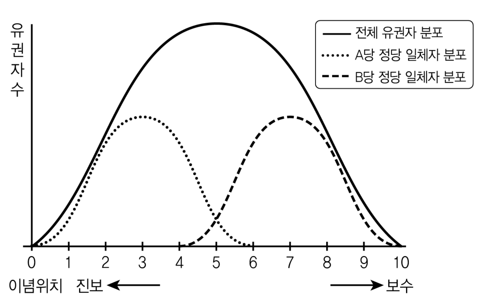

# [01-03] LU (2012)

## 01

밑줄 친 단어를 바르게 고치지 못한 것은?

### 선택지

(1) 비행기 사고로 조종사가 실종되어 그와의 연락이 <u>중단(中斷)되었다</u>. [→ 단절(斷絶)되었다]

(2) 전쟁 중에 불에 타 사라진 누각을 <u>중수(重修)하는</u> 공사가 시작되었다. [→ 중창(重創)하는]

(3) 서장은 한 달 동안 마약 사범 색출에 <u>몰입(沒入)하였다</u>. [→ 골몰(汨沒)하였다]

(4) 전쟁 난민들을 굶주림에서 <u>구호(救護)하기</u> 위한 노력이 이어졌다. [→ 구제(救濟)하기]

(5) 현황에 대한 담당자의 구두 보고는 서면으로 <u>대치(代置)하겠습니다</u>. [→ 대체(代替)하겠습니다]

## 02

어법상 가장 적절한 문장은?

### 선택지

(1) 사법부의 판단에 행정부의 장관이 공개적으로 비난해서는 안 된다.

(2) 이사회는 이 규정을 정규직 사원뿐만 아니라 비정규직 사원까지 적용하기로 결정하였다.

(3) 정부는 이번 발표에서 사교육비 문제의 핵심이 학원에 있다면서 그 책임을 학원에 전가시켰다.

(4) 새로운 심사 기준은 심사의 일관성 유지와 심사 결과의 예측성을 높일 수 있을 것으로 기대된다.

(5) 지금은 시장 상황의 변화로 어려움을 겪고 있는 농민들의 문제를 해결하기 위해 정부가 적극적으로 노력해야 할 때이다.

## 03

<보기>의 ㉠∼㉤을 문맥에 맞게 고쳐 쓴 것으로 적절하지 않은 것은?

### 보기

전쟁은 둘 이상의 국가 간에 일어나는 물리적 충돌이다. 내전이나 폭동도 심각한 물리적 충돌이지만, 전쟁은 피해 규모가 훨씬 커서 그 차이가 그야말로 ㉠ <u>호리지차(毫釐之差)</u>라고 할 수 있다. 이런 전쟁은 인류가 국가를 형성하면서부터 지금까지 자주 ㉡ <u>빈발해 왔다</u>. 그만큼 인류의 역사는 ㉢ <u>전쟁의 역사라고 함에 전혀 지나치지 않는다</u>. 이러한 전쟁에서 큰 공을 세운 사람이나 자기를 희생한 사람이 생기게 되었고, 국가는 이에 대한 보훈의 의무를 지게 되었다. 더욱이 국민들이 자기희생에 대해 국가가 ㉣ <u>결단코 보답을 해 주겠다고</u> 확신하게 하기 위해서도 국가는 보훈의 의무를 다해야 했다. 우리 역사 기록에서도 삼국 시대부터 전쟁 유공자 포상과 전사자 추모의 기록이 여러 곳에서 발견되는데, 현대사에서는 일제 강점기 동안 국권을 상실하여 보훈이 불가능했다가 ㉤ <u>그 시기 이후에</u> 비로소 국가적 차원의 보훈이 이루어졌다.

### 선택지

(1) ㉠ → 천양지차(天壤之差)

(2) ㉡ → 발발(勃發)해 왔다

(3) ㉢ → 전쟁의 역사라고 해도 전혀 지나치지 않다

(4) ㉣ → 기필코 보답을 해 주리라고

(5) ㉤ → 그 시기 이후부터

# [04-06] LU (2012)

다음 글을 읽고 물음에 답하시오.

## 제시문

조선의 관제는 주나라의 육전(六典) 제도를 근본으로 삼고 있으며, 주현(州縣)의 향리는 조정의 여러 관직을 모범으로 삼아 본뜬 것이다. 이 둘은 비록 그 명칭이 같지 아니하고 지위의 높고 낮음에 차등이 있다 하더라도, 다스리는 일을 나누어 맡는다는 의미에서는 일찍이 서로 다른 적이 없었다.

그러나 조정에서 벼슬살이하는 자는 세가 대족(世家大族)에 속하는 무리가 많다. 그들은 내직(內職)을 거쳐 외직(外職)으로 나아가며, 낮은 자리에서 높은 자리로 승진하여 나라 전체에 두루 명성을 떨친다. 또 그들이 그러한 지위로 말미암아 무슨 일을 성취하게 되면, 문필가와 사가(史家)들이 그 업적을 더욱 빛나도록 찬미하여 수백 년이 지나더라도 그 화려한 업적은 잊히거나 사라지지 않는다. 반면에 오로지 주현에서 벼슬살이하는 자는 그 문지(門地)가 변변치 못하고 맡은 바 직무가 아주 낮으며 명성도 한 지역을 넘어 떨치지 못한다. 혹 높은 식견과 뛰어난 재주를 지녔다고 하더라도 모두 묻혀 사라져서 드러나지 않는다. 이러하니 비록 그 같은 인재를 자랑하여 기록하려고 한들 그렇게 할 수 있겠는가. 이 같은 사실을 나는 심히 한스럽게 생각한다.

본관이 월성(月城)인 사과(司果) 벼슬의 이진흥은 신라와 고려 이래로 이서(吏胥)로서 가문을 일으킨 인물을 널리 고찰하여 「관감록(觀感錄)」 한 편을 지었다. 그리고는 부친 통덕랑(通德郞) 이경번이 지은 「이직명목해(吏職名目解)」 및 「감은시(感恩詩)」․「호장소(戶長疏)」․「향공소(鄕貢疏)」를 그 앞에 합하여, 『연조귀감(掾曹龜鑑)』이라 하였다. 그 글들은 근거가 확실하고 상소의 언사(言辭) 또한 가히 추려 쓸 만한 것이 많으며, 힘써 선함을 권하고 악함을 깨우치는 기록이 연이어져 있어 가히 읽을 만하다. 그러므로 이 책에 실린 내용은 마땅히 향리들만이 거울로 삼아야 하는 것이 아니라, 생각건대 사대부 또한 가히 버려서는 안 될 것이니, 이 또한 아름답지 아니한가. 다만 위아래 오륙백 년 사이에 행적이 많이 흩어져 버려 진기한 꽃이나 특이한 나무 같은 뛰어난 인재를 많이 채록할 수 없었으니, 이 또한 문지 때문에 그리된 것이다.

내가 듣기에 옛적에는 사람을 등용할 때 재(才)와 덕(德)으로써 그 기준을 삼았으며 문지로써 그렇게 한 것은 아니었다. 하․은․주 3대 이래 모두 이와 같이 하였으니 대개 부열과 여상이 그러한 예이다. 소를 기르던 백리해가 등용되고 노예였던 위청이 발탁된 일은 그것이 더욱 분명히 드러난 사례이다. 하물며 주현에서 벼슬살이하던 사람은 위와 같은 사람들과 비교하면 서로 차이가 나는 정도만이 아니다. 그런즉 주현에서 벼슬살이하던 사람을 조정에 등용하는 것은 단지 관부의 책임자로 승진시키는 정도이니, 생각건대 어려운 일이 아니었다.

그러나 후세에는 그렇지가 않아서 오로지 문지로써만 사람을 등용하였다. 그러므로 뛰어나고 특이한 능력을 지닌 선비라도 미천한 집안에서 태어나면 길이 막혀 벼슬할 수가 없으며, 주현에서 벼슬살이하던 사람은 연자방앗간에서 맷돌을 돌리는 당나귀와 같아서 종신토록 벗어날 수가 없다. 선비 또한 이러한 처지 때문에 자신을 존중하지 못하고 끝내 낮고 천한 지경에 빠져 버린 자마저 있으니, 오호라 어찌 애석하지 않으랴.

<u>㉠ 무릇 현달하여 명성을 떨치는 것이 이미 저와 같고, 막히어 세상에 파묻혀 버린 것이 또한 이와 같으니, 문지만으로는 족히 인재를 쓸 수 없음을 알겠다.</u> 그러나 비록 그렇다 하더라도 문지가 한미하다 하여 자신을 존중하지 않고, 기꺼이 낮고 천한 지경에 빠져 버리는 자는, 어진 사람을 임용하고 능력 있는 이를 쓴다는 내용의 시조차 읽지 않은 자이리니, 어찌 옳다고 하겠는가. 진실로 능히 그 천성을 온전히 하며 아름다운 덕을 좋아한다면, 이 역시 천하의 어질고 귀한 일이다. 관작이나 공로가 어찌 또한 대단한 것이라고 말할 수 있겠는가. 옛적의 서기는 천인이었음에도 행실을 닦아 세상에 이름을 떨쳐 진신(縉紳)과 처사(處士)가 그를 존경하고 흠모함이 오래도록 줄어들지 않았다. 황무진은 가리(假吏)였으나 몸을 닦아 충효에 뛰어나 원주 사람들은 지금까지도 그를 모시는 제사를 지낸다. 이 두 사람이야말로 이른바 어질고 고귀한 인물인데, 이들이 어찌 관작을 바라서 자신을 존중했겠는가. 이 책 속에 기록된 내용이 이 같은 뜻을 잘 드러냈으니 취하고 버리는 것의 분별이 분명하다고 할 만하다.

사과 이진흥의 후손인 이명구가 이 책을 간행하려고 하면서, 나에게 서문을 써 줄 것을 청해 왔다. 둔하고 거친 내가 어찌 족히 이러한 일을 맡기에 합당하리요마는, 다만 사과 부자가 명(名)을 다스리고 실(實)에 힘썼음을 기쁘게 생각한다는 말을 하려고 하였을 뿐이다. 이에 서기와 황무진 두 인물의 사례를 들어 그 뜻을 널리 펴려고 한 것이다.

- 이민행, 「연조귀감 서」 -

## 04

위 글에서 언급된 ‘연조귀감’의 특징으로 적절하지 않은 것은?

### 선택지

(1) 교화적 가치를 지니고 있다.

(2) 여러 가문이 함께 간행했다.

(3) 여러 시대의 사례를 다루고 있다.

(4) 다양한 형식의 글을 수록하고 있다.

(5) 널리 알려지지 않은 인물들의 행적을 발굴했다.

## 05

㉠의 취지로 상소문을 올린다고 할 때, 가장 적절한 것은?

### 선택지

(1) 내직은 외직에 비하여 특전이 많으니 외직을 거쳐 오르게 해 주소서.

(2) 버림받은 집안의 사람이라도 뛰어난 자는 등용하는 데 구애됨이 없게 하소서.

(3) 서얼도 적자와 같은 뿌리이니 족보를 만들 때 기재상의 차별을 두지 말게 하소서.

(4) 서북 지방의 사람들은 다른 지역에 비하여 부세를 많이 내고 있으니 줄여 주소서.

(5) 천민도 상민과 같은 백성이니 상민과 같이 군역을 져서 신민의 의무를 다하게 하소서.

## 06

‘향리’에 대한 글쓴이의 이해로 옳지 않은 것은?

### 선택지

(1) 향리는 유교 가치를 수용했다.

(2) 향리 중에는 조정에 등용된 자도 있다.

(3) 향리도 백성을 다스리는 계층의 하나이다.

(4) 향리의 지위는 시대에 따라 점차로 높아졌다.

(5) 향리 조직은 중앙 조직을 모방하여 만들어졌다.

# [07-08] LU (2012)

다음 글을 읽고 물음에 답하시오.

## 제시문

제1공화국 헌법위원회의 성격을 이해하기 위해서는 제도의 도입 과정에서 작용한 다양한 요인들의 갈등과 타협의 구조를 살펴볼 필요가 있다. 위헌 법률 심사 제도의 도입이 본격적으로 거론되기 시작한 것은 해방 후 법원을 재조직하는 과정에서 법원이 미국식 사법 심사제 도입을 추진하면서부터였다. 당시 법원은 미국식 민주주의의 핵심을 사법부가 위헌 법률 심사를 담당하는 사법 심사제에서 찾았던 것이다.

<u>㉠ 일제 강점기의 사법권에 대한 통념</u>에 따르면, 사법권은 일반 시민 생활에 대해 법을 적용하는 경우로 한정된다. 즉 민사ㆍ형사 재판만을 사법권의 범위로 본 것이다. 삼권 분립도 입법과 관련된 사항은 입법부가, 행정과 관련된 사항은 행정부가 관할하고, 사법부는 여기에 간섭하지 않는 것이라고 이해했다. 따라서 법률이 헌법에 위반되는지의 여부에 대한 판단도 의회의 자율에 맡기는 것이 삼권 분립의 내용에 부합한다고 보았다. 이와 달리 <u>㉡ 해방 후 한국의 법원 측 인사들의 주장</u>은 모든 법의 적용이 사법권에 해당한다는 미국식 사고에 기초하고 있었다. 이에 따르면, 헌법도 법인 이상 위헌 법률 심사도 당연히 법의 적용에 해당하므로 사법부 관할에 속한다는 것이었다. 또한 법원 측 인사들은 의회 다수파의 전횡에 대해 사법부가 헌법에 따라 소수자의 자유와 권리를 보호할 수 있는 제도가 바로 사법 심사제라고 주장했다. 법의 적용에 숙달된 판사들이 법리적 관점에서 위헌 법률 심사를 객관적으로 할 수 있다고 본 것이다. 법원 측이 사법 심사제 도입에 적극적이었던 이유는 사법 심사제가 사법부의 권한을 확대하고 위상을 높일 것이라고 여겼기 때문이기도 했다.

사법 심사제와는 다른 위헌 법률 심사 제도는 <u>㉢ 헌법학자 유진오의 구상</u>에서 출발하였다. 유진오는 법이 위계 구조로 구성되어 있다는 법단계설에 비추어 볼 때, 헌법에 의해 창설된 국회가 위헌인 법률을 제정해도 헌법의 통제를 받지 않는다는 것은 모순이라고 생각하였다. 그렇다고 해서 사법 심사제가 대안이라고 생각하지도 않았다. 그가 보기에 위헌 법률 심사는 일반 법령의 적용과는 달리 정치적 성격이 강하기 때문에, 선출되지 않은 대법관 몇 명이 국민의 대표 기관이 제정한 법률을 무효로 할 수 있는 사법 심사제는 위험한 것이었다. 또한 미국식 삼권 분립 제도는 개인의 자유와 권리를 확보하기 위하여 국가 기관이 상호 견제하는 제도이므로, 국가 수립에 필요한 수많은 과제를 국가 권력이 개입하여 시급히 해결해야 하는 당시의 현실에는 적합하지 않다고 주장했다. 그래서 유진오는 비상설 기구로서 헌법위원회를 별도로 창설하는 것을 대안으로 구상하였다. 그리고 그 위원 구성은 대통령을 의장으로 하고 대법원장, 국회 양원 의장, 그리고 대통령이 참의원의 동의를 받아 임명하는 3인으로 하도록 하였다.

두 구상 중 위헌 법률 심사 담론에서 초기에 주도적 위치에 있던 것은 사법 심사제였다. 제헌 국회가 구성한 헌법기초위원회에서 심의의 기준안으로 채택된 헌법안 역시 법원 측 인사들의 강력한 요청에 의해 사법 심사제를 채택하고 있었다. 그러나 정작 헌법기초위원회의 심의에 들어가자 유진오의 헌법위원회 구상이 의외로 쉽게 부활했다. 국회의원들로서는 자신들이 제정한 법률을 법원이 무효화할 수 있다는 사실이 탐탁지 않았기 때문이다. 다만 헌법위원회의 구성과 관련해서는 유진오의 원래 구상에 중요한 수정을 가했다. 법원 측의 견해를 일부 고려하면서 동시에 입법부와 사법부 어느 한쪽이 우월하다는 시비가 나지 않도록 양 기관에서 동등한 인원이 참여하게 한 것이다. 그리고 의결 정족수에 관한 규정을 새롭게 추가했다. 이렇게 수정된 헌법기초위원회의 안은 국회 본회의를 그대로 통과하였다. 그러나 헌법에 의해 헌법위원회가 공식화된 이후에도 위헌 법률 심사제에 소극적이었던 국회의원들이 후속 법률의 제정을 미루었기 때문에, 헌법위원회는 많은 시간이 지난 후에야 비로소 제도적으로 완비될 수 있었다.

## 07

㉠～㉢에 대해 설명한 것으로 옳은 것은?

### 선택지

(1) ㉠은 법원의 권한 범위를 ㉡보다는 넓게 보는 입장을 취했다.

(2) ㉠은 국회가 만든 법률의 위헌 여부에 대한 판단을 누구에게 맡길 것인지에 대해 ㉢과 입장이 같았다.

(3) ㉡은 위헌 법률 심사가 엄격한 법리적 적용이어야 한다고 생각한 점에서 ㉢과 입장이 달랐다.

(4) ㉡은 국회가 제정한 법률의 효력이 검증되어야 한다고 생각한 점에서 ㉢과 입장이 달랐다.

(5) ㉢은 ㉡에 비해 국가 과제의 시급한 추진보다는 개인의 권리 보호를 더 중요시하는 입장을 취했다.

## 08

<보기>의 1에 대하여 <보기>의 2와 같이 설명할 때, 옳은 것끼리 묶인 것은?

### 보기

1. 제헌 헌법 제80조 중 헌법위원회 관련 규정

법률이 헌법에 위반되는 여부가 재판의 전제가 되는 때에는 법원은 헌법위원회에 제청하여 그 결정에 의하여 재판한다. ···································································································ⓐ

헌법위원회는 부통령을 위원장으로 하고 대법관 5인과 국회의원 5인의 위원으로 구성한다. ·····················································ⓑ

헌법위원회에서 위헌 결정을 할 때에는 위원 3분지 2 이상의 찬성이 있어야 한다. ·······························································ⓒ

헌법위원회의 조직과 절차는 법률로써 정한다. ·················ⓓ

2. 위 규정에 대한 설명

(가) ⓐ는 헌법기초위원회의 심의 기준안을 반영한 것이다.

(나) ⓑ는 구성에 있어 입법부와 사법부가 균형을 이루도록 의도한 것이다.

(다) ⓒ는 국회보다 법원의 입장을 더 반영한 것이다.

(라) ⓓ는 제도가 빠른 시일 내에 시행되지 못한 사실과 관련이 있다.

### 선택지

(1) (가), (나)

(2) (가), (다)

(3) (나), (다)

(4) (나), (라)

(5) (다), (라)

# [09-11] LU (2012)

다음 글을 읽고 물음에 답하시오.

## 제시문

선거에서 유권자의 정치적 선택을 설명하는 이론은 사회심리학 이론과 합리적 선택 이론으로 대별된다. 먼저 초기 사회심리학 이론은 유권자 대부분이 일관된 이념 체계를 지니고 있지 않다고 보았다. 그럼에도 유권자들이 투표 선택에서 특정 정당에 대해 지속적인 지지를 보내는 현상은 그 정당에 대한 심리적 일체감 때문이라고 주장했다. 곧 사회화 과정에서 사회 구성원들이 혈연, 지연 등에 따른 사회 집단에 대해 지니게 되는 심리적 일체감처럼 유권자들도 특정 정당을 자신과 동일시하는 태도를 지니는데, 이에 따라 유권자들은 정당의 이념이 자신의 이해관계에 유리하게 작용할 것인지 합리적으로 따지기보다 정당 일체감에 따라 투표한다는 것이다. 이에 반해 합리적 선택 이론은 유권자를 정당이 제시한 이념이 자신의 사회적 요구에 얼마나 부응하는지 그 효용을 계산하는 합리적인 존재로 보았다. 공간 이론은 이러한 합리적 선택 이론을 대표하는 이론으로, 근접 이론과 방향 이론으로 나뉜다.

초기의 근접 이론과 방향 이론은 유권자의 선택에 대해 다음과 같이 설명한다. 우선 이념 공간을 일차원 공간인 선으로 표시하고, 보수적 유권자 X, 진보 정당 A, 보수 정당 B의 이념적 위치를 그 선에 표시한다고 가정하자. 근접 이론은 X와 A, B 간의 이념 거리를 각각 ‘|X－A|’와 ‘|X－B|’로 계산한 다음, 만약 X와 A의 이념 거리가 X와 B의 경우보다 더 가깝다면 X는 A에 더 큰 효용을 느끼고 투표할 것이라고 본다. 이는 유권자 분포의 중간 지점인 중위 유권자의 위치가 양당의 선거 경쟁에서 득표 최대화 지점임을 의미한다. 그러나 과연 X가 이념 거리가 더 가깝다는 것만으로 자신과 이념이 다른 A를 지지할까? 이에 대해 방향 이론은 진보와 보수를 구분하는 이념 원점을 상정하고, 이를 기준으로 정당의 이념이 유권자의 이념과 같은 방향이되 이념 원점에서 더 먼 쪽에 위치할수록 그 정당에 대한 유권자의 효용이 증가하며, 반대로 정당의 이념이 유권자의 이념과 다른 방향일 경우에는 효용이 감소한다고 본다. 가령 이념 원점이 5라고 한다면, X의 A와 B에 대한 효용은 각각 ‘－|5－X|×|5－A|’와 ‘|5－X|×|5－B|’로 계산되는데, 이때 X는 이념 거리로는 비록 A가 가깝다 할지라도 B에 투표하게 된다. 따라서 방향 이론에서 정당에 대한 유권자의 효용은 그 정당이 유권자와 같은 이념 방향의 극단에 있을 때 최대화된다.

두 이론은 이념에 기초한 효용 계산을 통해 초기 사회심리학 이론의 ‘어리석은 유권자’ 가설을 비판했지만 한계도 있었다. 근접 이론은 미국의 정당들이 실제 중위 유권자의 지점에 위치하지 않고 있다는 비판에, 방향 이론은 유럽 국가들에서 이념적 극단에 있는 정당이 실제로 수권한 경우가 드물다는 비판에 각각 직면했다. 이에 근접 이론은 정당이 정당 일체감을 지닌 유권자(정당 일체자)들로부터 멀어질 경우 지지가 감소할 수 있다는 점을 고려해서 실제로는 중위로부터 다소 벗어난 지점에 위치하게 된다고 이론적 틀을 보완했다. 또 방향 이론은 유권자들이 심리적으로 허용할 수 있는 이념 범위인 관용 경계라는 개념을 도입하여 정당이 관용 경계 밖에 위치하면 오히려 유권자의 효용이 감소한다는 점을 이론에 반영했다.

이러한 후기 공간 이론의 발전은 이념적 중위나 극단을 득표 최대화 지점으로 보았던 초기 공간 이론의 문제점을 극복하려 한 결과였다. 그러나 이는 정당 일체감이나 그 밖의 심리학적 개념들을 그대로 수용한 결과이기도 하였다. 그럼에도 공간 이론은 초기 사회심리학 이론에서 비관적으로 전망했던 ‘세련된 유권자’ 가설을 무리 없이 입증해 왔다. 다양한 국가에서 유권자들이 이념에 기초해 후보자나 정당을 선택한다는 것을 실증적으로 보여 주었던 것이다.

한편 공간 이론의 두 이론은 유권자의 효용 계산과 정당의 득표 최대화 예측에서 이론적 경쟁 관계를 계속 유지했을 뿐만 아니라 현실 설명력에서도 두드러진 차이를 보였다. 의회 선거를 예로 들면, 근접 이론은 미국처럼 <u>㉠ 양당제 아래 소선거구제로</u> 치러지는 선거를 더 잘 설명해 왔다. 반면에 방향 이론은 유럽 국가들처럼 <u>㉡ 다당제 아래 비례대표제로</u> 치러지는 선거를 더 잘 설명해 왔다. 한 연구는 영국처럼 <u>㉢ 다당제 아래 소선거구제로</u> 치러지는 선거에서 유권자가 여당에 대해 기대하는 효용은 근접 이론이 더 잘 설명하고, 유권자가 야당에 대해 기대하는 효용은 방향 이론이 더 잘 설명한다고 밝혔다. 이는 정치 환경에 따라 정당들의 득표 최대화 전략이 다를 수 있음을 뜻한다.

## 09

위 글의 내용으로 가장 적절한 것은?

### 선택지

(1) 초기 사회심리학 이론은 유권자의 투표 선택이 심리적 요인 때문에 일관성이 없다고 보았다.

(2) 공간 이론은 유권자와 정당 간의 이념 거리를 통해 효용을 계산하여 유권자의 투표 선택을 설명하였다.

(3) 후기 공간 이론의 등장으로 득표 최대화에 대한 초기의 근접 이론과 방향 이론 간의 이견이 해소되었다.

(4) 후기 공간 이론에서는 유권자의 투표 선택을 설명하는 데 있어서 이념의 비중이 커졌다.

(5) 후기 공간 이론은 정당 일체감을 합리적인 것으로 인정하여 세련된 유권자 가설을 입증했다.

## 10

㉠～㉢에서 득표 최대화를 위한 정당의 선거 전략을 공간 이론의 관점에서 설명한 것으로 바르지 않은 것은?

### 선택지

(1) 초기 근접 이론은 ㉠에서 지지율 하락을 경험한 여당이 중위 유권자의 위치로 이동함을 설명할 수 있다.

(2) 후기 근접 이론은 ㉠에서 정당 일체자의 이탈을 우려한 야당이 중위 유권자의 위치로 이동하지 못함을 설명할 수 있다.

(3) 후기 방향 이론은 ㉡에서 정당 일체자의 이탈을 우려한 여당이 중위 유권자의 위치로 이동함을 설명할 수 있다.

(4) 초기 근접 이론은 ㉢에서 중도적 유권자의 이탈을 우려한 여당이 중위 유권자의 위치로 이동함을 설명할 수 있다.

(5) 후기 방향 이론은 ㉢에서 중도적 유권자의 관용 경계를 의식한 야당이 이념적 극단 위치로 이동하지 못함을 설명할 수 있다.

## 11

<보기>의 선거 상황을 가정하여 위 글의 이론들을 적용한 것으로 타당하지 않은 것은?

### 보기

아래의 그림은 좌우 동형으로 이루어진 N국의 A당과 B당의 정당 일체자 분포와 여기에 무당파 유권자가 포함된 전체 유권자의 분포를 나타낸다. N국은 1) A당과 B당의 정당 일체자가 투표자인 예선을 통해 각 당의 후보를 결정한 후, 2) 전체 유권자가 투표자인 본선을 통해 최종 대표자를 선출한다.

<이미지 포함됨>

ㄱ. 후보자 이념 위치 : A당(A1＝0, A2＝4), B당(B1＝7, B2＝9)

ㄴ. 중위 유권자 위치 : A당＝3, B당＝7, 전체 유권자＝5

ㄷ. 이념 원점＝5

ㄹ. 관용 경계 : 두 후보자가 동시에 유권자 위치의 ±2를 초과하면 유권자는 기권한다고 가정함.

ㅁ. 두 후보자에 대한 효용이 같다면 유권자는 기권한다고 가정함.

ㅂ. A당과 B당의 정당 일체자 분포의 규모는 같음.

### 선택지

(1) 초기 근접 이론은 B1이 예선을 통과할 것으로 예측할 것이다.

(2) 초기 근접 이론은 A2가 본선에서 승리할 것으로 예측할 것이다.

(3) 초기 방향 이론은 본선에서 승자가 없을 것으로 예측할 것이다.

(4) 후기 근접 이론은 A2가 본선에서 승리할 것으로 예측할 것이다.

(5) 후기 방향 이론은 A1이 본선에서 승리할 것으로 예측할 것이다.

# [12-14] LU (2012)

다음 글을 읽고 물음에 답하시오.

## 제시문

어떤 삶이 좋은지에 대한 견해는 사회나 문화에 따라 다르지만 각 사회나 문화 속에는 그 구성원들이 바람직하다고 여기는 좋은 삶의 모습이 존재한다. 그렇다면 각 사회나 문화에서 무엇이 우리의 삶을 좋은 삶으로 만드는가? 좋은 삶을 판단하는 기준은 무엇인가? 이것은 ‘강한 가치 평가’와 관련된 문제로서 넓은 의미의 도덕적 문제라고 할 수 있다. 그런데 삶의 의미를 부여하거나 삶의 방향을 설정해 주는 이러한 강한 가치 평가의 기준은 ‘상위선(上位善)’을 배경으로 하고 있다. 상위선은 여러 선들 중에서 최고의 가치를 지닌 선으로 우리들의 일상적인 목적이나 욕구와는 비교할 수 없을 정도로 높은 가치를 지니며 여러 도덕적 가치 평가들의 근거가 된다. 상위선은 우리 자신의 욕구나 성향, 선택에 의해 형성되는 것이 아니라 그것들로부터 독립적으로 주어지며 그 욕구나 선택을 평가하는 기준이 된다. 상위선은 도덕적 판단들의 근거가 되는 도덕적 원천인 것이다.

강한 가치 평가의 기준이 되는 상위선은 역사적으로 형성되어 자리 잡은 것으로 사회나 문화에 따라 다를 수 있다. 예를 들어 효가 상위선인 사회도 있고, 자유가 상위선인 사회도 있다. 각 사회의 상위선은 명시적 또는 암시적으로 그 사회에 살고 있는 구성원들의 도덕적 판단이나 직관, 반응의 배경이 되기 때문에, 그 상위선이 무엇인지 규명하면 각 사회에서 이루어지는 도덕적 판단이나 반응을 제대로 이해할 수 있다. 도덕 철학의 주요 과제들 중의 하나는 도덕적 판단들의 배후에 있는 가치, 즉 상위선을 탐구하여 밝히는 것이다.

그런데 의무론이나 절차주의적 도덕 이론은 좋은 삶의 문제를 다루는 것을 회피하고 있다. 그 이유는 다원주의와 개인주의가 특징적인 근대 사회의 조건에서 좋은 삶의 모습을 제시하여 이를 따를 것을 요구하는 것은 개인의 삶에 간섭하는 것이 되어 다양성과 자율성의 가치를 훼손할 우려가 있다고 보았기 때문이다. 그래서 이와 같은 근대의 도덕 철학은 좋은 삶과 관련된 삶의 목적이나 의미 등에 대해 다루지 않고, 옳음과 관련된 기본적이면서도 보편적인 도덕 규칙이나 정당한 절차 등에 대해서만 다루는 것을 자신의 과제로 삼았다. 이는 사회를 유지하기 위한 기본적인 보편적 도덕규범을 넘어서서 더 많은 것을 개인에게 요구하는 것이 개인의 자율성을 침해할 수 있다고 보았기 때문이다. 이러한 근대의 도덕 철학은 도덕성 개념을 협소화하여 옳음의 문제나 절차적 문제에만 자신의 과제를 제한함으로써, 도덕적 신념의 배경이 되고 있는 상위선을 포착할 수 없게 만들었다.

넓은 시각에서 보면 이러한 근대의 도덕 철학이 추구하거나 전제로 삼고 있는 가치나 권리는 보편적인 것이 아니며 근대라는 특정한 시대적 조건 속에서 형성된 특수한 것이다. 즉 이러한 근대의 도덕 철학 자체도 그 시대의 특정한 상위선을 배경으로 형성된 것이다. 예를 들어 의무론은 자유나 보편주의와 같은 도덕적 이상 즉 상위선을 배경으로 형성된 것이다. 마찬가지로 절차주의적 도덕 이론도 이성적 주체의 자율성 같은 상위선을 배경으로 형성된 것이다. 이러한 근대의 도덕 철학이 옹호하는 도덕 규칙도 근대적 가치나 상위선을 배경으로 형성되었기 때문에 그 도덕 규칙이 보편성을 지닌다는 주장은 타당하지 않다.

도덕 철학의 또 다른 과제는 어떤 삶이 좋은 삶인지에 대해 답하는 것이다. 우리의 삶이나 정체성이 혼란에 빠지거나 위기에 처했을 때, 도덕 철학은 도덕적 판단의 원천이 되는 상위선에 근거하여 문제의 해결 방안이나 나아갈 방향을 제시해야 한다. 그런데 절차주의적 도덕 이론은 도덕적 정당성을 확보하기 위한 형식적 절차에만 관심을 기울이고 있다. 이를테면 그중 한 형태인 담론 윤리학은 규범의 합리적 정초 가능성이나 정당한 절차의 문제만을 다룰 뿐 좋은 삶의 모습과 같은 실질적인 문제는 합리적인 논의의 대상에서 배제한다. 따라서 여기서는 좋은 삶의 문제에 대한 대답이 전적으로 개인에게 맡겨져 있으며 개인들은 스스로 이에 대한 대답을 찾아야 하는 부담을 안게 된다. 삶의 의미와 같은 중요한 문제를 다루기를 포기하는 이러한 태도는 도덕 철학의 전통에서 지나치게 후퇴한 것이다.

어떻게 사는 것이 좋은가, 진정한 자아실현은 무엇인가 하는 문제는 단지 개인의 결단에만 맡겨서는 안 되며, 개인이 속한 사회의 삶의 지평이 되는 상위선을 고려하여 다루어야 한다. 만약 자아실현의 문제를 전적으로 개인의 주관적인 실존적 결단에만 맡긴다면 우리는 이기주의나 나르시시즘에 빠질 우려가 있다. 좋은 삶의 문제는 상위선을 바탕으로 합리적으로 다루어질 수 있으며 도덕 철학은 이를 위해 기여해야 한다.

## 12

‘상위선’에 대한 위 글의 견해로 보기 어려운 것은?

### 선택지

(1) 참된 자아실현의 문제는 보편 가치인 상위선과 독립적이다.

(2) 상위선은 개인이 자의적으로 선택할 수 있는 것이 아니다.

(3) 절차주의적 도덕 이론조차도 상위선을 배경으로 한 것이다.

(4) 상위선이 서로 다르면 도덕적 가치 판단도 서로 다를 수 있다.

(5) 상위선의 문제가 의무론에서는 제대로 다루어지지 못하고 있다.

## 13

위 글의 글쓴이가 제시하는 도덕 철학의 과제를 수행하고 있는 예만을 <보기>에서 있는 대로 고른 것은?

### 보기

ㄱ. 폴리스에서 덕이 있는 삶이란 무엇이며 덕이 왜 삶에서 중요한 가치를 지니는지를 다루는 도덕 철학

ㄴ. 시대를 초월하여 존재하는 보편타당한 도덕규범이 어떤 것인지를 다루는 도덕 철학

ㄷ. 담론 윤리학적 가치 판단이 어떤 도덕적 판단 근거에 바탕을 두고 있는지를 다루는 도덕 철학

### 선택지

(1) ㄱ

(2) ㄴ

(3) ㄷ

(4) ㄱ, ㄷ

(5) ㄴ, ㄷ

## 14

위 글의 주장에 대한 비판으로 가장 적절한 것은?

### 선택지

(1) 도덕적 문제의 의미를 협소하게 규정함으로써 도덕 철학의 전통을 계승하지 못할 수 있다.

(2) 도덕규범의 실질적인 내용을 다루지 않음으로써 현실적인 행위 지침을 제시하지 못할 수 있다.

(3) 좋음보다 옳음을 우선시함으로써 정의 개념의 형성 과정을 역사적 맥락 속에서 파악하지 못할 수 있다.

(4) 사회마다 좋은 삶의 모습이 다르면 도덕적 판단의 기준도 달라지기 때문에 도덕 자체에 대한 회의에 빠질 수 있다.

(5) 최고의 가치 평가 기준을 근거로 도덕적 판단을 함으로써 상충하는 가치관이 한 사회에서 공존하는 것에 대해 부정적 태도를 취할 수 있다.

# [15-17] LU (2012)

다음 글을 읽고 물음에 답하시오.

## 제시문

신체 내에 지방이 저장되는 과정과 분해되는 과정은 많은 연구들을 통해 명확히 알려져 있다. 지방은 지방세포 속에 중성지방의 형태로 축적된다. 이 과정을 살펴보면, 음식물 형태로 섭취된 지방은 소화 과정에서 효소들의 작용에 의해 중성지방으로 전환되어 작은창자에서 흡수되고 혈액에 의해 운반된 후 지방 조직에 저장된다. 이 과정에서 중성지방은 작은창자의 세포 내로 직접 흡수되지 못하기 때문에 췌장에서 분비된 지방 분해 효소인 리파아제에 의해 지방산과 글리세롤로 분해되어 흡수된다. 이렇게 작은창자의 세포에 흡수된 지방산과 글리세롤은 에스테르화라는 화학 반응을 통해 다시 합쳐져서 중성지방이 된다. 이 중성지방은 작은창자의 세포 내에서 혈관으로 방출되어 신체의 여러 부위로 이동한다. 중성지방이 지방세포 근처의 모세혈관에 도달하였을 때, 모세혈관 세포의 세포막에 붙어 있는 리파아제에 의해 다시 지방산과 글리세롤로 분해된 후 지방세포 내로 흡수된다. 이때의 리파아제는 지방 흡수를 위해 지방세포에서 분비되어 옮겨진 것이다. 지방세포는 흡수된 지방산과 글리세롤을 다시 에스테르화하여 중성지방의 형태로 저장한다. 만약 혈액 내에 중성지방의 양이 너무 많아서 기존의 지방세포가 커지는 것만으로는 더 이상 저장할 수 없을 경우, 지방세포의 수가 늘어나서 초과된 양을 저장한다.

지방세포에 저장된 중성지방은 다시 지방산과 글리세롤로 분해된 후 혈액으로 분비되어 신체 기관에 필요한 에너지를 만드는 데 중요한 에너지원이 된다. 이러한 중성지방의 분해는 카테콜아민이라는 신경 전달 물질에 의한 지방세포 내 호르몬-민감 리파아제의 활성화를 통해 일어나는 카테콜아민-자극 지방 분해와 카테콜아민의 작용 없이 일어나는 기초 지방 분해로 나뉜다. 이 가운데 기초 지방 분해는 특별히 많은 에너지가 필요 없는 평상시에 일어나며, 카테콜아민-자극 지방 분해는 격한 운동을 할 때와 같이 에너지가 많이 필요할 때 일어난다. 일반적으로 기초 지방 분해 과정에 의한 중성지방의 분해 속도는 지방세포의 크기가 클수록 빨라진다.

따라서 지방세포 내로 중성지방이 저장되는 것을 조절하거나 지방세포 내 중성지방의 분해를 조절하는 것이 체내 지방의 축적을 조절하는 방법이 된다. 이러한 지방 축적의 조절에는 성장 호르몬이나 성 호르몬 같은 내분비 물질이 관여한다. 이 가운데 성장 호르몬은 카테콜아민-자극에 대한 민감도를 증가시켜 지방 분해를 촉진하는 동시에, 지방세포가 분비한 리파아제의 활성을 감소시켜 지방세포 내 중성지방의 저장을 줄이는 것으로 알려져 있다. 이러한 이유로 성장 호르몬의 분비량이 많은 사춘기보다 분비량이 줄어드는 성인기에 지방세포 내 중성지방의 축적이 증가하게 되는 것이다.

한편 성 호르몬의 혈중 농도는 사춘기에 증가하며 성인기에 일정 수준 이상으로 유지되다가 노년기에 이르러 감소한다. 성 호르몬이 지방의 축적과 분해에 관여하는 기전은 아직 정확히 알려져 있지 않지만, 최근 연구들은 여성의 경우 둔부와 대퇴부의 피부 조직 아래의 피하 지방세포에 지방이 더 많이 축적되는 데 비해 남성의 경우 복부 창자의 내장 지방세포에 더 많이 축적된다는 사실로부터 지방 축적에 대한 성 호르몬의 기능을 설명하려고 한다.

성별 지방 축적의 차이를 밝히려는 이러한 시도들은 두 가지 부면으로 나누어 이해될 수 있다. 먼저 성별에 따른 지방의 축적 및 분해 양상의 차이이다. 성인의 내장 지방세포의 경우, 카테콜아민-자극 지방 분해 속도는 여성이 남성보다 빠르며, 지방세포에서 분비된 리파아제의 활성은 남성이 여성보다 더 높다. 반면에 성인의 둔부와 대퇴부의 피하 지방세포의 경우, 카테콜아민-자극 지방 분해 속도는 남성이 여성보다 빠르며, 에스테르화되는 중성지방의 양은 여성이 남성보다 더 많다. 다음은 신체 부위에 따른 지방 분해 양상의 차이이다. 여성의 경우는 카테콜아민-자극 지방 분해가 둔부와 대퇴부 피하 지방세포보다 내장 지방세포에서 더 빠르게 일어나는 반면, 남성의 경우는 그 속도가 비슷하다. 이처럼 성별 및 부위별 지방세포에 따라 중성지방의 저장과 분해 능력이 서로 다르다는 것은 성 호르몬이 지방세포에서 일어나는 중성지방의 저장과 분해 과정의 조절에 매우 복잡한 방법으로 관여하고 있음을 시사한다.

## 15

위 글의 내용과 일치하지 않는 것은?

### 선택지

(1) 카테콜아민은 지방세포 내에서 지방산과 글리세롤의 에스테르화 반응을 일으킬 수 있다.

(2) 중성지방이 에너지원으로 작용하기 위해서는 지방산과 글리세롤로 분해되어야 한다.

(3) 신체 내에 지방세포가 다른 부위보다 더 잘 축적되는 부위는 성별에 따라 다르다.

(4) 음식물 형태의 지방은 작은창자에서 흡수되기 위해 효소의 작용이 필요하다.

(5) 지방세포의 크기와 지방세포에서 일어나는 기초 지방 분해 속도는 비례한다.

## 16

‘리파아제’에 관한 설명으로 적절하지 않은 것은?

### 선택지

(1) 성장 호르몬은 호르몬-민감 리파아제의 활성을 증가시킨다.

(2) 지방세포에서 분비된 리파아제는 지방세포에서 지방산 분비를 감소시킨다.

(3) 췌장에서 분비된 리파아제의 활성이 억제되면, 체내에 지방 축적이 감소된다.

(4) 신체에서 많은 에너지가 요구되면, 지방세포 내 호르몬-민감 리파아제의 활성이 증가한다.

(5) 모세혈관 세포의 세포막에 붙어 있는 리파아제의 활성이 증가하면, 지방세포 내에서 에스테르화되는 지방산과 글리세롤의 양은 증가한다.

## 17

<보기>와 같은 실험을 수행한다고 할 때, 위 글의 내용으로 미루어 지방량 증가가 예상되는 것만을 있는 대로 고른 것은?

### 보기

아래와 같은 피험자들을 대상으로 일정 기간 동안 약물을 투여한 후, 투여 전후의 내장지방 또는 대퇴부 피하지방의 양을 비교하였다. (단, 약물 투여 전후의 기초 지방 분해량에는 차이가 없다고 가정하고, 투여 약물이 지방 조직을 제외한 다른 조직에 작용하여 지방 조직에 미치는 영향은 고려하지 않는다.)

<table>
  <thead>
    <tr>
      <th>피험자</th>
      <th>투여 약물</th>
      <th>측정 부위</th>
    </tr>
  </thead>
  <tbody>
    <tr>
      <td>ㄱ 정상 체중의 32세 남성</td>
      <td>여성 성 호르몬</td>
      <td>대퇴부 피하</td>
    </tr>
    <tr>
      <td>ㄴ 혈중 여성 성 호르몬 농도가 매우 낮은 70세 여성</td>
      <td>남성 성 호르몬</td>
      <td>내장</td>
    </tr>
    <tr>
      <td>ㄷ 성장 호르몬이 분비되지 않는 35세 남성</td>
      <td>성장 호르몬</td>
      <td>내장</td>
    </tr>
    <tr>
      <td>ㄹ 혈중 여성 성 호르몬 농도가 매우 낮은 35세 여성</td>
      <td>여성 성 호르몬</td>
      <td>내장</td>
    </tr>
  </tbody>
</table>

### 선택지

(1) ㄱ, ㄴ

(2) ㄱ, ㄴ, ㄷ

(3) ㄱ, ㄷ, ㄹ

(4) ㄴ, ㄷ

(5) ㄴ, ㄷ, ㄹ

# [18-20] LU (2012)

다음 글을 읽고 물음에 답하시오.

## 제시문

자본 구조가 기업의 가치와 무관하다는 명제로 표현되는 <u>㉠ 모딜리아니-밀러 이론</u>은 완전 자본 시장 가정, 곧 자본 시장에 불완전성을 가져올 수 있는 모든 마찰 요인이 전혀 없다는 가정에 기초한 자본 구조 이론이다. 이 이론에 따르면, 기업의 영업 이익에 대한 법인세 등의 세금이 없고 거래 비용이 없으며 모든 기업이 완전히 동일한 정도로 위험에 처해 있다면, 기업의 가치는 기업 내부 여유 자금이나 주식 같은 자기 자본을 활용하든지 부채 같은 타인 자본을 활용하든지 간에 어떤 영향도 받지 않는다. 모딜리아니-밀러 이론은 현실적으로 타당한 이론을 제시했다기보다는 현대 자본 구조 이론의 출발점을 제시하였다는 데 중요한 의미가 있다.

모딜리아니-밀러 이론이 제시된 이후, 완전 자본 시장 가정의 비현실성에 주안점을 두어 세금, 기업의 파산에 따른 처리 비용(파산 비용), 경영자와 투자자, 채권자 같은 경제 주체들 사이의 정보량의 차이(정보 비대칭) 등을 감안하는 자본 구조 이론들이 발전해 왔다. 불완전 자본 시장을 가정하는 이러한 이론들 중에는 상충 이론과 자본 조달 순서 이론이 있다.

상충 이론이란 부채의 사용에 따른 편익과 비용을 비교하여 기업의 최적 자본 구조를 결정하는 이론이다. 이러한 편익과 비용을 구성하는 요인들에는 여러 가지가 있지만, 그중 편익으로는 법인세 감세 효과만을, 비용으로는 파산 비용만 있는 경우를 가정하여 이 이론을 설명해 볼 수 있다. 여기서 법인세 감세 효과란 부채에 대한 이자가 비용으로 처리됨으로써 얻게 되는 세금 이득을 가리킨다. 이렇게 가정할 경우 상충 이론은 부채의 사용이 증가함에 따라 법인세 감세 효과에 의해 기업의 가치가 증가하는 반면, 기대 파산 비용도 증가함으로써 기업의 가치가 감소하는 효과도 나타난다고 본다. 이 상반된 효과를 계산하여 기업의 가치를 가장 크게 하는 부채 비율 곧 최적 부채 비율이 결정되는 것이다.

이와는 달리 자본 조달 순서 이론은 정보 비대칭의 정도가 작은 순서에 따라 자본 조달이 순차적으로 이루어진다고 설명한다. 이 이론에 따르면, 기업들은 투자가 필요할 경우 내부 여유 자금을 우선적으로 쓰며, 그 자금이 투자액에 미달될 경우에 외부 자금을 조달하게 되고, 외부 자금을 조달해야 할 때에도 정보 비대칭의 문제로 주식의 발행보다 부채의 사용을 선호한다는 것이다.

상충 이론과 자본 조달 순서 이론은 기업들의 부채 비율 결정과 관련된 이론적 예측을 제공한다. 기업 규모와 관련하여 상충 이론은 기업 규모가 클 경우 부채 비율이 높을 것이라고 예측한다. 대기업은 소규모 기업에 비해 사업 다각화의 정도가 높아 파산할 위험이 낮으므로 기대 파산 비용도 낮아서 부채 수용 능력이 높은 데다가 법인세 감세 효과를 극대화하기 위해서도 더 많은 부채를 차입하려 할 것이기 때문이다. 그러나 자본 조달 순서 이론은 기업 규모가 클 경우 부채 비율이 낮을 것이라고 예측한다. 기업 규모가 클 경우 기업 회계가 투명해지는 등 투자자들에게 정보 비대칭으로 발생하는 문제가 적기 때문에 금융 중개 기관을 이용하여 자본을 조달하기보다는 주식 시장을 통해 자본을 조달할 것이기 때문이다. 성장성이 높은 기업들에 대하여, 상충 이론은 법인세 감세 효과보다는 기대 파산 비용이 더 크기 때문에 부채 비율이 낮을 것이라고 예측하는 반면, 자본 조달 순서 이론은 성장성이 높을수록 더 많은 투자가 필요할 것이므로 부채 비율이 높을 것이라고 예측한다.

불완전 자본 시장을 가정하는 자본 구조 이론들이 모딜리아니-밀러 이론을 비판한 것에 대하여 밀러는 모딜리아니-밀러 이론을 수정 보완하는 자신의 이론을 제시하였다. 그는 자본 구조의 설명에 있어 파산 비용이 미치는 영향이 미약하여 이를 고려할 필요가 없다고 보았다. 이와 함께 법인세의 감세 효과가 기업의 자본 구조 결정에 크게 반영되지는 않는다는 점에 착안하여 자본 구조 결정에 세금이 미치는 효과에 대한 재정립을 시도하였다. 현실에서는 법인세뿐만 아니라 기업에 투자한 채권자들이 받는 이자 소득에 대해서도 소득세가 부과되는데, 이러한 소득세는 채권자의 자산 투자에 영향을 미침으로써 기업의 자금 조달에도 영향을 미칠 수 있다. 밀러는 이러한 현실을 반영하고 채권 시장에서 투자자들의 수요 행태와 기업들의 공급 행태를 정형화하여 경제 전체의 최적 자본 구조 결정 이론을 제시하였다. <u>㉡ 밀러의 이론</u>에 의하면, 경제 전체의 자본 구조가 최적일 경우에는 법인세율과 이자 소득세율이 정확히 일치함으로써 개별 기업의 입장에서 보면 타인 자본의 사용으로 인한 기업 가치의 변화는 없다. 결국 기업의 최적 자본 구조는 결정될 수 없고 자본 구조와 기업의 가치는 무관하다는 것이다.

## 18

위 글의 내용과 일치하는 것은?

### 선택지

(1) 경제 주체들 사이의 정보 비대칭만으로는 자본 시장의 불완전성을 논할 수 없다.

(2) 자본 구조 이론은 기업의 가치가 부채 비율에 미치는 영향을 연구하는 이론이다.

(3) 자본 조달 순서 이론에 의하면, 기업은 내부 여유 자금, 주식, 부채의 순으로 투자 자금을 조달한다.

(4) 상충 이론과 자본 조달 순서 이론은 기업 규모가 부채 비율에 미치는 효과와 관련하여 상반된 해석을 한다.

(5) 불완전 자본 시장을 가정하는 자본 구조 이론들은 모딜리아니-밀러 이론이 가진 결론의 비현실성은 비판했지만 이론적 전제에는 동의했다.

## 19

㉠과 ㉡의 관계를 설명한 것 중 가장 적절한 것은?

### 선택지

(1) 파산 비용이 없다고 가정한 ㉠의 한계를 극복하기 위해 ㉡은 파산 비용을 반영하였다.

(2) 개별 기업을 분석 단위로 삼은 ㉠과 같은 입장에서 ㉡은 기업의 최적 자본 구조를 분석하였다.

(3) 기업의 가치 산정에 법인세만을 고려한 ㉠의 한계를 극복하기 위해 ㉡은 법인세 외에 소득세도 고려하였다.

(4) 현실 설명력이 제한적이었던 ㉠의 한계를 극복하기 위해 ㉡은 기업의 가치 산정에 타인 자본의 영향이 크다고 보았다.

(5) 자본 시장의 마찰 요인을 고려한 ㉡은 자본 구조와 기업의 가치가 무관하다는 ㉠의 명제를 재확인하였다.

## 20

위 글에 따라 <보기>의 상황에 대해 바르게 판단한 것은?

### 보기

기업 평가 전문가 A씨는 상충 이론에 따라 B 기업의 재무 구조를 평가해 주려고 한다. B 기업은 자기 자본 대비 타인 자본 비율이 높으며 기업 규모가 작으나 성장성이 높은 기업이다. 최근에 B 기업은 신기술을 개발하여 생산 시설을 늘려야 하는 상황이다.

### 선택지

(1) A씨는 B 기업의 규모가 작기 때문에 부채 비율이 높은 것이라고 평가할 것이다.

(2) A씨는 B 기업의 이자 비용에 따른 법인세 감세 효과는 별로 없을 것이라고 평가할 것이다.

(3) A씨는 B 기업의 높은 자기 자본 대비 타인 자본 비율이 그 기업의 가치에 영향을 미칠 것이라고 평가할 것이다.

(4) A씨는 B 기업이 기대 파산 비용은 낮고 투자로부터 기대되는 수익은 매우 높기 때문에 투자 가치가 높다고 평가할 것이다.

(5) A씨는 B 기업의 생산 시설 확충을 위한 투자 자금은 자기 자본보다 타인 자본으로 조달하는 것이 더 낫다고 평가할 것이다.

# [21-23] LU (2012)

다음 글을 읽고 물음에 답하시오.

## 제시문

법은 인간의 행위를 지도하고 평가하는 공식적인 사회 규범이다. 그리고 법을 통한 행위의 지도는 명령, 금지, 허용 등의 규범 양상으로 이루어진다. 명령은 행위를 해야 하도록 하는 것이며, 금지는 행위를 하지 않도록 하는 것이다. 허용은 행위를 할 수 있도록 하거나, 하지 않을 수 있도록 하는 것인데, 통상 전자를 적극적 허용, 후자를 소극적 허용이라고 부른다.

[A] 19세기 분석법학의 연구 성과는 이들 규범 양상들이 서로 일정한 의미론적 관계 및 논리적 관계를 맺고 있음을 보여 주고 있다. 이에 따르면 명령은 소극적 허용의 부정이지만 적극적 허용을 함축하며, 금지는 적극적 허용의 부정이지만 소극적 허용을 함축한다. 소극적 허용은 금지를 함축하지는 않으며, 적극적 허용은 명령을 함축하지는 않는다. 또한 소극적 허용과 적극적 허용은 서로 배제하거나 함축하지 않는다. 그리고 이들 네 가지 규범 양상은 행위 지도의 모든 경우를 포괄한다.

이러한 규범 양상들의 상호 관계에 대한 분석은 주로 입법 기술의 차원에서 그 실천적 의의를 찾을 수 있다. 즉 그러한 분석은 법을 명확하고 체계적으로 정립하기 위해 준수해야 하거나, 법의 과잉을 방지하기 위해 고려해야 할 원칙들을 제공해 준다. 가령 법의 한 조항에서 어떤 행위를 하지 않을 수 있도록 허용했다면 다른 조항에서 그 행위를 명령해서는 안 된다는 것이나, 어떤 행위를 할 수 있도록 허용하는 방법이 반드시 그 행위를 명령하는 것일 필요는 없다는 것 등이 그러한 예가 될 것이다.

이러한 분석이 법 현상을 제대로 반영하고 있는 것인지에 대해서는 다소 의문이 제기되고 있다. 법체계가 폐쇄적일 경우에는 이러한 분석이 통용될 수 있겠지만, 개방적일 경우에는 그렇지 못하다는 것이다. 가령 개방적 법체계 내에서는 금지되지 않은 것이 곧 허용된 것이라고 말할 수는 없기 때문에, 적극적 허용이 금지를 부정한다는 명제는 성립하지 않는다. 한 사람을 지탱할 수 있을 뿐인 나뭇조각을 서로 붙잡으려는 두 조난자에게 각자 자신을 구할 수 있는 행위를 하는 것이 금지되지 않았다고 해서, 곧 서로 상대방을 밀쳐 내어 죽게 할 수 있도록 허용되어 있다고 말할 수는 없다는 것이다.

나아가 그러한 분석은 폐쇄적 법체계를 전제함으로써 결과적으로 인간의 자유가 가지는 의미를 약화시킨다는 지적도 있을 수 있다. 개방적 법체계에서는 법 그 자체로부터 자유로운 인간 활동의 고유한 영역이 존재할 수 있지만, 폐쇄적 법체계 내에서 인간의 자유란 단지 소극적 허용과 적극적 허용이 동시에 주어져 있는 상태, 즉 명령도 금지도 존재하지 않는 상태에 놓여 있음을 뜻할 뿐이다. 따라서 인간의 자유란 게으른 법의 침묵 덕에 어쩌다 누리게 되는 반사적인 이익에 불과할 뿐 규범적 질량을 가지는 권리일 수는 없게 된다.

그러나 이 같은 비판들에 대해서는 다음과 같은 반론을 제시할 수 있을 것이다. 우선 앞의 사례와 같은 경우가 존재한다고 해서 법체계의 개방성을 인정해야 하는 것은 아니다. 상대방을 밀쳐 내어 죽게 하는 행위는 허용되지 않지만, 자신을 구하기 위해 불가피한 것이었다는 점에서 비난의 대상이 되지는 않는다고 볼 수 있기 때문이다. 금지와 허용 사이의 역설적 공간이 아니더라도 죽은 자에 대한 애도와 산 자에 대한 위로가 함께할 수 있는 것이다. 또한 금지되지 않은 것이 곧 허용된 것이라고 말할 수 없다면, 변덕스러운 법이 언제고 비집고 들어올 수 있다는 것과 같아서, 인간이 누리게 되는 자유의 질은 오히려 현저히 저하될 수밖에 없을 것이다.

비록 일도양단의 논리적인 선택만을 인정함으로써 현실의 변화에 유연하게 대처하지 못하고, 자칫 부당한 법 상태를 옹호하게 될 수 있다는 한계도 있지만, 19세기 분석법학이 추구한 엄밀성은 전통적인 법에 내재해 있는 모순과 은폐된 흠결을 간파하고 이를 적극 제거하거나 보완함으로써 자유의 영역을 선제적으로 확보하는 데 기여해 온 것으로 평가할 수 있다. 나아가 그러한 엄밀성은 사법 통제의 차원에서도 의의를 지닐 수 있다. 이른바 결과의 합당성을 고려해야 한다는 이유를 들어 명시적인 규정에 반하는 자의적 판결을 내리려는 시도에 대하여, 판결은 법률의 문언에 충실해야 한다는 점을 일깨우고 있기 때문이다.

## 21

위 글에 제시된 글쓴이의 견해로 옳은 것은?

### 선택지

(1) 명확한 법을 갖는 것보다 유연한 법을 갖는 것이 중요하다.

(2) 자유는 법 이전에 존재하는 권리가 실정법에 의해 승인된 것이다.

(3) 법의 지배를 강화하려면 법을 형식 논리적으로 적용해서는 안 된다.

(4) 분석적 엄밀성을 추구하는 것이 결과의 합당성을 보장하는 것은 아니다.

(5) 법으로부터 자유로운 영역을 인정하는 입장은 자유의 확보에 기여한다.

## 22

<보기>의 법 조항에 대해 해석한 내용 중 ‘개방적 법체계’를 전제로 해야 가능한 것으로 볼 수 없는 것은?

### 보기

누구든지 타인의 생명을 침해해서는 안 된다.

### 선택지

(1) 출생한 이후부터 사람이므로 태아를 죽게 하는 것은 타인의 생명을 침해하는 것은 아니지만, 허용되지는 않는다.

(2) 자살은 타인의 생명을 침해하는 것이 아니지만, 타인의 자살을 돕는 것은 타인의 생명을 침해하는 것이므로 허용되지 않는다.

(3) 말기 암 환자의 생명 유지 장치를 제거하는 행위는 생명을 침해하는 것이지만, 환자의 존엄성을 지켜 주기 위해 그것을 제거하는 것은 허용된다.

(4) 생명이 위태로운 타인을 구해 주어야 한다는 뜻은 아니지만, 아무리 무관한 타인이라도 그의 생명이 침해되는 것을 보고만 있는 것이 허용되지는 않는다.

(5) 어떤 경우라도 타인의 생명을 침해하는 것은 허용되지 않지만, 두 사람 모두를 구할 수는 없는 상황에서 둘 중 하나라도 살리기 위한 행위는 그것이 곧 나머지 한 사람의 생명을 침해하는 것일지라도 허용된다.

## 23

[A]의 내용과 일치하지 않는 것은?

### 선택지

(1) 어떤 행위가 명령의 대상이 된다면 반드시 적극적 허용의 대상이 된다. 그러나 금지의 대상이 된다면 반드시 소극적 허용의 대상이 된다.

(2) 어떤 행위가 금지의 대상이 된다면 절대로 적극적 허용의 대상이 되지 않는다. 그러나 금지의 대상이 되지 않는다면 반드시 적극적 허용의 대상이 된다.

(3) 어떤 행위가 명령의 대상이 된다면 절대로 금지의 대상이 되지 않는다. 그러나 명령의 대상이 되지 않는다고 해서 반드시 금지의 대상이 되는 것은 아니다.

(4) 어떤 행위가 명령의 대상이 된다면 절대로 소극적 허용의 대상이 되지 않는다. 그러나 명령의 대상이 되지 않는다고 해서 반드시 소극적 허용의 대상이 되는 것은 아니다.

(5) 어떤 행위가 적극적 허용의 대상이 된다고 해서 소극적 허용의 대상이 되지 않는 것은 아니다. 그러나 적극적 허용의 대상이 되지 않는다면 반드시 소극적 허용의 대상이 된다.

# [24-26] LU (2012)

다음 글을 읽고 물음에 답하시오.

## 제시문

인간 의식의 사회 문화적인 측면을 강조한 비고츠키의 이론이 소개되면서, 인간의 인지 발달에 대한 새로운 해석이 가능하게 되었다. 비고츠키는 인간의 인지 발달을 설명하면서 ‘고등 정신 기능의 사회적 기원’을 강조하였다. 인간의 심리는 본성적으로 사회적 관계들의 총체를 내면적으로 표상한다. 따라서 표상의 대상은 개인이 인식하기 이전에 이미 사회적으로 존재한 것이다. 개인은 심리적 도구인 기호의 매개를 통해 사회적 관계 속에 존재하는 고등 정신 기능을 내면화한다. 고등 정신 기능은 두 국면에서 나타나는데, 먼저 사회적 국면은 심리 간 범주인 사람 사이에서 나타나고, 다음으로 심리적 국면은 심리 내 범주인 인간의 내부에서 나타난다. 여기서 심리 간 범주는 고등 정신 기능의 발달을 위해 구체적인 사회적 상호 작용에서 타인의 도움을 받는 과정을 뜻하며, 심리 내 범주는 그것이 개인 내부에서 습득되는 과정을 말한다.

여기서 중요한 것은 심리 간 범주에서 일어나는 상호 작용의 내용이 심리 내 범주로 있는 그대로 옮겨 가는 것이 아니라는 점이다. 즉 인식의 주체인 개인은 자기 조절 과정을 거치면서 심리 간 범주의 상호 작용의 내용을 스스로 의미 있게 이해해 간다. 예를 들어, 성인과 아동이 어떤 대상이나 사건에 대해 서로 다른 표상을 갖고 있다고 하자. 아동은 처음에는 아무 의미 없이 성인이 표상을 사용하는 방식을 모방할 수 있지만, 곧 성인과의 상호 작용을 통해 표상이 사용되는 맥락과 의미를 깨닫게 된다. 자신의 이해를 바탕으로, 아동은 스스로 다시 표상을 사용하며 성인과 상호 작용하게 된다. 이런 과정을 반복하면서 아동은 표상의 맥락과 의미를 점차 알아가게 되고, 최종적으로는 성인의 도움 없이 혼자 힘으로 맥락과 의미에 맞게 표상을 사용할 수 있게 된다.

이런 내면화 과정은 근접 발달 영역에서 일어난다. 근접 발달 영역은 실제적 발달 수준과 잠재적 발달 수준 사이의 간격이다. 실제적 발달 수준은 아동이 혼자서 문제를 해결하는 능력에 의해 결정되고, 잠재적 발달 수준은 성인의 안내 혹은 더 유능한 동료와의 협동을 통해서 문제를 해결할 수 있는 능력에 의해 결정된다. 근접 발달 영역 안에 존재하는 정신 기능은 미래에 성숙할 것이지만 현재는 미성숙 상태에 있는 정신 기능이다. 실제적 발달 수준은 이미 이루어진 정신 발달 수준을 나타내는 반면, 잠재적 발달 수준은 앞으로 기대되는 정신 발달 수준을 나타낸다. 비고츠키는 실제적 발달 수준보다 잠재적 발달 수준이 아동의 발달 수준을 더 잘 보여 준다고 하면서, 아동의 근접 발달 영역 안에서 성인이나 더 유능한 동료가 교수․학습적인 도움을 제공해 줌으로써 발달을 촉진할 수 있다고 하였다.

그렇다면 근접 발달 영역에서 교수․학습은 구체적으로 어떻게 이루어질 수 있을까? 1단계는 학습자가 더 유능한 타인의 도움을 받아 학습 과제를 수행하는 단계이다. 학습자는 성취해야 할 학습 목표에 대한 이해가 거의 없는 상태에서 교수자의 도움을 받아 학습 과제를 수행한다. 이때 교수자의 역할이 매우 중요하다. 학습자가 주어진 학습 과제를 점차 이해하게 됨에 따라 수행 보조자로서 교수자는 도움의 양을 점차 줄여 간다. 2단계는 학습자 스스로 학습 과제를 수행하는 단계이다. 학습자는 이제 교수자의 도움을 받지 않거나 적은 도움으로 학습 과제를 수행할 수 있게 된다. 그러나 학습자의 과제 수행이 완수된 단계는 아니다. 3단계는 학습 과제 수행이 완수되어 학습 목표가 성취된 단계이다. 이 단계에서 학습자는 더 이상 교수자의 도움을 받을 필요 없이 혼자 힘으로 학습 과제를 수행하게 된다. 마지막 4단계는 학습자가 혼자서 해결할 수 없는 또 다른 새로운 성취 목표에 직면하게 됨에 따라 다음 근접 발달 영역으로 나아가는 단계를 말한다.

## 24

위 글의 내용과 일치하지 않는 것은?

### 선택지

(1) 기호를 매개로 한 심리적 활동이 사고 발달을 견인한다.

(2) 표상의 대상은 학습 이전에 이미 개인의 내면에 존재하던 것이다.

(3) 교수․학습의 과정은 심리 간 범주와 심리 내 범주에서 일어난다.

(4) 현재의 잠재적 발달 수준은 미래의 실제적 발달 수준이 될 수 있다.

(5) 인지 발달에서 사회적 국면의 활동은 심리적 국면의 활동으로 전환된다.

## 25

위 글에 제시된 비고츠키의 이론에 기초한 학습 원리를 가장 잘 드러낸 것은?

### 선택지

(1) 반복적 강화를 통한 사회적 태도의 숙달

(2) 개인적 경험을 통한 선험적 관념의 확인

(3) 단계적 설명을 통한 사실적 지식의 주입

(4) 교수적 소통을 통한 개념의 능동적 형성

(5) 성찰적 숙고를 통한 원리의 직관적 통찰

## 26

위 글에 제시된 비고츠키의 이론을 지지하는 가설을 수립하고 이를 검증하기 위한 실험을 <보기>와 같이 설계하였다. 이 과정에서 잘못된 항목이 하나 발견되었다고 할 때, 이를 바르게 수정한 것은?

### 보기

중학교 1학년 학생들로 실험 집단 A와 B를 구성하고 학습지 형식으로 구성된 학습 과제를 부여하여 학습하게 한 후, 집단 간 학습 효과를 비교한다.

ㄱ. 학습 집단: A, B 집단 모두 하위 수준 학생으로 동질한 집단을 구성한다.

ㄴ. 학습 과제 : A, B 집단 모두에게 해당 학년에서 성취해야 할 학습 목표에 부합하는 학습지 형식의 학습 과제를 부여한다.

ㄷ. 학습 방법: A, B 집단 모두 협동적 상호 작용을 통해 학습 과제를 수행하게 한다.

ㄹ. 학습 시간: A, B 집단 모두 총 20시간 동안 학습을 수행하게 한다.

ㅁ. 학습 평가: 학습 수행 후, A, B 집단의 학습 목표 도달 여부를 판단할 수 있는 평가 문제를 풀게 한 다음, 집단 간 점수를 비교한다.

### 선택지

(1) ㄱ : A 집단은 상위 수준 학생으로, B 집단은 하위 수준 학생으로 구성한다.

(2) ㄴ : A, B 집단 모두에게 해당 학년의 고난도 학습 과제를 부여한다.

(3) ㄷ : A 집단에는 이미 학습 목표에 도달한 상위 수준 학생을 투입하여 하위 수준 학생과 협동적으로 학습 과제를 수행하게 하고, B 집단은 개별적으로 학습 과제를 수행하게 한다.

(4) ㄹ : A 집단은 총 10시간, B 집단은 총 20시간 동안 학습을 수행하게 한다.

(5) ㅁ : 학습 수행 후, A 집단에게는 저난도 평가 문제를, B 집단에게는 고난도 평가 문제를 제시하여 풀게 한 다음, 집단 간 점수를 비교한다.

# [27-29] LU (2012)

다음 글을 읽고 물음에 답하시오.

## 제시문

“이사를 한다면?”

“안 돼요, 이사는. 이젠 죽어도 이산 할 수 없어요. 날 여기 혼자 두고 가든지 말든지 하세요. 난 다시는 이삿짐을 꾸리진 않겠어요.”

“무슨 소리야? 이제 어쩔 도리가 없다는 걸 잘 알지 않아? 날더러 죽으란 소리나 마찬가지야.”

“그래도 안 돼요!”

“이유가 뭐야?”

“도대체 이 마을만 하더라도 옮겨 산 게 몇 번이에요?”

이 집까지 치면 세 번째였다. 붙들네에서는 구식 마구간에다 방 두 칸을 들여 세를 살았었다. 내 방은 평 반 남짓한 골방이었다. 간신히 발을 뻗을 수 있었고 넓이는 그것이면 족했다. 거기서도 문제는 방음이었다. 내 딸아이와 합쳐 아이들이 넷이었다. 아이들이 점점 무서워졌다. 만상은 아이들의 헤살궂은 얼굴과 꽥꽥이는 아이들의 오리 소리로 가득 차 있었다. 으레껏 아내거나 딸아이가 피해를 입었다. 느닷없는 나의 신경질과 고함에 아내는 어쩔 바를 몰라 흐느꼈고 죄 없는 딸아이가 싸리비에 맞아 경기를 했다. 나는 점점 더 난폭한 정신병자가 되어 갔던 것이다.

“그래? 죽어도 이살 못 하겠단 말이지? 이 동네가 그렇게두 좋아?”

“누가 좋다고 그랬나요?”

“그럼 뭐야?”

“이 동네에 들인 공이 아까워서예요. 생각해 보세요.”

[A] 우리네 장닭의 당당한 울음소리를 들을 수 없게 된 지도 오래였다. 게다 이제 갓 깡깡깡 우는 법을 배우기 시작한 장끼놈은 붙들네의 개가 쳐들어와 물어 죽여 버리고, 까투리는 목 너머 마을 양계장 집 누렁이가, 이제 남은 것은 이천의 조각하는 강 형한테서 얻어 온 호로새 한 쌍과 집에서 놓아 먹여 기르는 암탉 한 마리뿐이었다. 뒤란 꽃사과나무 아래 꿩장은 뜯어 발겨진 꿩 털이며 깔짚이 너저분하게 엉겨 흐트러져 있어서, 거길 들여다볼 때면 마치 시달리다 지쳐 버린 나 자신의 내면 풍경을 들여다보는 것마냥 끔찍스러웠다. 술이 억병으로 취한 붙들 아비가 우리네 장닭 모가지를 탁 틀어쥐고 꽁지며 날갯죽지의 깃털을 몽땅몽땅 쥐어뜯으면서, 그걸 잡아먹겠다고 동네방네 고함을 치며 돌아다니는 광경을 보게 되었을 때 그때 이미 내 마음에는 작정이 서 있었던 것이다. 그때 아내에게 나는 말했었다. 끔찍한 동네야. 저게 소위 한 작가를 대접하는 이 사회의 한 가지 방식이야.

“에미, 넌 내가 글 한 줄 제대로 못 쓰고 이 집에서 정신병자가 되어 미쳐 나가도 좋단 말이지?”

“왜 미친단 말예요? 저런 사람들 때문에 우리가 이 집에서 물러서란 말예요?”

“글렀어, 이젠. 더티 플레이를 예사로 하기 시작한 거야. 하지만 정말 내가 두려워하는 것은 저네들이 아니야. 에미야, 넌 지금껏 내가 어떤 일을 해 왔고, 앞으로 어떤 일을 해 내지 않으면 안 된다는 걸 알고 있겠지?”

“㉠ 알고 말고요. 그걸 명심하고 있기 때문에 더더욱 여길 떠날 수 없다는 거예요.”

“좋아. 문제가 뭔지 하나씩 차근차근 따져 보자구.”

“이사하는 데 따르는 문제가 한두 가지겠어요?”

“㉡ 그렇지. 한두 가지가 아닐 거야. 우선…….”

우선 당장 그미의 산월(産月)이 다 돼 간다는 게 아내로서는 큰 고통거리일 것이었다.

“애는 이살 해서도 낳을 수 있어. 꼼짝도 말고 앉아 있어. 이삿짐 꾸릴 때 밥 식기 하나 챙기지 않아도 좋도록 내가 조처해 줄 테니까. 의사들은 괜히 유산될 거라느니 어쩌느니 겁주는 거야.”

“그런 건 문제도 안 돼요……. 이 집에 이사 온 지 대여섯 달밖에 안 됐어요.”

“㉢ 알아. 수리비 얘기겠지?”

“뼈아프게 밤잠 안 자고 글 써서 번 돈이에요.”

집 수리비 관계로 이사 들기 전에 안주인과 약간의 마찰이 있었다. 집이 너무 낡았으니 수리비의 반 정도를 부담해 달라는 게 우리 쪽의 요구였고, 한 푼도 부담할 수 없다는 게 안주인의 주장이었다. 하는 수 없었다. 이사 들기 전에 장작 부엌을 새마을보일러로 고치고 바닥에다 콘크리트를 쳤다. 터진 곳은 때우고 바랜 곳은 수성 페인트를 바르고 마당을 시멘트로 입히고 도배를 해 올리니 집의 면모는 일신했다. 대문간에 현판을 달았다. 그 이름 ‘청정재(淸靜齋)’, 아내가 좋아하는 청결과 나의 비원인 조용함을 강조한 현판이었다. 대청마루의 굵은 기둥에다 ‘淸潔 靜肅’이라 크게 써 붙이고 정씨의 건넌채 미닫이 위에다는 그의 이름을 따서 ‘眞生堂’이라 올려다 붙였다. 그의 병든 아내를 위해서는 그 아래 문틀에다 ‘願 至福’이라 써 올렸다. 지금에 이르러 나의 그 필적들을 쳐다보기란 끔찍한 일이었다.

“우리가 나간다면 집주인은 얼씨구나 할 거예요. 집수리까지 깨끗하게 해 놨으니 전셋돈을 아마 백만 원은 더 올려 받으려 들 거예요.”

“우리가 반년도 안 돼서 못 살고 나가게 됐으니, 주인이 도의적으로 책임을 지는 셈치고 수리비 삼십만 원의 반이거나 삼분지 일만이라도 내놓으라고 떼를 써 볼까?”

“그 아주머니가 어떤 사람인데요? 계약서를 들먹일 거예요.”

“㉣ 그렇지, 계약서.”

“수리비는 그렇다 치고 송아지는 어떡할 참이에요? 마구간까지 어렵사리 해서 세를 얻어 놨는데 이제 와서 소 키우는 걸 포기하겠다는 거예요?”

그랬다. 가장 심각한 문제는 그놈의 송아지였다. 그건 미래의 우리들 크나큰 희망이었다.

“글쎄, 마구간이 딸린 집을 구할 수가 없을까? 저 안골이니 월문리 같은 데 말이야.”

“다 다녀 보지 않았어요? 마구간 딸린 집이 그리 쉽던가요? 그런 데가 없으니까 여기라도 눌러앉은 것 아녜요. 어떤 역경이 닥쳐와도 우린 이 고비를 이겨 나가야 해요.”

“㉤ 알아. 내가 그 빌어먹을 잡문 공포(雜文恐怖)에서 해방되는 것도, 또 말라빠진 여성지 연재 따위를 안 해도 되는 것도, 그리고 저런 사람들을 상대하면서 한 지붕 밑에서 지지고 볶지 않아도 되게 되는 것도 …… 저것들을 키우고 불리고 다시 키워서, 어떻게 어떻게 다시 시작해 보겠단 일념에서였지. 알아.”

연재가 끝나면 글쓰기를 당분간 젖혀 두고 직장 생활을 하기로 마음을 굳힌 것도 송아지를 키우고 늘리기 위해서였다.

- 박영한, 「지상의 방 한 칸」-

## 27

㉠～㉤에 반영된 인물의 심리를 바르게 나타낸 것은?

### 선택지

(1) ㉠ : 상대방에 대한 태도의 변화

(2) ㉡ : 생각하지 못한 것에 대한 자각

(3) ㉢ : 난관을 타개할 수 없음에 대한 안타까움

(4) ㉣ : 자신의 상황 인식에 대한 확신

(5) ㉤ : 당면한 문제에 대해 가져야 할 태도의 인정

## 28

[A]로 미루어 짐작할 수 없는 것은?

### 선택지

(1) 주인공이 이사를 하려는 배경

(2) 주인공이 겪고 있는 사건의 긴박함

(3) 동네 사람들과 주인공의 소원한 인간관계

(4) 주인공이 농촌 생활에서 받은 정서적 충격

(5) 현실에 적극적으로 대응하지 못하는 주인공의 성격

## 29

작가로서의 ‘나’에 대한 설명으로 적절하지 않은 것은?

### 선택지

(1) 이사에 대해 아내와 생각이 다른 것은 작가로서의 정체성에 대한 아내와의 견해차를 보여 주는 것이다.

(2) 진정한 글쓰기를 원하는 것은 창작에 대한 작가적 사명감을 잃지 않으려는 내면을 보여 주는 것이다.

(3) 이사를 가고자 하는 것은 작품 활동을 가능하게 할 조건을 찾는 작가의 바람을 보여 주는 것이다.

(4) 동네 사람들과 갈등을 겪는 것은 작가의 사회적 지위에 대한 관점의 차이를 보여 주는 것이다.

(5) 여성지 연재를 해야 하는 것은 생활인으로 살아갈 수밖에 없는 작가의 현실을 보여 주는 것이다.

# [30-32] LU (2012)

다음 글을 읽고 물음에 답하시오.

## 제시문

19세기 후반에 발견된 자기(磁氣) 열량 효과는 20세기 전반에 이르러 자기 냉각 기술에 활용될 수 있음이 확인되었고 이로부터 자기 냉각 기술은 오늘날 극저온을 만드는 고급 기술로 발전하였다. <u>㉠ 일반 냉장고</u>는 가스 냉매가 압축될 때 열을 방출하고 팽창될 때 열을 흡수하는 열역학적 순환 과정을 이용하여 냉장고 내부의 열을 외부로 방출시킨다. 그러나 가스 냉매는 일정한 온도 이하로 내려가면 응고되어 냉매로서 기능을 할 수 없게 되거나 누출되었을 때 환경오염을 유발하는 문제점이 있다. 최근 자기 냉각 기술은 일반 냉장고를 대신할 수 있는 냉장고의 개발에 이용될 수 있음이 확인되었다. 자기 냉각 기술에 사용되는 자기 물질의 자기적 특성에 따라 냉장고가 작동되는 온도 범위가 달라지기 때문에 자기 냉각 기술에 사용하기 적합한 자기 물질의 개발이 매우 중요한데, 최근 실온에서 작동 가능한 실온 자기 냉장고를 만들 수 있는 새로운 자기 물질의 개발이 활발하게 이루어지고 있다.

자기 물질은 자화(磁化)되는 물질을 의미한다. 물질의 자화는 외부에서 가하는 자기장의 세기 및 자기 물질에 들어 있는 단위 부피당 자기 쌍극자의 수에 비례한다. 여기서 자기 쌍극자는 자기 물질 속에 존재하는 초소형 자석을 의미한다. 자기 물질은 강자성체와 상자성체로 구분된다. 강자성체는 외부의 자기장이 제거되었을 때에도 자기적 성질을 유지하는 물질이며, 상자성체는 외부의 자기장이 제거되면 자기적 성질을 잃어버리는 물질이다. 강자성체는 온도를 올리면 일정 온도에서 상자성체로 상전이를 하는데, 이때 자기 물질의 엔트로피는 증가한다.

자기 열량 효과는 자기 물질에 외부에서 자기장을 가했을 때 그 물질이 열을 발산하는 현상에서 비롯된다. <u>㉡ 자기 냉장고</u>는 이 효과를 이용한 열역학적 순환 과정을 통해 냉장고 내부의 열을 외부로 방출한다. 이 순환 과정은 열 출입이 없는 두 과정과 자기장이 일정한 두 과정으로 구성된다. 여기서 열 출입이 없는 열역학적 과정에서는 엔트로피 변화가 없다. 자기 냉장고에서 열역학적 순환 과정은 다음의 Ⅰ, Ⅱ, Ⅲ, Ⅳ 네 과정을 거치면서 진행된다. 과정Ⅰ에서는, 자기 쌍극자들이 무질서하게 배열되어 있던, 온도가 T인 작용물질에 외부와의 열 출입이 차단된 상태에서 자기장을 가하면 작용물질의 쌍극자들이 자기장의 방향으로 정렬하면서 열이 발생하고 작용물질의 온도가 상승한다. 이때 자기장이 강할수록 작용물질에서 더 많은 열이 발생한다. 과정 Ⅱ에서는, 외부 자기장을 그대로 유지한 상태로 작용물질과 외부와의 열 출입을 허용하면 이 작용물질은 열을 방출하고 차가워진다. 과정 Ⅲ에서는, 다시 작용물질과 외부와의 열 출입을 차단한 상태에서 외부의 자기장을 제거하면 쌍극자의 배열이 무질서해지면서 작용물질의 온도가 하강한다. 과정 Ⅳ에서는, 작용물질과 외부와의 열 출입을 허용하면 이 작용물질은 열을 흡수하고 온도가 상승하여 초기 온도 T로 복귀하면서 1회의 순환이 마무리된다. 이러한 순환 과정에서 작용물질이 열을 흡수할 때는 작용물질을 냉장고 내부와 접촉시키고 열을 방출할 때에는 냉장고 외부와 접촉시킨다. 이를 반복하면 작용물질은 냉장고의 내부에서 외부로 열을 퍼내는 열펌프의 역할을 하게 된다.

효율이 좋은 자기 냉장고를 만들기 위해서는 특정 온도에서 외부에서 가하는 자기장의 변화에 따른 엔트로피 변화량이 큰 자기 물질을 작용물질로 사용해야 한다. 자기 냉장고에서 1회의 순환 과정에서 빠져 나가는 열량은 외부 자기장을 가하기 전과 후의 엔트로피 변화와 밀접한 관련이 있다. 엔트로피는 물질의 자기 상태가 변하는 임계온도에서 가장 큰 폭으로 변한다. 그러므로 작용물질이 상전이하는 임계온도가 냉장고의 작동 온도 근처에 있을 때 그것의 자기 냉각 효과가 크다. 최근에는 임계온도가 실온에 가까운 물질들이 많이 발견되고 있으며, 이것을 이용한 실온 자기 냉장고의 개발이 활발히 진행되고 있다.

## 30

㉠과 ㉡을 비교한 것으로 적절하지 않은 것은?

### 선택지

(1) ㉠에서 작용물질의 부피 변화는 ㉡에서 작용물질의 온도 변화와 같은 작용을 한다.

(2) ㉠에서 압력의 변화는 ㉡에서 자기장의 변화에 대응한다.

(3) ㉠에서 냉매가 하는 역할을 ㉡에서는 자기 물질이 한다.

(4) ㉠과 ㉡은 모두 열역학적 순환 과정을 이용한다.

(5) ㉠과 ㉡에는 모두 열펌프의 기능이 있다.

## 31

‘과정 Ⅰ～Ⅳ’에 대한 설명으로 옳지 않은 것은?

### 선택지

(1) 과정 Ⅰ에서 작용물질의 자화는 증가한다.

(2) 과정 Ⅱ에서는 작용물질의 온도가 내려간다.

(3) 과정 Ⅲ에서는 작용물질의 엔트로피가 증가한다.

(4) 과정 Ⅳ에서는 작용물질을 냉장고 내부와 접촉시킨다.

(5) 과정Ⅰ～Ⅳ의 1회 순환에서 자기장의 변화 폭이 클수록 방출되는 열량은 크다.

## 32

위 글의 내용으로 보아 <보기>의 A～E 중 실온 자기 냉장고에 사용될 작용물질로 가장 적합한 것은?

### 보기

자기 물질 A～E 각각의 임계온도에서 자기 물질에 자기장을 걸어 주었을 때 감소한 엔트로피에 대한 자료이다.

| 자기 물질 | 임계온도(℃) | 걸어 준 자기장(T) | 엔트로피 감소량(J/kgK) |
|---|---:|---:|---:|
| A | -5 | 5 | 2.75 |
| B | 10 | 1 | 1.52 |
| C | 18 | 1 | 2.61 |
| D | 21 | 5 | 2.60 |
| E | 42 | 5 | 1.80 |

### 선택지

(1) A

(2) B

(3) C

(4) D

(5) E

# [33-35] LU (2012)

다음 글을 읽고 물음에 답하시오.

## 제시문

‘멜로드라마’는 18세기 프랑스에서 대중의 관심을 끄는 통속적 이야기를 화려한 볼거리와 음악을 통해 보여 주는 대중 연극에서 시작된 것으로 알려져 있다. 초기 멜로드라마에서는 대개 사악한 봉건 귀족에게 핍박받는 선하되 약한 부르주아의 이야기가 부르주아의 관점에서 전개되었다. 하지만 사회적 모순을 적극적으로 타개하는 데에는 이르지 못한 채 다만 비약이나 우연 같은 의외성에 기대어 부르주아의 덕행과 순결함이 어떻게든 승리하도록 만들려고 했다.

19세기 자본주의 발달과 더불어 멜로드라마의 인물 구도에는 변화가 생겼다. 봉건 귀족의 자리는 악하되 강한 인물이 대신하고 그에 의해 고통 받는 선량하지만 가난한 사람이 주인공으로 등장하였다. 이에 따라 멜로드라마에서는 가족의 위기, 불가능한 사랑, 방해받는 모성, 불가피한 이별 등으로 주인공이 고통을 겪다가 행복해지는 과정이 다루어졌고, 선악 대립보다는 파토스(pathos)의 조성이 부각되었다. 곧 약자가 겪는 고통과 슬픔을 과장되게 보여 주면서 감성을 자극하는 것이 주된 관심사가 되었던 것이다. 하지만 사회 어디에도 말할 수 없었던 약자들의 고통과 슬픔이 표출되었다는 점에서 보면, 이러한 파토스의 과잉은 그 나름의 의의를 지녔다고 할 만하다.

20세기에 들어서 멜로드라마는 영화로 중심을 옮겨 갔다. 영화는 클로즈업을 통해 관객들이 인물에 감정 이입을 하게 하기 쉬웠고, 통속성과 스펙터클을 만들어 내기에도 적절했으며, 음악을 통해 과잉된 정서를 표현하기에 효과적이었기 때문이다. 멜로드라마 영화는 악인에게 괴롭힘을 당하는 약자로부터가 아니라 사회적 모순에 따른 억압적 상황에서 고통 받는 약자, 특히 여성들로부터 파토스를 이끌어 냈다. 이들은 가부장제나 계층적인 차이로 고통 받으면서도 허락되지 않은 삶의 지평을 갈망하는 ‘어찌할 수 없음’의 상황에 놓인 존재들이다. 일례로 비더의 <u>㉠ <스텔라 달라스>(1937)</u>에는 상류 계급의 문화 장벽을 넘지 못하고 남편과 헤어져야 했던 하층민 여성이 주인공으로 등장한다. 그녀는 딸을 곁에 두고 싶어 하면서도 딸이 더 나은 삶을 누리기 바라는 가운데 마음 깊이 고통을 겪는다. 이러한 어찌할 수 없는 상황에서 그녀가 결국 딸을 상류층의 전남편에게 보내는 선택을 하는 것은 희생적 모성이라는 이데올로기와 타협한 것이라고 할 수 있겠지만, 딸의 결혼식을 창밖에서 바라보던 어머니가 입가에 미소를 띤 채 눈물을 흘리는 마지막 장면에서 관객들은 고통 어린 만족을 선택한 모성에 공감의 눈물을 흘리게 된다.

1950년대에 할리우드는 ‘가족 멜로드라마’라는 또 다른 멜로드라마의 흐름을 만들어 냈다. 이제 멜로드라마는 통속적 서사의 틀을 유지하면서도 사회적 갈등의 축도와도 같은 미국 중산층 핵가족에 주목하게 되는데, 그것은 가족이 자본이나 가부장제 같은 사회 권력이 작동하는 무대이기 때문이다. 예컨대 서크의 <u>㉡ <천국이 허락한 모든 것>(1955)</u>은 유복한 과부와 연하의 정원사의 사랑과 시련, 그리고 재회의 과정을 보여 주는데, 여기에는 그들의 결합을 반대하는 자식들이 가족의 이름으로 등장한다. 이제 가족은 더 이상 애틋한 유대의 단위가 아니라 개인의 삶을 관리하는 제도가 된다. 따라서 자식들의 반대로 사랑을 포기했던 그녀가 거듭된 우연 끝에 병상의 정원사와 재회하게 되는 결말은 의미심장하다.

가족 멜로드라마로서 이 영화는 시대의 변화 속에서 지속되어 온 멜로드라마의 주요한 특징들을 담고 있으면서도 멜로드라마의 또 다른 가능성을 열어 놓았다고 할 수 있다. 사회적 모순에 눈감은 채 주인공의 성공에 안도하는 기존의 ‘행복한 결말’과는 구별되는 ‘행복하지 않은 해피엔딩’을 경험하게 한다는 점에서 그렇다. 서크는 여전히 근본적인 갈등이 해소되지 않은 결말에 관객들이 주목하게 하여, 자신들이 보고 있는 것이 ‘만들어진 현실’이며 행복한 결말은 인위적인 허구 안에서만 가능하다는 것을 생각하게 하고자 했다. 고도로 표현적인 미장센(장면화)을 통해 여주인공이 누리는 삶의 풍요로움이 오히려 중산층의 지배적 가치와 규범으로 인한 억압과 소외의 상황임을 드러냈던 것이다.

멜로드라마는 ‘부적절한 리얼리즘’이니 ‘여성용 최루물’이니 하는 등의 비하하는 말로 언급되곤 한다. 하지만 서크의 영화에서처럼 멜로드라마는 사회적 약자의 말할 수 없는 슬픔과 이루어질 수 없는 꿈을 전달하는 서사이면서 사회적 모순에 대한 아이러니한 반응으로도 읽힐 수 있다. <u>ⓐ 현실에 종속되면서도 그 현실을 넘어서려는 절박한 요구는 영화라는 재현 체계 속에서 대중들과 끊임없이 교감하면서 멜로드라마를 생산하도록 했다는 것이다.</u>

## 33

‘멜로드라마’에 대한 진술로 적절하지 않은 것은?

### 선택지

(1) 갈등을 낳은 사회적 모순을 적극적으로 극복하려는 내용은 없었다.

(2) 통속성이 점차 사라졌고 정서 표출보다는 현실 묘사에 치중하게 되었다.

(3) 영화에 나타난 가정이나 개인의 문제는 사회적 문제가 전환되어 표현된 것이다.

(4) 작위적인 서사를 통해 인물이 처한 문제를 해소하려는 방향으로 이야기가 전개되었다.

(5) 인물들의 선악 대립이 차츰 약해지고 사회적 상황으로 인한 고통과 희생의 파토스가 형상화되었다.

## 34

㉠과 ㉡에 대한 이해로 적절하지 않은 것은?

### 선택지

(1) ㉠과 ㉡ 모두 음악을 사용하여 인물의 고통과 슬픔을 극적으로 표현했을 것이다.

(2) ㉠은 ㉡에 비해 관객들이 여성 인물과 자신을 동일시하는 정도가 더 강했을 것이다.

(3) ㉠에 비해 ㉡은 결말에서 관객들에게 더 능동적인 감상을 이끌어 내려 했을 것이다.

(4) ㉠과 ㉡ 모두 현실적 억압에도 불구하고 소망을 성취하고자 하는 약자를 그렸을 것이다.

(5) ㉠과 ㉡ 모두 위기에 빠진 중산층 가족의 가치 회복이라는 주제 의식을 담았을 것이다.

## 35

한국의 대표적인 멜로드라마에 대해 ⓐ에 주목하여 감상한 것으로 가장 적절한 것은?

### 선택지

(1) <장한몽>에서 돈 많은 악인 김중배로 인해 심순애가 변심하고 가난한 애인 이수일이 정신적인 파탄에 이르는 모습은 돈과 사랑을 대립적으로 생각했던 당시 사람들의 가치관을 보여 준다.

(2) <검사와 여선생>에서 살인범의 누명을 쓴 여선생 앞에 검사가 된 제자가 나타나 사건을 해결하지만, 작품의 초점은 세상 누구에게도 호소하지 못한 약자의 사정을 보여 주는 데 있다.

(3) <자유부인>에서 사회 활동을 갈망했던 가정주부 오선영이 고작 할 수 있었던 것은 춤바람이 났다가 집으로 돌아오는 것이었지만, 실상 이 춤바람은 권위적인 가부장제에 대한 반발로도 볼 수 있다.

(4) <미워도 다시 한 번>에서 사랑하는 아이를 친아버지의 집으로 보내야 하는 어머니와 어머니 곁에 있고 싶지만 떠나야 하는 아이가 처한 상황은 인간 운명의 어찌할 수 없음을 보여 준다.

(5) <별들의 고향>에서 도시에 진입했다가 이기적인 남성들에 의해 버림받고 점점 타락해 가는 경아라는 여성은 도시화와 산업화로 인한 인간 소외를 사실적으로 보여 준다.
