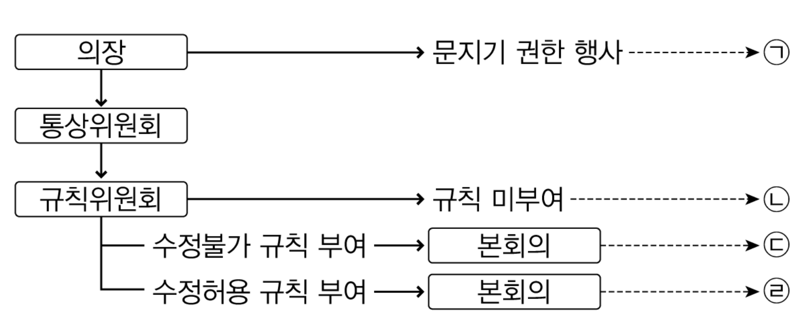
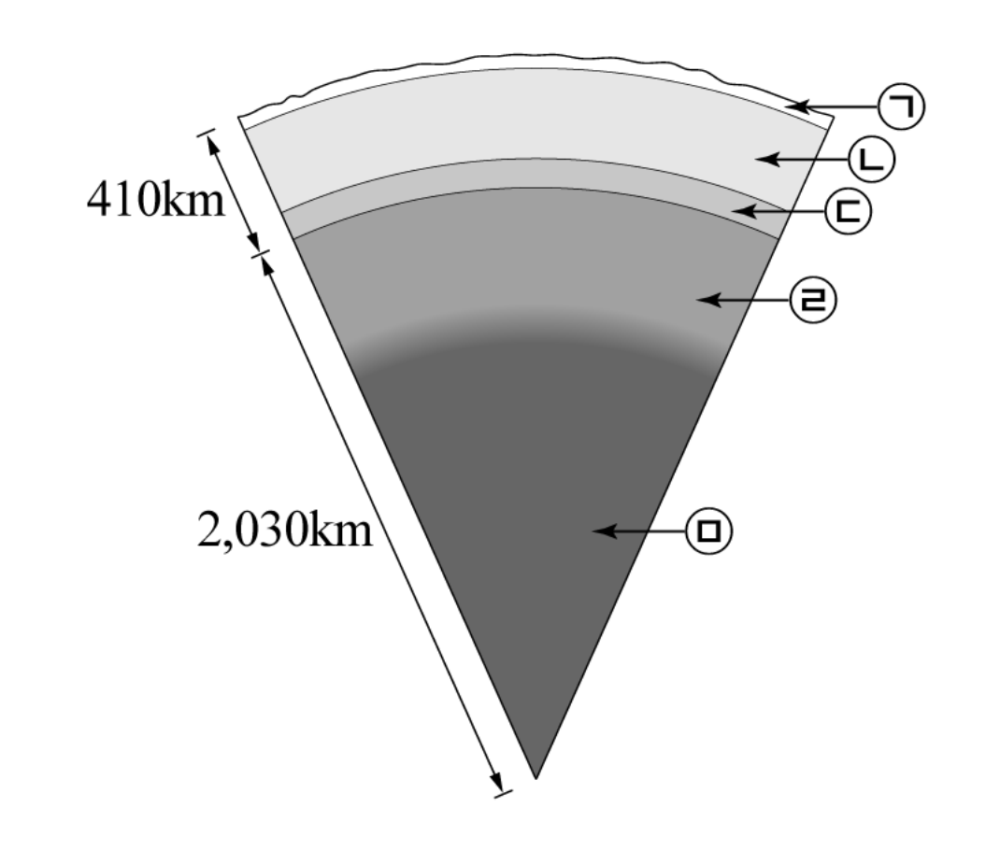
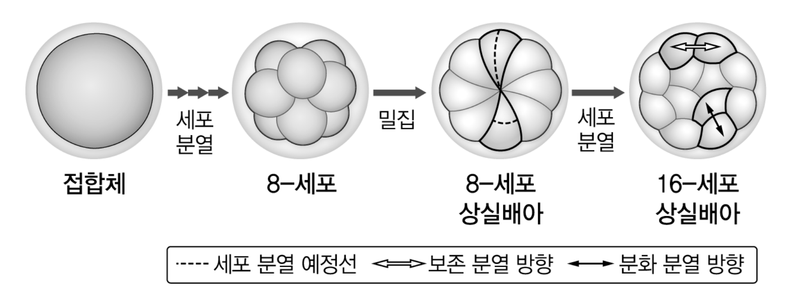

# [01-03] LU (2013)

## 01

<보기>는 ‘막다’의 용례들이다. 밑줄 친 부분의 문맥상 의미에 대립하는 말을 순서대로 나열한 것은?

### 보기

ㄱ. 경비원이 사람들의 출입을 <u>막았다</u>.  
ㄴ. 그는 큰 혼란을 <u>막았다</u>.  
ㄷ. 경찰이 도로를 <u>막았다</u>.

### 선택지

|  | ㄱ | ㄴ | ㄷ |
|---|---|---|---|
| (1) | 용납했다 | 초치했다 | 재개했다 |
| (2) | 수락했다 | 방치했다 | 개설했다 |
| (3) | 용인했다 | 야기했다 | 개방했다 |
| (4) | 허용했다 | 방기했다 | 개통했다 |
| (5) | 승낙했다 | 유발했다 | 공개했다 |

## 02

<보기>의 ㉠∼㉤을 바르게 고치지 <u>않은</u> 것은?

### 보기

얼마 전 한 지방 자치 단체가 특정 식품에서 나온 중금속의 양이 ㉠ <u>기준치보다 초과했다</u>고 발표했다. 그런데 식품 관련 주무 관청이 중금속 검출 방법에 문제가 있다며 이 발표를 반박하였다. 인터넷에는 이 사안에 대한 항의성 댓글이 수없이 ㉡ <u>달려졌다</u>. 국민의 건강과 직결되는 식품과 관련된 내용을 ㉢ <u>발표한 경우</u>에 해당 기관은 매우 신중해야 한다. ㉣ <u>설령</u> 논란이 예상된다면, ㉤ <u>각 관계 기관끼리</u> 협의하여 최종적으로 검증된 내용만을 시민들에게 알려야 소비자의 불안감이 줄어들 것이다.

### 선택지

(1) ㉠ : 기준치를 초과했다

(2) ㉡ : 달렸다

(3) ㉢ : 발표할 경우

(4) ㉣ : 설혹

(5) ㉤ : 관계 기관끼리

## 03

어법상 가장 적절한 문장은?

### 선택지

(1) 어제 오후 장맛비가 그치지만 날이 개지는 않았다.

(2) 나는 오늘 아침에 급하게 부산에 갔다가 가는 도중에 돌아왔다.

(3) 내가 오늘 소포를 받았으니 그것은 아마도 이틀 전에 발송되었을 것이다.

(4) 그 축구팀은 지난해 신통치 못한 성적을 거두며 결국 감독이 교체되었다.

(5) 어제 보고서를 쓰러 도서관에서 자료를 찾았으나 정작 필요한 자료가 없었다.

# [04-06] LU (2013)

다음 글을 읽고 물음에 답하시오.

## 제시문

조선 성종 연간, 안정형의 아내 김 씨의 사내종 금동과 계집종 노덕은 김 씨의 옷을 훔치고 중 각돈의 옷을 가져온 뒤, 간통 현장에서 얻은 것이라며 추잡한 소문을 내었다. 이 과정에서 김 씨의 사내종 끝동이 금동의 말을 듣고 김 씨의 옷을 김 씨의 사내종 막동에게 전하여 맡아 두도록 하였다. 이 사건은 안정형의 사촌 형수인 간아가 김 씨를 내쫓고 싶어 꾸민 일이었고, 결국 무고로 밝혀졌다.

노비가 상전을 모해(謀害)한 데 대한 규정은 명률(明律)에 없다. 의금부에서는 노비들에 대하여 명률에 있는 다음 두 조문의 적용을 따져 보았다.

◦ 모반(謀叛 : 본국을 배반하고 타국을 몰래 따르려 모의함.)의 경우 공모자는 주범과 종범을 가리지 않고 모두 참형에 처하며, 알면서 자수하지 않은 자는 장 100, 유 3,000리에 처한다.

◦ 모반대역(謀反 : 사직을 위태롭게 하려 모의함. 大逆 : 종묘, 왕릉, 궁궐을 훼손하려 모의함.)의 경우 공모자는 주범과 종범을 가리지 않고 모두 능지처사하며, 실정을 알면서 고의로 숨겨 준 자는 참형에 처한다.

의금부는 결국 간아는 장 100, 유 3,000리, 금동과 노덕은 참형, 막동과 끝동은 장 100, 유 3,000리로 처결하는 것이 좋겠다는 계본을 올렸다. 그런데 막동과 끝동의 형량에 대해서는 큰 논의가 있었다. 이를 『조선왕조실록』의 기사에서 발췌하면 아래와 같다.

[성종 8년 12월 23일]

동부승지 이경동이 의금부의 계본을 가지고 와서 아뢰었다.

“종 끝동이 금동의 말을 듣고 실정을 알면서도 상전과 각돈의 의복을 막동에게 가져다 준 죄와 종 막동도 또한 그러한 사정을 알면서도 맡아 둔 죄는 형이 장 100, 유 3,000리에 해당합니다.”

임금이 좌우에 “어떠한가?” 하고 물었다.

영의정 정창손이 대답하기를 “막동과 끝동이 필시 그 모의를 알았으니 그 죄도 사형에 해당합니다.” 하자, 임금은 “그렇지.”라고 말하였다.

이경동이 아뢰었다.

“모반(謀叛)이더라도 그 모의에 참여한 게 아니면 죽이지는 않습니다.”

임금이 말하였다.

“그 말은 본국을 배반하고 타국을 몰래 따르려 했다는 것이지, 사직을 위태롭게 하려 한 죄가 아니라는 게로구나. 사직을 뒤흔들려는 모의가 있고 그것을 아는 자가 있다면, 모의에 참여하지 않았다고 해서 죽이지 못할 게 뭐 있겠는가? 막동들이 상전을 모해한 일은 이와 무엇이 다른가?”

좌참찬 임원준과 지평 강거효도 “막동과 끝동이 그 죄에 참여하여 알았으니 죽여야 마땅한 일입니다.”라고 호응하였다.

형조 참의 이맹현이 아뢰었다.

“율문에서는 모의에 참여한 경우에는 죽이고 그 모의를 안 경우에는 장을 쳐 유배하도록 합니다. 여기서 ‘모의에 참여한 경우’란 처음부터 그 모의에 참여한 것을 말하고, ‘그 모의를 안 경우’란 뒤에 그 모의를 알았다는 것입니다. 지금은 형률상 사형에 이르지 않으니 죽이는 것은 아직 안 됩니다. 다시 국문하여 죄를 정하옵소서.”

임금은 “막동과 끝동이 사형인 데에는 의심이 없지만, 공경들과 더불어 널리 의논해 보자.”라고 말하였다.

[성종 8년 12월 24일]

임금이 여러 정승과 육조의 당상을 불러들였다. 대간(臺諫)에서 간아와 관련된 자들은 사형에 해당한다고 하자, 임금이 말하였다.

“사형의 죄는 지극히 중대한 것이기 때문에 경들과 더불어 의논하고자 하니 말들 해 보라.”

달성군 서거정이 아뢰었다.

“막동은 안정형 집의 늙은 종으로 옷을 맡아 주었고, 끝동은 금동의 말에 따라 옷을 받아다 주었으니, 모두 사정을 아는 이들입니다. 지금 ‘알면서 자수하지 않은’ 데 해당하는 율을 적용하려는 것은 잘못입니다. 이 종들은 ‘실정을 알면서 숨겨 준 죄’로써 죽여야 마땅합니다.”

영돈녕부사 노사신이 아뢰었다.

“끝동은 나이 어리고 어리석으니 그 주인의 의복을 가지고 왕래하였다 한들 저가 어찌 그 주인을 모해하려는 것인 줄 알았겠습니까? 죽여서는 안 됩니다.”

서거정이 맞섰다.

“나라의 난신과 집안의 역노(逆奴)는 마찬가지입니다. 끝동이 이미 주인을 해치는 데 간여하였는데 죽인들 뭐가 해롭겠습니까?”

이승소가 아뢰었다.

“죄가 의심스러우면 가벼운 쪽으로 정해야 합니다. 끝동은 모르는 놈입니다. 어찌 그렇게까지 죄를 정할 수 있겠습니까?”

많은 신료들의 의견이 서거정을 따랐다. 임금이 말하였다.

“죽여야 할 것을 죽이지 않는 일도 옳지 못하고, 죽이지 않을 것을 죽이는 일도 옳지 못하다. 막동과 끝동은 사형에 처하는 것이 매우 법에 합당하다. 막동과 끝동은 적용 조문을 바꾸도록 하고, 나머지는 올린 대로 시행하라.”

의금부가 적용 조문을 바꾸어 막동과 끝동을 참형의 율로 처결하도록 아뢰니 그대로 윤허하였다.

## 04

의금부에서 노비들의 죄를 논할 때, 전제로 삼은 명률 규정의 내용으로 적절한 것은?

### 선택지

(1) 꼭 맞는 율문이 없는 경우, 가장 가까운 율문을 끌어다 따져 보고 적용할 죄명을 정한다.

(2) 죄로 규정되지 않았던 행위가 새로 제정된 율문에 죄라고 정해진 경우, 새 율문에 따라 처벌한다.

(3) 국왕이 특별히 처단한 사례라도 법조문화되지 않았을 경우, 그것을 율문으로 삼아 끌어들이지는 못한다.

(4) 마땅히 해서는 안 되는 짓을 하였는데도 그에 해당하는 율문이 없는 경우, 따로 율문을 제시하지 않고서 처벌할 수 있다.

(5) 하나의 행위로 두 율문의 죄를 범했을 경우, 그 가운데 무거운 죄로 처벌하며, 두 죄의 경중이 같으면 그 하나로 처벌한다.

## 05

위 글에서의 법 적용과 관련된 내용으로 맞지 <u>않는</u> 것은?

### 선택지

(1) 간아는 김 씨와 노주(奴主) 관계가 아니어서 간아에 대하여 모반(謀叛)이나 모반대역은 적용되지 않는다.

(2) 금동과 노덕에 대하여는 의금부에서 올린 대로 결정되었으므로, 이들의 죄는 모반(謀叛)으로 판정되었다고 볼 수 있다.

(3) 막동의 죄를 모반(謀叛)이라 보는 쪽은 막동이 김 씨를 해하려 했다는 것보다는 간아와 내통했다는 것에 주안점을 둔다.

(4) 끝동의 죄를 모반대역이라 보는 쪽은 끝동이 모해의 실정을 알았다면 사형에 처해야 한다는 입장이다.

(5) 막동과 끝동의 행위가 모해를 공모한 것으로 판정된 까닭에 의금부는 적용 조문을 바꾸어 사형에 처할 수밖에 없었다.

## 06

위 글에서 판결을 이끄는 성종에 관한 설명으로 적절하지 <u>않은</u> 것은?

### 선택지

(1) 사형 판결과 관련하여 조정의 공론을 거치려는 것으로 보아 국왕의 결정에 대한 정당성을 강화하려고 한다.

(2) 노비의 상전을 사직에까지 견주려 하는 것으로 보아 가(家)의 위계질서를 국(國)의 위계질서에 준하는 것으로 여긴다.

(3) 여러 반론 속에서 사형의 입장을 견지하는 것으로 보아 소수 의견이라도 그것이 옳다면 적극 수용해야 한다고 생각한다.

(4) 의금부가 올린 계본에 대하여 적용 조문을 바꾸어 처결하라는 것으로 보아 법규에 근거한 법 집행의 원칙을 염두에 둔다.

(5) 동부승지 이경동의 견해에 대해 모반대역의 적용을 따져 보아야 한다는 것으로 보아 적용 조문들의 차이를 정확하게 안다.

# [07-09] LU (2013)

다음 글을 읽고 물음에 답하시오.

## 제시문

최적통화지역은 단일 통화가 통용되거나 여러 통화들의 환율이 고정되어 있는 최적의 지리적인 영역을 지칭한다. 여기서 최적이란 대내외 균형이라는 거시 경제의 목적에 의해 규정되는데, 대내 균형은 물가 안정과 완전 고용, 대외 균형은 국제수지 균형을 의미한다.

최적통화지역 개념은 고정환율 제도와 변동환율 제도의 상대적 장점에 대한 논쟁 속에서 발전하였다. 변동환율론자들은 가격과 임금의 경직성이 있는 국가에서 대내외 균형을 달성하기 위해서는 변동환율 제도를 택해야 한다고 주장했다. 반면 최적통화지역 이론은 어떤 조건에서 고정환율 제도가 대내외 균형을 효과적으로 이룰 수 있는지 고려했다.

초기 이론들은 최적통화지역을 규정하는 가장 중요한 경제적 기준을 찾으려 하였다. 먼델은 노동의 이동성을 제시했다. 노동의 이동이 자유롭다면 외부 충격이 발생할 때 대내외 균형 유지를 위한 임금 조정의 필요성이 크지 않을 것이고 결국 환율 변동의 필요성도 작을 것이다. 잉그램은 금융시장 통합을 제시하였다. 금융시장이 통합되어 있으면 지역 내 국가들 사이에 경상수지 불균형이 발생했을 때 자본 이동이 쉽게 일어날 수 있을 것이며 이에 따라 조정의 압력이 줄어들게 되므로 지역 내 환율 변동의 필요성이 감소하게 된다는 것이다. 한편 케넨은 재정 통합에 주목하였다. 초국가적 재정 시스템을 공유하는 국가들은 일부 국가의 경제적 어려움에 재정 지출로 대응할 수 있다는 점에서 역시 환율 변동의 필요성이 감소한다. 이러한 주장들은 결국 고정환율 제도 아래에서도 대내외 균형을 달성할 수 있는 조건들을 말해 주고 있는 것이다.

이후 최적통화지역 이론은 위의 조건들을 종합적으로 판단하여 단일 통화 사용에 따른 비용-편익 분석을 한다. 비용보다 편익이 크다면 최적통화지역의 조건이 충족되며 단일 통화를 형성할 수 있다. 단일 통화 사용의 편익은 화폐의 유용성이 증대된다는 데 있다. 거래 비용이 줄고, 환율 변동의 위험이 없어지며, 가격 비교가 쉬워진다는 점에서 단일 화폐의 사용은 시장 통합에 따른 교환의 이익을 증대시킨다는 것이다. 반면에 통화정책 독립성의 상실이 단일 통화 사용에 따른 주요 비용으로 간주된다. 단일 통화의 유지를 위해 대내 균형을 포기해야 하는 경우가 발생하기 때문이다. 이 비용은 가격과 임금이 경직될수록, 전체 통화지역 중 일부 지역들 사이에 서로 다른 효과를 일으키는 비대칭적 충격이 클수록 증가한다. 가령 한 국가에는 실업이 발생하고 다른 국가에는 인플레이션이 발생하면, 한 국가는 확대 통화정책을, 다른 국가는 긴축 통화정책을 원하게 되는데, 양 국가가 단일 화폐를 사용한다면 서로 다른 통화정책의 시행이 불가능하기 때문이다. 물론 여기서 노동 이동 등의 조건이 충족되면 비대칭적 충격을 완화하기 위한 독립적 통화정책의 필요성은 감소한다. 반대로 두 국가에 유사한 충격이 발생한다면 서로 다른 통화정책을 택할 필요가 줄어든다. 이 경우에는 독립적 통화정책을 포기하는 비용이 감소한다.

최근 ㉠ 유로 지역의 경제 위기는 최적통화지역 조건을 충족하지 못한 유로 지역 내 국가 간 불균형을 분명히 드러내는 계기가 되었다. 유로 지역 내 노동 이동이 일국 내의 이동만큼 자유롭지 않다는 점 등을 이유로 유로 지역은 최적통화지역이 되지 못한다는 지적이 이미 오래 전부터 제기되었다. 더욱이 유로화 등장 이후 유로 지역 내에서 해외 투자 리스크가 사라지면서 유럽의 핵심국에서 유럽의 주변국으로 엄청난 자본 이동이 발생하였고, 그 때문에 주변국에는 경기 과열이 발생했다. 그러나 글로벌 금융 위기 이후 자본 이동이 중단되자 주변국은 더 이상 호황을 지탱하지 못하고 경제 상황이 악화되면서 실업과 경상수지 적자를 경험하게 되었다. 환율 조정 수단을 상실한 유로 지역은 핵심국과 주변국 사이의 불균형을 쉽게 해결하지 못하는 모습을 보여 주게 된 것이다.

더구나 최적통화지역 이론이 큰 관심을 보이지 않았던 은행 문제까지 부각되었다. 은행 채무를 국가가 떠맡으면서 GDP 대비 공공 부채의 비율이 증가하였고, 이로 인하여 국가 채무 불이행에 대한 불안이 가속되었으며 이는 다시 국채를 보유하고 있는 민간 은행의 신뢰까지 손상을 입혔다. 이들 은행이 보유한 국채를 매각하려 함에 따라 국채 가격이 더욱 하락하는 악순환이 이어지고 있다.

## 07

위 글에서 ‘최적통화지역 이론’과 관련하여 고려하지 <u>않은</u> 것은?

### 선택지

(1) 시장 통합으로 인한 편익의 계산 방식

(2) 환율 변동을 배제한 경상수지 조정 방식

(3) 화폐의 유용성과 시장 통합 사이의 관계

(4) 단일 화폐 사용에 따른 비용을 증가시키는 조건

(5) 독립적 통화정책 없이 대내 균형을 달성하는 조건

## 08

위 글에 따를 때, ㉠에 대한 해결 방안으로 보기 <u>어려운</u> 것은?

### 선택지

(1) 주변국의 임금을 인하한다.

(2) 장기적으로 주변국의 공공 부채 비율을 줄여 나간다.

(3) 유로 지역 전체에 초국가적 재정 시스템을 구축한다.

(4) 핵심국으로부터 주변국으로의 자본 이동을 활성화한다.

(5) 유로 지역 외부로부터 핵심국으로 노동 이동을 활성화한다.

## 09

<보기>와 같은 상황을 설명한 것으로 적절하지 <u>않은</u> 것은?

### 보기

A, B, C, D 국가로만 이루어진 세계를 상정하고, 이들 국가에서 노동만을 생산 요소로 사용한다고 가정한다. A국은 x통화, B국은 y통화, C, D국은 z통화를 사용한다. A와 B국 사이에만 노동 이동이 가능하다. 국가들 사이에 금융시장과 재정은 통합되어 있지 않다. A, C국은 목재를, B, D국은 자동차를 생산하여 수출한다. 이 세계에서 자동차 수요가 증가하고 목재 수요가 감소하였다. 가격과 임금의 경직성이 존재할 때 A, C국에서 실업이 발생하고, B, D국에서 인플레이션이 발생한다.

### 선택지

(1) A와 B국에는 비대칭적 충격이 발생하였으나 노동의 이동이 가능하므로 최적통화지역의 조건을 충족한다.

(2) A와 C국에는 서로 유사한 충격이 발생하였으므로 노동의 이동 여부와 무관하게 최적통화지역의 조건을 충족하지 못한다.

(3) A와 D국에는 비대칭적 충격이 발생하였고 노동의 이동도 불가능하므로 최적통화지역의 조건을 충족하지 못한다.

(4) B와 D국에는 서로 유사한 충격이 발생하여 독립적 통화정책의 포기에 따른 비용이 없으므로 최적통화지역의 조건을 충족한다.

(5) C와 D국은 단일 통화를 사용하고 있으나 비대칭적 충격을 해소할 수 없으므로 최적통화지역의 조건을 충족하지 못한다.

# [10-12] LU (2013)

다음 글을 읽고 물음에 답하시오.

## 제시문

의회는 국가 정책을 결정하는 대의제 민주주의의 주요 기관이다. 미국 하원을 예로 들어 의회의 입법 과정을 설명하면 다음과 같다.

[A]

발의된 의안은 본회의 의장이 관련 상임위원회에 회부한다. 이때 의장은 의안 회부를 거부할 수 있는 문지기 권한을 지닌다. 소관 상임위원회에 상정된 의안은 수정안 제출을 포함한 심사 과정을 거쳐 합의에 이르면 과반 표결로 의결되는데, 합의에 이르지 못하면 사장된다. 상임위원회를 통과한 의안은 규칙위원회를 통과해야 한다. 규칙위원회는 본회의 의결 과정에서 수정을 전혀 허용하지 않는 수정불가 규칙 또는 무제한 수정을 허용하는 수정허용 규칙을 부여한다. 단, 규칙이 부여되지 않으면 의안은 사장된다. 본회의에 의안이 상정되면 수정불가 규칙이 부여된 경우는 가부 표결만 하며, 수정허용 규칙이 부여된 경우는 수정안이 제출되면 심사 활동을 거쳐 일반적으로 최종 수정안부터 제출된 순서의 역순으로 가부 표결을 하게 된다. 표결은 대개 과반 표결로 한다.

입법 과정은 의원들의 정치적 대표 체계의 다중성 때문에 역동적으로 나타난다. 예를 들어, 소선거구제에서 선출된 의원들은 국민 전체의 대표이자 지역구민의 대표이고, 정당의 구성원으로서 소속 정당 지지자의 대표이기도 하다. 이러한 상황은 입법 과정의 각 단계에서 교차 압력으로 작용하여 입법 과정을 설명하거나 예측하기 어렵게 만든다. 이 같은 역동성을 상임위원회를 중심으로 설명하는 이론에는 다음 세 가지가 있다.

첫째, 이익분배 이론은 의원들의 지역구 대표성에 주목한다. 일반적으로 의원들은 자신의 지역구 이해관계를 가장 잘 대변하는 상임위원회를 자율적으로 선택하는데, 이로써 각 상임위원회는 이해관계가 유사한 지역구 의원들이 모이게 되어 강한 정책적 동질성을 가진다. 그러나 정작 상임위원회들 사이는 이해관계가 다르게 되므로 갈등 상황에 놓이게 된다. 이익분배 이론은 이러한 갈등을 해소하는 주요한 기제로 의원들 간의 지지의 교환을 든다. 가령, 지역구 이해의 강한 수요자로 서로 다른 상임위원회에 소속된 갑과 을 의원의 경우를 생각해 보자. 본회의에서 다른 상임위원회 소속 의원들의 지지를 받아야 하는 처지인 갑 의원은 을 의원에게 지원을 약속하며 그 대가로 자신의 지역구를 위한 정책을 지지해 줄 것을 요청할 것이다. 이는 상임위원회 간에 혜택의 상호 교환이 발생함을 의미하며, 결국 본회의는 상임위원회 간 혜택 교환의 약속이 투표 거래로 실현되는 장이 된다. 이 과정에서 의회 다수나 다수당의 영향력은 상당히 축소된다.

둘째, 정보확산 이론은 의회 다수의 정책 선호를 강조한다. 의회는 지역구 수요를 위한 이익의 할당 차원을 넘어 국민 전체를 위한 본회의 중심의 입법 활동을 원활하게 할 목적을 지닌다. 이를 위해 정보확산 이론은 상임위원회가 입법 과정의 주요한 원칙인 다수주의에 의거하여 의회 다수가 원하는 방향으로 조직되어야 한다고 본다. 이 경우 상임위원회 배정 단계에서부터 본회의 주도로 각 정당의 협조를 이끌어 내는 정당 간 협의회의 역할이 중요해진다. 그리하여 각 상임위원회는 본회의의 대리인이 되어 본회의에서 의결할 정책에 대한 구체적인 정보를 생산한다. 발의된 의안이 입법화되어 집행된다면 국민 전체의 이익에 어떤 영향을 미칠지 매우 불확실한데, 상임위원회는 그러한 불확실성을 줄이기 위해 축적된 전문적 정보를 본회의의 심사 과정에 제공하는 역할을 한다.

셋째, 정당이익 이론은 의원이 정당 지지자를 대표하게 하는 정당의 역할을 중시한다. 입법 활동에 따른 정책 결과는 정당의 미래 선거에 큰 영향을 미친다. 정당은 의정 활동 결과를 최대화해 자신의 입법 성과로 지지자들에게 제시함으로써 대표성을 실현하고자 한다. 이는 동일 정당에 소속된 의원들로 하여금 다가올 선거에서 운명을 공유할 수밖에 없도록 만든다. 공동 이익의 추구는 정당 지도부의 권한을 강화하는 유인이 되며, 이는 다수당에 더욱 중요하다. 상임위원회 활동은 입법 과정 초기에 일어나는 반면, 본회의에서는 소수당의 수정안 제출 등 반대 활동이 활발하게 제기될 수 있으므로, 정당 지도부는 상임위원회 구성과 운영에서부터 주도권을 행사하려 한다. 즉 당내 의원 총회에서 의원들을 각 상임위원회에 배정하는 과정에 적극 관여하며 정당의 핵심 프로그램을 담당하는 상임위원회의 활동을 지속적으로 감독한다. 여기서 정당 지도부는 지역구의 이해관계에 민감하거나 본회의에서 소수당에 동조하는 다수당 의원들의 이탈을 방지하는 안정자 기능을 하며, 결국 상임위원회를 다수당의 대리인으로 만든다.

이처럼 상호 경쟁하는 세 가지 이론은 대의제 민주주의가 생산해 내는 정책의 본질과 성격에 대한 이해를 넓혀 주고 있다.

## 10

위 글의 내용과 일치하지 <u>않는</u> 것은?

### 선택지

(1) 본회의 의결 과정에서 이익분배 이론은 정당 간의 투표 거래를 강조하나 정보확산 이론은 의회 다수의 정책 선호를 강조한다.

(2) 상임위원회의 기능에서 이익분배 이론은 이해관계의 수요자 측면을 강조하나 정보확산 이론은 정책 정보의 공급자 측면을 강조한다.

(3) 의원의 상임위원회 배정 문제에 있어 이익분배 이론은 의원들의 자율적 선택을 강조하나 정보확산 이론은 정당 간 협의회의 역할을 강조한다.

(4) 의원의 정치적 대표성에서 이익분배 이론은 지역구 대표성을 강조하나 정당이익 이론은 정당 지지자 대표성을 강조한다.

(5) 상임위원회 활동에 있어 정보확산 이론은 정책의 불확실성을 줄이는 것을 강조하나 정당이익 이론은 정당의 입법 성과를 최대화하는 것을 강조한다.

## 11

‘규칙위원회’의 규칙 부여와 관련한 <보기>의 추론 중 적절한 것만을 있는 대로 고른 것은?

### 보기

ㄱ. 이익분배 이론의 관점에서, 수정허용 규칙은 수정불가 규칙에 비해 본회의에서 상임위원회 간 투표 거래를 활성화하여 지역구에 혜택을 주는 정책을 더 많이 생산하게 만들 수 있다.

ㄴ. 정보확산 이론의 관점에서, 수정허용 규칙은 수정불가 규칙에 비해 본회의에서 지역구에 대한 혜택을 줄이고 국민 전체를 위한 정책을 더 많이 생산하게 만들 수 있다.

ㄷ. 정당이익 이론의 관점에서, 수정불가 규칙은 수정허용 규칙에 비해 상임위원회를 다수당의 대리인으로 만들어 본회의에서 다수당 지지자들을 위한 정책을 더 많이 생산하게 만들 수 있다.

### 선택지

(1) ㄱ

(2) ㄴ

(3) ㄱ, ㄷ

(4) ㄴ, ㄷ

(5) ㄱ, ㄴ, ㄷ

## 12

<보기>와 같은 경우를 가정할 때, 위 글의 [A]에 따라 정리한 <그림>의 각 단계에서 결정될 정책을 바르게 나열한 것은?

### 보기

아래 <표>와 같이 구성된 의회에서 의원 갑이 ‘정책1’을 발의했다. 현재는 ‘정책2’가 시행되고 있으며 본회의 의장은 ‘정책2’를 선호한다. 의원들은 기권 없이 자신의 정책 선호와 가장 가까운 의안에 투표한다.

<표> 정책 선호에 따른 통상위원회와 본회의의 구성

| 무역 규제 | 정책 | 통상위원회 | 본회의 |
|---|---|---:|---:|
| 강화 | 정책1 | 13명 | 50명 |
| 유지 | 정책2 | 6명 | 70명 |
| 완화 | 정책3 | 6명 | 125명 |
| 합계 |  | 25명 | 245명 |

<그림>

입법 과정의 흐름도

<이미지 포함됨>

### 선택지

|  | ㉠ | ㉡ | ㉢ | ㉣ |
|---|---|---|---|---|
| (1) | 정책1 | 정책1 | 정책1 | 정책3 |
| (2) | 정책1 | 정책1 | 정책2 | 정책1 |
| (3) | 정책2 | 정책1 | 정책1 | 정책2 |
| (4) | 정책2 | 정책2 | 정책2 | 정책3 |
| (5) | 정책2 | 정책2 | 정책3 | 정책2 |

# [13-15] LU (2013)

다음 글을 읽고 물음에 답하시오.

## 제시문

인격 완성과 도덕적 실천을 중시한 송대 유학자들에게 심(心)은 중요한 철학적 문제였다. 남송 시대의 주희는 심의 작용에 주목하여 미발이발(未發已發)과 체용(體用)의 논리를 근거로 ㉠ <u>심통성정론(心統性情論)</u>을 제시했다. 미발과 이발은 희로애락(喜怒哀樂)과 같은 감정이 심에서 드러나는 과정을 드러나기 이전과 이후로 나누어 설명하는 개념이다. 체용은 본체와 작용으로서, 동일한 사물의 서로 구별되지만 나누어질 수 없는 관계를 가리킨다.

주희는 일신의 주재자인 심에는 인식이 성립하는 과정을 기준으로 하여 미발과 이발의 두 단계가 있다고 주장한다. 그는 심을 이발로만 보던 관점을 극복하고, 지각 작용이 시작하기 이전이 미발 상태이며 그 이후가 이발이라고 보았다. 나아가 그는 감정의 문제를 논하기 위해 심의 본체와 작용으로 각각 성(性)과 정(情)을 규정하고, 정은 성이 드러난 것이요 성은 정의 근거라고 보았다. 이러한 주장을 토대로 심이 성과 정을 통괄하는 총체라는 심통성정론을 구축했다.

심이 성과 정을 통괄한다는 것은 심이 성과 정을 겸하고 있다는 것과 심이 성과 정을 각각 주재한다는 두 가지 의미를 지니고 있다. 감정이 드러나기 이전에 심은 성이 온전한 모습을 유지하도록 주재하고, 감정이 드러나는 단계에서 심은 정이 올바르게 드러나도록 주재하여 도덕적 행위가 가능하도록 한다는 것이다.

주희는 인간이 천리(天理)와 일치하는 순선무악한 천명지성(天命之性)을 하늘로부터 부여받았을 뿐만 아니라 육체라는 기(氣)의 요인을 가진 기질지성(氣質之性)을 타고났다고 보았다. 천명지성은 도덕의 근거이지만, 기질지성은 주어진 청탁후박(淸濁厚薄)의 기질적 차이로 이익의 추구나 감각적 욕구에 빠져 드는 악한 감정의 뿌리가 된다. 기질지성은 성(性)이라는 면에서는 이(理)의 성격을 지니지만 기질이라는 면에서는 기(氣)의 성격을 지니고 있다. 그렇다고 해서 기질지성이 천명지성과 별도로 존재한다는 것은 아니다. 주희가 이러한 주장을 하게 된 것은 인간의 본성이 필연적으로 기질의 영향을 받을 수밖에 없다는 점을 강조하려 했기 때문이다. 즉 도덕적 행위가 가능하기 위해서는 기질지성을 변화시켜 천명지성을 보존해야 한다는 것이다.

심통성정론은 기질지성을 지닌 인간이 어떻게 본성을 발휘하여 도덕적 감정을 실현할 수 있을지에 대답하기 위한 주희의 해결책이다. 심은 정이 드러나기 이전 단계에서 자신의 본체이기도 한 성을 어떻게 주재할 것인가? 주희가 이러한 난문을 해결하기 위해 도입한 방법은 경(敬)을 통한 품성의 함양이었다. 경은 항상 깨어 있으라는 상성성(常惺惺)과 엄숙한 자세인 정제엄숙(整齊嚴肅) 등의 방식으로 흐트러지기 쉬운 심을 한곳에 잡아 두는 것이다. 예법의 준수와 용모의 단정 등과 같은 행위 또한 심성에 영향을 미치므로 경에 들어가는 방도로 인정된다. 품성을 함양하는 경의 단계는 심이 미발일 때이며, 이발일 때는 격물치지(格物致知)의 단계이다. 격물은 구체적인 사물이나 사태에 나아가 하나씩 원리를 궁구해 가는 과정이며, 치지는 이러한 탐구를 통해 점진적으로 학습한 원리가 보편적 원리와 일치함을 깨달아 가는 과정이다. 누적된 지식은 비약적으로 확장하여 만물의 원리를 일관하는 천리와 합일한다. 심의 원리인 성이 천리와 합일하는 것이 주희가 제시한 성즉리(性卽理)의 철학이었다. 이처럼 주희는 미발일 때의 함양과 이발일 때의 격물이라는 수양론을 제시하면서 사회적 실천은 이러한 수양을 전제로 한다고 주장했다.

주희가 제시한 격물의 대상은 조수초목(鳥獸草木)과 윤상 규범(倫常規範)에 이르기까지 광범하였지만, 그 방법은 주로 성현이 이미 원리를 기록해 둔 경전의 학습이었다. 주희의 격물론은 도덕의 원리를 탐구하는 지적인 과정이고 최종의 목표는 인격 완성이었기 때문에 그는 미발 단계에 설정해 두었던 함양 공부를 이발 단계의 공부에까지 확장하여 수양론을 완성했다. 주희의 철학은 심성에 관한 치밀한 분석을 통해 천리에 따르는 인간의 길을 제시했고, 명리(名利)를 좇아가는 세상을 도덕적 사회로 바꾸고자 했다.

## 13

㉠에 대한 이해로 바르지 <u>않은</u> 것은?

### 선택지

(1) 희로애락이라는 감정은 희로애락의 본성에서 나온다.

(2) 희로애락의 본성은 체이고 희로애락이라는 감정은 용이다.

(3) 기질지성으로부터 나오는 희로애락이라는 감정은 순선하지 않다.

(4) 심이 미발일 때 희로애락의 본성은 본래의 상태로부터 벗어나 있다.

(5) 이발 상태의 심은 희로애락이라는 감정이 올바르게 드러나도록 주재한다.

## 14

주희의 수양론으로 바르지 <u>않은</u> 것은?

### 선택지

(1) 행동거지는 마음의 발현이므로 윤리적 규범에 따라 행동하고자 한다.

(2) 사회적 실천을 우선시하면서 경을 통해 경전을 학습하여 진리를 탐구하고자 한다.

(3) 사물의 이치를 궁구하는 데에는 마음가짐이 중요하므로 품성의 도야에 힘쓰고자 한다.

(4) 타고난 마음의 선한 뿌리가 사라지지 않도록 항상 깨어 있는 자세를 유지하고자 한다.

(5) 자연 및 사회 현상의 원리에 대한 탐구를 통해 궁극적으로 도덕 원리의 파악에 이르고자 한다.

## 15

위 글에 따를 때, 주희의 문제의식으로 볼 수 <u>없는</u> 것은?

### 선택지

(1) 경전 학습이 도덕적 인간에 이르는 방법이 될 수 있을까?

(2) 인간이 악한 행동이나 나쁜 감정을 보이는 이유는 무엇일까?

(3) 세상 만물을 관통하는 근본적 원리를 어떻게 파악할 수 있을까?

(4) 천리와 인도의 위상을 바꾸어 주체적인 삶을 영위하는 방법은 무엇인가?

(5) 이익을 좋아하는 경향이 있는 세상을 어떻게 도덕적 사회로 만들 수 있을까?

# [16-18] LU (2013)

다음 글을 읽고 물음에 답하시오.

## 제시문

맥베스 부인 : 무슨 소식이냐?

전령 : 폐하께서 오늘 밤 이곳에 오십니다.

맥베스 부인 : 무슨 헛소리냐? 네 주인이 폐하와 함께 계시지 않느냐? 그렇다면 준비하라 알리셨을 텐데.

전령 : 맞습니다. 영주님도 오십니다. 제 동료 하나가 앞질러 오느라 숨이 차 죽을 지경이 되어 간신히 그 말만 전했습니다.

맥베스 부인 : 기쁜 소식이니 저자를 잘 돌보아라. (전령 퇴장) 내 성벽 안으로 덩컨이 죽으러 오는 것을 알리려고 까마귀도 목이 쉬었구나. 살인을 다스리는 악령들아, 어서 와서 나의 성(性)을 지운 뒤 나를 머리끝에서 발끝까지 가장 끔찍한 잔인함으로 가득 채워 다오! 내 피를 탁하게 만들어 연민에 이르는 입구와 통로를 막아 다오! 인륜이 양심의 가책으로 찾아와 잔인한 내 목표를 흔들거나, 목표와 성취 사이에 끼어들지 못하게 말이다. 살인의 정령들아, 보이지 않는 모습으로 너희가 어디서 자연의 악행을 시중들든 간에 내 가슴으로 와 쓸개즙 대신 내 젖을 빨아라! 짙은 밤아, 이리 와서 지옥의 가장 검은 연기로 네 몸을 휘감아 내 날카로운 칼이 자신이 내는 상처를 보지 못하게 하라! 하늘이 어둠의 장막 사이로 엿보고 “멈추어라! 멈추어라!”라고 외치지 못하게 하라! (맥베스 등장) 위대하신 글래미스 영주님! 훌륭하신 코도어 영주님! 그 둘보다 위대해지셔서 장차 만인의 환영을 받으실 분! 당신 편지가 이 무지한 현재 저편으로 나를 옮겨 나는 지금 바로 미래를 느껴요.

맥베스 : 여보, 덩컨이 오늘 밤 여기 온다오.

맥베스 부인 : 그래서 언제 떠나죠?

맥베스 : 내일이오. 예정은 그렇소.

맥베스 부인 : 아, 태양이 결코 그런 아침을 보지 못하기를! 여보, 당신 얼굴은 책과 같아서 낯선 것이 있으면 읽을 수 있어요. 세상을 속이려면 세상처럼 보이세요. 눈과 손과 혀에 환영을 담으세요. 순수한 꽃처럼 보이면서 그 밑에 숨은 뱀이 되라는 말이에요. 폐하께서 오시면 대접을 잘 해 드려야죠. 오늘 밤의 중요한 일은 나한테 맡기세요. 그러면 앞으로 올 모든 낮과 밤에 오로지 우리 두 사람이 주권과 지배권을 누릴 거예요.

맥베스 : 더 의논해 봅시다.

맥베스 부인 : 평온한 표정을 지어요. 안색을 계속 바꾸는 건 두려워한다는 거예요. 나머지는 다 나한테 맡기세요. (모두 퇴장)

(중략)

맥베스 : 일이 끝나고 나서 그걸로 끝이라면 빨리 끝내는 게 좋겠지. 암살로 후환을 얽어매고 왕을 죽여 성공을 포획할 수 있다면, ㉠ <u>이 일격이 모든 것이고 모든 것의 끝이라면</u>, 여기, 바로 여기, 시간의 강둑과 여울에서 내세를 걸고 모험하리라. 하지만 우리는 이곳에서도 심판을 받는다. 우리가 피로 얼룩진 가르침을 주면 그 가르침이 배운 뒤에 되돌아와 가르친 자를 괴롭히지. 공평한 정의의 여신은 우리의 독배에 든 술을 우리 입술에 갖다 댄다. 왕은 나를 두 겹으로 신뢰한다. 우선 나는 그의 친척이자 신하이므로 두 입장에서 모두 암살을 막아야 한다. 또한 나는 집주인으로서 암살자를 막으면 막았지 스스로 칼을 들 수는 없다. 게다가 덩컨 왕은 왕권을 온화하게 행사하고 왕의 직분을 잘못 없이 수행해서 그의 덕행이 그를 살해하려는 이 저주받을 일에 맞서 나팔 혀를 단 천사처럼 그를 옹호할 것이다. 그리고 연민이 벌거벗은 갓난아이처럼 돌풍에 걸터앉거나 하늘의 천사처럼 형체 없는 대기의 전령에 말 타듯 올라앉아 이 끔찍한 행위를 모두가 볼 수 있게 날려 보낼 테지. 그러면 눈물이 바람을 익사시킬 것이다. 내 의도의 옆구리를 찌를 박차는 오직 치솟는 야망 하나뿐인데, 너무 높이 뛰어올라 반대편에 떨어질까…….

(맥베스 부인 등장) 아니 웬일이오?

맥베스 부인 : 폐하께서 저녁 식사를 거의 마쳤어요. 왜 방에서 나갔어요?

맥베스 : 폐하가 날 찾으셨소?

맥베스 부인 : 몰라서 물어요?

맥베스 : 이 일은 그만둡시다. 폐하께서는 최근에 나에게 영예를 내리셨소. 나도 온갖 사람들에게서 금빛 여론을 사들였으니 ㉡<u>새것이라 반짝일 때 입고 싶지 빨리 벗어던지고 싶지는 않소.</u>

맥베스 부인 : 당신이 입고 있던 희망은 술에 취했었나요? 그 이후로 쭉 잠을 잤어요? 그러다 이제 깨어나서 한때 호탕하게 한 일을 ㉢ <u>얼굴이 노래지고 창백해져서 쳐다보나요?</u> 앞으로 당신 사랑은 그 정도라고 생각하겠어요. 욕망에 대해서나 행동과 용기에 대해서나 같은 사람이 되는 게 두려운 건가요? 당신이 인생의 금장식이라 생각하는 것을 갖고 싶지요? 그런데도 속담 속의 불쌍한 고양이처럼 “하고 싶어.”라고 하고는 “감히 못해.”라고 토를 달면서 스스로 보기에도 겁쟁이로 살겠다는 건가요?

맥베스 : 제발 조용히 하시오. 나는 남자다운 일이라면 무엇이든 할 수 있소. 나보다 더 잘 할 수 있는 사람은 없을 거요.

맥베스 부인 : 그러면 그때 당신은 어떤 짐승을 시켜서 나한테 이 거사에 대해서 귀띔한 거죠? 감히 그 일을 하겠노라 했을 때 당신은 남자였어요. 그리고 당신이 타고난 것 이상이 되기 위해 더욱더 남자다운 남자이고 싶어 했죠. 그때는 시간과 장소가 맞지 않아도 억지로 맞추려 하더니 이제 둘 다가 맞으니까 당신이 맞지 않네요. 젖 물린 적이 있어서 내 젖을 먹는 아기가 얼마나 사랑스러운지 알지만, 난 아기가 내 얼굴을 보며 웃고 있어도 이 없는 잇몸에서 젖꼭지를 뽑아내고 아기 머리통을 부숴 버렸을 거예요. 당신이 맹세했듯이 나도 그러겠노라 맹세했다면 말이죠.

맥베스 : 만약 우리가 실패한다면?

맥베스 부인 : 실패한다고요? 용기를 활시위에 걸어 팽팽히 당기기만 하면 실패할 리 없어요. 덩컨이 잠들면―종일 힘든 여행을 했으니 곯아떨어질 수밖에요―내가 그의 시종 두 명에게 술을 진탕 먹일 텐데. 그러면 뇌의 수호자인 기억은 연기가 되고 ㉣ <u>이성을 담아 둔 그릇은 증류기가 되겠죠.</u> 돼지처럼 잠에 빠져 술에 전 그자들의 이성이 죽은 듯 누워 있으면, 당신과 내가 무방비 상태인 덩컨에게 무엇인들 못하겠어요? 술 취한 시종들에게는 또 무엇인들 못하겠어요? 우리의 대역죄를 뒤집어씌울 자들인데요.

맥베스 : 아들만 낳으시오! 당신의 대담한 기질로는 남자만 만들 수 있을 테니. 우리가 잠든 두 시종에게 피를 묻히고 그들의 단검을 사용한다면 그자들이 한 짓처럼 보이지 않겠소?

맥베스 부인 : 그의 죽음 앞에서 우리의 비탄과 소란이 울려 퍼지게 하면 누가 감히 달리 받아들이겠어요?

맥베스 : 이제 결심했소. 이 끔찍한 일을 성사시키기 위해 온 힘을 다합시다. 가서 가장 그럴 듯한 외양으로 세상을 속이시오. ㉤ <u>거짓된 마음은 거짓된 얼굴로 숨겨야지.</u>

- 윌리엄 셰익스피어, 『맥베스』 -

## 16

㉠∼㉤의 문맥상 의미를 풀이한 것으로 적절하지 <u>않은</u> 것은?

### 선택지

(1) ㉠ : 거사에 실패해서 목숨을 잃는다면,

(2) ㉡ : 최근에 받은 찬사를 당분간 유지하고 싶소.

(3) ㉢ : 실천에 옮길 용기가 나지 않나요?

(4) ㉣ : 사태 판단을 전혀 할 수 없게 되겠죠.

(5) ㉤ : 진심을 숨기고 겉으로는 충성하는 척해야지.

## 17

맥베스 부인에 대한 설명으로 옳지 <u>않은</u> 것은?

### 선택지

(1) 덩컨 시해의 혐의를 떠넘길 복안을 가지고 있다.

(2) 맥베스가 누리는 지위가 위협받을 것을 우려한다.

(3) 맥베스가 그의 마음을 잘 숨기지 못하는 것을 걱정한다.

(4) 맥베스가 과거에 한 맹세를 지키지 않는 것에 실망한다.

(5) 덩컨이 방문한 때가 그를 죽일 절호의 기회라고 생각한다.

## 18

<보기>의 관점에서 위 글을 감상한다고 할 때, 가장 적절한 것은?

### 보기

운명의 예기치 못한 변전(變轉)과 추락의 정도만을 강조하는 중세 비극과 달리 셰익스피어 비극에서는 주인공이 자신의 성격과 행동의 결과로 비극적 운명에 처한다. 그의 비극적 특성은 그를 파멸로 이끄는 성격이나 행동상의 결함이면서 그를 위대하게 만드는 요인이기도 하다. 셰익스피어의 비극적 영웅은 적대적인 개인 또는 집단, 즉 외부의 적만을 갈등 상대로 삼지 않는다. 그는 사건 전개의 중요한 지점에서 치열한 내적 갈등을 겪으며, 스스로의 판단에 의해 파국에 이르는 길을 선택하고 그에 대한 책임을 진다.

### 선택지

(1) 덩컨의 정치적 평판이 맥베스가 그를 적으로 삼는 중요한 원인이 된다.

(2) 맥베스 부인이 맥베스의 악행을 사주하므로 맥베스는 파멸에 대한 책임에서 자유롭다.

(3) 맥베스가 도덕적 의무를 의식하지 않는 것은 운명의 변전을 예측하지 못하기 때문이다.

(4) 맥베스가 내적으로 갈등하는 주된 원인은 내세의 구원을 선뜻 포기할 수 없다는 데 있다.

(5) 맥베스가 야망을 제어하지 못하는 것이 그의 비극적 운명을 초래하는 성격적 특성이 된다.

# [19-21] LU (2013)

다음 글을 읽고 물음에 답하시오.

## 제시문

수성은 태양계에서 가장 작은 행성으로 반지름이 2,440km이며 밀도는 지구보다 약간 작은 $5,430\text{kg}/\text{m}^3$이다. 태양에서 가장 가까운 행성인 수성은 금성, 지구, 화성과 더불어 지구형 행성에 속하며, 딱딱한 암석질의 지각과 맨틀 아래 무거운 철 성분의 핵이 존재할 것으로 추측되나 좀 더 정확한 정보를 알기 위해서는 탐사선을 이용한 조사가 필수적이다. 그러나 강한 태양열과 중력 때문에 접근이 어려워 현재까지 단 두 기의 탐사선만 보내졌다.

미국의 매리너 10호는 1974년 최초로 수성에 근접해 지나가면서 수성에 자기장이 있음을 감지하였다. 비록 그 세기는 지구 자기장의 1%밖에 되지 않았지만 지구형 행성 중에서 지구를 제외하고는 유일하게 자기장이 있음을 밝힌 것이었다. 지구 자기장이 전도성 액체인 외핵의 대류와 자전 효과로 생성된다는 다이나모 이론에 근거하면, 수성의 자기장은 핵의 일부가 액체 상태임을 암시한다. 그러나 수성은 크기가 작아 철로만 이루어진 핵이 액체일 가능성은 희박하다. 만약 그랬더라도 오래전에 식어서 고체화되었을 것이다. 따라서 지질학자들은 철 성분의 고체 핵을 철-황-규소 화합물로 이루어진 액체 핵이 감싸고 있다고 추측하였다. 하지만 감지된 자기장이 핵의 고체화 이후에도 암석 속에 자석처럼 남아 있는 잔류자기일 가능성도 있었다.

2004년 발사된 두 번째 탐사선 메신저는 2011년 3월 수성을 공전하는 타원 궤도에 진입한 후 중력, 자기장 및 지형 고도 등을 정밀하게 측정하였다. 중력 자료에서 얻을 수 있는 수성의 관성모멘트는 수성의 내부 구조를 들여다보는 데 중요한 열쇠가 된다. 관성모멘트란 물체가 자신의 회전을 유지하려는 정도를 나타낸다. 물체가 회전축으로부터 멀리 떨어질수록 관성모멘트가 커지는데, 이는 질량이 같을 경우 넓적한 팽이가 홀쭉한 팽이보다 오래 도는 것과 같다.

질량 $M$인 수성이 자전축으로부터 반지름 $R$만큼 떨어져 있는 한 점에 위치한 물체라고 가정한 경우의 관성모멘트는 $MR^2$이다. 수성 전체의 관성모멘트 $C$를 $MR^2$으로 나눈 값인 정규관성모멘트($C/MR^2$)는 수성의 밀도 분포를 알려 준다. 행성의 전체 크기에서 핵이 차지하는 비율이 클수록 정규관성모멘트가 커진다. 메신저에 의하면 수성의 정규관성모멘트는 0.353으로서 지구의 0.331보다 크다. 따라서 수성 핵의 반경은 전체의 80% 이상을 차지하며, 55%인 지구보다 비율이 더 크다.

행성은 공전 궤도의 이심률로 인하여 미세한 진동을 일으키는데, 이를 ‘경도칭동’이라 하며 그 크기는 관성모멘트가 작을수록 커진다. 이는 홀쭉한 팽이가 외부의 작은 충격에도 넓적한 팽이보다 크게 흔들리는 것과 같다. 조석고정 현상으로 지구에서는 달의 한쪽 면만 관찰할 수 있는 것으로 보통은 알려져 있으나, 실제로는 칭동 현상 때문에 달 표면의 59%를 볼 수 있다. 만약 수성이 삶은 달걀처럼 고체라면 수성 전체가 진동하겠지만, 액체 핵이 있다면 그 위에 놓인 지각과 맨틀로 이루어진 ‘외곽층’만이 날달걀의 껍질처럼 미끄러지면서 경도칭동을 만들어 낸다. 따라서 액체 핵이 존재할 경우 경도칭동의 크기는 수성 전체의 관성모멘트 $C$가 아닌 외곽층 관성모멘트 $C_m$에 반비례한다. 현재까지 알려진 수성의 경도칭동 측정값은 외곽층의 값 $C_m$을 관성모멘트로 사용한 이론값과 일치하고 있어, 액체 핵의 존재 가설을 강력히 뒷받침하고 있다.

과학자들은 메신저에서 얻어진 정보를 이용하여 수성의 모델을 제시하였다. 이에 따르면 핵의 반경은 2,030km이고 외곽층의 두께는 410km이다. 지형의 높낮이는 9.8km로서 다른 지구형 행성에 비해 작은데, 이는 지각의 평균 두께가 50km인 것을 고려할 때 맨틀의 두께가 360km로 비교적 얇아서 맨틀 대류에 의한 조산 운동이 활발하지 않기 때문으로 해석된다. 외곽층의 밀도($\rho_m$)는 $3,650\text{kg}/\text{m}^3$로 지구의 상부 맨틀($3,400\text{kg}/\text{m}^3$)보다 높다. 그러나 메신저의 엑스선 분광기는 수성의 화산 분출물에 무거운 철이 거의 없음을 밝혀냈는데 이는 매우 이례적인 결과이다. 왜냐하면 이는 맨틀에도 철의 양이 적다는 것이고, 그렇다면 외곽층의 높은 밀도를 설명할 길이 없기 때문이다. 이를 보완하기 위해 과학자들은 하부 맨틀에 밀도가 높은 황화철로 이루어진 반지각(anticrust)이 존재하며 그 두께는 지각보다 더 두꺼울 것이라는 새로운 가설을 제기하고 있다.

## 19

수성의 내부 구조를 나타내는 아래 그림에서 ㉠∼㉤에 대한 설명으로 옳지 <u>않은</u> 것은?

<이미지 포함됨>

### 선택지

(1) ㉠의 표면은 지구에 비해 높낮이가 작다.

(2) ㉠, ㉡의 밀도는 지구의 상부 맨틀보다 높다.

(3) ㉢의 존재는 메신저의 탐사로 새롭게 제기되었다.

(4) ㉢, ㉣은 황 성분을 포함하고 있다.

(5) ㉢, ㉣, ㉤은 철 성분을 포함하고 있다.

## 20

위 글에서 수성에 액체 상태의 핵이 존재한다는 가설을 지지하지 <u>않는</u> 것은?

### 선택지

(1) 자기장의 존재

(2) 전도성 핵의 존재

(3) 철-황-규소 층의 존재

(4) 암석 속 잔류자기의 존재

(5) 현재 알려진 경도칭동의 측정값

## 21

<가정>에 따라 수성의 모델을 바르게 수정한 것만을 <보기>에서 있는 대로 고른 것은?

### 가정

2019년 수성에 도착한 베피콜롬보 탐사선의 새로운 관측을 통해 현재의 측정값이 다음과 같이 변화된다.

- 수성 전체의 정규관성모멘트($C/MR^2$) 증가
- 외곽층의 관성모멘트($C_m$) 감소
- 외곽층의 밀도($\rho_m$) 증가

(단, 수성의 질량 $M$과 반지름 $R$는 변화가 없다.)

### 보기

ㄱ. 핵이 더 클 것이다.  
ㄴ. 경도칭동이 더 작을 것이다.  
ㄷ. 반지각이 더 두꺼울 것이다.

### 선택지

(1) ㄱ

(2) ㄴ

(3) ㄱ, ㄷ

(4) ㄴ, ㄷ

(5) ㄱ, ㄴ, ㄷ

# [22-24] LU (2013)

다음 글을 읽고 물음에 답하시오.

## 제시문

조선 건국 무렵 태조는 전국을 330여 개의 군현으로 편제하고 중앙에서 직접 수령을 파견하면서 그 직급을 6품 참상관으로 높여 자질과 권위를 확보하려 하였다. 이는 근무 연한을 채우면 7～9품의 관직에 진출할 수 있었던 서울의 이전(吏典)들이 지방 수령으로 진출하는 것을 봉쇄하는 조처였다. 이에 따라 부족한 수령 자원은 6품 이상의 관원에게 천거하게 하였고 관찰사에게는 지방관 평가뿐 아니라 지방 사족 출신자들을 대상으로 한 적임자 발탁 권한을 주었다. 이렇게 하여 30개월 임기로 공명(公明), 염근(廉謹) 등 덕행 항목에 우선권을 두어 평가하는 지방 수령 평가․임용 제도가 시행되었다.

태종이 즉위한 이후 수령의 업무가 표준화되었다. 이때 수령 7사가 제정되어 인구 증가와 농업 생산성 향상, 공정한 조세 부과, 학교 발전, 아전 농간 차단 등의 업무가 규정되었다. 일 년에 두 번 정기 평가가 실시되었고, 5회의 평가에서 2회 ‘중’ 평가를 받으면 파면되는 원칙도 마련되었다. 수령의 업무는 수치화된 결과와 실적만으로 평가되었고, 이후 이러한 원칙은 『경국대전』에 명문화될 때까지 지속적으로 강화되었다.

한편 수령들의 전문성이 떨어진다는 이유에서 덕행에 의한 평가와 관찰사에 의한 현지 발탁은 폐지되었다. 그 대신 근무 기한을 채운 서울의 이전 중 10% 정도의 인원을 선발하여 잡직에 임명될 수 있게 하고, 그 임기가 만료되면 종6품의 수령직 대기자가 되도록 하였다. 이전 출신의 수령 진출을 통제하는 장치였지만, 한편으로 행정 능력을 갖춘 이전 출신자에게 수령 진출 기회를 부여한 것이었다.

세종에 이르러서는 수령의 지방 실정 파악을 어렵게 한다는 점에서 수령의 잦은 교체가 문제로 대두되었다. 그에 따라 수령의 임기가 60개월로 늘었으며 현지민의 수령 고소도 금지되었다. 임기 전 사임한 수령이 남은 임기 동안 다른 관직에 서용될 수 없게 하는 조치도 시행되었다. 자질 있는 수령의 확보를 위해 수령직 대기자인 이전 및 잡직자를 대상으로 수령취재법이 시행되어 사서와 삼경, 법전을 시험 보게 하였다. 또한 무관이 배정되었던 약 80여 곳의 수령 자리 중 국방상 중요한 50여 곳을 제외한 지역에는 행정 능력과 인품을 고려하도록 하였다.

평가 방식도 보완되었는데, 10회로 늘어난 평가 중 3～5회 ‘상’을 받으면 등급을 올려 주고, 5회 ‘중’을 받더라도 관품을 유지하게 하였으며, 연속으로 ‘중’을 받은 경우라도 10회의 평가를 받게 하여 임기를 채우도록 조처하였다. 이는 평가 방식을 포상 위주로 변경하여 수령의 업무 의욕을 고취하고 부정을 방지하도록 하는 것이었다.

하지만 지방 수령의 장기 근무로 인하여 지방 수령의 자질 저하와 경․외관(京外官)의 분화라는 부작용이 나타났다. 이는 조정이 원하는 방향은 아니었기 때문에, 공신 및 대신의 자제를 수령으로 파견하여 이 문제를 해결하려고 하였다. 그럼에도 불구하고 수령직이 과거를 통해 문반직에 진출하지 못한 세력가 자제의 관직 진출로로 활용되면서 수령직의 열등화는 오히려 더욱 분명해졌다. ㉠ <u>문과 출신의 우수한 인재를 수령으로 파견하는 조치</u>가 단행된 것은 경․외관의 분화를 보완하기 위한 또 다른 방안이었다. 분화 현상 자체를 막을 수는 없지만, 우수한 자원을 일정 기간 외직으로 파견함으로써 중요 거점에라도 유능한 수령을 확보하려는 의도였다. 이들은 수령직을 성공적으로 수행했을 뿐 아니라, 통상적으로 대간을 역임하기도 하였기에 주변의 수령들에 대한 비리 예방 효과가 있었다. 재판과 같은 전문적 업무나 대규모 토목 공사 등이 발생할 때, 이들은 관찰사가 활용할 수 있는 유용한 자원이 되었다.

지방 수령의 장기 근무는 심각한 적체 현상을 낳기도 했다. 이에 따라 세조는 이전의 제도를 계승하면서도 수령의 임기는 30개월로 단축하였다. 그와 함께 우수한 평가를 받은 수령을 파격적으로 승진시키는 한편, 불법 행위를 한 수령은 즉각 징계하는 정책을 시행하였다. 이러한 평가 방식은 일시적인 효과는 기대할 수 있어도 안정적인 관직 운영 방식으로 정착되지 못했다.

성종 때 『경국대전』이 편찬되면서 관련 사항들이 명확히 정비되었다. 수령 7사가 규정으로 자리 잡고, 근무 기간도 60개월로 환원되었다. 평가에서 10회 ‘상’이면 품계를 올려 주고, 3회 ‘중’이면 파직, 2회 ‘중’은 녹봉이 없는 관직으로 임명하도록 명시하였다. 또한 4품의 관직에 승진하려면 외관직을 거쳐야 한다고 규정하여 서울과 지방 관원의 교류 원칙도 분명히 하였다. 이들 규정은 지방 세력가를 억제하면서 백성을 안집(安集)시키고 중앙의 덕화(德化)를 관철하고자 한 오랜 노력의 산물이었다.

## 22

수령에 대한 각 시기별 평가 방식을 정리한 것으로 가장 적절한 것은?

### 선택지

(1) 태조 : 지역 출신 수령을 대상으로 한 실적 위주의 평가

(2) 태종 : 현지 파견 관리에 의한 덕성과 전문성 평가

(3) 세종 : 지방 수령들 간의 수치화된 기준에 따른 상호 평가

(4) 세조 : 관례와 연공서열에 따른 연도별 평가

(5) 성종 : 표준화된 고과 시행에 근거한 정기 평가

## 23

㉠에 대한 이해로 적절하지 <u>않은</u> 것은?

### 선택지

(1) 임기 연장의 후속 조치로 시행되었다.

(2) 중요 거점의 효율적 통치를 의도하였다.

(3) 관찰사가 책임지는 주요 업무에 유용하였다.

(4) 인근 수령의 공정한 업무 수행을 유도하였다.

(5) 서울과 지방 관원의 차별화 현상을 해소하였다.

## 24

위 글을 통해 알 수 있는 지방관 제도의 변화상으로 가장 적절한 것은?

### 선택지

(1) 지방 수령의 출신 배경별 구성이 다양화되었다.

(2) 중앙 이전의 지방관 진출이 지속적으로 확대되었다.

(3) 고위직 자제의 수령 진출로 수령직의 위상이 높아졌다.

(4) 중앙과 지방의 관리에 대한 인사 제도가 이원화되었다.

(5) 문․무 관원의 지방관 임명 비율이 균형을 이루게 되었다.

# [25-27] LU (2013)

다음 글을 읽고 물음에 답하시오.

## 제시문

우리 몸의 수많은 세포들은 정자와 난자가 수정하여 형성된 단일 세포인 접합체가 세포 분열을 하여 만들어진 것이다. 포유류의 경우, 접합체의 세포 분열로 형성되는 초기 배반포 단계에서 나중에 태반의 일부가 되는 영양외배엽 세포와 그에 둘러싸인 속세포덩어리가 형성되는데, 이 속세포덩어리는 나중에 태아를 이루는 모든 세포로 분화되는 다능성(多能性)을 지닌다. 그렇다면 속세포덩어리는 어떻게 만들어질까?

접합체는 3회의 세포 분열을 통해 8개의 구형(球形) 세포로 구성된 8-세포가 된 후, 형태를 변화시키는 밀집 과정을 통해 8-세포 상실배아가 된다. 다음으로, 8-세포 상실배아는 세포의 보존 분열과 분화 분열로 16-세포 상실배아가 되는데, 보존 분열은 분열 후 두 세포의 성질이 같은 경우이며, 분화 분열은 분열 후 두 세포의 성질이 서로 다른 경우이다. 8-세포 상실배아의 일부 세포는 보존 분열로 16-세포 상실배아의 표층을 형성하는 세포들이 되고, 나머지 세포는 분화 분열로 16-세포 상실배아의 표층에 1개, 내부에 1개로 갈라져서 분포함으로써, 16-세포 상실배아는 표층 세포와 내부 세포로 구분되는 모습을 처음으로 띠게 된다. 한편 이 두 갈래의 세포 분열은 16-세포 상실배아에서도 일어나서 32-세포 상실배아가 형성된다. 32-세포 상실배아의 표층 세포들은 이후 초기 배반포의 영양외배엽 세포들로 분화되고 내부 세포들은 속세포덩어리 세포들로 분화된다.

<이미지 포함됨>

여기서 문제는 16-세포 상실배아와 32-세포 상실배아의 세포가 어떻게 서로 다른 성질을 가진 세포로 분화되는가이다. 이에 대해 두 개의 가설이 제시되었다. 먼저 ‘내부-외부 가설’은 하나의 세포가 주변 세포와의 접촉 정도와 외부 환경에의 노출 여부에 따라 서로 다르게 분화된다고 보았다. 곧 상실배아의 내부 세포는 표층 세포보다 주변 세포와의 접촉 정도가 더 크고 바깥 환경과 접촉하지 못하므로 내부 세포와 표층 세포는 서로 다른 세포로 분화된다는 것이다.

그러나 8-세포 상실배아 상태에서 특정 물질들의 분포에 따라 한 세포가 성질이 다른 두 부분으로 구분된다는 것이 발견되면서, ‘양극성 가설’이 새로 제시되었다. 8-세포 단계에서 세포 내에 고르게 분포했던 어떤 물질들이 밀집 과정에서 바깥이나 안쪽 중 한쪽으로 쏠려 분포하게 되어 결과적으로 8-세포 상실배아의 각 세포는 두 부분으로 구분된다. 이 물질들을 양극성 결정 물질이라고 부르며, 이 물질의 분포에 따라 서로 다른 성질의 세포로 분화된다는 것이 ‘양극성 가설’이다. 이 가설에 따르면 8-세포 상실배아의 세포가 분화 분열되면서 형성된 16-세포 상실배아의 표층 세포는 원래 가지고 있던 양극성 결정 물질의 분포를 유지하지만, 분열로 만들어진 내부 세포에는 분열 이전에 바깥쪽에 쏠려 분포했던 양극성 결정 물질이 없다. 표층 세포와 내부 세포의 이런 차이 때문에 분화될 세포의 유형이 다르게 된다는 것이다.

과학자들은 상실배아의 표층 세포와 내부 세포의 분화와 관련하여 다능성-유도 물질 OCT4와 영양외배엽 세포 형성 물질 CDX2를 주목하였다. 8-세포 상실배아의 모든 세포에서 OCT4는 고르게 분포하지만, CDX2는 그렇지 않다. 이는 양극성 결정 물질 중 세포의 바깥 부분에만 있는 물질이 CDX2를 세포 바깥쪽에 집중적으로 분포하게 하기 때문이다. 이후 16-세포 상실배아가 되면, 표층 세포에서는 OCT4가 점차 없어지는 반면, 내부 세포에서는 잔류 CDX2가 점차 없어지는데, 이는 표층 세포에서는 CDX2가 OCT4의 발현을 억제하고, 내부 세포에서는 OCT4가 CDX2의 발현을 억제하기 때문이다. 한편 CDX2를 발현시키는 물질의 기능을 억제하는 ‘히포’ 신호 전달 기전 또한 관련 현상으로 연구되었다. 이에 따르면, 16-세포 상실배아의 모든 세포에 존재하는 이 기전은 주변 세포와의 접촉이 커지면 활성화되어 CDX2의 양이 감소한다. 이러한 연구 결과들은 CDX2와 OCT4의 상호 작용이 분화 분열로 만들어진 두 세포가 달라지는 원인임을 말해 준다.

## 25

속세포덩어리의 형성과 관련하여 위 글을 통해 알 수 <u>없는</u> 것은?

### 선택지

(1) 속세포덩어리로 세포가 분화되는 과정

(2) 속세포덩어리로 분화될 세포의 양극성 존재 여부

(3) 속세포덩어리로 분화될 세포가 최초로 형성되는 시기

(4) 속세포덩어리가 될 세포의 수를 결정하는 물질의 종류

(5) 속세포덩어리가 될 세포를 형성하기 위한 세포 분열의 방법

## 26

16-세포 상실배아기 동안 일어나는 현상으로 옳은 것은?

### 선택지

(1) 내부 세포에서 CDX2를 발현시키는 물질의 기능이 활성화된다.

(2) 보존 분열에 의해 형성된 세포에서 ‘히포’ 신호 전달 기전이 활성화된다.

(3) 표층 세포의 바깥쪽 부분에서 CDX2의 발현을 억제하는 OCT4의 영향력이 증가한다.

(4) 분화 분열에 의해 형성된 내부 세포에서 CDX2 양에 대한 OCT4 양의 비율이 감소한다.

(5) 표층 세포와 내부 세포 간에 CDX2의 분포를 결정하는 양극성 결정 물질의 양에 차이가 생긴다.

## 27

<보기>는 여러 단계의 상실배아에 있는 세포에 조작을 가하여 배양한 결과를 정리한 것이다. 실험 결과가 해당 가설을 지지할 때, ㉠, ㉡, ㉢으로 알맞은 것은?

### 보기

<table>
<thead>
<tr><th>대상 세포</th><th>가해진 조작</th><th>배양된 세포 유형</th><th>가설</th></tr>
</thead>
<tbody>
<tr><td>32-세포 상실배아의 내부에 있는 세포</td><td>인위적인 방법을 사용하여 표층으로 옮겨 배양</td><td>㉠</td><td>내부-외부 가설</td></tr>
<tr><td>16-세포 상실배아의 내부에 있는 세포</td><td>채취하여 단독으로 배양</td><td>㉡</td><td>내부-외부 가설</td></tr>
<tr><td>8-세포 상실배아에 있는 세포</td><td>채취하여 바깥쪽에 쏠려 있는 양극성 결정 물질의 기능을 억제하는 물질을 주입한 후 단독으로 배양</td><td>㉢</td><td>양극성 가설</td></tr>
</tbody>
</table>

### 선택지

|  | ㉠ | ㉡ | ㉢ |
|---|---|---|---|
| (1) | 영양외배엽 | 영양외배엽 | 영양외배엽 |
| (2) | 영양외배엽 | 영양외배엽 | 속세포덩어리 |
| (3) | 영양외배엽 | 속세포덩어리 | 속세포덩어리 |
| (4) | 속세포덩어리 | 속세포덩어리 | 영양외배엽 |
| (5) | 속세포덩어리 | 속세포덩어리 | 속세포덩어리 |

# [28-29] LU (2013)

다음 글을 읽고 물음에 답하시오.

## 제시문

사람들은 새로운 사물을 보고 그것이 무엇인지 어떻게 파악하는가? 이는 그 사물이 어떤 범주에 속하는지 찾아내는 범주 판단에 관한 질문이다. 범주 판단 과정을 설명하는 이론으로 유사성 기반 접근과 설명 기반 접근이 제안되었다.

유사성 기반 접근은 새로운 대상의 범주 판단이 기억에 저장된 심적 표상과 그 대상과의 지각적 유사성에 근거한다고 가정한다. 유사성 기반 접근은 범주 판단에 사용되는 심적 표상을 기준으로 원형 모형과 본보기 모형으로 다시 구분된다. 원형 모형에서는 해당 범주에 속하는 사례들이 갖는 속성들의 평균으로 구성된 추상적 집합체인 단일한 원형이 사용되며, 본보기 모형에서는 구체적 사례가 그대로 기억된 심적 표상인 본보기들이 사용된다. 범주 판단에서 전형적인 사례가 비전형적인 사례보다 빨리 판단되는 전형성 효과는 원형 모형과 잘 부합한다. 반면에 전형성이 맥락에 따라 달라지는 현상은 많은 수의 본보기를 사용하는 본보기 모형이 더 잘 설명한다. 하지만 유사성 기반 접근은 여러 지각적 속성 중 어떤 속성을 범주 판단에 사용할지의 기준을 제시하지 못하는 한계가 있다.

한편 설명 기반 접근은 사람들이 범주에 관한 암묵적 이론이나 규칙 또는 인과적 관계를 바탕으로 사례들을 어떤 설명적 구조에 연결시킨다고 본다. 설명 기반 접근은 범주 판단이 단순히 기억 속의 표상과 사례를 비교하는 데 그치는 것이 아니라 사례들을 하나의 범주로 묶을 수 있는 기저 본질을 기준으로 삼아 이루어진다고 주장한다.

유사성 기반 접근이 옳다면 특정 범주와 사례 간의 지각적 유사성을 비교하는 유사성 판단과 이를 바탕으로 한 범주 판단이 일치해야 하지만, 설명 기반 접근이 옳다면 유사성 판단과 범주 판단이 일치해야 할 이유는 없다. 물론 현실적으로는 대개 기저 본질에 따라 지각적 속성들이 결정되기 때문에 유사성 판단과 범주 판단이 같은 과정인 것처럼 보이는 경우가 많다.

설명 기반 접근을 지지했던 립스는 유사성 판단과 범주 판단이 같은 과정이 아니라는 가설을 입증하려고 가상 동물의 변형에 대한 글을 소재로 한 실험을 했다. 이 실험에서 피험자들은 가상 동물이 외형의 변형을 겪는 내용의 글을 읽은 뒤 그 동물이 어떤 범주와 얼마나 유사한지(유사성 판단) 또 어떤 범주에 속하는지(범주 판단)를 판단하도록 요구받았다.

실험에 쓰인 글은 두 부분으로 만들어졌는데, 첫째 부분은 피험자들이 묘사된 가상 동물을 새의 범주에 속한다고 쉽게 판단할 수 있도록 만들어졌고, 둘째 부분은 가상 동물이 특정한 이유 때문에 외형적으로 곤충과 유사하게 되었다는 내용으로 만들어졌다. 특히 둘째 부분을 만들 때에는 가상 동물의 외형 변화가 일어나는 것을 우연한 환경적 조건 때문인 경우와 올챙이에서 개구리로 변하는 것처럼 자연적인 성숙에 따른 경우로 구분하여 두 종류의 글을 만들었다. 이에 따라 전자의 경우를 제시한 <글 A>는 “솔프라는 동물은 두 다리와 깃털이 있는 날개가 있었다. …… 그러나 솔프는 화학 폐기물에 노출되어 여섯 개의 다리와 투명한 막 형태로 된 날개를 갖게 되었지만 이후 원래의 솔프와 같은 형태의 새끼를 낳았다.”라는 식으로 서술되었고, 후자의 경우를 제시한 <글 B>는 “둔은 어릴 때 솔프라고 불리는데 솔프는 두 다리와 깃털이 있는 날개가 있었다. …… 몇 달 지나 솔프는 둔이 되었는데 둔은 여섯 개의 다리와 투명한 막 형태로 된 날개를 갖게 되었다.”라는 식으로 서술되었다.

여기에 립스는 또 하나의 조건을 추가하였다. 피험자들을 각각의 글에서 첫째 부분만 읽는 통제 집단과 두 부분을 모두 읽는 실험 집단으로 나눈 것이다. 결과적으로 네 개의 집단으로 나뉜 피험자들은 글을 읽은 후 “솔프는 새와 곤충 중 어느 것과 유사한가?”와 “솔프는 새와 곤충 중 어디에 포함되는가?”라는 질문에 새 10점, 곤충 1점으로 하는 척도에서 한 지점을 택하는 방식으로 답하였다.

그 결과, <글 A>를 읽은 통제 집단과 <글 B>를 읽은 통제 집단은 모두 유사성 판단과 범주 판단에서 각각 평균 9.5점을 부여했다. 그리고 <글 A>를 읽은 실험 집단은 유사성 판단에서 평균 3.8점, 범주 판단에서 평균 6.5점을 부여했다. 그러나 <글 B>를 읽은 실험 집단은 유사성 판단에서 평균 7.6점, 범주 판단에서 평균 5.2점을 부여했다. 이러한 실험 결과는 범주 판단은 외형의 변화보다 기저 본질의 변화에 더 큰 영향을 받지만 유사성 판단은 기저 본질의 변화보다 외형의 변화에 더 큰 영향을 받는다는 것을 알려 준다.

## 28

위 글의 주요 개념을 이해한 것으로 적절하지 <u>않은</u> 것은?

### 선택지

(1) 환자를 진단할 때 숙련된 의사는 과거의 유사한 구체적 사례를 활용하여 진단한다. 이는 본보기 모형을 지지하는 예이다.

(2) 어린이는 얼굴을 가리고 검은 옷을 입은 사람을 겉모습만 보고 도둑으로 판단한다. 이는 유사성 기반 접근을 지지하는 예이다.

(3) 사람이 취미로 키울 수 있다는 속성을 기준으로 햄스터와 이구아나는 애완동물이라는 범주에 포함된다. 이는 원형 모형을 지지하는 예이다.

(4) 일반적으로 아침 식사라고 하면 밥이 전형적인 사례이지만 설날에는 떡국이 더 전형적인 사례이다. 이는 범주의 전형성이 맥락에 따라 바뀔 수 있음을 보여 주는 예이다.

(5) 오리의 털이 붉게 변한 경우보다 발에서 물갈퀴 모양이 없어진 경우에 오리로 판단하기가 더 어려운데 이는 발 모양이 헤엄치기라는 기저 본질과 연결되기 때문이다. 이는 설명 기반 접근을 지지하는 예이다.

## 29

립스의 실험에 대한 서술로 적절하지 <u>않은</u> 것은?

### 선택지

(1) 일상적 범주 판단이 지각적 유사성에만 기초하는 것인지 알아보려고 설계되었다.

(2) 통제 집단은 가상 동물이 새와 유사하며 새의 구성원인 것으로 판단하도록 설계되었다.

(3) 가상 동물의 외형이 환경 조건에 의해 변한 경우는 기저 본질이 변한 것으로 판단하게 하기 위해 설계되었다.

(4) <글 B>를 읽은 통제 집단과 실험 집단에서 유사성 판단의 결과가 다르다는 것은 기저 본질에 대한 지식이 유사성 판단에 영향을 주었다고 해석될 수 있다.

(5) 실험 집단에서 유사성 판단과 범주 판단의 결과에 차이가 있다는 것은 실험자가 세운 가설을 지지하는 것으로 해석될 수 있다.

# [30-32] LU (2013)

다음 글을 읽고 물음에 답하시오.

## 제시문

서양의 지적 전통에서 법은 오랫동안 선에 비해 부차적인 것, 혹은 선을 닮기 위한 수단에 불과한 것으로 이해되었다. 법은 신들이 버린 세계 속에 있는 선의 유사물이자 최상의 원리인 선의 모조품이었다. 플라톤 식으로 표현하면, 선의 이데아를 따르기 위해 현상계의 인간들이 할 수 있는 것은 선의 모방이었으며, 구체적으로 이 모방은 법을 따르는 것이었다.

법과 선의 이와 같은 고전적인 관계는 전통적으로 존재의 본질과 연결된 자연법론의 형태로 정당화되었다. 그러나 자연법론은 존재의 본질에 대하여 어느 정도 동질적인 이해가 확보된 조건하에서만 유용할 수 있다. 만약 서로 다르고 모순적인 세계관들이 충돌하게 되면 자연법론은 보편적 적용 가능성을 얻는 대가로 끊임없이 그 내용을 포기해야만 하는 운명을 피하기 어렵다. 근대적 법 이론가로서 칸트는 인간의 실천이성에 선험적으로 내재하는 도덕법칙에 주목하여 법과 선의 관계를 재규정함으로써 자연법론에 닥친 위기를 돌파하고자 했다.

『실천이성비판』에서 칸트는 인간의 자유를 인격적 자율과 그에 따른 책임으로 이해하면서 윤리적 행위를 규정하는 도덕법칙으로 정언명령을 제시한다. 도덕법칙이 명령으로 등장하는 까닭은 인간의 자연적 경향이 항상 선을 지향하고 있지는 않기 때문이다. 따라서 도덕법칙은 실천이성이 선의 이념에 따라 자기 자신에게 강제적으로 부과하는 규범이며, 무조건적인 준수를 요구하는 명령이다. 하지만 정언명령은 어디까지나 순수 형식의 표상으로서 대상, 지역, 상황들과는 무관하고, 그 속에는 구체적인 행위를 지시하는 내용이 전혀 들어 있지 않다. 그것은 오로지 행위가 순응해야 하는 형식적 법칙만을 무조건적으로 명령할 뿐이다. 『실천이성비판』에서 칸트는 “너의 의지의 준칙이 항상 동시에 보편적 입법의 원리로서 타당할 수 있도록 행위하라.”라고 하는 명령을 실천이성의 원칙으로 선언한다.

들뢰즈는 이와 같은 칸트의 주장에서 법이 선의 주위를 맴돈다는 종래의 생각을 전도시켜 오히려 선이 법의 주위를 맴돌게 만들려는 기획을 찾아낸다. 칸트의 이런 기획에 따르면 법은 더 이상 선에 의하여 규정되지 않고 도리어 법의 입장에서 선을 규정한다. 실천이성의 법칙으로서 법은 선이 의무를 부과하기 위해 가지지 않으면 안 되는 보편적인 형식으로 스스로를 정당화한다. 들뢰즈에 따르면, 칸트의 기획을 이끄는 핵심 논리는 정언명령을 유일하고 보편적이며 무조건적인 법으로 내세우면서 이에 대한 복종을 선 그 자체로 규정하는 것이다. 달리 말해, 선을 실현하기 위한 수단으로 법에 대한 복종을 요구하는 것이 아니라 법에 대한 복종 그 자체를 선으로 규정하는 것이다.

근대적 법 이론의 역사에서 법과 선의 관계를 전도시키는 칸트의 기획은 하나의 신기원을 이루었다. 그럼에도 불구하고 그 이면에 특수한 형태의 폭력성이 도사리고 있음을 부인하기는 어렵다. 앞서 말했듯이, 정언명령은 순수 형식이며 그 안에는 구체적인 내용이 없다. 따라서 정언명령은 오로지 구체적인 상황 속에서만 구체적으로 인식될 수 있다. 바로 이 점에 관하여 들뢰즈는 카프카의 소설을 예로 들어 법의 실행 문제를 제기한다. 카프카의 작품 ｢유형지에서｣에는 형벌 기계가 나오는데 그 기계 안에서 처형되는 사람은 자신의 죄를 모른 채 처벌을 받는다. 그 처벌은 그 사람의 죄명을 그의 몸뚱이 위에 바늘로 기록하는 것이다. 이는 인간은 법을 위반한 결과로 주어지는 형벌을 통해서 비로소 그 법을 구체적으로 알게 된다는 의미이다.

이처럼 법의 실행을 판결과 집행으로 이해할 경우, 칸트의 기획은 결과적으로 ㉠ <u>‘우울증적 법의식’</u>을 초래하는 사태를 피하기 어렵다. 정언명령에 대한 복종은 선 그 자체이므로 정언명령은 선의지를 가질 의무를 부과하는 것이나 다름없다. 그러나 정언명령은 그것을 위반하지 않는 한 구체적으로 인식될 수 없다. 이 때문에 칸트의 기획에서 정언명령은 인간에게 선의지에 대한 무조건적 추궁으로 받아들여지고, 그 앞에서 인간은 자신의 선의지를 입증해야 한다는 강박 관념에 휩싸이게 된다. 이로부터 벗어나기 위해서는 정언명령의 구체적인 내용을 알아야 하지만 정언명령을 위반하지 않는 한 그렇게 할 수 없다. 이와 같이 칸트의 기획은 결과적으로 인간을 죄의식에 시달리게 만든다. 정언명령에 대한 복종 요구에 엄격하게 따를수록 이 죄의식은 더욱 커진다.

근대적 법 이론가로서 칸트는 인간에게 스스로의 내면에서 실천이성이 명령하는 법에 대해 무조건적으로 복종하라고 요구한다. 그러나 들뢰즈에 따르면, 칸트의 기획은 법에 대한 엄격한 복종을 통해 인간에게 죄의식을 증대시키는 과정인 동시에 인간의 자유의 토대인 인격적 자율을 훼손하는 과정이기도 하다. 법의 실행을 다르게 이해하지 않는 한, 우울증적 법의식으로부터 벗어나는 방법은 칸트의 기획을 거부하는 것뿐이다. 이제 인간은 법을 주군의 자리에서 끌어내어 선의 주변부로 돌려보내고 다시 선을 주군으로 삼아 법을 다스리게 해야 할지도 모른다.

## 30

위 글을 이해한 내용으로 적절하지 <u>않은</u> 것은?

### 선택지

(1) 칸트의 기획은 존재의 본질에 연결된 고전적 자연법론의 전통을 연장한 것이다.

(2) 칸트의 기획이 나오기 전까지 법은 선과의 관계에서 독립적으로 정당화될 수 없었다.

(3) 법과 선의 고전적인 관계에서 법에 대한 복종은 현상계에서 선을 실현하기 위한 수단이었다.

(4) 근대적 법 이론가로서 칸트의 특징은 법의 근거를 객관적 실재가 아니라 선험적 도덕법칙에서 찾았다는 데 있다.

(5) 서양의 근대 세계에서 자연법론의 위기는 그 보편성을 확보할 수 없게 만드는 다양한 세계관들로 인해 촉발되었다.

## 31

들뢰즈의 해석에 따라 칸트의 ‘정언명령’을 이해한 것으로 옳지 <u>않은</u> 것은?

### 선택지

(1) 법적인 심판 구조 속에서 법의 위반 행위를 사후적으로 단죄한다.

(2) 선의 형식을 규정하는 보편 법칙으로서 법의 입장에서 선을 규정한다.

(3) 오로지 형식적 규칙으로 제시되는 까닭에 구체적인 내용을 알 수 없다.

(4) 법을 명령하는 자와 그 명령을 따라야만 하는 자로 인간의 내면을 분열시킨다.

(5) 인간의 본성이 선을 지향한다고 전제한 뒤 도덕법칙을 준수할 의무를 부과한다.

## 32

㉠에 대해 칸트가 취할 수 있는 입장과 상충하는 것은?

### 선택지

(1) 죄의식은 주관적인 심리 현상일 뿐이므로 인격적 자율과 책임의 문제와는 관련이 없다.

(2) 정언명령 앞에서 죄의식을 가졌다고 해서 그것에서 벗어나고자 정언명령 자체를 거부해서는 안 된다.

(3) 법의 실행을 도덕법칙에 따른 입법 행위로 이해하면 인격적 자율이 더욱 잘 구현되고 죄의식도 예방할 수 있다.

(4) 범죄 행위는 그 행위의 준칙을 보편화할 수 없다는 점에서 불법성이 명백하므로 이에 대해서는 죄의식이 아니라 책임감을 느껴야 한다.

(5) 인간의 실존이 죄의식에 사로잡혀 있음을 알면서도 법에 대한 무조건적 복종을 계속 요구하는 것은 보편적 입법의 원칙에 비추어 정당화되기 어렵다.

# [33-35] LU (2013)

다음 글을 읽고 물음에 답하시오.

## 제시문

아도르노는 문화산업론을 통해서 대중문화의 이데올로기를 비판하였다. 그는 지배 관계를 은폐하거나 정당화하는 허위의식을 이데올로기로 보고, 대중문화를 지배 계급의 이데올로기를 전파하는 대중 조작 수단으로, 대중을 이에 기만당하는 문화적 바보로 평가하였다. 또한 그는 대중문화 산물의 내용과 형식이 표준화․도식화되어 더 이상 예술인 척할 필요조차 없게 되었다고 주장했다. 그러나 그의 이론은 구체적 비평 방법론의 결여와 대중문화에 대한 극단적 부정이라는 한계를 보여 주었고, 이후의 연구는 대중문화 텍스트의 의미화 방식을 규명하거나 대중문화의 새로운 가능성을 찾는 두 방향으로 발전하였다. 전자는 알튀세를 수용한 스크린 학파이며 후자는 수용자로 초점을 전환한 피스크이다.

초기 스크린 학파는 주체가 이데올로기 효과로 구성된다는 알튀세의 관점에서 허위의식으로서의 이데올로기 개념을 비판하고 어떻게 특정 이데올로기가 대중문화 텍스트를 통해 주체 구성에 관여하는지를 분석했다. 이들은 이데올로기를 개인들이 자신의 물질적 상황을 해석하고 경험하는 개념틀로 규정하고, 그것이 개인을 자율적 행위자로 오인하게 하여 지배적 가치를 스스로 내면화하는 주체로 만든다고 했다. 특히 그들은 텍스트의 특정 형식이나 장치를 통해 대중문화 텍스트의 관점을 자명한 진리와 동일시하게 하는 이데올로기 효과를 분석했다. 그러나 그 분석은 텍스트의 지배적 의미가 수용되는 기제의 해명에 집중되어, 텍스트가 규정하는 의미에 반하는 수용자의 다양한 해석 가능성은 충분히 설명하지 못했다.

이 맥락에서 피스크의 수용자 중심적 대중문화 연구가 등장한다. 그는 수용자의 의미 생산을 강조하여 정치 미학에서 대중 미학으로, 요컨대 대중문화 산물이 “정치 투쟁을 발전 또는 지연시켰는가?”에서 “왜 인기가 있는가?”로 초점을 전환했다. 그는 대중을 사회적 이해관계에 따라 다양한 주체 위치에서 유동하는 행위자로 본다. 상업적으로 제작된 대중문화 텍스트는 그 자체로 대중문화가 아니라 그것을 이루는 자원일 뿐이며, 그 자원의 소비 과정에서 대중이 자신의 이해에 따라 새로운 의미와 저항적․도피적 쾌락을 생산할 때 비로소 대중문화가 완성된다. 피스크는 지배적, 교섭적, 대항적 해석의 구분을 통해 대안적 의미 해석 가능성을 시사했던 홀을 비판하면서, 그조차 텍스트의 지배적 의미를 그대로 수용하는 선호된 해석을 인정했다고 지적한다. 그 대신 그는 텍스트가 규정한 의미를 벗어나는 대중들의 게릴라 전술을 강조했던 드 세르토에 의거하여, 대중문화는 제공된 자원을 활용하는 과정에서 그 힘에 복종하지 않는 약자의 창조성을 특징으로 한다고 주장한다.

피스크는 대중문화를 판별하는 대중의 행위를 아도르노 식의 미학적 판별과 구별한다. 텍스트 자체의 특질에 집중하는 미학적 판별과 달리, 대중적 판별은 일상에서의 적절성과 기호학적 생산성, 소비 양식의 유연성을 중시한다. 대중문화 텍스트는 대중들 각자의 상황에 적절하게 기능하는, 다양한 의미 생산 가능성이 중요하다. 따라서 텍스트의 구조에서 텍스트를 읽어 내는 실천 행위로, “무엇을 읽고 있는가?”에서 “어떻게 읽고 있는가?”로 문제의식을 전환해야 한다는 것이다.

피스크는 이를 설명하기 위해 퀴즈 쇼의 여성 수용자를 예로 든다. 상품 가격을 맞히는 퀴즈 쇼인 \<The Price Is Right\>에서는 남성의 돈벌이에 비해 하찮게 여겨졌던 여성의 소비 기술이 갈채를 받고 공적 재미의 대상이 되는데, 이를 보는 여성들은 자신의 일상 지식과 기술의 가치를 확인하고 기존 체제의 경제적, 성적 억압에 주목하게 된다. 특히 피스크는 여성 방청객에게서 바흐친의 카니발적 요소를 읽어 낸다. 방청객의 열광은 일상 규범으로부터의 일탈 욕망을 가상적으로 충족하게 함으로써 기존 질서의 유지에 일조한다. 하지만 그것은 또한 가부장제가 규정한 여성다움에서 벗어나고 사회 규범을 폭로하는 파괴성을 지닌다. 퀴즈 쇼는 자본주의의 가부장적 담론을 중심 코드로 사용하지만, 대중의 소비 과정에서 생겨난 저항적․회피적 의미와 쾌락은 그것을 폭로하고 와해하는 계기가 될 수 있다는 것이다. 피스크는 대중문화가 일상의 진보적 변화를 위한 것이지만, 이를 토대로 해서 이후의 급진적 정치 변혁도 가능해진다고 주장한다.

그러나 피스크는 대중적 쾌락의 가치를 지나치게 높이 평가하고 사회적 생산 체계를 간과했다는 비판을 받았다. 켈러에 따르면, 수용자 중심주의는 일면적인 텍스트 결정주의를 극복했지만 대중적 쾌락과 대중문화를 찬양하는 문화적 대중주의로 전락했다. 특히 수용자 자체도 문화 생산 체계의 산물이기 때문에, 그들의 선호와 기대 또한 대중문화의 효과를 통해 생겨날 수 있다는 점을 간과했다는 것이다.

## 33

위 글에 대한 이해로 가장 적절한 것은?

### 선택지

(1) 아도르노는 대중문화 산물에 대한 질적 가치 판단을 통해 그것이 예술로서의 지위를 가지지 않는다고 간주했다.

(2) 알튀세의 이데올로기론을 수용한 대중문화 연구는 텍스트가 수용자에게 미치는 일면적 규정을 강조하는 시각을 지양하였다.

(3) 피스크는 대중문화의 긍정적 의미가 대중 스스로 자신의 문화 자원을 직접 만들어 낸다는 점에 있다고 생각했다.

(4) 홀은 텍스트의 내적 의미가 선호된 해석을 가능하게 한다고 주장함으로써 수용자 중심적 연구의 관점을 보여 주었다.

(5) 정치 미학에서 대중 미학으로의 발전은 대중문화를 이른바 게릴라 전술로 보는 시각을 극복할 수 있었다.

## 34

퀴즈 쇼에 대한 피스크의 논의로 가장 적절한 것은?

### 선택지

(1) 퀴즈 쇼는 기존 질서의 유지와 전복이라는 이중적 기능을 지닐 수 있다.

(2) 퀴즈 쇼의 방청객은 여성과 관련된 집안일의 하찮음을 깨닫고 이를 부정하려는 의지를 가질 수 있다.

(3) 퀴즈 쇼에 설정된 중심적 코드는 기존의 여성상을 넘어서 새로운 의미를 지닌 여성상을 보여 주는 것이다.

(4) 퀴즈 쇼는 일상으로부터의 일탈 욕망을 가상적으로 만족시킴으로써 여성 수용자가 정치 변혁에 참여하게 한다.

(5) 퀴즈 쇼의 카니발적 특성은 여성들이 스스로를 자율적 행위자로 여겨 지배적 가치를 내면화하는 주체로 만들 수 있다.

## 35

위 글에 따를 때, <보기>에 대한 각 입장의 평가로 적절하지 <u>않은</u> 것은?

### 보기

큰 인기를 얻었던 뮤직 비디오 \<Open Your Heart\>에서 마돈나는 통상의 피프 쇼 무대에서 춤추는 스트립 댄서 역할로 등장하였다. 그러나 그녀는 유혹적인 춤을 추는 대신에 카메라를 정면으로 응시하며 힘이 넘치는 춤을 추면서 남성의 훔쳐보는 시선을 조롱한다. 이 비디오는 몇몇 남성에게는 관음증적 쾌락의 대상으로, 소녀 팬들에게는 자신의 섹슈얼리티를 적극적으로 표출하는 강한 여성의 이미지로, 일부 페미니스트들에게는 여성 신체를 상품화하는 성차별적 이미지로 받아들여졌다.

### 선택지

(1) 아도르노는 마돈나의 뮤직 비디오에서 수용자가 얻는 쾌락이 현실의 문제를 회피하게 만드는 기만적인 즐거움이라고 설명했을 것이다.

(2) 초기 스크린 학파는 마돈나의 뮤직 비디오에서 텍스트의 형식이 다층적인 기호학적 의미를 생산한다는 점을 높게 평가했을 것이다.

(3) 피스크는 모순적 이미지들로 구성된 마돈나의 뮤직 비디오가 서로 다른 사회적 위치에 있는 수용자들에게 다른 의미로 해석된 점에 주목했을 것이다.

(4) 피스크는 마돈나의 뮤직 비디오가 갖는 의의를 수용자가 대중문화 자원의 지배적 이데올로기로부터 벗어날 수 있는 가능성에서 찾았을 것이다.

(5) 켈러는 마돈나의 뮤직 비디오에서 수용자들이 느끼는 쾌락이 대중문화에 대한 경험과 문화 산업의 기획에 의해 만들어진 결과라고 분석했을 것이다.
