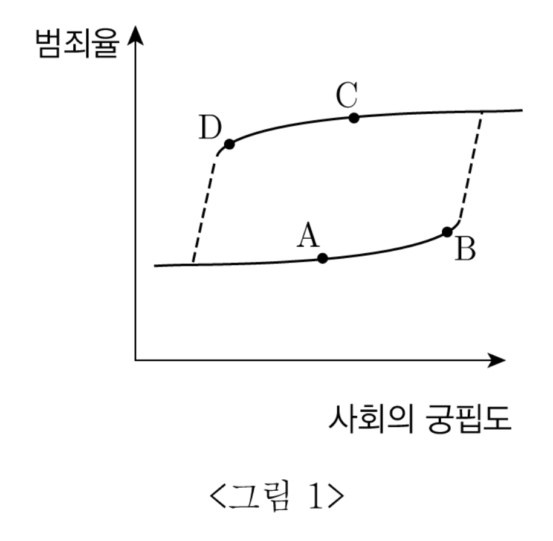
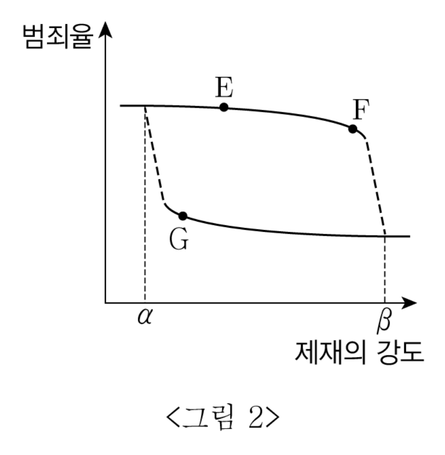

# [01-03] LU (2014)

다음 글을 읽고 물음에 답하시오.

## 제시문

지난 2008년의 미국발 금융 위기와 관련해 ‘증권화’의 역할이 재조명되었다. 증권화란 대출채권이나 부동산과 같이 현금화가 쉽지 않은 자산을 시장성이 높은 유가증권으로 전환하는 행위이다. 당시 미국의 주택담보 대출기관, 곧 모기지 대출기관들은 대출채권을 유동화해 이를 투자은행, 헤지펀드, 연기금, 보험사 등에 매각하고 있었다. 이들은 이렇게 만들어진 모기지 유동화 증권을 통해 오랜 기간에 걸쳐 나누어 들어올 현금을 미리 확보할 수 있었고, 원리금을 돌려받지 못할 위험도 광범위한 투자자들에게 전가할 수 있었다. 증권화는 위기 이전까지만 해도 경제 전반의 리스크를 줄이고 새로운 투자 기회를 제공하며 금융시장의 효율성을 높여주는 금융 혁신으로 높게 평가되었다.

하지만 금융 위기가 일어나면서 증권화의 부정적 측면이 부각되었다. 당시 모기지 대출기관들은 대출채권을 만기 때까지 보유해야 한다는 제약으로부터 벗어남에 따라 대출 기준을 완화했다. 이 과정에서 신용 등급이 아주 낮은 사람들을 대상으로 했거나 집값 대비 대출금액이 높았던 비우량(subprime) 모기지 대출이 늘어났는데, 그동안 계속 상승해 왔던 부동산 가격이 폭락하고 채무 불이행 사태가 본격화되면서 서브프라임 모기지 사태가 발생했다. 이때 비우량 모기지의 규모 자체는 크지 않았지만 이로부터 파생된 신종 유가증권들이 대형 투자은행 등 다양한 투자자들에 의해 광범위하게 보유․유통되었다는 점에 특히 주목할 필요가 있다. 이들은 증권화로 인해 보다 안전해졌다는 과신 속에서 과도한 차입을 통해 투자를 크게 늘렸는데, 서브프라임 모기지 사태를 기점으로 유가증권들의 가격이 폭락함에 따라 금융기관들의 연쇄 도산 사태가 일어났던 것이다.

이에 따라 증권화를 확대한 금융기관과 이를 허용한 감독당국에 비판이 집중되었다. 하지만 일각에서는 금융 위기의 원인이 증권화가 아니라 정부의 잘못된 개입에 있다는 상반된 주장도 제기되었다. 시장의 자기 조정 능력을 긍정하는 이 ‘정부 주범론’은 소득 분배의 불평등 심화 문제를 포퓰리즘으로 해결하려던 것이 금융 위기를 낳았다고 주장한다. 이들에 따르면, 불평등 심화의 근본 원인은 기술 변화와 세계화이므로 그 해법 또한 저소득층의 교육 기회 확대 등의 정책에서 찾아야 했다. 그럼에도 정치권은 저소득층의 불만을 무마하기 위해 저소득층이 빚을 늘려 집을 보유할 수 있게 해주는 미봉책을 펼쳤는데, 그로 인해 주택 가격 거품이 발생했고 마침내는 금융 위기로 연결되었다는 것이다. 이 문제와 관련해 대표적인 정책 실패로 거론된 것이 바로 지역재투자법이다.

지역재투자법이란 저소득층의 금융 이용 기회를 확대할 목적으로 은행들로 하여금 낙후 지역에 대한 대출이나 투자를 늘리도록 유도하는 제도이다. ‘정부 주범론’은 이 법으로 인해 은행들이 상환능력이 떨어지는 저소득층들에게로까지 주택 자금 대출을 늘려야 했고, 이것이 결국 서브프라임 모기지 사태로 이어졌다고 주장한다. ‘정부 주범론’은 여기에 더해 지역재투자법의 추가적인 파급효과에도 주목한다. 금융기관들은 지역재투자법에 따라 저소득층에 대한 대출을 늘리는 과정에서 심사 관련 기강이 느슨해졌고 지역재투자법과 무관한 대출에 대해서까지도 대출 기준을 전반적으로 완화함으로써 주택 가격 거품을 키우게 되었다는 것이다.

최근 미국에서는 ‘정부 주범론’의 목소리가 높아지면서 이 주장이 현실에 얼마나 부합하는지에 대한 많은 연구가 진행되었다. 이 과정에서 ㉠ <u>‘정부 주범론’을 반박하는 다양한 논거들이</u> ‘규제 실패론’의 이름으로 제시되었고, ‘정부 주범론’의 정치적 맥락도 새롭게 조명되었다. ‘규제 실패론’은 금융기관들의 무분별한 차입 및 증권화가 이들의 적극적인 로비에 따른 결과임을 강조하며, 이러한 흐름이 실물 경제의 안정적 성장도 저해했다고 주장한다. ‘규제 실패론’은 또한 지난 삼십 년 동안 소득 분배가 계속 불평등해지는 과정에서 보다 많은 소득을 얻게 된 부유층이 특히 금융에 대한 투자와 감세를 통해 부를 한층 키워 왔던 구조적 특징과 이들의 정치적 영향력에도 주목한다. 저소득층의 부채란 정치권의 온정주의가 아니라 부유층과 금융권이 자신들의 이익을 극대화하는 과정에서 늘어났던 것이라는 이 지적은 불평등의 심화와 금융 위기 사이의 관계에 대한 새로운 시각을 제시한다.

## 01

위 글에 나타난 입장들에 관한 진술 중 타당하지 <u>않은</u> 것은?

### 선택지

(1) ‘정부 주범론’은 정부의 시장 개입이 경제 주체들의 판단을 오도했다고 본다.
(2) ‘정부 주범론’은 정치권이 지역재투자법으로 저소득층의 표를 얻으려 했다고 본다.
(3) ‘규제 실패론’은 금융과 정치권의 유착 관계를 비판한다.
(4) ‘규제 실패론’은 가계 부채 증가가 고소득층의 투자 기회 확대와 관련이 있다고 본다.
(5) ‘정부 주범론’과 ‘규제 실패론’은 소득 불평등 문제를 해결하려는 과정에서 금융 위기가 발생했다는 점에 대해서는 의견을 같이 한다.

## 02

‘증권화’와 관련한 다음의 추론 중 타당하지 <u>않은</u> 것은?

### 선택지

(1) 증권화에서 서브프라임 모기지에 연계된 증권의 투자자는 고수익을 추구하는 일부 투자자에 한정되었을 것이다.
(2) 증권화는 개별 금융기관의 위험을 낮추어 주는 혁신처럼 보였지만 실제로는 전체 금융권의 위험을 높였을 것이다.
(3) 모기지 채권의 증권화는 보다 많은 자금이 주택시장에 유입되도록 함으로써 주택 가격의 거품을 키웠을 것이다.
(4) 부동산 시장과 유동화 증권의 현금화 가능성에 대한 투자자들의 낙관적 전망으로 인해 증권화가 확대되었을 것이다.
(5) 증권화에 대한 규제를 강화해야 할지 판단하기 위해서는 금융 위기를 발생시켰던 대출기준 완화의 원인을 규명하는 것이 중요하다.

## 03

㉠에 포함되는 것으로 보기 어려운 것은?

### 선택지

(1) 지역재투자법에는 저소득층에 대해 다른 계층보다 집값 대비 대출 한도를 더 높게 설정하도록 유도하는 내용이 있다.
(2) 서브프라임 모기지 대출의 연체율은 지역의 소득 수준에 상관없이 일반 대출의 연체율보다 높았다.
(3) 부동산 가격 거품을 가져온 주된 요인은 주택 가격의 상승보다는 상업용 부동산 가격의 상승이었다.
(4) 지역재투자법의 적용을 받는 대출들 중 서브프라임 모기지 대출의 비중은 낮았다.
(5) 지역재투자법과 유사한 규제가 없는 나라에서도 금융 위기가 발생하였다.

# [04-07] LU (2014)

다음 글을 읽고 물음에 답하시오.

## 제시문

상전이(相轉移)는 아주 많은 수의 입자로 구성된 물리계에서 흔하게 나타나는 현상이다. 물 같은 액체 상태의 물질에 열을 가하면, 그 물질은 밀도가 천천히 감소하다가 어느 단계에 이르면 갑자기 기체 상태로 변하기 시작하면서 밀도가 급격히 감소한다. 이처럼 특정 조건에서 계의 상태가 급격하게 변하는 현상이 상전이이다. 1기압하의 물이 0℃에서 얼고 100℃에서 끓듯이 상전이는 특정한 조건에서, 즉 전이점에서 일어난다. 그런데 불순물이 전혀 없는 순수한 물은 1기압에서 온도가 0℃ 아래로 내려가도 얼지 않고 계속 액체 상태에 머무르는 경우가 있다. 응결핵 구실을 할 불순물이 없는 경우 물이 어는점 아래에서도 어느 온도까지는 얼지 않고 이른바 과냉각 상태로 존재할 수 있는 것이다.

더 흥미로운 것은 어는점보다 훨씬 높은 온도에서까지 고체 상태가 유지되는 경우다. 우뭇가사리를 끓여서 만든 우무는 실제로 어는점과 녹는점이 뚜렷이 다르다. 액체 상태의 우무는 1 기압에서 온도가 대략 40℃ 이하로 내려가면 응고하기 시작하는 반면, 고체 상태의 우무는 80℃가 되어야 녹는다. 우무 같은 물질의 이런 성질을 ‘이력 특성’이라고 부른다. 직전에 어떤 상태에 있었는가 하는 ‘이력’이 현재 상태에 영향을 준다는 의미에서 붙인 이름이다. 어는점과 녹는점이 사실상 똑같이 0℃인 물의 경우는 이에 해당하지 않지만, 많은 물질의 상전이 현상에서 이력 특성이 나타난다.

경제학자인 캠벨과 오머로드는 물리학 이론인 상전이 이론을 적용하여 범죄율의 변화 같은 사회 현상을 설명하는 모형을 제시했다. 이 모형은 일종의 유비적 사고를 보여 준다. 그런데 사회가 수많은 개체들과 그것들 간의 상호 작용으로 구성된 계라는 점에서 수많은 입자들과 그것들 간의 상호 작용으로 구성된 물질계와 유사한 구조를 지녔음을 고려한다면, 그것은 임의적인 유비가 아니라 의미 있는 결론을 낳을 만한 시도이다.

두 경제학자는 물질의 상태가 일반적으로 온도와 압력에 의해 영향을 받듯이 한 사회의 범죄율이 대개 그 사회의 궁핍의 정도와 범죄 제재의 강도라는 두 요소에 의해 좌우된다고 가정한다. 재산도 직장도 없는 빈곤한 구성원의 비율이 높을수록 범죄율이 높아지는 반면, 사회가 범죄를 엄중하게 제재할수록 범죄율이 낮아진다는 것이다. 그런데 여러 연구 조사에 따르면 사회적, 경제적 궁핍의 정도가 완화되거나 범죄에 대한 제재가 강화된다고 해서 그 사회의 범죄율이 곧장 감소하지는 않는다. 캠벨과 오머로드는 이와 같은 사실을 설명하기 위해, 물질이 고체, 액체, 기체 같은 특정한 상태에 있을 수 있는 것처럼 사회도 높은 범죄율 상태와 낮은 범죄율 상태에 있을 수 있다고 가정한다.

<이미지 포함됨>

<이미지 포함됨>

<그림 1>과 <그림 2>에서 각각 아래쪽의 실선은 낮은 범죄율 상태를 나타내고 위쪽의 실선은 높은 범죄율 상태를 나타낸다. 예를 들어 <그림 1>에서 사회가 점 A에 해당하는 상태에 있다면 이 사회는 낮은 범죄율 상태에 있는 것이고, 이 경우 사회의 궁핍도가 어느 정도 더 커져도 범죄율은 별로 증가하지 않는다. 하지만 궁핍이 더 심해져 B 지점에 이르면 궁핍이 조금만 더 심화되어도 범죄율의 급격한 상승, 즉 그림의 점선 부분에 해당하는 상전이가 일어나게 된다. 또 사회가 C처럼 높은 범죄율 상태에 있을 경우 궁핍의 정도가 완화되어도 범죄율은 완만하게 감소할 뿐이지만, D 지점에 도달해 있는 경우 궁핍의 정도가 조금만 줄어도 범죄율이 급격히 감소하는 또 한 번의 상전이가 일어나게 된다. 이와 같은 범죄율의 변화는 이력 특성을 보여준다. 다시 말해, 사회의 궁핍도에 대한 정보만으로는 범죄율을 추정할 수 없고, 그것이 직전에 높은 범죄율 상태였는지 낮은 범죄율 상태였는지에 대한 정보가 필요하다.

중요한 것은 이들이 제시한 모형이 실제 통계 자료에 나타난 사회 현상을 잘 설명해 준다는 점이다. 이는 한 사회의 범죄 제재 강도와 범죄율의 상관관계에 대해서도 마찬가지다. 사회의 궁핍도를 비롯한 다른 조건이 동일한 상황에서, 범죄에 대한 사회적 제재의 강도가 변하는 경우 범죄율은 <그림 2>와 같은 형태로 이력 특성을 포함한 상전이의 패턴을 나타낸다.

## 04

위 글의 견해가 <u>아닌</u> 것은?

### 선택지

(1) 한 사회의 특성은 특정 조건에서는 다른 조건에서와 달리 급격하게 변화한다.
(2) 물리적 현상을 설명하는 이론을 응용하여 사회 현상을 설명하는 것이 가능하다.
(3) 유비적 사고의 타당성은 유비를 통해 연결되는 두 대상의 구조가 서로 유사할 때 강화된다.
(4) 한 계의 상태가 어떤 조건에서 급격한 변화를 나타낼 것인지는 계를 구성하는 요소의 종류와 무관하게 결정된다.
(5) 하나의 계가 드러내는 특성은 현재 그것을 제약하는 변수들만으로 결정되지 않고 그것이 지나온 역사적 경로에 의해서 좌우될 때가 많다.

## 05

위 글에서 알 수 있는 것만을 <보기>에서 있는 대로 고른 것은?

### 보기

ㄱ. 상전이에서 이력 특성이 나타나지 않는 물질이 과냉각 상태의 액체로 존재할 수 있다.
ㄴ. 이력 특성을 갖는 물질은 온도와 압력을 알아도 그 물질의 상태를 알 수 없는 경우가 있다.
ㄷ. 불순물이 전혀 포함되지 않은 순수한 물에서는 온도 변화에 따른 상전이 현상이 일어나지 않는다.

### 선택지

(1) ㄴ
(2) ㄷ
(3) ㄱ, ㄴ
(4) ㄱ, ㄷ
(5) ㄱ, ㄴ, ㄷ

## 06

<그림 2>에 대한 분석으로 옳지 <u>않은</u> 것은?

### 선택지

(1) E 상태에서 범죄에 대한 제재가 어느 정도 강화되더라도 범죄율의 변화는 미미할 것이다.
(2) F 상태에서 범죄에 대한 제재를 조금 더 강화하면 범죄율은 급감할 것이다.
(3) G 상태에서 범죄에 대한 제재가 조금 더 약해질 경우 범죄율이 급증할 소지가 있다.
(4) $\alpha$는 높은 범죄율 사회를 낮은 범죄율 사회로 변화시킬 수 있는 제재의 강도에 해당한다.
(5) 범죄에 $\beta$보다 더 강한 제재가 가해지는 사회에서 범죄율은 낮은 상태를 유지할 것이다.

## 07

<보기>의 ⓐ를 반박할 근거 자료로 가장 적절한 것은?

### 보기

A : 캠벨과 오머로드의 모형으로 범죄율의 변화를 설명할 수 있다고 해서 다른 사회 현상도 비슷한 방식으로 설명되리라고 생각할 이유는 없어. 예를 들어 출산율만 해도 범죄율과는 전혀 다른 문제지.
B : 아니, 출산율의 변화도 이 모형으로 설명할 수 있어. 자녀 양육 수당이나 다자녀 세금 감면 같은 경제적 유인이 출산율을 증가시키는 반면, 교육비 부담 같은 경제적 압박의 심화는 출산율을 감소시키지. 중요한 것은, ⓐ <u>출산율의 이런 변화에서도 이력 특성이 나타난다는</u> 점이야.

### 선택지

(1) 실제로 어느 고출산율 사회에서 정부가 육아 지원을 30%나 축소했음에도 불구하고 출산율의 변화는 미미하였다.
(2) 저출산율 사회를 탈피하게 하는 육아 지원의 규모가 고출산율 사회에서 저출산율 사회로 이행하는 시점의 육아 지원 규모와 일치하였다.
(3) 정부의 육아 보조금 같은 긍정적 요인보다 양육비와 교육비의 증가 같은 부담 요인이 출산율에 훨씬 더 뚜렷한 영향을 미치는 것으로 드러났다.
(4) 자녀 양육 수당의 증액은 출산율 변화에 눈에 띄는 영향을 미쳤던 데 반하여 다자녀 세금 감면 혜택의 강화는 출산율에 거의 영향을 미치지 않았다.
(5) 자녀 교육에 드는 비용의 증대가 출산율의 급격한 변화를 야기한 것으로 나타났지만 그러한 변화를 야기한 교육비 수준은 명확한 금액으로 제시하기 어려웠다.

# [08-10] LU (2014)

다음 글을 읽고 물음에 답하시오.

## 제시문

쾌락주의는 모든 쾌락이 그 자체로서 가치가 있으며 쾌락의 증가와 고통의 감소를 통해 최대의 쾌락을 산출하는 행위를 올바른 것으로 간주하는 윤리설이다. 쾌락주의에 따르면 쾌락만이 내재적 가치를 지니며, 모든 것은 이러한 쾌락을 기준으로 가치 평가되어야 한다. 쾌락주의는 고대의 에피쿠로스에 의해서는 개인의 쾌락을 중시하는 이기적 쾌락주의로, 근대의 벤담과 밀에 의해서는 사회 전체의 쾌락을 중시하는 ㉠ <u>쾌락주의적 공리주의로</u> 체계화되었다.

그런데 쾌락주의자는 단기적이고 말초적인 쾌락만을 추구함으로써 결국 고통에 빠지게 된다는 오해를 받기도 한다. 하지만 쾌락주의적 삶을 순간적이고 감각적인 쾌락만을 추구하는 방탕한 삶과 동일시하는 것은 옳지 않다. 쾌락주의는 일시적인 쾌락의 극대화가 아니라 장기적인 쾌락의 극대화를 목적으로 하므로 단기적, 말초적 쾌락만을 추구하는 것은 아니다. 예를 들어 사회적 성취가 장기적으로 더 큰 쾌락을 가져다준다면 쾌락주의자는 단기적 쾌락보다는 사회적 성취를 우선적으로 추구한다.

또한 쾌락주의는 쾌락 이외의 것은 모두 무가치한 것으로 본다는 오해를 받기도 한다. 하지만 쾌락주의가 쾌락만을 가치 있는 것으로 보는 것은 아니다. 세상에는 쾌락 말고도 가치 있는 것들이 있으며, 심지어 고통조차도 가치 있는 것으로 볼 수 있다. 발이 불구덩이에 빠져서 통증을 느껴 곧바로 발을 빼낸 상황을 생각해 보자. 이때의 고통은 분명히 좋은 것임에 틀림없다. 만약 고통을 느끼지 못했다면, 불구덩이에 빠진 발을 꺼낼 생각을 하지 못해서 큰 부상을 당했을 수도 있기 때문이다. 물론 이때 고통이 가치 있다는 것은 도구적인 의미에서 그런 것이지 그 자체가 목적이라는 의미는 아니다.

쾌락주의는 고통을 도구가 아닌 목적으로 추구하는 것을 이해할 수 없다고 본다. 금욕주의자가 기꺼이 감내하는 고통조차도 종교적․도덕적 성취와 만족을 추구하기 위한 도구인 것이지 고통 그 자체가 목적인 것은 아니기 때문이다. 대부분의 세속적 금욕주의자들은 재화나 명예와 같은 사회적 성취를 위해 당장의 쾌락을 포기하며, 종교적 금욕주의자들은 내세의 성취를 위해 현세의 쾌락을 포기하는데, 그것이 사회적 성취이든 내세적 성취이든지 간에 모두 광의의 쾌락을 추구하고 있는 것이다.

쾌락주의가 여러 오해로 인해 부당한 비판을 받고 있는 것은 사실이지만 그렇다고 쾌락주의가 어떠한 비판으로부터도 자유로운 것은 아니다. 쾌락주의는 쾌락의 정의나 쾌락의 계산 등과 관련하여 문제점을 갖고 있다. 쾌락의 원천은 다양한데, 과연 서로 다른 쾌락을 같은 것으로 볼 수 있는가? 가령 식욕의 충족에서 비롯된 쾌락과 사회적 명예의 획득에서 비롯된 쾌락은 같은 것인가? 이에 대해 벤담은 이 쾌락들이 질적으로 동일하며 양적으로 다를 뿐이라고 대답함으로써 쾌락주의의 입장을 일관되게 유지할 수 있었으나, 저급한 돼지의 쾌락과 고차원적인 인간의 쾌락을 동일시하여 결국 돼지와 인간을 동등한 존재로 간주하였다는 점에서 비쾌락주의자로부터 ‘돼지의 철학’이라고 비판받았다. 밀은 만족한 돼지보다 불만족한 인간이 더 낫고, 만족한 바보보다는 불만족한 소크라테스가 더 낫다고 주장하면서 쾌락의 질적 차이를 인정했다. 그런데 이 입장을 취하게 되면, 이질적인 쾌락을 어떻게 서로 비교할 수 있는가 하는 계산의 문제가 발생한다. 밀은 이질적인 쾌락이라고 해도 양자를 모두 경험한 다수의 사람이 선호하는 쾌락을 고급 쾌락이라고 하면서 저급 쾌락과 고급 쾌락을 구분하였다. 인간은 자유롭고 존엄한 삶을 추구하는 존재인데, 이러한 자유와 존엄성의 실현에 기여하는 고급 쾌락이 더 바람직하다는 것이다. 하지만 이와 관련하여 후대의 다른 쾌락주의자들은 ㉡ <u>밀이 쾌락주의의 입장을 저버렸다는 비판을</u> 하기도 하였다.

## 08

위 글에 나타난 쾌락주의의 입장이 <u>아닌</u> 것은?

### 선택지

(1) 고통은 그 자체로서 목적적 가치를 지닌 것은 아니다.
(2) 단기적이고 말초적인 쾌락은 내재적 가치를 지니지 않는다.
(3) 쾌락이 아닌 다른 것도 도구적 의미에서 가치를 지닐 수 있다.
(4) 금욕주의자가 고통을 감내하는 것도 결국은 쾌락을 위한 것이다.
(5) 두 행위 중 결과적으로 더 큰 쾌락을 산출하는 행위가 옳은 것이다.

## 09

㉠의 입장에서 <보기>에 대해 제시할 수 있는 견해로 가장 적절한 것은?

### 보기

쾌락주의는 사디스트가 쾌락을 얻기 위해 가학적 행위를 하는 것도 옳다고 보기 때문에 문제가 있다.

### 선택지

(1) 사디스트의 가학적 행위는 그 동기가 나쁘기 때문에 그른 것이다.
(2) 사디스트의 가학적 행위는 그 자신의 쾌락을 증진해 주기 때문에 옳은 것이다.
(3) 사디스트의 가학적 행위는 그로 인한 피해의 발생 여부와 관계없이 그 자체로 그른 것이다.
(4) 사디스트가 가학적 행위로 얻는 쾌락은 타인에게 고통을 주기 때문에 그 자체로서 가치를 지닌 것이 아니다.
(5) 사디스트가 가학적 행위로 얻는 쾌락보다 그로 인한 희생자의 고통이 더 클 경우에 가학적 행위는 그른 것이다.

## 10

위 글의 내용으로 미루어 볼 때, ㉡의 이유로 가장 적절한 것은?

### 선택지

(1) 밀은 쾌락이 도구적 가치를 지닌다는 입장을 포기하였다.
(2) 밀은 도덕적 가치 평가에서 쾌락 이외의 다른 기준을 도입하였다.
(3) 밀은 쾌락의 원천이 단일하지 않고 다양하다는 점을 인정하였다.
(4) 밀은 모든 쾌락을 하나의 기준으로 환원하여 계산할 수 있다고 보았다.
(5) 밀은 질적 차이가 있는 쾌락을 서로 비교하여 평가할 수 없다고 보았다.

# [11-13] LU (2014)

다음 글을 읽고 물음에 답하시오.

## 제시문

우리나라「독점규제 및 공정거래에 관한 법률」(이하 ‘공정거래법’)상의 ‘부당한 공동행위’는 카르텔 혹은 담합이라고 불리는데, 공정거래법에서 가장 핵심적으로 규제하는 행위이다. 경쟁 사업자들이 가격이나 품질 면에서 경쟁하기보다는 담합하여 부당하게 가격을 올릴 경우 시장 기능의 정상적인 작동을 방해하고 소비자의 이익을 저해하기 때문이다. 공정거래법상의 ‘부당한 공동행위’ 규제 제도는 미국의 카르텔 규제 제도의 영향을 주로 받아 왔다.

미국에서 판례법으로 형성된 카르텔 규제 법리는 ‘당연 위법의 원칙’과 ‘합리성의 원칙’으로 나뉜다. ‘당연 위법의 원칙’은 가격 합의와 같이 부당하게 경쟁을 제한하는 거래 제한 행위가 발생했을 때, 그 목적이나 경제적인 효과에 대한 면밀한 분석 없이 그 자체로 위법하다고 판단하는 원칙이다. 전통적으로 가격 담합, 물량 담합, 입찰 담합, 시장 분할 등이 ‘당연 위법의 원칙’이 적용되는 행위로 인정되어 왔다. 반면, ‘합리성의 원칙’은 거래 제한의 목적이나 의도, 경쟁에 미치는 긍정적 효과나 부정적 효과 등을 면밀히 검토한 다음 이를 종합적으로 고려하여 개별적으로 위법 여부를 판단하는 원칙이다. ‘합리성의 원칙’은 그 자체만으로는 부당성 여부를 판단하기 어려운 합작 투자 협정이나 공동 연구 개발 협정과 같은 행위에 적용될 수 있다.

어떤 행위에 대해 ‘당연 위법의 원칙’을 적용한다면, 법을 집행하는 정부나 거래 제한으로 인해 피해를 입은 당사자인 원고가 경쟁에 미치는 부정적인 효과를 입증하거나 시장 점유율 등의 시장 지배력을 입증할 필요가 없어, 사법적 자원이 절약될 수 있다. 정부나 원고는 ‘당연 위법의 원칙’이 적용되지 않는 나머지 유형의 행위에 대해서만 ‘합리성의 원칙’을 적용하여 그 위법성을 엄밀히 입증하면 된다. 이와 같은 이분법적 구분은 거래 제한의 부당성에 대한 심사 방식을 유형화함으로써 위법성 판단에 대한 뚜렷한 기준을 제시해 주므로 법 집행의 효율성과 예측 가능성을 높여준다.

‘당연 위법의 원칙’은 판례법주의를 취하고 있는 미국에서 법적 판단의 기본이 되는 ‘합리성의 원칙’에 근거한 법 집행 과정을 거치면서 귀납적으로 발전해 나온 것이다. 일정한 유형의 행위들은 거의 예외 없이 위법한 것으로 판단되기 때문에 복잡한 심사 없이 당연히 위법한 것으로 취급하는 것이 바람직하다고 본 것이다. 이 과정에서 예외적인 판단의 오류가 있을 수 있으나, 이는 ‘합리성의 원칙’에 따라 모든 행위를 분석하는 데 소요되는 막대한 비용을 감안할 때 충분히 감수할 수 있는 것으로 보았다.

성문법주의를 취하고 있는 우리나라는 공정거래법에서, 사업자는 계약․협정․결의 기타 어떠한 방법으로도 다른 사업자와 공동으로 ‘부당하게 경쟁을 제한’하는 가격의 결정․유지 또는 변경 등과 같은 일정한 행위를 할 것을 합의(‘부당한 공동행위’)해서는 안 되는 것으로 규정하고 있다. 이 경우, 공정거래법 규정의 해석을 통해 미국에서처럼 특정 행위에 대해 ‘당연 위법의 원칙’을 적용하여 면밀한 검증 없이도 그 위법성을 판단하는 것이 가능한지의 문제가 발생한다. 우리나라의 법 실무에서는 사업자들의 어떤 공동 행위가 ‘부당한 공동행위’에 해당하는지 여부를 판단할 때 ‘부당하게 경쟁을 제한하는’이라는 법률요건에 따라 경쟁 제한성을 가지는지 여부를 개별적으로 판단하고 있다. 이는 공정거래법의 규정상 불가피한 것으로 볼 수 있다.

그렇다면 우리나라에서는 미국의 이원적 심사 방식의 장점을 취할 여지가 없는가? 우리나라에서도 사업자들의 공동 행위를 가격 담합 등 명백히 경쟁 제한 효과만을 발생시키는 경성(硬性) 공동 행위와 시장의 경제적 효율성 증대 효과와 경쟁 제한 효과를 동시에 발생시키는 연성(軟性) 공동 행위의 두 유형을 구분하기도 한다. 법 실무에서 공정거래법을 적용할 때, 경성 공동 행위에 대해서는 시장 점유율 분석과 같은 간단한 입증 방식만으로 경쟁 제한성을 판단하지만, 연성 공동 행위에 대해서는 보다 복잡한 분석을 통한 엄격한 입증 방식을 채택하는 경향이 있다. 따라서 우리나라에서도 입증의 엄밀성을 달리하는 두 가지 유형의 공동 행위를 구분한다는 점에서 미국식 카르텔 규제의 이원적 심사 방식을 어느 정도 변형하여 수용하는 것으로 볼 수 있다.

## 11

위 글에 제시된 미국의 카르텔 규제 법리의 특성으로 옳지 <u>않은</u> 것은?

### 선택지

(1) 법 집행의 예측 가능성을 높여준다.
(2) 이원적 심사 방식으로 구성되어 있다.
(3) 판례법주의에 기초한 귀납적 결과물이다.
(4) 법 집행 시 전체적으로 비용의 소요가 많아진다.
(5) 정부는 위법성에 대한 입증 책임을 상대적으로 적게 진다.

## 12

위 글을 바탕으로 추론한 것으로 적절하지 <u>않은</u> 것은?

### 선택지

(1) ‘당연 위법의 원칙’은 ‘합리성의 원칙’보다 시장 경제의 효율성을 더 고려한다.
(2) ‘당연 위법의 원칙’의 적용은 법 집행 기관의 자의적 판단의 가능성을 줄여 준다.
(3) ‘당연 위법의 원칙’은 ‘합리성의 원칙’보다 경제적 환경 변화에 따른 유연성이 부족하다.
(4) ‘당연 위법의 원칙’은 ‘합리성의 원칙’에서라면 합법으로 판단할 행위를 위법으로 판단할 우려가 있다.
(5) ‘당연 위법의 원칙’의 배경에는, 일반적으로 가격 담합 같은 행위가 합작 투자 협정 같은 경우보다 시장에 미치는 해악 여부가 분명히 드러난다는 판단이 깔려 있다.

## 13

위 글을 바탕으로 <보기>에 대해 판단한 것으로 타당한 것은?

### 보기

(가) 자체 저유 시설을 갖추지 못한 소형 정유사들이 정유하는 즉시 시장에 석유를 내다 팔 수밖에 없는 상황으로 인해 공급 초과 현상이 나타났고, 3개의 대형 정유사들은 유가 하락을 방지하기 위해 연합하여 소형 정유사의 잉여 석유를 사들였다.

(나) 자동차 부품 개발 사업자들은 과잉 경쟁으로 인한 저가 입찰이 품질의 저하를 초래하고 기술 개발을 방해하여 업계의 경쟁력 향상과 경제적 발전을 저해하게 되자, 프로젝트 수주 시 가격 경쟁을 하지 않기로 결정하고, 이를 실행하였다.

### 선택지

(1) 미국에서 (가)에 ‘당연 위법의 원칙’이 적용된다면, 대형 정유사들은 자신들의 시장 점유율이 낮아 경쟁에 영향을 미치지 않았으므로 위법하지 않다고 주장할 수 있게 된다.
(2) 한국에서 (가)에 경제적 효율성을 증대하는 효과가 없다고 판단되면, 대형 정유사들의 공동 행위는 그 자체로 위법하게 된다.
(3) 미국에서 (나)에 ‘합리성의 원칙’이 적용된다면, 사업자들은 자신들의 행위에 경쟁을 제한할 의도가 없었으므로 위법하지 않다고 주장할 수 있게 된다.
(4) 한국에서 (나)의 위법성 여부를 판단한다면, 사업자들의 시장 점유율을 고려하는 것만으로 충분하다.
(5) 한국에서 (가)는 개별 심사의 대상이 되지 않지만 (나)는 개별 심사의 대상으로 분류된다.

# [14-16] LU (2014)

다음 글을 읽고 물음에 답하시오.

## 제시문

재현적 회화란 사물의 외관을 실제 대상과 닮게 묘사하여 보는 이가 그림을 보고 그것이 어떤 대상을 그린 것인지 알아 볼 수 있는 그림을 말한다. 음악은 어떨까? 회화가 재현적이 되기 위한 조건들을 음악도 가져야 재현적 음악이 될 수 있다면, 본질적으로 추상적인 모든 음악은 결코 대상을 재현할 수 없다고 해야 하는가?

흔히 논의되는 회화적 재현의 핵심적 조건은 그림의 지각 경험과 그림에 재현된 대상을 실제로 지각할 때의 경험 사이에 닮음이 존재해야 한다는 것이다. 음악이 이 요건을 만족시키지 못한다는 주장은 음악 작품의 이른바 순수하게 음악적인 부분이 재현 대상에 대한 즉각적인 인식을 불러일으키지 못한다는 데에 주목한다. 예를 들어 사과를 재현한 회화에서 재현된 대상인 사과는 작품의 제목이 무엇이든 상관없이 그림 속에서 인식이 가능한데, 음악의 경우는 그럴 수 없기 때문에 음악은 재현적일 수 없다는 것이다. 바다를 재현했다고 하는 드뷔시의 <바다>의 경우라도, 표제적 제목을 참조하지 않는다면 감상자는 이 곡을 바다의 재현으로 듣지 못한다는 것이다. 하지만 이러한 주장은 일반화되기 어렵다. 모래 해안의 일부를 극사실주의적으로 묘사한 그림은 재현적 회화이지만 그 제목을 모르면 비재현적으로 보이기 십상일 것이다. 몬드리안의 <브로드웨이 부기우기>의 경우, 제목을 알 때 감상자는 그림에 그어진 선과 칠해진 면을 뉴욕 거리를 내려다 본 평면도로 볼 수 있지만 제목을 모를 때는 추상화로 보게 될 것이다.

그러나 이에 대해, 회화적 재현에서 <브로드웨이 부기우기>와 같은 사례는 비전형적인 반면 음악의 경우에는 이것이 전형적이라는 점을 지적하는 학자들이 있다. 물론 음악에서는 제목에 대한 참조 없이도 명백히 재현으로 지각되는 사례, 예를 들어 베토벤의 <전원 교향곡>의 새소리 같은 경우가 드문 것이 사실이다. 하지만 이것이 음악의 재현 가능성을 부정해야 할 이유가 될까? 작품에서 제목이 담당하는 역할을 고려해 보면 반드시 그렇지만은 않다.

오늘날 많은 학자들은 음악 작품의 가사는 물론 작품의 제목이나 작품의 모티브가 되는 표제까지도 작품의 일부로 본다. <u>㉠이 입장을</u> 근거로 할 때, 작품의 내용이 제목의 도움 없이도 인식 가능해야만 재현이라는 것은 지나친 주장이다. 제목이 작품의 일부인 한, 예술 작품의 재현성은 제목을 포함하는 전체로서의 작품을 대상으로 판단해야 하기 때문이다. 슈베르트의 <물레질하는 그레첸>의 주기적으로 반복되는 단순한 반주 음형은 제목과 더불어 감상될 때 물레의 반복적 움직임을 효과적으로 묘사한 것으로 들린다.

음악이 재현의 조건을 만족시키지 못한다고 생각하는 학자들은 작품 이해와 관련된 또 다른 문제를 제기한다. 재현적 그림의 특징 중 하나는 재현된 대상에 대한 인식이 작품의 이해를 위해 필수적이라는 점이다. 그러나 재현적이라 일컬어지는 음악 작품은 이러한 특징을 가지지 않는다는 것이 ㉡ <u>이들의 입장이다.</u> 감상자는 작품이 재현하고자 하는 것이 무엇인지 몰라도 그 음악을 충분히 이해할 수 있다는 것이다. 예를 들어 감상자는 <바다>가 바다의 재현으로서 의도되었다는 사실을 모르고도 이 곡을 이루는 음의 조합과 구조를 파악할 수 있는데, 이것이 곧 <바다>를 음악적으로 이해한 것이 된다는 것이다.

그러나 ㉢ <u>이에 대한 반대의 입장도</u> 제시될 수 있다. 작품의 제목이나 표제가 무시된 채 순수한 음악적 측면만이 고려된다면 작품의 완전한 이해가 불가능한 경우가 있기 때문이다. 표제적 제목과 주제를 알지 못하는 감상자는 차이콥스키의 <1812년 서곡>에서 왜 ‘프랑스 국가’가 갑작스럽게 출현하는지, 베를리오즈의 <환상 교향곡>의 말미에 왜 ‘단두대로의 행진’이 등장하는지 이해할 수 없을 것이다. 실로 이들 작품에서 그러한 요소들의 출현을 설명해 줄 순수하게 음악적인 근거란 없으며, 그것은 오직 음악이 재현하고자 하는 이야기에 의해서만 해명될 수 있다.

## 14

위 글의 내용과 일치하지 <u>않는</u> 것은?

### 선택지

(1) <바다>는 표제적 제목 없이는 재현으로 볼 수 없다.
(2) <브로드웨이 부기우기>는 제목과 함께 고려할 때 재현으로 볼 수 있다.
(3) <전원 교향곡>에서 자연의 소리를 닮은 부분은 제목과 함께 고려해야만 재현으로 볼 수 있다.
(4) <물레질하는 그레첸>의 주기적으로 반복되는 반주 음형은 제목과 함께 고려할 때 재현으로 볼 수 있다.
(5) <1812년 서곡>에 포함된 ‘프랑스 국가’는 순수하게 음악적인 관점에서는 그 등장을 이해할 수 없는 부분이다.

## 15

글쓴이의 견해와 일치하는 것은?

### 선택지

(1) 순수한 음악적 측면만으로 재현 대상에 대한 인식을 불러일으킬 수 있는 음악 작품이 흔히 존재한다.
(2) 음악의 재현 가능성을 옹호하려면 회화적 재현을 판단하는 기준을 대신할 별도의 기준이 마련되어야 한다.
(3) 제목의 도움 없이는 재현 여부를 알 수 없다는 점이 음악과 전형적인 회화에서 공통적으로 발견되는 특성이다.
(4) 음악적 재현이 가능하기 위해서는 음악 작품의 의도를 전혀 모르는 감상자가 작품을 충분히 이해하는 경우가 전형적이라야 한다.
(5) 재현에 대한 지각적 경험과 재현 대상에 대한 지각적 경험 사이에 닮음이 존재해야 한다는 조건을 만족시키는 음악 작품이 존재한다.

## 16

<보기>에 대한 ㉠～㉢의 견해를 추론한 것으로 옳지 <u>않은</u> 것은?

### 보기

슈만은 멘델스존의 교향곡 <스코틀랜드>를 들으면서 멘델스존의 다른 교향곡 <이탈리아>를 듣고 있다고 착각한 적이 있었다. 이탈리아의 풍경을 떠올리며 <스코틀랜드>를 들었을 슈만은 아마도 듣고 있는 곡의 2악장의 주제에 왜 파, 솔, 라, 도, 레의 다섯 음만이 사용되었는지 이해할 수 없었을 것이다. 멘델스존의 의도는 스코틀랜드 전통 음악의 5음 음계를 제시하려는 것이었다.

### 선택지

(1) ㉠은 이것을 예술 작품의 일부로서 제목이 갖는 중요성을 입증하는 사례로 이용할 수 있다고 할 것이다.
(2) ㉡은 슈만이 자신이 듣고 있는 곡의 재현 대상을 몰랐더라도 곡의 전체적인 조합만큼은 이해할 수 있었다고 할 것이다.
(3) ㉡은 5음 음계가 사용된 이유에 대한 정보가 그 곡이 교향곡으로서 지니는 순수한 음악적 구조를 이해하는 데에 꼭 필요한 것은 아니라고 할 것이다.
(4) ㉢은 슈만이 자신이 듣고 있는 곡의 제목을 잘못 알았기 때문에 그 음악을 완전히 이해하지는 못했다고 할 것이다.
(5) ㉢은 이탈리아 풍경과는 이질적인 5음 음계로 인해 슈만이 자신이 듣고 있는 곡의 음악적 구조 파악에 실패했다고 할 것이다.

# [17-19] LU (2014)

다음 글을 읽고 물음에 답하시오.

## 제시문

제국주의는 식민지의 영토만이 아니라 서구 중심주의적 이데올로기들을 통해 식민지의 문화와 정신까지 수탈했다. 그 이데올로기들은 식민 지배의 과정에서 ‘과학적인’ 지식의 형태로 전파되었다. 역사학 분야도 예외는 아니어서 ‘근대 역사학’ 또한 식민 지배 정당화의 도구 역할을 하였다. 근대 역사학은 서구의 역사적 경험을 토대로 생산된 담론들을 식민지의 근대적 교육 기관을 통해 유포했으며, 이를 바탕으로 식민지의 역사를 구성하여 역사에 관한 식민지인의 사유 방식까지 지배했다.

하지만 제국주의가 남긴 정신적 상흔들에 대한 비판이 제기된 결과, 이제 서구의 역사 역시 세계사의 ‘중심’이 아니라, 한 부분에 불과하다는 인식이 공유되고 있다. 비서구 문명도 서구 문명과 동등한 가치를 지니며, 서구 문명의 여러 요소는 오히려 비서구 지역에서 전파되었다는 점 등이 새로이 강조되고 있는 것이다. 그렇지만 이로써 서구 중심주의가 근본적으로 극복되었는지에 대해서는 의문의 여지가 있다. 그런 점에서 문명 담론에 대해, 그리고 그 담론에 수반하는 ‘근대성’과 ‘진보’라는 개념을 중심으로 한 역사적 사유 방식에 대해 근원적 재성찰을 할 필요가 있다.

근대 역사학의 핵심에는 역사주의적 사유 방식이 깔려 있다. 역사주의의 핵심은 ‘진보’라는 개념, 그리고 진보의 과정에 일정한 시간이 필요하다는 인식이다. 즉 역사는 시간과 함께 진보한다는 것이다. 그러므로 역사주의적 사유에 따르면, 시간은 늘 역사적 진보로 채워지기를 기다리고 있는 ‘동질적이고 비어 있는 시간’이다. 그리하여 근대 역사학은 ‘공간의 시간화’ 전략을 사용하여 이질적인 지역의 다양한 역사적 현상들에 대한 연구를 동질적인 시간상의 위치 측정 기술로 만들었다. 그리고 ‘이전’의 시간(전근대)과 ‘지금’의 시간(근대)을 ‘진보’라는 개념으로 연속시키면서 각각의 시간에 비서구의 역사와 서구의 역사를 배치했다. 즉 서구 사회가 비서구 사회를 문명 상태로 전환할 사명을 가진다는 제국주의의 ‘문명화 사명’ 주장의 바탕에는 서구와 비서구 모두 단선적 시간 위에서 동일한 역사적 진보 과정을 밟는다는 역사주의적 사유 방식이 깔려 있는 것이다.

그리고 역사적 시간의 이 위계적 구조로 인해 서구와 비서구 사이에서만이 아니라, 각 국가와 사회 내부에서 물리적으로 동일한 ‘지금’의 시간을 살아가는 사회 집단들 간에 ‘발전의 불균등’이 재생산되었다. 즉 한 사회 내부에서도 이른바 근대적인 발전에 뒤쳐져 있다고 규정된 집단 － 예를 들어 제국주의 시대의 식민지 농민 － 은 여전히 전근대를 살아가는 후진적 존재로 간주되면서 주변화되고 배제되지만, 다른 한편으로는 끊임없이 근대적인 시간 안으로 편입될 것을 강제당해 왔던 것이다.

그러면 서구 중심주의적 근대 역사학을 어떻게 극복해야 하는가? 단순히 비서구적 공간도 문화적 고유성을 갖고 있음을 강조하거나, 사회적, 경제적 측면에서 서구와 동일한 역사적 진보 과정을 밟아 나갈 수 있음을 강조하는 것은 본질적 대책이 되지 못한다. 중요한 것은 상이하고 이질적이며 ‘환원 불가능한’ 역사적 시간들이 ‘지금 그리고 같이’ 존재한다는 것을 인식하는 것이다. ‘지금 그리고 같이’ 존재하는 역사들은 근대의 서사와 권력 관계에 편입되지 않는 역사들을 의미한다. 따라서 근대적 시간으로 포섭할 수 없는 ‘이질성’이 역사적으로 현존함을 인정하고, 근대가 갖는 보편성이나 동질성을 균열시킬 수 있는 그 이질성을 적극적으로 끌어안아야 한다.

## 17

위 글의 내용과 부합하는 것은?

### 선택지

(1) 근대 역사학의 한계를 극복하려는 시도는 한 사회 내부의 전근대적 계층을 주변화하고 배제하는 결과를 가져왔다.
(2) 근대 역사학의 ‘공간의 시간화’ 전략은 서로 다른 지역의 역사적 사건들을 단선적으로 비교한다.
(3) 근대 역사학은 일반적으로 통용되는 객관적 합리성이라는 특징이 있기에 이데올로기와 무관하다.
(4) 역사주의적 사유는 공간의 차이와 시간의 추이를 환원 불가능한 별개의 것으로 상정한다.
(5) 역사적 시간을 위계적으로 보는 시각에 대한 반성으로 ‘문명화 사명’ 이론이 등장하였다.

## 18

위 글로 미루어 볼 때, <보기>의 ⓐ의 이유로 가장 적절한 것은?

### 보기

인도의 차토파댜이는 타자에 의해 전유되거나 강탈당한 과거를 거부하고 인도인에 의한 과거의 재현을 강조함으로써 인도 민족주의 역사학의 디딤돌을 놓았다. 그는 조상의 영광스러운 과거를 ‘과학적으로’ 연구할 필요성을 제기하였다. 아울러 인도는 서구적 합리성이 결여되어 식민지가 되었으나, 후진적 문화를 변형하여 진보의 길로 나아갈 힘도 있다고 주장하였다. 차토파댜이 이후 민족을 능동적 역사 주체로 내세운 인도의 민족주의 역사학은 인도 역사가 인류의 보편적 진보의 과정을 따라왔지만 식민 지배가 이 과정의 완성을 가로막고 있다고 보았다. 그리고 독립이 된다면 즉시 자력으로 근대화할 수 있다고 주장하며 식민 지배의 정당화 논리를 비판하려 했다. 이 같은 주장은 정치적으로는 식민 정부에 맞서는 것이었지만, ⓐ <u>역사주의적 사유를 극복하는 데에는 성공적이지 않았다.</u>

### 선택지

(1) 인도 역사에 대한 과학적 연구를 구체화하지 못했기 때문이다.
(2) 인도 민족을 변혁하기 위해 과거의 재구성을 내세웠기 때문이다.
(3) 인도가 추구할 역사적 미래는 근대화에 있다고 간주했기 때문이다.
(4) 인도의 정신적 자주성을 강조하기 위해 서구 문명과 인도 문명이 다름을 주장했기 때문이다.
(5) 인도 문화의 비합리성을 부정하고 자체적 문제 해결이 가능하다고 주장했기 때문이다.

## 19

글쓴이의 주장으로 적절한 것만을 <보기>에서 있는 대로 고른 것은?

### 보기

ㄱ. 비서구 지역에 대해 근대성 담론이 강요하는 강압적 획일화를 받아들이지 말아야 한다.
ㄴ. 전근대적이라고 간주되었던 역사 주체들을 기반으로 하는 역사적 시간을 승인해야 한다.
ㄷ. 보편적 기준을 바탕으로 이질적인 역사적 시간들을 치환하여 객관적으로 제시해야 한다.

### 선택지

(1) ㄱ
(2) ㄷ
(3) ㄱ, ㄴ
(4) ㄴ, ㄷ
(5) ㄱ, ㄴ, ㄷ

# [20-22] LU (2014)

다음 글을 읽고 물음에 답하시오.

## 제시문

대부분의 서구 열강 식민지들이 독립한 20세기 중반 이후, 빈곤에 대한 국제적 개입은 주로 ‘개발’이라는 패러다임하에 진행되어 왔다. 식민본국과 식민지의 관계가 선진국과 저개발국의 관계로 재편되면서, 전자가 개발 원조를 통해 후자를 돕는 방식이 주를 이루었던 것이다. 그러나 냉전 체제가 종식되고 시장의 ‘글로벌’화가 급속히 진행되면서, 빈곤에 대한 대응 역시 ‘글로벌’화하고 있다. 빈곤에 대한 개입은 정부 차원을 넘어 다국적 기업, 국제기구, NGO와 대학, 종교 단체가 참여하는 전 지구적 교류의 장이 되었고, 그 목표도 세계 각지의 빈곤을 개선하려는 전 지구적 프로젝트로 확장되고 있다. 또한 인터넷을 통한 국제적 모금 활동도 활발해지면서 빈곤에 대한 대중의 관심도 ‘글로벌’화하고 있다.

빈곤에 대한 전 지구적 대응은 규모의 확대 혹은 활동 주체의 다양성을 놓고 볼 때 정부 차원에 치우친 기존 방식보다 진일보한 것처럼 보인다. 그러나 이러한 개입 방식에도 받는 자의 입장을 고려하지 않는 억압적 증여 관계를 낳는다는 문제가 여전히 남아 있다. ‘주는 자’ 중심으로 만들어진 일방적 증여 관계에서 과연 양자 간의 수평적 연대가 가능할까? 되갚을 능력 없이 일방적 증여 관계에 편입된 ‘받는 자’가 갖게 되는 부담감과 무력감은 빈곤 퇴치 활동의 주 무대가 된 저개발 지역 주민들 사이에서 쉽게 발견된다. 문제는 이러한 고충에도 불구하고 해당 지역민들은 비대칭적 증여 관계를 단절시킬 수 없다는 것이다. 당장의 생활을 걱정해야 하는 지역민들이 대규모 원조를 단번에 뿌리치는 것은 결코 쉽지 않다.

한편 비대칭적 증여 관계를 단절할 수 없는 것은 빈곤에 대한 개입을 구체적으로 담당하는 실무자들도 마찬가지이다. 빈곤에 대한 개입의 빈도와 규모가 커지면서 복잡한 실무 과정을 담당하는 이들의 역할이 교류의 필수불가결한 부분이 되었으며, 이는 ‘빈곤 산업’(poverty industry)을 대두시키는 결과를 낳았다. 그러나 문제는 빈곤 산업이 그 종사자들의 생활을 일정 수준 이상 유지해 주고, 마치 그들을 위해 존재하는 것 같은 양상을 띠게 되었다는 점이다. 애초의 빈민 구제라는 순수한 목적을 실현하기 위한 수단으로 성립되었던 국제적 네트워크나 조직 등이 그 자체의 유지나 확장을 위해 빈민 구제를 내세우는 본말 전도의 형국을 드러내게 된 것이다. 그렇기에 이미 ‘주는’ 역할이 직업이 된 ‘빈곤 산업’의 실무자가 거대한 ‘빈곤 산업’의 그물을 스스로 잘라내는 것은 어려운 일일 수밖에 없다.

그런데 이와 같은 빈곤 개입의 문제에 대한 학계와 정부 기관, 민간 단체의 비판은 ‘빈곤 산업’의 무분별한 확대보다는 ‘받는 자’의 ‘원조 의존성’에 중점을 두고 있다. 이를 잘 보여 주는 것이 ‘임파워먼트’(empowerment)를 둘러싼 최근의 논의들이다. 이러한 논의들은 서구 사회가 지난 50년 동안 2조 3천억 달러의 해외 원조를 제공하고도 빈곤의 문제를 해결하지 못한 것에 대한 반성을 담고 있다. 스스로 사회경제적, 정치적 역량을 강화함으로써 빈곤을 해결할 가능성이 있는 빈곤 지역을 선별하여 원조하거나 좀 더 효율적인 역량 강화를 위해 각 빈곤 지역의 문화적 특성에 걸맞은 원조 방식을 개발하는 데 초점이 맞추어져야 한다는 것이다. ㉠ <u>이러한 원조 방식은</u> 흔한 비유대로 ‘물고기 잡는 방법’을 가르치겠다는 취지에서 나온 것이다. 장기적으로는 빈곤 지역에서 자체적으로 빈곤 문제를 해결할 수 있도록 외부 원조의 역할을 부수적인 것으로 국한해야 한다는 것이다.

그러나 이러한 논의에 앞서 ‘주는 자’가 주도하는 ‘빈곤 산업’의 무분별한 확대를 가져온 구조적 문제에 의문을 제기하는 것이 더 필요할 것으로 보인다. 빈민들이 잡을 물고기가 과연 남아 있기나 한가? 자기 어장을 뺏긴 사람들에게 낚싯대를 쥐어 주는 것이 과연 어떤 의미가 있는가? 이 의문은 ‘주는 자’와 ‘받는 자’라는 일방적 증여 관계가 고착된 전 지구적 차원의 정치경제적 구조와 국제정치적 편제 구조에 대한 좀 더 근본적인 문제 제기라고 할 수 있다. 이 관점에서 보면 ‘빈곤 산업’은 빈민들이 끊임없이 양산되는 구조적이고 근원적인 문제를 은폐하거나 고착한다는 또 다른 차원의 문제를 보여 준다.

## 20

위 글의 내용과 일치하지 <u>않는</u> 것은?

### 선택지

(1) 오늘날 매체의 발달에 따라 빈곤에 대한 대응 양상도 변화하고 있다.
(2) 전지구화에 따라 빈곤에 대한 국제적 대응의 규모는 확대되는 경향이 있다.
(3) 식민본국과 식민지의 관계는 개발 원조에서 ‘주는 자’와 ‘받는 자’의 관계로 이어졌다.
(4) ‘임파워먼트’에 대한 논의는 원조 의존성의 해결책을 강구하기 위하여 시작되었다.
(5) 빈곤에 대한 개입이 다각화되면서 ‘주는 자’와 ‘받는 자’의 비대칭적 증여 관계는 점차 줄어들고 있다.

## 21

글쓴이의 문제의식으로 적절하지 <u>않은</u> 것은?

### 선택지

(1) 빈곤이 일어나는 사회 구조에 대한 근본적인 문제 제기가 이루어지지 않는다면 빈곤의 양산과 고착화 문제를 해결하기 어렵다.
(2) 현재 전 지구적 차원으로 진행되고 있는 빈곤 퇴치 활동이 산업화되어 가는 것 자체가 새로운 문제를 일으킨다는 것을 직시해야 한다.
(3) 빈곤 퇴치 활동의 대상이 되는 저개발 지역 주민들과 원조 제공자 사이의 억압적 증여 관계를 개선하는 것이 긴요하다는 것을 인식해야 한다.
(4) 전 지구적 차원의 빈민 구제 사업이 펼쳐질 수밖에 없는 데 대한 원인과 책임은 부유한 ‘주는 자’와 빈곤한 ‘받는 자’ 모두에게 비슷한 수준으로 있다.
(5) 전 지구적 차원의 반(反)빈곤 활동을 제대로 평가하기 위한 출발점은 ‘받는 자’의 자생력을 키울 기반을 ‘주는 자’가 이미 빼앗았다는 것을 인식하는 데서 시작해야 한다.

## 22

㉠에 해당하는 사례로 거리가 먼 것은?

### 선택지

(1) 중앙아프리카 지역 주민들에게 주식인 옥수수보다 수확량이 더 많은 밀을 재배하도록 홍보하고 개량된 다수확 밀 품종을 보급한다.
(2) 빈곤 퇴치를 위해 적극적 노력을 기울이지 않는 짐바브웨보다 광물 자원의 판매 수입을 사회적 인프라에 투자하는 보츠와나에 원조를 집중한다.
(3) 빈민 구제 활동을 자생적으로 펼쳐 온 태국의 사원(寺院)을 국제 원조 기구가 지원하여 빈민을 대상으로 직업 교육 및 아동 교육 프로그램을 운영한다.
(4) 책임감이 강한 사람들을 선별하여 돈을 빌려줌으로써 지속 가능한 서민 금융으로 자리 잡은 방글라데시의 소액 대출 사업을 유지하고 확산하기 위한 프로그램을 지원한다.
(5) 빈민이 일방적 수혜자가 아니라 기업가 정신을 지닌 적극적인 경제 활동 주체가 될 가능성을 보여 준 인도의 저소득층 시장 개발 사업을 지원하고 필요한 경제 교육을 실시한다.

# [23-25] LU (2014)

다음 글을 읽고 물음에 답하시오.

## 제시문

대의 민주주의는 유권자가 대표자에게 주권의 일부를 위임하고, 선출된 대표자는 관료 또는 기타 독립 기구에 권한의 일부를 다시 위임하는 연쇄적인 권한의 위임에 기초하여 작동한다. 그런데 후자의 위임은 선출되지 않은 권력을 창출한다는 점에서 대의 민주주의와 충돌할 소지가 있다. 그렇다면 왜 후자와 같은 위임 행위가 발생하는가?

이에 대해 기능주의 이론은 주인-대리인 모델에 의거하여 답한다. 주인, 즉 정치 행위자들이 대리인에게 권한을 위임하는 것을, 정보의 불완전성과 집합 행동의 딜레마로부터 발생하는 거래 비용을 절감하려는 합리적 선택으로 설명하는 것이다. 거래 비용에 정보 비용과 신뢰 비용이 포함된다는 점에서 이 이론은 둘로 나뉜다. 위임을 전문 지식과 정보 부족을 해결하기 위한 선택으로 이해하는 ㉠ <u>정보의 논리와,</u> 위임을 주인들의 집합 행동의 딜레마, 즉 주인들이 상호 불신으로 인해 전체의 합의에 따른 공동의 장기적 이익 대신 자신의 단기적 이익을 추구하기 위해 합의를 이행하지 않게 되는 문제를 해결하기 위한 대안으로 이해하는 ㉡ <u>신뢰의 논리가</u> 그것이다.

그런데 권한 위임에는 대리인이 주인의 이익에 반해 행동할 위험이 있다. 이 때문에 위임의 문제는 대리인에게 기대하는 효용을 극대화하고 대리인의 배반을 최소화하기 위한 제도를 설계하는 문제로 압축된다. 이때 두 논리의 해법은 상이하다. 정보의 논리는 대리인이 더 많은 전문 지식과 정보를 가질수록, 또 주인과 대리인의 선호가 일치할수록 대리인에게 보다 많은 권한을 위임하는 방향으로 제도를 설계한다고 본다. 반면 신뢰의 논리는 주인들로부터 독립된 선호를 가진 대리인에게 보다 많은 권한을 위임하는 것이 바람직하다고 본다. 이때 위임은 주인들의 집합 행동 문제를 해결하기 위한 수단으로 이해된다.

하지만 이 두 논리에 대해 다음과 같은 비판이 가능하다. 정보의 논리는 대리인의 선호와 배반이 사후적으로만 관찰된다는 점에서 위임의 설계 단계에서 적용하기 어렵고, 신뢰의 논리는 주인들이 단기적 선호를 포기하고 대리인을 임명할 수 있다고 보는데, 그렇다면 집합 행동 문제는 애초에 존재하지 않았던 것이 된다. 따라서 위임의 문제를 제대로 다루기 위해서는 기능주의 이론이 아니라 정치적 거래 비용 이론의 관점에서 접근해야 한다.

정치적 거래 비용 이론은 위임의 설계 과정에서 일어나는 경쟁과 갈등에 주목하면서 위임을 정치적 불확실성과 분배의 갈등에 기초한 정치적 경쟁의 산물로 이해한다. 민주주의의 특징은 어떤 정치 행위자도 공공 정책을 수립하고 집행하는 권한을 안정적으로 갖지 않는다는 데 있다. 이러한 정치적 불확실성으로 인해 현재 정책이 미래의 정치 권력에 의해 합법적으로 바뀔 수 있다. 정치적 불확실성하에서 정책의 지속성을 보장하는 방안은 해당 정책을 정치 행위자들의 간섭과 각축에서 분리, 독립시키는 것이다. 위임은 이러한 목적으로 이루어지며, 그 과정에서 새로운 형태의 거래 비용, 즉 ‘정치적 거래 비용’이 창출된다. 정치적 거래 비용이란 대리인에게 위임된 정책의 방향이나 내용을 변경하거나 대리인을 감시하는 데 소요되는 모든 비용을 일컫는데, 이 비용이 커질수록 대리인은 정치적 간섭으로부터 자유로워지고 정책이 역전될 가능성은 줄어든다.

정치적 거래 비용을 매개로 한 위임의 제도적 설계는 정치 행위자들에게 정책의 안정성과 대리인에 대한 통제 가능성 간의 맞교환을 요구한다. 위임을 설계하는 세력은 대리인에 대한 정치적 간섭을 배제하고 정책 안정성을 보장할 수 있도록 하면서 정치적 거래 비용의 증가를 발생시킴으로 인해 대리인에 대한 통제 가능성을 스스로 봉쇄하게 된다. 정치 권력을 중심으로 각축하는 정치 세력들 사이의 정책 선호의 차이가 현저할수록, 그리고 정치 권력 교체가 빈번하거나 경합을 벌이는 정치 세력이 다수일수록, 정책이 바뀔 가능성은 높아지고 정책의 안정성을 위해 정치적 거래 비용이 증가할 수밖에 없다. 정치적 거래 비용 이론은 위임을 정치 행위자들의 간섭과 통제로부터 분리하여 정책의 안정성을 얻는 행위로 이해함으로써 정책 결정을 추동하는 조건과 그로부터 야기되는 새로운 문제들에 대한 이론적 분석을 가능하게 하였다.

## 23

‘위임’에 대한 위 글의 주장으로 적절하지 <u>않은</u> 것은?

### 선택지

(1) 위임은 정치적 경쟁 구조의 산물이다.
(2) 위임은 정치적 불확실성으로부터 발생한다.
(3) 위임을 주인-대리인 모델로 설명하는 데에는 한계가 있다.
(4) 위임은 정치적 거래 비용의 절감을 위한 합리적 선택의 결과이다.
(5) 위임은 대의 민주주의의 기본 작동 방식이지만 그 원리와 충돌할 소지가 있다.

## 24

㉠과 ㉡에 대한 설명으로 타당하지 <u>않은</u> 것은?

### 선택지

(1) ㉠은 선호하는 결과를 낳기 위한 주인들의 전문 지식이 부족할수록 대리인에게 많은 권한이 위임된다고 본다.
(2) ㉡은 주인들 각자의 단기적 이익과 공동의 장기적 이익 사이에서 발생하는 딜레마를 해결하기 위해 권한을 위임한다고 본다.
(3) ㉠과 ㉡ 모두 합리성과 효율성의 관점에 기초하지만, 거래 비용의 상이한 측면에 주목한다.
(4) ㉠과 ㉡ 모두 위임 제도 설계 단계에서 정치적 경쟁 속에 있는 정치 행위자들의 관계를 고려하지 못하고 있다.
(5) ㉠에서 발생하는 대리인의 배반과 ㉡에서 발생하는 집합 행동의 딜레마는 위임 설계 후에 확인된다.

## 25

<kbd>정치적 거래 비용 이론</kbd>을 적용한 설명으로 보기 어려운 것은?

### 선택지

(1) 정치인들은 독립적인 중앙은행으로 통화 정책의 권한을 위임한다. 이는 그들이 긴축적인 통화 정책이 갖는 장기적인 효용에 대해 모두 동의함에도 불구하고 급격한 통화 팽창을 통해 단기적으로 정치적 이익을 극대화하려는 유혹에 빠지는 것을 막기 위해서이다.
(2) 각국의 정치 행위자들이 특정 사안에 대한 초국가적 기구를 만들어 그 기구에 정책 결정 및 집행의 권한을 많이 위임하는 현상이 발생한다. 이는 그들 간의 정책적 선호의 차이가 큰데도 불구하고 정책의 안정성과 지속성을 확보하기 위한 것이다.
(3) 미국 행정부는 의회로부터 위임된 일정한 재량권을 항상 확보하고 있다. 이는 의회와 행정부 간의 정책 선호의 불일치가 증가할 가능성에도 불구하고 위임의 설계 단계에서 의회 내 세력 변화 가능성이라는 요인이 작동하기 때문이다.
(4) 유럽중앙은행은 유럽연합의 통화 정책의 결정 및 집행에 있어 거의 전권을 행사한다. 이는 그 과정에서 민주주의의 결핍을 야기할 위험에도 불구하고 각 회원국 정치 행위자들의 간섭을 봉쇄하기 위한 정치적 행위의 결과이다.
(5) 국제 협력을 위한 초국가적 기구를 구성할 때는 국내 반대자들에 대한 보상 방안도 협상 의제에 포함한다. 이는 국내 반대자들의 반론으로 인한 논란을 예방하여 국제 협력의 안정성을 제고하기 위한 것이다.

# [26-29] LU (2014)

다음 글을 읽고 물음에 답하시오.

## 제시문

책장의 가장 밝은 곳에 꽂혀 있던 아르판의 책을 꺼내어 한국어로 번역하기로 마음먹은 건 그처럼 암담한 시기를 지나는 중이었다. 내게도 뛰어난 이야기를 알아볼 눈이 있다는 걸 증명하고 싶었다. ㉠ <u>요리는 못해도 미각은 있다는</u> 점을 증명하고 싶었다. 그 증명에서 시작해, 나 자신에 대한 신뢰부터 되찾고 싶었다. 나는 와카어의 지식을 되짚어가며 정성껏 번역했다. 극심한 가난과 조울증의 고통 속에서 그 작업은 한 해 넘게 계속되었다.

자세를 똑바로 잡았다. 등을 등받이에 밀착시키고 꼬았던 다리를 펴 내렸다. 감정을 최대한 지운 목소리로 말했다.

“아르판, 지금 이 노래 들리지요?”

이번엔 여자 가수가 떼로 출동해 저를 떠나지 말라며 악을 쓰고 있었다. 아르판은 아무런 대답을 하지 않았다. 고개를 끄덕이거나 젓지도 않았다. 그건 내 예상과 아주 많이 다른 것이었다. 정적이 흘렀다. 견디기 힘들었다. 나는 차라리 그가 벌떡 일어나 화를 내기를, 울부짖거나 원망하기를, 혹은 주먹을 들어 ㉡ <u>내 곪은 영혼</u>에 매질을 해 주기를 바랐다. 하지만 그는 가만히 나를 노려보기만 했다. 아니, 소름끼치는 눈으로 찬찬히 관찰했다. 표정을 읽어낼 수 없어 답답했다. 나는 힘겹게 말을 이었다.

“한국에서 요즘 유행하는 노래입니다. 그런데 사실 이건 번안곡이에요. 원래는 삼사 년 전에 일본, 아, 그런 나라가 있습니다. 아무튼, 그 일본에서 만들어진 곡이거든요. 그러나 알고 보면 일본 것도 아니지요. 선진 문명을 받아들이던 시절에 일본이 흠모하던 영국의 동요가 그 뿌리니까요. 하지만 영국 이전에는 네덜란드의 서민 음악이었고, 그 음악은 17세기 중국 광동 지방으로부터 흘러나온 전통 리듬에 뿌리를 두고 있답니다. 자, 그렇다면 중국 광동 지방의 어느 중국인이 이 노래의 원작자일까요?”

아르판은 대답하지 않았다. 속내를 짐작할 수 없는 시커먼 눈동자가 무서웠다. 답답했다. 나는 부탁하고 싶었다. 무슨 생각을 하는지 알려 달라고 부탁하고 싶었다. 하지만 그렇게 말하지 않았다. 다르게 말했다. 그렇지 않아요, 하고 나는 쫓기듯 말했다.

“그렇지 않아요. 비록 광동의 리듬을 차용했지만, 이 곡에는 자신이 거쳐 온 네덜란드나 영국, 일본, 그리고 우리 한국의 고유한 향수가 모두 담겨 있습니다. 게다가 알려진 게 그 정도라 그렇지, 더 깊이 파고들다 보면 전혀 다른 지역으로까지 소급해야 될지도 모릅니다. 그러나 이 복잡한 노래의 마디마디에서 원작자를 찾는 건 불가능할 뿐 아니라 옳지도 않습니다. 더 자세히 얘기해 봅시다. 이 음악은 칠음계를 사용하고 있군요. 또 리듬의 중심엔 일렉트릭 베이스가 있네요. 그렇다면 칠음계의 수학적 원리를 고안한 피타고라스, 베이스 기타의 발명자인 폴 툿말크를 불러다 이 음악에 관한 창조의 권리를 부여해야 할까요? 그건 어리석은 짓입니다. 피타고라스가 숫자를 발명했나요? 툿말크가 소리를 발명했어요? 그렇지 않아요. 인간의 예술은 단 한 번도 순수했던 적이 없습니다. 우리가 벌이는 모든 창조는 기존의 견해에 대한 각주와 수정을 통해 나옵니다. 그렇게 차곡차곡 쌓이는 겁니다.”

나는 아르판이 모를 게 분명한 온갖 장르와 지역과 사람의 이름을 난잡하게 혼용함으로써 문화와 예술의 차이를 구분하지 않은 내 논리의 허점을 감추려 노력했다. 높이 쌓는 행위가 문화라면 아르판이 써 나간 건 예술이다. 하지만 나는 그 차이를 일부러 무시했다. 무시하고, 어떻게든 동일시하기 위해 애썼다.

(중략)

나는 거의 화를 내고 있었다. 바락바락 대드는 심정으로 말했다.

“네, 나는 당신 것을 훔쳤습니다. 하지만 난 그 이야기의 주인공들에게 한국의 문화를 덧칠함으로써 더욱 멋지게 살려냈습니다. 내가 훔치지 않았더라도 당신 이야기가 살아남을 수 있었을까요? 세상에 드러났을까요? 아닙니다. 내가 훔치지 않았다면 그 이야기는 머지않아 당신과 함께 영원히 묻혀 버릴 겁니다. 그렇다면 어느 쪽입니까? 불멸하는 것과 영원히 묻히는 것, 어느 쪽을 원합니까? 당신은 당신이 창조해 낸 인물들을 사랑합니까, 아니면 필경 수 년 내에 쓰러져 묻힐 ㉢ <u>저 갸우뚱한 오두막에서의 명예</u>를 사랑합니까?”

옳지 않은 것을 설득하기란 어려운 일이다. 하지만 전혀 불가능한 것도 아니다. 그에게 윽박지른 논리는 ㉣ <u>내가 발명할 수 있는 최선의 것</u>이었다. 말을 끝낸 뒤, 묘하게 고정되어 있는 아르판의 까만 눈을 피해 곱창볶음만 바라보았다. 부끄럽다기보다는 겁이 났다. 와카의 땅에서라면 이런 짓을 한 나는 그의 거친 손에 붙잡혀 죽었을지 모른다. 그리하여 ㉤ <u>취향도 뭣도 아닌 대중성으로 요란히 장식된 한국산 기성복</u>과 함께 화장터에서 불살라졌을지 모른다. 하지만 이곳은 문명 세계고 나는 이곳의 주민이어서, 어느 순간 아르판의 눈빛이 맥없이 풀리리라는 것을, 제 피조물과 이야기를 영원히 살리는 쪽으로 동의하리라는 것을, 내가 이기리라는 것을 알고 있다. 과연 아르판이 눈을 몇 번 깜박이더니, 그윽하게 감는 것이었다. 스피커에서는 떠나지 말라며 악을 쓰는 목소리가 쉬지 않고 흘러나왔다. 나는 차라리 모든 것이 떠나가 주면 좋겠다고 생각했다. 말없는 아르판도, 나를 가난과 질병의 고통으로부터 구해 준 저 책도, 불멸을 향한 아찔한 <kbd>기만</kbd>도, 저주받을 욕망과 열정도, 죄의식에 억눌려 살아가야 할 앞으로의 나날도 모두, 모두.

조금 지나 아르판이 눈을 떴다. 맑고 굵은 눈에 형언할 수 없는 복잡한 빛이 어려 있었다. 잠시 나를 보더니, 천천히 일어났다. 일어나고 일어났다. 다 일어났다고 생각한 뒤에도 한참을 더 일어났다. 고급 승용차의 자동 안테나처럼 위로 쭉쭉 올라갔다. 그는 이제까지와는 달리 갸우뚱하게 서 있지 않았다. 엄청난 신장을 과시하듯, 자신이 얼마나 더 커질 수 있는지 아냐고 묻는 듯 똑바로 기립했다. 그 상태로 나를 내려다보았다. 부드럽게 미소지으며 입을 열었다.

“이만 돌아가 쉬어야겠군요. 여러 가지로 수고해 주셔서 고맙습니다.”

그렇게 말하는 아르판의 얼굴에는 놀랍게도 아무런 분노나 절망을 찾아볼 수 없었다. 아니, 겉으로만 보자면 오히려 정말로 고마워하는 것 같았다. 뜻밖의 반응에 당황한 나는 무릎으로 의자를 밀치고 일어났다. 어정쩡하게 작별의 인사를 건넸다.

- 박형서, 아르판 -

## 26

위 글에 대한 설명으로 적절한 것은?

### 선택지

(1) 인물이 처한 상황과 심리가 인물 자신의 시각을 통해 전달되고 있다.
(2) 현실로부터 소외된 인물을 통해 사건의 상징적 의미를 강조하고 있다.
(3) 배경 공간을 객관적이고도 치밀하게 묘사함으로써 사실성을 높이고 있다.
(4) 인물의 성격 변화를 극적으로 제시함으로써 이야기의 긴장감을 조성하고 있다.
(5) 사건들을 원래 발생 순서와 다르게 제시하여 사건들 간의 인과성을 드러내고 있다.

## 27

㉠～㉤의 문맥상 의미를 설명한 것으로 적절하지 <u>않은</u> 것은?

### 선택지

(1) ㉠은 창작 능력은 없어도 좋은 작품을 판별하는 감식안이 있다는 것을 의미한다.
(2) ㉡은 우리 사회의 부정적 현실을 직시하지 못하고 그에 타협하는 부도덕을 의미한다.
(3) ㉢은 훌륭하지만 세상에 널리 알려지지 않은 채 인정받지 못하는 상태를 가리킨다.
(4) ㉣은 자신의 행위를 변명하기 위해 심혈을 기울여 애써 만들어낸 궤변을 뜻한다.
(5) ㉤은 대중이 애호하는 것들로 구성되었지만 실상 별 가치가 없는 상품을 뜻한다.

## 28

‘나’와 ‘아르판’의 대화 상황에 대한 해석으로 적절하지 <u>않은</u> 것은?

### 선택지

(1) ‘나’와 아르판이 만날 때 들리는 음악은 아르판이 ‘나’의 논리에 승복하는 데 중요한 근거가 된다.
(2) ‘나’가 아르판의 반응에 계속 신경 쓰는 것은 실상 자신이 먼저 괴로움을 깊이 느끼고 있기 때문이다.
(3) ‘나’를 향한 아르판의 시선 변화는 그가 사태를 관찰하고 생각하며 결심하는 과정을 암시하고 있다.
(4) ‘나’는 아르판이 자신의 고향이 아닌 한국에서는 ‘나’의 행위를 인정할 수밖에 없을 것으로 기대한다.
(5) ‘나’에게 아르판이 일어나는 동작이 길고 크게 보인 것은 불안과 자책을 불러일으킨 그에게 압도되었기 때문이다.

## 29

‘나’가 자신의 행위를 <kbd>기만</kbd>으로 생각한 이유로 가장 적절한 것은?

### 선택지

(1) 다른 문화권 예술에 대한 표절은 자기 문화의 발전을 저해한다는 것을 무시했기 때문이다.
(2) 문화 도입 과정에서 생기는 창조적 요소가 새로운 예술의 원천임을 간과했기 때문이다.
(3) 예술을 포함한 모든 문화에 고유성이 필수적 요건이라는 것을 고려하지 않았기 때문이다.
(4) 일반적인 문화와 달리 예술은 창조성을 고유한 본질로 삼는다는 것을 도외시했기 때문이다.
(5) 외견상 달리 보이는 작품도 실제로는 기원이 동일한 경우가 있다는 것을 외면했기 때문이다.

# [30-32] LU (2014)

다음 글을 읽고 물음에 답하시오.

## 제시문

계약의 본질을 당사자들의 자유로운 의사의 합치로 보는 사비니 이래의 <kbd>근대적인 계약 이해 방식</kbd>에 따르면 특정한 내용의 계약을 체결한 당사자들이 그 계약을 준수해야 하는 까닭은 바로 스스로가 그 계약 내용의 실현을 원했기 때문이다. 그렇다면 가령 계약 당사자들이 민법의 규정을 무시하고 선량한 풍속에 위반하는 사항의 실현을 자발적으로 원했을 경우에는 어떻게 할 것인가? 여전히 당사자들 사이에 자유로운 의사의 합치가 있었음을 이유로 그와 같은 계약도 그들을 구속한다고 보아야 할 것인가? 아니면 아무리 당사자들이 원했다 하더라도 법률이 정하고 있는 바에 어긋나는 내용의 계약은 당사자들을 구속할 수 없다고 봄으로써 근대적인 계약 이해 방식을 포기해야 할 것인가?

많은 경우 법률가들은 계약을 당사자들 사이의 자유로운 의사의 합치로 이해하면서도, 다른 한편으로는 선량한 풍속에 위반하는 내용의 계약이 무효인 까닭은 법률이 그렇게 정하고 있기 때문이라는 설명에 만족한다. 그러나 이러한 태도는 딜레마를 이루는 두 축을 동시에 붙들고 있는 것이라 할 수 있다. 이 지점에서 근대적인 계약 이해 방식에 대한 근본적인 문제 제기가 이루어진다.

의사표시 이론의 논쟁과 관련해서도 비슷한 문제를 생각해 볼 수 있다. 전통적인 ‘의사주의적 관점’은 계약의 핵심을 어디까지나 의사의 합치에서 찾으려 한다. 이에 따르면 내심의 의사 내용과 외부로 표시된 내용이 일치하지 않는 경우에는 전자에 따른 법적 효과를 인정해야 한다. 하지만 이렇게 할 경우 표시된 내용만을 믿고 거래에 응한 상대방은 예기치 못한 손해를 입을 수 있다. 이 점을 고려하여 내심의 의사 내용보다는 외부로 표시된 내용을 기준으로 법적 효과를 인정해야 한다는 ‘표시주의적 관점’이 등장하게 되었는데, 이는 계약 당사자들 사이의 신뢰와 거래질서의 안정성을 보호하려는 법적 추세와 일맥상통하는 것이었다. 이 관점에 따르면 계약을 준수해야 하는 이유 역시 ‘표시된 바에 의할 때’ 당사자들이 그 내용의 실현을 원했다는 점에서 찾게 된다.

이러한 논란은 결국 당사자들이 진정 무엇을 원했는가보다는 법이 무엇을 승인했는가가 더 중요하다는 사고로 이어짐으로써, 계약을 이해하는 기존의 방식 자체에 문제가 있음을 인정하고, 계약에 따른 책임의 본질을 의사의 내용에 기초한 책임(약정 책임)이 아니라 궁극적으로 법률의 규정에 기초한 책임(법정 책임)일 뿐이라고 보려는 ‘급진적 관점’의 도래를 예정하게 된다. 예를 들어 불법행위를 저지른 사람이 피해자에게 배상하고 싶지 않다고 해서 면책될 수 없는 것과 마찬가지로, 자신의 의사와 다른 내용의 계약을 체결하거나 이행해야 할 경우가 있다는 것이다. 일부 학자들이 이른바 ‘계약의 죽음’을 이야기하는 이유도 바로 이러한 맥락에서 이해될 수 있을 것이다.

계약을 이해하는 방식의 이와 같은 변화는 자본주의적 경제 체제의 발달과 맞물려 있는 것으로 평가되고 있다. 근대적 법제는 중세의 신분적 제약을 타파하고 만인이 자유롭고 평등한 존재로서 자신이 처하게 될 법률 관계를 스스로 결정할 수 있음을 선언했지만, 얼마 지나지 않아 인간의 자유와 평등은 단지 형식적인 전제로 머물러서는 안 되며 실질적인 목표가 되어야 한다는 실천적 반성을 불러일으키게 되었다. ‘계약 당사자들 사이의 자발적인 의사의 합치’는 취약한 사회․경제적 지위를 갖는 한쪽 당사자의 의사를 자유와 평등의 이름으로 상대방의 의사에 종속시키는 결과를 초래했기 때문이다. 이러한 상황에서 사회 정의와 공정성을 확보하기 위해 출현한 각종 규제 입법들은 결국 계약의 당사자들이 표면적으로 동의했던 바에 구속력을 인정하지 않을 수도 있고, 그들이 미처 생각지도 못했던 바를 강제할 수도 있다는 점을 수용하고 있는 것이다.

## 30

위 글의 내용과 부합하지 <u>않는</u> 것은?

### 선택지

(1) 의사주의적 관점은 모든 사람이 자유로운 의사 결정의 권리를 가지고 있음을 전제한다.
(2) 의사주의적 관점은 의사표시의 주체에게 자신의 의사와 일치된 표시를 할 부담을 부과한다.
(3) 표시주의적 관점은 의사표시의 주체보다는 그 의사표시를 신뢰한 상대방을 보호하고자 한다.
(4) 표시주의적 관점은 의사주의적 관점이 야기할 수 있는 문제점을 해결하는 과정에서 등장하였다.
(5) 급진적 관점은 계약상 채무의 불이행으로 인한 책임을 법정 책임의 일종으로 보고자 한다.

## 31

<kbd>근대적인 계약 이해 방식</kbd>의 문제점을 지적한 것으로 옳은 것만을 <보기>에서 있는 대로 고른 것은?

### 보기

ㄱ. 의사와 표시가 일치하지 않는 것이 당연하다는 전제에서 출발하고 있다.
ㄴ. 계약의 자유라는 문제에 비해 계약의 공정성이라는 문제를 소홀히 하고 있다.
ㄷ. 규제 입법을 통해 계약의 자유를 제한해야 할 경우가 있음에도 불구하고 이런 개입을 정당화하기 어렵다.

### 선택지

(1) ㄱ
(2) ㄴ
(3) ㄱ, ㄷ
(4) ㄴ, ㄷ
(5) ㄱ, ㄴ, ㄷ

## 32

위 글을 바탕으로 <보기>의 주장 A～E를 평가한 것으로 적절하지 <u>않은</u> 것은?

### 보기

갑은 자기 소유의 토지를 시세에 따라 $m^2$당 10만원에 팔고자 하였으나, 을과 매매 계약을 체결할 당시 평당 10만원에 팔고자 한다고 말하였다(1평은 $3.3m^2$). 을은 평당 10만원의 가격이 합당하다고 생각하여 갑과 매매 계약을 체결하였다.

A : 갑은 평당 10만원에 팔고자 하는 의사를 가지고 있지 않았을 것이므로, 평당 10만원에 토지를 넘겨줄 의무는 없다.
B : 을은 갑이 평당 10만원에 팔고자 한다는 말을 신뢰하여 계약을 체결한 것이므로, $m^2$당 10만원에 해당하는 대금을 지급할 의무가 없다.
C : 갑은 평당 10만원에 팔고자 하는 의사를 가지고 있지 않았을 것이지만, 스스로 그렇게 말했으므로 그 가격에 팔아야 한다.
D : 갑이 평당 10만원에 팔고자 하는 의사를 가지고 있지 않았다는 사실을 스스로 입증한다면, 그 가격에 토지를 넘기지 않아도 된다.
E : 을은 평당 10만원의 가격이 합당하다고 생각하여 계약을 체결한 것이므로, 폭리 취득을 금지하는 규정의 유무와 상관없이 그 대금만 지급하면 된다.

### 선택지

(1) A는 의사주의적 관점에 부합한다.
(2) B는 표시주의적 관점에 부합한다.
(3) C는 표시주의적 관점에 부합한다.
(4) D는 의사주의적 관점에 부합한다.
(5) E는 급진적 관점에 부합한다.

# [33-35] LU (2014)

다음 글을 읽고 물음에 답하시오.

## 제시문

스마트폰이 등장하면서 모바일 무선 통신은 우리의 삶에서 없어선 안 될 문명의 이기가 되었다. 모바일 무선 통신에 사용되는 전파는 눈에 보이지 않아 실감하기 어렵지만, 가시광선과 X선이 속하는 전자기파의 일종이다. 전파는 대기 중에서 초속 30만 km로 전해지는데, 이는 빛의 속도($c$)와 정확히 일치한다. 전파란 일반적으로 ‘1초에 약 3천～3조 회 진동하는 전자기파’를 말한다. 1초 동안의 진동수를 ‘주파수($f$)’라 하며, 1초에 1회 진동하는 것을 1 Hz라고 한다. 따라서 전파는 3 kHz에서 3 THz의 주파수를 갖는다. 주파수는 파동 한 개의 길이를 의미하는 ‘파장($\lambda$)’과 반비례 관계에 있다. 즉, 주파수가 높을수록 파장은 짧아지며, 낮을수록 파장은 길어진다. 전자기파의 주파수와 파장을 곱한 수치($c = f\lambda$)는 일정하며, 빛의 속도와 같다.

모바일 무선 통신에서 가시광선이나 X선보다 주파수가 낮은 전파를 쓰는 이유는 정보의 원거리 전달에 용이하기 때문이다. 주파수가 높은 전자기파일수록 직진성이 강해져 대기 중의 먼지나 수증기에 의해 흡수되거나 산란되어 감쇠되기 쉽다. 반면, 주파수가 낮은 전파는 회절성과 투과성이 뛰어나 장애물을 만나면 휘어져 나가고 얇은 벽을 만나면 투과하여 멀리 퍼져 나갈 수 있다. 3 kHz～3 GHz 대역의 주파수를 갖는 전파 중 0.3 MHz 이하의 초장파, 장파 등은 매우 먼 거리까지 전달될 수 있으므로 해상 통신, 표지 통신, 선박이나 항공기의 유도 등과 같은 공공적 용도에 주로 사용된다. 0.3～800 MHz 대역의 주파수는 단파 방송, 국제 방송, FM 라디오, 지상파 아날로그 TV 방송 등에 사용된다. 800 MHz～3 GHz 대역인 극초단파가 모바일 무선 통신에 주로 사용되며 ‘800～900 MHz 대’, ‘1.8 GHz 대’, ‘2.1 GHz 대’, ‘2.3 GHz 대’의 네 가지 대역으로 나뉜다. 스마트폰 시대에 들어서면서 극초단파 대역의 효율적인 주파수 관리의 중요성이 더욱 커지고 있다. 3 GHz 이상 대역의 전파는 직진성이 매우 강해져 인공위성이나 우주 통신 등과 같이 중간에 장애물이 없는 특별한 경우에 사용된다.

모바일 무선 통신에서 극초단파를 사용하는 이유는 0.3～800 MHz 대역에 비해 단시간에 더 많은 정보의 전송이 가능하기 때문이다. 예로 1 비트의 자료를 전송하는 데 4개의 파동이 필요하다고 하자. 1 kHz의 초장파는 초당 1,000개의 파동을 발생시키기 때문에 매초 250 비트의 정보만을 전송할 수 있지만, 800 MHz 초단파의 경우 초당 8억 개의 파동을 발생시키므로 매초 2억 비트의 정보를, 1.8 GHz 극초단파는 초당 4.5억 비트에 해당하는 대량의 정보를 전송할 수 있다. 극초단파의 원거리 정보 전송 능력의 취약성을 극복하기 위해 모바일 무선 통신에서는 반경 2～5 km 정도의 좁은 지역의 전파만을 송수신하는 무선 기지국들을 가능한 한 많이 설치하고, 이 무선 기지국들을 다시 유선으로 연결하여 릴레이 형식으로 정보를 전송함으로써 통화 사각지대를 최소화한다. 모바일 무선 통신과 더불어 극초단파를 사용하는 지상파 디지털 TV 방송에서도 가능한 한 높은 위치에 전파 송신탑을 세워 전파 진행 경로상의 장애물을 최소화하려고 노력한다.

모바일 무선 통신에서 극초단파를 사용함으로써 통신 기기의 휴대 편의성도 획기적으로 개선되었다. 전파의 효율적 수신을 위한 안테나의 유효 길이는 수신하는 전파 파장의 $\frac{1}{2} \sim \frac{1}{4}$ 정도인데, 극초단파와 같은 높은 주파수를 사용하면서 손바닥 크기보다 작은 길이의 안테나만으로도 효율적인 전파의 송수신이 가능해졌기 때문이다.

* 1 THz＝1,000 GHz, 1 GHz＝1,000 MHz, 1 MHz＝1,000 kHz, 1 kHz＝1,000 Hz

## 33

위 글에 따를 때, 옳지 <u>않은</u> 것은?

### 선택지

(1) 전파의 파장이 길수록 주파수가 낮다.
(2) 극초단파는 가시광선보다 주파수가 낮다.
(3) 직진성이 약한 전파일수록 단위 시간당 정보 전송량은 많아진다.
(4) 800 MHz 대의 안테나 유효 길이는 2.3 GHz 대 것의 약 3배에 해당한다.
(5) 1.8 GHz 대 전파는 800～900 MHz 대 전파보다 회절성과 투과성이 약하다.

## 34

위 글을 바탕으로 전파의 활용에 대해 진술한 것으로 옳은 것만을 <보기>에서 있는 대로 고른 것은?

### 보기

ㄱ. 3 GHz 이상 대역은 정보의 원거리 전송 능력이 커서 우주 통신에 이용된다.
ㄴ. 모바일 무선 통신에서 낮은 주파수를 사용할수록 더 많은 기지국이 필요하다.
ㄷ. 지상파 디지털 TV 방송은 지상파 아날로그 TV 방송보다 높은 주파수 대역을 사용한다.

### 선택지

(1) ㄴ
(2) ㄷ
(3) ㄱ, ㄴ
(4) ㄱ, ㄷ
(5) ㄱ, ㄴ, ㄷ

## 35

위 글을 바탕으로 <보기>를 읽고 판단한 것으로 적절하지 <u>않은</u> 것은?

### 보기

◦ ‘황금 주파수’ 대역의 변화
초기 모바일 무선 통신 시대에는 800～900 MHz 대역의 주파수가 황금 주파수였으나, 모바일 무선 통신 기술의 발달과 더불어 오늘날의 4세대 스마트폰 시대에는 1.8 GHz 대와 2.1 GHz 대가 황금 주파수로 자리 잡게 되었다.

◦ 주파수 관리 방식
- 정부 주도 방식 : 주파수의 분배와 할당에 있어서 경제적 효율성만으로 평가할 수 없는 표현의 자유, 민주적 가치, 공익 보호 등을 고려하여 전적으로 시장에 일임하지 않고 정부가 직접 관리하는 방식.
- 시장 기반 방식 : 주파수의 효율적 이용에 적합하도록 시장 기능을 통해, 예를 들어 경매와 같은 방식으로 주파수를 분배하고 할당하는 방식.

### 선택지

(1) 황금 주파수 대역의 변화는 모바일 무선 통신 기술의 발달뿐 아니라, 4세대 스마트폰 시대에 전송해야 하는 정보량의 급격한 증가와도 관계가 있을 것이다.
(2) 모바일 무선 통신 기술의 지속적인 발달과 함께 소형화된 통신 기기에 대한 소비자의 욕구가 커질수록 황금 주파수는 더 높은 대역으로 옮겨갈 것이다.
(3) 0.3 MHz 이하 대역은 공익 보호의 목적보다는 경제적 효율성의 가치가 더 중요하므로 정부 주도 방식이 아닌 시장 기반 방식으로 관리될 것이다.
(4) 1.8 GHz 대와 2.1 GHz 대의 주파수를 차지하기 위한 경쟁이 심화되어 이에 대한 주파수 관리의 중요성이 부각될 것이다.
(5) 방송의 공공성을 고려한다면, 0.3～800 MHz 대역의 주파수 관리에는 정부 주도 방식이 적합할 것이다.
