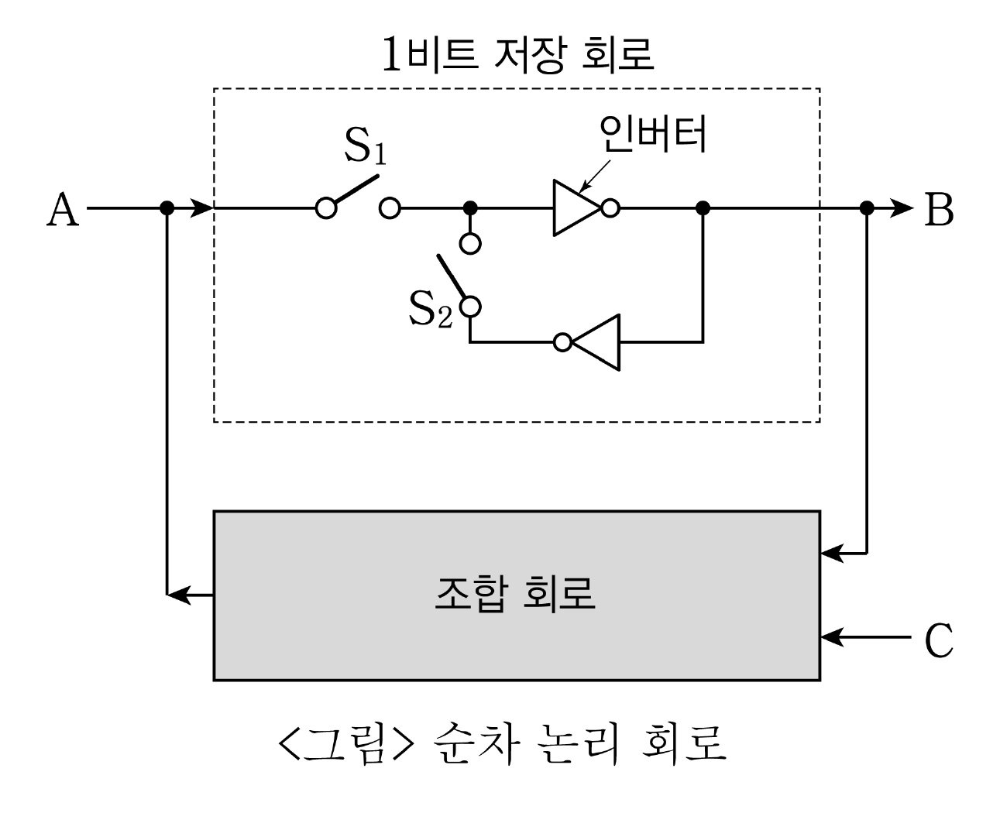

# [01-03] LU (2015)

다음 글을 읽고 물음에 답하시오.

## 제시문

신(臣) 유종원(柳宗元)이 엎드려 살펴보니 이런 일이 있었습니다. 측천무후 시절에 동주(同州)의 하규(下邽)에 서원경(徐元慶)이라는 사람이 있었는데, 아버지 상(爽)이 현의 관리인 조사온(趙師韞)에게 죽었다고 하여 마침내 아버지의 원수를 찔러 죽인 뒤 제 몸을 묶어 관에 자수하였습니다. 그때 진자앙(陳子昻)은 그를 사형에 처하되 정문(旌門)을 세워 주자고 건의하였으며, 또 그 내용을 법령에 넣어 항구적인 법으로 삼자고 청하였습니다. 하지만 신은 그것이 잘못되었다고 생각합니다.

신이 듣기를, 예(禮)의 근본은 무질서를 막고자 하는 것이니, 만약 예에서 해악을 저지르지 말라고 하는데 자식 된 이가 사람을 죽였다면 이는 용서할 수 없습니다. 또한 형(刑)의 근본도 무질서를 막고자 하는 것이니, 만약 형에서 해악을 저지르지 말라고 하는데 관리 된 이가 사람을 죽였다면 이는 용서할 수 없습니다. 결국 그 근본은 서로 합치하면서 그 작용이 이끌어지는 것이니, 정문과 사형은 결코 함께 할 수 없는 것입니다. 정문을 세워 줄 일을 사형에 처하는 것은 남용으로서 형을 지나치게 적용하는 것이 됩니다. 사형에 처할 일에 정문을 세워 주는 것은 참람으로서 예의 근본을 무너뜨리는 것이 됩니다. 과연 이것을 천하에 내보이고 후대에 전하여서 의를 좇는 이가 나아갈 곳을 모르게 하고 해를 피하려는 이가 설 곳을 알지 못하도록 해야 하겠습니까. 과연 이것이 법으로 삼아야 할 만한 일이겠습니까. 무릇 성인(聖人)의 제도에서 도리를 밝혀 상벌을 정하도록 한 것과 사실에 터 잡아 시비를 가리도록 한 것은 모두 하나로 통하는 것입니다. 이 사건에서도 진위를 가려내고 곡직을 바로 하여 근본을 따져본다면, 형과 예의 적용은 뚜렷이 밝혀집니다. 그 까닭은 이렇습니다.

만일 원경의 아버지가 공적인 죄를 지은 것이 아닌데도 사온이 죽였다면 이는 오직 사사로운 원한으로 관리의 기세를 떨쳐 무고한 이를 괴롭힌 게 됩니다. 더구나 고을 수령과 형관은 이를 알아볼 줄도 모르고 위아래로 모두 몽매하여 울부짖는 호소를 듣지 않았습니다. 그리하여 원경은 원수와 같은 하늘 아래서 사는 것을 몹시 부끄럽게 여기며 항상 칼을 품고 예를 실행하려는 마음을 지니다가 마침내 원수의 가슴을 찔렀으니, 이는 꿋꿋이 자신을 이겨낸 행위로서 그때 죽더라도 여한이 없었을 것입니다. 바로 예를 지키고 의를 실행한 것입니다. 그러니 담당 관리는 마땅히 부끄러운 빛을 띠고 그에게 감사하기에 바쁠진대 어찌 사형에 처한단 말입니까.

혹시 원경의 아버지가 면할 수 없는 죄를 지어 사온이 죽인 것이었다면 그것은 자의적으로 법을 집행한 것이 아닙니다. 이는 관리에게 죽은 것이 아니라 법에 의해 죽은 것입니다. 법을 원수로 삼을 수야 있겠습니까. 천자의 법을 원수 삼아 사법 관리를 죽였다면, 이는 패악하여 임금을 능멸한 것입니다. 이런 자는 잡아 죽여야 국법이 바로 설진대 어찌 정문을 세운다는 것입니까.

진자앙은 앞의 건의에서 “사람은 자식이 있고 자식은 반드시 어버이가 있으니, 어버이를 위한 복수가 이어진다면 그 무질서는 누가 구제하겠습니까.”라고 하였습니다. 이는 예를 매우 잘못 이해한 것입니다. 예에서 이야기하는 복수는, 사무치는 억울함이 있는데도 호소할 곳이 없는 경우이지, 죄를 저질러 법에 저촉되어 사형에 처해지는 경우가 아닙니다. 그러므로 “네가 사람을 죽였으니 나도 널 죽이겠다.”라고 말하는 것은 곡직을 따져보지도 않고서 힘없고 약한 이를 겁주는 것이 될 뿐이며, 또한 경전과 성인의 가르침에 심히 위배되는 것입니다.

『주례』에서 “조인(調人)이 뭇사람들의 복수 사건을 담당하여 조정한다. 살인이라도 의에 부합하는 경우에는 그에 대한 복수를 금지한다. 복수는 사형에 처한다. 이를 다시 보복 살해하면, 온 나라가 그를 복수할 것이다.” 하였으니, 어찌 어버이를 위한 복수가 이어질 수 있겠습니까. 『춘추공양전』에서는 “아버지가 무고하게 죽었다면 아들은 복수할 수 있다. 아버지가 죄 때문에 죽었는데 아들이 복수한다면, 이는 무뢰배의 짓거리로서 복수의 폐해를 막지 못한다.”라고 하였습니다. 이러한 관점으로 위의 사건을 판단해 보면 예에 합치합니다. 무릇 복수를 잊지 않는 것은 효이며, 죽음을 돌아보지 않는 것이 의입니다. 원경이 예를 저버리지 않고 효를 지켜 의롭게 죽으려 했으니, 이는 바로 이치를 깨치고 도를 들은 것입니다. 이치를 깨치고 도를 들은 사람에 대해 왕법(王法)이 어찌 보복 살인의 죄인으로 보겠습니까. 진자앙은 도리어 사형에 처해야 한다고 하니, 그것은 형의 남용이며 예의 훼손입니다. 법이 될 수 없다는 것은 뚜렷합니다.

신의 간언을 법령에 반영하시어 사법 관리로 하여금 앞의 건의에 따라 법을 집행하지 않도록 해 주시기를 청합니다. 삼가 아뢰었나이다.

- 유종원, 「복수에 대한 건의를 논박함」

## 01

윗글의 내용에 부합하지 <u>않는</u> 것은?

### 선택지

(1) 진자앙은 서원경의 행위가 예를 어긴 것이라고 보았다.
(2) 호소할 곳 없는 백성에 대한 유종원의 염려가 나타난다.
(3) 보복 살인의 악순환을 경계하는 진자앙의 고심이 엿보인다.
(4) 유종원은 진자앙의 건의 내용이 갖는 자체 모순을 분석하였다.
(5) 유종원은 서원경의 복수를 효의 실천으로 보아 높이 평가하였다.

## 02

윗글에 비추어 볼 때 예와 형에 관한 서술로 적절하지 <u>않은</u> 것은?

### 선택지

(1) 예를 이해하고 적용하는 데는 성인의 가르침과 제도가 훌륭한 전거가 된다.
(2) 예는 의를 좇는 이가 나아갈 바이자, 도리를 밝혀 상벌을 정하는 기준이 된다.
(3) 형은 해를 피하려는 이에게 의지가 되며, 사실을 기반으로 시비를 가리는 수단이 된다.
(4) 형은 범죄 행위를 규정하고 그것을 강제력으로 금지하여 합당한 행위를 유도하는 규칙이 된다.
(5) 예는 혼란을 방지하려는 목적이 있다는 점에서 처벌 법규인 형과는 서로 근본을 달리하는 규범이 된다.

## 03

윗글에 나타난 유종원의 견해로 진자앙의 입장과 대립하는 것은?

### 선택지

(1) 한 사건에서 죄에 대한 처벌과 예에 대한 포상을 동시에 할 수도 있다고 본다.
(2) 어떤 경우라도 부모의 죽음에 대해서는 복수해야 한다고 생각한다.
(3) 예에 합당한 행위에 대하여 형을 부과할 수 없다고 본다.
(4) 예와 형은 모두 존중되어야 할 규범이라고 생각한다.
(5) 복수를 일반적으로 허용하는 것에 대해 찬성한다.

# [04-06] LU (2015)

다음 글을 읽고 물음에 답하시오.

## 제시문

가장 효율적인 자원배분 상태, 즉 ‘파레토 최적’ 상태를 달성하려면 모든 최적 조건들이 동시에 충족되어야 한다. 파레토 최적 상태를 달성하기 위해 $n$개의 조건이 충족되어야 하는데, 어떤 이유로 인하여 어떤 하나의 조건이 충족되지 않고 $n-1$개의 조건이 충족되는 상황이 발생한다면 이 상황이 $n-2$개의 조건이 충족되는 상황보다 낫다고 생각하기 쉽다. 그러나 립시와 랭커스터는 이러한 통념이 반드시 들어맞는 것은 아님을 보였다. 즉 하나 이상의 효율성 조건이 이미 파괴되어 있는 상태에서는 충족되는 효율성 조건의 수가 많아진다고 해서 경제 전체의 효율성이 더 향상된다는 보장이 없다는 것이다. 현실에서는 최적 조건의 일부는 충족되지만 나머지는 충족되지 않고 있는 경우가 일반적이다. 이 경우 경제 전체 차원에서 제기되는 문제는 현재 충족되고 있는 일부의 최적 조건들을 계속 유지하는 것이 과연 바람직한가 하는 것이다. 하나의 왜곡을 시정하는 과정에서 새로운 왜곡이 초래되는 것이 일반적 현실이기 때문에, 모든 최적 조건들을 충족시키려고 노력하는 것보다 오히려 최적 조건의 일부가 항상 충족되지 못함을 전제로 하여 그러한 상황에서 가장 바람직한 자원배분을 위한 새로운 조건을 찾아야 한다는 과제가 제시된다. 경제학에서는 이러한 문제를 <kbd>차선(次善)의 문제</kbd>라고 부른다.

차선의 문제는 경제학 여러 분야의 논의에서 등장한다. 관세동맹 논의는 차선의 문제에 대한 중요한 사례를 제공하고 있다. 관세동맹이란 동맹국 사이에 모든 관세를 폐지하고 비동맹국의 상품에 대해서만 관세를 부과하기로 하는 협정이다. 자유무역을 주장하는 이들은 모든 국가에서 관세가 제거된 자유무역을 최적의 상황으로 보았고, 일부 국가들끼리 관세동맹을 맺을 경우는 관세동맹을 맺기 이전에 비해 자유무역의 상황에 근접하는 것이므로, 관세동맹은 항상 세계 경제의 효율성을 증대시킬 것이라고 주장해왔다. 그러나 <u>ⓐ 바이너는</u> 관세동맹이 세계 경제의 효율성을 떨어뜨릴 수 있음을 지적하였다. 그는 관세동맹의 효과를 무역창출과 무역전환으로 구분하고 있다. 전자는 동맹국 사이에 새롭게 교역이 창출되는 것을 말하고 후자는 비동맹국들과의 교역이 동맹국과의 교역으로 전환되는 것을 의미한다. 무역창출은 상품의 공급원을 생산비용이 높은 국가에서 생산비용이 낮은 국가로 바꾸는 것이기 때문에 효율이 증대되지만, 무역전환은 공급원을 생산비용이 낮은 국가에서 생산비용이 높은 국가로 바꾸는 것이므로 효율이 감소한다. 관세동맹이 세계 경제의 효율성을 증가시키는가의 여부는 무역창출 효과와 무역전환 효과 중 어느 것이 더 큰가에 달려 있다. 무역전환 효과가 더 크다면 일부 국가들 사이의 관세동맹은 세계 경제의 효율성을 떨어뜨리게 된다.

차선의 문제는 소득에 부과되는 직접세와 상품 소비에 부과되는 간접세의 상대적 장점에 대한 오랜 논쟁에서도 등장한다. 경제학에서는 세금이 시장의 교란을 야기하여 자원배분의 효율성을 떨어뜨린다는 생각이 일반적이다. 아무런 세금도 부과되지 않는 것이 파레토 최적 상태이지만, 세금 부과는 불가피하므로 세금을 부과하면서도 시장의 왜곡을 줄일 수 있는 방법을 찾고자 했다. 이와 관련해, 한 가지 상품에 간접세가 부과되었을 경우 그 상품과 다른 상품들 사이의 상대적 가격에 왜곡이 발생하므로, 이 상대적 가격에 영향을 미치지 않는 직접세가 더 나을 것이라고 주장하는 <u>㉠ 핸더슨과</u> 같은 학자들이 있었다. 그러나 이는 직접세가 노동 시간과 여가에 영향을 미치지 않는다는 가정 아래서만 성립하는 것이라고 <u>㉡ 리틀은</u> 주장하였다. 한 상품에 부과된 간접세는 그 상품과 다른 상품들 사이의 파레토 최적 조건의 달성을 방해하게 되지만, 직접세는 여가와 다른 상품들 사이의 파레토 최적 조건의 달성을 방해하게 되므로, 직접세가 더 효율적인지 간접세가 더 효율적인지를 판단할 수 없다는 것이다. 나아가 리틀은 여러 상품에 차등적 세율을 부과할 경우, 직접세만 부과하는 경우나 한 상품에만 간접세를 부과하는 경우보다 효율성을 더 높일 수 있는 가능성이 있음을 언급했지만 정확한 방법을 제시하지는 못했다. <u>㉢ 콜레트와 헤이그는</u> 직접세를 동일한 액수의 간접세로 대체하면서도 개인들의 노동 시간과 소득을 늘릴 수 있는 조건을 찾아냈다. 그것은 여가와 보완관계가 높은 상품에 높은 세율을 부과하고 경쟁관계에 있는 상품에 낮은 세율을 부과하는 것이었다. 레저 용품처럼 여가와 보완관계에 있는 상품에 상대적으로 더 높은 세율을 부과하여 그 상품의 소비를 억제시킴으로써 여가의 소비도 줄이는 것이 가능해진다.

## 04

<kbd>차선의 문제</kbd>에 대한 이해로 적절하지 <u>않은</u> 것은?

### 선택지

(1) 파레토 최적 조건들 중 하나가 충족되지 않을 때라면, 나머지 조건들이 충족된다고 하더라도 차선의 효율성이 보장되지 못한다.
(2) 전체 파레토 조건 중 일부가 충족되지 않은 상황에서 차선의 상황을 찾으려면 나머지 조건들의 재구성을 고려해야 한다.
(3) 주어진 전체 경제상황을 개선하는 과정에서 기존에 최적 상태를 달성했던 부문의 효율성이 저하되기도 한다.
(4) 차선의 문제가 제기되는 이유는 여러 경제부문들이 독립적이지 않고 서로 긴밀히 연결되어 있기 때문이다.
(5) 경제개혁을 추진할 때 비합리적인 측면들이 많이 제거될수록 이에 비례하여 경제의 효율성도 제고된다.

## 05

A, B, C 세 국가만 있는 세계에서 A국과 B국 사이에 관세동맹이 체결되었다고 할 때, ⓐ의 입장을 지지하는 사례로 활용하기에 적절한 것은?

### 선택지

(1) 관세동맹 이전 A, B국은 X재를 생산하지 않고 C국에서 수입하고 있었다. 관세동맹 이후에도 A, B국은 X재를 C국에서 수입하고 있다.
(2) 관세동맹 이전 B국은 X재를 생산하고 있었고 A국은 최저비용 생산국인 C국에서 수입하고 있었다. 관세동맹 이후 A국은 B국에서 X재를 수입하게 되었다.
(3) 관세동맹 이전 A, B국은 모두 X재를 생산하고 있었고 C국에 비해 생산비가 높았다. 관세동맹 이후 A국은 생산을 중단하고 B국에서 X재를 수입하게 되었다.
(4) 관세동맹 이전 B국이 세 국가 중 최저비용으로 X재를 생산하고 있었고 A국은 X재를 B국에서 수입하고 있었다. 관세동맹 이후에도 A국은 B국에서 X재를 수입하고 있다.
(5) 관세동맹 이전 A, B국 모두 X재를 생산하고 있었고 A국이 세 국가 중 최저비용으로 X재를 생산하는 국가이다. 관세동맹 이후 B국은 생산을 중단하고 A국에서 X재를 수입하게 되었다.

## 06

<보기>의 상황에 대한 ㉠～㉢의 대응을 추론한 것으로 적절하지 <u>않은</u> 것은?

### 보기

일반 상품을 X와 Y, 여가를 L이라고 하고, 두 항목 사이에 파레토 최적 조건이 성립한 경우를 ‘⇔’, 성립하지 않은 경우를 ‘⇎’라는 기호로 표시하기로 하자.

| ㉮ | ㉯ | ㉰ | ㉱ |
| --- | --- | --- | --- |
| 세금이 부과되지 않은 상황 | X에만 간접세가 부과된 상황 | 직접세가 부과된 상황 | X, Y에 차등 세율의 간접세가 부과된 상황 |
| X ⇔ Y X ⇔ L Y ⇔ L | X ⇎ Y X ⇎ L Y ⇔ L | X ⇔ Y X ⇎ L Y ⇎ L | X ⇎ Y X ⇎ L Y ⇎ L |

### 선택지

(1) ㉠은 직접세가 여가에 미치는 효과를 고려하지 않고 ㉰가 ㉯보다 효율적이라고 본다.
(2) ㉡은 ㉮와 ㉰의 효율성 차이를 보임으로써 립시와 랭커스터의 주장을 뒷받침한다.
(3) ㉡은 ㉯와 ㉰의 효율성을 비교할 수 없다는 점을 보임으로써 ㉠을 비판한다.
(4) ㉢은 ㉱가 ㉰보다 효율적일 수 있다는 것을 보임으로써 립시와 랭커스터의 주장을 뒷받침한다.
(5) ㉢은 ㉱가 ㉰보다 효율적일 수 있다는 것을 보임으로써 이를 간접세가 직접세보다 효율적인 사례로 제시한다.

# [07-10] LU (2015)

다음 글을 읽고 물음에 답하시오.

## 제시문

예술사를 양식의 특수하고 자족적인 역사가 아니라 거시적 차원의 보편적 정신사 및 그 발전 법칙에 의거한다고 본 점에서 헤겔의 예술론은 구체적 작품들에 대한 풍부하고 수준 높은 진술을 포함하고 있음에도 전형적인 철학적 미학에 속한다. 그는 예술사를 ‘상징적’, ‘고전적’, ‘낭만적’이라고 불리는 세 단계로 구분한다. 유의할 것은 이 단어들이 특정 예술 유파를 일컫는 일반적 용법과는 사뭇 다르게 사용된다는 점이다. 즉 이 세 용어는 지역 개념을 수반하는 문명사적 개념으로서 일차적으로는 태고의 오리엔트, 고대 그리스, 중세부터의 유럽에 각각 대응하며, 좀 더 심층적인 차원에서는 ‘자연 종교’, ‘예술 종교’, ‘계시 종교’라는 종교의 유형적 단계에 각각 대응한다. 나아가 이러한 대응 관계의 단계적 설정은 신이라는 ‘내용’과 그것의 외적 구현인 ‘형식’의 일치 정도에 의거하며, 가장 근본적으로는 순수한 개념적 사유를 향해 점증적으로 발전하는 지성 일반의 발전 법칙에 의거한다. 게다가 이 세 범주는 장르들에도 적용되어, 첫째 건축, 둘째 조각, 셋째 회화․음악․시문학이 차례로 각 단계에 대응한다. 장르론과 결합된 예술사론을 통해 헤겔은 역사의 특정 단계에 여러 장르가 공존하는 것을 인정하면서도 각 단계에 대응하는 전형적 장르는 특정 장르로 한정한다.

‘상징적’ 단계는 인간 정신이 아직 절대자를 어떤 구체적 실체로서 의식하지 못한 채, 절대적인 ‘무엇’을 향한 막연한 욕구만 지닐 뿐인 상태를 가리킨다. 오리엔트 자연 종교로 대표되는 이 단계에는 ‘신적인 것의 구체적 상을 찾아 헤맴’만 있을 뿐이다. 감관을 압도하는 거대 구조물이 건립되지만 그것은 그저 신을 위한 공간의 구실만 하지, 정작 신이 놓일 자리에는 신의 특정한 덕목(예컨대 ‘강함’)을 어렴풋이 표현할 수 있는 자연물(예컨대 사자)의 형상이 대신 놓인다. 미약한 내용을 거대한 형식이 압도함으로써 미의 실현에는 아직 미치지 못한 이 단계의 전형적 장르는 신전으로 대표되는 건축이다.

‘고전적’ 단계에서는 내용과 형식의 이러한 불일치가 극복된다. 고대 그리스 인들은 신들을 근본적으로 인간적 특질을 지닌 존재로 분명하게 의식했기 때문에, 이제 절대자는 어떤 생소한 자연물이 아니라 삼차원적 인체가 그대로 형상화되는 방식으로 제시되며, 이 단계를 대표하는 장르는 조각이다. 내용과 형식의 완전한 일치를 이룸으로써 그리스의 조각은 더 이상 재연될 수 없는 미의 극치로 평가된다. 나아가 예술 그 자체가 신성의 직접적 구현이기 때문에 이 단계의 예술은 그 자체가 이미 종교이며, 이에 따라 예술 종교라고 불린다.

그런데 인간의 지성은 이러한 미적 정점에 안주하지 않는다. 즉 지성은 절대자를 인간의 신체를 지닌 것으로 믿는 단계를 넘어 순수한 정신적 실체로 여기는 계시 종교로 나아가는데, 이로써 정신적 내면성이 감각적 외면성을 압도하는 ‘낭만적’ 단계가 도래한다. 그리고 조각의 삼차원성을 탈피한 회화를 시작으로 음악과 시문학이 차례로 대표적 장르가 됨으로써, 예술 또한 감각적 요소가 아닌 정신적 요소에 의거하는 방향으로 발전한다. 이 때문에 내용과 형식의 부조화가 다시 일어나지만, 그럼에도 이 단계는 상징적 단계와는 질적으로 다르다. 상징적 단계에서는 제대로 된 정신적 내용이 아직 형성조차 되지 않았지만, 낭만적 단계에서는 감각적 형식으로는 담을 수 없을 정도의 고차적 내용이 지배하기 때문이다. 나아가 이 단계는 새로운 더 높은 단계가 존재하지 않는, 정신과 역사의 최종 지점이기 때문에, 이후에 벌어지는 국면들은 모두 ‘낭만적’이라고 불릴 수 있다.

주목할 것은 헤겔이 순수 미학적 차원에서는 출발-완성-하강의 순서로 진행되는 이행 모델을, 그리고 근본적인 정신사적 차원에서는 출발-상승-완성의 순서로 진행되는 이행 모델을 따른다는 점이다. 즉 세 단계의 순서적 배열은 전자의 차원에서는 예술미의 정점이 두 번째 단계에서 이루어지도록, 그리고 후자의 차원에서는 지성의 정점이 세 번째 단계에서 이루어지도록 구성된다. 나아가 일견 불일치를 보일 법한 이 두 모델을 절묘하게 조화시킨 그의 이론은 이중적 기능을 수행한다. 즉 정신사적 차원에서의 정점이 예술미의 차원에서는 오히려 퇴보를 의미하도록 구성된 이 이론은 한편으로는 ‘추(醜)’도 새로운 미적 가치로 인정되기 시작한 당시의 상황은 물론, ‘개념적’이라고까지 일컬어질 만큼 예술의 지성화가 진행된 오늘날의 상황까지 예견하여 설명할 수 있는 포섭력을 가지며, 다른 한편으로는 절대자의 제시라는 과제를 예술이 수행할 수 있는 가능성을 고대 그리스로 한정하고 철학이라는 최고의 지적 영역에 그 과제를 이관시키는, 곧 ‘예술의 종언’ 명제라 불리는 미학적 결론에 이른다.

## 07

윗글에 제시된 헤겔의 입장에 부합하는 것은?

### 선택지

(1) 예술은 내용과 형식의 합일이라는 구체적 방식으로 구현되므로, 작품의 해석에서 가장 중요한 것은 일반 개념에 앞선 개별 작품의 파악이다.
(2) 예술의 단계적 변천은 인간 정신의 보편적 발전에 의해 추동되므로, 작품들의 미적 수준의 차이는 그것들의 장르적 상이성과 무관하다.
(3) 문명의 모든 단계적 이행은 인간 정신의 발전 논리에 따라 이루어지므로, 예술의 역사는 다른 영역의 역사와 연계되어 기술되어야 한다.
(4) 예술은 인간 정신의 심층적 차원을 표출한 것이므로, 예술미의 성취 여부는 형식이 아니라 내용에 의해 판단되어야 한다.
(5) 예술 양식 변화의 근원은 인간 내면의 보편적인 정신적 욕구에 있으므로, 모든 시대의 작품들은 동등한 가치를 지닌다.

## 08

윗글에 따라 각 시대의 장르를 설명한 것으로 적절하지 <u>않은</u> 것은?

### 선택지

(1) 태고 오리엔트의 조각은 상징적 단계의 전형적인 예술이 아니다.
(2) 고대 그리스의 서사시는 고전적 단계의 전형적인 예술이 아니다.
(3) 중세의 기독교 회화는 낭만적 단계의 전형적인 예술이 아니다.
(4) 근대의 고전주의 음악은 낭만적 단계의 전형적인 예술이다.
(5) 현대의 건축은 낭만적 단계의 전형적인 예술이 아니다.

## 09

윗글을 바탕으로 추론할 수 있는 것으로 적절한 것은?

### 선택지

(1) 가장 앞 단계의 예술이 가장 아름다운 예술이다.
(2) 가장 뒷단계의 예술이 가장 아름다운 예술이다.
(3) 가장 아름다우면서도 가장 지성적인 예술은 없다.
(4) 가장 비지성적인 예술이 가장 아름다운 예술이다.
(5) 가장 추한 예술이 오히려 가장 아름다운 예술이다.

## 10

윗글에 나타난 헤겔의 예술론을 평가한 것으로 가장 적절한 것은?

### 선택지

(1) 개념에 주로 의존하는 전형적인 철학적 미학이기 때문에 논증적 수준은 높지만 실질적 사례를 언급한 경우는 많지 않다.
(2) 당대까지의 예술 현상에 대한 제한된 경험에 기초하기 때문에 이후 시대의 예술적 상황에 대해서는 설명력을 결여하고 있다.
(3) 정신사적 차원에서의 설명과 종교사적 차원에서의 설명을 분리함으로써 양자 간에 발생한 결론상의 모순을 해결하지 못하였다.
(4) 예술사의 시대 구분과 각 예술 장르에 대한 설명이 서로 무관한 논리와 개념에 의거하기 때문에 이론의 전체적 정합성이 떨어진다.
(5) 당대 유럽 이외의 문화를 상대적으로 미성숙한 지성적 단계에 위치시킴으로써 이론적으로 근대 서구의 자기 우월적 태도를 드러내고 있다.

# [11-13] LU (2015)

다음 글을 읽고 물음에 답하시오.

## 제시문

남극 대륙에는 모두 녹을 경우 해수면을 57미터 높일 정도의 얼음이 쌓여 있다. 그 중에서 빙붕(ice shelf)이란 육지를 수 킬로미터 두께로 덮고 있는 얼음 덩어리인 빙상(ice sheet)이 중력에 의해 해안으로 밀려 내려가다가 육지에 걸친 채로 바다 위에 떠 있는 부분을 말한다. 남극 대륙에서 해안선의 약 75%가 빙붕으로 덮여 있는데, 그 두께는 100～1,000미터이다. 시간에 따른 빙붕 질량의 변화는 지구 온난화와 관련하여 기후학적으로 매우 중요한 요소이다. 빙붕에서 얼음의 양이 줄어드는 요인으로서 빙산으로 조각나 떨어져 나오는 얼음의 양은 비교적 잘 측정되고 있지만, 빙붕 바닥에서 따뜻한 해수의 영향으로 얼음이 얼마나 녹아 없어지는가는 그동안 잘 알려지지 않았다. 빙붕 아래쪽은 접근하기가 어려워 현장 조사가 제한적이기 때문이다. 더구나 최근에는 남극 대륙 주변의 바람의 방향이 바뀌면서 더 따뜻한 해수가 빙붕 아래로 들어오고 있어서 이에 대한 정확한 측정이 요구된다. 빙붕 바닥에서 얼음이 녹는 양은 해수면 상승에 영향을 미치기 때문이다.

육지에서 흘러내려와 빙붕이 되는 얼음의 질량(A)과 빙붕 위로 쌓이는 눈의 질량(B)은 빙붕의 얼음을 증가시키는 요인이 된다. 반면에 빙산으로 부서져 소멸되는 질량(C)과 빙붕의 바닥에서 녹는 질량(D)은 빙붕의 얼음을 감소시킨다. 이 네 가지 요인으로 인하여 빙붕 전체 질량의 변화량(E)이 결정된다. 남극 빙붕에서 생성되고 소멸되는 얼음의 질량에 대한 정확한 측정은 인공위성 관측 자료가 풍부해진 최근에야 가능하게 되었다.

A는 빙붕과 육지가 만나는 경계선에서 얼음의 유속과 두께를 측정하여 계산한다. 얼음의 유속은 일정한 시간 간격을 두고 인공위성 레이더로 촬영된 두 영상 자료의 차이를 이용하여 수 센티미터의 움직임까지 정확하게 구할 수 있다. 얼음의 두께는 먼저 인공위성 고도계를 통해 물 위에 떠 있는 얼음의 높이를 구하고, 해수와 얼음의 밀도 차에 따른 부력을 고려하여 계산한다. B는 빙붕 표면에서 시추하여 얻은 얼음 코어와 기후 예측 모델을 통해 구할 수 있는데, 그 정확도는 비교적 높다. C는 떨어져 나오는 빙산의 면적과 두께를 이용하여 측정할 수도 있으나, 빙산의 움직임이 빠를 경우 그 위치를 추적하기 어렵고 해수의 작용으로 빙산이 빠르게 녹기 때문에 이 방법으로는 정확한 측정이 쉽지 않다. 따라서 보다 정밀한 측정을 위해 빙붕의 끝 자락에서 육지 쪽으로 수 킬로미터 상부에 위치한 임의의 기준선에서 측정된 얼음의 유속과 두께를 통해 구하는 방식으로 장기적으로 신뢰할 만한 값을 구한다. E는 빙붕의 면적과 두께를 통해 구하며, 이 모든 요소를 고려하여 D를 계산한다.

연구 결과, 남극 대륙 전체의 빙붕들에서 1년 동안의 A는 2조 490억 톤, B는 4,440억 톤, C는 1조 3,210억 톤, D는 1조 4,540억 톤이며, E는 －2,820억 톤인 것으로 나타났다. 남극 대륙 빙붕의 질량 감소 요인 중에서 D가 차지하는 비율인 R 값을 살펴보면, 남극 대륙 전체의 평균은 52%이지만, 지역에 따라 10%에서 90%에 이르는 극명한 차이를 보인다. 남극 대륙 전체 해역을 경도에 따라 4등분할 때, 서남극에 위치한 파인 아일랜드 빙붕과 크로슨 빙붕 같은 소형 빙붕들에서 R 값의 평균은 74%를 보였고, 그 외 지역에서는 40% 내외였다. 특히 남극에서 빙산의 3분의 1을 생산해 내는 가장 큰 빙붕으로 북남극과 서남극에 걸친 필크너-론 빙붕, 남남극의 로스 빙붕에서 R 값은 17%밖에 되지 않았다.

남극 전체 빙붕의 91%의 면적을 차지하는 상위 10개의 대형 빙붕에서는 남극 전체 D 값 중 50% 정도밖에 발생하지 않으며, 나머지는 9% 면적을 차지하는 소형 빙붕들에서 발생한다. 이는 소형 빙붕들이 상대적으로 수온이 높은 서남극 해역에 많이 분포하고 있기 때문이다. 따라서 대형 빙붕들 위주로 조사한 데이터를 면적 비율에 따라 남극 전체에 확대 적용해 온 기존의 연구 결과에는 남극 전체의 D 값이 실제와 큰 <u>㉠ 오차가</u> 있었을 것이다.

빙붕의 단위 면적당 D 값인 S 값을 살펴보면, 남극 전체에서 1년에 약 0.81미터 두께의 빙붕 바닥이 녹아서 없어지는 것으로 나타났으며, 지역적으로는 0.07～15.96미터로 편차가 컸다. 특히 서남극의 소형 빙붕에서는 매우 큰 값을 보여 주었으나, 다른 지역의 대형 빙붕은 작은 값을 보였다. 이는 빙붕 바닥에서 육지와 맞닿은 곳 근처에서는 얼음이 녹고, 육지에서 멀리 떨어진 곳에서는 해수의 결빙이 이루어지기 때문이다.

## 11

A～E를 구하는 과정에 대한 설명으로 옳지 <u>않은</u> 것은?

### 선택지

(1) A는 수면 위의 빙붕의 높이에 관한 정보를 활용하여 구한다.
(2) B는 빙붕에서 직접 채취한 시료를 이용하여 추정한 값으로 구한다.
(3) C는 떨어져 나온 빙산 양을 추적하는 방식으로는 정확하게 구하기 쉽지 않다.
(4) D는 해수의 온도와 해수 속에서 녹는 얼음의 양을 직접 측정하여 구한다.
(5) E는 빙붕의 두께 변화에 대한 정보를 얻어야 측정할 수 있다.

## 12

㉠과 관련하여 추론한 것으로 적절하지 <u>않은</u> 것은?

### 선택지

(1) 남극 전체의 S 값이 실제 값보다 작게 파악되는 결과를 초래했다.
(2) 남극 전체의 R 값이 실제 값보다 작게 파악되는 결과를 초래했다.
(3) 파인 아일랜드 빙붕의 R 값이 실제 값보다 작게 파악된 것과 같은 이유 때문에 발생했다.
(4) 크로슨 빙붕의 S 값이 실제 값보다 작게 파악된 것과 같은 이유 때문에 발생했다.
(5) 로스 빙붕의 R 값이 실제 값보다 작게 파악된 것과 같은 이유 때문에 발생했다.

## 13

윗글을 바탕으로 <보기>에 대해 논의한 것으로 옳은 것은?

### 보기

최근의 한 연구에서 서남극에서 녹는 얼음이 몇 세기에 걸쳐 멈출 수 없는 해수면 상승을 일으킬 가능성이 높은 것으로 나타났다. 이 지역에는 모두 녹으면 해수면을 5미터 상승시킬 얼음이 분포한다. 이곳에 위치한 아문센 해는 해저 지형이 해수가 진입하기 좋게 형성되어 있어서 해수가 빙붕을 녹이는 데 용이한 조건을 구비하고 있다. 더구나 이곳에는 빙붕의 진행을 막아 줄 섬도 없어 미끄러져 내려오는 빙상을 저지하지 못하기 때문에 해수에 녹아 들어가는 빙붕의 양은 계속 많아질 전망이다.

### 선택지

(1) 아문센 해 인근의 해안에는 대형 빙붕들이 많이 분포할 것이다.
(2) 아문센 해에서는 빙붕의 두께가 줄어드는 속도가 남극 대륙의 평균값보다 클 것이다.
(3) 아문센 해 인근의 빙붕의 바닥이 빠르게 녹으면서 인접한 빙상이 수년 내에 고갈될 것이다.
(4) 서남극의 얼음 총량이 다른 남극 지역보다 더 많기 때문에 해수면 상승 효과가 더 클 것이다.
(5) 서남극에서 빙상의 이동 속도가 증가하는 것은 떨어져 나가는 빙산의 양을 통해 알 수 있을 것이다.

# [14-16] LU (2015)

다음 글을 읽고 물음에 답하시오.

## 제시문

우리는 정치 과정에서 정치 세력이 충돌하는 교착 상태를 종종 보게 된다. 교착이란 행정부(집행부)와 의회가 각각 정책 변화를 원함에도 불구하고 <u>㉠ 양자의 선호가 일치하지 않는 상태로</u> 인해 입법에 실패하여 기존 정책이 그대로 유지되기까지의 정치 과정을 가리킨다. 교착이 일어나는 주요 원인으로는 통치형태의 주요 특징이 지적되었다.

대통령제에서 대통령과 의회가 따로 선출되고 고정된 임기 안에 서로 불신임의 대상이 되지 않는다는 점과 대통령이 내각 운영에서 전권을 발휘한다는 점은 대통령과 의회 간의 마찰을 유발하는 조건이 된다. 특히 법안발의권 등 대통령의 입법 권한이 강할수록 대통령이 의회와 마찰할 가능성이 커진다. 교착은 단점정부보다는 분점정부일 때, 즉 대통령의 소속 당이 의회에서 과반 의석을 얻지 못했을 때 많이 발생한다.

한편 의회 다수당이 내각을 구성하며 의회가 내각에 대한 불신임권을 가지는 내각제에서는 교착의 발생이 훨씬 줄어든다. 가령 다수당이 과반 의석을 얻지 못해도, 다른 소수당과 연립정부를 구성하여 의회의 과반을 형성하거나, 총리와 내각이 의회 다수파에 의해 교체되거나, 총리가 의회를 해산하고 조기 총선을 치러 새 내각을 구성한다면 교착을 피할 수 있다. 내각제가 제대로 작동하기 위해서는 연립정부 구성과 해체 등의 과정에서 대체로 정당 기율이 강할 것이 요구된다.

대통령제에서의 교착을 해소하기 위해 제도적 변형을 시도한 것으로 프랑스의 이원집정부제가 있다. 이원집정부제는 고정된 임기의 대통령을 직접 선거로 선출한다는 점에서 대통령제와 같지만, 대통령의 소속 당이 의회의 과반을 갖지 못하면 대통령은 의회에서 선출된 야당 대표를 총리로 임명하고 총리가 정국 운영을 주도한다는 점이 다르다. 동거정부라 불리는 이 경우에 정부는 내각제처럼 운영된다. 단, 대통령과 총리 사이의 권한을 둘러싼 분쟁으로 교착이 발생하기도 한다. 반대로 단점정부의 경우에는 대통령제와 유사하게 운영된다. 의회는 원내 양당제를 유도하는 결선투표제로 구성된다.

대통령제에서 정당 체계와 선거 제도는 교착에 영향을 준다. 정당 체계에서 비례대표제는 다당제를 유도하는데, 다당제는 의회 다수파 형성을 어렵게 한다. 양원제에서는 상원 다수당과 하원 다수당 중 하나가 대통령의 소속 당과 다를 때 분점정부가 나타난다. 정당의 기율을 강하게 하는 제도적 장치가 있거나 정당이 이념적으로 양극화될 때도 분점정부 상황에서는 대통령이 의회 과반의 지지를 확보하기 어려울 수 있다. 한편 의회와 대통령 선거를 동시에 실시하는 경우, 대통령 당선 유력 후보의 후광효과가 일어나 분점정부의 발생 가능성을 낮추는 효과가 생긴다. 아울러 분점정부라도 야당이 대통령의 거부권을 막을 수 있는 의석수를 확보하고 있다면 교착이 발생하지 않을 수 있다.

다양한 의회제도 또한 교착에 영향을 미친다. 의사진행을 촉진하는 의장의 권한이 강하다면, 분점정부 상황에서는 대통령의 거부권 행사 가능성으로 인해 교착이 발생할 수 있다. 그리고 교섭단체 제도처럼 원내 다수당과 소수당 간의 합의를 강조하는 제도가 있으면 심지어 단점정부 상황이라고 해도 교착이 생길 수 있다. 이는 다수당이 강행하려는 의제를 소수당이 지연시킬 수 있기 때문이다. 또 소수당이 입법 지연을 목적으로 활용하는 필리버스터(의사진행 방해 발언)도 교착을 발생시킬 수 있다. 필리버스터의 종결에 요구되는 의결정족수까지 높게 규정되어 있으면, 교착은 잘 해소되지 않는다. 그밖에 사회적 합의가 어려운 쟁점이 법안으로 다루어질 경우도 교착이 일어날 확률이 높다.

대통령제 아래 분점정부 상황의 교착을 완화하는 제도적 방안으로는 남미 국가들의 경험처럼 연립정부를 구성하는 것도 있다. 대통령제를 내각제처럼 운영하려는 이 대안은 소수파 대통령이 야당들과의 협상을 통해 공동 내각을 구성하여 의회 과반의 지지를 확보할 수 있다는 점에 착안한 것이다. 이 경우 정당의 기율이 강하다면 협상 과정에서 이탈자를 줄일 수 있으며, 대통령의 강한 권한도 연립정부의 유지에 긍정적 역할을 할 수 있다. 이 과정에서 비례대표제를 의회선거에, 결선투표제를 대통령선거에 각각 적용해 동시에 선거를 치르면, 연립정부 구성이 쉬워진다는 연구 결과도 있다. 두 선거를 같은 시기에 치르면 정당 난립을 억제하는 효과가 있고, 대통령선거가 결선투표로 갈 때 일차 선거와 결선투표 시기 사이에 연립내각을 구성하기 위한 정당 간 협상이 활발하게 일어날 수 있기 때문이다.

한편 교착 완화를 위해 미국처럼 대통령이 야당 의원들을 설득하여 법안마다 과반의 지지를 확보하는 방안도 있다. 이는 정당의 기율이 약하고 의회선거 제도가 단순다수 소선거구제일 때 주로 적용된다. 이런 경우에는 의회가 양당제로 구성되고 의원들의 정치적 자율성이 높으므로 대통령이 의원들을 설득하기 쉬워진다. 특히 대통령의 입법 권한이 약하기 때문에 대통령은 의회에 로비할 필요성을 더 느끼게 된다. 이 방법들은 대통령이 의회에서 새로운 과반의 지지를 얻는 데 목적이 있다.

## 14

㉠을 해결하기 위한 시도로 적절하지 <u>않은</u> 것은?

### 선택지

(1) 대통령제에서 대통령이 의회 다수당과 연립정부를 구성하려는 경우
(2) 대통령제에서 대통령이 의회 과반의 지지를 얻으려고 의회에 로비를 하려는 경우
(3) 내각제에서 총리가 소수당과 연립정부를 구성하려는 경우
(4) 내각제에서 총리가 조기 총선을 요구해 새로운 내각을 구성하려는 경우
(5) 이원집정부제에서 동거정부일 때 대통령이 정국을 주도하려는 경우

## 15

윗글에 따라 대통령제에서 정치 환경의 변화를 추론한 것으로 적절한 것은?

### 선택지

(1) 다수당이지만 필리버스터를 종결할 만큼 의석을 차지하지 못한 야당에 소속된 의장이 갈등 법안을 본회의에 직권상정하면, 교착이 완화될 것이다.
(2) 비례대표제를 채택한 의회선거를 대통령선거와 동시에 치르면, 시기를 달리해 두 선거를 치를 때보다 분점정부가 발생할 확률이 낮아질 것이다.
(3) 양원제 의회를 모두 비례대표제로 구성하면, 단순다수 소선거구제로 구성할 때보다 분점정부가 발생할 확률이 낮아질 것이다.
(4) 야당이 대통령의 거부권 행사를 무력화할 만큼의 의석을 가진다면, 교착이 악화될 것이다.
(5) 양극화된 정당 체계에서 교섭단체 간의 합의 요건을 강화하면, 교착이 완화될 것이다.

## 16

윗글을 바탕으로 <보기>에 대해 추론한 것으로 적절한 것은?

### 보기

행정부와 의회 간의 빈번한 교착으로 정치 불안이 심각한 상태인 A국의 정치학자 K가 ㉮～㉰의 제도를 설계하여 제안했다. 현재 대통령제 국가인 A국은 양당제로 분점정부 상태이다. 대통령은 법안발의권 등 강한 권한을 지니고 있다. 대통령은 결선투표제로 선출한다. 의회는 단순다수 소선거구제로 구성한다. 정당의 기율은 강하다.

|  | 대통령의 입법 권한 | 의회선거 제도 | 정당 기율 관련 법제 |
| --- | --- | --- | --- |
| ㉮ | 축소 | 결선투표제로 변경 | 유지 |
| ㉯ | 유지 | 비례대표제로 변경 | 유지 |
| ㉰ | 축소 | 유지 | 약화 |

### 선택지

(1) K는 ㉮를 설계하면서 미국식 대통령제를 염두에 두었을 것이다.
(2) K는 ㉮를 설계하면서 프랑스식 이원집정부제를 염두에 두었을 것이다.
(3) K는 ㉯를 설계하면서 미국식 대통령제를 염두에 두었을 것이다.
(4) K는 ㉰를 설계하면서 남미식 대통령제를 염두에 두었을 것이다.
(5) K는 ㉰를 설계하면서 프랑스식 이원집정부제를 염두에 두었을 것이다.

# [17-20] LU (2015)

다음 글을 읽고 물음에 답하시오.

## 제시문

김소월은 낭만적인 슬픔을 소박하고 서정적인 시구로 가장 아름답게 노래한 시인이다. 그러나 김소월의 슬픔은 「불놀이」의 슬픔과 그 역학을 달리한다. 주요한의 「불놀이」에는 슬픔에 섞여 생(生)의 잠재적 가능성에 대한 갈망이 강력하게 표현되었다가 곧 사라지고 만다. 이러한 주요한의 슬픔이 실현되지 아니한 가능성의 슬픔이라면, 소월의 슬픔은 차단되어 버린 가능성을 깨닫는 데서 오는 슬픔이다. 그는 쓰고 있다.

살았대나 죽었대나 같은 말을 가지고 사람은 살아서 늙어서야
죽나니, 그러하면
그 역시 그럴 듯도 한 일을, 하필코 내 몸이라 그 무엇이 어
째서 오늘도 산마루에 올라서서 우느냐.

김소월에게서 우리는 생에 대한 깊은 허무주의를 발견한다. 이 허무주의는 소월이 보다 큰 시적 발전을 이루는 데 커다란 장애물이 된다. 허무주의는 그로 하여금 보다 넓은 데로 향하는 생의 에너지를 상실하게 하고, 그의 시로 하여금 한낱 자기 탐닉의 도구로 떨어지게 한다. 소월의 슬픔은 말하자면 자족적인 것이다. 그것은 그것 자체의 해결이 된다. 슬픔의 표현은 그대로 슬픔으로부터의 해방이 되는 것이다.

시에서의 부정적인 감정의 표현은 대개 이러한 일면을 갖는다. 문제는 그것의 정도와 근본적인 지향에 있다. 그것은 자기 연민의 감미로움과 체념의 평화로써 우리를 위로해 준다. 그렇다고 해서 모든 시가 멜로드라마의 대단원처럼 분명한 긍정을 제시해야 한다는 말은 아니다. 우리는 소월의 경우보다 더 깊이 생의 어둠 속으로 내려간 인간들을 안다. 횔덜린이나 릴케의 경우가 그렇다. 이들에게 있어서 고통은 깊은 절망이 된 다음 난폭하게 다시 세상으로 튕겨져 나온다. 그리하여 절망은 절망을 만들어 내는 세계에 대한 맹렬한 반항이 된다. 이들이 밝음을 긍정했다면, 어둠을 거부하는 또는 어둠을 들추어내는 행위 그 이상의 것으로서 긍정한 것은 아니다. 앞에서 말한 바와 같이 소월의 부정적 감정주의의 잘못은 그것이 부정적이라는 사실보다 밖으로 향하는 에너지를 가지고 있지 않다는 데에 있다.

안으로 꼬여든 감정주의의 결과는 시적인 몽롱함이다. 밖에 있는 세계나 정신적인 실체의 세계는 분명한 현상으로 파악되지 아니한다. 모든 것은 감정의 안개 속에 흐릿한 모습을 띠게 된다. 앞에서 우리는 부정적인 감정주의가 밖으로 향하는 에너지를 마비시킨다는 사실을 언급하였는데, 이 밖으로 향하는 에너지란 ‘보려는’ 에너지와 표리일체를 이룬다. 시에서 가장 중요한 것은 바르게 보는 것이며, 여기서 바르게 본다는 것은 가치의 질서 속에서 본다는 것이다. 그러니까 시는 거죽으로 그렇게 나타나지 않을 경우에 있어서도 인간에 대한 신념을 전제로 가지고 있다. 따라서 완전히 수동적인 허무주의가 시적 인식을 몽롱한 것이 되게 하는 것은 있을 수 있는 일인 것이다. 가령 랭보에게 있어서 어둠에로의 하강은 ‘보려는’ 에너지와 불가분의 것이며, 이 에너지에 있어서 이미 수동적인 허무주의는 부정되어 있다고 할 수 있다.

소월의 경우를 좀 더 일반화하여 우리는 여기에서 <u>㉠ 한국 낭만주의의</u> 매우 중요한 일면을 지적할 수 있다. 서구의 낭만 시인들이 감정으로 향해 갔을 때, 그들은 감정이 주는 위안을 찾고 있었다기보다는(그런 면이 없지 않아 있었지만), 리얼리티를 인식하는 새로운 수단을 찾고 있었던 것이다. 다시 말하여 그들에게는 이성이 아니라 감정과 직관이 진실을 아는 데 보다 적절한 수단으로 느껴졌던 것이다. 그러니까 <u>㉡ 서구 낭만주의의</u> 가장 근원적인 충동의 하나는 영국의 영문학자 허버트 그리슨 경의 말을 빌면, <kbd>형이상학적 전율</kbd>이었다. 이 전율은 감정의 침례(浸禮)를, 보다 다양하고 새로운 가능성에 관한 직관으로 변용시킨다. 한국의 낭만주의가 결하고 있는 것은 이 전율, 곧 사물의 핵심에까지 꿰뚫어 보고야 말겠다는 형이상학적 충동이었다. 이 결여가 성급한 허무주의와 불가분의 관계에 있다는 것은 위에서 말한 바 있다.

그러면 소월의 허무주의의 밑바닥에 있는 것은 무엇인가? 시인의 개인적인 기질이나 자전적인 사실이 거기에 관여되었음을 생각할 수도 있다. 그러나 그 원인이 된 것은 무엇보다도 한국인의 정신적 지평에 장기(瘴氣)*처럼 서려 있어 그 모든 활동을 힘없고 병든 것이게 한 일제 점령의 중압감이었을 것이다. 소월은 산다는 것이 무엇을 위한 것인가 하고 되풀이하여 묻는다. 그러나 이 물음은 진정한 물음이 되지 못한다. 그는 이 물음을 진정한 탐구의 충동으로 변화시키지 못한다. 그는 이미 산다는 것은 죽는다는 것과 같다는 답을, “잘 살며 못 살며 할 일이 아니라 죽지 못해 산다는 ……”(「어버이」) 답을 가지고 있다.

그러나 그는 또 한 번 물을 수가 있었을 것이다. 무엇이 “죽지 못해 사는” 인생의 원인인가 하고. 앞에서도 말한 바와 같이 그에게는 ‘보려는’ 에너지, ‘물어보는’ 에너지가 결여되어 있다. 그는 너무나 수동적으로 허무주의적인 것이다. 그러나 질문의 포기는 이해할 만한 것이다. “죽지 못해 사는” 인생의 첫째 원인은 누구나 알면서 말로 표현할 수 없는 것이기 때문이다. 소월이 그의 절망의 배경에 있는 것을 분명하게 이야기할 수 있을 때, 그의 시는 조금 선명해진다. 「바라건대는 우리에게 우리의 보습 대일 땅이 있었더면」은 그의 절망에 정치적인 답변을 준 드문 시 가운데 하나이다.

* 장기 : 축축하고 더운 땅에서 생기는 독한 기운

## 17

윗글에 나타난 김소월 시에 대한 설명으로 적절한 것은?

### 선택지

(1) 어둠에 대한 합리적 인식을 통하여 삶의 의미를 탐구하고 있다.
(2) 시대상황 때문에 어둠의 세계 바깥으로 나가는 것을 포기하고 있다.
(3) 자기 연민과 체념의 감미로움을 부정하고 어둠 자체를 지향하고 있다.
(4) 어둠의 세계에 대한 깊은 절망을 생의 에너지로 전환하여 표출하고 있다.
(5) 생의 잠재적 가능성을 통해 밝음이 사라진 세계의 슬픔을 극복하고 있다.

## 18

㉠과 ㉡의 관계에 대한 설명으로 적절한 것은?

### 선택지

(1) ㉠과 ㉡은 모두 내적인 고통과 절망에서 벗어나지 못하고 있다.
(2) ㉠이 ㉡처럼 성공하지 못한 것은 목표를 향한 조급한 열정 때문이다.
(3) ㉡은 ㉠과 달리 선명한 시적 인식에 도달하고 있다.
(4) ㉡은 ㉠과 마찬가지로 허무주의에서 벗어날 수 있는 가능성을 포기하고 있다.
(5) ㉠은 밖으로 향하는 에너지를 가지고 있고, ㉡은 보려는 에너지를 가지고 있다.

## 19

<kbd>형이상학적 전율</kbd>에 대한 진술로 적절하지 <u>않은</u> 것은?

### 선택지

(1) 이상세계에 대한 뚜렷한 전망을 제시한다.
(2) 리얼리티에 대한 새로운 인식을 지향한다.
(3) 자기 밖으로 향하는 의지가 전제되어야 한다.
(4) 가능성의 세계에 대한 직관적 통찰을 가능하게 한다.
(5) 가치와 의미에 대한 진정한 탐구의 충동을 바탕으로 한다.

## 20

필자가 지향하는 바에 가장 가까운 시는?

### 선택지

(1) 시각적 이미지를 통해 일상을 명징하게 표현한 시
(2) 세계에 대해 인식하고 정치적으로 반항하는 시
(3) 한(恨)을 통해 직접적으로 감정을 위로하는 시
(4) 현실의 진면모를 파악하려는 열의를 담은 시
(5) 집단적 슬픔으로써 개인적 슬픔을 초월한 시

# [21-23] LU (2015)

다음 글을 읽고 물음에 답하시오.

## 제시문

삶은 언제나, 어디서나 계속된다. 아우슈비츠에서도 일상은 있었다. 수감자들은 적어도 어떻게 살고 죽을 것인지 선택할 수 있었으며, 그 선택의 폭은 상당히 다양했다. 그곳에서도 인간은 행위 주체였던 것이다. 그들은 극한 상황을 그들 나름의 방식으로 경험했고, 전유했으며, 행동에 옮겼다. 따라서 얼핏 모순적으로 보이는 ‘아우슈비츠의 일상’은 존재했으며, ‘아우슈비츠의 일상사(日常史)’ 또한 가능하다. 대체로 역사 서술의 주 대상은 사회 전체나 개인을 움직이는 구조와 힘이지만, 일상사의 관심은 사람이 어떻게 행동하는지, 사람들 사이의 상호 작용이 어떤 역사적 구체(具體)를 생산하고 변형하는지에 맞추어져 있기 때문이다. 아우슈비츠에서 살아남은 프리모 레비는 ‘극한 상황 속의 일상’, 즉 ‘비상한 일상’에 관심을 가졌다. 그는 공격당하며 무너지고 파멸로 치달아 가는 인간성을, 또 어떻게 인간성이 살아남고 소생할 수 있는지를 낱낱이 기록하고 분석하였다.

레비는 ‘회색 지대’라는 용어를 사용하였다. 가해자와 피해자라는 이분법적 구분으로는 ‘비상한 일상’ 속의 삶의 양태를 제대로 묘사할 수 없었기 때문이다. 그에 따르면, 대부분의 사람들이 택한 삶의 방식은 포기와 순응이었다. 그들 중 살아남은 이는 극소수였다. 그는 이들을 ‘끊임없이 교체되면서도 늘 똑같은, 침묵 속에 행진하고 힘들게 노동하는 익명의 군중/비인간’이라고 묘사했다. 그러면 살아남은 사람들의 대다수는 누구인가? 먼저 친위대의 선택을 받아 권한을 얻어 ‘특권층’이 된 사람들이 있다. 이 ‘특권층’은 수감자 중 소수였지만, 가장 높은 생존율을 보여 주었다. 기본적으로 배급량이 턱없이 부족한 상황에서 살아남기 위해서는 음식이 더 필요했고, 이를 위해 크든 작든 ‘특권’을 얻어야 했다. 그리고 특권은 그 정의상 특권을 방어하고 보호한다. 예를 들어 막 도착한 ‘신참’을 기다리는 것은 동료의 위로가 아니라, ‘특권층’의 고함과 욕설, 그리고 주먹이었다. 그는 ‘신참’을 길들이려 하고, 자신은 잃었지만 상대는 아직 간직하고 있을 존엄의 불씨를 꺼뜨리고자 했다. 또 다른 방식으로 살아남은 사람들도 있다. ‘특권층’이 아니면서도 생존 본능에 의지한 채 ‘정글’에 적응했던 사람들이다. 체면과 양심을 돌보지 않은 그들의 삶은 만인에 맞선 단독자의 고통스럽고 힘든 투쟁을 함축했고, 따라서 도덕률에 대한 적지 않은 일탈과 타협이 있을 수밖에 없었다.

이처럼 ‘회색 지대’는 가해자와 희생자, 주인과 노예가 갈라지면서도 모이는 곳, 우리의 판단을 그 자체로 혼란하게 할 가능성이 농후한 곳이다. 그리하여 ‘회색 지대’는 이분법적 사고 경향에 문제를 제기한다. 어떤 의미에서는 모호성이 ‘회색 지대’의 본질이라고 할 수 있다. 이 모호성의 원천은 다양하다. 먼저 악과 무고함이 뒤섞여 있다. 수감자들은 기본적으로 무고하다. 하지만 그들은 어느 정도 자발적으로 다른 이에게 악을 행할 수 있다. ‘회색인’의 행위는 무고하면서 무고하지 않다는 역설은 여기서 성립한다. 물론 그가 행하는 악과 나치가 행하는 악은 분명 차원이 다르다. 또 다른 원천은 행위자의 동기에 있다. 예컨대 구역장은 ‘특권층’으로 일정한 권한을 가진다. 겉으로는 협력하면서도 실은 저항 운동에 참여하는 소수는 이 권한을 이용하기도 했다. 그러나 그들은 저항 조직을 위해 또 다른 무고한 사람을 희생시키기도 했다.

그렇다면 무엇이 ‘회색 지대’를 만들었는가? 첫째, 나치는 인력의 부족 때문에 피억압자의 도움을 받아야 했다. 그 협력자들은 한때 적이었으므로, 이들을 장악하는 최선의 길은 그들을 더럽혀 공모의 유대를 확립하는 것이다. 둘째, 억압이 거셀수록 그만큼 피억압자 사이에서 기꺼이 협력하려는 경향이 늘어난다는 것이다. 엄혹한 상황 속에서 사람들은 다양한 동기로 ‘회색인’이 된다. 그런데 ‘회색 지대’의 이런 모호성은 심각한 혼란과 곡해의 원천이 되기도 한다. 가해자와 희생자가 뒤바뀌고 또 뒤섞이는 상황을 보며, 누구에게도 책임의 소재를 묻기 어렵다고 강변할 수 있는 것이다. 하지만 레비가 우리에게 던지는 화두는 다른 것이다. 그는 인간과 인간성에 대한 끊임없는 성찰을 요구한다. 가해자인 나치는 악하며 피해자인 수감자는 무고하다는 단순한 이분법은 아우슈비츠의 기억을 그저 수동적인 것으로, 통념이 된 화석으로만 만들기 때문이다. 중요한 것은 확실한 답변을 얻기 어려운 문제들을 끊임없이 되묻고 통념을 토대에서부터 문제시하는 데 있다. ‘괴물’의 얼굴을 정면으로 마주 보고 얼굴을 돌리지 않을 때, 비로소 사람은 괴물이 되지 않기 때문이다.

## 21

윗글의 내용과 부합하지 <u>않는</u> 것은?

### 선택지

(1) 아우슈비츠에서 ‘신참’에 대한 가혹 행위는 상황에 적응하게 하려는 위악적 행동이었다.
(2) 아우슈비츠 수감자 중 일부는 일정한 특권을 가지면서 동시에 저항 운동을 하였다.
(3) 생환자 중 일부는 생존이라는 목적을 위해 비윤리적 행동을 하는 것도 감수하였다.
(4) 생존 투쟁을 포기한 사람들은 침묵하는 익명의 군중이 되어 거의 다 사망하였다.
(5) 아우슈비츠 수감자 중 일부는 무고한 자이면서 가해자이기도 하였다.

## 22

‘회색 지대’ 개념이 가지는 의의로 가장 적절한 것은?

### 선택지

(1) 통념에 의문을 제기하여 인간 존재와 본성에 대한 성찰을 유도한다.
(2) 억압자와 피억압자의 심리를 규명하여 책임의 소재를 분명하게 한다.
(3) 피해자들 간에 공모의 유대가 있음을 드러내어 역사적 진실을 규명한다.
(4) 역사적 구체들을 분석하고 정의하여 사회적 합의를 이끌어 내는 데 기여한다.
(5) 이분법적 분류를 넘어서게 하여 적극적 협력자에 대한 능동적 단죄를 요청한다.

## 23

<보기>를 바탕으로 레비의 글에 대해 제기할 수 있는 비판으로 가장 적절한 것은?

### 보기

◦ 레비의 글은 아우슈비츠 문제의 본질을 왜곡했다는 이유로 이탈리아의 여러 출판사에서 출판이 거부되었다.
◦ 레비의 글을 읽은 학생들에게서 가장 많이 나온 질문은 “당신은 독일인들을 용서했나요?”였다.
◦ 아우슈비츠 생존자 중 하나인 비젤은 레비의 글에 대해 “레비는 생존자들에게 너무 많은 죄의식을 강요하고 있다.”라고 평했다.

### 선택지

(1) 수용소 단위에서의 가혹 행위에만 집중함으로써 역사를 거시적으로 보지 못하게 한다.
(2) 극한 상황에서의 일상에만 집중하게 함으로써 일상사가 갖는 본연의 의미를 왜곡한다.
(3) 다층적 차원에서 수감자들에 대해 분석함으로써 그들에 대한 역사적 평가를 유보하게 한다.
(4) 피해자들 내부의 관계에만 주목하게 하여 가해자와 피해자의 관계를 부차적 문제로 만든다.
(5) 관리자와 수감자의 관계로만 접근하여 유태인에 대한 유럽의 민족 감정 문제를 외면하게 한다.

# [24-26] LU (2015)

다음 글을 읽고 물음에 답하시오.

## 제시문

인격체는 인간이나 유인원과 같은 동물처럼 자기의식을 지닌 합리적 존재인데, 이들은 자율적 판단 능력을 가지고 있고 자신의 삶이 미래에도 지속될 것을 인식할 수 있다. 반면에 그러한 인격적 특성을 지니고 있지 않은 물고기와 같은 동물은 비인격체로서 자기의식이 없으며 단지 고통과 쾌락을 느낄 수 있는 감각적 능력만을 갖고 있다. 그렇다면 인격체를 죽이는 것이 비인격체를 죽이는 것보다 더 심각한 문제가 되는 이유는 무엇인가?

사람을 죽이는 행위를 나쁘다고 간주하는 이유들 중의 하나는 그것이 살해당하는 사람에게 고통을 주기 때문이다. 그런데 그 사람에게 전혀 고통을 주지 않고 그 사람을 죽이는 경우라고 해도 이를 나쁘다고 볼 수 있는 근거는 무엇인가? ‘고전적 공리주의’는 어떤 행위가 불러일으키는 쾌락과 고통의 양을 기준으로 그 행위에 대해 가치 평가를 내린다. 이 관점을 따를 경우에 그러한 살인은 그 사람에게 고통을 주지도 않고 고통과 쾌락을 느낄 주체 자체를 아예 없애기 때문에 이를 나쁘다고 볼 근거는 없다. 따라서 피살자가 겪게 되는 고통의 증가라는 ‘직접적 이유’를 내세워 그러한 형태의 살인을 비판하기는 어렵다. 고전적 공리주의의 관점에서는 피살자가 아니라 다른 사람들이 겪게 되는 고통의 증가라는 ‘간접적 이유’를 내세워 인격체에 대한 살생을 나쁘다고 비판할 수 있다. 살인 사건이 주변 사람들에게 알려지면 이를 알게 된 사람들은 비인격체와는 달리 자신도 언젠가 살해를 당할 수 있다는 불안과 공포를 느끼게 되고 이로 인해 고통이 증가하는 결과가 발생하므로 살인이 나쁘다는 것이다.

이에 비해 ‘선호 공리주의’는 인격체의 특성과 관련하여 그러한 살인을 나쁘다고 보는 직접적 이유를 제시한다. 이 관점은 어떤 행위에 의해 영향을 받는 선호들의 충족이나 좌절을 기준으로 그 행위에 대해 가치 평가를 내린다. 따라서 고통 없이 죽이는 경우라고 해도 계속 살기를 원하는 사람을 죽이는 것은 살려고 하는 선호를 좌절시켰다는 점에서 나쁜 것으로 볼 수 있다. 특히 인격체는 비인격체에 비해 대단히 미래 지향적이다. 그러므로 인격체를 죽이는 행위는 단지 하나의 선호를 좌절시키는 것이 아니라 그가 미래에 하려고 했던 여러 일들까지 좌절시키는 것이므로 비인격체를 죽이는 행위보다 더 나쁘다.

‘자율성론’은 공리주의와는 다른 방식으로 이 문제에 접근하여 살인을 나쁘다고 비판하는 직접적 이유를 제시한다. 이 입장은 어떤 행위가 자율성을 침해하는지 그렇지 않은지를 기준으로 그 행위에 대해 가치 평가를 내린다. 인격체는 비인격체와는 달리 여러 가능성을 고려하면서 스스로 선택하고, 그 선택에 따라 행동하는 능력을 지닌 자율적 존재이며, 그러한 인격체의 자율성은 존중되어야 한다. 인격체는 삶과 죽음의 의미를 파악하여 그 중 하나를 스스로 선택할 수 있다. 이러한 선택은 가장 근본적인 선택인데, 죽지 않기를 선택한 사람을 죽이는 행위는 가장 심각한 자율성의 침해가 된다. 이와 관련하여 공리주의는 자율성의 존중 그 자체를 독립적인 가치나 근본적인 도덕 원칙으로 받아들이지는 않지만 자율성의 존중이 대체로 더 좋은 결과를 가져온다는 점에서 통상적으로 그것을 옹호할 가능성이 높다.

인격체의 살생과 관련된 이러한 논변들은 인간뿐만 아니라 유인원과 같은 동물에게도 적용되어야 한다. 다만 고전적 공리주의의 논변은 유인원과 같은 동물에게 적용하는 데 조금 어려움이 있을 수도 있다. 왜냐하면 인간에 비해 그런 동물은 멀리서 발생한 동료의 살생에 대해 알기 어렵기 때문이다. 여러 실험과 관찰을 통해 확인할 수 있듯이 침팬지와 같은 유인원은 자기의식을 지닌 합리적 존재로서 선호와 자율성을 지니고 있다. 따라서 이러한 인격적 특성을 지닌 존재를 단지 종이 다르다고 해서 차별적으로 대하는 것은 옳지 않으며, 그런 존재를 죽이는 것은 인간을 죽이는 것과 마찬가지로 나쁜 일이다. 인격체로서의 인간이 특별한 생명의 가치를 가진다면 인격체인 유인원과 같은 동물도 그러한 특별한 생명의 가치를 인정받아야 한다.

## 24

윗글의 내용과 부합하지 <u>않는</u> 것은?

### 선택지

(1) 자율성의 존재 여부는 인간과 동물을 구분하는 중요한 기준이다.
(2) 모든 동물이 인간과 같은 정도의 미래 지향성을 갖는 것은 아니다.
(3) 죽음과 관련하여 모든 동물의 생명이 같은 가치를 가지는 것은 아니다.
(4) 자기 존재에 대한 의식은 인격체와 비인격체를 구분하는 중요한 기준이다.
(5) 인격적 특성을 가진 동물의 생명은 인간의 생명과 비교하여 차별되어서는 안 된다.

## 25

윗글에서 추론한 것으로 적절하지 <u>않은</u> 것은?

### 선택지

(1) 어떠한 선호도 가지지 않는 존재를 죽이는 행위가 다른 존재에게 아무런 영향도 주지 않는다면, 선호 공리주의는 그 행위를 나쁘다고 비판하기 어렵다.
(2) 아무도 모르게 고통을 주지 않고 살인을 하는 경우라면 고전적 공리주의는 ‘간접적 이유’를 근거로 이를 비판하기 어렵다.
(3) 아무런 고통을 느낄 수 없는 존재를 죽이는 행위에 대해 고전적 공리주의는 ‘직접적 이유’를 근거로 비판하기 어렵다.
(4) 인격체 살생에 대한 찬반 문제에서 공리주의와 자율성론은 상반되는 입장을 취할 가능성이 높다.
(5) 자율성론에서는 불치병에 걸린 환자가 죽기를 원하는 경우에 안락사가 허용될 수 있다.

## 26

<보기>의 갑과 을의 행위에 대한 아래의 평가 중 적절한 것만을 있는 대로 고른 것은?

### 보기

◦ 갑은 미래에 대한 다양한 기대, 삶의 욕망 등을 갖고 행복하게 살던 고릴라를 약물을 사용하여 고통 없이 죽였다. 이 죽음은 다른 고릴라들에게 커다란 슬픔과 죽음의 공포를 주었으며, 그 이외의 영향은 없다.
◦ 을은 눈앞에 있는 먹이를 먹으려는 욕구만을 지닌 채 별 어려움 없이 살아가던 물고기를 고통을 주는 도구를 사용하여 죽였으며, 그 죽음에 의해 영향을 받는 존재는 없다.

ㄱ. 고전적 공리주의는 갑의 행위는 나쁘지만 을의 행위는 나쁘지 않다고 본다.
ㄴ. 선호 공리주의는 갑의 행위가 을의 행위에 비해 더 나쁘다고 본다.
ㄷ. 자율성론은 갑의 행위와 을의 행위가 모두 나쁘다고 본다.

### 선택지

(1) ㄱ
(2) ㄴ
(3) ㄱ, ㄴ
(4) ㄱ, ㄷ
(5) ㄴ, ㄷ

# [27-29] LU (2015)

다음 글을 읽고 물음에 답하시오.

## 제시문

컴퓨터의 CPU가 어떤 작업을 수행하는 것은 CPU의 ‘논리 상태’가 시간에 따라 바뀌는 것을 말한다. 가령, $Z=X+Y$의 연산을 수행하려면 CPU가 X와 Y에 어떤 값을 차례로 저장한 다음, 이것을 더하고 그 결과를 Z에 저장하는 각각의 기능을 순차적으로 진행해야 한다. CPU가 수행할 수 있는 기능은 특정한 CPU의 논리 상태와 일대일로 대응되어 있으며, 프로그램은 수행하고자 하는 작업의 진행에 맞도록 CPU의 논리 상태를 변경한다. 이를 위해 CPU는 현재 상태를 저장하고 이것에 따라 해당 기능을 수행할 수 있는 부가 회로도 갖추고 있다. 만약 CPU가 가지는 논리 상태의 개수가 많아지면 한 번에 처리할 수 있는 기능이 다양해진다. 따라서 처리할 데이터의 양이 같다면 이를 완료하는 데 걸리는 시간이 줄어든다.

논리 상태는 2진수로 표현되는데 논리 함수를 통해 다른 상태로 변환된다. 논리 소자가 연결된 조합 회로는 논리 함수의 기능을 가지는데, 조합 회로는 논리 연산은 가능하지만 논리 상태를 저장할 수는 없다. 어떤 논리 상태를 ‘저장’한다는 것은 2진수 정보의 시간적 유지를 의미하는데, 외부에서 입력이 유지되지 않더라도 입력된 정보를 논리 회로 속에 시간적으로 가둘 수 있어야 한다.

<이미지 포함됨>

인버터는 입력이 0일 때 1을, 1일 때 0을 출력하는 논리 소자이다. <그림>의 점선 내부에 표시된 ‘1비트 저장 회로’를 생각해보자. 이 회로에서 스위치 $S_1$은 연결하고 스위치 $S_2$는 끊은 채로 A에 정보를 입력한다. 그런 다음 $S_2$를 연결하면 $S_1$을 끊더라도 $S_2$를 통하는 <u>㉠ 피드백 회로에</u> 의해 A에 입력된 정보와 반대되는 값이 지속적으로 B에 출력된다. 따라서 이 회로는 0과 1 중 1개의 논리 상태, 즉 1비트의 정보를 저장할 수 있다. 이러한 회로가 2개가 있다면 00, 01, 10, 11의 4가지 논리 상태, $n$개가 있다면 $2^n$가지의 논리 상태 중 1개를 저장할 수 있다.

그렇다면 논리 상태의 변화는 어떻게 일어날까? 이제 <그림>과 같이 1비트 저장 회로와 조합 회로로 구성되는 ‘순차 논리 회로’를 생각해보자. 이 회로에서 조합 회로는 외부 입력 C와 저장 회로의 출력 B를 다시 입력으로 되받아, 내장된 논리 함수를 통해 논리 상태를 변환하고, 이를 다시 저장 회로의 입력과 연결하는 <u>㉡ 피드백 회로를</u> 구성한다. 예를 들어 조합 회로가 두 입력이 같을 때는 1을, 그렇지 않을 경우 0을 출력한다고 하자. 만일 B에서 1이 출력되고 있을 때 C에 1이 입력된다면 조합 회로는 1을 출력하게 된다. 이때 외부에서 어떤 신호를 주어 $S_2$가 열리자마자 $S_1$이 닫힌 다음 다시 $S_2$가 닫히고 $S_1$이 열리는 일련의 스위치 동작이 일어나도록 하면, 조합 회로의 출력은 저장 회로의 입력과 연결되어 있으므로 B에서 출력되는 값은 0으로 바뀐다. 그런 다음 C의 값을 0으로 바꾸어주면, 일련의 스위치 동작이 다시 일어나더라도 B의 값은 바뀌지 않는다. 하지만 C에 다시 1을 입력하고 일련의 스위치 동작이 일어나도록 하면 B의 출력은 1로 바뀐다. 따라서 C에 주는 입력에 의해 저장 회로가 출력하는 논리 상태를 임의로 바꿀 수 있다.

만일 이 회로에 2개의 1비트 저장 회로를 병렬로 두어 출력을 2비트로 확장하면 00～11의 4가지 논리 상태 중 1개를 출력할 수 있다. 조합 회로의 외부 입력도 2비트로 확장하면 조합 회로는 저장 회로의 현재 출력과 합친 4비트를 입력받게 된다. 이를 내장된 논리 함수에 의해 다시 2비트 출력을 만들어 저장 회로의 입력과 연결한다. 이와 같이 2비트로 확장된 순차 논리 회로에서 외부 입력을 주고 스위치 동작이 일어나도록 하면, 저장 회로의 출력은 2배로 늘어난 논리 상태 중 하나로 바뀐다.

이 회로에 일정한 시간 간격으로 외부 입력을 바꾸고 스위치 동작 신호를 주면, 주어지는 외부 입력에 따라 특정한 논리 상태가 순차적으로 출력에 나타나게 된다. <u>ⓐ 이런 회로가 $N$비트로 확장된 대표적인 사례가 CPU이며</u> 스위치를 동작시키는 신호가 CPU 클록이다. 회로 외부에서 입력되는 정보는 컴퓨터 프로그램의 ‘명령 코드’가 된다. 명령 코드를 CPU의 외부 입력으로 주고 클록 신호를 주면 CPU의 현재 논리 상태는 특정 논리 상태로 바뀐다. 이때 출력에 연결된 회로가 바뀐 상태에 해당하는 기능을 수행하게 된다. CPU 클록은 CPU의 상태 변경 속도, 즉 CPU의 처리 속도를 결정한다.

## 27

윗글의 내용과 일치하지 <u>않는</u> 것은?

### 선택지

(1) CPU가 수행할 수 있는 기능과 그에 해당하는 논리 상태는 정해져 있다.
(2) 인버터는 입력되는 2진수 논리 값과 반대되는 값을 출력하는 논리 소자이다.
(3) 순차 논리 회로에서 저장 회로의 출력은 조합 회로의 출력 상태와 동일하다.
(4) CPU는 프로그램 명령 코드에 의한 논리 상태 변경을 통해 작업을 수행한다.
(5) 조합 회로는 2진수 입력에 대해 내부에 구현된 논리 함수의 결과를 출력한다.

## 28

㉠과 ㉡에 대한 이해로 적절한 것은?

### 선택지

(1) ㉠은 조합 회로를 통해서, ㉡은 인버터를 통해서 피드백 기능이 구현된다.
(2) ㉠과 ㉡의 각 회로에서 피드백 기능을 위해 입력하는 정보의 개수는 같다.
(3) ㉠과 ㉡은 모두 외부에서 입력되는 논리 상태를 그대로 저장하는 기능이 있다.
(4) ㉠은 정보를 저장하기 위한 구조이며, ㉡은 논리 상태를 변경하기 위한 구조이다.
(5) ㉠은 스위치 $S_1$이 연결될 때, ㉡은 스위치 $S_2$가 연결될 때 피드백 기능이 동작한다.

## 29

ⓐ에서 $N$을 증가시켰을 때의 변화를 이해한 것으로 적절하지 <u>않은</u> 것은?

### 선택지

(1) 프로그램에서 사용 가능한 명령 코드의 종류가 증가한다.
(2) 조합 회로가 출력하는 논리 상태의 가짓수가 증가한다.
(3) CPU가 가질 수 있는 논리 상태의 가짓수가 증가한다.
(4) CPU에서 진행되는 상태 변경의 속도가 증가한다.
(5) 동일한 양의 데이터를 처리하는 속도가 증가한다.

# [30-32] LU (2015)

다음 글을 읽고 물음에 답하시오.

## 제시문

경업(競業)금지약정은 계약의 일방 당사자가 상대방과 경쟁관계에 있는 영업을 하지 못하게 하는 내용의 약정을 말한다. 그 전형적인 예는 근로관계에서의 경업금지약정이다. 근로자가 퇴사 후 사용자와 경쟁관계인 업체에 취업하거나 스스로 경쟁업체를 설립, 운영하는 등의 경쟁행위를 하지 않기로 약정하는 것이다.

경업금지약정의 효력은 지속적으로 논란이 되어온 문제였다. 산업화 초기에는 봉건적인 경쟁제한을 철폐하고 영업의 자유 등 근대적인 경제적 자유를 확립하기 위해 경업금지약정을 일반적으로 무효로 보았다. 그러나 산업화가 본격적으로 진행되고 영업비밀과 같은 기업의 지식 재산 보호, 연구개발 촉진, 공정한 경쟁 등이 중요한 과제로 대두되면서 경업금지약정의 효력을 바라보는 관점도 변화하였다. 예를 들어 영업양도나 가맹계약(franchise)에서 경업금지의 필요성이 인정되었다. 영업의 가치를 이전하는 거래인 영업양도에서 양도인의 경업을 허용하는 것은 계약의 목적에 반할 수 있기 때문에, 심지어 당사자가 따로 약정을 하지 않아도 경업금지 의무가 있는 것으로 보게 되었다. 그리고 가맹계약에서도 권역별로 한 가맹점만 영업하는 내용의 경업금지약정이 필요한 것으로 인정되었다. 브랜드 내 경쟁을 제한함으로써 브랜드 간 경쟁을 촉진하고 가맹점주의 이익을 보호해야 했기 때문이다.

근로관계에 있어서도 경업금지약정의 효력이 인정되었다. 기업이 투자를 통해 확보한 영업비밀의 보호 등을 위해서는 근로자의 퇴사 후 일정 기간 경업을 금지할 필요가 있었던 것이다. 그러나 근로관계에서 경업금지약정이 직업선택의 자유 및 근로권을 제한하거나 자유로운 경쟁을 저해할 수 있다는 점도 꾸준히 지적되어왔다. 나아가 첨단기술 분야에서는 경업금지약정의 효력을 제한하는 것이 오히려 노동의 자유로운 이동을 통해 지식의 생산과 혁신을 촉진하고 산업 발전과 소비자 이익에 기여할 수 있다는 주장도 활발히 제기되고 있다. 그리고 대부분의 국가에서 경업금지약정의 유효성을 판단할 때에는 경업금지의 합리적인 이유가 있어야 한다는 조건 외에 경업금지의 기간과 범위 등도 필요한 한도 내에 있어야 유효하다는 인식이 확산되었다.

우리나라의 판례도 직업선택의 자유와 근로권, 자유경쟁을 한쪽에, 영업비밀 등 정당한 기업이익을 다른 한쪽에 놓고 <u>ⓐ 양자를 저울질하여 경업금지약정의 유효성 여부를 판단하고</u> 있다. 구체적으로는 경업금지약정의 유효성에 대해 판단할 때 보호할 가치가 있는 사용자의 이익, 근로자의 퇴직 전 지위, 경업 제한의 기간․지역․대상 직종, 근로자에 대한 보상조치의 유무, 근로자의 퇴직 경위, 공공의 이익 및 기타 사정 등을 종합적으로 고려한다.

그런데 근로자에 대한 보상조치가 경업금지약정에 반드시 포함되어야 그 약정이 유효한가에 대해서는 논란이 있다. 이와 관련해서는 두 견해가 있다. <u>㉠ 첫 번째 견해는</u> 경업금지의 문제에서는 직업의 자유 등 근로자의 권리와 기업의 재산권이 충돌하는데, 이 두 권리가 조화될 수 있도록 하려면 대가 제공 같은 보상조치가 반드시 필요하다고 본다. 이 견해는 대가가 경업하지 않는 것에 대한 반대급부의 성격을 띤다고 간주하여, 대가액은 쌍무관계를 인정하는 정도의 균형을 고려하여 산정되어야 한다고 하였다.

반면에 <u>㉡ 두 번째 견해는</u> 대가가 주어지지 않는다 하더라도 기간과 장소가 비합리적으로 과도하지 않은 이상, 근로자가 경업금지의 제한을 감수할 수도 있다고 본다. 자신의 희생에 대하여 어느 정도의 대가를 받는 것이 적절한지는 근로자 자신의 결정에 맡겨져 있으므로 경업금지약정의 내용이 객관적으로 균형을 갖추지 못했다는 이유만으로는 무효로 볼 수 없다는 것이다. 그러면서도 이 견해는 당사자 간의 교섭력 차이나 기타 자기 결정 능력의 제약이라는 요건도 함께 고려해야 비로소 경업금지약정을 무효로 볼 수 있다고 주장한다. 곧 경제적 약자의 지위에 있는 근로자는 사용자에 비해 교섭력에 차이가 있기 때문에 근로자의 자기 결정이 실제로는 진정 원했던 바가 아닐 가능성이 있고, 나아가 퇴직 이후에 효력이 발생할 경업금지약정에 관하여 계약 당시에는 신중하고도 합리적으로 판단하기가 쉽지 않다는 점들이 고려되어야 한다는 것이다.

## 30

윗글의 내용에 부합하지 <u>않는</u> 것은?

### 선택지

(1) 계약의 내용에 따라 경업금지약정의 효력에 대한 해석이 달라질 수 있다.
(2) 경업을 합법적으로 제한하기 위해서는 계약당사자 간의 경업금지약정이 있어야 한다.
(3) 오늘날 경업금지약정은 지식 재산의 창출을 촉진하는 데 장애가 된다는 견해가 있다.
(4) 경업금지약정의 효력은 기업의 정당한 이익을 보호할 필요성이 있다면 인정될 수 있다.
(5) 산업화 초기에는 경제적 자유를 우선시함에 따라 경업금지약정의 효력을 인정하지 않았다.

## 31

ⓐ를 수행할 때, 경업금지약정의 효력에 부정적인 영향을 주는 경우로 가장 적절한 것은?

### 선택지

(1) 근로자가 회사의 일방적인 구조조정으로 인해 부득이하게 퇴직한 경우
(2) 경업금지의 기간이 경쟁 회사의 기술 개발에 소요되는 시간보다 짧게 설정된 경우
(3) 근로자가 업무에 필요한 기술 정보를 습득하는 데에 회사가 많은 비용과 노력을 투입한 경우
(4) 새로 취업한 경쟁 회사에서 근로자가 수행하게 된 업무가 퇴직 전에 근무하던 회사에서의 업무와 상당히 유사한 경우
(5) 해당 분야에서 별다른 실적이 없던 경쟁 회사가 퇴직 근로자의 전직을 계기로 그 근로자가 근무했던 회사와 유사한 수준의 기술적 성과를 단기간에 이룬 경우

## 32

㉠과 ㉡에 관련된 설명으로 옳지 <u>않은</u> 것은?

### 선택지

(1) ㉠은 계약 자유의 원칙에 따라 근로자와 회사가 체결한 경업금지약정은 존중되어야 한다고 본다.
(2) ㉠은 회사의 이익을 위해 퇴사 후 근로자의 취업을 제한하려면 회사는 그에 상응하는 대가를 제공해야 한다고 본다.
(3) ㉡은 경업금지약정 체결에서 근로자의 자기 결정 능력이 제한되지 않으면 그 유효성이 인정될 가능성이 높아진다고 본다.
(4) ㉡에 따르면, 경업금지약정이 체결된 시점이 퇴직 시인지 아니면 입사 시나 재직 중인지에 따라 그 효력 여부가 달라질 수 있다.
(5) ㉡에 따르면, 근로자가 경업금지약정의 체결을 거부하였는데도 회사 측이 강하게 주장하여 체결하게 된 경우에는 경업금지약정의 효력이 부정될 수 있다.

# [33-35] LU (2015)

다음 글을 읽고 물음에 답하시오.

## 제시문

근대적 의미의 고고학이 시작된 이래, 고고학자들은 수집과 발굴 조사를 거쳐 유물들을 분류하고, 유물들 사이의 시공간적 관계와 그 변화 과정을 추정하여, 이를 과거 인간의 행위와 관련지어 해석하려 했다. 이때, 유물 분류를 바라보는 시각은 크게 보아 ‘유형론’과 ‘개체군론’으로 나눌 수 있다.

초기 고고학 연구를 주도하며 기본적인 분류 체계를 세운 이들은 유형론자들이다. 이들은 분류를 위해 먼저 유물이 가지고 있는 인지 가능한 형태적 특질을 검토하여 그룹을 짓는다. ‘형식’이라는 용어로 개념화되는 본질적이고 형태적인 특징, 혹은 중심적 경향을 찾으면 이를 바탕으로 하나의 ‘유형’이 만들어진다. 이 작업은 특정한 하나의 형식을 공통적으로 가진 여러 유물 가운데, 원형이 되는 유물을 확인하고 이 유물을 이상적인 기준으로 삼아 다른 유물들과 비교하는 과정을 거쳐 이루어진다. 각각의 유형 안에는 개별 유물 간의 차이, 즉 ‘변이’가 있기 마련이지만 그것이 새 유형을 설정할 수 있을 정도로 본질적이라고 판단되지 않는 한, 유형론자들은 그것을 편차 정도로만 인식하여 설명할 가치가 없다고 본다. 그러므로 이들은 유물의 모든 변화를 한 유형에서 다른 유형으로 바뀌는 ‘변환’이라고 인식한다. 이러한 관점은 유형의 구분, 유형 사이의 경계 설정 및 순서 지움을 통해 시간적 연쇄나 뚜렷한 문화적․공간적 경계를 가진 집단을 구별할 수 있는 근거를 마련하는 데 결정적으로 기여하였다. 그렇지만 실제 관찰되는 개별 유물의 형태 변화는 연속적인 경우가 많다. 또한 유형론자들은 유형의 변화를 단속적이라고 파악하여 자체적이고 내부적인 진화의 과정에 대한 고려를 배제한 채, 외부로부터의 유입이나 새로운 발명 등의 요인으로만 설명하려고 하였다. 더구나 유형론적 접근 방식을 취할 경우 발굴 조사된 유물들 사이의 상사성과 상이성만을 단순 비교할 수밖에 없다는 단점도 있었다.

이러한 문제점들 때문에 고고학자들은 또 다른 시각에서 유물 분류를 시도하였다. 이것이 개체군론적 사고에 의한 방식이다. 개체군론자들은 유물의 본질적 특징이란 실재하는 것이 아니며, 중심적인 경향 또한 경험적 관찰의 결과일 뿐이라고 주장한다. 이들은 특히 중심적인 경향은 유물의 수와 기준에 따라 언제든지 바뀔 수 있다고 본다. 따라서 이들은 유형이 유물 자체에 고유한 본질에 따라 존재하는 것이 아니라, 관찰을 통해 추론된 것이며 연구자가 자신의 연구 목적에 따라 고안한 도구일 뿐이라고 주장한다. 존재하는 것은 사물의 상태를 의미하는 현상과 변이뿐이라는 것이다. 개체군론자들에 따르면 특정한 유형 내에서 그 유형을 대표할 수 있는 형식의 유물, 즉 원형은 실재하지 않는다. 따라서 이들은 변이에 관심을 집중한다. 이 변이는 다양하게 나타나는데, 최초로 등장한 이후 점차적으로 많아지다가 서서히 소멸해간다. 그들은 이런 식으로 변화가 연속적으로 일어난다고 파악한다. 즉 변이의 빈도는 시공간에 따라 다르게 나타나며, 변화는 변이들이 시공간에 따라 얼마나 분포되어 있는지에 의해 결정된다고 보아 그러한 변이들의 빈도 변화와 특정 변이들의 차별적인 지속을 강조한다. 개체군론자들은 이러한 변이의 빈도 변화와 차별적인 지속을 ‘유동성’과 ‘선택’이라는 개념으로 설명한다. 유동성은 하나의 유물군 내에서 예측 불가능한 변이들을 가진 유물들이 지속적으로 등장하면서 변이들의 빈도에서 무작위적 변화가 일어나게 되는 현상을 의미한다. 선택은 그러한 변이들 가운데 특정 환경에 잘 적응한 변이들이 그렇지 못한 변이들에 비해 양적으로 증가하는 것이다.

이러한 시각의 차이가 실제 조사 과정에서 어떻게 적용되는지 살펴보면 흥미로운 사실을 발견할 수 있다. 일반적으로 고고학자들은 새로운 유물들이 발견되었을 경우, 그 중 일부에 대한 직접적 관찰을 통해 형태적 특징을 파악하고 기존의 사례를 검토하여 유형의 배정이나 설정에 필요한 중요 속성들을 선별한다. 이를 바탕으로 모든 유물들이 그러한 중요 속성을 가지고 있는지를 다시 관찰하여 속성의 유무에 따라 분류하고 이에 따라 유형을 배정 또는 설정한다. 이때 유형이 둘 이상이라면, 확인된 복수의 유형들을 일단 시공간적으로 배열하여 그 의미의 해석을 시도한다. 여기서 만약 연구자가 대상 유물들의 시간적 선후 관계나 사용 집단의 차이를 확인하고 싶다면 유형의 설정과 배열에 주목한다. 반면에 각 유형 간의 변화 과정을 구체적으로 확인하고 싶다면, 이렇게 시공간 상에 배열된 유형 내 변이들에 주목하여 그 변이들의 빈도와 그 빈도들 사이의 상대적인 비율을 측정하고, 여러 변이들 가운데 어떤 변이들이 선택되어 지속적으로 사용되는지에 주목한다. 고고학자는 유물의 분류에 대한 입장의 차이에도 불구하고 이처럼 실제로는 자신들이 해결하고자 하는 문제에 따라 양자의 방식 중 어느 하나를 선택하거나 적절히 혼용하여 사용한다.

## 33

윗글의 내용과 부합하지 <u>않는</u> 것은?

### 선택지

(1) 유형론적 사고에서는 유형이 본질적이라고 생각한다.
(2) 유형론적 사고에서는 변화를 본질이 바뀌는 것으로 파악한다.
(3) 유형론적 사고에서 편차는 유형을 설정할 때 중요시되지 않는다.
(4) 개체군론적 사고는 실재하는 형식을 발견해 내고자 노력한다.
(5) 개체군론적 사고에서 ‘선택’은 특정한 변이의 빈도수 증가를 의미한다.

## 34

윗글의 글쓴이가 동의할 만한 것은?

### 선택지

(1) 유형론적 사고는 개체군론적 사고보다 경험적 증거를 더 중시하는 이론이다.
(2) 실제 조사 과정에서는 유형론적 기준과 개체군론적 기준이 상보적으로 활용되고 있다.
(3) 개체군론적 사고의 등장에도 불구하고 유형론적 사고는 여전히 지배적인 연구 태도이다.
(4) 유물 분류에 있어서 개체군론자의 기준이 유형론자의 기준을 포괄하도록 보완되어야 한다.
(5) 유물의 시간적 선후관계를 보여주기 위해서는 개체군론적 사고 대신 유형론적 사고를 적용해야 한다.

## 35

윗글을 바탕으로 <보기>에 대해 추론한 것으로 적절하지 <u>않은</u> 것은?

### 보기

특정 지역에서 발견된 토기들은 입구의 형태와 손잡이의 유무에 따라 A유형과 B유형으로 구분되고, A유형에서 B유형으로 변화했다는 것이 현재까지의 통설이다. A유형 토기는 각진 입구에 손잡이가 없고 바닥이 편평하며, B유형 토기는 둥근 입구에 두 개의 손잡이가 있고 바닥이 뾰족하다. 그런데 그 지역에서 각진 입구에 손잡이 한 개가 있고 바닥이 둥근 토기들이 새로 발견되고 있다.

### 선택지

(1) 어떤 유형론자는 새로 발견된 토기의 각진 입구에 주목하여 A유형 토기로 분류하거나 손잡이가 있는 것에 주목하여 B유형 토기로 분류할 것이다.
(2) 어떤 유형론자는 새로 발견된 토기의 바닥 형태에 주목하여 새로운 유형의 설정을 고려할 것이다.
(3) 어떤 유형론자는 새로 발견된 토기의 특이성에 주목하여 외부에서 들어온 이주민들이 썼던 것이라고 추정할 것이다.
(4) 어떤 개체군론자는 새로 발견된 토기를 A유형에서 B유형으로의 점진적인 변이를 보여주는 사례들로 판단할 것이다.
(5) 어떤 개체군론자는 새로운 토기의 발견 빈도수가 충분히 많지 않다면 중요한 의미가 없다고 보아 새로운 토기를 A유형과 B유형 중 한쪽으로 분류할 것이다.
