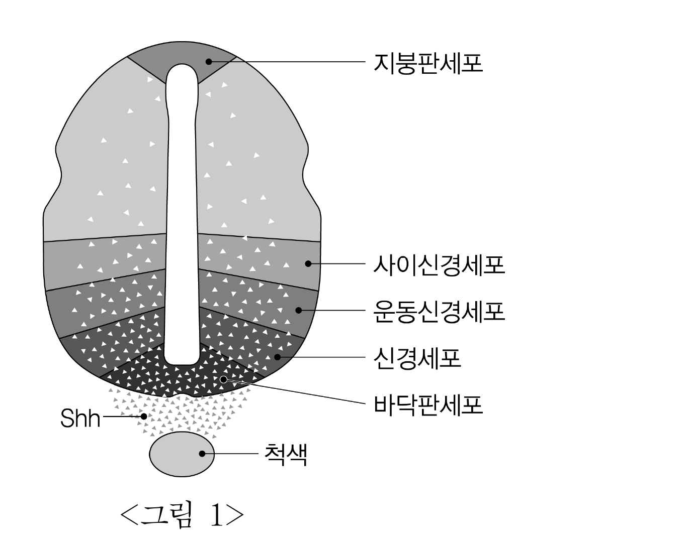
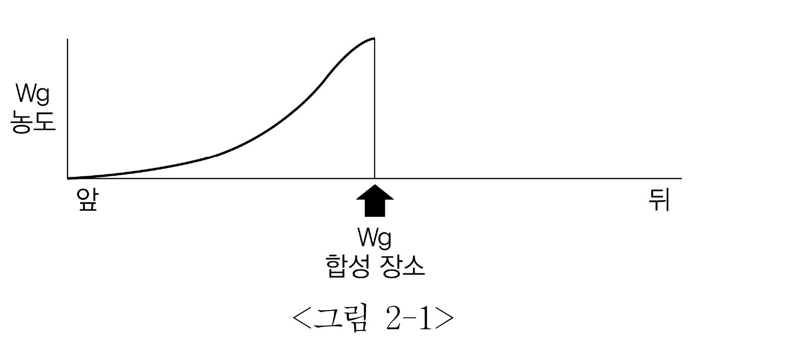
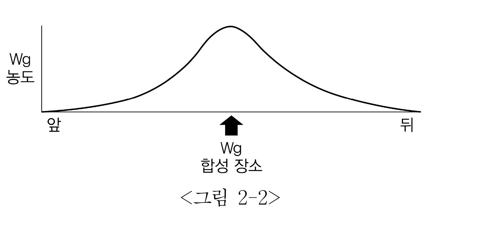
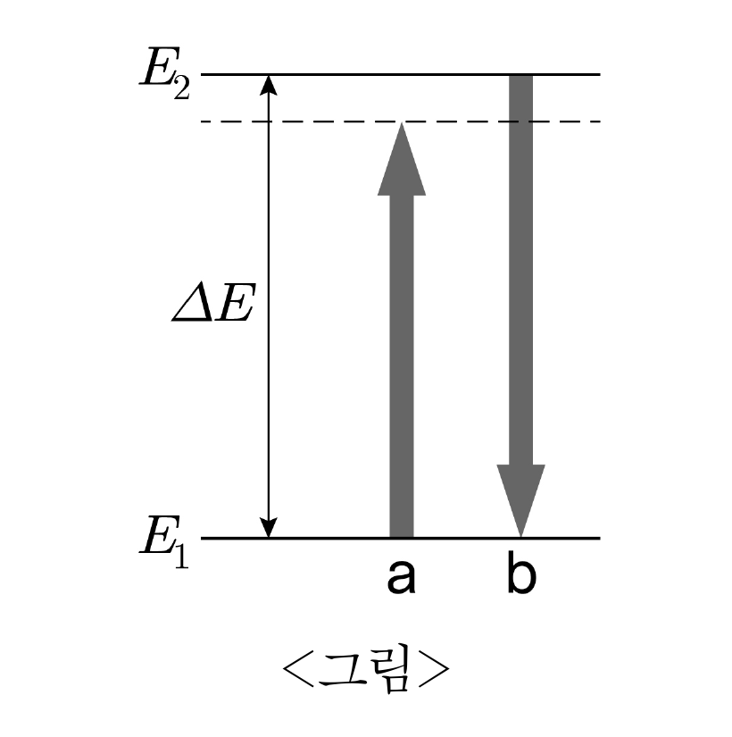
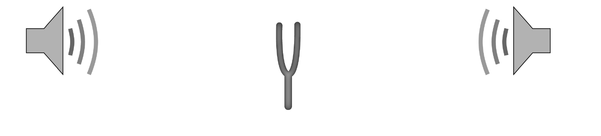

# [01-03] LU (2016)

다음 글을 읽고 물음에 답하시오.

## 제시문

범죄 사건을 다루는 언론 보도의 대부분은 수사기관으로부터 얻은 정보에 근거하고 있고, 공소제기 전인 수사 단계에 집중되어 있다. 따라서 언론의 범죄 관련 보도는 범죄사실이 인정되는지 여부를 백지상태에서 판단하여야 할 법관이나 배심원들에게 유죄의 예단을 심어줄 우려가 있다. 이는 헌법상 적법절차 보장에 근거하여 공정한 형사재판을 받을 피고인의 권리를 침해할 위험이 있어 이를 제한할 필요성이 제기된다. 실제로 피의자의 자백이나 전과, 거짓말탐지기 검사 결과 등에 관한 언론 보도는 유죄판단에 큰 영향을 미친다는 실증적 연구도 있다. 하지만 보도 제한은 헌법에 보장된 표현의 자유에 대한 침해가 된다는 반론도 만만치 않다.

미국 연방대법원은 <u>㉠ 어빈 사건 판결에서</u> 지나치게 편향적이고 피의자를 유죄로 취급하는 언론 보도가 예단을 형성시켜 실제로 재판에 영향을 주었다는 사실이 입증되면, 법관이나 배심원이 피고인을 유죄라고 확신하더라도 그 유죄판결을 파기하여야 한다고 했다. 이 판결은 이른바 ‘현실적 예단’의 법리를 형성시켰다. 이후 <u>㉡ 리도 사건 판결에</u> 와서는, 일반적으로 보도의 내용이나 행태 등에서 예단을 유발할 수 있다고 인정이 되면, 개개의 배심원이 실제로 예단을 가졌는지의 입증 여부를 따지지 않고, 적법절차의 위반을 들어 유죄판결을 파기할 수 있다는 ‘일반적 예단’의 법리로 나아갔다. <u>㉢ 셰퍼드 사건 판결에서는</u> 유죄판결을 파기하면서, ‘침해 예방’이라는 관점을 제시하였다. 즉, 배심원 선정 절차에서 상세한 질문을 통하여 예단을 가진 후보자를 배제하고, 배심원이나 증인을 격리하며, 재판을 연기하거나, 관할을 변경하는 등의 수단을 언급하였다. 그런데 법원이 보도기관에 내린 ‘공판 전 보도금지명령’에 대하여 기자협회가 연방대법원에 상고한 <u>㉣ 네브래스카 기자협회 사건 판결에서는</u> 침해의 위험이 명백하지 않은데도 가장 강력한 사전 예방 수단을 쓰는 것은 위헌이라고 판단하였다.

이러한 판결들을 거치면서 미국에서는 언론의 자유와 공정한 형사절차를 조화시키면서 범죄 보도를 제한할 수 있는 방법을 모색하였다. 그리하여 셰퍼드 사건에서 제시된 수단과 함께 형사재판의 비공개, 형사소송 관계인의 언론에 대한 정보제공금지 등이 시행되었다. 하지만 <u>ⓐ 예단 방지 수단들의 실효성을 의심하는 견해</u>가 있고, 여전히 표현의 자유와 알 권리에 대한 제한의 우려도 있어, 이 수단들은 매우 제한적으로 시행되고 있다.

그런데 언론 보도의 자유와 공정한 재판이 꼭 상충된다고만 볼 것은 아니며, 피고인 측의 표현의 자유를 존중하는 것이 공정한 재판에 도움이 된다는 입장에서 네브래스카 기자협회 사건 판결의 의미를 새기는 견해도 있다. 이 견해는 수사기관으로부터 얻은 정보에 근거한 범죄 보도로 인하여 피고인을 유죄로 추정하는 구조에 대항하기 위하여 변호인이 적극적으로 피고인 측의 주장을 보도기관에 전하여, 보도가 일방적으로 편향되는 것을 방지할 필요가 있다고 한다. 일반적으로 변호인이 피고인을 위하여 사건에 대해 발언하는 것은 범죄 보도의 경우보다 적법절차를 침해할 위험성이 크지 않은데도 제한을 받는 것은 적절하지 않다고 보며, 반면에 수사기관으로부터 얻은 정보를 기반으로 하는 언론 보도는 예단 형성의 위험성이 큰데도 헌법상 보호를 두텁게 받는다고 비판한다.

미국과 우리나라의 헌법상 변호인의 조력을 받을 권리는 변호인의 실질적 조력을 받을 권리를 의미한다. 실질적 조력에는 법정 밖의 적극적 변호 활동도 포함된다. 따라서 형사절차에서 피고인 측에게 유리한 정보를 언론에 제공할 기회나 반론권을 제약하지 말고, 언론이 검사 측 못지않게 피고인 측에게도 대등한 보도를 할 수 있도록 해야 한다. 이를 위해 우리나라도 미국과 같이 ‘법원-수사기관-변호사회-보도기관’의 자율 협정을 체결할 필요가 있다.

## 01

윗글을 이해한 것으로 적절하지 <u>않은</u> 것은?

### 선택지

(1) 범죄 관련 언론 보도를 접한 사람들은 피의자를 범죄자라고 생각하기 쉽다.
(2) 언론에 제공된 변호인의 발언은 공정한 형사재판을 침해할 우려가 상대적으로 적다.
(3) 공판 전 보도금지명령은 공정한 형사재판을 위한 최소한의 사전 예단 방지 수단이다.
(4) 언론의 범죄에 관한 보도가 재판에 영향을 미칠 가능성은 법관 재판의 경우에도 존재한다.
(5) 소송 당사자 양측에게 보도 기관에 대한 정보 제공 기회를 대등하게 주어 피고인이 공정한 형사재판을 받을 권리를 보장하여야 한다.

## 02

㉠～㉣에 대한 진술로 적절하지 <u>않은</u> 것은?

### 선택지

(1) ㉠과 ㉡ 모두 공정한 형사재판을 통해서 진실이 발견되어야 한다고 보았다.
(2) ㉡은 예단에 대한 피고인의 입증 책임을 완화하였다.
(3) ㉢은 적법절차를 보장하기 위하여 형사절차 내에서 예단의 사전 방지 수단을 제시하였다.
(4) ㉡에서 ㉢으로 이행은 공정한 형사재판의 측면에서 보면 후퇴한 것이다.
(5) ㉣은 표현의 자유에 대한 과도한 제한을 경계한 것이다.

## 03

ⓐ를 뒷받침하는 경우로 보기 어려운 것은?

### 선택지

(1) 법원이 배심원을 격리하였으나 격리 전에 보도가 있었던 경우
(2) 법원이 관할 변경 조치를 취하였으나 이미 전국적으로 보도가 된 경우
(3) 법원이 재판을 장기간 연기하였으나 재판 재개에 임박하여 다시 언론 보도가 이어진 경우
(4) 검사가 피의자의 진술거부권 행사 사실을 공개하려고 하였으나 법원이 검사에게 그 사실에 대한 공개 금지명령을 내린 경우
(5) 변호사가 배심원 후보자에게 해당 사건에 대한 보도를 접했는지에 대해 질문했으나 후보자가 정직하게 답변하지 않은 경우

# [04-06] LU (2016)

다음 글을 읽고 물음에 답하시오.

## 제시문

민족의 성쇠는 매양 그 사상이 지향하는 바에 달린 것이며 사상이 지향하는 바의 혹 좌, 혹 우는 매양 모종 사건의 영향을 입는 것이다. 그러면 조선 근세에 종교나 학술이나 정치나 풍속이 사대주의의 노예가 됨이 무슨 사건에 원인함인가? 나는 일언으로 대답하여 가로되 고려 인종 13년 서경(西京)의 전역(戰役), 즉 묘청이 김부식에게 패함이 그 원인이라 한다.

서경 전역을 역대의 사가(史家)들이 다만 국왕의 군대가 반적(反賊)을 친 전역으로 알았을 뿐이었으나 이는 근시안의 관찰이다. 그 실상은 이 전역이 즉 낭가(郎家)․불가(佛家) 대 유가(儒家)의 싸움이며, 국풍파(國風派) 대 한학파(漢學派)의 싸움이며, 독립당 대 사대당의 싸움이며, 진취사상 대 보수사상의 싸움이니, 묘청은 곧 전자의 대표요 김부식은 곧 후자의 대표였던 것이다. 이 전역에 묘청 등이 패하고 김부식이 이겼으므로 조선사가 사대적, 보수적, 속박적 사상 즉 유교사상에 정복되고 말았거니와, 만일 이와 반대로 김부식이 패하고 묘청 등이 이겼더라면 조선사가 독립적, 진취적 방면으로 진전하였을 것이니, <u>㉠ 이 전역을 어찌 ‘조선역사상 일천년래 제일대사건’이라 하지 않으랴?</u>

인종이 즉위하매 낭가와 불가와 기타 무장과 시인(詩人)의 무리가 분기하여 황제를 칭하고 북쪽으로 금나라를 정벌하기를 강경히 주장함에 이르렀다. 칭제북벌론의 영수는 첫째 윤언이니, 윤언이는 곧 윤관의 아들로 유일한 낭가의 계통이라 본 논(論)의 영수됨이 필연코 당연한 일이며, 둘째 묘청이니, 묘청은 서경 승도(僧徒)로 도참(圖讖)의 설을 유포하여 서경에 천도하고 제호(帝號)를 칭한 후 북으로 금을 치자는 자이며, 셋째 정지상이니, 정지상은 당시에 이름을 떨치던 시인이요 강토의 확대를 몽상하던 인물이다. 이 삼인이 칭제북벌에 대한 의견은 동일하나, 다만 묘청과 정지상은 서경 천도까지를 주장하였고, 윤언이는 거기 부동의하던 바이다.

『고려사』에 묘청을 요적(妖賊)이라 하였다. 이는 묘청이 음양가의 풍수설로 평양 천도를 앞장서 주장하였기 때문이라 한다. 대개 신라 말엽부터 평양 임원역은 대화(大華)의 세라 여기에 천도하면 36국이 와서 조공을 바치리라는 비결이 유행하였다. 평양을 도읍으로 삼음은 역대 왕조에서 기도하던 바이나 기실은 평양에 천도하면 북쪽 오랑캐에 가까워지니 만일 적기(敵騎)가 압록강을 건너는 때에는 도성이 먼저 병화의 요충(要衝)이 되므로 실로 당시 도성될 지점에 결코 마땅치 않거늘, 칭제북벌론자가 매양 평양 천도를 전제로 함은 비상한 실책이니 윤언이가 전자를 주장하고 후자에 부동의함은 과연 탁견이라 이를 것이다. 그러나 비결과 풍수설로 평양 천도를 주장함은 묘청으로 시작된 것이 아니니 이로써 묘청을 요적이라 함은 너무 억울한 판결이다.

당시 칭제북벌론에 경향(傾向)한 자가 거의 전국인의 반이 지나며 군주 인종도 10의 9분은 묘청을 믿었다. 이같이 성숙한 시기를 선용치 못하고 서경에서 거병하여 국호를 대위라 하고 연호를 천개라 하고 인종에게 서경으로 천도하여 그 국호와 연호를 받기를 요구하니, 그 시대 신하의 예로 그 얼마나 발호(跋扈)한 행동인가? 이같이 발호한 행동을 할 것 같으면 반드시 그 내부가 공고하고 실력이 웅후한 뒤에 발표할 것이 아닌가? 인종이 비록 나약하나 어찌 대위국 황제의 허명을 탐하여 서경으로 즐겨 이어(移御)하였을 것인가? 윤언이가 비록 묘청의 칭제북벌론에 동의하던 일인이나, 어찌 이같이 광망한 거동에야 일치할 수 있을 것인가?

윤언이는 고사하고 묘청의 친당들도 거병의 소식이 처음 송도에 이르렀을 때에는 그런 일이 절대 없을 것이라고 믿었다. 그러나 사실이 차차 분명하여 오매 칭제북벌론자는 모두 와해되고, 반대자 등이 작약하여 김부식이 원수로 묘청 토벌의 길에 오르며 정지상 등은 출병 전에 김부식에게 피살되고, 윤언이는 김부식의 막하가 되어 묘청 토벌자의 일인이 되게 되었다.

묘청이 불교도로서 낭가의 이상을 실현하려다가 패망하고 드디어 사대주의파의 천하가 되어 낭가의 윤언이 등은 겨우 유가의 압박 하에서 그 잔명을 구차히 보존하게 되고, 그 뒤에 몽고의 난을 지나매 더욱 유가의 사대주의가 득세하게 되고, 조선은 창업이 곧 이 주의로 성취되매 낭가는 아주 멸망하여 버렸다. 정치가 이렇게 되매, 종교나 학술이나 기타가 모두 사대주의의 노예가 되어 비록 갑오․을미개혁의 시기를 만날지라도 진흥대왕과 같은 경세가가 일어나지 않고 외세를 따라 바뀌는 사회가 될 뿐이니, 아아 서경 전역의 지은 원인을 어찌 중대하다 아니하랴.

- 신채호, ｢조선역사상 일천년래 제일대사건｣에서

## 04

윗글의 내용과 일치하지 <u>않는</u> 것은?

### 선택지

(1) 묘청이 거병하자 송도의 칭제북벌론자들도 호응해 봉기하였다.
(2) 갑오․을미개혁은 자주적인 근대화 개혁으로 나아가지 못하였다.
(3) 조선 왕조는 건국부터 유교사상에 의한 사대주의로 일관하였다.
(4) 묘청 이전에도 평양에 천도하면 국운이 흥성한다는 비결이 퍼져 있었다.
(5) 묘청의 거병 당시 칭제북벌에 찬성하는 사람이 반대하는 사람보다 많았다.

## 05

각 인물들에 대한 글쓴이의 평가로 적절하지 <u>않은</u> 것은?

### 선택지

(1) 묘청이 서경에서 군사를 일으킨 것은 성급한 행동이었다.
(2) 윤언이가 서경 천도에 동의하지 않은 것은 탁월한 판단이었다.
(3) 정지상이 칭제북벌을 꿈꾼 것은 당대 상황을 오판한 결과였다.
(4) 묘청이 국호와 연호를 세운 것은 신하로서 잘못된 행동이었다.
(5) 풍수설로 서경 천도를 주장했다고 해서 묘청을 요적이라고 하는 것은 지나친 비판이다.

## 06

㉠과 같이 주장한 핵심적인 이유는?

### 선택지

(1) 낭가와 불가가 힘을 합쳐 보수적인 유교사상에 대한 저항을 표출했기 때문이다.
(2) 북진 정책이 좌절되어 고구려의 옛 영토를 회복하지 못하게 되었기 때문이다.
(3) 서경 천도의 실패로 음양가의 풍수설이 쇠퇴하는 계기가 되었기 때문이다.
(4) 낭가의 독립적이고 진취적인 사상이 소멸하는 계기가 되었기 때문이다.
(5) 우리 역사상 처음으로 칭제하고 연호를 세운 사건이기 때문이다.

# [07-10] LU (2016)

다음 글을 읽고 물음에 답하시오.

## 제시문

김춘수와 김수영은 대척되는 위치에서 한국 시의 현대성을 심화시킨 시인들이다. 김춘수는 순수시론의 일종인 <u>㉠ 무의미시론</u>으로 새로운 해체시를 열어젖혔고, 김수영은 ‘온몸의 시학’으로 알려진 <u>㉡ 참여시론으로</u> 현실참여시의 태두가 되었다. 비슷한 시기에 태어나 활동했던 두 시인은 개인의 자유와 실존이 위협을 받던 1960년대의 시대 현실을 비판적으로 인식하고 각자의 실존 의식과 윤리관을 예각화하면서 시적 언어와 창작 방법에 대한 성찰을 제시하였다. 하지만 두 모더니스트가 선택한 미학적 실험은 그 방향이 사뭇 달랐다.

김춘수는 ｢꽃｣과 같은 자신의 1950년대 시가 ‘관념에의 기갈’에 사로잡혀 있었다고 진단한다. 그 결과 시적 언어는 제 구실의 가장 좁은 한계, 즉 관념과 의미 전달의 수단에 한정되었고 시는 대상의 재현과 모방에 머물렀다는 것이다. 추상적인 관념을 전달하는 이미지․비유․상징과 같은 수사에 대한 집착은 이런 맥락과 관련이 깊다. 하지만 김춘수는 말의 피안에 있는 관념이나 개인의 실존을 짓누르는 이데올로기로 인해 공포를 느꼈다. 이 공포에서 벗어나 자아를 보존하려는 충동이 그를 ‘생의 구원’으로서의 시 쓰기로 이끈 것이다. 그 방법으로 김춘수는 언어와 이미지의 유희, 즉 기의(記意) 없는 기표(記標)의 실험을 시도하였다. 기의에서 해방된 기표의 유희는 시와 체험, 시와 현실의 연속성을 끊는 것은 물론 역사 현실과 화해할 수 없는 자율적인 시를 만드는 원천이라고 믿었기 때문이다. 이 믿음은 비유와 상징은 물론 특정한 대상을 떠올리게 하는 이미지까지 시에서 배제하는 기법 및 형식 실험으로 이어졌다.

구체적으로 그는 이미지를 끊임없이 새로운 이미지로 대체하여 의미를 덧씌울 중심 대상을 붕괴시키고, 마침내 대상이 없는 이미지 그 자체가 대상이 되게 함으로써 무의미 상태에 도달하고자 했다. 물론 대상의 구속에서 벗어나 자유를 얻는 과정에는 창작자의 의식과 의도가 개입해야 한다. 이 점에서 무의미시는 인간의 무의식을 강조한 초현실주의와 차이가 있지만 자유연상 혹은 자동기술과 예술적 효과가 흡사한 결과를 얻을 수 있었다. 한편 김춘수는 언어 기호를 음소 단위로까지 분해하거나 시적 언어를 주문이나 염불 소리 같은 리듬 혹은 소리 이미지에 근접시키기도 하였다. 김춘수의 ｢처용단장｣ 제2부는 이런 시적 실험들의 진면목을 드러낸 작품이다.

김춘수에게 시 쓰기란 현실로 인해 빚어진 내면의 고뇌와 개인적 실존의 위기를 벗어던지고 자신의 생을 구원하는 현실 도피의 길이었다. 이와 달리 김수영에게 시 쓰기란 자유를 억압하는 군사 정권과 대결하고 정치적 자유의 이행을 촉구하며 공동체의 운명을 노래하는 것이었다. 4․19 직후의 풍자시는 참여시 실험을 알리는 신호탄이었던 셈이다. 참여시론의 핵심은 진정한 자유의 이행을 위해 <u>ⓐ ‘온몸으로 온몸을 밀고나가는 것’이란</u> 모순어법으로 집약된다. 이는 내용과 형식은 별개가 아니며 시인의 사상과 감성을 생활(현실) 속에서 언어로 표현할 때 그것이 바로 시의 형식이 된다는 의미이다. 그런 까닭에 시의 현대성은 실험적 기법의 우열보다는 현실에 대해 고민하는 시인의 양심에서 찾아야 한다.

물론 김수영도 김춘수가 추구한 무의미시의 의의를 일부 인정했다. 그 역시 ‘무의미’란 의미 너머를 지향하는 욕망, 즉 우리 눈에 보이는 것 이상을 보려는 것이고 시와 세계의 화해 불가능성을 드러내려는 것이라고 생각했다. 하지만 그는 김춘수가 시의 무의미성에 도달하기 위해 선택한 방법을 너무 협소한 것이라고 여겼다. 이런 점에서 “‘의미’를 포기하는 것이 무의미의 추구도 되겠지만, ‘의미’를 껴안고 들어가서 그 ‘의미’를 구제함으로써 무의미에 도달하는 길”도 있다는 김수영의 말은 주목된다. 그는 김춘수처럼 시어의 무의미성에 대한 추구로 시의 무의미성에 도달하는 것도 현대시가 선택할 수 있는 유효한 실험이라고 보았다. 하지만 그는 시어의 의미성을 적극적으로 수용함으로써 마침내 시의 무의미성에 도달하는 것이 더 바람직한 시인의 태도라고 생각했던 것이다. 김수영은 김춘수의 궁극적인 꿈이기도 했던 시와 예술의 본질 혹은 존재 방식으로서의 무의미성까지 도달하기 위해 오히려 시어의 범위를 적극적으로 확대하고 시와 현실의 접촉을 늘려 세계 변혁을 꾀하는 현실 참여의 길로 나아갔던 것이다. 실제로 그의 참여시는 시와 산문의 언어적 경계를 허물어 산문적 의미까지 시에 담아내려 했다. 이를 통해 그는 일상어․시사어․관념어, 심지어 비속어와 욕설까지 폭넓게 시어로 활용하여 세계의 의미를 개진하고 당대 현실을 비판할 수 있었다.

사실 김춘수의 시적 인식은 김수영의 그것에 대한 대타 의식의 소산이다. 김춘수는 김수영을 시와 생활을 구별하지 못한 ‘로맨티스트’였지만 자신의 죽음까지도 시 쓰기의 연장선상에 있었던 훌륭한 시인이라고 평가했다. 김춘수는 세계에 대한 허무감에서 끝내 벗어날 수 없었던 자신과 달리 김수영이 현대 사회의 비극적 운명에 ‘온몸’으로 맞서는 시인의 윤리를 실천한 점에 압박감을 느끼고 있었지만, 김수영의 시와 시론에서 시와 예술에 대한 <kbd>공유된 인식</kbd>을 발견했던 것이다.

## 07

㉠과 ㉡에 대한 설명으로 적절하지 <u>않은</u> 것은?

### 선택지

(1) ㉠은 언어유희를 활용하여 세계에 대한 허무 의식을 극복했다.
(2) ㉠은 시에서 중요한 것은 내용이나 의미가 아니라 형식이나 기법이라고 여겼다.
(3) ㉡은 해체시 실험에 치중하면 현실 극복이 불가능하다고 인식했다.
(4) ㉡은 시어의 범위와 시의 내용을 확장하여 시의 현실성을 강화했다.
(5) ㉠과 ㉡은 모더니스트였던 시인의 예술관과 현실 대응 방식을 보여 준다.

## 08

윗글의 김수영에 대한 서술을 근거로 ⓐ를 설명할 때, 적절하지 <u>않은</u> 것은?

### 선택지

(1) ⓐ는 동일한 존재가 행위의 수단이자 행위의 대상이 됨을 의미한다.
(2) ⓐ는 현실 도피 대신에 현실 참여를 시인의 윤리로 받아들이는 태도를 보인다.
(3) ⓐ는 정치 현실로 인해 억압된 자유를 되찾으려 했던 시인의 고뇌를 담고 있다.
(4) ⓐ의 행위 자체가 형식인 시에서 내용은 시인이 느끼는 사상과 감성에 관련된다.
(5) ⓐ는 실험적 기법이 시의 현대성을 성취하는 근본 요건이라는 인식을 담고 있다.

## 09

김춘수와 김수영의 <kbd>공유된 인식</kbd>에 해당하지 <u>않는</u> 것은?

### 선택지

(1) 공동체적인 삶의 지향을 통한 자아의 보존
(2) 개인의 실존을 억압하는 현실의 부조리성
(3) 의미가 제거된 시어의 활용 가능성
(4) 시의 존재 방식으로서의 무의미성
(5) 시와 세계의 화해 불가능성

## 10

윗글에 비추어 <보기>의 시 쓰기 방법을 평가할 때, 가장 적절한 것은?

### 보기

불러다오, 멕시코는 어디 있는가
사바다는 사바다, 멕시코는 어디 있는가,
사바다의 누이는 어디 있는가,
말더듬이 일자무식 사바다는 사바다,
멕시코는 어디 있는가,
사바다의 누이는 어디 있는가,
불러다오
멕시코 옥수수는 어디 있는가

- 김춘수, ｢처용단장｣ 제2부에서

### 선택지

(1) 김춘수는 <보기>에 외래어와 관념어를 사용하면 시적 언어를 확장하고 시와 산문의 경계를 허물 수 있다고 보았을 것이다.
(2) 김춘수는 <보기>의 염불 소리 같은 강렬한 청각 영상과 리듬감은 현실이 초래했던 고뇌와 공포를 상징한다고 여겼을 것이다.
(3) 김수영은 <보기>가 ‘사바다’를 비하하여 ‘말더듬이 일자무식’에 비유함으로써 당대 현실을 풍자한다고 평가했을 것이다.
(4) 김수영은 <보기>의 무의미성이 시어의 의미를 포기한 결과이므로 진정한 자유의 이행이 어려울 것으로 평가했을 것이다.
(5) 김춘수와 김수영은 모두 <보기>가 의미를 덧씌울 대상을 붕괴시킴으로써 새로운 내용적 요소를 담을 여지가 생겼다고 평가했을 것이다.

# [11-13] LU (2016)

다음 글을 읽고 물음에 답하시오.

## 제시문

윤리학에서는 선(善, good) 즉 좋음과 관련하여 여러 쟁점이 있다. 선이란 무엇인가? 선을 쾌락이라고 간주해도 되는가? 선은 도덕적으로 옳음 또는 정의와 어떤 관계에 있는가? 이러한 쟁점 중의 하나가 바로 “선은 객관적으로 존재하는가?”의 문제이다.

플라톤은 우리가 감각으로 지각하는 현실 세계는 가변적이고 불완전하지만, 우리가 이성으로 인식할 수 있는 이데아의 세계는 불변하고 완전하다고 보았다. 그에 따르면, 현실 세계는 이데아 세계를 모방한 것이기에 현실 세계에서 이루어지는 인간들의 행위도 불완전할 수밖에 없다. 이데아 세계에는 선과 미와 같은 여러 이데아가 존재한다. 그중에서 최고의 이데아는 선의 이데아이며, 인간 이성의 최고 목표는 선의 이데아를 인식하는 것이다. 선은 말로 표현할 수 없고, 신성하며, 독립적이고, 오랜 교육을 받은 후에만 알 수 있는 것이다. 우리는 선을 그것이 선이기 때문에 욕구한다. 이렇게 인간의 관심 여부와는 상관없이 선이 독립적으로 존재한다고 보는 입장을 선에 대한 <u>㉠ ‘고전적 객관주의’라고</u> 한다.

이러한 플라톤적 전통을 계승한 무어도 선과 같은 가치가 객관적으로 실재한다고 주장한다. 그에 따르면 선이란 노란색처럼 단순하고 분석 불가능한 것이기에, 선이 무엇인지에 대해 정의를 내릴 수 없으며 그것은 오직 직관을 통해서만 인식될 수 있다. 노란색이 무엇이냐는 질문에 노란색이라고 답할 수밖에 없듯이 선이 무엇이냐는 질문에 “선은 선이다.”라고 답할 수밖에 없다는 것이다. 무어는 선한 세계와 악한 세계가 있을 때 각각의 세계 안에 욕구를 지닌 존재가 있는지 없는지와 관계없이 전자가 후자보다 더 가치 있다고 믿었다. 선은 인간의 욕구와는 상관없이 그 자체로 존재하며 그것은 본래부터 가치가 있다는 것이다. 그는 선을 최대로 산출하는 행동이 도덕적으로 옳은 행동이라고 보았다.

반면에 <u>㉡ ‘주관주의’는</u> 선을 의식적 욕구의 산물에 불과한 것으로 간주한다. 페리는 선이란 욕구와 관심에 의해 창조된다고 주장한다. 그에 따르면 가치는 관심에 의존하고 있으며, 어떤 것에 관심이 주어졌을 때 그것은 비로소 가치를 얻게 된다. 대상에 가치를 부여하는 것은 관심이며, 인간이 관심을 가지는 대상은 무엇이든지 가치의 대상이 된다. 누가 어떤 것을 욕구하든지 간에 그것은 선으로서 가치를 지니게 된다. 페리는 어떤 대상에 대한 관심이 깊으면 깊을수록 그것은 그만큼 더 가치가 있게 되며, 그 대상에 관심을 표명하는 사람의 수가 많을수록 그것의 가치는 더 커진다고 말한다. 이러한 주장에 대해 고전적 객관주의자는 우리가 욕구하는 것과 선을 구분해야 한다고 비판한다. 만약 쾌락을 느끼는 신경 세포를 자극하여 매우 강력한 쾌락을 제공하는 쾌락 기계가 있다고 해 보자. 그런데 누군가가 쾌락 기계 속으로 들어가서 평생 살기를 욕구한다면, 우리는 그것이 선이 아니라고 말할 수 있다. 쾌락 기계에 들어가는 사람이 어떤 불만도 경험하지 못한다고 하더라도, 그것은 누가 보든지 간에 나쁘다는 것이다.

이러한 논쟁과 관련하여 두 입장을 절충한 입장도 존재한다. <u>㉢ ‘온건한 객관주의’는</u> 선을 창발적인 속성으로서, 인간의 욕구와 사물의 객관적 속성이 결합하여 생기는 것이라고 본다. 이 입장에 따르면 물의 축축함이 $H_2O$ 분자들 안에 있는 것이 아니라 그 분자들과 우리의 신경 체계 간의 상호 작용을 통해 형성되듯이, 선도 인간의 욕구와 객관적인 속성 간의 관계 속에서 상호 통합적으로 형성된다. 따라서 이 입장은 욕구를 가진 존재가 없다면 선은 존재하지 않을 것이라고 본다. 그러나 일단 그러한 존재가 있다면, 쾌락, 우정, 건강 등이 가진 속성은 그의 욕구와 결합하여 선이 될 수 있을 것이다. 하지만 이러한 입장에서는 우리의 모든 욕구가 객관적 속성과 결합하여 선이 되는 것은 아니기에 적절한 욕구가 중시된다. 결국 여기서는 적절한 욕구가 어떤 것인지를 구분할 기준을 제시해야 하는 문제가 발생한다.

이와 같은 객관주의와 주관주의의 논쟁을 해결하기 위한 한 가지 방법은 불편부당하며 모든 행위의 결과들을 알 수 있는 <u>ⓐ ‘이상적 욕구자’를</u> 상정하는 것이다. 그는 편견이나 무지로 인한 잘못된 욕구를 갖고 있지 않기에 그가 선택하는 것은 선이 될 것이고, 그가 선택하지 않는 것은 악이 될 것이기 때문이다.

## 11

윗글의 내용과 일치하지 <u>않는</u> 것은?

### 선택지

(1) 플라톤은 선의 이데아를 이성을 통해 인식할 수 있다고 본다.
(2) 플라톤은 인간이 행한 선이 완전히 선한 것은 아니라고 본다.
(3) 무어는 선이 단순한 것이어서 그것을 정의할 수 없다고 본다.
(4) 무어는 도덕적으로 옳은 행동을 판별할 기준을 제시할 수 없다고 본다.
(5) 페리는 더 많은 사람이 더 깊은 관심을 가질수록 가치가 증대한다고 본다.

## 12

㉠에 대한 ㉡과 ㉢의 공통된 문제 제기로 적절한 것은?

### 선택지

(1) 사람들이 선호한다고 그것이 항상 선이라고 할 수 있는가?
(2) 선은 욕구하는 주관에 전적으로 의존하여 형성되지 않는가?
(3) 선과 악을 구분할 수 없다면 어떤 행위라도 옳다는 것인가?
(4) 사람들이 선을 인식할 수 없다고 보는 것은 과연 타당한가?
(5) 선을 향유하는 존재가 없다면 그것이 무슨 가치가 있겠는가?

## 13

ⓐ를 상정한 이유로 가장 적절한 것은?

### 선택지

(1) 선을 직관할 수 없다고 보는 ‘고전적 객관주의’의 문제점을 해결하기 위해서이다.
(2) 욕구의 주체가 없어도 선이 존재한다는 ‘고전적 객관주의’의 주장을 강화하기 위해서이다.
(3) 욕구하는 사람이 존재해야만 선이 형성된다는 ‘주관주의’의 주장을 약화하기 위해서이다.
(4) 무엇을 욕구하더라도 모두 선이라고 간주해야 하는 ‘주관주의’의 문제점을 해결하기 위해서이다.
(5) 선의 형성에서 인간과 사물의 상호 통합 작용이 필수적이라는 ‘주관주의’의 입장을 보완하기 위해서이다.

# [14-16] LU (2016)

다음 글을 읽고 물음에 답하시오.

## 제시문

생명체가 다양한 구조와 기능을 갖는 기관을 형성하기 위해서는 수많은 세포들 간의 상호 작용을 통해 세포의 운명을 결정하는 과정이 필요하다. 사람의 경우 눈은 항상 코 위에, 입은 코 아래쪽에 위치한다. 이렇게 되기 위해서는 특정 세포군이 위치 정보를 획득하고 해석한 후 각 세포가 갖고 있는 유전 정보를 이용하여 자신의 운명을 결정함으로써 각 기관을 정확한 위치에 형성되게 하는 과정이 필수적이다. 세포 운명을 결정하는 다양한 방법이 존재하지만, 가장 간단한 방법은 어떤 특정 형태로 분화하게 하는 형태발생물질(morphogen)의 농도 구배(concentration gradient)를 이용하는 것이다. 형태발생물질은 세포나 특정 조직으로부터 분비되는 단백질로서 대부분의 경우에 그 단백질의 농도 구배에 따라 주변의 세포 운명이 결정된다. 예를 들어 뇌의 발생 초기 형태인 신경관의 위쪽에서 아래쪽으로 지붕판세포, 사이신경세포, 운동신경세포, 신경세포, 바닥판세포가 순서대로 발생하게 되는데, 이러한 서로 다른 세포로의 예정된 분화는 신경관 아래쪽에 있는 척색에서 분비되는 형태발생물질인 Shh의 농도 구배에 의해 결정된다(<그림 1>).

<이미지 포함됨>

척색에서 Shh가 분비되기 때문에 척색으로부터 멀어질수록 Shh의 농도가 점차 낮아지게 되어서, 그 농도의 높고 낮음에 따라 척색 근처의 신경관에 있는 세포는 바닥판세포로, 그 다음 세포는 신경세포 및 운동신경세포로 세포 운명이 결정된다.

한 개체의 세포가 모두 동일한 유전자를 갖고 있음에도 불구하고 서로 다른 세포 운명을 택하게 되는 것은 농도 구배에 대응하여 활성화되는 전사인자의 종류가 다른 것으로 설명할 수 있다. 전사인자는 유전정보를 갖고 있는 DNA의 특이적인 염기 서열을 인식하여 특정 부분의 DNA로부터 mRNA를 만드는 작용을 하고, 이 mRNA의 정보를 바탕으로 단백질이 만들어진다. 예를 들어 Shh의 농도가 특정 역치 이상이 되면 A 전사인자가 활성화되고 역치 이하인 경우는 B 전사인자가 활성화되면, A 전사인자에 의해 바닥판세포의 형성에 필요한 mRNA와 단백질이 합성되고, B 전사인자에 의해 운동신경세포로 분화하는 데 필요한 mRNA와 단백질이 만들어지게 되어 서로 다른 세포 운명이 결정될 수 있는 것이다.

하지만 최근의 연구 결과에 의하면 일부의 형태발생물질이 단순한 확산에 의하여 농도 구배를 형성하지 않고 특정 형태의 매개체를 통하여 이동한다는 사실이 보고되었다. 가령 초파리 배아의 특정 발생 단계에서 합성되는 Wg라는 형태발생물질은 합성되는 장소를 기점으로 앞쪽으로만 비대칭적으로 전달된다(<그림 2-1>). 만약 단순한 확산에 의해 농도 구배가 형성된다면 Wg 형태발생물질이 합성되는 곳의 앞쪽 및 뒤쪽으로 농도 구배가 형성될 것을 예상할 수 있지만(<그림 2-2>), 실제로 <그림 2-1>에서 보이는 바와 같이 Wg가 뒤쪽으로는 이동하지 않고 앞쪽으로만 분포하는 현상이 관찰되었다.

<이미지 포함됨>

<이미지 포함됨>

여러 가지 실험 결과를 바탕으로 초파리 배아에서 이러한 비대칭적인 전달을 설명하는 모델로서 아래와 같은 가설이 제시되었다.

(1) 수용체에 의한 전달 : 형태발생물질을 분비하는 세포 옆에 있는 세포의 표면에 있는 수용체가 형태발생물질을 인식하고 그 다음 세포의 수용체에 형태발생물질을 넘겨준다고 보는 가설이다. 이때 수용체의 양이 이미 비대칭적으로 분포하고 있다면 수용체에 부착된 형태발생물질의 농도 구배가 이루어질 수 있다.

(2) 세포막에 둘러싸인 소낭의 흡수에 의한 전달 : 형태발생물질을 분비하는 세포에서 형태발생물질이 소낭, 즉 작은 주머니에 싸여 앞쪽의 세포로만 단계적으로 전달된다고 보는 가설이다. 이 과정에서 형태발생물질의 일부만이 다음 세포로 전달되면 비대칭적 농도 구배가 이루어질 수 있다.

우리 몸을 구성하는 각 기관의 세포 조성이 다르고 서로 다른 발생 단계에서 각 세포가 처해 있는 환경이 다르므로 위에서 제시한 형태발생물질 농도 구배의 형성을 한 가지 모델로만 설명하는 것은 불가능하다. 특정 발생 단계에서는 단순한 확산에 의해서 농도 구배를 형성하고, 다른 환경이나 발생 단계에서는 위에서 기술한 비대칭적 이동에 의해 형태발생물질의 농도 구배가 형성된다고 설명하는 것이 타당하다. 하지만 어떤 방법에 의해서든지 형태발생물질의 농도 구배의 형성은 각각의 농도에 따른 서로 다른 유전자의 발현을 촉진함으로써 다양한 세포 및 기관의 형성 결정에 기여한다.

## 14

윗글의 내용과 일치하지 <u>않는</u> 것은?

### 선택지

(1) 구형의 수정란은 형태발생물질의 도움으로 신체 구조의 전후 좌우가 비대칭적인 성체로 발생하게 된다.
(2) 단순 확산으로 전달되는 형태발생물질의 농도는 형태발생물질 분비 조직과의 물리적 거리에 반비례한다.
(3) 모든 세포는 동일한 유전자를 가지고 있지만 특정 전사인자의 활성화 여부에 따라 서로 다른 단백질을 만들어낸다.
(4) 형태발생물질의 비대칭적 확산을 위해서는 형태발생물질 분비 조직의 주변 세포에 있는 수용체 또는 소낭의 역할이 필요하다.
(5) 형태발생물질은 척색이 있는 동물의 발생에서는 단순 확산의 형태로, 초파리와 같은 무척추 동물의 발생에서는 비대칭적 확산의 형태로 주로 쓰인다.

## 15

윗글을 바탕으로 추론한 것으로 타당한 것을 <보기>에서 고른 것은?

### 보기

ㄱ. 신경관을 이루는 세포들의 운명이 결정되기 전에 척색을 제거하면 바닥판세포가 형성되지 않을 것이다.

ㄴ. 신경관을 이루는 세포들의 운명이 결정되기 전에 척색을 다른 위치로 이동하면 그 위치와 가장 가까운 곳에서 지붕판세포가 생길 것이다.

ㄷ. 분화되지 않은 신경관에 있는 세포들을, 바닥판세포를 형성하는 Shh의 역치보다 높은 농도의 Shh와 함께 배양하면 사이신경세포보다 바닥판세포가 더 많이 형성될 것이다.

ㄹ. 운동신경세포를 결정짓는 Shh 농도의 역치는 사이신경세포를 결정짓는 Shh 농도의 역치보다 낮을 것이다.

### 선택지

(1) ㄱ, ㄷ
(2) ㄱ, ㄹ
(3) ㄴ, ㄷ
(4) ㄴ, ㄹ
(5) ㄷ, ㄹ

## 16

초파리 배아의 발생 과정에 관하여 추론한 것으로 타당한 것은?

### 선택지

(1) Wg 수용체의 비대칭적 분포는 Wg의 농도 구배에 기인한다.
(2) Wg를 발현하는 세포로부터 앞쪽으로 멀어질수록 Wg 수용체의 농도는 높다.
(3) 소낭에 의해 전달되는 Wg의 양은 Wg를 발현하는 세포에서 멀어질수록 많다.
(4) Wg 합성 장소에서 앞쪽과 뒤쪽으로 같은 거리만큼 떨어진 두 세포에서 만들어지는 mRNA는 동일하다.
(5) Wg 수용체 유전자 또는 소낭을 통해 Wg 수송을 촉진하는 유전자는 Wg 합성 장소 앞쪽에서 발현한다.

# [17-19] LU (2016)

다음 글을 읽고 물음에 답하시오.

## 제시문

대의 민주주의에서 정당의 역할에 대한 대표적인 설명은 책임정당정부 이론이다. 이 이론에 따르면 정치에 참여하는 각각의 정당은 자신의 지지 계급과 계층을 대표하고, 정부 내에서 정책 결정 및 집행 과정을 주도하며, 다음 선거에서 유권자들에게 그 결과에 대해 책임을 진다. 유럽에서 정당은 산업화 시기 생성된 노동과 자본 간의 갈등을 중심으로 다양한 사회 경제적 균열을 이용하여 유권자들을 조직하고 동원하였다. 이 과정에서 정당은 당원 중심의 운영 구조를 지향하는 대중정당의 모습을 띠었다. 당의 정책과 후보를 당원 중심으로 결정하고, 당내 교육과정을 통해 정치 엘리트를 충원하며, 정치인들이 정부 내에서 강한 기율을 지니는 대중정당은 책임정당정부 이론을 뒷받침하는 대표적인 정당 모형이었다.

대중정당의 출현 이후 정당은 의회의 정책 결정과 행정부의 정책 집행을 통제하는 정부 속의 정당 기능, 지지자들의 이익을 집약하고 표출하는 유권자 속의 정당 기능, 그리고 당원을 확충하고 정치 엘리트를 충원하고 교육하는 조직으로서의 정당 기능을 갖추어 갔다. 그러나 20세기 중반 이후 발생한 여러 원인으로 인해 정당은 이러한 기능에서 변화를 겪게 되었다.

산업 구조와 계층 구조가 다변화됨에 따라 정당들은 특정 계층이나 집단의 지지만으로는 집권이 불가능해졌고 이에 따라 보다 광범위한 유권자 집단으로부터 지지를 획득하고자 했다. 그 결과 정당 체계는 특정 계층을 뛰어넘어 전체 유권자 집단에 호소하여 표를 구하는 포괄정당 체계의 모습을 띠게 되었다. 선거 승리라는 목표가 더욱 강조될 경우 일부 정당은 외부 선거 전문가로 당료들을 구성하는 선거전문가정당 체계로 전환되기도 했다. 이 과정에서 계층과 직능을 대표하던 기존의 조직 라인은 당 조직의 외곽으로 밀려나기도 했다.

한편 탈산업사회의 도래와 함께 환경, 인권, 교육 등에서 좀 더 나은 삶의 질을 추구하는 탈물질주의가 등장함에 따라 새로운 정당의 출현에 대한 압박이 생겨났다. 이는 기득권을 유지해온 기성 정당들을 위협했다. 이에 정당들은 자신의 기득권을 유지하기 위해 공적인 정치 자원의 과점을 통해 신생 혹은 소수 정당의 원내 진입이나 정치 활동을 어렵게 하는 카르텔정당 체계를 구성하기도 했다. 다양한 정치관계법은 이런 체계를 유지하는 대표적인 수단으로 활용되었다. 정치관계법과 관련된 선거제도의 예를 들면, 비례대표제에 비해 다수대표제는 득표 대비 의석 비율을 거대정당에 유리하도록 만들어 정당의 카르텔화를 촉진하는 데 활용되기도 한다.

이러한 정당의 변화 과정에서 정치 엘리트들의 자율성은 증대되었고, 정당 지도부의 권력이 강화되어 정부 내 자당 소속의 정치인들에 대한 통제력이 증가되었다. 하지만 반대로 평당원의 권력은 약화되고 당원 수는 감소하여 정당은 지지 계층 및 집단과의 유대를 잃어가기 시작했다.

뉴미디어가 발달하면서 정치에 관심은 높지만 정당과는 거리를 두는 ‘인지적’ 시민이 증가함에 따라 정당 체계는 또 다른 도전에 직면하게 되었다. 정당 조직과 당원들이 수행했던 기존의 정치적 동원은 소셜 네트워크 내 시민들의 자기 조직적 참여로 대체되었다. 심지어 정당을 우회하는 직접 민주주의의 현상도 나타났다. 이에 일부 정당은 카르텔 구조를 유지하면서도 공직후보 선출권을 일반 국민에게 개방하는 포스트카르텔정당 전략이나, 비록 당원으로 유입시키지 못할지라도 온라인 공간에서 인지적 시민과의 유대를 강화하려는 네트워크정당 전략으로 위기에 대응하고자 했다. 그러나 이러한 제반의 개혁 조치가 대중정당으로의 복귀를 의미하지는 않았다. 오히려 당원이 감소되는 상황에서 선출권자나 후보들을 정당 밖에서 충원함으로써 고전적 의미의 정당 기능은 약화되었다.

물론 이러한 상황에서도 20세기 중반 이후 정당 체계들이 여전히 책임정당정치를 일정하게 구현하고 있다는 주장이 제기되기도 했다. 예를 들어 국가 간 비교를 행한 연구는 최근의 정당들이 구체적인 계급, 계층 집단을 조직하고 동원하지는 않지만 일반 이념을 매개로 정치 영역에서 유권자들을 대표하는 기능을 강화했음을 보여 주었다. 유권자들은 좌우의 이념을 통해 정당의 정치적 입장을 인지하고 자신과 이념적으로 가까운 정당에 정치적 이해를 표출하며, 정당은 집권 후 이를 고려하여 책임정치를 일정하게 구현하고 있다는 것이다. 이때 정당은 포괄정당에서 네트워크정당까지 다양한 모습을 띨 수 있지만, 이념을 매개로 유권자의 이해와 정부의 책임성 간의 선순환적 대의 관계를 잘 유지하고 있다는 것이다.

이와 같이 정당의 이념적 대표성을 긍정적으로 평가하는 주장에 대해 몇몇 학자 및 정치인들은 대중정당론에 근거한 반론을 제기하기도 한다. 이들은 여전히 정당이 계급과 계층을 조직적으로 대표해야 하며, 따라서 <u>㉠ 정당의 전통적인 기능과 역할을 복원하여 책임정당정치를 강화해야 한다</u>는 주장을 제기하고 있다.

## 17

20세기 중반 이후 정당 체계에서 발생한 정당 기능의 변화로 볼 수 <u>없는</u> 것은?

### 선택지

(1) 정부 속의 정당 기능의 강화
(2) 유권자 속의 정당 기능의 약화
(3) 조직으로서의 정당 기능의 강화
(4) 유권자를 정치적으로 동원하는 기능의 약화
(5) 유권자의 일반 이념을 대표하는 기능의 강화

## 18

<보기>에 제시된 진술 가운데 적절한 것만을 있는 대로 고른 것은?

### 보기

ㄱ. 지난 총선에서 지나치게 진보적인 노선을 제시해 패배했다고 판단한 A당이 차기 선거의 핵심 전략으로 중도 유권자도 지지할 수 있는 노선을 채택한 사례는 선거전문가정당 모형으로 가장 잘 설명될 수 있다.

ㄴ. B당이 선거 경쟁력을 향상시키기 위해 의석수에 비례해 배분했던 선거보조금의 50%를 전체 의석의 30% 이상의 의석을 지닌 정당에게 우선적으로 배분하고, 나머지는 각 정당의 의석수에 비례해 배분하자고 제안한 사례는 카르텔정당 모형으로 가장 잘 설명될 수 있다.

ㄷ. 다당제 아래 원내 의석을 과점하며 집권했던 C당이 지지율이 급감해 차기 총선의 전망이 불투명해지자 이에 대처하기 위해 개방형 국민참여경선제를 도입한 사례는 네트워크정당 모형으로 가장 잘 설명될 수 있다.

### 선택지

(1) ㄱ
(2) ㄴ
(3) ㄷ
(4) ㄱ, ㄴ
(5) ㄴ, ㄷ

## 19

㉠의 내용으로 적절하지 <u>않은</u> 것은?

### 선택지

(1) 당원의 자격과 권한을 강화하면 탈산업화 시대에 다변화된 계층적 이해를 제대로 대표하지 못하게 된다.
(2) 공직후보 선출권을 일반 시민들에게 개방하면 당의 노선에 충실한 정치 엘리트를 원활하게 충원할 수 없다.
(3) 신생 정당의 원내 진입을 제한하는 규칙은 대의제를 통해 이익을 집약하고 표출할 수 없는 유권자들을 발생시킨다.
(4) 정당이 유권자의 일반 이념을 대표한다고 할지라도 정당의 외연을 과도하게 확장하면 당의 계층적 정체성을 약화한다.
(5) 온라인 공간에서 인지적 시민들과 유대를 강화하는 것에 지나치게 집중하면 당의 근간을 이루는 당원 확충에 어려움을 겪게 된다.

# [20-22] LU (2016)

다음 글을 읽고 물음에 답하시오.

## 제시문

현대 사회에서 국가는 개인의 권리와 이익에 영향을 주는 다양한 행정 작용을 한다. 이에 따라 국가 활동으로 인해 손해를 입은 개인을 보호할 필요성이 커지게 되었다. 국가배상 제도는 국가 활동으로부터 손해를 입은 개인을 보호하기 위해 국가에게 손해배상 책임을 지운다. 이 제도는 19세기 후반 프랑스에서 법원의 판결 곧 판례에 의해 도입된 이래, 여러 나라에서 법률 또는 판례에 의해 인정되었다. 우리나라도 국가배상법을 제정하여 공무원의 법을 위반한 직무 집행으로 손해를 입은 개인에게 국가가 그 손해를 배상하도록 하고 있다.

법관이 하는 재판도 국가 활동에 속하는 이상 재판에 잘못이 있을 때 국가가 전적으로 손해배상 책임을 지는 것이 타당하다고 볼 수도 있다. 그러나 재판에는 일반적인 행정 작용과는 다른 특수성이 있어 재판에 대한 국가배상 책임을 제한할 필요성이 인정된다. 그 특수성으로 먼저 생각할 수 있는 것은 재판의 공정성을 위하여 법관의 직무상 독립이 보장되고 있다는 점이다. 만일 법관이 재판을 함에 있어서 사실관계의 파악, 법령의 해석, 사실관계에 대한 법령의 적용에 잘못을 범하였다는 이유로 국가가 손해배상 책임을 지게 되면, 법관은 이러한 손해배상 책임에 대한 부담 때문에 소신껏 재판 업무에 임할 수 없게 될 것이다.

법적 안정성을 위하여 확정 판결에 기판력이 인정된다는 것도 재판의 특수성의 하나이다. 기판력은 당사자가 불복하지 않아서 판결이 확정되거나 최상급 법원의 판단으로 판결이 확정되면, 동일한 사항이 다시 소송에서 문제가 되었을 때 당사자가 이에 저촉되는 청구를 할 수 없고 법원도 이에 저촉되는 판결을 할 수 없게 되는 구속력을 의미한다. 이는 부단히 반복될 수 있는 법적 분쟁을 일정 시점에서 사법권의 공적 권위로써 확정하여 법질서를 유지하고자 하는 것이다. 만약 일단 기판력이 생긴 확정 판결을 다시 국가배상 청구의 대상으로 삼는 것을 허용한다면, 그것만으로도 법적 안정성이 흔들리게 되기 때문이다.

재판에는 심급 제도가 마련되어 있다는 점도 특수성으로 볼 수 있다. 심급 제도는 법원의 재판에 대하여 불만이 있는 경우 상위 등급의 법원에서 다시 재판을 받을 수 있도록 하는 제도이다. 소송 당사자는 법률에 의하여 정해진 불복 절차에 따라 상급심에서 법관의 업무 수행에 잘못이 있음을 주장하여 하급심의 잘못된 결과를 시정할 수 있다. 심급 제도와 다른 방식으로 잘못된 재판의 결과를 시정하는 것은 인정되지 않는다. 재판에 대한 국가배상 책임을 넓게 인정하면 심급 제도가 무력화되어 법적 안정성을 해치게 된다.

독일에서는 법관의 직무상 의무 위반이 형사법에 의한 처벌의 대상이 되는 경우에만 국가배상 책임이 인정된다고 법률에 명시하고 있다. 이와 달리 우리나라의 국가배상법에는 재판에 대한 국가배상 책임을 부정하거나 제한하는 명문의 규정이 없다. 따라서 재판에 대한 국가배상법의 적용 자체를 부정할 수는 없다. 그러나 <u>㉠ 우리 대법원은 다음과 같은 방식으로 재판에 대한 국가배상 책임의 인정 범위를 좁히고 있다.</u> 먼저, 대법원은 비록 확정 판결이라고 하더라도 법관이 그에게 부여된 권한의 취지에 명백히 어긋나게 이를 행사하였다고 인정할 만한 특별한 사정이 있는 경우에는 재판의 위법성을 인정한다. 뇌물을 받고 재판한 것과 같이 법관이 법을 어길 목적을 가지고 있었다거나 소를 제기한 날짜를 확인하지 못한 것과 같이 법관의 직무 수행에서 요구되는 법적 기준을 현저하게 위반했을 때가 이에 해당한다. 따라서 법관이 직무상 독립에 따라 내린 판단에 대하여 이후에 상급 법원이 다른 판단을 하였다는 사정만으로는 재판의 위법성이 인정되지 않는다. 그리고 대법원에 따르면, 재판에 대한 불복 절차가 마련되어 있는 경우에는 이러한 절차를 거치지 않고 국가배상 책임을 묻는 것은 인정되지 않는다. 불복 절차를 따르지 않은 탓에 손해를 회복하지 못한 사람은 원칙적으로 국가배상에 의한 보호를 받을 수 없다는 것이다. 단, 불복 절차를 거치지 않은 것 자체가 법관의 귀책사유로 인한 것과 같은 특별한 사정이 있으면 예외적으로 국가배상 책임을 물을 수 있다.

## 20

윗글의 내용과 일치하는 것은?

### 선택지

(1) 프랑스를 비롯한 여러 나라에서 국가배상 제도가 법률로 도입되었다.
(2) 최하위 등급의 법원이 한 판결도 국가배상 책임의 대상이 될 수 있다.
(3) 사실관계 파악은 법관의 직무가 아니므로 국가배상 책임의 대상이 아니다.
(4) 독일은 판례를 통해서만 재판에 대한 국가배상 책임의 인정 범위를 제한한다.
(5) 우리나라의 국가배상법은 별도의 규정으로 재판에 대한 국가배상 책임을 제한한다.

## 21

㉠의 입장에 대해 판단한 것으로 적절하지 <u>않은</u> 것은?

### 선택지

(1) 국가배상 청구가 심급 제도를 대체하는 불복 절차로 기능하는 것을 허용하지 않는다.
(2) 법적 절차를 거치지 않은 피해자의 권리를 법적 안정성의 유지를 위해 희생하는 것을 허용한다.
(3) 판결이 확정되어 기판력이 발생하면 그 확정 판결로 인해 생긴 손해에 대해서는 국가배상 책임을 인정하지 않는다.
(4) 법관이 법을 어기면서 이루어진 재판에 대해서는 법관의 직무상 독립을 보장하는 취지에 어긋나기 때문에 그 위법성을 인정한다.
(5) 법관의 직무상 독립을 위해, 판결에 나타난 법관의 법령 해석이 상급 법원의 해석과 다르다는 것만으로 재판의 위법성을 인정하지 않는다.

## 22

<보기>의 사례에 대한 아래의 판단 중 적절한 것만을 있는 대로 고른 것은?

### 보기

A는 헌법재판소에 헌법소원 심판을 청구하였다. A는 적법한 청구 기간 내인 1994년 11월 4일에 심판 청구서를 제출하였으나, 헌법재판소는 청구서에 찍힌 접수 일자를 같은 달 14일로 오인하였다. 헌법재판소는 적법한 청구 기간이 지났음을 이유로 하여 재판관 전원 일치의 의견으로 A의 심판 청구를 받아들이지 않는다는 결정을 하였다. 당시에는 헌법재판소의 결정에 대한 불복 절차가 마련되어 있지 않았기 때문에 A는 위 결정의 잘못을 바로잡을 수 없었다. A는 법을 위반한 헌법재판소 결정으로 인해 손해를 입었다고 하여 1997년에 법원에 국가배상 청구를 하였고, 2003년에 이 청구에 대한 대법원의 판결이 내려졌다.

ㄱ. 법관의 직무상 독립 보장만을 이유로 이 사건에서 국가배상 책임을 부인할 수는 없다.

ㄴ. 법원은 A의 심판 청구서가 적법한 청구 기간 내에 헌법재판소에 제출되었다고 보아 헌법재판소 결정의 위법성을 인정할 수 있다.

ㄷ. 1997년에는 헌법재판소의 결정에 대한 불복 절차가 마련되어 있지 않았기 때문에 A의 국가배상 청구는 법원이 받아들이지 않았을 것이다.

### 선택지

(1) ㄱ
(2) ㄴ
(3) ㄷ
(4) ㄱ, ㄴ
(5) ㄴ, ㄷ

# [23-25] LU (2016)

다음 글을 읽고 물음에 답하시오.

## 제시문

건초 더미를 가득 싣고 졸졸 흐르는 개울물을 건너는 마차, 수확을 앞둔 밀밭 사이로 양 떼를 몰고 가는 양치기 소년과 개, 이른 아침 농가의 이층 창밖으로 펼쳐진 청록의 들녘 등, 이런 평범한 시골 풍경을 그린 컨스터블(1776～1837)은 오늘날 영국인들에게 사랑을 받는 영국의 국민 화가이다. 현대인들은 그의 풍경화를 통해 영국의 전형적인 농촌 풍경을 떠올리지만, 사실 컨스터블이 활동하던 19세기 초반까지 이와 같은 소재는 풍경화의 묘사 대상이 아니었다. <u>㉠ 그렇다면 평범한 농촌의 일상 정경을 그린 컨스터블은 왜 영국의 국민 화가가 되었을까?</u>

컨스터블의 그림은 당시 풍경화의 주요 구매자였던 영국 귀족의 취향에서 어긋나 그다지 인기를 끌지 못했다. 당시 유행하던 픽처레스크 풍경화는 도식적이고 이상화된 풍경 묘사에 치중했지만, 컨스터블의 그림은 평범한 시골의 전원 풍경을 사실적으로 묘사한 것처럼 보인다. 이 때문에 그의 풍경화는 자연에 대한 과학적이고 객관적인 관찰을 바탕으로, 아무도 눈여겨보지 않았던 평범한 농촌의 아름다운 풍경을 포착하여 표현해 낸 결과물로 여겨져 왔다. 객관적 관찰과 사실적 묘사를 중시하는 관점에서 보면 컨스터블은 당대 유행하던 화풍과 타협하지 않고 독창적인 화풍을 추구한 화가이다.

그러나 1980년대에 들어서면서 이와 같은 관점에 대해 의문을 제기하는 <u>ⓐ 비판적 해석이</u> 등장한다. 새로운 해석은 작품이 제작될 당시의 구체적인 사회적 상황을 중시하며 작품에서 지배 계급의 왜곡된 이데올로기를 읽어내는 데 중점을 둔다. 이 해석에 따르면 컨스터블의 풍경화는 당시 농촌의 모습을 있는 그대로 전달해 주지 않는다. 사실 컨스터블이 활동하던 19세기 전반 영국은 산업혁명과 더불어 도시화가 급속히 진행되어 전통적 농촌 사회가 와해되면서 농민 봉기가 급증하였다. 그런데 그의 풍경화에 등장하는 인물들은 거의 예외 없이 원경으로 포착되어 얼굴이나 표정을 알아보기 어렵다. 시골에서 나고 자라 복잡한 농기구까지 세밀하게 그릴 줄 알았던 컨스터블이 있는 그대로의 자연을 포착하려 했다면 왜 농민들의 모습은 구체적으로 표현하지 않았을까? 이는 풍경의 관찰자인 컨스터블과 풍경 속 인물들 간에는 항상 일정한 심리적 거리가 유지되고 있기 때문이다. 수정주의 미술사학자들은 컨스터블의 풍경화에 나타나는 인물과 풍경의 불편한 동거는 바로 이러한 거리 두기에서 비롯한다고 주장하면서, 이 거리는 계급 간의 거리라고 해석한다. 지주의 아들이었던 그는 19세기 전반 영국 농촌 사회의 불안한 모습을 애써 외면했고, 그 결과 농민들은 적당히 화면에서 떨어져 있도록 배치하여 결코 그들의 일그러지고 힘든 얼굴을 볼 수 없게 하였다는 것이다.

여기서 우리는 위의 두 견해가 암암리에 공유하는 기본 전제에 주목할 필요가 있다. 두 견해는 모두 작품이 가진 의미의 생산자를 작가로 보고 있다. 유행을 거부하고 남들이 보지 못한 평범한 농촌의 아름다움을 발견한 ‘천재’ 컨스터블이나 지주 계급 출신으로 불안한 농촌 현실을 직시하지 않으려 한 ‘반동적’ 컨스터블은 결국 동일한 인물로서 작품의 제작자이자 의미의 궁극적 생산자로 간주된다. 그러나 생산자가 있으면 소비자가 있게 마련이다. 기존의 견해는 소비자의 역할에 주목하지 않았다. 하지만 <u>㉡ 소비자는 생산자가 만들어낸 작품을 수동적으로 수용하는 존재가 아니다.</u> 미술 작품을 포함한 문화적 텍스트의 의미는 그 텍스트를 만들어 낸 생산자나 텍스트 자체에 내재하는 것이 아니라 텍스트를 수용하는 소비자와의 상호 작용에 의해 결정된다. 다시 말해 수용자는 이해와 수용의 과정을 통해 특정 작품의 의미를 끊임없이 재생산하는 능동적 존재인 것이다. 따라서 앞에서 언급한 해석들은 컨스터블 풍경화가 함축한 의미의 일부만 드러낸 것이고 나머지 의미는 그것을 바라보는 감상자의 경험과 기대가 투사되어 채워지는 것이라고 할 수 있다. 즉 컨스터블의 풍경화가 지니는 가치는 풍경화 그 자체가 아니라 감상자의 의미 부여에 의해 완성되는 것이다. 이런 관점에서 보면 컨스터블의 풍경화에 담긴 풍경이 실재와 얼마나 일치하는가는 크게 문제가 되지 않는다.

## 23

컨스터블의 풍경화에 대한 설명으로 적절한 것은?

### 선택지

(1) 목가적인 전원을 그려 당대에 그에게 큰 명성을 안겨 주었다.
(2) 사실적 화풍으로 제작되어 당시 영국 귀족들에게 선호되지 못했다.
(3) 서정적인 농촌 정경을 담고 있는 전형적인 픽처레스크 풍경화이다.
(4) 세부 묘사가 결여되어 있어 그가 인물 표현에는 재능이 없었음을 보여준다.
(5) 객관적 관찰에 기초하여 19세기 전반 영국 농촌의 현실을 가감 없이 그려 냈다.

## 24

㉡을 바탕으로 ㉠에 대해 답한 내용으로 가장 적절한 것은?

### 선택지

(1) 현대 영국인들은 컨스터블의 풍경화에 담긴 농민의 구체적인 삶에 대해 연대감을 느꼈기 때문이다.
(2) 컨스터블이 풍경화를 통해 당대의 농촌 현실을 비판적으로 그려 내려 했던 의도에 공감했기 때문이다.
(3) 컨스터블의 풍경화는 화가가 인물과 풍경에 대해 심리적 거리를 제거하여 고향의 모습을 담아냈기 때문이다.
(4) 컨스터블의 풍경화에 나타난 재현의 기법이 현대 풍경화의 기법과는 달리 감상자가 이해하기 쉽기 때문이다.
(5) 고향에 대한 향수를 지닌 도시인들이 컨스터블의 풍경화에서 자신이 마음속에 그리는 고향의 모습을 발견했기 때문이다.

## 25

ⓐ의 시각에 따른 작품 해석과 가장 가까운 것은?

### 선택지

(1) 시민들의 희생을 추도할 목적으로 제작된 것으로 알려진 로댕의 조각 <칼레의 시민>은 인간의 내면적 고뇌를 독창적으로 표현하려는 작가 정신의 소산이다.
(2) 원시에의 충동을 잘 표현한 것으로 알려진 고갱의 그림 <타히티의 여인>은 그 밑바탕에 비서구 식민지에 대한 서구인의 우월적 시각이 자리 잡고 있다.
(3) 바로크 양식을 충실하게 구현하였다고 알려진 렌의 <세인트 폴 대성당> 설계는 건물의 하중을 지탱하는 과학적 원리의 도입에 중점을 두고 있다.
(4) 팬 포커스와 같은 탁월한 촬영 기법을 창안한 것으로 알려진 웰스의 영화 <시민 케인>은 내용과 형식의 완벽한 조화를 추구한 결과이다.
(5) 레오나르도 다빈치의 <모나리자>를 모방한 것으로 알려진 뒤샹의 사진 <모나리자>는 원전에 대한 풍자의 의도가 깔려 있다.

# [26-28] LU (2016)

다음 글을 읽고 물음에 답하시오.

## 제시문

지난 세기 미국 경제는 확연히 다른 시기들로 나뉠 수 있다. 1930년대 이후 1970년대 말까지는 소득 불평등이 완화되었다. 특히 제2차 세계 대전 직후 30년 가까이는 성장과 분배 문제가 동시에 해결된 황금기로 기록되었다. 그러나 1980년 이후로는 소득 불평등이 급속히 심화되었고, 경제 성장률도 하락했다. 이러한 변화와 관련해 많은 경제학자들은 기술 진보에 주목했다. 기술 진보는 성장과 분배의 두 마리 토끼를 한꺼번에 잡을 수 있는 만병통치약으로 칭송되기도 하지만, 소득 분배를 악화시키고 사회적 안정성을 저해하는 위협 요인으로 비난받기도 한다. 그러나 어느 쪽을 선택한 연구든 20세기 미국 경제의 역사적 현실을 통합적으로 해명하는 데는 한계가 있다.

기술 진보의 중요성을 놓치지 않으면서도 기존 연구의 한계를 뛰어넘는 대표적인 연구로는 골딘과 카츠가 제시한 ‘교육과 기술의 경주 이론’이 있다. 이들에 따르면, 기술이 중요한 것은 맞지만 교육은 더 중요하며, 불평등의 추이를 볼 때는 더욱 그렇다. 이들은 우선 신기술 도입이 생산성 상승과 경제 성장으로 이어지려면 노동자들에게 새로운 기계를 익숙하게 다룰 능력이 있어야 하는데, 이를 가능케 하는 것이 바로 정규 교육기관 곧 학교에서 보낸 수년간의 교육 시간들이라는 점을 강조한다. 이때 학교를 졸업한 노동자는 그렇지 않은 노동자에 비해 생산성이 더 높으며 그로 인해 상대적으로 더 높은 임금, 곧 숙련 프리미엄을 얻게 된다. 그런데 학교가 제공하는 숙련의 내용은 신기술의 종류에 따라 다르다. 20세기 초반에는 기본적인 계산을 할 줄 알고 기계 설명서와 도면을 읽어내는 능력이 요구되었고, 이를 위한 교육은 주로 중․고등학교에서 제공되었다. 기계가 한층 복잡해지고 IT기술의 응용이 중요해진 20세기 후반부터는 추상적으로 판단하고 분석할 수 있는 능력의 함양과 함께, 과학, 공학, 수학 등의 분야에 대한 학위 취득이 요구되고 있다.

골딘과 카츠는 기술을 숙련 노동자에 대한 수요로, 교육을 숙련 노동자의 공급으로 규정하고, 기술의 진보에 따른 숙련 노동자에 대한 수요의 증가 속도와 교육의 대응에 따른 숙련 노동자 공급의 증가 속도를 ‘경주’라는 비유로 비교함으로써, 소득 불평등과 경제 성장의 역사적 추이를 해명한다. 이들에 따르면, 기술은 숙련 노동자들에 대한 상대적 수요를 늘리는 방향으로 변화했고, 숙련 노동자에 대한 수요의 증가율 곧 증가 속도는 20세기 내내 대체로 일정하게 유지된 반면, 숙련 노동자의 공급 측면은 부침을 보였다. 숙련 노동자의 공급은 전반부에는 크게 늘어나 그 증가율이 수요 증가율을 상회했지만, 1980년부터는 증가 속도가 크게 둔화됨으로써 대졸 노동자의 공급 증가율이 숙련 노동자에 대한 수요 증가율을 하회하게 되었다. 이들은 기술과 교육, 양쪽의 증가 속도를 비교함으로써 1915년부터 1980년까지 진행되었던 숙련 프리미엄의 축소는 숙련 노동자들의 공급이 더 빠르게 늘어난 결과, 곧 교육이 기술을 앞선 결과임을 밝혔다. 이에 비해 1980년 이후에 나타난 숙련 프리미엄의 확대, 곧 교육에 따른 임금 격차의 확대는 대졸 노동자의 공급 증가율 하락에 의한 것으로 보았다. 이러한 분석 결과에 소득 불평등의 많은 부분이 교육에 따른 임금 격차에 의해 설명되었다는 역사적 연구가 결합됨으로써, 미국의 경제 성장과 소득 불평등은 교육과 기술의 ‘경주’에 의해 설명될 수 있었다.

그렇다면 교육을 결정하는 힘은 어디에서 나왔을까? 특히 양질의 숙련 노동력이 생산 현장의 수요에 부응해 빠른 속도로 늘어나도록 한 힘은 어디에서 나왔을까? 골딘과 카츠는 이와 관련해 1910년대를 기점으로 본격화되었던 중․고등학교 교육 대중화 운동에 주목한다. 19세기 말 경쟁의 사다리 하단에 머물러 있던 많은 사람들은 교육이 자식들에게 새로운 기회를 제공해 주기를 희망했다. 이러한 염원이 ‘풀뿌리 운동’으로 확산되고 마침내 정책으로 반영되면서 변화가 시작되었다. 지방 정부가 독자적으로 재산세를 거둬 공립 중등 교육기관을 신설하고 교사를 채용해 양질의 일자리를 얻는 데 필요한 교육을 무상으로 제공하게 된 것이다. 이들의 논의는 새로운 대중 교육 시스템의 확립에 힘입어 신생 국가인 미국이 부자 나라로 성장하고, 수많은 빈곤층 젊은이들이 경제 성장의 열매를 향유했던 과정을 잘 보여 준다.

교육과 기술의 경주 이론은 신기술의 출현과 노동 수요의 변화, 생산 현장의 필요에 부응하는 교육기관의 숙련 노동력 양성, 이를 뒷받침하는 제도와 정책의 대응, 더 새로운 신기술의 출현이라는 동태적 상호 작용 속에서 성장과 분배의 양상이 어떻게 달라질 수 있는가에 관한 중요한 이론적 준거를 제공해 준다. 그러나 이 이론은 <u>㉠ 한계도 적지 않아 성장과 분배에 대한 다양한 논쟁을 촉발하고 있다.</u>

## 26

윗글에 제시된 미국 경제에 대한 이해로 적절하지 <u>않은</u> 것은?

### 선택지

(1) 20세기 초에는 강화된 공교육이 경제 성장에 기여했다.
(2) 20세기 초에는 숙련에 대한 요구가 계산 및 독해 능력에 맞춰졌다.
(3) 20세기 초에는 미숙련 노동자가, 말에는 숙련 노동자가 선호되었다.
(4) 20세기 말에는 숙련 노동자의 공급이 대학 이상의 고등교육에 의해 주도되었다.
(5) 20세기 말에는 소득 분배의 악화 및 경제 성장의 둔화 현상이 동시에 발생했다.

## 27

‘교육과 기술의 경주 이론’에 대한 진술로 적절하지 <u>않은</u> 것은?

### 선택지

(1) 숙련 프리미엄은 숙련 노동자가 미숙련 노동자에 비해 더 기여한 생산성 부분에 대한 보상의 성격을 지닌다.
(2) 기술 진보가 경제 성장에 미치는 효과를 높이기 위해서는 신기술에 적합한 숙련 노동자의 공급이 필요하다.
(3) 숙련은 장비를 능숙하게 다룸으로써 생산성을 높일 수 있도록 연마된 능력을 뜻한다.
(4) 숙련 프리미엄의 변화는 소득 불평등 변화의 주요 지표가 된다.
(5) 교육의 속도가 기술의 속도를 앞서면 소득 불평등은 심화된다.

## 28

㉠을 보여주는 사례로 적절하지 <u>않은</u> 것은?

### 선택지

(1) 숙련이 직장 내에서 이루어지는 경우
(2) 임금이 생산성 이외의 요인에 의해서도 결정되는 경우
(3) 대학 졸업자의 증가로 노동자 간의 임금 격차가 줄어든 경우
(4) 직종과 연령대가 유사한 대학 졸업자 간에 임금 격차가 큰 경우
(5) 신기술에 의한 자동화로 숙련 노동력에 대한 수요가 줄어든 경우

# [29-32] LU (2016)

다음 글을 읽고 물음에 답하시오.

## 제시문

이론적으로 존재하는 가장 낮은 온도는 $-273.16^\circ\mathrm{C}$이며 이를 절대 온도 $0\,\mathrm{K}$라고 한다. 실제로 $0\,\mathrm{K}$까지 물체의 온도를 낮출 수는 없지만 그에 근접한 온도를 얻을 수는 있다. 그러한 방법 중 하나가 ‘레이저 냉각’이다.

레이저 냉각을 이해하기 위해 우선 온도라는 것이 무엇인지 알아보자. 미시적으로 물질을 들여다보면 많은 수의 원자가 모인 집단에서 원자들은 끊임없이 서로 충돌하며 다양한 속도로 운동한다. 이때 절대 온도는 원자들의 평균 운동 속도의 제곱에 비례하는 양으로 정의된다. 따라서 어떤 원자의 집단에서 원자들의 평균 운동 속도를 감소시키면 그 원자 집단의 온도가 내려간다. 레이저 냉각을 사용하면 상온(약 $300\,\mathrm{K}$)에서 대략 $200\,\mathrm{m/s}$의 평균 운동 속도를 갖는 기체 상태의 루비듐 원자의 평균 운동 속도를 원래의 약 $1/10000$까지 낮출 수 있다.

그렇다면 레이저를 이용하여 어떻게 원자의 운동 속도를 감소시킬 수 있을까? 날아오는 농구공에 정면으로 야구공을 던져서 부딪히게 하면 농구공의 속도가 느려진다. 마찬가지로 빠르게 움직이는 원자에 레이저 빛을 쏘아 충돌시키면 원자의 속도가 줄어들 수 있다. 이때 속도와 질량의 곱에 해당하는 운동량도 작아진다. 빛은 전자기파라는 파동이면서 동시에 광자라는 입자이기도 하기 때문에 운동량을 갖는다. 광자는 빛의 파장에 반비례하는 운동량을 가지며 빛의 진동수에 비례하는 에너지를 갖는다. 또한 빛의 파장과 진동수는 반비례의 관계에 있다. 레이저 빛은 햇빛과 같은 일반적인 빛과 달리 일정한 진동수의 광자로만 이루어져 있다. 레이저 빛을 구성하는 광자가 원자에 흡수될 때 광자의 에너지만큼 원자의 내부 에너지가 커지면서 광자의 운동량이 원자에 전달된다. 실례로 상온에서 $200\,\mathrm{m/s}$의 속도로 다가오는 루비듐 원자에 레이저 빛을 쏘아 여러 개의 광자를 연이어 루비듐 원자에 충돌시키면 원자를 거의 정지시킬 수 있다. 하지만 이때 문제는 원자가 정지한 순간 레이저를 끄지 않으면 원자가 오히려 반대 방향으로 밀려날 수도 있다는 데 있다. 그런데 원자를 하나하나 따로 관측할 수 없고 각 원자의 운동 속도에 맞추어 각 원자와 충돌하는 광자의 운동량을 따로 제어할 수도 없으므로 실제 레이저를 이용해 원자의 온도를 내리는 것은 간단하지 않아 보인다. 이를 간단하게 해결하는 방법은 도플러 효과와 원자가 빛을 선택적으로 흡수하는 성질을 이용하는 것이다.

사이렌과 관측자가 가까워질 때에는 사이렌 소리가 원래의 소리보다 더 높은 음으로 들리고, 사이렌과 관측자가 멀어질 때에는 더 낮은 음으로 들린다. 이처럼 빛이나 소리와 같은 파동을 발생시키는 파동원과 관측자가 멀어질 때는 파동의 진동수가 더 작게 감지되고, 파동원과 관측자가 가까워질 때는 파동의 진동수가 더 크게 감지되는 현상을 도플러 효과라고 한다. 이때 원래의 진동수와 감지되는 진동수의 차이는 파동원과 관측자가 서로 가까워지거나 멀어지는 속도에 비례한다. 이것을 레이저와 원자에 적용하면 레이저 광원은 파동원이고 원자는 관측자에 해당한다. 그러므로 레이저 광원에 다가가는 원자에게 레이저 빛의 진동수는 원자의 진동수보다 더 높게 감지되고, 레이저 광원에서 멀어지는 원자에게 레이저 빛의 진동수는 더 낮게 감지된다.

한편 정지해 있는 특정한 원자는 모든 진동수의 빛을 흡수하는 것이 아니고 고유한 진동수, 즉 공명 진동수의 빛만을 흡수한다. 이것은 원자가 광자를 흡수할 때 원자 내부의 전자가 특정 에너지 준위 $E_1$에서 그보다 더 높은 특정 에너지 준위 $E_2$로 옮겨가는 것만 허용되기 때문이다. 이때 흡수된 광자의 에너지는 두 에너지 준위의 에너지 값의 차이 $\Delta E$에 해당한다.

<이미지 포함됨>

그러면 어떻게 도플러 효과를 이용하여 레이저 냉각을 수행하는지 알아보자. 우선 어떤 원자의 집단을 사이에 두고 양쪽에서 레이저 빛을 원자에 쏘되 그 진동수를 원자의 공명 진동수보다 작게 한다. 원자가 한쪽 레이저 빛의 방향과 반대 방향으로 움직이면 도플러 효과에 의해 원자에서 감지되는 레이저 빛의 진동수가 커지는데, 그 값이 자신의 공명 진동수에 해당하는 원자는 레이저 빛을 흡수하게 된다. 이때 흡수된 광자의 에너지는 $\Delta E$보다 작지만(<그림>의 a), 원자는 도플러 효과 때문에 공명 진동수를 갖는 광자를 받아들이는 것처럼 낮은 준위 $E_1$에 있던 전자를 허용된 준위 $E_2$에 올려놓는다. 그러면 불안정해진 원자는 잠시 후에 $\Delta E$에 해당하는 에너지를 갖는 광자를 방출하면서 전자를 $E_2$에서 $E_1$로 내려놓는다(<그림>의 b). 이 과정이 반복되는 동안, 원자가 광자를 흡수할 때에는 일정한 방향에서 오는 광자와 부딪쳐 원자의 운동 속도가 계속 줄어들지만, 원자가 광자를 내놓을 때에는 임의의 방향으로 방출하기 때문에 결국 광자의 방출은 원자의 속도 변화에 영향을 미치지 못하게 된다. 그러므로 원자에서 광자를 선택적으로 흡수하고 방출하는 과정이 반복되면, 원자의 속도가 줄어들면서 원자의 평균 운동 속도가 줄고 그에 따라 원자 집단 전체의 온도가 내려가게 된다.

## 29

윗글의 내용과 일치하는 것은?

### 선택지

(1) 움직이는 원자의 속도는 도플러 효과로 인해 더 크게 감지된다.
(2) 레이저 냉각은 광자를 선택적으로 흡수하는 원자의 성질을 이용한다.
(3) 레이저 냉각은 원자와 레이저 빛을 충돌시켜 광자를 냉각시키는 것이다.
(4) 레이저 빛을 이용하여 원자 집단을 절대 온도 $0\,\mathrm{K}$에 도달하게 할 수 있다.
(5) 개별 원자의 운동 상태를 파악하여 각각의 원자마다 적절한 진동수의 레이저 빛을 쏠 수 있다.

## 30

윗글의 <그림>을 이해한 것으로 적절하지 <u>않은</u> 것은?

### 선택지

(1) 다가오는 원자에 공명 진동수의 레이저 빛을 쏘면 원자 내부의 전자가 $E_1$에서 $E_2$로 이동한다.
(2) 원자의 공명 진동수와 일치하는 진동수를 갖는 광자는 $\Delta E$의 에너지를 갖는다.
(3) 원자가 흡수했다가 방출하는 광자의 에너지는 $\Delta E$로 일정하다.
(4) 정지한 원자가 흡수하는 광자의 에너지는 $\Delta E$와 일치한다.
(5) $E_2$에서 $E_1$로 전자가 이동할 때 광자가 방출된다.

## 31

윗글에 따를 때, <보기>에서 공명이 일어나는 것만을 있는 대로 고른 것은?

### 보기

<이미지 포함됨>

소리굽쇠는 고유한 공명 진동수를 가져서, 공명 진동수와 일치하는 소리를 가해 주면 공명하고, 공명 진동수에서 약간 벗어난 진동수의 소리를 가해 주면 공명하지 않는다. 그림과 같이 마주 향한 고정된 두 스피커에서 진동수 $498\,\mathrm{Hz}$의 음파를 발생시키고, 공명 진동수가 $500\,\mathrm{Hz}$인 소리굽쇠를 두 스피커 사이의 중앙에서 오른쪽으로 $v$의 속도로 움직였더니 소리굽쇠가 공명했다. 그 후에 다음과 같이 조작하면서 소리굽쇠의 공명 여부를 관찰했다. 단, 소리굽쇠는 두 스피커 사이에서만 움직인다.

ㄱ. 소리굽쇠를 중앙에서 왼쪽으로 $v$의 속도로 움직였다.

ㄴ. 소리굽쇠를 중앙에서 오른쪽으로 $2v$의 속도로 움직였다.

ㄷ. 왼쪽 스피커를 끄고 소리굽쇠를 중앙에서 왼쪽으로 $v$의 속도로 움직였다.

### 선택지

(1) ㄱ
(2) ㄴ
(3) ㄷ
(4) ㄱ, ㄷ
(5) ㄴ, ㄷ

## 32

윗글에 비추어 <보기>의 리튬 원자의 레이저 냉각에 대해 설명한 것으로 적절하지 <u>않은</u> 것은?

### 보기

|  | 루비듐 | 리튬 |
|---|---:|---:|
| 원자량(원자의 질량) | 85.47 | 6.94 |
| 정지 상태의 원자가 흡수하는 빛의 파장 | $780\,\mathrm{nm}$ | $670\,\mathrm{nm}$ |

### 선택지

(1) 리튬의 공명 진동수는 루비듐의 공명 진동수보다 크다.
(2) 원자가 흡수하는 광자의 운동량은 리튬 원자가 루비듐 원자보다 작다.
(3) 같은 속도로 움직일 때 리튬 원자의 운동량이 루비듐 원자의 운동량보다 작다.
(4) 루비듐 원자에 레이저 냉각을 일으키는 레이저 빛은 같은 속도의 리튬 원자에서는 냉각 효과가 없다.
(5) 리튬 원자에 레이저 냉각을 일으킬 때에는 레이저 빛의 파장을 $670\,\mathrm{nm}$보다 더 큰 값으로 조정한다.

# [33-35] LU (2016)

다음 글을 읽고 물음에 답하시오.

## 제시문

『로마법대전』에 대한 연구는 12세기에 볼로냐를 중심으로 본격적으로 시작되었다. 당시에 이 법서는 ‘기록된 이성’이라 부를 만큼 절대적인 권위가 인정되었고, 그 가운데 특히 ｢학설휘찬(Digesta)｣ 부분이 학자들의 관심을 끌었다. 여기에는 로마 시대의 저명한 법학자들의 저술에서 발췌한 학설들이 수록되어 있다. 초기에 법학은 이를 정확히 이해하는 데 치중하였고, 로마법을 비판적으로 바라보는 것은 금기시되었다. 이러한 학풍은 13세기 중엽 표준 주석서를 집대성하는 성과를 낳았고, 이후로는 로마법을 어떻게 실무에 적용할지의 문제로 법학의 중점이 옮겨 갔다. 16세기에 들어서면서부터는 ｢학설휘찬｣에 대한 맹신에서 벗어나, 그것을 역사적 사료로 보면서 주석서의 해석에 얽매이지 않고 새롭게 접근하는 시도가 나타났으며, 이후에는 이런 경향이 낯설지 않게 되었다. 17세기의 학자인 라이프니츠도 로마법 자료에 대해 비판적으로 접근하여 새로운 논의를 이끌어 내려 하였다. 다음은 ｢학설휘찬｣에 나오는 파울루스의 글이다.

[가]

> 펠릭스가 자신의 농장에 대해 에우티치아나(A), 투르보 (B), 티티우스 (C)에게 순차적으로 저당권을 설정해 준 것이 실질적 법률관계이다. 그런데 A는 C와의 소송에서 자신의 순위를 입증하지 못하여 패소하였고, 판결이 확정되었다. 이후 B와 C 사이에 저당권의 순위에 관한 다툼이 생겨 소송을 하게 되었다. 이 경우에 A를 상대로 승소한 C가 B보다 우선한다고 해야 하는가, 아니면 A는 없다고 생각하고 B의 권리를 C보다 앞에 두어야 하는가? <u>㉠ 어떤 이들은 C가 우선한다고 주장한다.</u> 하지만 <u>㉡ 나는 그런 결론이 매우 부당하다고 생각한다.</u> A가 방어를 잘못한 탓에 C에게 패소했다고 하자. 그러면 C가 A에게 승소한 판결의 효력이 B에게 미치는가? 이후에 일어난 B와 C 사이의 소송에서 B가 승소하면 그 판결의 효력이 A에게 미치는가? 나는 아니라고 생각한다. 제3순위자는 제1순위자를 배제시켰다고 해서 자기가 제1순위자가 되는 것은 아니며, 당사자 사이의 판결은 그 소송에 관여하지 않은 이에게 유리하게도 불리하게도 작용하지 않는다. 첫 번째 소송의 판결이 모든 것을 해결하는 것은 아니고, 다른 저당권자의 권리는 손대지 않은 채 남겨져 있는 것이다.

<u>ⓐ 라이프니츠는 ‘손대지 않은 채 남겨져 있는 것’에 대하여 순위를 따져 보려고 하였다.</u> 그는 우선 위 사안을 다음과 같이 정리하였다. 동일한 부동산에 대한 저당권은 설정한 순서에 따라 우선권이 주어지는 것이 로마법의 원칙이므로, (1) 가장 먼저 설정한 A의 권리는 최우선권을 가지므로 B의 권리에 우선한다. (2) 두 번째로 저당권을 설정한 B의 권리는 C의 권리에 우선한다. 하지만 (3) 판결로 확정된 법률관계는 그것이 진실한 것으로 취급될 수밖에 없으므로 C의 저당권은 A의 저당권에 우선한다. 여기서 (1)과 (3)이 충돌하지만 확정 판결의 효력 때문에 (3)이 우선할 수밖에 없으므로, 유효하게 고려하여야 하는 (2)와 (3)을 가지고 따져보면 순위는 간단히 정리될 수 있다고 보았다.

파울루스는 A가 제1순위를 회복할 수 없다고 하면서, C가 B보다 우선한다고도 B가 A보다 우선한다고도 인정할 수 없다고 하였다. 라이프니츠는 B가 A보다 우위라고 확언할 수 없다는 점에 대해 비판하였다. B가 C보다 앞설 경우에 C가 A보다 앞선다면, B는 A보다 앞서는 것이 당연하다는 것이다. 그리고 B가 C보다 후순위가 된다고 가정하는 것은, 판결의 효력이 소송에 관계하지 않은 이에 영향을 미쳐서는 안 된다는 데 위배되는 상황, 곧 파울루스가 피하고자 하는 것을 피하지 못하게 되는 설정이 되기 때문에, 허용될 수 없다고 하였다. 라이프니츠는 이러한 결론이 한 번의 패소로 순위가 두 개나 밀리게 만들지만 부당한 것은 아니라고 말한다. 소송을 잘못한 이에게 두 번 불이익을 주는 것이 잘못이 없는 이에게 한 번 불이익을 주는 것보다 낫기 때문이라는 것이다. 라이프니츠는 파울루스가 현자라는 사실이 의심된다는 익살까지 부린다.

라이프니츠의 이러한 작업은 로마법이 끼친 영향과 함께 그에 대하여 자유롭게 접근했던 당시의 분위기를 짐작하게 해 준다. 18세기 이후에는 로마법 연구의 전통을 기반으로 하여 새로운 이론과 법체계를 성립시키는 발전이 이어진다.

## 33

윗글의 내용과 일치하는 것은?

### 선택지

(1) 12세기의 법학자들은 파울루스의 학설에 대하여 시대적 간극을 초월하여 받아들일 수 있는 이성적인 결과물로 여겼다.
(2) 13세기에는 ｢학설휘찬｣보다 앞서 편찬된 『로마법대전』이 주요한 연구 대상으로 선택되었다.
(3) 17세기 이후의 법학은 당시의 실정에 맞지 않는 로마법에 대한 연구를 버리고 법률 실무를 중심으로 한 새로운 방법론을 추구하였다.
(4) 라이프니츠가 활동하던 시기에는 ｢학설휘찬｣에 대한 비판이 금기시되었다.
(5) 라이프니츠는 로마법을 역사적 사료로 보기보다는 시공을 뛰어넘어 적용할 수 있는 보편적인 법전으로 보았다.

## 34

[가]에 대한 추론으로 적절하지 <u>않은</u> 것은?

### 선택지

(1) B와 C 사이의 소송에서 B는 자신이 C보다 먼저 저당권을 설정하였기 때문에 자신이 선순위자라고 주장하였을 것이다.
(2) B와 C 사이의 소송에서 C는 A가 B보다 먼저 저당권을 설정하였다는 것을 기초로 하여 자신이 B보다 선순위자라고 주장하였을 것이다.
(3) ㉠은 C의 순위가 A에 우선한다는 판결이 B에게는 효력이 없다는 입장이다.
(4) ㉡은 A와 C 사이에 내려진 판결이 A, B, C 모두의 순위를 바꾸는 것으로 판결한 것은 아니라는 입장이다.
(5) ㉠과 ㉡ 모두 A와 C 사이에 내려진 판결의 효력은 인정해야 한다고 전제한다.

## 35

ⓐ가 한 논증 과정에서 나타나지 <u>않은</u> 것은?

### 선택지

(1) 저당권의 순위는 B, C, A의 순으로 놓인다는 결론을 내렸다.
(2) 확정 판결의 효력이 실질적 법률관계에 우선한다는 점을 전제로 삼았다.
(3) 저당권의 우선순위는 먼저 설정된 순서로 정해진다는 로마법의 원칙이 부당하다는 것을 확인하였다.
(4) 파울루스가 논의한 사안을 정리한 결과, A가 제1순위라는 내용과 A가 제1순위가 아니라는 내용의 충돌이 일어나자 그 모순을 해결하였다.
(5) 권리를 입증하지 못하여 패소한 이가 이후에 자신이 당사자가 아닌 소송의 판결 때문에 거듭 불이익을 받을 수 있다는 결론이 도출되지만, 그것이 부당하지 않다고 보았다.
