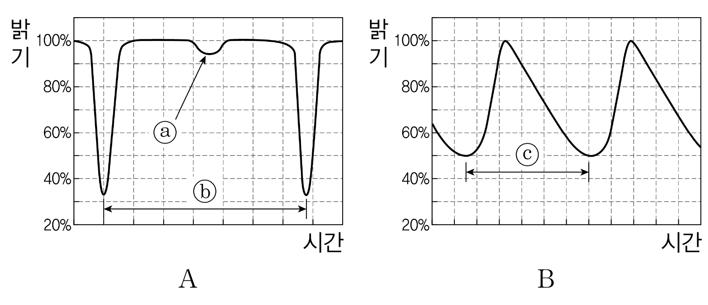
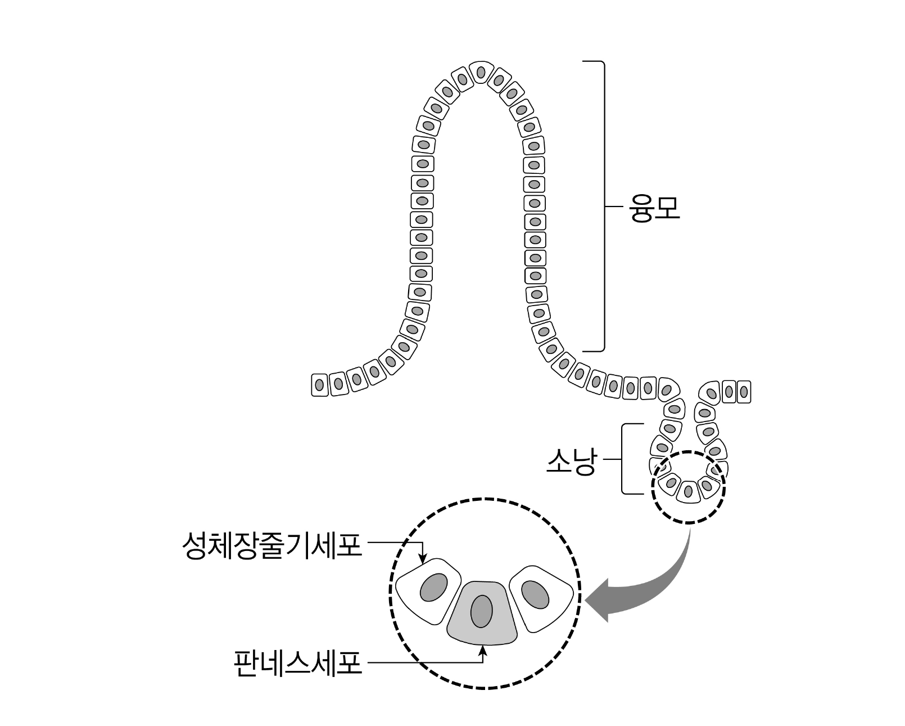

# [01-03] LU (2017)

다음 글을 읽고 물음에 답하시오.

## 제시문

넓은 바다에서 여러 사람을 태운 배가 난파하였다. 바다에 빠진 선원 A는 바다 위에 떠 있는 널판을 발견하였다. 널판은 한 사람을 겨우 지탱할 만큼밖에 되지 않았다. 선원 A가 널판으로 헤엄쳐 갈 때, 마침 미처 붙잡을 만한 것을 찾지 못한 선원 B도 널판 쪽으로 헤엄쳐 왔다. 선원 A와 선원 B는 동시에 그 널판을 붙잡게 되었다. 두 사람이 계속 붙잡고 있다가는 널판이 가라앉을 것이기 때문에 선원 A는 둘 다 빠져 죽을까 걱정하여 선원 B를 널판에서 밀어내었다. 선원 B는 결국 물에 빠져 죽었고 선원 A는 구조되었다. 이는 고대 그리스의 철학자 카르네아데스가 만든 가상의 사건 ‘카르네아데스의 널’을 바탕으로 재구성한 사례이다. 이 사례는 윤리적으로 허용될 수 있는지도 논란거리가 되지만, 형법상 처벌되어야 하는지도 따져 볼 만하다.

범죄는 ‘(1) 구성요건에 해당하고, (2) 위법하며, (3) 유책한 행위’라고 정의된다. 이 세 가지 요소 가운데 하나라도 빠지면 범죄는 성립하지 않는다. 이 중 구성요건이란 형벌을 부과할 대상이 되는 위법한 행위를 형법에 유형화하여 기술해 놓은 것을 말한다. 예를 들면, 형법 제250조 제1항은 “사람을 살해한 자는 사형, 무기 또는 5년 이상의 징역에 처한다.”라고 규정하는데, 여기서 사람을 살해한다는 것이 구성요건이다. 따라서 구체적인 사실이 구성요건에 해당할 때에는 일반적으로 위법하다.

구성요건에 해당하더라도 위법하다고 볼 수 없을 때가 있다. 잘 알려진 것으로는 정당방위, 긴급피난에 해당하는 경우가 있다. 정당방위는 자기 또는 타인의 법익을 현재의 위법한 침해로부터 방위하기 위하여 상당한 이유가 있는 행위를 하는 것을 말한다. 여기에는 법이 불법에 양보할 필요가 없다는 전제가 깔려 있다. 긴급피난은 자기 또는 타인의 법익에 대한 현재의 위난을 피하기 위하여 상당한 이유가 있는 행위를 하는 것을 말한다. 생명과 같이 대체할 수 없는 큰 법익을 지키기 위해 어쩔 수 없이 재산과 같은 법익을 희생시킨 일을 가지고 사회적인 해악을 일으킨 위법한 행위라 하지 않는 것이다. 긴급피난은 꼭 위법한 침해 행위로 일어난 위난에 대하여만 인정하는 것이 아니라는 점에서 정당방위와 다르다.

앞의 사례에서 선원 A와 선원 B가 동시에 널판을 잡은 행위는 저마다의 생명을 생각할 때 불가피한 일이었다. 이 상황은 선원 A의 입장에서 급박한 위난이었고, 선원 A의 이어진 행위는 위난을 피하는 데 절실한 것이었다. 이러한 선원 A의 행위에 대해 <u>㉠ 정당방위가 인정된다고 생각하는 이</u>나, <u>㉡ 긴급피난이 성립하여 위법성이 없다고 파악하는 이</u>가 있을지 모른다. 그러나 그 어느 쪽도 해당하지 않는다고 해야 한다.

우선 정당방위의 요건을 생각할 때 위난에 빠진 선원 B의 행위에 대한 선원 A의 행위를 정당방위로 볼 수는 없으며, 또한 긴급피난이 성립하려면 보호한 법익이 침해한 법익보다 훨씬 커야 하는데 이 사례는 여기에 해당하지 않는다. 그렇다고 해서 곧바로 선원 A에게 범죄가 성립한다고 단정할 수는 없다. 범죄가 성립하기 위해서는 ‘책임’이라고 하는 점도 고려해야 하기 때문이다. 범죄는 유책한 행위, 곧 행위자에게 책임을 물을 수 있는 행위여야 성립할 수 있는 것이다. 따라서 유책하지 않은 행위를 들어 형벌을 부과할 수 없다.

위법성은 개인의 행위를 법질서와의 관계에서 판단하는 것이어서, 행위자 개인의 특수성은 위법성 판단의 기준이 되지 않는다. 형법에서 위법한 행위를 한 행위자 개인을 비난할 수 있는가 하는 것이 바로 책임의 문제이다. 형법상 책임은 행위자에 대한 법적 비난 가능성의 문제인 것이다. 이는 구체적인 상황에서 행위자가 위법한 행위 말고 다른 행위를 할 수 있었겠는가 하는 기대 가능성으로 볼 수 있다. 적법한 행위를 할 수 있었는데도 위법한 행위를 한 데에 대하여는 윤리적인 비판뿐만 아니라 법적인 비난이 가해져야 하기 때문이다. ‘카르네아데스의 널’을 재구성한 사례에서 선원 A가 자신의 목숨을 희생하는 쪽을 선택하였다면 숭고한 선행임에 틀림없지만, 그렇게 하지 않은 데 대하여 윤리적인 비판은 몰라도 법적인 비난을 하기는 어렵다고 보는 것이 일반적이다.

## 01

<kbd>사례</kbd>에 관한 윗글의 이해로 적절한 것은?

### 선택지

(1) 선원 A나 선원 B의 행위는 모두 위난을 벗어나고자 한 것이라 할 수 있다.
(2) 선원 B가 만약 선원 A를 밀어 빠져 죽게 하였다면 그 행위는 범죄가 된다.
(3) 선원 A와 선원 B의 행위는 형법상 살인죄의 구성요건에 해당하지 않는다.
(4) 선원 B에 대한 선원 A의 행위는 윤리적으로 타당하기 때문에 형법상 비난받지 않는 것이다.
(5) 선원 A가 선원 B를 살리는 선택을 하였더라도 그것을 윤리적으로 드높은 덕행이라 할 수 없다.

## 02

㉠, ㉡에 대해 추론한 내용으로 적절하지 <u>않은</u> 것은?

### 선택지

(1) ㉠은 선원 B의 행위가 위법한 침해라고 주장할 것이다.
(2) ㉠은 선원 A의 행위가 현재 자기에게 닥친 침해를 해결하려 한 것이라고 주장할 것이다.
(3) ㉡은 선원 B의 행위가 위법한 침해라고 주장하지 않아도 된다.
(4) ㉡은 선원 A의 행위에 대한 범죄 성립 여부는 그의 책임에 대한 문제까지 따져야 결정될 것이라고 볼 것이다.
(5) ㉠과 ㉡은 모두 선원 A의 행위가 현재 직면한 위난을 해결하는 데 상당한 이유가 있는 것이었다고 볼 것이다.

## 03

윗글에 따를 때, 선원 A의 ‘책임’에 대한 설명으로 가장 적절한 것은?

### 선택지

(1) 구성요건에 해당하지 않는 행위는 책임을 따질 필요가 없기 때문에, 선원 A의 책임은 인정되지 않는다.
(2) 형법상 책임이 있다는 것은 적법한 다른 행위를 할 수 있는 상황임을 전제하기 때문에, 선원 A는 책임이 있다.
(3) 선원 A의 책임 유무를 따지는 것은, 자신의 생명에 대한 위난을 피하기 위해 남의 생명을 침해한 행위가 위법하다고 인정되기 때문이다.
(4) 유책하지 않은 행위에 대하여는 정당방위가 성립할 수 없기 때문에, 선원 A의 행위에 대하여는 정당방위를 따지지 않고 책임의 문제를 검토하는 것이다.
(5) 선원 A의 행위가 위법한지는 따져 보지 않아도 되는 것은, 위법성은 행위에 대한 법규범적 판단인 데 반하여 책임은 행위자에 대한 윤리적인 비난 가능성을 검토하는 것이기 때문이다.

# [04-06] LU (2017)

다음 글을 읽고 물음에 답하시오.

## 제시문

개인의 복지 수준이 향상되었다거나 또는 한 개인의 복지 수준이 다른 사람들보다 높다고 할 때, 이는 무엇을 의미하는가? 이 물음에 대한 답변은 인간 복지의 본성이나 요건에 대한 이해를 요구하는데, 이와 관련된 대표적인 도덕철학적 입장은 다음과 같다.

첫째, ‘쾌락주의적 이론’은 긍정적인 느낌으로 구성된 심리 상태인 쾌락의 정도가 복지 수준을 결정한다고 본다. 어떤 개인이 느끼는 쾌락이 증진될 때 그의 복지가 향상된다는 것이다. 둘째, ‘욕구 충족 이론’은 개인이 욕구하는 것이 충족되는 정도에 따라 복지 수준이 결정된다고 본다. 어떤 개인이 지닌 욕구들이 좌절되지 않고 더 많이 충족될 때 그의 복지가 향상된다는 것이다. 셋째, ‘객관적 목록 이론’은 개인의 삶을 좋게 만드는 목록을 기준으로 그것이 실현되는 정도에 따라 복지 수준이 결정된다고 본다. 그러한 목록에는 통상적으로 자율적 성취, 지식, 친밀한 인간관계, 미적 향유 등이 포함되는데, 그것의 내재적 가치는 그것이 개인에게 쾌락을 주는지 또는 그것이 개인에 의해 욕구되는지 여부와는 직접적 관련이 없다. 이 중에서 ‘쾌락주의적 이론’과 ‘객관적 목록 이론’은 어떤 것들이 내재적 가치가 있는지를 말해 준다는 점에서 실질적인 복지 이론이며, ‘욕구 충족 이론’은 사람들에게 좋은 것들을 찾아내는 방법을 알려주지만 그것들이 무엇인지를 말해 주지 않는다는 점에서 형식적인 복지 이론이라고 할 수 있다.

이러한 복지 이론들 중에서 많은 경제학자들의 지지를 받는 것은 ‘욕구 충족 이론’이다. 그들은 이 이론을 바탕으로 복지 수준의 높고 낮은 정도를 평가할 수 있다고 본다. 그리고 우리가 직관적으로 복지의 증가에 해당한다고 믿는 모든 활동과 계기들이 쾌락이라는 심리 상태를 항상 동반하는 것은 아니기 때문에 ‘쾌락주의적 이론’은 복지에 관해서 너무 협소하다고 비판하면서 더 개방적인 입장을 가져야 한다고 주장한다. 욕구의 대상이 현실에서 구현되는 것이 중요하지 그 구현 사실이 인식되어 개인들이 어떤 느낌을 갖게 되는 것이 필수적이지는 않다고 보기 때문이다. 그 이론의 옹호자들은 ‘객관적 목록 이론’도 한계를 지니고 있다고 비판한다. 복지 목록에 있는 항목들이 대체로 개인들의 복지에 기여한다는 점은 인정할 수 있지만 그 항목들이 복지에 기여하는 이유에 대해서는 제대로 해명하지 못하고 있다는 것이다. 또한 개인들이 실제로 욕구하는 것들 중에는 그 목록에 포함되지 않지만 복지에 기여하는 경우도 있다는 것이다.

하지만 이러한 ‘욕구 충족 이론’도 다음과 같은 문제점을 갖고 있다. 첫째, 욕구의 충족과 복지가 어느 정도 연관성이 있기는 하지만 모든 욕구의 충족이 복지에 기여하는 것은 아니라는 문제가 있다. 사람들이 정보의 부족이나 잘못된 믿음으로 자신에게 나쁜 것을 욕구할 수 있으며, <u>㉠ 타인의 삶에 대해 내가 원하는 것이 이루어졌다고 할지라도 그것이 나의 복지 증진과는 무관할 수 있기</u> 때문이다. 둘째, 사람들이 타인에 대한 가학적 욕구와 같은 반사회적인 욕구를 추구하는 경우도 문제가 된다. 셋째, <u>㉡ 개인이 일관된 욕구 체계를 갖고 있지 않아서 욕구들 사이에 충돌이 발생할 때 이를 해결하기 어렵다는</u> 문제가 있다.

이러한 문제들에 대응하는 방식으로는 ‘욕구 충족 이론’을 버리고 다른 복지 이론을 수용하는 방식도 있지만 그 이론을 변형하는 방식도 있다. ‘욕구 충족 이론’과 구별되는 ‘합리적 욕구 충족 이론’은 개인들이 가진 모든 욕구들의 충족이 아니라, 관련된 정보에 입각하여 타인이 아닌 자기에게 이익이 되는 합리적인 욕구의 충족만이 복지에 기여한다고 본다. 이것은 사람들이 욕구하는 것이 합리적이라면 그것이 바로 좋은 것이라는 입장이다. 이 이론은 ‘욕구 충족 이론’이 봉착한 난점들을 상당히 해결해 준다는 점에서 장점을 갖고 있다. 하지만 이 이론은 어떤 욕구가 합리적인지에 대해 답변을 해야 하는 부담을 안고 있다. 만약 이 이론의 옹호자가 이에 대한 답변을 시도한다면 이 이론은 형식적 복지 이론에서 실질적 복지 이론으로 한 걸음 나아가게 된다.

## 04

윗글에서 이끌어낼 수 있는 내용으로 적절하지 <u>않은</u> 것은?

### 선택지

(1) ‘쾌락주의적 이론’은 개인의 쾌락이 감소하면 복지도 감소한다고 본다.
(2) ‘욕구 충족 이론’은 개인들 간의 복지 수준을 서로 비교할 수 없다고 본다.
(3) ‘객관적 목록 이론’은 쾌락이 증가하더라도 복지 수준은 불변할 수 있다고 본다.
(4) ‘객관적 목록 이론’은 내재적 가치를 지닌 것들이 복지를 증진할 수 있다고 본다.
(5) ‘합리적 욕구 충족 이론’은 모든 욕구의 충족이 복지에 기여하는 것은 아니라고 본다.

## 05

‘욕구 충족 이론’의 관점과 부합하는 주장만을 <보기>에서 있는 대로 고른 것은?

### 보기

ㄱ. 욕구를 충족하는 것은 복지 증진의 필요조건이기는 하지만 충분조건은 아니다.

ㄴ. 복지에 기여하는 행위는 그 전후로 개인의 심리 변화를 유발하지 않아도 된다.

ㄷ. 미적 향유가 복지에 기여한다면 그 자체가 좋은 것이기 때문이 아니라 그것이 내가 원하는 것이기 때문이다.

### 선택지

(1) ㄱ
(2) ㄴ
(3) ㄷ
(4) ㄱ, ㄴ
(5) ㄴ, ㄷ

## 06

<보기>의 사례들에 대한 반응으로 적절하지 <u>않은</u> 것은?

### 보기

(가) ‘갑’은 기차에서 우연히 만난 낯선 사람의 질병이 낫기를 간절히 원하였는데, 그 후에 그를 다시 만난 적이 없어서 그의 질병이 나았다는 것을 전혀 모른다. 그래서 그의 질병이 나았다는 사실은 갑에게 아무런 영향도 주지 않았다.

(나) ‘을’은 A학점을 받기 위해 시험 전날 밤에 밤새워 공부하기를 원하면서도, 친구들과 어울리는 것이 좋아 밤늦게까지 파티에 참석하기도 원한다. 그래서 그는 어떻게 해야 할지 갈등하고 있다.

(다) ‘병’은 인종 차별적 성향 때문에, 의약품이 더 필요한 흑인보다는 그렇지 않은 백인에게 의약품을 분배하기를 원한다. 그래서 그는 백인에게만 그 의약품을 분배하였다.

### 선택지

(1) (가)는 ‘욕구 충족 이론’의 문제점과 관련하여 ㉠의 사례로 활용할 수 있겠군.
(2) (가)는 ‘쾌락주의적 이론’과 ‘합리적 욕구 충족 이론’ 모두의 관점에서는 갑의 복지가 증진된 사례로 활용할 수 없겠군.
(3) (나)는 ‘욕구 충족 이론’의 문제점과 관련하여 ㉡의 사례로 활용할 수 있겠군.
(4) (나)에 나타난 갈등은 항목들 간의 우선순위를 설정하지 않은 ‘객관적 목록 이론’에서는 해결하기 어렵겠군.
(5) (다)는 ‘욕구 충족 이론’의 관점에서는 병의 복지가 증진된 사례가 될 수 없겠군.

# [07-10] LU (2017)

다음 글을 읽고 물음에 답하시오.

## 제시문

명식의 밤 외출은 날이 갈수록 잦아 갔다. 2층 서재로 숨어 들어가 그의 가면 뒤에서 이상스런 휴식에 젖는 것도 마찬가지였다. 그렇게 하여 그는 사무실에서 묻어 온 피곤기를 가면 뒤에서 말끔히 씻어낸 다음 지연을 찾아 <u>ⓐ 밤늦은 2층 계단을 내려오곤 했다</u>.

[A] 명식은 분명 그 가면 뒤에서라야 비로소 휴식을 얻을 수 있는 듯했다. 그것은 어쩌면 자기 변신의 연극기 같은 것에서 오는, 그 가면 뒤에서 세상을 바라보고 새삼스럽게 자기를 느끼는 시간이 되고 있는지도 모를 일이었다.

그것은 어쨌든, 이제 지연이 명식을 속속들이 다 만나는 것은 그가 그 밤 외출에서 이상스런 방법으로 피로를 씻고 새 힘을 얻어 돌아오는 날뿐이었다.

이윽고 지연에게도 한 가지 변화가 생기기 시작했다. 명식을 만나고 싶은 밤의 소망은 반드시 그의 가면을 연상시켜 주곤 했다. 지연은 명식의 가면을 사랑하기 시작했다. 그녀는 명식의 가면을 만나고 싶어 하고 있었다. 그녀에게는 명식의 가면이 어느새 그렇게 익숙하게 느껴지기 시작하고 있었고, 어찌된 셈인지 그녀는 명식의 동기까지를 포함하여 그러는 자신을 스스로 수긍해 버리고 있었던 것이다. 명식에게서도 혹시 그런 기미가 엿보이고 있었기 때문일까. <u>㉠ 지연은 이제 오히려 명식의 맨얼굴 쪽에서 어떤 불편스런 가면이 느껴지고 있을 지경이었다.</u> 그녀에게는 명식이 맨얼굴로 대문을 들어설 때의 표정이야말로 영락없이 가면을 쓰고 있는 것처럼 뻣뻣하고 변화 없고 그리고 어떤 뻔뻔스런 피곤기 같은 것이 온통 그를 가려 버리고 있는 듯한 느낌이 들곤 했다.

그러나 지연은 그토록 익숙해진 명식의 가면을 아직도 똑똑히 본 일이 없었다.

그 첫날 한 번밖엔 명식이 자기의 가면 뒤에서 편안히 쉬고 있는 모습을, 그것이 진짜 자기의 얼굴이나 되는 양 익숙해져 버린 가면으로 의기양양 밤 외출에서 돌아오곤 한 명식을 다시 본 일이 없었다.

지연은 보지 않아도 그것을 알고 있었다. 그리고 이미 그 명식의 얼굴을 자신 속에다 깊이 지녀 버리고 있었다. 문득문득 그것을 만나고 싶은 밤이 많았다. 이날도 지연은 그런 명식을 기다리고 있었다.

[중략 부분의 줄거리] 잠시 후 명식이 밤 외출에서 돌아온다.

한참을 기다렸다. 역시 기척이 없다. 이상한 일이었다.

<u>㉡ 오늘 밤에도 또?</u>

지연은 갑자기 초조해지기 시작했다. 문득 어떤 별난 밤의 일이 떠올랐다. 그날도 명식은 썩 오랜만의 밤 외출에서 돌아와 소리 없이 2층으로 올라간 다음이었다. 지연은 물론 그녀의 침대 속에서 명식을 기다리고 있었다. 아무리 기다려도 그가 계단을 내려오는 기척이 없었다. 지연은 불쑥 상서롭지 못한 예감이 들었다. 술이 너무 지나쳤나 싶기도 했고, 그런 일이 워낙 처음이라 다른 심상찮은 변고가 생기지 않았나 싶기도 했다. 그녀는 기다리다 못해 결국 자기가 먼저 침대를 내려오고 말았다. 여자가 먼저 남편을 찾는 것처럼 보이기가 여간 쑥스럽지 않았지만, 어쨌든 그녀는 명식을 살피고 와야 한다고 생각했다. 마루에서 잠깐 발길을 망설이던 그녀는 <u>ⓑ 가만가만 2층 계단을 올라갔다</u>.

<u>㉢ 지연이 명식의 방문 앞까지 다가갔을 때 방안의 반응은 그녀가 예상했던 것과는 너무도 딴판이었다.</u>

“좀 들어오지그래.”

기다리고 있기나 했었던 듯 문을 열기도 전에 명식의 소리가 먼저 흘러나왔다. 술이 취해 있기는커녕 너무도 정연하고 조용한 목소리였다. 지연은 쑥스러움도 잊고 끌리듯 문을 열고 방안으로 들어섰다.

명식은 불을 켜지 않은 채 창문 근처의 어둠 속에 조용히 파묻혀 있었다.

“앉지 않구.”

어둠 속이라 모습은 잘 보이지 않고 목소리만 들려왔다.

“오늘 밤은 여기서 좀 이렇게 지내다 가.”

어떤 분명한 의미가 담긴 말이었다. 지연은 감히 명식의 곁으로는 갈 수가 없었다. 공연히 그가 두려웠다. 변장을 하고 있을 그의 얼굴을 만나 버리기가 두려웠다. 그녀는 명식과 멀찌감치 떨어져 있는 등 없는 둥글의자 위로 몸을 주저앉혔다. 그러나 지연은 그러고 앉아서도 명식의 어떤 분명한 얼굴을 보고 있었다.

[B] 명식은 아직 변장을 풀지 않고 있었다. 그는 목소리가 너무 잔잔했다. 어딘가 한숨 같은 것이 묻어 있는 잔잔한 음성이었다.

지연은 명식의 그 음성으로 그가 지금 자기는 보지도 않고 창밖으로 시선을 내보낸 채, 그녀로서는 도저히 알 수도 없고 설명할 수도 없는 어떤 깊은 갈망에 젖고 있다는 것을 어슴푸레 느낄 수 있었다.

\- 이렇게 불을 끄고 앉아 있으니 밤이 좋군. <u>㉣ 대낮은 얼굴이 너무 따가워서……</u> 누구나 결국은 그렇게 되는 거지만 사실 사람들이 얼굴 가득히 그 엄청난 대낮의 햇빛을 스스럼없이 견디어 낼 수 있도록 잘 단련이 되고 있는 건 다행한 일이지.

\- 하지만 그건 다행스럽다고만은 할 수가 없다면…… 그런 식으로 사람들은 제각기 자기의 가면을 든든하게 단련시켜 가고 있거든. 눈물을 흘릴 수가 없어…….

\- 가면이 우는 걸 보았을까. 물론 그런 일은 있을 수가 없지. 가면의 눈물은 속으로만 흐르게 마련이거든.

명식은 역시 취기가 좀 숨어 있었던 모양이었다. 그는 어둠 속에서 혼잣말처럼 띄엄띄엄 중얼거리고 있었는데 앞뒤가 닿는 소리만 추려 보면 대강 그런 식이었다. <u>㉤ 지연이 보아 온 대로였다.</u> 대낮을 다니는 맨얼굴에서 가면을 느끼는 대신, 가발과 콧수염으로 변장을 하고 있는 당장의 자신에 대해서는 전혀 이질감을 느끼지 않고 있는 기미였다. 그리고, 그래서 명식은 그러한 변장 속에서 비로소 자신의 고뇌를 가장 정직하게 안을 수 있는 듯한 태도였다.

지연은 아무 말도 하지 않았다. 조용히 입을 다물고 앉아서 어둠에 싸인 명식의 희미한 모습만 더듬고 있었다. 그러다가 방을 나오고 말았다.

\- 이청준, 「가면의 꿈」

## 07

[A]와 [B]에 대한 설명으로 가장 적절한 것은?

### 선택지

(1) [A]는 인물 자신이 보고 들은 사건을 주관적 시각에서 직접적으로 서술한다.
(2) [A]는 인물의 독백적 발화를 통해 다른 인물의 내면 심리를 생생하게 제시한다.
(3) [B]는 사건을 작중 상황 안에서 목격하는 인물과 그 사건을 전달하는 서술자가 서로 다르다.
(4) [B]는 작중 상황 안의 서술자가 인물의 심리를 추측하여 전달함으로써 독자의 상상력을 제한한다.
(5) [B]는 서술자가 인물의 행동과 심리를 작중 상황 밖에서 전달하다가 작중 상황 안으로 이동하여 전달한다.

## 08

㉠～㉤의 문맥적 의미로 가장 적절한 것은?

### 선택지

(1) ㉠ : 귀가할 때 다른 가면을 지어내는 ‘명식’에게 불편을 느끼고 있다.
(2) ㉡ : 가면을 쓴 ‘명식’과의 대화가 누차 반복되었음을 나타내고 있다.
(3) ㉢ : ‘명식’에 대한 불길한 예감이 들어맞지 않았음을 보여 주고 있다.
(4) ㉣ : 타인들의 시선 때문에 낮에도 변장을 하게 되었음을 나타내고 있다.
(5) ㉤ : ‘명식’의 사회적 지위에 대한 ‘지연’의 부정적 인식을 드러내고 있다.

## 09

ⓐ와 ⓑ에 제시된 행위에 대한 설명으로 가장 적절한 것은?

### 선택지

(1) ⓐ는 아래층 인물이 위층 인물을 전과 달리 대하는 결과를 낳는다.
(2) ⓐ는 위층 인물이 자신의 가면을 보여 주기 위하여 하는 행위이다.
(3) ⓐ는 위층 인물이 일상의 고단함을 탈피하기 위하여 하는 행위이다.
(4) ⓑ는 아래층 인물의 내적 욕망과 행동의 괴리가 일어나게 한다.
(5) ⓑ는 아래층 인물이 부부에 대한 전통적 관념을 비판적으로 인식하게 한다.

## 10

<보기>를 바탕으로 윗글을 감상할 때, 적절하지 <u>않은</u> 것은?

### 보기

소설 속 인물의 변신 모티프는 그가 겪는 갈등의 크기를 드러내고 그것을 해소하려는 깊은 소망을 내보이는 방편일 뿐, 소망의 실현을 목적으로 하지 않는다. 변신은 갈등의 일시적 해소 효과가 없지 않지만, 가짜 해결의 속임수이고 상상적 희망의 기호에 불과하다. 결국 갈등을 극복할 수 있는 길은 참된 자아의 진실을 근거로 하여 그것에 맞서는 것뿐이다.

\- 작가의 말 중에서

### 선택지

(1) ‘지연’이 ‘명식’과 멀찌감치 떨어져 있는 의자에 앉은 것은 ‘명식’의 참된 자아를 발견할까 두려웠기 때문이다.
(2) ‘명식’의 밤 외출이 잦아지는 것은 현실 세계와의 불화로 인하여 갈등이 고조되었음을 우회적으로 나타낸다.
(3) ‘명식’이 가면의 눈물은 속으로만 흐른다고 말한 것은 참된 자아를 숨긴 채 살아가는 자기 삶에 대한 고백이다.
(4) ‘명식’의 가면을 똑똑히 보지 않고도 그를 기다리는 ‘지연’의 행위는 ‘명식’의 상상적 희망을 자기화한 것이다.
(5) ‘명식’이 가면을 쓴 자신에게 이질감을 느끼지 않는 것처럼 보였던 것은 그가 일시적 속임수에 도취되었음을 의미한다.

# [11-13] LU (2017)

다음 글을 읽고 물음에 답하시오.

## 제시문

공화주의란 공동선을 추구하는 시민의 정치 참여에 기초하여 공동체적 삶에서 자의적 권력에 의한 지배를 배제하고 자치를 실현하고자 하는 사상이다. 이에 적합한 형태의 공동체에 관해서는 주로 그 규모와 관련하여 오랫동안 논의가 이어져 왔다. 시민적 덕성이 제대로 발휘되어 파벌이 통제되기 위해서는 공화국의 크기가 작아야 하지만, 외세의 침략 위험에 맞서 충분한 안전을 시민에게 제공하기 위해서는 그 크기가 커야 할 것이다. 미국 헌법 제정기의 <kbd>연방주의자</kbd>인 『페더럴리스트 페이퍼』(1787. 10～1788. 8)의 저자들은 바로 연방 공화국의 형태가 공동체 내부의 부패와 대외적 취약성을 둘러싼 공화주의의 딜레마를 해결해 줄 수 있다고 보았다. 그것은 파벌 지도자의 영향력이 확산되지 못하게 막는 분할의 이익과, 한데 뭉쳐 외부의 적에 대항하도록 하는 결집의 이익을 함께 가져다준다는 것이다.

공동체에 대한 시민들의 이해관계가 복잡해지는 것을 나쁘게 볼 것만은 아니지만, 가까이 있어서 서로를 잘 아는 사람들보다 불가피하게 소원한 거리에 놓인 사람들이 우정과 연대의 공적 정신을 유지하기란 더 어려울 수 있다. 광대한 영토 위에서 공화주의 정부가 유지되기 위해서는 시민들로 하여금 사익의 추구를 자제하고 공동선을 지향하도록 하는 보다 강력한 조치가 필요할 것이다. 결국 연방주의자들은 대의제와 권력분립 등 헌정주의의 요소를 가미함으로써 이성과 법의 지배를 통하여 파벌과 전제적(專制的) 다수의 출현을 방지하고자 했다. 자치에 대한 시민들의 열정이 사그라지거나 폭주하지 않도록 헌법의 틀을 씌웠던 것이다.

그런데 헌법이라는 것에 대한 공화주의자들의 이해는 오늘날의 지배적인 견해와는 매우 다른 것이었다. 오늘날 헌법은 주로 정치 공동체의 실질적인 가치 기준과 운영 원칙을 정하는 견고한 문서로 이해되고 있다. 여기서 헌법은 헌법적 논쟁들에 대해 판단해 줄 누군가를 필요로 하게 된다. 그의 해석과 판단에 따라 헌법과 충돌하는 것으로 보이는 행정작용이나 법률은 그 효력을 잃게 될 것이다. 이처럼 지극히 법적인 의미로 이해된 헌법과는 달리, 공화주의자들이 생각하고 있던 헌법이란 단순히 정치 공동체 내에서 권력이 분할되는 방식을 나타내거나 그렇게 구성된 특수한 정부 형태를 지칭하는 정치적인 의미의 것이었다. 통치자의 선출과 정치적 지분의 할당을 통해 경쟁적 사회 집단 사이에 이해관계의 균형을 도모하는 것은 로마의 혼합정체 이래 지속 가능한 공화국의 골자를 이루게 되었다고 할 수 있다. 따라서 18세기 후반에 비로소 등장한 법적 의미의 헌법 개념은 당시 미국의 공화주의적 헌법을 구상하는 과정에서조차 의도되었던 바가 아니며, 성문의 헌법을 채택하면서도 여전히 그것은 사법적 헌장이라기보다는 시민의 헌장을 갖는다는 의미였을 것이다.

공화주의와 관련하여 우리가 헌법의 의미에 주목해야 하는 이유는 법적 의미의 헌법 개념을 과거의 공화주의 사상가들이 알지 못했기 때문만은 아니다. 그것은 오히려 헌법을 법적인 의미로 이해하는 전제에서 공화주의를 위하여 제안되는 이른바 <u>㉠ 헌정주의적 수단들</u>이 역으로 공화주의의 핵심적 목적과 충돌하게 된다는 문제 때문이다. 예컨대, 그러한 수단의 하나로 제안되는 법률의 헌법 기속 개념은 기본적으로 시민의 대표들이 다수결로 도출하는 합의를 불신한다는 면에서 공동체적 삶의 향배를 시민들의 손에 맡기고자 하는 공화주의의 이상에 반하는 것이며, 그보다는 차라리 국가로부터 개인의 권리를 보호하고자 하는 자유주의적 사고의 장치에 가깝다는 비판을 받고 있다. 바꿔 말해서 소수의 현자들에 의한 사법 심사의 과정으로 뒷받침되는 헌법은 더 이상 공화주의적이지 않으며, 나아가 미국의 민주정치가 발전하는 데도 방해가 되어 왔다는 것이다.

그러나 현대 민주정치의 상황에서 시민의 정치 참여는 통치자의 선출이나 할당된 지분의 행사에서처럼 투표 과정을 중심으로 이루어져야 하는 것은 아니며, 오히려 공적인 토론의 과정을 중심으로 이루어질 수도 있다. 만약 사법 심사의 장이 그와 같은 토론의 과정을 촉발시키고 이끎으로써 궁극적으로 법의 지배에 기여하는 것이라면 그에 대한 평가는 달라질 것이다. 무엇보다 여기서 민주주의의 가치를 공동선에 관한 이성적 숙의에서 찾고자 했던 공화주의자들의 관점을 다시 발견할 수 있기 때문이다.

## 11

윗글의 내용과 일치하는 것은?

### 선택지

(1) 공화국의 광대한 영토는 대외적 방어에 불리하다.
(2) 공화주의자는 시민으로서의 삶보다 개인으로서의 삶을 중시한다.
(3) 『페더럴리스트 페이퍼』의 저자들은 안전보다 연대를 추구하였다.
(4) 연방주의자는 공화주의의 딜레마가 지닌 정치적 함의를 간과하였다.
(5) 로마의 혼합정체는 공화국의 대내적 균형을 확보해 주는 장치였다.

## 12

<kbd>연방주의자</kbd>의 생각으로 적절하지 <u>않은</u> 것은?

### 선택지

(1) 연방 공화국의 정부 형태를 출범시키기 위해서 헌법의 개념이 변해야 하는 것은 아니다.
(2) 선출된 대표가 파벌 지도자로 변질되는 것을 연방이라는 헌정 체제를 통해 견제할 수 있다.
(3) 공화국에 대한 내부 위협은 소규모의 파벌이 광대한 영역 기반의 대규모 파벌로 커질 때 오히려 줄어들게 된다.
(4) 규모가 커진 공화국은 구성원들의 사회적 다양성도 커져서 정치적 분열이 초래되어 전제적 다수가 형성되기 어렵다.
(5) 인간 본성에 자리하고 있는 파벌의 싹은 근절될 수 없으므로 그것의 발호를 통제하는 제도적 장치를 갖추어 대응해야 한다.

## 13

㉠에 대한 진술로 적절하지 <u>않은</u> 것은?

### 선택지

(1) 공적인 토론의 과정을 정치적 대표를 선출하는 투표 과정으로 대체한다.
(2) 헌법적 가치의 선언을 통해 의회의 결정 권한에 대한 제한을 공식화한다.
(3) 성문화된 헌법은 최고법적 효력으로 인해 민주주의와 긴장 관계에 놓일 수 있다.
(4) 대통령의 법률안 거부권을 인정하여 상호 견제를 통한 권력의 제한을 꾀한다.
(5) 법의 지배는 그 누구의 지배도 아니라는 점에서는 자의적 권력의 지배를 거부하는 공화주의 이념과 연결된다.

# [14-17] LU (2017)

다음 글을 읽고 물음에 답하시오.

## 제시문

과거에 일어난 금융위기에 대해 많은 연구가 진행되었어도 그 원인에 대해 의견이 모아지지 않는 경우가 대부분이다. 이것은 금융위기가 여러 차원의 현상이 복잡하게 얽혀 발생하는 문제이기 때문이기도 하지만, 사람들의 행동이나 금융 시스템의 작동 방식을 이해하는 시각이 다양하기 때문이기도 하다. 은행위기를 중심으로 금융위기에 관한 주요 시각을 다음과 같은 네 가지로 분류할 수 있다. 이들이 서로 배타적인 것은 아니지만 주로 어떤 시각에 기초해서 금융위기를 이해하는가에 따라 그 원인과 대책에 대한 의견이 달라진다고 할 수 있다.

우선, 은행의 지불능력이 취약하다고 많은 예금주들이 예상하게 되면 실제로 은행의 지불능력이 취약해지는 현상, 즉 <u>㉠ ‘자기실현적 예상’</u>이라 불리는 현상을 강조하는 시각이 있다. 예금주들이 예금을 인출하려는 요구에 대응하기 위해 은행이 예금의 일부만을 지급준비금으로 보유하는 부분준비제도는 현대 은행 시스템의 본질적 측면이다. 이 제도에서는 은행의 지불능력이 변화하지 않더라도 예금주들의 예상이 바뀌면 예금 인출이 쇄도하는 사태가 일어날 수 있다. 예금은 만기가 없고 선착순으로 지급하는 독특한 성격의 채무이기 때문에, 지불능력이 취약해져서 은행이 예금을 지급하지 못할 것이라고 예상하게 된 사람이라면 남보다 먼저 예금을 인출하는 것이 합리적이기 때문이다. 이처럼 예금 인출이 쇄도하는 상황에서 예금 인출 요구를 충족시키려면 은행들은 현금 보유량을 늘려야 한다. 이를 위해 은행들이 앞다투어 채권이나 주식, 부동산과 같은 자산을 매각하려고 하면 자산 가격이 하락하게 되므로 은행들의 지불능력이 실제로 낮아진다.

둘째, <u>㉡ 은행의 과도한 위험 추구</u>를 강조하는 시각이 있다. 주식회사에서 주주들은 회사의 모든 부채를 상환하고 남은 자산의 가치에 대한 청구권을 갖는 존재이고 통상적으로 유한책임을 진다. 따라서 회사의 자산 가치가 부채액보다 더 커질수록 주주에게 돌아올 이익도 커지지만, 회사가 파산할 경우에 주주의 손실은 그 회사의 주식에 투자한 금액으로 제한된다. 이러한 <u>ⓐ 비대칭적인 이익 구조</u>로 인해 수익에 대해서는 민감하지만 위험에 대해서는 둔감하게 된 주주들은 고위험 고수익 사업을 선호하게 된다. 결과적으로 주주들이 더 높은 수익을 얻기 위해 감수해야 하는 위험을 채권자에게 전가하는 것인데, 자기자본비율이 낮을수록 이러한 동기는 더욱 강해진다. 은행과 같은 금융 중개 기관들은 대부분 부채비율이 매우 높은 주식회사 형태를 띤다.

셋째, <u>㉢ 은행가의 은행 약탈</u>을 강조하는 시각이 있다. 전통적인 경제 이론에서는 은행의 부실을 과도한 위험 추구의 결과로 이해해왔다. 하지만 최근에는 은행가들에 의한 은행 약탈의 결과로 은행이 부실해진다는 인식도 강해지고 있다. 과도한 위험 추구는 은행의 수익률을 높이려는 목적으로 은행의 재무 상태를 악화시킬 위험이 큰 행위를 은행가가 선택하는 것이다. 이에 비해 은행 약탈은 은행가가 자신에게 돌아올 이익을 추구하여 은행에 손실을 초래하는 행위를 선택하는 것이다. 예를 들어 은행가들이 자신이 지배하는 은행으로부터 남보다 유리한 조건으로 대출을 받는다거나, 장기적으로 은행에 손실을 초래할 것을 알면서도 자신의 성과급을 높이기 위해 단기적인 성과만을 추구하는 행위 등은, 지배 주주나 고위 경영자의 지위를 가진 은행가가 은행에 대한 지배력을 사적인 이익을 위해 사용한다는 의미에서 약탈이라고 할 수 있다.

넷째, <u>㉣ 이상 과열</u>을 강조하는 시각이 있다. 위의 세 가지 시각과 달리 이 시각은 경제 주체의 행동이 항상 합리적으로 이루어지는 것은 아니라는 관찰에 기초하고 있다. 예컨대 많은 사람들이 자산 가격이 일정 기간 상승하면 앞으로도 계속 상승할 것이라 예상하고, 일정 기간 하락하면 앞으로도 계속 하락할 것이라 예상하는 경향을 보인다. 이 경우 자산 가격 상승은 부채의 증가를 낳고 이는 다시 자산 가격의 더 큰 상승을 낳는다. 이러한 상승작용으로 인해 거품이 커지는 과정은 경제 주체들의 부채가 과도하게 늘어나 금융 시스템을 취약하게 만들게 되므로, 거품이 터져 금융 시스템이 붕괴하고 금융위기가 일어날 현실적 조건을 강화시킨다.

## 14

㉠～㉣에 대한 설명으로 적절하지 <u>않은</u> 것은?

### 선택지

(1) ㉠은 은행 시스템의 제도적 취약성을 바탕으로 나타나는 예금주들의 행동에 주목하여 금융위기를 설명한다.
(2) ㉡은 경영자들이 예금주들의 이익보다 주주들의 이익을 우선한다는 전제 하에 금융위기를 설명한다.
(3) ㉢은 은행의 일부 구성원들의 이익 추구가 은행을 부실하게 만들 가능성에 기초하여 금융위기를 이해한다.
(4) ㉣은 경제 주체의 행동에 대한 귀납적 접근에 기초하여 금융위기를 이해한다.
(5) ㉠과 ㉣은 모두 경제 주체들의 예상이 그대로 실현된 결과가 금융위기라고 본다.

## 15

ⓐ와 관련한 설명으로 적절하지 <u>않은</u> 것은?

### 선택지

(1) 파산한 회사의 자산 가치가 부채액에 못 미칠 경우에 주주들이 져야 할 책임은 한정되어 있다.
(2) 회사의 자산 가치에서 부채액을 뺀 값이 0보다 클 경우에, 그 값은 원칙적으로 주주의 몫이 된다.
(3) 회사가 자산을 다 팔아도 부채를 다 갚지 못할 경우에, 얼마나 많이 못 갚는지는 주주들의 이해와 무관하다.
(4) 주주들이 선호하는 고위험 고수익 사업은 성공한다면 회사가 큰 수익을 얻지만, 실패한다면 회사가 큰 손실을 입을 가능성이 높다.
(5) 주주들이 고위험 고수익 사업을 선호하는 것은, 이런 사업이 회사의 자산 가치와 부채액 사이의 차이가 줄어들 가능성을 높이기 때문이다.

## 16

윗글에 제시된 네 가지 시각으로 <보기>의 사례를 평가할 때 가장 적절한 것은?

### 보기

1980년대 후반에 A국에서 장기 주택담보 대출에 전문화한 은행인 저축대부조합들이 대량 파산하였다. 이 사태와 관련하여 다음과 같은 사실들이 주목받았다.

◦ 1970년대 이후 석유 가격 상승으로 인해 부동산 가격이 많이 오른 지역에서 저축대부조합들의 파산이 가장 많았다.

◦ 부동산 가격의 상승을 보고 앞으로도 자산 가격의 상승이 지속될 것을 예상하고 빚을 얻어 자산을 구입하는 경제 주체들이 늘어났다.

◦ A국의 정부는 투자 상황을 낙관하여 저축대부조합이 고위험채권에 투자할 수 있도록 규제를 완화하였다.

◦ 예금주들이 주인이 되는 상호회사 형태였던 저축대부조합들 중 다수가 1980년대에 주식회사 형태로 전환하였다.

◦ 파산 전에 저축대부조합의 대주주와 경영자들에 대한 보상이 대폭 확대되었다.

### 선택지

(1) ㉠은 위험을 감수하고 고위험채권에 투자한 정도와 고위 경영자들에게 성과급 형태로 보상을 지급한 정도가 비례했다는 점을 들어, 은행의 고위 경영자들을 비판할 것이다.
(2) ㉡은 부동산 가격 상승에 대한 기대 때문에 예금주들이 책임질 수 없을 정도로 빚을 늘려 은행이 위기에 빠진 점을 들어, 예금주의 과도한 위험 추구 행태를 비판할 것이다.
(3) ㉢은 저축대부조합들이 주식회사로 전환한 점을 들어, 고위험채권 투자를 감행한 결정이 궁극적으로 예금주의 이익을 더욱 증가시켰다고 은행을 옹호할 것이다.
(4) ㉢은 저축대부조합이 정부의 규제 완화를 틈타 고위험채권에 투자하는 공격적인 경영을 한 점을 들어, 저축대부조합들의 행태를 용인한 예금주들을 비판할 것이다.
(5) ㉣은 차입을 늘린 투자자들, 고위험채권에 투자한 저축대부조합들, 규제를 완화한 정부 모두 낙관적인 투자 상황이 지속될 것이라고 예상한 점을 들어, 그 경제 주체 모두를 비판할 것이다.

## 17

㉠～㉣에 따른 금융위기 대책에 대한 설명으로 적절하지 <u>않은</u> 것은?

### 선택지

(1) 은행이 파산하는 경우에도 예금 지급을 보장하는 예금 보험 제도는 ㉠에 따른 대책이다.
(2) 일정 금액 이상의 고액 예금은 예금 보험 제도의 보장 대상에서 제외하는 정책은 ㉠에 따른 대책이다.
(3) 은행들로 하여금 자기자본비율을 일정 수준 이상으로 유지하도록 하는 건전성 규제는 ㉡에 따른 대책이다.
(4) 금융 감독 기관이 은행 대주주의 특수 관계인들의 금융 거래에 대해 공시 의무를 강조하는 정책은 ㉢에 따른 대책이다.
(5) 주택 가격이 상승하여 서민들의 주택 구입이 어려워질 때 담보 가치 대비 대출 한도 비율을 줄이는 정책은 ㉣에 따른 대책이다.

# [18-20] LU (2017)

다음 글을 읽고 물음에 답하시오.

## 제시문

우주의 크기는 인류의 오랜 관심사였다. 천문학자들은 이를 알아내기 위하여 먼 별들의 거리를 측정하려고 하였다. 18세기 후반에 허셜은 별의 ‘고유 밝기’가 같다고 가정한 뒤, 지구에서 관측되는 ‘겉보기 밝기’가 거리의 제곱에 비례하여 어두워진다는 사실을 이용하여 별들의 거리를 대략적으로 측정하였다. 그 결과 별들이 우주공간에 균질하게 분포하는 것이 아니라, 전체적으로 납작한 원반 모양이지만 가운데가 위아래로 볼록한 형태를 이루며 모여 있음을 알게 되었다. 이 경우, 원반의 내부에 위치한 지구에서 사방을 바라본다면 원반의 납작한 면과 나란한 방향으로는 별이 많이 관찰되고 납작한 면과 수직인 방향으로는 별이 적게 관찰될 것인데, 이는 밤하늘에 보이는 ‘은하수’의 특징과 일치한다. 이에 착안하여 천문학자들은 지구가 포함된 천체들의 집합을 ‘은하’라고 부르게 되었다. 별들이 모여 있음을 알게 된 이후에는 그 너머가 빈 공간인지 아니면 또 다른 천체가 존재하는 공간인지 의문을 갖게 되었으며, ‘성운’에 대한 관심도 커졌다.

성운은 망원경으로 보았을 때, 뚜렷한 작은 점으로 보이는 별과는 다르게 얼룩처럼 번져 보인다. 성운이 우리 은하 내에 존재하는 먼지와 기체들이고 별과 그 주위의 행성이 생성되는 초기 모습인지, 아니면 우리 은하처럼 수많은 별들이 모인 또 다른 은하인지는 오랜 논쟁거리였다. 앞의 가설을 주장한 학자들은 성운이 은하의 납작한 면 바깥에서는 많이 관찰되지만 정작 그 면의 안에서는 거의 관찰되지 않는다는 사실을 근거로 내세웠다. 그들에 따르면, 성운이란 별이 형성되는 초기의 모습이므로 이미 별들의 형성이 완료되어 많은 별들이 존재하는 은하의 납작한 면 안에서는 성운이 거의 관찰되지 않는다. 반면에 이들과 반대되는 가설을 주장한 학자들은 원반 모양의 우리 은하를 멀리서 비스듬한 방향으로 보면 타원형이 되는데, 많은 성운들도 타원 모양을 띠고 있으므로 우리 은하처럼 독립적인 은하일 것이라고 생각하였다. 그들에 따르면, 성운이 우주 전체에 고루 퍼져 있음에도 우리 은하의 납작한 면 안에서 거의 관찰되지 않는 이유는 납작한 면 안의 수많은 별과 먼지, 기체들에 의해 약한 성운의 빛이 가려졌기 때문이다.

두 가설 중 어느 것이 맞는지는 지구와 성운 사이의 거리를 측정하면 알 수 있다. 이 거리를 측정하는 방법은 밝기가 변하는 별인 변광성의 연구로부터 나왔다. 주기적으로 밝기가 변하는 변광성 중에는 쌍성이 있는데, 밝기가 다른 두 별이 서로의 주위를 도는 쌍성은 지구에서 볼 때 두 별이 서로를 가리지 않는 시기, 밝은 별이 어두운 별 뒤로 가는 시기, 어두운 별이 밝은 별 뒤로 가는 시기마다 각각 관측되는 밝기에 차이가 생긴다. 이 경우에 별의 밝기는 시간에 따라 대칭적으로 변화한다. 한편, 또 다른 특성을 지닌 변광성도 존재하는데, 이 변광성의 밝기는 시간에 따라 비대칭적으로 변화한다. 이와 같은 비대칭적 밝기 변화는 두 별이 서로를 가리는 경우와 다른 것으로, 별의 중력과 복사압 사이의 불균형으로 인하여 별이 팽창과 수축을 반복할 때 방출되는 에너지가 주기적으로 변화하며 발생한다. 이러한 변광성을 세페이드 변광성이라고 부른다.

1910년대에 마젤란 성운에서 25개의 세페이드 변광성이 발견되었다. 이들은 최대 밝기가 밝을수록 밝기의 변화 주기가 더 길고, 둘 사이에는 수학적 관계가 있음이 알려졌다. 이러한 관계가 모든 세페이드 변광성에 대해 유효하다면, 하나의 세페이드 변광성의 거리를 알 때 다른 세페이드 변광성의 거리는 그 밝기 변화 주기로부터 고유 밝기를 밝혀내어 이를 겉보기 밝기와 비교함으로써 알 수 있다. 이를 바탕으로 <u>㉠ 어떤 성운에 속한 변광성을 찾아 거리를 알아냄으로써 그 성운의 거리도 알 수 있게 되었는데</u>, 1920년대에 허블은 안드로메다 성운에 속한 세페이드 변광성을 찾아내어 그 거리를 계산한 결과 지구와 안드로메다 성운 사이의 거리가 우리 은하 지름의 열 배에 이른다고 밝혔다. 이로부터 성운이 우리 은하 바깥에 존재하는 독립된 은하임이 분명해지고, 우주의 범위가 우리 은하 밖으로 확장되었다.

## 18

윗글에서 알 수 있는 사실로 적절하지 <u>않은</u> 것은?

### 선택지

(1) 성운은 우주 전체에 고루 퍼져 분포한다.
(2) 안드로메다 성운은 별 주위에 행성이 생성되는 초기의 모습이다.
(3) 밤하늘을 관찰할 때 은하수 안보다 밖에서 성운이 더 많이 관찰된다.
(4) 밤하늘에 은하수가 관찰되는 이유는 우리 은하가 원반 모양이기 때문이다.
(5) 타원 모양의 성운은 성운이 독립된 은하라는 가설을 뒷받침하는 증거이다.

## 19

㉠과 같이 우리 은하 밖의 어떤 성운과 지구 사이의 거리를 알아내는 데 이용되는 사실만을 <보기>에서 있는 대로 고른 것은?

### 보기

ㄱ. 성운의 모양이 원반 형태이다.

ㄴ. 별의 겉보기 밝기는 거리가 멀수록 어둡다.

ㄷ. 밝기가 시간에 따라 대칭적으로 변하는 변광성이 성운 안에 존재한다.

### 선택지

(1) ㄱ
(2) ㄴ
(3) ㄷ
(4) ㄱ, ㄴ
(5) ㄴ, ㄷ

## 20

두 변광성 A와 B의 시간에 따른 밝기 변화를 관측하여 <보기>와 같은 결과를 얻었다. 이에 대한 설명으로 가장 적절한 것은?

### 보기

<이미지 포함됨>

### 선택지

(1) A는 세페이드 변광성이다.
(2) B는 크기와 밝기가 비슷한 두 별로 이루어져 있다.
(3) ⓐ는 밝은 별이 어두운 별을 가리고 있는 시기이다.
(4) ⓑ를 측정하여 A의 거리를 알 수 있다.
(5) ⓒ를 알아야만 B의 최대 겉보기 밝기를 알 수 있다.

# [21-23] LU (2017)

다음 글을 읽고 물음에 답하시오.

## 제시문

조선 성종 8년(1477) 조정에서는 여성의 재가(再嫁)를 둘러싸고 토론이 벌어졌다. 그 계기가 된 것은 이심의 처 조 씨 사건이었다. 이 사건은 조 씨의 오빠인 조식이 전 칠원현감 김주가 과부인 누이 집에 와서 유숙한 것을 두고 강간이라고 고발하면서 시작되었다. 조사 결과 김주와 조 씨는 이미 성혼한 사이였으나, 중매를 거치지는 않았다. 조식은 과부가 된 누이를 돌보지 않다가 그 누이의 재산을 차지하려고 무고한 것이었다. 이렇게 끝날 뻔했던 사건이 부녀자의 재가 문제로 논제가 옮겨가면서 양상이 달라졌다. 당시 성종이 전․현직 고위 관료 46명을 불러 부녀자의 재가에 대한 의견을 들었는데, 다음이 대표적인 의견들이었다.

<u>㉠ 영돈녕부사 노사신</u> 등이 아뢰기를, “부인의 덕은 한 남편을 섬기는 것보다 더 큰 것이 없습니다. 그러나 젊은 나이에 과부가 된 자에게 재가를 허락하지 않는다면, 부모와 자식이 없어 의지할 곳이 없는 사람은 오히려 절개를 잃게 될 것입니다. 그런 이유로 국가에서 부녀자가 재가하는 것을 금하지 않았으니 그전대로 하는 것이 편하겠습니다.”라고 하였다.

<u>㉡ 지중추부사 구수영</u> 등이 아뢰기를, “사족(士族)의 여자가 일찍 과부가 되어 생계가 막막해서 부득이 재가한 경우와 부모의 명으로 재가한 경우는 형세상 어쩔 수 없는 것이므로 <경국대전>에서도 세 번 시집가는 것에 대해서만 금지하고 있습니다. 그러나 자식이 있고, 집이 가난하지 않은데도 스스로 재가하는 자가 있으니 이는 정욕을 이기지 못한 것입니다. 금후 이 경우는 세 번 시집간 사례로 적용하는 것이 어떻겠습니까?”라고 하였다.

<u>㉢ 예조참판 이극돈</u> 등이 아뢰기를, “<경국대전>에, ‘재가한 부녀자에게는 작위를 주지 않고, 세 번 시집간 자는 실행(失行)한 자와 한가지로 아들과 손자에게 과거 응시와 현관(顯官: 특정한 요직) 제수를 허락하지 않는다’고 하였으니, 이는 정상을 참작하여 법을 만든 것으로 풍속을 경계하고 장려하기에 족합니다. 결혼한 여자가 한 남편을 끝까지 섬기는 것이 마땅하지만, 불행히 일찍 과부가 되어서 의탁할 곳이 없으면 그 재가가 부득이한 데서 나온 것입니다. 국가에서 사람마다 절의를 가지고 책임지우는 것은 마땅한 일이지만, 일일이 논죄한다면 또한 어려울 것이니 <경국대전>에 따라서 시행함이 어떻겠습니까?”라고 하였다.

<u>㉣ 무령군 유자광</u> 등이 아뢰기를, “예전에 정자(程子)가 가로되, ‘재가는 후세에 굶어 죽을 것을 두려워하여 하는 것이다. 절개를 잃는 것은 지극히 큰 일이고, 굶어 죽는 것은 지극히 작은 일이다’고 하였습니다. 세상 풍속이 절의를 돌아보지 않고 재가하고, 국가에 금령이 없어 절개를 잃은 자의 자손이 현관의 직에 오르는 일이 풍속을 이루며, 혼인을 주선하는 자가 없는데도 스스로 지아비를 구하는 자까지 있습니다. 금후로는 부녀자들의 재가를 금지하고, 이를 어기는 자가 있으면 모두 실행한 것으로 처벌하고, 그 자손도 관직에 오르지 못하게 해야 합니다.”라고 하였다.

유자광의 의견에 동조한 사람은 세 명뿐이었다. 성종은, “전(傳)에 이르기를 ‘신(信)은 부녀자의 덕이니 한 번 함께 하였으면 종신토록 고치지 않는다’고 하였다. 그리하여 삼종지의(三從之義)라는 말이 있는 것인데 세상의 도리가 날로 비속해져 사족의 여자가 예의를 돌보지 않고 스스로 중매하여 다른 사람을 따르니, 이는 가풍을 무너뜨릴 뿐 아니라 유학의 가르침을 더럽히는 것이다. 이제부터는 재가한 여자의 자손은 관직에 임용되지 못하도록 하여 풍속을 바로잡도록 하라.”라고 명하였다. 그에 따라 성종 16년(1485)에 수정된 <경국대전>에서는 재가한 여자의 아들과 손자는 과거에 응시하지 못하고 어떤 관직에도 임용되지 못하도록 규정되었다.

한편, 이심의 처 조 씨는 친척이 혼인을 주선하지 않았음에도 스스로 시집간 죄로, 김주는 조 씨와 혼인하되 예를 갖추지 않은 죄로 <대명률>의 “화간(和姦)한 자는 장 80에 처한다.”라는 조항에 따라 모두 처벌하고 이혼시켰다. 조 씨 사건으로 촉발된 논의는 결과적으로 여성의 지위가 하락하게 되는 결정적 계기가 되었다. 이 논의 과정에서, 재가의 상대가 된 남성이나 재혼한 남성에 대한 처벌은 언급조차 되지 않은 점도 당시 사회 분위기를 잘 보여 준다고 할 것이다.

## 21

윗글의 내용으로 보아 적절하지 <u>않은</u> 것은?

### 선택지

(1) 당시에는 <경국대전>에 직접적인 처벌 조항이 없어도 다른 법률을 이용하여 처벌하는 것이 가능하였다.
(2) 수정된 <경국대전>은 세 번 시집간 여자에 대한 제재 규정을 두 번 시집간 여자에게 그대로 적용한 것이었다.
(3) <경국대전>에서 재가를 규제하는 조항은 관직에 오를 자격이 없는 신분의 사람에게는 실효성이 없었을 것이다.
(4) 성종은 부녀자의 재가가 유학의 기준으로 볼 때 풍속을 타락시키는 것이라고 판단하여 소수 의견을 받아들였다.
(5) <경국대전>에서는 여자가 세 번 시집가는 것에 대해 실행의 경우와 마찬가지로 그 자손들에게 불이익을 주도록 하였다.

## 22

㉠～㉣의 주장에 대한 설명으로 가장 적절한 것은?

### 선택지

(1) ㉠과 ㉡은 재가를 금지할 경우 과부들이 절개를 잃는 일이 더 많아질 것이라고 보는 점에서 일치한다.
(2) ㉠은 새로운 법령을 만드는 것에 대해 긍정적인 입장이지만, ㉣은 새로운 법령을 만드는 것에 회의적인 입장이다.
(3) ㉡은 부득이하지 않은 재가에 대해 기존 법률을 확대 적용하자는 의견이지만, ㉢은 기존 법률의 확대 적용에 반대하는 의견이다.
(4) ㉡과 ㉢은 재가의 정황을 참작하지 않고 법률을 일률적으로 적용해야 한다고 보는 점에서는 동일한 입장이다.
(5) ㉢과 ㉣은 국가가 현실을 고려하기보다 형벌을 강화함으로써 풍속을 지키는 데 적극 개입해야 한다는 입장이다.

## 23

윗글의 논의를 바탕으로 <보기>의 사례에 대해 추론한 것으로 적절하지 <u>않은</u> 것은?

### 보기

사족의 딸인 목 씨는 첫 남편 강철호가 죽자 오빠 목인수의 중매로 남예건과 혼례를 올렸다. 재혼 당시 목 씨는 부모가 모두 사망하고 친족으로는 목인수만이 있는 상황이었으며, 남예건에게도 자식이 없었다.

### 선택지

(1) 이심의 처 조 씨 사건과 같은 시기에 일어난 일이라도 목 씨는 조 씨와 같은 죄목으로 처벌받지 않았을 것이다.
(2) <경국대전>이 수정되지 않았다면 목 씨와 남예건 사이에서 태어날 아들은 관직 진출에 법령상 제한을 받지 않을 것이다.
(3) 수정된 <경국대전>에 따르면 목 씨와 남예건의 손자는 과거에 응시하는 것이 불가능할 것이다.
(4) <경국대전>이 수정된 뒤에는 목 씨의 유죄 여부를 판정하기 위해 목 씨의 나이와 형편을 살폈을 것이다.
(5) <경국대전>이 수정된 뒤에도 목 씨의 남편 남예건 본인에게 적용될 처벌 규정은 생겨나지 않았을 것이다.

# [24-26] LU (2017)

다음 글을 읽고 물음에 답하시오.

## 제시문

근대 민주주의는 국민국가라는 정치 공동체 속에서 민족주의, 국민적 정체성, 국적에 수반되는 시민권 등을 중심으로 발전해 왔다. 하지만 최근의 세계화는 국민국가를 기반으로 하는 민주주의와 국제 관계의 질서에 변화를 가져오고 있다. 이 과정에서 국민국가 시대의 전쟁과는 다른 모습의 ‘새로운 전쟁’이 나타나고 있으며, 그 전쟁은 국민국가의 질서를 동요시키고 있다.

새로운 전쟁은 우선 경계가 불분명한 양상을 띤다. 국민국가 시기처럼 국가들 간에 전쟁이 발생하고 전쟁이 끝난 후 국제법을 통해 평화를 안착시키는 것이 아니라, 전후방 구분 없이 전투가 발생하고 전투원과 민간인, 공과 사의 구분이 사라지며 전쟁의 시작과 끝이 불명확해진 경우가 많다. 또한 현대 사회에서의 용병이라고 할 수 있는 민간 군사 기업이 군사 훈련에서 전후 처리까지 거의 모든 군사 서비스를 제공한다.

이와 함께 정치적, 이데올로기적 원인이 아닌 다양한 원인에 의해 전쟁이 발발하기도 한다. 동유럽에서는 사회주의 체제가 붕괴한 이후 종교, 언어, 문자, 민족 문제가 부각되고, 중동에서는 종교 갈등이 다양한 문제를 발생시키며, 아프리카에서는 부족과 식민지, 신생국들이 얽히고 자원 문제가 개입된다.

그리고 네트워크전, 비대칭전, 게릴라전, 테러 등의 전쟁 형태가 나타나고 있다. 네트워크전은 관료적 명령보다는 공유된 가치나 목표 속에서 움직이는 수평적 조정 메커니즘에 의존하며, 게릴라전은 전선이 불분명하지만 정교하게 조직된다. 1990년대 초 제1차 걸프전에서 보았듯이 미국의 공격으로 이라크 정부의 신경 체계가 몇 시간 만에 무력화되었지만 정작 이라크군은 연합군이 어디에 있는지조차 알지 못한 것에서도 새로운 전쟁의 양상을 알 수 있다.

마지막으로 전쟁 경제도 새로운 양상을 드러낸다. 새로운 전쟁은 국가의 통제 하에 놓이는 공식 경제와 조세를 통한 국가 수입뿐만 아니라 비공식 경제를 통해서도 전쟁 자금을 조달한다. 생산이 붕괴되고 징세가 어려운 상황에서 전투 집단은 약탈, 납치 등과 무기․마약․자원 등의 불법 거래, 국외 이주자의 송금, 인도적 원조에 대한 ‘과세’, 타국 정부의 후원 등을 통해 자금을 조달한다.

이러한 새로운 전쟁에서 ‘새롭다’고 제시되는 현상들이 결코 새로운 것이 아니라, 기존 전쟁에서도 존재했지만 주목되지 않았을 뿐이라고 <u>㉠ 비판하는 이들</u>도 있다. 비판자들은 새로운 전쟁론을 펴는 이들이 그러한 현상에 초점을 맞추고, 미디어 발달로 전쟁의 다양한 측면들이 부각되고 있을 뿐이라고 말한다. 또한 ‘새로운 전쟁’을 주장하는 연구들이 경험 자료가 불명확하고 자료의 양도 부족한데도 유리한 예만 선택하고 있을 뿐이라고 비판하면서, 오히려 1992년 이래 내전은 감소했으며 ‘새로운’ 현상이 나타난 정도도 제2차 세계대전과 비교할 때 통계적으로 유의미하지 않다고 주장한다.

그럼에도 ‘새로운 전쟁’ 개념은 국제정치의 새로운 위협 요소와 최근 변화를 인식할 수 있게 한다. 왜냐하면 ‘새로운 전쟁’은 국가를 만들기보다는 해체하는 경향을 갖기 때문이다. 전쟁으로 인해 ‘실패한 국가’의 예로 거론되는 소말리아의 경우를 보면 국가 붕괴 이후에도 우려되었던 무질서는 나타나지 않았으며, 오히려 사람들의 삶이 개선되어 가는 조짐마저 보인다. 국가 대신 국제협력, 전통 경제 등을 통해 공공재를 공급하고, 관습법과 부족 네트워크 등이 사회 질서 유지에 도움을 주고 있다. 한편, 중동에서는 종교나 부족 같은 요소가 부각된 새로운 민족주의의 양상도 나타난다. 이는 민족주의가 반드시 국가와 결합해야만 작동하는 것이 아님을 보여 준다. 그렇게 본다면 국민국가란 특정한 시기에 한정된 유럽 중심의 모델이며, 역사가 보여주듯이 다양한 정치체들이 존재하며 그것들의 공존도 가능하다. 아프리카나 중동에서 빈발하는 새로운 전쟁은 세계를 도시공동체․국가․제국 등 다양한 공동체가 공존하던 근대 이전의 혼란스러운 유럽과 같은 모습으로 회귀시키는 듯하다.

[A] 하지만 이는 새로운 공동체의 다양한 가능성을 구체화하기 위한 계기가 될 수 있다. 민주주의는 극우민족주의처럼 국민국가를 강화시키는 방향보다는 국민국가의 한계와 틀을 벗어나 그것들을 가로지르는 방향으로 추구되어야 한다. 다중적 정체성을 지닌 세계시민들이 동등한 시민권을 바탕으로 공존하는 글로벌 시티와 그 네트워크, 그리고 EU와 같은 초국가적 공동체에 이르는 다층적 공간은 민주주의를 위한 새로운 공간이 될 수 있다. 국민국가 시대에 성취한 민주주의는 이제 새로운 공동체들에서 보존되고 동시에 전환되어 새로운 시민과 그들이 만들어 내는 공동체 속에서 더욱 확장되어야 한다.

## 24

‘새로운 전쟁’의 양상으로 적절하지 <u>않은</u> 것은?

### 선택지

(1) 민간 군사 업체들이 전쟁 수행에 관여하는 정도가 높아진다.
(2) 전쟁의 원인이 다양해지고 전쟁 행위자들은 전투원에 한정되지 않는다.
(3) 전쟁의 시작과 끝이 불분명해지면서 국제법을 통한 평화 안착이 어려워진다.
(4) 전쟁 수행을 위해 국가 공식 경제 이외에도 다양한 재원 마련 방식이 동원된다.
(5) 전후방이 없는 전투와 게릴라전 등으로 네트워크에 의존하면서 비조직적으로 전개된다.

## 25

㉠이 활용할 수 있는 근거로 적절하지 <u>않은</u> 것은?

### 선택지

(1) 근대 국가의 경우에도 이민족 용병을 활용한 전쟁의 사례가 있었다.
(2) 근대 이전의 국가는 물론 근대 국가의 경우에도 내전이 빈번하게 발생하였다.
(3) 게릴라전은 제2차 세계 대전 이전에 중국 공산당에 의해 전쟁의 형태로 활용되었다.
(4) 국가에 의해 총력전 형태로 수행되는 전쟁이 이미 제1차 세계 대전 당시부터 보편화되었다.
(5) 최근 IS가 벌인, 민간인과 전투원을 구별하지 않는 무차별 공격의 사례가 기존 전쟁에서도 이미 있었다.

## 26

[A]의 주장과 <보기>의 입장들을 비교한 내용으로 가장 적절한 것은?

### 보기

(가) 절대적 환대, 즉 어디에서 온 누구인지를 묻지 않고 보답을 요구하지 않으며, 상대방의 적대에도 불구하고 지속되는 환대에 기초한 사회를 상상해야 한다.

(나) 새로 이주한 사람이 본래 따르는 특정한 종교적 관습이 이주한 국가의 보편적인 가치를 해칠 우려가 있다고 판단될 경우, 공공장소에서 그 관습을 표출하는 것을 금지해야 한다.

(다) 새로운 시대의 애국주의는 민주주의적 헌정 질서의 가치와 원리 및 제도에 대한 사랑과 충성에서 성립해야 규범적으로 정당하며, 결코 기존의 사례처럼 지배적인 문화 양식이나 특정한 윤리적 지향과 결합되어서는 안 된다.

### 선택지

(1) [A]와 달리 (가)는 특정 공동체가 자기 사회에 새로 편입된 이주민의 정체성을 어떻게 동화시킬 것인지를 중요한 요소로 고려한다.
(2) [A]와 (나)는 모두 공동체의 유지와 발전을 위해서는 공동체의 구성원들이 단일한 문화적 정체성을 가져야 한다고 판단한다.
(3) [A]와 달리 (다)는 기존에 명확하게 정해져 있는 정치적 규범과 질서를 준수하는 것이 민주주의 실현의 전제 조건이라고 판단한다.
(4) [A]와 (가)는 새로운 공동체는 정체성을 근거로 사람을 차별하지 않는다는 점에서 공통되며, [A]와 (다)는 공동체에서 국가를 대하는 관점이 바뀌어야 한다고 보는 점에서 공통된다.
(5) [A]와 (나)는 이주민의 종교적 관습을 존중한다는 점에서 공통되며, [A]와 (다)는 구성원들이 지닌 윤리적 지향의 차이를 용납하지 않는다는 점에서 공통된다.

# [27-29] LU (2017)

다음 글을 읽고 물음에 답하시오.

## 제시문

우리는 빨갛게 잘 익은 사과를 보고서, “그래, 저 사과 맛있겠으니 가족과 함께 먹자.”라는 판단을 내린다. 이때 우리는 빨간 사과에 대한 감각 경험을 먼저 한다. 그러고 나서, “저기 빨간 사과가 있네.”라거나, “사과가 잘 익었으니 함께 먹으면 좋겠다.”라는 판단을 내린다. 이것은 보는 것이 믿는 것에 대한 선행 조건임을 의미한다. 감각 경험에 대한 판단과 추론은 고차원의 인지 과정이며 개념적 절차이고, 판단과 추론이 개입하기 이전의 감각 경험은 비개념적 내용을 가질 뿐이다. 이와 같이 비개념적인 감각 경험이 먼저 주어진 후에 판단과 추론이 이어지는 것을 정상적인 과정으로 보는 견해를 ‘비개념주의’라고 부른다.

비개념주의는 우리가 알아채는 것보다 실제로 더 많은 것을 본다는 점에 주목한다. 예를 들어 우리는 퇴근 후 아내와 즐겁게 대화를 나누며 저녁 식사를 하면서도 아내가 그날 노랗게 염색한 것을 알아채지 못할 수 있다. 아내의 핀잔을 들은 후 염색한 사실을 새삼스럽게 깨닫고서 어떻게 이를 모를 수 있었는지 의아해 한다. 이렇게 현저한 변화를 알아보지 못하는 현상을 변화맹(change blindness)이라고 부른다. 우리가 이러한 특징적인 변화를 정말 보지 못했다고 생각하긴 어렵다. 새로운 시각 경험이 주어졌으나 이 경험을 인지하지 못했으며, 따라서 판단과 추론으로 이어지지 못했다는 설명이 자연스럽다. 우리는 아내의 노란 머리를 단지 알아차리지 못했을 뿐이지 보지 못했다고 말할 수는 없다.

그러나 ‘개념주의’는 시각 경험과 판단․추론이 별개의 절차가 아니라고 본다. 우리가 무엇인가를 볼 때 여기에는 배경 지식이나 판단 및 추론 같은 고차원의 인지적 요소들이 이미 개입하고 있다는 것이다. 개념주의에서는 우리가 빨간 사과를 지각할 때 일종의 인지 작용으로서 해석이 일어난다고 여긴다. 식탁에 놓인 것을 ‘빨간 사과’로 보는 것 자체가 일종의 해석이다. 우리가 이 해석 작용 자체를 인식하는 것은 아니지만, 이 작용은 두뇌 곳곳에서 분산되어 일어나는데 이것도 일종의 판단이나 추론이라는 것이다.

개념주의는 베르나르도 벨로토가 그린 <u>㉠ <엘베 강 오른편 둑에서 본 드레스덴></u>을 통해서도 설명된다. 미술관에 걸려 있는 이 그림을 적당한 거리에서 바라볼 때, 원경으로 그려진 다리 위에는 조금씩 다른 모습의 여러 사람들이 보인다. 우리는 작가가 아마도 확대경을 이용하여 그 사람들을 매우 정교하게 그렸을 것이라 생각할지도 모른다. 그런데 그 티끌같이 작은 사람들이 정말 사람의 형태를 하고 있을까? 이 그림의 다리 위 부분을 확대해서 보면 놀랍게도 사람들은 사라지고, 물감 방울과 얼룩과 터치만이 드러난다. 어떻게 보면 작가는 다리를 건너는 사람들을 직접 그렸다기보다는 단지 암시했을 뿐이지만, 우리의 두뇌는 사람과 비슷한 암시를 사람이라고 해석하여 경험한다. 이와 같은 과정을 비유적으로 ‘채워 넣기’라고 부를 수 있다. 두뇌는 몇몇 단서를 가지고서 세부 사항을 채워 넣으며 이를 통해 다채로운 옷을 입고 여러 동작을 하면서 다리를 건너는 사람들을 보게 되는 것이다. 채워 넣기도 일종의 판단 작용이다. 우리의 시각 경험에 이미 판단 작용이 들어와 있기 때문에, 시각 경험과 판단 작용은 구분되지 않는다. 우리가 이 그림에서 사람들을 지각할 때 이는 이미 해석을 전제한다.

개념주의는 변화맹을 어떻게 설명할까? 개념주의에 따르면 나의 감각 경험에 주어진 두 장면 사이의 차이를 알아채지 못하는 변화맹은 불합리하다. 비개념주의에서는 판단 및 추론에서 독립된 감각 경험이 존재한다고 주장하는데, 판단이나 추론과 달리 나의 감각에 대해서는 나 자신이 특권을 가지므로 내가 나의 감각에 대해서 오류를 범할 수 없어야 한다. 그런데도 나의 감각의 변화를 내가 알아보지 못한다고 주장하는 것은 말이 되지 않는다. 변화를 알아볼 수 있을 때에야 감각하기 때문이다.

결국 개념주의는 비개념주의가 아는 것보다 실제로 더 많은 것을 본다는 근거 없는 자신감을 가지고 있다고 비판하는 셈이다. 반면에 비개념주의는 개념주의가 실제로는 더 많은 것을 보았는데 보지 못했다고 과소평가한다고 생각할 것이다.

## 27

‘비개념주의’와 ‘개념주의’가 모두 동의하는 주장은?

### 선택지

(1) 알아채지 못하는 감각은 불가능하다.
(2) 판단 과정에 개념적 내용이 들어간다.
(3) 무엇인가를 본 뒤에야 믿는 것이 가능하다.
(4) 판단 및 추론에 대해 오류를 범하지 않는다.
(5) 감각 경험이 판단 작용으로 전환될 때 정보의 손실이 발생한다.

## 28

‘비개념주의’가 ㉠을 설명한다고 할 때 가장 적절한 것은?

### 선택지

(1) 사람임을 알고서 확대경으로 들여다보면 여전히 사람으로 보인다.
(2) 다리 위의 사람과 달리 물감 방울과 얼룩은 비개념적으로 인지해야 한다.
(3) 해석이 되지 않은 감각 경험이 다리 위 무엇인가를 사람으로 인지하는 데 필요하다.
(4) 가까이서 본 것과 멀리서 본 것의 차이를 통해 다리 위의 사람들을 사람으로 알아차린다.
(5) 다리 위 무엇인가를 사람으로 인지하기 위해서는 그것이 물감 방울과 얼룩으로 이루어진 것임을 알아차려야 한다.

## 29

<보기>에 대한 설명으로 적절하지 <u>않은</u> 것은?

### 보기

(가) 관객이 마술사의 화려한 손동작에 집중하느라 조수가 바뀐 것을 알아차리지 못했다.

(나) 개념적 일반화나 언어적 조작을 하지 못하는 갓난아이나 동물도 감각 경험을 한다.

(다) 오타가 있는 단어를 볼 때 무엇이 잘못되었는지 알아채지 못하고 제대로 읽는다.

(라) 같은 상황에서 변화를 알아차린 사람과 알아차리지 못한 사람의 뇌를 비교했을 때, 뇌의 시각 영역이 유사한 정도로 활성화된 것으로 밝혀졌다.

### 선택지

(1) 개념주의는 (가)에서 관객이 조수가 바뀌는 것을 보지 못했다고 말할 것이다.
(2) 개념주의는 (다)에서 제대로 읽은 까닭을 채워 넣기가 있었기 때문이라고 설명할 것이다.
(3) 비개념주의는 (나)가 감각 경험에 비개념적 내용이 존재함을 보여 주는 사례라고 말할 것이다.
(4) 비개념주의는 (다)를 추론 및 판단에서 독립된 감각 경험이 존재한다는 주장을 지지하는 근거로 삼을 것이다.
(5) 비개념주의는 (라)를 사람들이 실제로는 더 많은 것을 본다는 사례로 활용할 것이다.

# [30-32] LU (2017)

다음 글을 읽고 물음에 답하시오.

## 제시문

양분을 흡수하는 창자의 벽은 작은 크기의 수많은 융모로 구성되어 있다. 융모는 창자 내부의 표면적을 넓혀 영양분의 효율적인 흡수를 돕는다. 융모는 아래의 그림에서 볼 수 있듯이, 한 층으로 연결된 상피세포로 이루어져 있다. 이 상피세포들은 융모의 말단 부위에서 지속적으로 떨어져 나가고, 이 공간은 융모의 양쪽 아래에서 새롭게 만들어져 밀고 올라오는 세포로 채워진다. 새로운 세포를 만드는 역할은 융모와 융모 사이에 움푹 들어간 모양으로 존재하는 소낭의 성체장줄기세포가 담당한다. 소낭의 성체장줄기세포는 판네스세포를 비롯한 주변 세포로부터 자극을 받아 지속적으로 자신과 동일한 성체장줄기세포를 복제하거나, <u>㉠ 새로운 상피세포로 분화하는 과정</u>을 거친다.

<이미지 포함됨>

세포의 복제나 분화 과정에서 세포는 주변으로부터 다양한 신호를 받아서 처리하는 신호전달 과정을 거쳐 그 운명이 결정된다. 세포가 외부로부터 받는 신호의 종류와 신호전달 과정은 초파리에서 인간에 이르기까지 대부분의 동물에서 동일하다. 세포 내 신호전달의 일종인 ‘Wnt 신호전달’은 배아 발생 과정과 성체 세포의 항상성 유지에 중요한 역할을 한다. 이 신호전달의 특이한 점은 세포에서 분비되는 단백질의 하나인 Wnt를 분비하는 세포와 그 단백질에 반응하는 세포가 서로 다르다는 것이다. Wnt 분비 세포 주변의 세포들 중 Wnt와 결합하는 ‘Wnt 수용체’를 가진 세포는 Wnt 신호전달을 통해 여러 유전자를 발현시켜 자신의 분열과 분화를 조절한다. 그런데 Wnt 신호전달에 관여하는 유전자에 돌연변이가 생길 경우 다양한 종류의 질병이 발생할 가능성이 있다. 만약 Wnt 신호전달이 비정상적으로 활성화되면 세포 증식을 촉진하여 암을 유발하며, 이와 달리 지나치게 불활성화될 경우 뼈의 형성을 저해하여 골다공증을 유발한다.

Wnt 분비 세포의 주변 세포가 Wnt의 자극을 받지 않을 때, APC 단백질이 들어 있는 단백질 복합체 안에서 GSK3β가 β-카테닌에 인산기를 붙여 주는 인산화 과정이 그 주변 세포 내에서 수행된다. 이렇게 인산화된 β-카테닌은 분해되어 세포 내의 β-카테닌의 농도를 낮게 유지하는 기능을 한다. 이와는 달리, Wnt 분비 세포의 주변에 있는 세포 표면의 Wnt 수용체에 Wnt가 결합하게 되면 GSK3β의 활성이 억제되어 β-카테닌의 인산화가 더 이상 일어나지 않는다. 인산화되지 않은 β-카테닌은 자신을 분해하는 단백질과 결합할 수 없으므로 β-카테닌이 분해되지 않아 세포 내의 β-카테닌의 농도가 높게 유지된다. 이렇게 세포 내에 축적된 β-카테닌은 핵 안으로 이동하여 여러 유전자의 발현을 촉진하게 된다. 이런 식으로 유전자 발현이 촉진되면 암이 발생할 수도 있는데, 예를 들어 대장암 환자들은 APC 단백질을 만드는 유전자에 돌연변이가 생긴 경우가 많다. β-카테닌을 인산화하는 복합체가 형성되지 않아 β-카테닌이 많아지고, 그에 따라 세포 증식이 과도하게 일어나기 때문에 암이 생기는 것이다.

한편, 창자의 융모와 융모 사이에 존재하는 소낭에서도 Wnt 신호전달이 일어난다. 판네스세포는 Wnt를 분비하고 그 주변에 있는 성체장줄기세포는 Wnt 수용체를 가진다. 판네스세포에 가장 인접한 성체장줄기세포가 Wnt를 인식하면, 세포 내 β-카테닌의 농도가 높아져 이 단백질에 의존하는 유전자가 발현됨으로써 자신과 똑같은 세포를 지속적으로 복제하도록 한다. 반면에 성체장줄기세포가 분열하면서 생긴 세포가 나중에 생긴 세포에 밀려 판네스세포에서 멀어지면, 상대적으로 Wnt 자극을 덜 받아서 낮은 농도의 β-카테닌을 갖게 된다. 그 결과 자신과 똑같은 세포를 지속적으로 복제하는 데 관여하는 유전자는 더 이상 발현하지 않게 되어 성체장줄기세포가 분열하면서 생긴 세포는 상피세포로 분화한다.

## 30

윗글의 내용과 일치하는 것은?

### 선택지

(1) 창자 내부의 표면적은 융모의 개수와 반비례한다.
(2) 성체장줄기세포의 위치는 소낭에서 융모로 바뀐다.
(3) 성체장줄기세포는 Wnt를 분비하여 상피세포로 분화한다.
(4) 융모를 이루는 세포는 소낭의 성체장줄기세포가 분화하여 만들어진다.
(5) 융모에서 만들어지는 세포는 소낭 쪽으로 이동하여 성체장줄기세포로 전환된다.

## 31

㉠을 유도하는 현상이 <u>아닌</u> 것은?

### 선택지

(1) 판네스세포에 돌연변이가 생겨 Wnt 분비가 중단된다.
(2) 판네스세포와 성체장줄기세포의 물리적 거리가 멀어진다.
(3) 성체장줄기세포에서 β-카테닌의 인산화가 활발하게 일어난다.
(4) 성체장줄기세포에 GSK3β의 활성을 억제하는 물질을 첨가한다.
(5) 성체장줄기세포의 Wnt 수용체에 돌연변이가 생겨 Wnt와 결합하지 못한다.

## 32

윗글에서 추론한 내용으로 가장 적절한 것은?

### 선택지

(1) 성체장줄기세포의 수가 감소하면 창자에서 양분의 흡수가 증가하게 될 것이다.
(2) Wnt 신호전달을 조절하여 골다공증을 치료하는 약물은 β-카테닌의 양을 증가시킬 것이다.
(3) GSK3β의 활성을 위해 필요한 APC 단백질은 인산화된 β-카테닌 단백질의 분해를 막을 것이다.
(4) APC에 돌연변이가 일어난 대장암 세포에 Wnt를 처리하면 β-카테닌 단백질의 양이 줄어들 것이다.
(5) β-카테닌 유전자에 돌연변이가 일어나서 β-카테닌 단백질에 GSK3β에 의한 인산화가 일어나지 않으면 성체장줄기세포의 수가 감소하게 될 것이다.

# [33-35] LU (2017)

다음 글을 읽고 물음에 답하시오.

## 제시문

형사절차에서 변호인은 단순히 ‘소송대리인’에 그치지 않고 검사에 비하여 열악한 지위에 있는 피고인의 정당한 이익을 보호하는 자이다. 공정한 재판을 위해서는 검사와 피고인이 실질적으로 대등해야 하기 때문에 변호인은 형식적인 존재가 아니라 효과적인 변호를 수행하는 존재이어야 한다. 특히 미국의 형사절차는 당사자인 검사와 피고인이 증거를 신청하지 않는 한 법관이 직권으로 증거 조사를 할 수 없는 등 당사자주의 소송 구조로 되어 있어서 변호인의 역할이 매우 중요하다.

미국의 연방대법원은 이미 1965년 <u>㉠ 미란다 판결</u>에서, 기소된 피고인뿐 아니라 기소 전에 수사를 받는 피의자도 국선 변호인의 조력을 받을 권리가 있다고 하였다. 하지만 효과적인 변호를 받아야 한다는 데까지는 이르지 않았다. 효과적이지 못해 논란을 일으키는 변호의 유형으로는 (1) 변호인과 피고인의 이익이 충돌하는 변호, (2) 변호가 일정한 기준에 미치지 못하는 불충분하고 불성실한 경우가 있다. (1)의 경우, 미국 판례는 물론 우리 판례도 피고인의 권리 침해를 인정하고 유죄 판결을 파기하였다. 더욱 문제가 되고 있는 것은 (2)의 경우이다.

변호인의 ‘성실 의무’에는 성실한 업무 처리뿐만 아니라 법률 전문가다운 유능한 업무 수행이 포함된다. 미국에서는 변호인이 불성실한 변호를 하면 징계를 받거나 위임 계약 위반에 따른 배상 책임을 진다. 그런데 성실 의무의 준수 여부에 대한 판단이 주관적이고 성실 의무의 내용도 유동적이어서 그 위반 여부를 사후에 판정하는 것은 곤란하기 때문에 성실 의무 위반이 이른바 효과적인 변호를 받을 피고인의 권리를 침해하는 것인지에 대해서는 논란이 있어 왔다.

1958년 연방대법원은 <u>㉡ 미첼 판결</u>에서, ‘변호의 효과’는 변론 기술의 문제이므로 변호를 받을 권리의 내용에 포함되지 않는다고 하였다. 더구나 변호는 고도의 전문성을 발휘하는 임기응변적 기술이기 때문에 변호의 효과는 변호인이 소송 중에 그때그때 상황에 맞추어 적절하게 대응했는지에 따라 결정되는 것이다. 따라서 그 재판이 끝난 후에 변호인의 성실 의무 준수 여부를 다른 재판부가 평가하는 것은 문제가 있다고 하였다.

이후 1984년 연방대법원은 <u>㉢ 스트릭랜드 판결</u>에서, 변호의 효과를 객관적 합리성의 기준에 따라 판단할 수 있다고 하였다. 다만 변호인이 성실 의무를 위반하였다는 점과 그 위반이 재판의 결과에 영향을 주었다는 점을 피고인이 입증해야 유죄 판결을 파기할 수 있다고 하였다. 나아가 1986년 플로리다 주 대법원은 <u>㉣ 메이켐슨 판결</u>에서, 변호의 질은 변호인의 보수에 영향을 받는다고 하면서, 정부가 효과적인 변호를 받을 권리를 보장하기 위해 국선 변호인의 보수를 더욱 적극적으로 지원하여야 한다고 하였다.

우리나라의 경우, 헌법재판소는 헌법상 국선 변호인의 조력을 받을 권리가 피고인에게만 인정된다고 좁게 해석하였다. 그리고 변호사법 등에는 변호인의 성실 의무가 규정되어 있다. 따라서 성실 의무를 지키지 않는 것은 윤리 규범뿐만 아니라 실정법을 위반하는 행위이다. 성실 의무의 위반이 재판에 영향을 미치면 형사절차의 공정성과 기본권 보장에 대한 침해가 될 수 있는데도, 우리나라는 이 문제를 변호인 개인에 대한 징계나 손해 배상의 문제로만 취급하고 있다. 이는 변호인의 조력을 받을 권리와 공정한 재판을 받을 권리를 경시하는 태도이다. 헌법이 보장하는 변호인의 조력을 받을 권리는 효과적인 변호를 받을 권리이다. 이제부터 우리나라도 불성실한 변호로 인해 효과적인 변호를 받을 권리가 침해당한 경우 피고인에 대한 유죄 판결을 파기할 수 있어야 한다. 또한 국가는 국선 변호인에 대한 재정 지원도 확대해야 한다. 효과적인 변호의 보장은 국가의 의무이기 때문이다.

## 33

윗글의 내용과 일치하지 <u>않는</u> 것은?

### 선택지

(1) 국선 변호인이 받은 보수가 매우 적어서 성실하지 않은 변호를 하였더라도 징계를 받지 않는다.
(2) 변호인의 성실 의무에는 변호인이 전문가로서 변호 기술을 충분히 발휘하는 것도 포함된다.
(3) ‘변호인의 조력을 받을 권리’는 조력을 받는 대상의 확대에서 변호의 질 보장으로 발전하여 왔다.
(4) 형사절차에서 변호인은 피고인이 실질적으로 검사와 대등한 지위에서 재판을 받을 수 있도록 돕는다.
(5) 당사자주의 소송 구조에서 법관은 검사나 피고인의 증거 신청 없이 직권으로 증거 조사를 할 수 없다.

## 34

㉠～㉣에 대한 이해로 적절하지 <u>않은</u> 것은?

### 선택지

(1) ㉠에서는 효과적이지 않은 변호로 피의자가 국선 변호인의 조력을 받을 권리를 침해당하는 것을 방지하려고 하였다.
(2) ㉡에서는 변호인이 소송 과정에서 성실했는지의 여부를 상급 법원의 재판부가 판단하기 어렵다고 보았다.
(3) ㉢에서는 변호가 불성실했다는 것을 피고인이 입증하는 것만으로는 유죄 판결이 파기되지 않는다고 하였다.
(4) ㉣에서는 변호와 보수의 관계를 고려하여 국선 변호인에 대한 정부의 재정 지원 의무와 노력을 강조하였다.
(5) ㉢과 ㉣에서 변호인의 조력을 받을 권리라는 말의 ‘조력’은 효과적인 변호에 따른 조력임을 전제한다.

## 35

변호에 관한 우리나라와 미국의 공통점으로 가장 적절한 것은?

### 선택지

(1) 변호인의 불성실한 변호를 이유로 하여 유죄 판결을 파기한 사례가 있다.
(2) 불성실한 변호를 할 경우 그 변호인은 민사상 손해 배상 책임을 질 수 있다.
(3) 기소되기 전의 모든 피의자는 국선 변호인의 조력을 제공받을 권리가 있다.
(4) 불성실한 변호는 윤리 규범을 위반한 것이지만 실정법을 위반한 것은 아니다.
(5) 국선 변호인과 피고인의 이익이 충돌하는 변호의 경우 유죄 판결을 파기할 수 없다.
