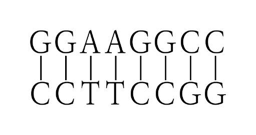
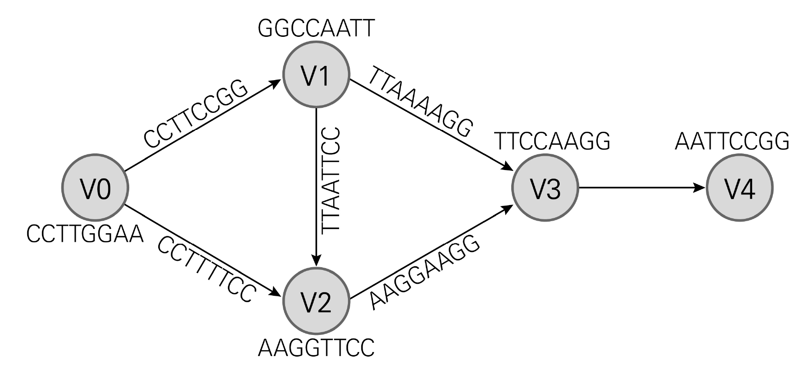

# [01-03] LU (2018)

다음 글을 읽고 물음에 답하시오.

## 제시문

전통적인 의미에서 차별은 성별, 인종, 종교, 사상, 장애, 사회적 신분 등에 따라 특정 집단을 소수자로 낙인찍고 불리하게 대우하는 것을 말한다. 일반적으로 민주 국가의 헌법 질서에는 인권 보호의 취지에서 위와 같은 사유에 따른 차별을 금지해야 한다는 가치 판단이 포함되어 있다. 이에 따라 우리 헌법도 선언적 의미에서, “누구든지 성별․종교 또는 사회적 신분에 의하여 정치적․경제적․사회적․문화적 생활의 모든 영역에 있어서 차별을 받지 아니한다.”라고 규정했다. 특히 고용과 관련된 분야는 소수자에 대한 차별의 문제가 첨예하게 대두하는 대표적인 규범 영역이다. 고용 관계에서의 차별 금지 역시 근로자의 인권 보호가 무엇보다 강조된다. 따라서 노동 시장의 공정한 경쟁과 교환 질서의 확립을 위한 정책적 목적에 의존하더라도, 근로자에 대한 인권 보호의 취지에 부합하지 않는 경우에는 근로자에 대한 차별 금지 입법은 그 정당성이 상실된다.

차별 금지 원칙 내지 평등의 개념은 고용 관계에서도 같은 것을 같게 대우해야 한다는 것이다. 다만 무엇이 같은지를 제시해 주는 구체적인 기준이 존재하지 않는 한, 차별을 금지하는 사유가 어떤 속성을 갖는지에 따라 차별 금지 원칙으로부터 근로자가 보호되는 효과는 달라질 수 있다. 즉 장애인은 그에 대한 차별 금지 법규가 존재함에도 근로의 내용과 관련된 장애의 속성 때문에 근로자로 채용되는 데 차별을 받을 수도 있다. 그리고 구체적인 고용 관계의 근로 조건이 강행 규정에 의하여 제한되는 경우와 당사자의 자유로운 의사에 의거하여 결정되는 경우 중 어디에 해당하는지에 따라, 차별 금지로 인한 근로자의 보호 정도가 달라진다. 강행 규정이 개별 근로자에 대한 임금 차별을 금지하고 있는 경우, 그 차별의 시정을 주장하는 근로자는 비교 대상자와 자신의 근로가 동등하다는 것을 증명함으로써 평등한 대우를 받을 권리를 확인받을 수 있다. 반면 개별 근로자의 임금 차이가 사용자와 근로자 사이의 자유로운 계약에 따른 것이라면, 동일 조건의 근로자에 대한 임금 차별을 금지하는 강행 규정이 없는 한, 그러한 계약이 개별 근로자에 대한 임금 차이를 정당화하는 합리적 이유가 될 수도 있다.

차별 금지 법규가 강행 규정이어서 근로자에 대한 보호가 강화되는 영역에서도, 다시 차별 금지 법규의 취지에 따라 근로자에 대한 보호 정도는 달라진다. 예를 들어, ｢남녀고용평등과 일․가정 양립 지원에 관한 법률｣에 있는 ‘남녀의 동일 가치 노동에 대한 동일 임금 지급 규정’이 사용자가 설정한 임금의 결정 요소 중 단지 여성이라는 이유로 불리하게 작용하는 임금 체계를 소극적으로 수정하기 위한 것이라면, 이는 여성에 대한 차별 금지의 보호 정도가 상대적으로 약하게 적용되는 국면으로 볼 수 있다. 반면 위 규정의 취지가 실제 시장에서 여성 노동자의 가치가 저평가되어 있음을 감안하여, 이에 대한 보상을 상향 조정함으로써 남녀 간 임금의 결과적 평등을 도모하려는 것이라면, 이는 차별 금지 원칙의 보호 정도가 강한 범주에 포함된다고 할 수 있다.

같은 근로관계라도 연령이나 학력․학벌에 따른 근로자의 차별 금지는 성별 등 전통적 차별 금지 사유들에 비하여 차별의 금지로 인한 근로자의 보호 정도가 약하다고 보아야 한다. 물론 고령자나 저학력자에 대한 차별 금지 법규나 원칙의 취지 역시 전통적인 차별 금지 사유의 취지와 다를 바 없다. 그러므로 특정 연령대의 근로자를 필요로 하는 사용자의 영업 활동을 과도하게 제한하지 않는 한, 노동 시장의 정책적 목적을 달성하기 위하여 차별 금지 법규를 제정하는 것은 가능하다. 그러나 연령에 따른 노동 능력의 변화는 모든 인간이 피할 수 없는 운명이므로 ㉠ <u>연령을 이유로 한 차별을 금지하는 것은 정당하지 않다는 주장도</u> 있다.

## 01

윗글의 내용과 부합하는 것은?

### 선택지

(1) 종교적 신념의 차별을 금지하는 법규가 정당하다면 인권 보호라는 취지를 지닌다.

(2) 장애를 이유로 하는 차별의 금지는 장애의 유형이 다르더라도 보호되는 효과가 달라지지는 않는다.

(3) 사회적 신분을 이유로 하는 차별의 금지는 우리 헌법 질서에서 가치 판단의 대상에 포함되지 않는다.

(4) 성별에 대한 차별 금지 법규와 연령에 대한 차별 금지 법규는 근로자에 대한 보호의 정도가 동일하다.

(5) 여성 근로자에 대한 차별 금지 법규는 여성에 대한 차별을 소극적으로 수정하기 위한 경우에는 적용되지 않는다.

## 02

윗글을 바탕으로 추론할 때, 적절하지 <u>않은</u> 것은?

### 선택지

(1) 특정 종교를 갖고 있다는 이유로 기업에서 고용을 거부하는 것은 우리나라의 헌법 질서에 반한다.

(2) 고령의 전문직 종사자의 노동 시장 참여를 촉진할 목적으로 연령에 대한 차별 금지 법규를 제정하는 것은 가능하다.

(3) 동일 조건의 개별 근로자에 대한 임금 차별을 금지하는 강행 규정이 있더라도 당사자들이 자유롭게 계약을 한다면 임금의 차이가 정당화될 수 있다.

(4) 근로자에 대한 인권 보호의 취지 및 정책적 목적 없이 연령에 따른 차별을 획일적으로 금지하는 법규는 사용자의 영업에 대한 자유를 침해할 여지가 있다.

(5) 학력․학벌에 대한 차별 금지 법규가 인권 보호의 취지를 고려하지 않고 특정한 정책적 목적에만 의존하여 제정된 경우에는 그 정당성이 보장되지 않는다.

## 03

㉠과 부합하는 진술만을 <보기>에서 있는 대로 고른 것은?

### 보기

ㄱ. 특정 연령층에게 취업 특혜를 부여함으로써 결과적으로 60대 이상 고령자의 취업 기회를 상대적으로 제한하게 된 법규는 국민의 평등권을 침해하지 않을 것이다.

ㄴ. 사용자와 근로자가 자유로운 계약을 통해 정년을 45세로 정했다면 차별 금지 원칙을 위반하지 않을 것이다.

ㄷ. 50세를 넘은 퇴역 군인은 예비군 관련 직책을 맡을 수 없다는 법규를 제정하더라도 차별 금지 원칙에 위배되지 않을 것이다.

### 선택지

(1) ㄱ

(2) ㄴ

(3) ㄱ, ㄷ

(4) ㄴ, ㄷ

(5) ㄱ, ㄴ, ㄷ

# [04-06] LU (2018)

다음 글을 읽고 물음에 답하시오.

## 제시문

1989년 냉전 체제가 해체되면서 동유럽사, 특히 폴란드의 역사 서술은 더 복잡해졌다. 예컨대 소련-폴란드 전쟁을 거론하지 않을 만큼 강했던, ‘사회주의 모국’을 비판해서는 안 된다는 금기는 사라졌다. 미래보다 과거가 더 변화무쌍하고 예측하기 힘들다는 농담은 실로 그럴듯했다. 당시 동유럽의 ‘벨벳 혁명’은 가까운 과거에 대한 사회적 이해를 크게 바꾸었기 때문이다. ‘사회주의 형제애’라는 공식적 기억의 장막이 걷히자, 개인사와 가족사의 형태로 사적 영역에 숨어 있던 기억들이 양지로 나왔다.

이 현상은 폴란드 연대 노조의 민주화 운동이 시작된 1980년부터 지하 출판되었던 역사서들에서 이미 찾아볼 수 있다. 그 역사 해석은 다양했는데, 특히 전투적 반공주의 역사가들은 민족주의를 내세우며 사회주의가 외래 이데올로기라는 점을 강조했다. 그들은 폴란드 공산당 특히 국제주의 분파를 소련의 이익을 위해 민족을 판 배반자라고 하여 주공격 대상으로 삼았다. 이 분파 지도부의 상당수가 유대계임을 감안하면, 전투적 반공주의가 반유대주의로 이어지는 것은 자연스러웠다. 흥미롭게도 이들의 입장과 1968년을 전후한 폴란드 공산당의 공식적 입장은 공통분모를 가진다. 당시 권력을 장악한 애국주의 분파 역시 민족주의와 반유대주의를 내세웠기 때문이다. 그러나 ‘사회주의 모국’에 대한 공격을 용납할 수 없는 것은 국제주의 분파와 마찬가지였다. 그들은 반독일 감정을 키워 소련에 대한 대중적 반감을 해소하려 했다.

이 시기 ⓐ <u>공산당의 공식적 역사 서술과</u> ⓑ <u>전투적 반공주의 역사 서술을</u> 엮는 끈이 민족주의와 반유대주의였다면, 19세기부터 21세기 초까지 좌우를 막론하고 폴란드의 역사 문화를 아우르는 집단 심성은 <kbd>희생자 의식</kbd>이었다. 폴란드 낭만주의가 처음 내세운 ‘십자가에 못 박힌 민족’이라는 이미지는 폴란드 인이 공유하는 역사 문화 코드였다. 그리고 이차 대전에서 독일의 침공에 의해 오백여만 명이 희생된 사실은 이 의식을 강화했다. 하지만 그 중 삼백여만 명이 유대계였다는 것은 공식적으로 언급되지 않았다.

이 코드가 본격적으로 흔들린 분기점은 2000년의 스톡홀름 선언이었다. 여기에 참여한 유럽 정상들은 홀로코스트 교육의 의무화에 합의했고, 이는 동유럽 국가들이 나토에 가입하는 전제 조건이 되었다. 이 시기 동유럽에서 때늦은 홀로코스트 책임론이 제기된 것도 이와 무관하지 않다. 동유럽 국가들은 나토와 유럽연합에 가입함으로써 서구화를 추진했다. 정치적 서구화는 문화적 서구화를 낳고, 문화적 서구화는 역사학의 경우 전 유럽적 기억의 공간에 과거를 재배치하는 것을 의미했다. 이를 전통적인 역사 서술 단위인 민족과 국가를 넘어선다는 의미에서 ⓒ <u>‘트랜스내셔널 역사 서술’이라고</u> 부를 수 있다. 이제 트랜스내셔널 역사와 충돌하는 민족적, 국가적 기억은 재구성되거나 수정되어야 했다.

폴란드의 경우, 일방적으로 희생당했다는 의식이 재검토되어야 했다. 나치 점령 당시 폴란드 인의 협력이나 방관, 유대인에 대한 공격 등은 어느 정도 자발적이었기 때문이다. 실제로 아우슈비츠 등지에서의 유대인 희생은 공산 정권 시기에 비판적 자기 성찰의 계기는 고사하고 아예 ‘말소된 기억’이었다. 유대인의 비극을 강조하다가 다른 이들의 고통을 소홀히 할 수 있다는 것이 한 가지 구실이었고, 일부 서구 자본가들의 나치 지지가 더 중요하다는 것이 또 다른 구실이었다. 더구나 빨치산의 반파시즘 투쟁을 강조하는 데 홀로코스트 가담 혹은 방관 문제는 방해가 되는 주제였다.

그러나 폴란드에서 과거에 대한 자기반성이 자동적으로 나타나지는 않았다. 1941년 같은 마을에 살았던 유대인들을 폴란드 인 주민들이 학살했던 사건을 다룬 『이웃들』이 2000년에 출간되자, 민족의 명예가 손상되었다고 느낀 민족주의자들의 분노가 확산되었다. 그리고 학살의 주체가 나치 비밀경찰이었다거나, 생존자의 증언만으로는 신뢰성이 부족하다는 등의 민족주의에 입각한 반론들이 나타났다. 이와 함께 독일 극우파들이 연합군의 독일 민간인 폭격 등을 역사적 맥락에서 분리하여 강조함으로써 민족주의를 정당화할 때마다, 역설적으로 폴란드에서의 자기 성찰은 약화되었다. 상충하는 민족적 기억들이 적대적 갈등 관계를 유지함으로써 서로의 존재 이유를 정당화해 주는 ‘민족주의의 적대적 공존 관계’가 형성되었던 것이다.

## 04

윗글에 대한 이해로 가장 적절한 것은?

### 선택지

(1) 1960년대 후반에 폴란드가 소련에 대한 반감을 반독일 감정으로 해소하려 한 것은 ‘민족주의의 적대적 공존 관계’를 보여 주는 사례이다.

(2) 1980년대에 나타난 폴란드의 다양한 역사 해석은 냉전 체제가 해체되면서 일원화되었다.

(3) 1980년대 말의 벨벳 혁명을 계기로 폴란드 역사 서술에서는 소련과의 관계 재설정이 본격화되었다.

(4) 1989년 이후에도 사회주의 종주국에 대한 폴란드의 신뢰 관계는 나토 가입 시기까지 이어졌다.

(5) 2000년에 출간된 『이웃들』에 대한 폴란드 민족주의자들의 반응은 전 유럽적 기억 공간으로의 기억 재배치 작업이 완료되었음을 보여 준다.

## 05

<kbd>희생자 의식</kbd>에 대한 글쓴이의 견해로 적절하지 <u>않은</u> 것은?

### 선택지

(1) 폴란드 인은 ‘희생자 의식’을 벗어나 비판적으로 자기 성찰을 해야 한다.

(2) 전투적 반공주의 역사가들은 지하 출판한 역사서를 통해 ‘희생자 의식’을 전복하려 했다.

(3) ‘희생자 의식’을 수정하기 위해서는 나치에 대한 자발적 협력을 역사 서술의 대상으로 삼아야 한다.

(4) 이차 대전 시기의 폴란드 인의 희생 중 과반수가 유대계였다는 사실의 공표는 ‘희생자 의식’을 약화시킬 수 있었다.

(5) 19세기와 20세기의 폴란드 인의 정서적 기저에는 자신들이 ‘십자가에 못 박힌 민족’이라는 ‘희생자 의식’이 자리 잡고 있었다.

## 06

윗글을 바탕으로 <보기>의 사건들에 대한 ⓐ～ⓒ의 서술 방향을 추론한 것으로 가장 적절한 것은?

### 보기

㉠ 1943년 나치 점령 하에 있던 폴란드 바르샤바의 유대인 게토에서 나치에 저항하는 봉기가 일어났다.

㉡ 1979년 폴란드 출신 교황이 비르케나우 강제수용소 자리에서 미사를 집전한 것을 계기로 1984년 가스 저장실 터의 끝자락에 세운 카르멜 수도원은 폴란드 국민의 자부심의 장소가 되었다.

### 선택지

(1) ⓐ는 국제주의 분파와의 협력이 필요하다고 보아, 유대계 폴란드 인이 ㉠에서 나치에 대한 투쟁을 선도했다고 서술했을 것이다.

(2) ⓑ는 강제수용소 자리를 역사적 교육의 터로 온전히 활용해야 한다고 보아, ㉡에 대해 비판적으로 서술했을 것이다.

(3) ⓒ는 홀로코스트 교육에 필요하다고 보아, ㉠의 봉기 지역이 유대인 구역이라는 점을 객관적으로 서술했을 것이다.

(4) ⓐ와 ⓒ는 모두 정치적인 이유에서 ㉠에 대해서는 사실을 왜곡하여 서술하고, ㉡에 대해서는 찬성하는 논조로 서술했을 것이다.

(5) ⓐ, ⓑ, ⓒ는 모두 역사 서술의 기본 원칙을 준수하기 위하여, ㉠, ㉡에 대해서 있는 그대로 서술했을 것이다.

# [07-09] LU (2018)

다음 글을 읽고 물음에 답하시오.

## 제시문

한 가닥의 DNA는 아데닌(A), 구아닌(G), 시토신(C), 티민(T)의 네 종류의 염기를 가지고 있는 뉴클레오티드가 선형적으로 이어진 사슬로 볼 수 있다. 보통의 경우 <그림 1>과 같이 두 가닥의 DNA가 염기들 간 수소 결합으로 서로 붙어 있는 상태로 존재하는데, 이를 ‘이중나선 구조’라 부른다. 이때 A는 T와, G는 C와 상보적으로 결합한다. 온도를 높이면 두 가닥 사이의 결합이 끊어져서 각각 한 가닥으로 된다.

<그림 1> 염기들 간 상보적 결합의 예

<이미지 포함됨>

정보과학의 관점에서는 DNA도 정보를 표현하는 수단으로 볼 수 있다. 한 가닥의 DNA 염기서열을 4진 코드로 이루어진 특정 정보로 해석할 수 있기 때문이다. 즉, ‘A’, ‘G’, ‘C’, ‘T’만을 써서 순서가 정해진 연속된 $n$개의 빈칸을 채울 때, 총 $4^n$개의 정보를 표현할 수 있고 이 중 특정 연속체를 한 가지 정보로 해석할 수 있다.

DNA로 정보를 표현한 후, DNA 분자들 간 화학 반응을 이용하면 연산도 가능하다. 1994년 미국의 정보과학자 에이들먼은 『사이언스』에 DNA를 이용한 연산에 대한 논문을 발표했고, 이로써 ‘DNA 컴퓨팅’이라는 분야가 열리게 되었다. 이 논문에서 에이들먼이 해결한 것은 정점(예: 도시)과 간선(예: 도시 간 도로)으로 이루어진 그래프에서 시작 정점과 도착 정점이 주어졌을 때 모든 정점을 한 번씩만 지나는 경로를 찾는 문제, 즉 ‘해밀턴 경로 문제(HPP)’였다. HPP는 정점의 수가 많아질수록 가능한 경로의 수가 급격하게 증가하기 때문에 소위 ‘어려운 문제’에 속한다.

DNA 컴퓨팅의 기본 전략은, 주어진 문제를 DNA를 써서 나타내고 이를 이용한 화학 반응을 수행하여 답의 가능성이 있는 모든 후보를 생성한 후, 생화학적인 실험 기법을 사용하여 문제 조건을 만족하는 답을 찾아내는 것이다. 에이들먼이 HPP를 해결한 방법을 <그림 2>의 그래프를 통해 단순화하여 설명하면 다음과 같다. <그림 2>는 V0이 시작 정점, V4가 도착 정점이고 화살표로 간선의 방향을 표시한 그래프를 보여 준다. 즉, V0에서 V1로는 갈 수 있으나 역방향으로는 갈 수 없다. 먼저 그래프의 각 정점을 8개의 염기로 이루어진 한 가닥 DNA 염기서열로 표현한다. 그리고 각 간선을 그 간선이 연결하는 정점의 염기서열로부터 취하여 표현한다. 즉, V0(&lt;CCTTGGAA&gt;)에서 출발하여 V1(&lt;GGCCAATT&gt;)에 도달하는 간선의 경우는 V0의 뒤쪽 절반과 V1의 앞쪽 절반을 이어 붙인 염기서열 &lt;GGAAGGCC&gt;의 상보적 코드 &lt;CCTTCCGG&gt;로 나타낸다. 이렇게 6개의 간선 각각을 DNA 코드로 표현한다.

<그림 2> 정점 5개로 구성된 그래프

<이미지 포함됨>

이제 DNA 합성 기술을 사용하여 이들 코드를 종류별로 다량 합성한다. 이들을 하나의 시험관에 넣고 서로 반응을 시키면 DNA 가닥의 상보적 결합에 의한 이중나선이 형성되는데, 이것을 ‘혼성화 반응(hybridization)’이라 한다. 혼성화 반응의 결과로 경로, 즉 정점들의 연속체가 생성된다. 시험관 안에는 코드별로 막대한 수의 DNA 분자들이 있기 때문에, 이들 사이의 이러한 상호 작용은 대규모로 일어난다. ㉠ <u>이상적인 실험을 가정한다면, 혼성화 반응을 통해 &lt;그림 2&gt; 그래프의 가능한 모든 경로에 대응하는 DNA 분자들이 생성된다.</u> 경로의 예로 (V0, V1), (V1, V2), (V0, V1, V2) 등이 있다. 이와 같이 생성된 경로들로부터 해밀턴 경로를 찾아 나가는 절차는 다음과 같다.

[1단계] V0에서 시작하고 V4에서 끝나는지 검사한 후, 그렇지 않은 경로는 제거한다.

[2단계] 경로에 포함된 정점의 개수가 5인지 검사한 후, 그렇지 않은 경로는 제거한다.

[3단계] 경로에 모든 정점이 포함되었는지 검사한다.

[4단계] 지금까지의 과정을 통해 취한 경로들이 문제에 대한 답이라고 결정한다.

에이들먼은 각 단계를 적절한 분자생물학 기법으로 구현했다. 그런데 DNA 분자들 간 화학 반응은 시험관 내에서 한꺼번에 순간적으로 일어난다는 특성을 갖고 있다. 요컨대 에이들먼은 기존 컴퓨터의 순차적 연산 방식과는 달리, 대규모 병렬 처리 방식을 통해 HPP의 해결 방법을 제시한 것이다. 이로써 DNA 컴퓨팅은 기존의 소프트웨어 알고리즘이나 하드웨어 기술로는 불가능했던 문제들의 해결에 대한 잠재적인 가능성을 보여 주었다.

## 07

DNA 컴퓨팅에 대한 설명으로 적절하지 <u>않은</u> 것은?

### 선택지

(1) 창시자는 미국의 정보과학자 에이들먼이다.

(2) DNA로 정보를 표현하고 이를 이용하여 연산을 하는 것이다.

(3) 기본적인 해법은 가능한 모든 경우를 생성한 후, 여기서 답이 되는 것만을 찾아내는 것이다.

(4) 기존 컴퓨터 기술의 발상을 전환하여 분자생물학적인 방법으로 접근함으로써 정보 처리 방식의 개선을 모색했다.

(5) DNA 컴퓨팅을 이용하여 HPP를 풀 때, 간선을 나타내는 DNA의 염기 개수는 정점을 나타내는 DNA의 염기 개수의 두 배다.

## 08

㉠에 대한 설명으로 적절하지 <u>않은</u> 것은?

### 선택지

(1) (V1, V2, V3, V4)는 정점이 네 개이지만, 에이들먼의 해법 [1단계]에서 걸러진다.

(2) V3에서 V4로 가는 간선으로 한 가닥의 DNA &lt;TTCCTTAA&gt;가 필요하다.

(3) 정점을 두 개 이상 포함하고 있는 경로는 두 가닥 DNA로 나타내어진다.

(4) 정점을 세 개 포함하고 있는 경로는 모두 네 개이다.

(5) 해밀턴 경로는 (V0, V1, V2, V3, V4)뿐이다.

## 09

<보기>의 ⓐ에 대한 설명으로 적절한 것만을 있는 대로 고른 것은?

### 보기

DNA 컴퓨팅의 실용화를 위해서는 여러 기술적인 문제점들을 해결해야 한다. 그중 하나는 정보 처리의 정확도다. DNA 컴퓨팅은 화학 반응에 기반을 두는데, ⓐ <u>반응 과정상 오류가</u> 발생할 경우 그릇된 연산을 수행하게 된다.

ㄱ. ⓐ가 발생하지 않는다면, <그림 2> 그래프에서는 에이들먼의 [3단계]가 불필요하다.

ㄴ. 혼성화 반응에서 엉뚱한 분자들이 서로 붙는 것을 방지할 수 있도록 DNA 코드를 설계하는 것은 ⓐ를 최소화하기 위한 방법이다.

ㄷ. DNA 컴퓨팅의 원리를 적용한 소프트웨어를 개발하면, ⓐ를 방지하면서도 대규모 병렬 처리를 통한 문제 해결이 기존 컴퓨터에서 가능하다.

### 선택지

(1) ㄱ

(2) ㄴ

(3) ㄱ, ㄴ

(4) ㄱ, ㄷ

(5) ㄴ, ㄷ

# [10-12] LU (2018)

다음 글을 읽고 물음에 답하시오.

## 제시문

예이츠는 어느 편지에서 “내게 지상 목표는 비극 한가운데서 사람을 환희하게 만드는 신념과 이성에서 우러나오는 행위”라고 하면서, “동양은 언제나 해결이 있고, 그러므로 비극에 대해선 아무것도 모르오. 영웅적인 절규를 발해야 하는 것은 우리지 동양은 아니오.”라고 말한 바 있다. 이러한 대조는 기실 동서 양분론에 기초를 둔 흔한 관념 이상의 것은 아니다. 이 대조가 어떤 진실을 담고 있음을 인정하면서도 우리는 예이츠의 견해를 다시 검토할 필요가 있는 것이다. 근대 한국시의 몇몇 순간들은 <kbd>비극적 황홀</kbd>을 볼 수 있는 예이츠의 만년의 시 ｢유리｣에 비길 만하기 때문이다.

햄릿과 리어는 즐겁다
두려움을 송두리째 변모시키는 즐거움
모든 사람들이 노리고 찾고 그리곤 놓쳤다
암흑, 머릿속으로 타들어 오는 천국
비극이 절정에 달할 때

근대 한국시사에서 황매천과 이육사와 윤동주가 보여주는 비극적 황홀의 순간들은 그들이 상황에 참여한 방식에 따라 그 성격이 다소 다르다. 유생이며 전통적 원칙주의자인 황매천은 소극적 저항의 삶을 살면서 비극적인 최후를 선택한다. 그는 일제의 국권강탈에 항거하여, “난리를 겪어 나온 허여센 머리 / 죽재도 못 죽는 게 몇 번이더뇨. / 오늘에는 어찌할 길이 없으니 / 바람 앞의 촛불이 창공 비추네.”라는 절명시를 남기고 자결했다. ‘바람 앞의 촛불’의 이미지로 자신이 성취한 비극적 황홀의 순간을 표현했던 것이다.

어려서 한학을 배운 이육사의 시는 겉으로는 형식적인 균형과 절제에 바탕을 둔 고전적인 풍격을 보여준다. 동시에 그의 시는 현대적인 혁명가로서의 이상주의를 품고 있다. 혁명가로서의 삶을 가장 힘차게 나타낸 작품 ｢절정｣에서 시인은 자신이 부딪치게 된 식민지 상황을 한계상황으로 표현한다. 시인은 자신이 비극 한가운데 놓여 있음을 깨닫고 ‘겨울’ 즉 ‘매운 계절’을 ‘강철로 된 무지개’로 본 것이다. 이 비극적인 비전은 또 하나의 비극적 황홀의 순간을 나타내거니와 여기서 우리는 시인이 자기가 놓인 상황에서 거리를 두고 하나의 객관적인 이미지를 발견함을 본다.

기독교 집안에서 자란 윤동주는 비록 비극적인 종말을 맞기는 했지만, 황매천처럼 가차 없는 비평가도 아니었고, 이육사처럼 두려움을 모르는 투사도 아니었다. 그 대신 그는 자신의 시대를 괴롭게 살다 죽어간 외롭고 양심적인 문학도였다. 그의 생애의 수동적인 외관과는 달리 그는 그리스도와 같은 죽음을 일종의 황홀 가운데서 꿈꿀 정도로 민족주의적이었다. 그의 소원이 실현될 때까지 “모가지를 드리우고 / 꽃처럼 피어나는 피”(｢십자가｣)를 흘림으로써 비극적인 상황에서 놓여나기까지 때를 기다리는 것이다.

그러나 이 시인들의 비극적인 비전은 공통된 특징을 가지고 있다. 그 비전은 사유와 관조 또는 명상의 산물이었다. 말을 바꾸면 그것은 시인이 상황을 객관적으로 바라봄으로써 얻은 충분히 자각된 비전이다. 그런데 이것을 가능케 한 것은 동양인의 정신에 특유한 초연함과 달관의 상태로 생각된다. 동양에서 비극적인 순간은 흔히 주인공의 신념에 찬 행위보다 초연한 관조 속에서 드러났던 것이다. 예이츠가 생각한 것처럼 동양에는 비극이 없는 것이 아니라 서양처럼 열정적이거나 야단스럽지는 않을지라도 그 나름의 비극을 가지고 있는 셈이다.

우리가 다룬 모든 시인에게 공통된 또 하나의 특징은 시인이 그러한 비극적 순간의 작자일 뿐만 아니라 그들 자신이 비극의 주인공이라는 점이다. 이것은 동양에 있어서 시의 전통적인 개념 및 성질과 무관하지 않은 듯하다. 중국에서 시에 관한 오래된 정의는 ‘마음속에 있는 바의 발언’, 즉 ㉠ <u>‘언지(言志)’이다.</u> 이러한 뜻에서의 시는 작품과 시인 사이의 구별을 용납하지 않는 개인적이며 서정적인 시이다. 허구로서의 ‘포에시스’의 개념과는 반대로 동양에서 시는 시인 자신의 삶과 하나가 되어 있었다. 그것은 전통적으로 수양의 일부이며 내면생활의 직접적인 음성으로 생각되었다.

그러므로 동양에서는 비극이 허구적인 세계에 형상화된 경우로 존재하지 않고, 비극이 있다면 시인 자신이 주인공이 되는 비극으로 존재한다. 이것은 분명 예이츠가 만년에 시적 계획으로뿐만 아니라 또한 개인적인 이상으로서 매우 골몰했던 바이다. 그것은 그의 ‘지상 목표’였으며, 그가 “모든 사람들이 노리고 찾고 그리곤 놓쳤다”라고 말하고 있는 것으로 보아 지극히 달성하기 어려운 목표이기도 했다. 그러나 우리가 살펴 본 세 사람의 한국 시인들은 이 어려운 이상을 그들의 삶과 시에서 실현했으며, 적어도 황매천과 이육사의 경우 그들의 비극적 황홀의 시적 가치는 기이하게도 예이츠의 인식과 흡사했다.

## 10

윗글의 내용과 일치하는 것은?

### 선택지

(1) 황매천은 시대 현실에 초연한 덕분에 시적 성취에 성공했다.

(2) 이육사는 전통적인 것과 현대적인 것의 갈등을 자신의 한계상황으로 인식했다.

(3) 황매천과 이육사는 예이츠가 추구했던 시적 계획을 실제 삶에서 구현했다.

(4) 황매천과 윤동주는 원칙과 신념에 따라 능동적으로 죽음을 맞이했다.

(5) 황매천, 이육사, 윤동주는 모두 종교로 인해 빚어지는 내적 갈등을 창작에 담아냈다.

## 11

㉠에 대한 설명으로 가장 적절한 것은?

### 선택지

(1) 시를 시인의 도야된 인격을 담는 언어적 구성물로 본다.

(2) 시를 시인의 개인적인 서정을 담은 허구적 표현물로 본다.

(3) 시를 현실을 초월하려는 시인의 의지를 표현한 정신적 생산물로 본다.

(4) 시를 세련된 언어를 통해 독자들에게 즐거움을 주는 심미적 구조물로 본다.

(5) 시를 시인이 살고 있는 현실을 사실적으로 형상화한 문화적 창조물로 본다.

## 12

<kbd>비극적 황홀</kbd>에 대한 글쓴이의 입장으로 가장 적절한 것은?

### 선택지

(1) 시인의 비극적 삶은 시에서의 비극적 황홀에 도달하기 위한 필수 조건이다.

(2) 비극적 황홀은 작품 속에 등장하는 주인공의 삶 외에 작품을 창작하는 작자의 삶에서도 발견할 수 있다.

(3) 비극적 상황에 놓인 주인공의 비극적 황홀을 통해 독자들의 현실 참여를 이끌어내는 것이 이상적인 서정시이다.

(4) 비극적 황홀은 주인공의 신념에 찬 행위에 바탕을 두고 있기 때문에 상황에 대한 관조만으로는 도달할 수 없다.

(5) 햄릿이나 리어 같은 주인공이 도달한 비극적 황홀은 절망적 상황을 극적으로 해결함으로써 얻어지는 체험이다.

# [13-15] LU (2018)

다음 글을 읽고 물음에 답하시오.

## 제시문

서양 근대 윤리학에서 칸트의 도덕 철학과 헤겔의 윤리 이론은 각기 도덕성과 인륜성의 개념으로 대표되며 오늘날에도 여전히 논란거리를 제공하고 있다.

이 가운데 칸트의 도덕 철학이 갖는 우선적 목표는 ‘보편도덕’을 확립하는 것이다. 그는 신과 같은 초월적 존재의 권위에 기대지 않고, 인간 존재에게 ‘이성’이 그 자체로 이미 주어졌다는 사실에 의거하여 ‘보편도덕’을 세운다. 그는 인간과 도덕으로부터 ㉠ <u>경험 세계의 모든 우연적 요소들을</u> 제거한다. 인간이 피와 살을 가진 물리적 세계의 존재이고, 감정이나 취향과 같은 경향성을 가지며, 다른 사람들과 함께 살아가는 존재라는 사실을 모두 소거한다. 이로써 인간이 이성적 존재라는 단 하나의 사실에 초점을 맞춘다. ‘이성’ 이외에 그 어떤 것도 필요로 하지 않는 ‘의지’의 개념을 도출하고 그것을 ‘이성적 의지’라고 부른다. 이성적 의지는 순수한 의지이며 자유로운 의지이자 자율적 의지이다. 여기서 자유란 스스로 법칙을 제정하고 동시에 자신이 제정한 법칙에 스스로 예속되는 ‘자기입법’과 ‘자기예속’으로서 ‘자율’의 능력을 의미한다. 그리고 행위를 강제하는 의무는 ㉡ ‘법칙에 대한 존경으로부터 생겨난 행위의 필연성’에서 비롯하며, 도덕적 행위의 유일한 판단 기준이 된다.

‘이성적 주체’로서 개인은 인류 전체를 대표하고 나아가서 모든 이성적 존재를 대변할 수 있는 ‘자기 완결적’ 존재이고, 그의 주관적 행위 원리인 준칙이 도덕 세계의 필연적 보편 법칙이 됨으로써 ㉢ <u>도덕적 주체가</u> 된다. 칸트는 도덕 원리이자 의무를 ㉣ <u>‘정언명법’이라</u> 부르며 다음과 같이 정식화한다. “네 의지의 준칙이 동시에 보편적 입법의 원리로서 타당하도록 행위하라.” 이에 따르면 도덕성의 핵심은 ㉤ <u>‘보편화 가능성’에</u> 있다.

헤겔은 칸트의 도덕성 개념을 <kbd>비판</kbd>하며 ‘윤리적 삶’의 가치를 높이 평가한다. 윤리적 삶은 진정한 자유의 실현이며, 이는 끝없이 전진하는 자기의식이 도달하는 지점이다. 도덕적 질서와 달리 윤리적 질서는 실재하는 내용을 지닌다. 그리하여 추상적인 또는 형식적인 이성의 원리에 기초하여 무엇이 의무인지 결정할 수 없는 어려움이 윤리의 수준에서는 사라진다. 가족이나 시민사회, 국가와 같은 윤리적 공동체에 참여한다는 것은, 인간 본성의 이성적인 본질이 외적으로 실현되는 것이며, 이 공동체의 구성원으로서 특정 역할을 받아들여 그에 따른 의무와 책임을 인정하게 됨을 의미한다. 그리고 각자가 지닌 특수한 의지가 보편적 의지로서의 윤리적 질서와 일치하게 됨을 확인하기만 하면, 윤리적 질서 안에서 의무와 권리는 하나가 되어 의무는 더 이상 강제가 아니게 된다.

헤겔은 윤리적 삶의 영역을 ⓐ <u>인륜</u>이라 부른다. 인륜이 발전하는 계기는 세 단계로 이루어진다. 첫 번째 단계는 가족이다. 개인은 가족을 통해서 윤리적 삶으로 들어간다. 가족 안에서 개체성에 대한 자기의식을 비로소 얻게 되며 독립적인 개인이 아니라 가족의 한 구성원임을 알게 되고, 부부 간 그리고 부모와 자식 간에 존재하는 권리와 의무를 받아들이게 된다. 두 번째 단계는 시민사회이다. 시민사회는 스스로 존재하는 개인들의 필요에 따른 연합과 법률적 체계화 그리고 그들의 특수한 공통 이익을 얻기 위한 외적인 조직체를 통해서 발생한다. 개인은 자기 자신의 실재하는 정신이 시민사회 안에 구체화되어 있음을 발견할 때, 일정 수준의 자유에 도달한다. 시민사회에서 개인은 각자의 사회적 지위에 따라 특수하게 구체화된 존재이지만, 법적 체계에서는 모두 동등한 권리를 지닌 존재이다. 세 번째 단계는 국가이다. 개인의 개체성과 특수한 관심은 자신의 완전한 발전의 성취와 권리의 분명한 인식을 추구한다. 이와 함께 개인은 자기 이익을 넘어서서 보편의 이익과 일치하려 하며, 보편을 인식하고 의욕하려 한다. 개인이 국가 안에서 진정한 개체성을 지니고 보편을 자기 자신의 실재하는 정신으로 인식하며 보편을 자신의 목표로 간주하여 적극적으로 추구할 때, 국가란 그에게 자유의 실현이 된다.

## 13

㉠～㉤에 관한 설명으로 가장 적절한 것은?

### 선택지

(1) ㉠을 제거하기 위해 도덕적 주체는 개인적 취향, 전통과 관행, 추론 능력과 무관하게 도덕 법칙을 정초한다.

(2) ㉡에 따른 행위란 이성의 요구에 따라 우리가 하여야 할 바를 행하는 것으로 이런 행위만 진정한 도덕적 행위가 된다.

(3) ㉢은 외부의 사건이나 다른 행위자가 원인이 되어 행위를 하지 않으며 자신의 경향성을 행위의 동기로 한다.

(4) ㉣은 ‘네가 어떤 목적을 성취하고 싶다면 그 목적에 맞는 수단으로 행위하면 된다’는 뜻이다.

(5) ㉤을 통해 초월적 존재에 의해 선험적으로 주어진 권위로부터 행위의 도덕성이 확보된다.

## 14

<kbd>비판</kbd>의 내용으로 적절하지 <u>않은</u> 것은?

### 선택지

(1) 이성의 형식에만 호소하기에 이성의 내용을 실질적으로 갖추지 못하고 있다.

(2) 도덕 원리를 구성할 때 의무와 권리를 함께 고려하지 않고 일방적으로 의무를 부각하고 있다.

(3) 인간의 자유를 이성적 존재의 보편성으로 한정하여 윤리적 삶의 구체적인 자유를 설명하지 못하고 있다.

(4) 인간에게 본성으로 주어진 이성 능력을 발휘하여 보편의지를 함양하는 과정에 논증이 편중되어 균형을 잃고 있다.

(5) 고립적인 자기동일성의 차원에 머무름으로써 윤리적 삶의 각 단계를 거쳐 자기의식에 도달하는 자아 형성의 가능성을 도외시하고 있다.

## 15

ⓐ에 대한 설명으로 적절하지 <u>않은</u> 것은?

### 선택지

(1) 가족의 단계에서 자녀들은 양육될 권리를 지닌다.

(2) 시민사회의 단계에서 모든 구성원들의 사회적 지위는 동등하다.

(3) 국가의 단계에서 개체성은 사유와 구체적 현실 모두에서 보편성으로 통일된다.

(4) 시민사회보다 국가에서 개인의 자유는 고양된 형태로 구현된다.

(5) 가족, 시민사회, 국가는 이성이 외적으로 발현되는 단계들을 나타낸다.

# [16-18] LU (2018)

다음 글을 읽고 물음에 답하시오.

## 제시문

일반적이고 추상적인 형태의 법을 개별 사례에 적용하려 한다면 이른바 해석을 통해 법의 의미 내용을 구체화하는 작업이 필요하다. 어떤 새로운 사례가 특정한 법의 규율을 받는지 판단하기 위해서는 선례들, 즉 이미 의심의 여지없이 그 법의 규율을 받는 것으로 인정된 사례들과 비교해 볼 필요가 있는데, 그러한 비교 사례들을 제공할 뿐 아니라 구체적으로 어떤 비교 관점이 중요한지를 결정하는 것도 바로 <kbd>해석</kbd>의 몫이다.

넓은 의미에서는 법이 명료한 개념들로 쓰인 경우에 벌어지는 가장 단순한 법의 적용조차도 해석의 결과라 할 수 있지만, 일반적으로 문제 되는 것은 법이 불확정적인 개념이나 근본적으로 규범적인 개념, 혹은 재량적 판단을 허용하는 개념 등을 포함하고 있어 그것의 적용이 법문의 가능한 의미 범위 내에서 이루어지고 있는지 여부가 다투어질 경우이다. 그러한 범위 내에서 이루어지는 해석적 시도는 당연히 허용되지만, 그것을 넘어선 시도에 대해서는 과연 그 같은 시도가 정당화될 수 있는지를 따로 살펴봐야 한다. 하지만 언어가 가지는 의미는 고정되어 있는 것이 아니기 때문에, 애초에 법문의 가능한 의미 범위라는 것은 존재하지 않는다고 볼 수도 있다. 따라서 그것을 기준선으로 삼아, 당연히 허용되는 ‘법의 발견’과 별도의 정당화를 요하는 이른바 ‘법의 형성’을 구분 짓는 태도 또한 논란으로부터 자유롭다고 말할 수는 없다. 더욱이 가장 단순한 것에서 매우 논쟁적인 것까지 모든 법의 적용이 해석적 시도의 결과라는 공통점을 지니고 있는 한, 기준선의 어느 쪽에서 이루어지는 것이든 법의 의미 내용을 구체화하려는 활동의 본질에는 차이가 없을 것이다.

예컨대 법의 발견과 형성 과정에서 동일하게 법의 축소와 확장을 두고 고민하게 된다. 이를 통해서 특정 사례에 그 법의 손길이 미치는지 여부가 결정될 것이기 때문이다. 다만 그것이 법문의 가능한 의미 범위 내에서 이루어지는 경우와, 법의 흠결을 보충하기 위해 불가피하게 그 범위를 넘어서는 경우의 구분에 좀 더 주목하는 견해가 있을 뿐이다. 이렇게 보면 결국 법의 적용을 위한 해석적 시도란 법문의 가능한 의미 범위 안팎에서 법을 줄이거나 늘림으로써 그것이 특정 사례를 규율하는지 여부를 정하려는 것이라 할 수 있다.

흥미로운 점은 ㉠ <u>법의 축소와 확장</u>이라는 개념마저 그다지 분명한 것이 아니라는 데 있다. 특히 형벌 법규와 관련해서는 가벌성의 범위가 줄어들거나 늘어나는 것을 가리킬 경우가 있는가 하면, 법규의 적용 범위가 좁아지거나 넓어지는 것을 지칭할 경우도 있다. 혹은 법문의 의미와 관련하여 언어적으로 매우 엄격하게 새기는 것을 축소로 보는가 하면, 명시되지 않은 요건을 덧붙이게 되는 탓에 확장이라 일컫기도 한다. 한편 이른바 법의 실질적 의미에 비추어 시민적 자유와 권리에 제약을 가하거나 법적인 원칙에 예외를 두는 것을 축소로 표현하기도 하며, 학설에 따라서는 입법자의 의사나 법 그 자체의 목적과 비교함으로써 축소와 확장을 판정하기도 한다.

가령 법은 단순히 ‘자수를 하면 형을 면제한다’라고만 정하고 있는데, 이를 ‘범행이 발각된 후에 수사기관에 자진 출두하는 것은 자수에 해당하지 않는다’라고 새기는 경우를 생각해 보자. 그러한 해석적 시도는 가벌성을 넓힌다는 점에서는 확장이지만, 법규의 적용 범위를 좁힌다는 점에서는 축소에 해당한다. 한편 자수의 일차적이고도 엄격한 의미는 ‘범행 발각 전’의 그것만을 뜻한다고 할 수 있다면, 그와 같은 측면에서는 법문의 의미를 축소하는 것이지만, 형의 면제 요건으로 단순히 자수 이외에 ‘범행 발각 전’이라고 하는 명시되지 않은 요소를 추가하여 법문의 의미를 파악하고 있는 점에서는 확장이다. 나아가 형의 면제 기회가 줄어드는 만큼 시민적 자유의 제약을 초래한다는 점에서는 축소이지만, 자수를 통한 형의 면제가 어디까지나 자신의 행위 결과에 대하여 책임을 져야 한다는 대원칙의 예외에 불과하다면, 그와 같은 예외의 폭을 줄이고 원칙으로 수렴한다는 점에서는 확장이라 말할 수 있다.

이렇듯 법의 해석과 적용을 인도하는 주요 개념들, 즉 법문의 가능한 의미 범위 및 그 안팎에서 시도되는 법의 축소와 확장은 대체로 정체가 불분명할 뿐 아니라 그 존재론적 기초를 의심받기도 하지만, 여전히 많은 학설과 판례가 이들의 도구적 가치를 긍정하고 있다. 그것은 규범적 정당성과 실천적 유용성을 함께 추구하는 법의 논리가 법적 사고의 과정 자체에 남긴 유산인 것이다.

## 16

<kbd>해석</kbd>에 관한 윗글의 입장과 일치하는 것은?

### 선택지

(1) 법의 발견과 법의 형성 사이에 본질적인 차이는 없다.

(2) 법의 해석은 법의 흠결을 보충하는 활동에서 비롯한다.

(3) 법문의 가능한 의미 범위를 넘어선 해석적 시도는 정당화될 수 없다.

(4) 법문이 명료한 개념들로만 쓰인 경우라면 해석이 개입할 여지가 없다.

(5) 법이 재량적 판단을 허용하는 개념을 도입함으로써 해석적 논란을 차단할 수 있다.

## 17

윗글을 바탕으로 <보기>의 견해를 평가한 것으로 적절하지 <u>않은</u> 것은?

### 보기

엄밀히 말해서 모든 면에서 동일한 두 사례란 있을 수 없다. 다양한 사례들은 서로 어떤 면에서는 유사하지만, 다른 면에서는 그렇지 않다. 따라서 법관이 참조하는 과거의 유사 사례들 중 해결해야 할 새로운 사례와 동일한 사례는 어떤 것도 없으며, 심지어 제한적인 유사성 탓에 서로 상반된 해결 지침을 제시하기 일쑤다. 법관의 역할이란 결국 어느 유사 사례가 관련성이 더 높은지를 정하는 데 있으며, 사례 비교를 통한 법의 구체화란 과거의 유사 사례들로부터 새로운 사례에 적용할 지혜를 빌리는 일일 뿐이다. 진정한 의미에서 법관을 구속하는 선례는 없으며, 법의 해석이라는 것은 실상 유추에 불과한 것이다.

### 선택지

(1) 법의 발견에 대해 추가적 정당화를 요구하고 있다.

(2) 법관의 임의적인 법 적용을 사실상 허용하고 있다.

(3) 규범 대 사례의 관계를 사례 대 사례의 관계로 대체하고 있다.

(4) 선례로 확립된 사례들과 단순한 참조 사례들을 구별하지 않고 있다.

(5) 참조 사례들 간의 차이가 법적으로 의미가 있을지 판단하는 것은 해석의 몫임을 간과하고 있다.

## 18

<보기>의 ⓐ에서 ⓑ로의 변화에 대하여 ㉠을 판단할 때, 적절하지 <u>않은</u> 것은?

### 보기

“공공연히 사실을 적시하여 사람의 명예를 훼손한 자도, 오로지 공익을 위해 진실한 내용만을 적시했다면 처벌하지 않는다.”라는 법은 ⓐ <u>언론의 공익적인 활동을 보호하려는 취지로 제정․적용되었으나,</u> ⓑ <u>이후 점차 일반 시민들에게도 적용되는</u> 것으로 해석되어 왔다.

### 선택지

(1) 가벌성의 범위를 기준으로 삼으면, 처벌의 대상이 줄어든다는 점에서 법의 축소라고 할 수 있다.

(2) 시민적 자유의 제약 가능성을 기준으로 삼으면, 시민이 누리는 표현의 자유를 제한한다는 점에서 법의 축소라고 할 수 있다.

(3) 법규의 적용 범위를 기준으로 삼으면, 언론에서 일반 시민으로 적용 범위가 넓어진다는 점에서 법의 확장이라고 할 수 있다.

(4) 입법자가 의도했던 법의 외연을 기준으로 삼으면, 법의 보호를 받는 대상이 늘어난다는 점에서 법의 확장이라고 할 수 있다.

(5) 법문에 명시된 요건을 기준으로 삼으면, 명시되지 않은 부가 조건이 더 이상 적용되지 않는다는 점에서 법의 축소라고 할 수 있다.

# [19-21] LU (2018)

다음 글을 읽고 물음에 답하시오.

## 제시문

사람의 성염색체에는 X와 Y 염색체가 있다. 여성의 난자는 X 염색체만을 갖지만, 남성의 정자는 X나 Y 염색체 중 하나를 갖는다. 인간의 성은 여성의 난자에 X 염색체의 정자가 수정되는지, 아니면 Y 염색체의 정자가 수정되는지에 따라 결정된다. 전자의 경우는 XX 염색체의 여성으로, 후자의 경우는 XY 염색체의 남성으로 발달할 수 있게 된다.

인간과 같이 두 개의 성을 갖는 동물의 경우, 하나의 성이 성 결정의 기본 모델이 된다. 동물은 종류에 따라 기본 모델이 되는 성이 다르다. 조류의 경우 대개 수컷이 기본 모델이지만, 인간을 포함한 포유류의 경우 암컷이 기본 모델이다. ㉠ <u>기본 모델이 아닌 성은 성염색체 유전자의 지령에 의해 조절되는 일련의 단계를 거쳐, 개체 발생 과정 중에 기본 모델로부터 파생된다.</u> 따라서 남성의 형성에는 여성 형성을 위한 기본 프로그램 외에도 Y 염색체에 의해 조절되는 추가적인 과정이 필요하다. Y 염색체의 지령에 의해 생성된 남성 호르몬의 작용이 없다면 태아는 여성이 된다.

정자가 난자와 수정된 초기에는 성 결정 과정이 억제되어 일어나지 않는다. 약 6주가 지나면, 고환 또는 난소가 될 단일성선(單一性腺) 한 쌍, 남성 생식 기관인 부고환․정관․정낭으로 발달할 볼프관, 여성 생식 기관인 난관과 자궁으로 발달할 뮐러관이 모두 생겨난다. 볼프관과 뮐러관은 각기 남성과 여성 생식 기관 일부의 발생에만 관련이 있으며, 두 성을 구분하는 외형적인 기관들은 남성과 여성 태아의 특정 공통 조직으로부터 발달한다. 이러한 공통 조직이 남성의 음경과 음낭이 될지, 아니면 여성의 음핵과 음순이 될지는 태아의 발생 과정에서 추가적인 남성 호르몬 신호를 받느냐 받지 못하느냐에 달려 있다.

임신 7주쯤에 Y 염색체에 있는 성 결정 유전자가 단일성선에 남성의 고환 생성을 명령하는 신호를 보내면서 남성 발달 과정의 첫 단계가 시작된다. 단일성선이 고환으로 발달하고 나면, 이후의 남성 발달 과정은 새로 형성된 고환에서 생산되는 호르몬에 의해 조절된다. 적절한 시기에 맞춰 고환에서 분비되는 호르몬 신호가 없다면 태아는 남성의 몸을 발달시키지 못하며, 심지어 정자를 여성에게 전달하는 데 필요한 음경조차 만들어내지 못한다.

고환이 형성되고 나면 고환은 먼저 항뮐러관형성인자를 분비하여 뮐러관을 없애라는 신호를 보낸다. 이 신호에 반응하여 뮐러관이 제거될 수 있는 때는 발생 중 매우 짧은 시기에 국한되기 때문에 이 신호의 전달 시점은 매우 정교하게 조절된다. 그 다음에 고환은 남성 생식기의 발달을 촉진하기 위해 볼프관에 또 다른 신호를 보낸다. 주로 대표적인 남성 호르몬인 테스토스테론이 이 역할을 담당하는데 이 호르몬이 수용체에 결합하면 볼프관은 부고환․정관․정낭으로 발달한다. 이들은 모두 고환에서 음경으로 정자를 내보내는 데 관여하는 기관이다. 만약 적절한 시기에 고환으로부터 이와 같은 호르몬 신호가 볼프관에 전달되지 않으면 볼프관은 임신 후 14주 이내에 저절로 사라진다. 이외에도 테스토스테론이 효소의 작용에 의하여 변화되어 생긴 호르몬인 디하이드로테스토스테론은 전립선, 요도, 음경, 음낭 등과 같은 남성의 생식 기관을 형성하도록 지시한다. 형성된 음낭은 임신 후기에 고환이 복강에서 아래로 내려오면 이를 감싼다.

여성 태아에서 단일성선을 난소로 만드는 변화는 남성 태아보다 늦은 임신 3～4개월쯤에 시작한다. 이 시기에 남성의 생식 기관을 만드는 데 필요한 볼프관은 호르몬 신호 없이도 퇴화되어 사라진다. 여성 신체의 발달은 남성에서처럼 호르몬 신호에 전적으로 의존하지는 않지만, 여성 호르몬인 에스트로젠이 난소의 적절한 발달과 정상적인 기능 수행에 필수적인 요소로 작용한다고 알려져 있다.

## 19

윗글의 내용과 일치하는 것은?

### 선택지

(1) 포유류는 X 염색체가 없으면 수컷이 된다.

(2) 사람의 고환과 난소는 각기 다른 기관으로부터 발달한다.

(3) 항뮐러관형성인자의 분비는 테스토스테론에 의해 촉진된다.

(4) Y 염색체에 있는 성 결정 유전자가 없으면 볼프관은 퇴화된다.

(5) 뮐러관이 먼저 퇴화되고 난 후 Y 염색체의 성 결정 유전자에 의해 고환이 생성된다.

## 20

윗글을 바탕으로 <보기>의 ‘사람’에 대해 추론한 것으로 가장 적절한 것은?

### 보기

‘남성 호르몬 불감성 증후군’을 가진 사람은 XY 염색체를 가지고 있어 항뮐러관형성인자와 테스토스테론을 만들 수 있다. 하지만 이 사람은 남성 호르몬인 테스토스테론과 디하이드로테스토스테론이 결합하는 수용체에 돌연변이가 일어나 남성 호르몬에 반응하지 못하여 음경과 음낭을 만들지 못한다. 그리고 부신에서 생성되는 에스트로젠의 영향을 받아 음핵과 음순이 만들어져 외부 성징은 여성으로 나타난다.

### 선택지

(1) 몸의 내부에 고환을 가지고 있다.

(2) 부고환과 정관, 정낭을 가지고 있다.

(3) 난소가 생성되어 발달한 후에 배란이 진행된다.

(4) Y 염색체의 성 결정 유전자가 발현하지 않는다.

(5) 뮐러관에서 발달한 여성 내부 생식기관을 가지고 있다.

## 21

㉠의 이론을 강화하는 내용으로 볼 수 있는 것은?

### 선택지

(1) 한 마리의 수컷과 여러 마리의 암컷으로 이루어진 물고기 집단에서 수컷을 제거하면 암컷 중 하나가 테스토스테론을 에스트로젠으로 전환하는 효소인 아로마테이즈 유전자의 발현을 줄여 수컷으로 성을 전환한다.

(2) 붉은귀거북의 경우 28℃ 이하의 온도에서는 수컷만, 31℃ 이상의 온도에서는 암컷만 태어나고 그 중간 온도에서는 암컷과 수컷이 50 : 50의 비율로 태어난다.

(3) 제초제 아트라진에 노출된 수컷 개구리는 테스토스테론이 에스트로젠으로 전환되어 암컷 개구리로 성을 전환한다.

(4) 생쥐의 수컷 성 결정 유전자를 암컷 수정란에 인위적으로 삽입하면 고환과 음경을 가진 수컷 생쥐로 발달한다.

(5) 피리새 암컷에 테스토스테론을 인위적으로 투여하면 수컷처럼 노래한다.

# [22-25] LU (2018)

다음 글을 읽고 물음에 답하시오.

## 제시문

결혼을 하면 자연스럽게 아이를 낳지만, 아이들은 이 세상에 태어남으로써 해를 입을 수도 있다. 원하지 않는 병에 걸릴 수도 있고 험한 세상에서 살아가는 고통을 겪을 수도 있다. 이렇게 출산은 한 인간 존재에게 본인의 동의를 얻지 않은 부담을 지운다. 다른 인간을 존재하게 하여 위험에 처하게 만들 때는 충분한 이유를 가져야 할 도덕적 책임이 있다. 출산이 윤리적인가 하는 문제에 대해, 아이를 낳으면 아이를 기르는 즐거움과 아이가 행복하게 살 것이라는 기대가 있어 아이를 낳아야 한다고 주장하는 사람도 있고, 반면에 아이를 기르는 것은 괴로운 일이며 아이가 이 세상을 행복하게 살 것 같지 않다는 생각으로 아이를 낳지 말아야 한다고 주장하는 사람도 있다. 그러나 이것은 개인의 주관적인 판단에 따른 것이니 이런 근거를 가지고 아이를 낳는 것과 낳지 않는 것 중 어느 한쪽이 더 낫다고 주장할 수는 없다. 철학자 베나타는 이렇게 경험에 의거하는 방법 대신에 쾌락과 고통이 대칭적이지 않다는 논리적 분석을 이용하여, 태어나지 않는 것이 더 낫다고 주장하는 논증을 제시한다.

베나타의 주장은 다음과 같은 생각에 근거한다. 어떤 사람의 인생에 좋은 일이 있을 경우는 그렇지 않은 인생보다 풍요로워지긴 하겠지만, 만일 존재하지 않는 경우라도 존재하지 않는다고 해서 잃을 것은 하나도 없을 것이다. 무엇인가를 잃을 누군가가 애초에 없기 때문이다. 그러나 그 사람은 존재하게 됨으로써 존재하지 않았더라면 일어나지 않았을 심각한 피해로 고통을 받는다. 이 주장에 반대하고 싶은 사람이라면, 부유하고 특권을 누리는 사람들의 혜택은 그들이 겪게 될 해악을 능가할 것이라는 점을 들 것이다. 그러나 베나타의 반론은 선의 부재와 악의 부재 사이에 비대칭이 있다는 주장에 의존하고 있다. 고통 같은 나쁜 것의 부재는 곧 선이다. 그런 선을 실제로 즐길 수 있는 사람이 있을 수 없더라도 어쨌든 그렇다. 반면에 쾌락 같은 좋은 것의 부재는 그 좋은 것을 잃을 누군가가 있을 때에만 나쁘다. 이것은 존재하지 않음으로써 나쁜 것을 피하는 것은 존재함에 비해 진짜 혜택인 반면, 존재하지 않음으로써 좋은 것들이 없어지는 것은 손실이 결코 아니라는 뜻이다. 존재의 쾌락은 아무리 커도 고통을 능가하지 못한다. 베나타의 이런 논증은 아래 <표>가 보여 주듯 시나리오 A보다 시나리오 B가 낫다고 말한다. 결국 이 세상에 존재하지 않는 것이 훨씬 더 낫다.

<표>

| 시나리오 A : X가 존재한다 | 시나리오 B : X가 존재하지 않는다 |
|---|---|
| (1) 고통이 있음 (나쁘다) | (2) 고통이 없음 (좋다) |
| (3) 쾌락이 있음 (좋다) | (4) 쾌락이 없음 (나쁘지 않다) |

베나타의 주장을 반박하려면 선의 부재와 악의 부재 사이에 비대칭이 있다는 주장을 비판해야 한다. ㉠ <u>첫 번째 비판</u>을 위해 천만 명이 사는 어떤 나라를 상상해 보자. 그중 오백만 명이 끊임없는 고통에 시달리고 있고, 다른 오백만 명은 행복을 누리고 있다. 이를 본 천사가 신에게 오백만 명의 고통이 지나치게 가혹하다고 조치를 취해 달라고 간청한다. 신도 이에 동의하여 시간을 거꾸로 돌려 불행했던 오백만 명이 고통에 시달리지 않도록 다시 창조했다. 하지만 베나타의 논리에 따르면 신은 시간을 거꾸로 돌려 천만 명이 사는 나라를 아예 존재하지 않게 할 수도 있다. 그러나 신이 천만 명을 아예 존재하지 않게 하는 식으로 천사의 간청을 받아들이면 천사뿐만 아니라 대부분의 사람들은 공포에 질릴 것이다. 이 사고 실험은 베나타의 주장과 달리 선의 부재가 나쁘지 않은 것이 아니라 나쁠 수 있다는 점을 보여 준다. 생명들을 빼앗는 것은 고통을 제거하기 위한 대가로는 지나치게 크다.

첫 번째 비판은 나쁜 일의 부재나 좋은 일의 부재는 그 부재를 경험할 주체가 없는 상황에서조차도 긍정적이거나 부정적인 가치를 지닐 수 있다는 베나타의 전제를 받아들였지만, ㉡ <u>두 번째 비판</u>은 그 전제를 비판한다. 평가의 용어들은 간접적으로라도 사람을 언급함으로써만 의미를 지닌다. 그렇다면 좋은 것과 나쁜 것의 부재가 그 부재를 경험할 주체와는 관계없이 의미를 지닌다고 말하는 것은 무의미하고 바람직하지도 않다. 베나타의 이론에서는 ‘악의 부재’라는 표현이 주체를 절대로 가질 수 없다. 비존재의 맥락에서는 나쁜 것을 피할 개인이 있을 수 없기 때문이다.

만일 베나타의 주장이 옳다면 출산은 절대로 선이 될 수 없으며 출산에 관한 도덕적 성찰은 반드시 출산의 포기로 이어져야 한다. 그리고 우리는 이 세상에 태어나게 해 준 부모에게 감사할 필요가 없게 된다. 따라서 그 주장의 정당성은 비판적으로 논의되어야 한다.

## 22

베나타의 생각과 일치하지 <u>않는</u> 것은?

### 선택지

(1) 누군가에게 해를 끼치는 행위에는 윤리적 책임을 물을 수 있다.

(2) 아이를 기르는 즐거움은 출산을 정당화하는 근거가 되지 못한다.

(3) 태어나지 않는 것보다 태어나는 것이 더 나은 이유가 있어야 한다.

(4) 고통보다 행복이 더 많을 것 같은 사람도 태어나게 해서는 안 된다.

(5) 좋은 것들의 부재는 그 부재를 경험할 사람이 없는 상황에서조차도 악이 될 수 있다.

## 23

베나타가 ㉠에 대해 할 수 있는 재반박으로 가장 적절한 것은?

### 선택지

(1) 전적으로 고통에 시달리는 사람도, 전적으로 행복을 누리는 사람도 없다.

(2) 쾌락으로 가득 찬 삶인지 고통에 시달리는 삶인지 구분할 객관적인 방법이 없다.

(3) 삶을 지속할 가치가 있는지 묻는 것은 삶을 새로 시작할 가치가 있는지 묻는 것과 다르다.

(4) 경험할 개인이 존재하지 않는 까닭에 부재하게 된 쾌락은 이미 존재하는 인간의 삶에 부재하는 쾌락을 능가한다.

(5) 어떤 사람이 다른 잠재적 인간에게 존재에 따를 위험을 안겨 주는 문제와 어떤 사람이 그런 위험을 스스로 안는가 하는 문제는 동일한 문제가 아니다.

## 24

㉡이 <표>에 대해 생각하는 것으로 가장 적절한 것은?

### 선택지

(1) (2)와 (4) 모두 좋다고 생각한다.

(2) (2)와 (4) 모두 좋지도 않고 나쁘지도 않다고 생각한다.

(3) (2)는 좋지만 (4)는 좋기도 하고 나쁘기도 하다고 생각한다.

(4) (2)는 좋지만 (4)는 좋지도 않고 나쁘지도 않다고 생각한다.

(5) (2)는 좋기도 하고 나쁘기도 하다고 생각하지만 (4)는 나쁘다고 생각한다.

## 25

<보기>와 같은 주장의 근거로 가장 적절한 것은?

### 보기

다음 두 세계를 상상해 보자. 세계 1에는 갑과 을 단 두 사람만 존재하는데, 갑은 일생 동안 엄청난 고통을 겪고 쾌락은 조금만 경험한다. 반대로 을은 고통을 약간만 겪고 쾌락은 엄청나게 많이 경험한다. 그러나 세계 2에는 갑과 을 모두 존재하지 않는데, 그들의 고통이 없다는 것은 좋은 반면, 그들의 쾌락이 없다는 것은 나쁘지 않다. 베나타에 따르면 세계 2가 갑에게만 아니라 을에게도 언제나 분명히 더 좋다. 그러나 나는 적어도 을에게는 세계 1이 훨씬 더 좋다고 생각한다.

### 선택지

(1) 나쁜 것이라면 그것이 아무리 작아도 언제나 좋은 것을 능가할 수 있기 때문이다.

(2) 쾌락은 단순히 고통을 상쇄하는 것이 아니라 고통을 훨씬 능가할 수 있기 때문이다.

(3) 고통의 없음은 좋기는 해도 매우 좋지는 않지만 쾌락의 없음은 매우 좋기 때문이다.

(4) 인간은 고통이 쾌락에 의해 상쇄되지 않아 고통이 쾌락을 능가하는 시점이 있기 때문이다.

(5) 고통의 없음은 매우 좋지만 쾌락의 없음은 나쁘기는 해도 매우 나쁜 것은 아니기 때문이다.

# [26-29] LU (2018)

다음 글을 읽고 물음에 답하시오.

## 제시문

주어진 조건에서 자신의 이익을 최대화하는 합리적인 경제 주체들의 선택에서 출발하여 경제 현상을 설명하는 신고전파 경제학의 방법론은 오랫동안 경제학에서 주류의 위치를 지켜 왔다. 신고전파 기업 이론은 이 방법론에 기초하여 생산의 주체인 기업이 주어진 생산 비용과 기술, 수요 조건에서 이윤을 극대화하는 생산량을 선택한다고 가정하여 기업의 행동과 그 결과를 분석한다. 그런데 이런 분석은 한 사람의 농부의 행동과, 생산을 위해 다양한 역할을 담당하는 사람들이 참여하는 기업의 행동을 동일한 것으로 다룬다. 이에 대해 여러 의문들이 제기되었고 이를 해결하기 위해 다양한 기업 이론이 제시되었다.

㉠ <u>코즈</u>는 가격에 기초하여 분업과 교환이 이루어지는 시장 시스템과 권위에 기초하여 계획과 명령이 이루어지는 기업 시스템은 본질적으로 다르다고 보았다. 이 때문에 그는 모든 활동이 시장에 의해 조정되지 않고 기업이라는 위계 조직을 필요로 하는 이유를 설명해야 한다고 생각했다. 예를 들어 기업이 생산에 필요한 어떤 부품을 직접 만들어 조달할 것인지 아니면 외부에서 구매할 것인지 결정한다고 생각해 보자. 생산 비용 개념만 고려하는 신고전파 기업 이론에 따르면, 분업에 따른 전문화나 규모의 경제를 생각할 때 자체 생산보다 외부 구매가 더 합리적인 선택이다. 생산에 필요한 모든 활동에 이런 논리가 적용된다면 기업이 존재해야 할 이유를 찾기 어렵다. 따라서 기업이 존재하는 이유는 생산 비용이 아닌 ㉡ <u>거래 비용</u>에서 찾아야 한다는 것이 코즈의 논리이다.

코즈는 거래 비용을 시장 거래에 수반되는 어려움으로 정의했다. 그리고 수요자와 공급자가 거래할 의사와 능력이 있는 상대방을 만나기 위해 탐색하거나, 서로 가격을 흥정하거나, 교환 조건을 협상하고 합의하여 계약을 맺거나, 계약의 이행을 확인하고 강제하는 모든 과정에서 겪게 되는 어려움을 그 내용으로 들었다. 거래 비용이 너무 커서 분업에 따른 이득을 능가하는 경우에는 외부에서 구매하지 않고 기업 내부에서 자체 조달한다. 다시 말해 시장의 가격이 아니라 기업이라는 위계 조직의 권위에 의해 조정이 이루어진다는 것이다. 코즈가 제시한 거래 비용 개념은 시장 시스템으로만 경제 현상을 이해하지 않는 새로운 방법론의 가능성을 제공했다. 그러나 코즈의 설명은 거래 비용의 발생 원리를 명확하게 제시하지 않았고, 주류적인 경제학 방법론도 ‘권위’와 같은 개념을 수용할 준비가 되어 있지 않았다.

윌리엄슨은 거래 비용 개념에 입각한 기업 이론을 발전시키기 위해 몇 가지 새로운 개념들을 제시했다. 먼저 ‘합리성’이라는 가정을 ‘기회주의’와 ‘제한적 합리성’이라는 가정으로 대체했다. 경제 주체들은 교활하게 자기 이익을 최대화하고자 하지만, 정보의 양이나 정보 처리 능력 등의 이유로 항상 그렇게 할 수 있는 것은 아니라는 것이다. 그리고 코즈가 시장 거래라고 뭉뚱그려 생각한 것을 윌리엄슨은 현물거래와 계약으로 나누어 설명하면서 계약의 불완전성이란 개념을 제시했다. 계약은 현물거래와 달리 거래의 합의와 이행 사이에 상당한 시간이 걸린다. 그런데 제한적 합리성으로 인해 사람들은 미래에 발생할 수 있는 모든 상황을 예측할 수 없고, 예측한 상황에 대해 모든 대비책을 계산할 수도 없으며, 언어는 원래 모호할 수밖에 없다. 따라서 계약의 이행 정도를 제삼자에게 입증할 수 있는 방식으로 사전에 계약을 맺기 어렵기 때문에 통상적으로 계약에는 빈구석이 있을 수밖에 없다.

상대방이 계약을 이행하지 않을 경우에는, 그가 계약을 이행할 것이라고 신뢰하고 행했던 준비, 즉 관계특수적 투자의 가치는 떨어질 것이다. 이 때문에 윌리엄슨은 계약 이후에는 계약 당사자들 사이의 관계에 근본적인 전환이 일어난다고 말했다. 그 가치가 많이 떨어질수록, 즉 관계특수성이 클수록 계약 후에 상대방이 변화된 상황을 기회주의적으로 활용할 가능성에 대한 우려가 커져 안전장치가 마련되지 않을 경우 관계특수적 투자가 이루어지기 어렵다. 윌리엄슨은 이를 ‘관계특수적 투자에 따른 속박 문제’라고 부르고, 계약의 불완전성으로 인해 통상적인 수준의 단순한 계약을 통해서는 사전에 이 문제를 방지하기 어렵다고 보았다. 따라서 이 문제가 심각한 결과를 초래하는 경우에는 단순한 계약과는 다른 복잡한 계약을 통해 안전장치를 강구할 것이고, 그런 방식으로도 해결할 수 없다면 아예 자체 조달을 선택할 것이라고 보았다.

이렇게 본다면 안전장치가 필요 없는 거래만 존재하는 상황이 신고전파 경제학이 상정하는 세계이고, 다양한 안전장치를 고려하지 않고 기업의 자체 생산만 대안으로 존재하는 상황이 코즈가 상정하는 세계라고 할 수 있다. <kbd>윌리엄슨의 기업 이론</kbd>이 거둔 성과 덕분에 거래 비용 경제학이 서서히 경제학 방법론의 주류적 위치를 넘볼 수 있게 되었다.

## 26

㉠이 신고전파 기업 이론의 비판을 통해 해결하려고 한 의문으로 가장 적절한 것은?

### 선택지

(1) 누가 기업의 의사 결정을 담당하는 것이 바람직한가?

(2) 분석해야 할 기업의 행동에는 생산량의 선택밖에 없는가?

(3) 기업에 참여하는 모든 사람들이 기업의 이윤 극대화를 추구하는가?

(4) 왜 어떤 활동은 기업 내부에서 일어나고 어떤 활동은 외부에서 일어나는가?

(5) 다수가 참여하는 기업과 한 사람의 생산자 사이에 생산량의 차이는 없는가?

## 27

㉡에 대한 진술로 가장 적절한 것은?

### 선택지

(1) 거래량과 반비례 관계이다.

(2) 현물거래의 경우에는 발생하지 않는다.

(3) 계약 제도의 발달을 통해 줄일 수 있다.

(4) 기업 내부에서 권위의 행사에 수반되는 비용이다.

(5) 거래되는 재화의 시장 가치가 확실할수록 더 커진다.

## 28

<kbd>윌리엄슨의 기업 이론</kbd>에 대한 평가로 적절하지 <u>않은</u> 것은?

### 선택지

(1) 권위의 원천에 대한 설명을 제시하는 데까지 나아가지는 못했다.

(2) 경제 주체의 합리성을 대체하는 새로운 가정을 제시하는 수준으로 나아갔다.

(3) 현물거래와 자체 생산 이외에도 다양한 계약들이 존재하는 현실을 이해하게 해주었다.

(4) 관계특수성이나 계약의 불완전성이 큰 거래일수록 거래 비용이 적어진다는 것을 알게 해주었다.

(5) 시장 거래를 현물거래와 계약으로 구분하여 새로운 측면에서 거래 비용의 속성을 이해하게 해주었다.

## 29

윗글을 바탕으로 <보기>의 조사 결과를 해석할 때, 적절하지 <u>않은</u> 것은?

### 보기

화력 발전소의 설비는 특정 종류의 석탄에 맞춰 설계되며, 여러 종류의 석탄을 사용하려면 추가적인 건설 비용이 많이 소요된다. 한편 탄전(炭田) 근처에 발전소를 건설한 전력 회사는 송전 비용을 많이 부담해야 하고, 소비지 근처에 발전소를 세운 전력 회사는 석탄 운반 비용을 많이 부담해야 한다. 다음은 1980년대 초에 미국에서 화력 발전 전력 회사들의 석탄 조달 방법을 조사한 결과이다.

[조사 결과]

ⓐ 미국 화력 발전에 쓰인 석탄 가운데 15% 정도는 전력 회사가 자체 조달한 것이었다.

ⓑ 전체 계약 건수 가운데 1년 미만의 초단기 계약은 10%에 못 미쳤고, 1년 이상의 계약 건수 가운데 6년 이상의 장기 계약이 83%였고, 21년 이상의 계약도 34%였다.

ⓒ 특정 탄광에 접한 곳에 발전소를 건설한 경우에는 예외 없이 자체 조달 또는 복잡한 장기 계약을 통한 조달이었는데, 이 경우 평균 계약 기간은 35년, 최대 계약 기간은 50년이었다.

ⓓ ⓒ에서 복잡한 장기 계약의 경우, 품질과 가격에 관한 조건은 매우 복잡하게 설정하면서도 최소 공급 물량은 단순하게 명시했다.

### 선택지

(1) ⓐ는 탄광의 직접 경영에 따르는 문제보다 복잡한 장기 계약으로도 대처하기 어려운 문제에 대한 우려가 더 커서 거래 비용을 줄이는 방안을 모색한 결과이겠군.

(2) ⓑ에서 1년 미만의 초단기 계약은, 거래 당사자들 간의 신뢰가 형성되지 않아서 관계특수적 투자에 따른 속박이 심각한 문제를 초래할 가능성이 가장 높은 경우에 맺은 것이겠군.

(3) ⓒ는 특정 탄광으로부터 석탄을 공급받을 것을 전제하고 행한 투자의 가치가 떨어질 가능성을 우려하여 특정 탄광과의 계속적인 거래를 보장받고자 한 것이겠군.

(4) ⓓ에서 품질과 가격의 계약 조건이 복잡한 것은, 공급되는 석탄의 품질과 가격에 관련된 기회주의적 행동을 제삼자가 판단하기 어렵다고 우려했기 때문이겠군.

(5) ⓓ에서 최소 공급 물량의 계약 조건이 단순한 것은, 공급 물량의 경우에는 예측 가능성이나 언어의 모호성에 따른 문제가 크지 않아서 계약을 이행하지 않았을 때 법원과 같은 제삼자에게 쉽게 입증할 수 있다고 생각했기 때문이겠군.

# [30-32] LU (2018)

다음 글을 읽고 물음에 답하시오.

## 제시문

민주주의 체제는 권력의 집중과 분산 혹은 공유의 정도에 따라 ㉠ <u>합의제 민주주의</u>와 ㉡ <u>다수제 민주주의</u>로 분류된다. 전자는 주로 권력을 공유하는 정치 주체를 늘려 다수를 최대화하고 그들 간의 동의를 기반으로 정부를 운영하는 제도이다. 이에 반해 후자는 주로 과반 규칙에 의해 집권한 단일 정당 정부가 배타적인 권력을 행사하며 정부를 운영하되 책임 소재를 분명하게 하는 제도이다.

레이파트는 민족, 종교, 언어 등으로 다원화되고 이를 대표하는 정당들에 의한 연립정부가 일상화된 국가들을 대상으로 합의제 민주주의에 대해 연구했다. 그는 ‘당-집행부(행정부)’ 축과 ‘단방제-연방제’ 축을 적용해 권력이 집중되거나 분산되는 양상을 측정했다. 전자의 경우 정당 체계, 선거 제도, 정부 구성 형태, 입법부-행정부 관계, 이익집단 체계가 포함되고 후자의 경우 지방 분권화 정도, 단원제-양원제, 헌법 개정의 난이도, 위헌 재판 기구의 독립성 유무, 중앙은행의 존재가 고려되었다. 각 요인들은 제도 내에 내포된 권력의 집중과 분산 정도에 따라 대조적인 경향성을 띤다. 예를 들면, 정당 수가 상대적으로 많고, 의회 구성에서 득표와 의석 간의 비례성이 높고, 연립정부의 비율이 높고, 행정부의 권한이 약하며, 지방의 이익집단들의 대표 체계가 중앙으로 집약된 국가는 합의제적 경향을 더 많이 띤다고 평가된다. 반대로 단방제와 같이 중앙 정부로의 권력이 집중되고, 의회가 단원제이고, 헌법 개정의 난이도가 일반 법률 개정과 유사하고, 사법부의 독립적 위헌 심판 권한이 약하며, 중앙은행의 독립성이 약한 국가는 다수제적 경향을 더 많이 띤다고 평가된다.

두 제도는 정책 성과에서 차이를 보였다. 합의제는 경제 성장에서는 의미 있는 차이를 보이지 않지만 사회․경제적 평등, 정치 참여, 부패 감소 등에서는 우월하다는 평을 받고 있다. 자칫 불안정해 보일 수 있는 권력 공유가 오히려 민주주의 본연의 가치에 더 충실하다는 경험적 발견은 관심을 끌었다. 합의제 정치 제도를 채택하기 위한 시도가 사회 분열이 심한 신생 독립 국가나 심지어 다수제 민주주의로 분류되던 선진 국가에도 다양하게 나타났다.

그러나 권력의 분산과 공유가 권력의 집중보다 반드시 나은 것은 아니다. 오히려 한 나라의 정치 제도를 설계할 때 각 제도들이 내포한 권력의 원심력과 구심력 그리고 제도들의 상호 작용 효과를 고려해야 한다. 대통령제에서의 헌정 설계를 예로 들어 살펴보자. 여기에서는 ‘대통령의 단독 권한’이라는 축과 대통령과 의회 간의 ‘목적의 일치성/분리성’이라는 축이 주요하게 고려된다. 첫째, 대통령의 (헌)법적 권한은 의회와의 협력에 영향을 미친다. 권한이 강할수록 대통령이 최후의 정책 결정권자임을 의미하고 소수당의 입장에서는 권력 공유를 통해 정책 영향력을 확보하기 어렵게 된다. 반면, 권한이 약한 대통령은 효율적 정책 집행을 위해 의회의 협력을 구하는 과정에서 소수당도 연합의 대상으로 고려하게 된다. 둘째, 목적의 일치성/분리성은 대통령과 의회의 다수파가 유사한 정치적 선호를 지니고 사회적 다수의 요구에 함께 반응하며 책임을 지는 정도를 의미한다. 의회의 의석 배분 규칙, 대통령과 의회의 선거 주기 및 선거구 규모의 차이, 대통령 선거 제도 등이 대표적인 제도적 요인으로 거론된다. 예를 들어, 의회의 단순 다수 소선거구 선거 제도, 동시선거, 대통령과 의회의 지역구 규모의 일치, 대통령 결선투표제 등은 목적의 일치성을 높이는 경향을 지니며, 상호 결합될 때 정부 권력에 다수제적 구심력을 강화한다. 결과적으로 효율적인 책임정치가 촉진되지만 단일 정당에 의한 배타적인 권력 행사가 증가되기도 한다. 반면, 비례대표제, 분리선거, 대통령과 의회 선거구 규모의 상이함, 대통령 단순 다수제 선거 제도 등은 대통령이 대표하는 사회적 다수와 의회가 대표하는 사회적 다수를 다르게 해 목적의 분리성을 증가시키며, 상호 결합될 때 정부 권력의 원심력은 강화된다. 이 경우 정치 주체들 간의 합의를 통한 권력 공유의 필요성이 증가하나 과도한 권력 분산으로 인해 거부권자의 수를 늘려 교착이 증가할 위험도 있다.

기존 연구들은 대체로 목적의 분리성이 높을 경우 대통령의 권한을 강화할 것을, 반대로 목적의 일치성이 높을 경우 대통령의 권한을 축소할 것을 권고하고 있다. 그러나 제도들의 결합이 낳은 효과는 어떤 제도를 결합시키는지와 어떤 정치적 환경에 놓여 있는지에 따라 다르게 나타날 수 있다.

## 30

㉠을 ㉡과 비교하여 설명할 때, 가장 적절한 것은?

### 선택지

(1) 다당제 국가보다 양당제 국가에서 더 많이 발견된다.

(2) 선진 국가보다 신생 독립 국가에서 더 많이 주목받고 있다.

(3) 사회 평등 면에서는 유리하나 경제 성장 면에서는 불리하다.

(4) 권력을 위임하는 유권자의 수를 가능한 한 최대화할 수 있다.

(5) 거부권자의 수가 늘어나서 정치적 교착 상태가 빈번해질 수 있다.

## 31

‘합의제’를 촉진하는 효과를 지닌 제도 개혁으로 가장 적절한 것은?

### 선택지

(1) 의회가 지닌 법안 발의권을 대통령에게도 부여한다.

(2) 의회 선거 제도를 비례대표제에서 단순 다수 소선거구제로 변경한다.

(3) 이익집단 대표 체계의 방식을 중앙 집중에서 지방 분산으로 전환한다.

(4) 헌법 개정안의 통과 기준을 의회 재적의원 2/3에서 과반으로 변경한다.

(5) 의회와 대통령이 지명했던 위헌 심판 재판관을 사법부에서 직선제로 선출한다.

## 32

윗글을 바탕으로 <보기>의 A국 상황을 개선하기 위한 방안을 추론한 것으로 적절하지 <u>않은</u> 것은?

### 보기

A국은 4개의 부족이 35%, 30%, 20%, 15%의 인구 비율로 구성되어 있으며, 각 부족은 자신이 거주하는 지리적 경계 내에서 압도적 다수이다. 과거에는 국가 통합을 위해 대통령제를 도입하고 대통령은 단순 다수제로 선출하되 전체 부족을 대표하게 했으며, 의회 선거는 전국 단위의 비례대표제로 대통령 임기 중반에 실시했었다. 아울러 대통령에게는 내각 구성권, 법안 발의권, 대통령령 제정권 등의 권한을 부여했고, 의회는 과반 규칙을 적용해 정책을 결정했었다.

그런데 부족들 간의 갈등이 증가하면서 각 부족들은 자신의 부족을 대표하는 정당을 압도적으로 지지하는 경향을 보였다. 이에 따라 정책 결정과 집행 과정에서 의회 내 정당 간, 그리고 행정부와 의회 간에 교착 상태가 일상화되었다. 이를 극복하기 위해 정치 개혁이 요구되었고 정치 주체들도 서로 협력하기로 했지만 현재는 대통령제의 유지만 합의한 상태이다.

### 선택지

(1) 의회의 과반 동의로 선출한 총리에게 내치를 담당하게 하면, 의회 내 정당 연합을 유도해 교착 상태를 완화할 수 있겠군.

(2) 대통령령에 법률과 동등한 효력을 부여하면, 의회와의 교착에도 불구하고 대통령이 국가 차원에서 책임정치를 효율적으로 실현할 수 있겠군.

(3) 의회 선거를 대통령 선거와 동시에 실시하면, 대통령 당선자의 인기가 영향을 끼쳐 여당의 의석이 증가해 정책 결정과 집행에 있어 효율성이 증가하겠군.

(4) 상위 두 후보를 대상으로 한 대통령 결선투표제를 도입하면, 결선투표 과정에서 정당 연합을 통해 연립정부가 구성되어 정치적 갈등을 완화할 수 있겠군.

(5) 비례대표제를 폐지하고 부족의 거주 지역에 따라 단순 다수 소선거구제로 의회를 구성하면, 목적의 일치성이 증가해 정책 결정이 신속하게 이루어질 수 있겠군.

# [33-35] LU (2018)

다음 글을 읽고 물음에 답하시오.

## 제시문

사유재산 제도에서 개인은 자기 재산을 임의로 처분할 수 있다. 다만 생전의 제한 없는 재산 처분은 유족의 생존을 위협할 수 있다. 이에 재산 처분의 자유와 상속인 보호를 조화시키기 위해 최소한의 몫이 상속인에게 유보되도록 보호할 필요가 있는데, 이를 위한 제도가 유류분(遺留分) 제도이다.

프랑스는 대혁명을 거치면서도 예전처럼 유언에 의한 재산 처분의 자유를 크게 인정하는 것이 일반적인 사회 관념이었다. 그러나 가부장의 전횡을 불러오는 이런 자유는 가정불화의 원인이 되기도 했다. 이로 인해 혁명기의 입법자는 유언의 자유에 대해 적대적인 태도를 취했다. 입법자는 피상속인의 재산을 임의처분이 가능한 자유분과 상속인들을 위해 유보해야 하는 유류분으로 구분하여 자유분을 최소한으로 규정했다.

1804년의 나폴레옹 민법전에서는 배우자와 형제자매를 제외하고 직계비속 및 직계존속에 한해 유류분권을 인정했다. 유류분은 상속인의 자격과 수에 따라 달라지게 했다. 피상속인의 생전 행위 또는 유언에 의한 무상처분은 자녀를 한 명 남긴 경우에는 재산의 절반을, 두 명을 남기는 경우에는 1/3을 초과할 수 없도록 했다. 상속을 포기한 자녀는 유류분권자에서 배제되지만 유류분 계산 시 피상속인의 자녀 수에는 포함되도록 하여, 상속 포기가 있어도 자유분에는 변동이 없었다. 유류분권은 피상속인이 가족에 대한 의무를 이행하는 것이었으며, 특히 직계비속을 위한 유류분 제도는 젊은 상속인의 생활을 위한 것이었다.

2006년에는 큰 변경이 있었다. 피상속인의 생전 처분이 고령화로 인해 장기에 걸쳐 진행되므로, 유류분 부족분을 상속 재산 자체로 반환하는 방식을 고수할 경우 영향 받는 제삼자가 그만큼 더 많아졌다. 상속 개시 시기가 늦어졌어도 상속인들이 생활 기반을 갖춘 경우가 일반화되었다. 또 이혼이나 재혼으로 가족이 재편되는 경우도 많아졌다. 이를 배경으로 유류분의 사전 포기를 허용하고, 직계존속에 대한 유류분을 폐지했다. 피상속인의 처분의 자유도 증대시켰다. 상속을 포기한 자녀는 유류분 계산 시 피상속인의 자녀 수에서 제외되어 상속 포기가 있으면 자유분이 증가하도록 했다. 유류분 반환 방식도 제삼자를 고려하여 유류분 부족액만큼을 금전으로 반환하는 방식으로 변경하였다.

<kbd>우리의 유류분 제도</kbd>는 1977년에 신설되었다. 우리 민법은 상속을 포기하지 않고 상속 결격 사유도 없는 한, 피상속인의 직계비속과 배우자, 직계존속, 형제자매까지를 유류분권자의 범주에 포함하되 최우선 순위인 상속권자를 유류분권자로 인정한다. 그리고 직계비속은 1순위, 직계존속은 2순위, 형제자매는 3순위, 배우자는 직계비속․직계존속과는 동일 순위이지만 형제자매에 대해서는 우선 순위의 상속인으로 인정한다. 유류분권자가 된 상속인의 법정 상속분 중 일정 비율을 유류분 비율로 정한다. 법정 상속분은 직계비속들 사이에서는 균분이고, 이들의 유류분 비율은 법정 상속분의 반이다. 구체적 유류분액을 확정하여 실제 받은 상속 재산이 이에 미달하는 경우에 그 부족분 한도에서 유증(遺贈) 또는 증여 받은 자에게 부족분에 해당하는 상속재산 자체의 반환을 청구하게 된다.

최근 <kbd>우리의 유류분 제도</kbd>에 대해서도 개정 필요성이 제기되고 있다. 도입 당시에는 호주 상속인만의 재산 상속 풍조가 만연한 탓에 다른 상속인의 상속권을 보장해 주어야 한다는 점이 강조되었고, 법 적용에서도 배우자와 자녀들에게 유류분권을 보장하는 점이 중시되었다. 하지만 현재는 호주제가 폐지되고 장자 단독 상속 현상이 드물어졌다. 이와 관련하여 대법원도 판례를 통해 유류분 제도가 상속인들의 상속분을 보장한다는 취지 아래 피상속인의 자유의사에 따른 재산 처분을 제한하는 것인 만큼, 제한 범위를 최소한으로 그치게 하는 것이 피상속인의 의사를 존중하는 의미에서 바람직하다고 보았다.

## 33

윗글의 내용과 일치하지 <u>않는</u> 것은?

### 선택지

(1) 프랑스 혁명기 입법자의 유언의 자유에 대한 태도는 자유분의 최소화로 나타났다.

(2) ‘1804년 나폴레옹 민법전’은 젊은 상속인의 생활을 보장하는 것이 피상속인의 의무라는 점을 들어 생전 재산 처분의 자유에 대한 제한을 정당화했다.

(3) ‘2006년 프랑스 민법전’은 고령화 및 이혼․재혼 가정의 증가 현상에 대처하기 위해 피상속인의 재산 처분의 자유를 강화했다.

(4) 우리 민법에 따르면 직계비속 및 배우자가 유류분권을 주장할 수 있는 경우에는 형제자매도 유류분권을 주장할 수 있다.

(5) 우리의 유류분 제도 입법 취지는 호주 상속인이 단독으로 재산을 상속하여 배우자 등 상속인들의 권익이 보호받지 못하는 문제에 대처하기 위한 것이었다.

## 34

윗글에 제시된 각 입장에 따라 <kbd>우리의 유류분 제도</kbd>에 대한 개정 방향을 논의할 때, 추론의 내용으로 가장 적절한 것은?

### 선택지

(1) 프랑스 혁명기의 사회 관념에 따를 경우, 유류분권자의 권익은 현재보다 강화될 것이다.

(2) ‘1804년 나폴레옹 민법전’의 입장에 따를 경우, 배우자가 지니는 유류분권자로서의 권익은 현재보다 강화될 것이다.

(3) ‘2006년 프랑스 민법전’의 입장에 따를 경우, 직계존속이 지니는 유류분권자로서의 권익은 현재보다 강화될 것이다.

(4) ‘2006년 프랑스 민법전’의 입장에 따를 경우, 피상속인의 생전 처분으로 증여받은 제삼자의 권익은 현재보다 강화될 것이다.

(5) 우리 대법원의 판례에 따를 경우, 상속 개시 전에 이해관계를 형성했던 제삼자가 고려해야 하는 유류분권자의 권익이 현재보다 강화될 것이다.

## 35

윗글을 바탕으로 <보기>에 대해 평가할 때, 적절한 것을 고른 것은?

### 보기

A가 사망했고 장남 B, 차남 C, A의 동생 D가 남아 있다. B는 사업에 실패하여 극심한 생활 곤란을 겪고 있고, C는 경제 능력을 갖추고 있으며, D는 고령으로 인해 생활 위기에 직면해 있다.

ㄱ. ‘1804년 나폴레옹 민법전’에 의하면, B가 상속을 포기할 경우 B는 유류분 계산시 A의 자녀 수에서 제외되지 않는다.

ㄴ. ‘1804년 나폴레옹 민법전’에 의하면, D는 유류분권을 주장할 수 없다.

ㄷ. ‘2006년 프랑스 민법전’에 의하면, C가 상속을 포기하더라도 자유분에는 변동이 없다.

ㄹ. 우리 현행 민법에 의하면, B와 C가 모두 유류분권자라고 할 때 두 사람의 유류분 비율은 동일하지 않다.

### 선택지

(1) ㄱ, ㄴ

(2) ㄱ, ㄷ

(3) ㄴ, ㄷ

(4) ㄴ, ㄹ

(5) ㄷ, ㄹ
