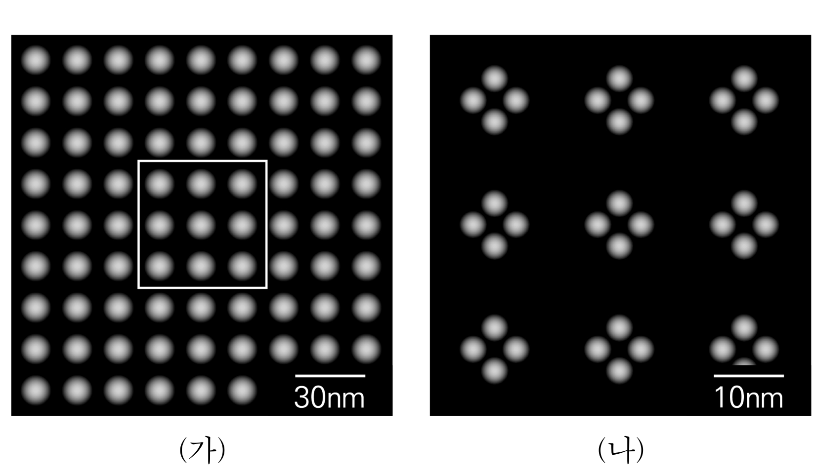
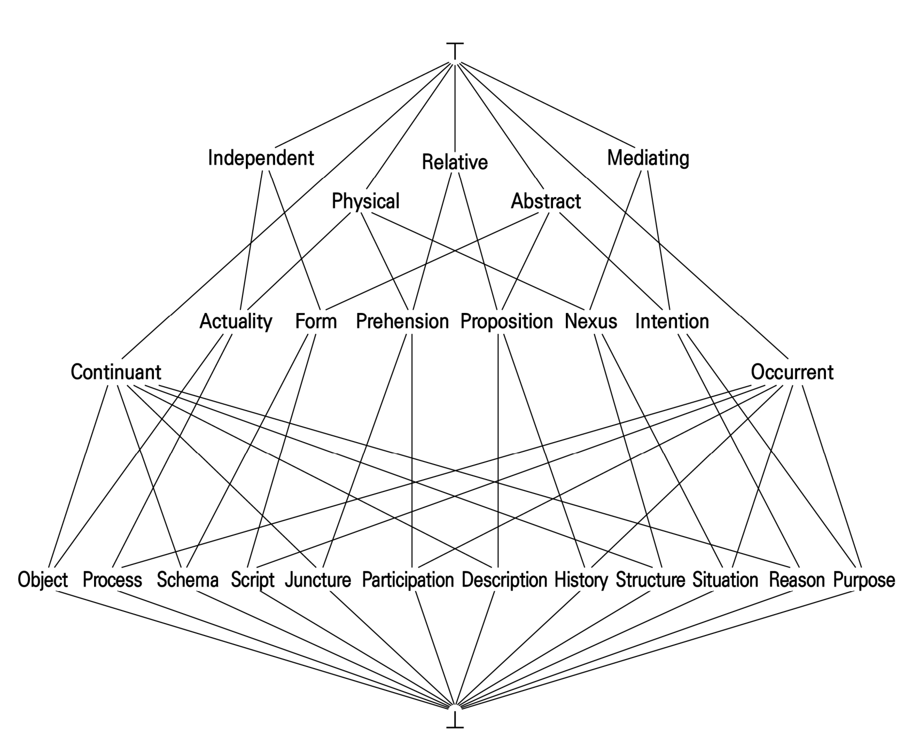

# [01-03] LU (2019)

다음 글을 읽고 물음에 답하시오.

## 제시문

법의 본질에 대해서는 많은 논의들이 있어 왔다. 그 오래된 것들 가운데 하나가 사회에 형성된 관습에서 그 본질을 파악하려는 견해이다. <kbd>관습이론</kbd>에서는 이런 관습을 확인하고 재천명하는 것이 법이 된다고 본다. 곧 법이란 제도화된 관습이라고 보는 것이다. 관습을 재천명하는 역할은 원시 사회라면 족장 같은 권위자가, 현대 법체계에서는 사법기관이 수행할 수 있다. 입법기관에서 이루어지는 제정법 또한 관습을 확인한 결과이다. 예를 들면 민법의 중혼 금지 조항은 일부일처제의 사회적 관습에서 유래하였다고 설명한다. 나아가 사회의 문화와 관습에 어긋나는 법은 성문화되어도 법으로서의 효력이 없으며, 관습을 강화하는 법이어야 제대로 작동할 수 있다고 주장한다. 성문법이 관습을 변화시킬 수 없다는 입장을 취하는 것이다.

법을 사회구조의 한 요소로 보고 그 속에서 작용하는 기능에서 법의 본질을 찾으려는 구조이론이 있다. 이 이론에서는 관습이론이 법을 단순히 관습이나 문화라는 사회적 사실에서 유래한다고 보는 데 대해 규범을 정의하는 개념으로 규범을 설명하는 오류라 지적한다. 구조이론에서는 교환의 유형, 권력의 상호 관계, 생산과 분배의 방식, 조직의 원리들이 모두 법의 모습을 결정하는 인자가 된다. 이처럼 법은 구조화의 결과물이며, 이 구조를 유지하고 운영할 수 있는 합리적 방책이 필요하기에 도입한 것이다. 따라서 구조이론에서는 상이한 법 현상을 사회 구조의 차이에 따른 것으로 설명한다.

1921년 팔레스타인 지역에 세워진 모샤브 형태의 정착촌 A와 키부츠 형태의 정착촌 B는 토지와 인구의 규모가 비슷한 데다, 토지 공유를 바탕으로 동종의 작물을 경작하였고, 정치적 성향도 같았다. 그런데도 법의 모습은 서로 판이했다. A에서는 공동체 규칙을 강제하는 사법위원회가 성문화된 절차에 따라 분쟁을 처리하고 제재를 결정하였지만, B에는 이러한 기구도, 성문화된 규칙이나 절차도 없었다. 구조이론은 그 차이를 이렇게 ㉠ <u>분석한다.</u> B에서는 공동 작업으로 생산된 작물을 공동 소유하는 형태를 지니고 있어서 구성원들 사이의 친밀성이 높고 집단 규범의 위반자를 곧바로 직접 제재할 수 있었다. 하지만 작물의 사적 소유가 인정되는 A에서는 구성원이 독립적인 생활 방식을 바탕으로 살아가기 때문에 비공식적인 규율로는 충분하지 않고 공식적인 절차와 기구가 필요했다.

법의 존재 이유가 사회 전체의 필요라는 구조이론의 전제에 의문을 제기하면서, 법과 제도로 유지되고 심화되는 불평등에 주목하여야 한다는 갈등이론도 등장한다. 갈등이론에서 법은 사회적 통합을 위한 합의의 산물이 아니라, 지배 집단이 억압 구조를 유지․강화하여 자신들의 이익을 영위하려는 하나의 수단이라고 주장한다. 19세기 말 미국에서는 아동의 노동을 금지하는 아동 노동 보호법을 만들려고 노력하여 20세기 초에 제정을 보았다. 이것은 문맹, 건강 악화, 도덕적 타락을 야기하는 아동 노동에 대한 개혁 운동이 수십 년간 지속된 결과이다. 이에 대해 관습이론에서는 아동과 가족생활을 보호하여야 한다는 미국의 전통적 관습을 재확인하는 움직임이라고 해석할 것이다. 구조이론에서는 이러한 법 제정을 사회구조가 균형을 이루는 과정으로 설명하려 할 것이다. 하지만 갈등이론에서는 법 제정으로 말미암아 값싼 노동력에 근거하여 생존하는 소규모 기업이 대거 퇴출되었다는 점, 개혁 운동의 많은 지도자들이 대기업 사장의 부인들이었고 운동 기금도 대기업의 기부에 많이 의존하였다는 점을 지적한다.

이론 상호 간의 비판도 만만찮다. 관습이론은 비합리적이거나 억압적인 사회․문화적 관행을 합리화해 준다는 공격을 받는다. 구조이론은 법의 존재 이유가 사회적 필요에서 나온다는 단순한 가정을 받아들이는 것일 뿐이고, 갈등이론은 편향적인 시각으로 흐를 수 있을 것이라고 비판받는다.

## 01

윗글에 대한 이해로 가장 적절한 것은?

### 선택지

(1) 관습이론은 지배계급의 이익을 위한 억압적 체계를 합리화한다는 비판을 받는다.

(2) 구조이론은 법이 그런 모습을 띠는 이유보다는 법이 발생하는 기원을 알려 주려 한다.

(3) 구조이론은 규범을 정의하는 개념으로 규범을 설명하기 때문에 논리적 문제가 있다고 공격을 받는다.

(4) 갈등이론은 사회관계에서의 대립을 해소하는 역할에서 법의 기원을 찾는다.

(5) 갈등이론은 법 현상에 대한 비판적 접근을 통해 전체로서의 사회적 이익을 유지하는 기능적 체계를 설명한다.

## 02

㉠의 내용으로 적절하지 <u>않은</u> 것은?

### 선택지

(1) A의 사법위원회가 지닌 사회 구조 유지의 기능이 사적 소유제의 도입에 따른 가정 간 빈부 격차를 고착시키는 역할을 수행하였다고 규명한다.

(2) B의 공동생활 방식은 구성원들이 일상적인 비난과 제재의 가능성에 놓이도록 만들기 때문에 천명되지 않은 관습도 법처럼 지켜졌다고 파악한다.

(3) A와 B는 사회의 조직이나 구조가 상이하기 때문에 서로 다른 법체계를 가졌다고 설명한다.

(4) B와 달리 A에서 성문화된 규칙이 발전한 모습을 보고 사회 관행과 같은 비공식적 규율은 독립적인 생활 방식의 규율에 적합하지 않았다고 해석한다.

(5) B와 달리 A는 구성원이 함께 하는 생활 속에서 규범을 체득하는 구조가 아니라서 규율 내용을 명시하여야 규범을 둘러싼 갈등을 억제할 수 있었다고 이해한다.

## 03

<kbd>관습이론</kbd>에 관한 추론으로 적절하지 <u>않은</u> 것은?

### 선택지

(1) 구조이론이나 갈등이론이 법을 자연적으로 발생한 것이 아니라고 보는 데 대하여 관습이론도 동의할 것이다.

(2) 상이한 법체계를 가진 두 사회에 대하여 구조이론이 조직 원리상의 차이로 그 원인을 설명할 때, 관습이론은 관습이 서로 다르기 때문이라고 이를 반박할 것이다.

(3) ‘여성발전기본법’, ‘남녀차별금지및구제에관한법률’의 제정이 한국 사회에서 여성에 대한 차별 관행의 전환을 이끌어 냈다는 평가는 관습이론의 논거를 강화할 것이다.

(4) 과거 남계 혈통 중심의 호주제가 현재의 변화된 가족 문화에 맞지 않기 때문에 개정 민법으로 폐지되었다는 분석에 대해, 관습이론은 관습을 재천명하는 법의 역할을 보여 준다고 하여 지지할 것이다.

(5) 허례허식을 일소하기 위하여 1993년 제정된 ‘가정의례에관한법률’이 금지한 행위들이 국민들 사이에서 여전히 지속되다가 1999년에 그 법률이 폐지되었다는 사실에서, 성문법이 관습을 변화시킬 수 없다는 주장은 힘을 얻을 것이다.

# [04-06] LU (2019)

다음 글을 읽고 물음에 답하시오.

## 제시문

서기 2세기 중엽, 로마의 속주 출신 그리스인 아리스티데스는 로마 통치의 특징을 묘사하는 ｢로마 송사(頌辭)｣라는 연설문을 남긴다. 이 글은 로마 제국에 대한 동시대인의 증언이자, 정복자가 아닌 속주, 즉 식민지 지식인의 논평이라는 점에서 흥미롭다. 그렇지만 로마의 통치 원리에 대한 그의 설명은 정작 로마인에게는 익숙한 것이 아니었다. 예를 들어 그는 ‘보편 시민’을 구현하려는 시민권 정책의 개방성 원리를 칭찬하지만, 로마인은 그 정책 배후의 이념을 숙고하지 않았다. 로마인에게 속주 엘리트들에 대한 시민권 개방은 분리 통치를 위한 ‘지배 비결’이었을 뿐이다.

하지만 아리스티데스는 로마의 정책을 이념의 측면에서 볼 필요가 있었다. 이미 300여 년간 그리스 지식인들은 로마 권력의 속성과 그리스인이 로마 통치에 관해 취할 태도에 대한 담론을 지속해 왔기 때문이다. 우선 로마의 지배에 들어간 기원전 2세기 중엽 이래 그리스 지식인들은 그리스인의 대처 자세에 대해 고민했다. 가장 먼저 이를 논의한 이들은 기원전 2〜1세기의 철학자 파나이티오스와 포세이도니오스였다. 그들의 논리는 최선자(最善者)의 지배가 약자에게 유익하다는 것이었다. 그로써 그리스인은 로마인에 대해 지배의 도덕적 정당성을 인정하면서 ㉠ <u>순응주의를</u> 드러냈다. 하지만 과연 로마인은 최선자였던가? 속주에 배치된 군 지휘관과 관리들에 대한 속주민의 고발이 잦았던 당시 현실에서 보면 그 대답은 어렵지 않다.

한편 서기 1세기 초 로마의 정체(政體)가 공화정에서 제정으로 바뀐 뒤, 그때까지 통치하기보다는 그저 점령해 온 지역에서 실질적 행정이 시작되었다. 그 결과 로마의 통치가 공고해지고, 로마가 가져온 평화의 혜택이 자명해졌다. 그리스 문화를 존중하는 로마 황제들의 배려가 늘어가면서, 그리스인의 자유 상실감은 상당히 약화되었다. 이제 그들은 문학과 철학에서의 문화 권력을 인정받는 대가로 권력과 타협할 준비가 되어 있었다. 이를 ㉡ <u>타협주의</u>라고 부를 수 있을 것이다. 예컨대 서기 1세기 초의 역사가 디오니시우스는 실체적 근거도 없이 로마인의 뿌리는 사실 그리스인이라며 일종의 동조론(同祖論)을 제기했다. 그렇지만 이는 로마인에 대한 아부가 아니라 그리스인을 위한 타협의 신호였다. 정복자로 성공한 로마인을 불편하게 대할 이유가 없다는 것이었다. 거의 같은 시기의 수사학자 디오는 황제들이 타락하지 않으면, 로마가 관대한 통치를 펴고 그리스인의 이상인 ‘화합’을 실현할 것이라고 전망하였다. 아직까지는 자신들의 정체성을 지키기 위한 노력을 포기하지 않았기 때문이다.

그러나 아리스티데스의 시기에 이르면 속주 지식인들의 기조는 ㉢ <u>동화주의로</u> 변했다. 역사가 아피아누스는 제정이 안정과 평화, 풍요를 안겨 주었다고 보았고, 그런 의미에서 로마가 공화정에서 제정으로 전환된 것을 축복이라고 묘사했다. 이는 그가 아직도 옛 정체에 대한 향수를 짙게 간직하고 있던 로마의 전통적 지배 계층보다 새로운 체제와 일체감을 더 지녔음을 보여 준다. 그리고 아리스티데스는 ｢로마 송사｣에서 그리스에 대한 혜택과 배려를 더 이상 논하지 않고, 제국 시민으로서의 관점을 강조한다. 그리고 제국 통치가 가져다 준 평화의 전망 속에서 그리스의 지역 엘리트들은 더 이상 통치할 권리를 두고 서로 싸우지 않는다고 말한다. 요컨대 아리스티데스는 식민지 엘리트들의 탈정치화를 상정하고 있다. 그는 모든 속주 도시의 정치적 자립성이 세계 제국 안에서 소멸되는 상태를 꿈꾸는 것이다.

게다가 그가 보기에 로마는 이전의 다른 제국인 페르시아에 비해 행정 조직과 지배 이념에 있어서 비교 우위를 지녔다. 로마의 행정 조직은 거대하지만 동시에 체계적인 점이 특징이라는 것이다. 이 체계적인 면이란 곧 통치의 탈인격성을 가리키며, 바로 페르시아 왕의 전횡과 대척을 이루는 것이다. 이렇게 ｢로마 송사｣는 ‘팍스 로마나’가 절정에 달해 있던 서기 2세기 중엽의 로마 정책에 대해 공감하고 동조하며 결국 동화되었던 그리스 지식인들의 자세를 잘 보여 주고 있다.

## 04

윗글의 내용과 일치하는 것은?

### 선택지

(1) 공화정 말기에 로마의 속주 행정은 페르시아와 달리 전횡성을 극복하였다.

(2) 공화정 말기에 속주민은 로마 군 지휘관과 관리들의 통치에 이견을 표하지 못했다.

(3) 제정 초기에 로마의 상류층은 평화와 안정을 보장하는 체제의 변화를 환영하였다.

(4) 제정 초기에 그리스 지식인들은 로마의 그리스 문화 존중을 바탕으로 자존감을 지켰다.

(5) ‘팍스 로마나’ 절정기의 시민권 정책은 ‘보편 시민’ 양성이라는 통치 원리의 산물이었다.

## 05

㉠～㉢에 대한 설명으로 적절하지 <u>않은</u> 것은?

### 선택지

(1) ㉠에서는 지배의 정당성을 윤리적 정당성과 일치시키는 논리를 내세웠다.

(2) ㉡에서는 그리스 정체성의 유지를 중시한다는 특징을 갖고 있다.

(3) ㉢에서는 제국 행정 시스템의 체계적인 면을 높이 평가했다.

(4) ㉡과 ㉢에서는 자유보다 평화와 안전을 중시한다는 공통점을 지녔다.

(5) ㉠, ㉡, ㉢ 모두 로마의 정체 변화를 긍정적으로 파악하고 있다.

## 06

윗글을 바탕으로 <보기>를 평가한 내용으로 가장 적절한 것은?

### 보기

정치가는 자신과 출신 도시가 로마 통치자들에게 책잡히지 않도록 해야 함은 물론, 로마의 고위 인사 중에 친구를 가지도록 해야만 한다. 로마인은 친구들의 정치적 이익을 증대시켜 주는 데 열심이기 때문이다. 우리가 거물들과의 우정에서 이득을 보게 되었을 때, 그 이점이 우리 도시의 복지에 이어지도록 하는 것도 좋다. …… 우리 그리스 도시들이 누리는 축복들인 평화, 번영, 풍요, 늘어난 인구, 질서, 화합을 생각해 보라. 그리스인이 이민족들과 싸우던 모든 전쟁은 자취를 감추었다. 자유에 관한 한, 우리 도시 주민들은 통치자들이 허용해 주는 커다란 몫을 누리고 있다. 아마 그 이상의 자유는 주민들을 위해서도 좋지 않을 것이다.

- 플루타르코스, ｢정치가 지망생을 위한 권고｣

### 선택지

(1) ‘우리 도시’와 ‘화합’을 말하고 있다는 점에서, 그리스인의 정체성 지키기를 포기하지 않은 디오와 같은 자세를 견지한다고 보아야겠군.

(2) ‘자신과 출신 도시’, ‘평화’와 ‘풍요’를 거론하고 있다는 점에서, 황제의 통치를 환영한 아피아누스와 동시대인의 주장이라고 보아야겠군.

(3) 로마는 ‘친구들’의 ‘정치적 이익’을 지켜 준다고 한다는 점에서, 시민권 확대에 주목한 아리스티데스와 같은 태도를 보이고 있다고 보아야겠군.

(4) 그리스인이 ‘이민족들’과 싸우던 전쟁이 사라졌음을 강조한다는 점에서, 로마인과 그리스인이 한 뿌리를 가졌다고 보는 디오니시우스의 주장을 지지한다고 보아야겠군.

(5) ‘통치자들’의 눈치를 보고 그들이 준 ‘번영’과 ‘질서’를 상기시킨다는 점에서, 약자에게 유익한 점을 고민한 파나이티오스, 포세이도니오스와 동시대인의 견해라고 보아야겠군.

# [07-09] LU (2019)

다음 글을 읽고 물음에 답하시오.

## 제시문

첨단 소재 분야의 연구에서는 마이크로미터 이하의 미세한 구조를 관찰할 수 있는 전자 현미경이 필요하다. 전자 현미경과 광학 현미경의 기본적인 원리는 같다. 다만 광학 현미경은 관찰의 매체로 가시광선을 사용하고 유리 렌즈로 빛을 집속하는 반면, 전자 현미경은 전자빔을 사용하고 전류가 흐르는 코일에서 발생하는 자기장을 이용하여 전자빔을 집속한다는 차이가 있다.

광학 현미경은 시료에 가시광선을 비추고 시료의 각 점에서 산란된 빛을 렌즈로 집속하여 상(像)을 만드는데, 다음과 같은 이유로 미세한 구조를 관찰하는 데 한계가 있다. 크기가 매우 작은 점광원에서 나온 빛은 렌즈를 통과하면서 회절 현상에 의해 광원보다 더 큰 크기를 가지는 원형의 간섭무늬를 형성하는데 이를 ‘에어리 원반’이라고 부른다. 만약 시료 위의 일정한 거리에 있는 두 점에서 출발한 빛이 렌즈를 통과할 경우 스크린 위에 두 개의 에어리 원반이 만들어지게 되며, 이 두 점의 거리가 너무 가까워져 두 에어리 원반 중심 사이의 거리가 원반의 크기에 비해 너무 작아지면 관찰자는 더 이상 두 점을 구분하지 못하고 하나의 점으로 인식하게 된다. 이 한계점에서 시료 위의 두 점 사이의 거리를 ‘해상도’라 부른다. 일반적으로 현미경에서 얻을 수 있는 최소의 해상도는 사용하는 파동의 파장, 렌즈의 초점 거리에 비례하며 렌즈의 직경에 반비례한다. 따라서 사용하는 파장이 짧을수록 최소 해상도가 작아지며, 더 또렷한 상을 얻을 수 있다. 광학 현미경의 경우 파장이 가장 짧은 가시광선을 사용하더라도 그 해상도는 파장의 약 절반인 200 nm보다 작아질 수가 없다. 반면 전자 현미경에 사용되는 전자빔의 전자도 양자역학에서 말하는 ‘입자-파동 이중성’에 따라 파동처럼 행동하는데 이 파동을 ‘드브로이 물질파’라고 한다. 물질파의 파장은 입자의 질량과 속도의 곱인 운동량에 반비례하는데 전자 현미경에서 가속 전압이 클수록 전자의 속도가 크고 수십 kV의 전압으로 가속된 전자의 물질파 파장은 대략 0.01 nm 정도이다. 하지만 전자 현미경의 렌즈의 성능이 좋지 않아 해상도는 보통 수 nm이다.

전자 현미경의 렌즈는 전류가 흐르는 코일에서 발생하는 자기장을 사용하여 전자의 이동 경로를 휘게 하여 전자를 모아 준다. 전하를 띤 입자가 자기장 영역을 통과할 때 속도와 자기장의 세기에 비례하는 힘을 받는데 그 방향은 자기장에 대해 수직이다. 전자 렌즈는 코일을 적절히 배치하여 특별한 형태의 자기장을 발생시켜 렌즈를 통과하는 전자가 렌즈의 중심 방향으로 힘을 받도록 만든다. 코일에 흐르는 전류를 증가시키면 코일에서 발생하는 자기장의 세기가 커지고 전자가 받는 힘이 커져 전자빔이 더 많이 휘어지면서 초점 거리가 줄어드는 효과를 얻을 수 있다. 대물렌즈의 초점 거리가 작아지면 현미경의 배율은 커진다. 따라서 광학 현미경에서는 배율을 바꿀 때 대물렌즈를 교체하지만 전자 현미경에서는 코일에 흐르는 전류를 조절하여 일정 범위 안에서 배율을 마음대로 조정할 수 있다. 하지만 렌즈의 중심과 가장자리를 통과하는 전자가 받는 힘을 적절히 조절하여 한 점에 모이도록 하는 것이 어려우므로 광학 현미경에 비해 초점의 위치가 명확하지 않다.

전자 현미경은 고전압으로 가속된 전자빔을 사용하므로 현미경의 내부는 기압이 대기압의 $1/10^{10}$ 이하인 진공 상태여야 한다. 전자는 공기와 충돌하면 에너지가 소실되거나 굴절되는 등 원하는 대로 제어하기 어렵기 때문이다. 또한 절연체 시료를 관찰할 때 전자빔의 전자가 시료에 축적되어 전자빔을 밀어내는 역할을 하게 되므로 이미지가 왜곡될 수 있다. 이 때문에 보통 절연체 시료의 표면을 금 또는 백금 등의 도체로 얇게 코팅하여 사용한다.

광학 현미경에서는 실제의 상을 눈으로 볼 수 있지만, 전자 현미경에서는 시료에서 산란된 전자의 물질파를 검출기에 집속하여 상이 맺힌 지점에서 전자의 분포를 측정함으로써 시료 표면의 형태를 디지털 영상으로 나타낸다. 이러한 전자 현미경의 특성을 활용하면 다양한 검출기 및 주변 기기를 장착하여 전자 현미경의 응용 분야를 확장할 수 있다.

## 07

윗글의 내용과 일치하는 것은?

### 선택지

(1) 광학 현미경의 해상도는 시료에 비추는 빛의 파장에 의존하지 않는다.

(2) 전자 현미경에서 진공 장치 내부의 기압이 높을수록 선명한 상을 얻을 수 있다.

(3) 전자 현미경에서 렌즈의 중심과 가장자리를 통과한 전자는 같은 점에 도달한다.

(4) 전자 현미경에서 시료의 표면에 축적되는 전자가 많을수록 상의 왜곡이 줄어든다.

(5) 광학 현미경과 전자 현미경은 모두 시료에서 산란된 파동을 관찰하여 상을 얻는다.

## 08

윗글에서 이끌어 낼 수 있는 전자 현미경의 특성만을 <보기>에서 있는 대로 고른 것은?

### 보기

ㄱ. 전자의 물질파 파장이 길수록 전자가 전자 렌즈를 지날 때 더 큰 힘을 받는다.
ㄴ. 전자의 가속 전압을 증가시키면 상에서 에어리 원반의 크기를 더 작게 할 수 있다.
ㄷ. 전자 렌즈의 코일에 흐르는 전류를 감소시키면 상의 해상도를 더 작게 할 수 있다.

### 선택지

(1) ㄱ

(2) ㄴ

(3) ㄷ

(4) ㄱ, ㄴ

(5) ㄱ, ㄴ, ㄷ

## 09

<보기>에 대한 설명으로 가장 적절한 것은?

### 보기

(가)와 (나)는 크기가 일정한 미세 물체가 일정한 간격으로 배치된 구조를 전자 현미경으로 각각 찍은 사진이며 (나)는 (가)에서 사각형 부분에 해당한다.

<이미지 포함됨>

### 선택지

(1) (가)의 해상도는 30 nm보다 크다.

(2) (가)에서 전자 현미경 내부의 기압은 대기압보다 크다.

(3) (나)에서 사용된 전자의 물질파 파장은 20 nm보다 크다.

(4) (나)에서 렌즈의 코일에 흐르는 전류는 (가)의 경우보다 크다.

(5) (나)에서 사용된 전자의 속력은 (가)에서 사용된 전자의 속력보다 3배 작다.

# [10-12] LU (2019)

다음 글을 읽고 물음에 답하시오.

## 제시문

현대 문학의 주요 비평 개념 중 하나인 멜랑콜리는 본래 ‘검은 담즙’을 뜻하는 고대 그리스의 의학 용어였다. 그 당시 검은 담즙은 ‘우울과 슬픔에 젖는 기질’의 원인으로 간주되었고, 나태함, 게으름, 몽상 등은 ‘우울질’의 표현이자 멜랑콜리의 속성이라 분류되었다. 이런 속성들은 열정처럼 적극적으로 분출되는 감정이 아니라 열정의 결여 상태, 즉 감정을 느낄 수 있는 능력이 쇠락해진 상태와 관련된다는 공통점이 있다. 멜랑콜리가 야기하는 정신적 무능에 대해 키르케고르는 “멜랑콜리는 무사태평한 웃음 속에서 메아리치는 이 시대의 질병이며, 우리로부터 행동과 희망의 용기를 앗아간다.”라고 평하기도 했다.

멜랑콜리는 상실을 인식하고 그 상실감에 자발적으로 침잠하는 태도이다. 일회적이고 찰나적이어서 다시는 돌이킬 수 없는 대상들을 향한 상실감에서 멜랑콜리는 유래한다. 그럼에도 멜랑콜리는 다만 어둡지만은 않으며 매혹적인 면을 가지고 있다. 삶과 죽음, 사랑과 이별처럼 인식 불가능한 타자성을 외면하기보다 차라리 자기 안에 가두려는 욕망이기 때문이다. 멜랑콜리는 대상의 상실에 따른 퇴행적 반응이라기보다는 오히려 상실된 대상을 살아 있게 만드는 몽환적인 능력이다. 따라서 이처럼 타자성을 자기 속에 가두고 관조하면서 자기만의 세계로 빠져 들려는 자, 즉 멜랑콜리커(Melancholiker)가 진정으로 추구하는 것은 상실된 대상 자체가 아니라 그 대상의 부재이며, 이 대상이 현존하지 않는 한에서 그것은 늘 점유를 향한 멜랑콜리커의 욕망을 추동하는 힘으로 작용한다.

멜랑콜리의 몽환적 능력은 현실을 대하는 태도의 측면에서 여러 견해를 낳았다. 벤야민이 “멜랑콜리커의 고독과 침잠, 즉 외면적 부동성(不動性)은 단순한 무기력이 아니라 사물을 꿰뚫어 보는 깊이 있는 사유를 상징”한다고 한 것은 대표적이다. 그는 멜랑콜리커의 고독이 곧 사물에 대한 통찰의 깊이를 나타낸다고 본다. 프로이트는 충분히 슬퍼한 후에 일상으로 귀환하는 애도와 달리 멜랑콜리는 “상실한 대상과 자아가 하나가 되어 버리는 감정”이라 말하면서, 결과적으로 자아를 일상에서 격리한다는 점을 강조했다. 물론 무기력한 슬픔이라는 멜랑콜리의 특성은 이성적인 절제를 강조해 온 근대 사회에서는 결코 환영받을 만한 것이 못 되었다. 하이데거가 근대에 유일하게 남은 열정이 있다면 ‘열정의 소멸에 대한 열정’이라고 말한 것도 근대 사회의 이러한 이성주의적 특성과 밀접한 관련이 있다.

그러므로 멜랑콜리는 미래에 대한 낙관과 혁신에 대한 자신감 위에 설립된 근대의 진보적 세계관의 필연적인 그림자가 되었다. 근대가 창출한 ㉠ <u>사회적 모더니티는</u> 국민국가, 자본주의 그리고 시민주의를 축으로 하는 공적 제도의 영역에서, 베버의 언급을 따르자면 ‘정신(Geist) 없는 전문가’와 ‘가슴 없는 향락가’들을 양산해 낸다. 그러나 사회적 모더니티의 지배적 가치들에 저항하는 태도라 할 ㉡ <u>문화적 모더니티는</u> 진보하는 부르주아지의 공적 세계가 은폐한 사적 공간에서 멜랑콜리커들을 키워 낸다. 문화적 모더니티는 부르주아지의 근대가 아니라 소위 사회적 부적응자들, 즉 몰락한 귀족, 룸펜 프롤레타리아트, 실패한 예술가, 부유(浮遊)하는 지식인들처럼 세계의 바깥에서 떠도는 존재들의 근대이다. 사회적 모더니티의 주체는 계산적 합리성에 근거하여 세계와 대면하고, 규율의 엄격성에 따라 세계에 질서를 부여함으로써 세계의 주인이 된다. 그러나 멜랑콜리커들은 세계의 주인이 되기보다는 자신이 상실했다고 생각하는 그 무엇을 찾는 데에 몰두하고자 한다. 이에 멜랑콜리커는 흔히 탐구자 혹은 수집가의 모습으로 나타난다. 사회적 모더니티는 과학과 기술의 힘으로 외적 자연을 탈신비화하고, 열정을 이해관계로 치환하여 인간의 내적 자연마저 감정의 횡포로부터 해방시켰다. 그러나 문화적 모더니티는 이러한 해방의 역설적 결과로 나타난 환멸감 속에서, 도리어 잃어버린 것들을 우울의 감정으로 보존하려고 한다.

이로써 멜랑콜리는 일종의 문명 비판적인 태도가 된다. 멜랑콜리는 사회적 모더니티가 빠른 속도로 일소한 근원적 가치들과 대상들을 문화적 모더니티의 영역에서 보존한다. 더 이상 지상에 존재하지 않는 것들 앞에서 우리는 우울하다. 그러나 더 정확하게 표현하자면, 우울한 자들에게만 이러한 가치들은 부재하는 현존이라는 역설적 방식으로 살아남는다. 상실된 가치와 대상들을 아직 신앙하는 자는 우울하지 않다. 또한 이들이 완벽하게 소멸되었다고 믿는 자 역시 우울할 수 없다. 멜랑콜리커는 그 중간에 머물면서 ‘소멸됨으로써 살아있는 어떤 것’을 끝없이 추구하는 것이다.

## 10

윗글의 내용과 일치하는 것은?

### 선택지

(1) 키르케고르는 멜랑콜리의 정신적 무능이 실존적 세계관을 형성하고 절망을 해소하는 요인이 된다고 보았다.

(2) 벤야민은 고독과 침잠에 빠진 멜랑콜리커의 무기력에서 사물의 본질에 도달할 수 있는 사유의 가능성을 발견하였다.

(3) 프로이트는 상실된 대상과 자아가 통합된 애도를 그것이 분리된 멜랑콜리와 구분함으로써 근대인의 몽환적 능력을 강조하였다.

(4) 하이데거는 능동적 절제를 통해 감정을 억누르는 것이 감정에 대한 근대인의 근본적 자세가 되어야 한다고 주장하였다.

(5) 베버는 근대 사회의 모든 영역이 숙련된 기술을 갖춘 엘리트들로 채워져야 한다고 보았다.

## 11

㉠과 ㉡에 대한 설명으로 적절하지 <u>않은</u> 것은?

### 선택지

(1) ㉠은 외적 자연과 내적 자연을 구분하지만 이들 모두를 계산적 합리성으로 지배한다.

(2) ㉡은 이성으로부터의 해방이 가져온 역설적 결과로 나타난 환멸감을 근간으로 성립된다.

(3) ㉠과 ㉡은 세계에 질서를 부여하려는 주체가 존재하느냐의 유무에서 차이를 보인다.

(4) ㉠과 ㉡은 공적 영역과 사적 영역에서 근대가 만들어낸 대립적 인간상이 출현하는 양상과 관련된다.

(5) ㉠은 외적 자연을 변화의 대상으로 삼고, ㉡은 근대적 발전이 앗아간 것들을 부재하는 현존의 상태로 보존한다.

## 12

윗글을 바탕으로 <보기>를 이해한 내용으로 적절하지 <u>않은</u> 것은?

### 보기

최명익의 ｢비 오는 길｣(1936)은 식민지 근대화가 진행되는 도시의 풍경을 그린다. 표제는 주인공 병일의 내면을 ‘우울한 장맛비’로 비유한 것이다. 작가는 정치적 저항이 불가능해진 상황에서 과거의 이상을 잃고 슬퍼하는 청년을 주인공으로 선택했다. 병일의 상실감은 특정 대상에 집착하는 증세인 독서벽(讀書癖)으로 나타난다. 그의 독서벽은 독서회를 조직하여 삶의 목표와 정치의식을 고민하던 학생 시절의 유산이다. 궁핍하게 살아가는 병일에게 이웃 사내는 책 살 돈으로 저축하라 훈계하지만, 병일은 책이 없으면 최소한의 자기 생활도 없을 것이라고 답한다. 그의 태도는 돈을 모아 ‘세상살이’를 하는 것이 행복이라는 이웃 사내의 인생관과 대조를 이룬다. 병일은 자신의 무능력을 인정하지만 이웃 사내의 생활이 행복은 아니라고 생각한다. 군중 속에서 홀로 ‘방향 없이 머뭇거리는 고독감’에 잠기면서도 병일은 책을 읽는다.

### 선택지

(1) 병일이 느끼는 ‘방향 없이 머뭇거리는 고독감’에서, 상실된 가치에 대한 믿음과 불신 사이에 끼어 있는 중간자의 모습을 엿볼 수 있군.

(2) 병일이 ‘세상살이’를 외면하고 독서에 집착한다는 사실에서, 과거에 지향했던 가치에서 여전히 벗어나지 못하는 탐구자로서의 면모를 찾아볼 수 있군.

(3) 이웃 사내가 병일에게 저축의 중요성을 훈계하는 모습에서, 식민지 근대 도시의 일상적 가치에 순응하는 보통 사람의 모습을 떠올릴 수 있군.

(4) 이웃 사내가 ‘세상살이’의 중요성을 강조하고 있다는 사실에서, 그가 ‘감정’을 느낄 수 있는 능력이 쇠약해진 상태의 인물임을 확인할 수 있군.

(5) 작가는 정치적 저항이 불가능한 상황에서 방황하는 청년을 통해, 근원적 가치가 부재의 상태로 보존된다는 창작 의도를 드러내려 했다고 해석할 수 있군.

# [13-15] LU (2019)

다음 글을 읽고 물음에 답하시오.

## 제시문

동물은 쾌락, 고통 등을 느낄 수 있는 만큼 그들도 윤리적으로 대우해야 한다는 주장이 ㉠ <u>동물감정론</u>이다. 한편 ㉡ <u>동물권리론</u>에 따르면 동물도 생명권, 고통받지 않을 권리 등을 지닌 존재인 만큼 그들도 윤리적으로 대우해야 한다. 하지만 동물도 윤리적 대상으로 고려해야 한다는 두 이론을 극단적으로 전개하면 새로운 윤리적 문제가 발생한다. ㉢ <u>포식에 관련한 비판</u>은 그러한 문제를 지적하는 대표적인 입장이다.

인간은 동물을 음식, 의류 등으로 이용해 왔지만, 인간만이 동물에게 고통을 주며 권리를 침해한 것은 아니다. 야생의 포식 동물 또한 피식 동물을 잔인하게 잡아먹는다. 피식 동물이 느끼는 고통은 도살에서 동물이 느끼는 고통보다 훨씬 클 수도 있다. 동물의 권리에 대한 침해 문제 또한 마찬가지로 설명할 수 있다. 인간의 육식이나 실험 등이 고통 유발이나 권리 침해 때문에 그르다면, 야생 동물의 포식이 피식 동물의 고통을 유발하거나 그 권리를 침해하는 것 또한 그르다고 해야 할 것이다. 그른 것은 바로잡아야 한다는 점에서 인간의 육식 등은 막아야 하는 것일 수 있다. 그렇다 해도 동물의 포식까지 막아야 한다고 하는 것은 터무니없다. 예컨대 사자가 얼룩말을 잡아먹지 못하도록 일일이 막는 것은 우선 우리의 능력을 벗어난다. 설령 가능해도 그렇게 하는 것은 자연 질서를 깨뜨리므로 올바르지 않다. 동물감정론과 동물권리론이 야생 동물의 포식을 방지해야 한다는 과도한 의무까지 함축할 수 있다는 점만으로도 그 이론을 비판할 충분한 이유가 된다.

동물감정론은 윤리 결과주의에 근거한다. 이것은 행동의 올바름과 그름 등은 행동의 결과에 의거하여 평가되어야 한다는 입장이다. 전형적 윤리 결과주의인 공리주의에 따르면 행동의 효용, 곧 행동이 쾌락을 극대화하는지의 여부가 그 평가에서 가장 주요한 기준이 된다. 이때 효용은 발생할 것으로 기대되는 고통의 총량을 차감한 쾌락의 총량에 의해 계산한다. 동물감정론이 포식 방지와 같은 의무를 부과한다는 지적에 대한 공리주의자의 응답은 다음과 같다. 포식 동물의 제거 등을 통해 피식 동물을 보호함으로써 얻을 수 있는 쾌락의 총량보다 이러한 생태계의 변화를 통해 유발될 고통의 총량이 훨씬 클 것이다. 따라서 동물을 이유 없이 죽이거나 학대하지 않는 것으로 인간이 해야 할 바를 다한 것이며 동물의 행동까지 규제해야 할 의무는 없다.

하지만 공리주의를 동원한 동물감정론은 포식 방지가 인간의 의무가 될 수 없음을 증명하는 데 성공하지 못한다. 기술 발전 등으로 인해 포식에 대한 인간의 개입이 더욱 수월해지고, 그로 인해 기대할 수 있는 쾌락의 총량이 고통의 총량보다 실제 더 커질 수 있기 때문이다. 쾌락 총량의 극대화를 기치로 내건 동물감정론에서의 효용 계산으로 포식 방지의 의무가 산출될 수도 있다.

한편 동물권리론은 행동의 평가가 ‘의무의 수행’ 등 행동 그 자체의 성격에 의거해야 한다는 윤리 비결과주의를 근거로 내세운다. 전형적 윤리 비결과주의인 의무론에 따르면 행위의 도덕성은 행위자의 의무가 적절히 수행되었는지의 여부에 따라 결정된다. 동물권리론이 포식 방지와 같은 의무를 부과한다는 지적에 대한 의무론자의 응답은 다음과 같다. 도덕 행위자는 자신의 행동을 조절하고 설명할 수 있는 능력을 지닌 반면, 포식 동물과 같은 도덕 수동자는 그런 능력이 결여된 존재이다. 의무를 지니려면 그렇게 할 수 있는 능력을 지녀야 한다. 도덕 수동자는 도덕에 맞춰 자신의 행동을 조절할 수 없으므로 그런 의무를 지니지 않는 것이다. 인간의 육식에서나 동물의 포식에서도 동물의 권리가 침해된 것이기는 마찬가지다. 그러나 동물은 자신의 행동을 조절할 능력을 갖지 않기에 다른 동물을 잡아먹지 않을 의무도 없다. 결국 사자가 얼룩말을 잡아 포식하는 것을 막을 인간의 의무 또한 없다는 것이다.

하지만 의무론을 동원한 동물권리론은 포식에 관련한 비판을 오해했다는 <kbd>문제점</kbd>을 갖는다. 포식 방지에 대한 비판의 핵심은 사자가 사슴을 잡아먹는다고 할 때 우리가 그것을 그만 두게 할 의무가 있는지의 문제이지, 사자가 그만 두어야 할 의무가 있는지의 여부는 아니기 때문이다. 그저 재미로 고양이를 괴롭히는 아이는 도덕 수동자이니 그 행동을 멈춰야 할 의무가 없다고 하더라도 과연 그 부모 또한 이를 막을 의무가 없다고 하겠는가?

## 13

㉠～㉢에 대한 설명으로 가장 적절한 것은?

### 선택지

(1) ㉠에서는 동물의 포식 때문에 생겨나는 야생의 고통은 효용 계산에서 무시해도 된다고 본다.

(2) ㉡에서는 인간이 동물에 대해 의무가 있는지를 판단할 때 인간의 도덕 행위자 여부를 고려해야 한다고 본다.

(3) ㉢에서는 인간의 육식은 그르지만 야생 동물의 포식은 그르지 않다고 본다.

(4) ㉠과 ㉡에서는 모두 동물에게 포식 금지의 의무가 있다고 본다.

(5) ㉠과 ㉢에서는 모두 포식을 방지하는 행동이 그른 까닭을 생명 공동체의 안정성 파괴에서 찾는다.

## 14

윗글을 바탕으로 추론할 때, 적절한 것만을 <보기>에서 있는 대로 고른 것은?

### 보기

ㄱ. 공리주의에 따르면, 포식 동물의 제거로 늘어날 쾌락의 총량이 고통의 총량보다 커지면 포식 동물을 제거해야 할 것이다.
ㄴ. 공리주의에 따르면, 동물에 대한 윤리적 대우의 범위는 야생에 개입할 수 있는 인간의 기술 발전 수준에 반비례할 것이다.
ㄷ. 의무론에 따르면, 인간에게 피식 동물을 구출할 수 있는 능력이 있다면 인간은 반드시 그렇게 할 의무가 있을 것이다.
ㄹ. 의무론에 따르면, 동물을 대하는 인간 행동의 올바름, 그름 등은 결과가 아닌 행동 그 자체의 성질에서 찾을 수 있을 것이다.

### 선택지

(1) ㄱ, ㄴ

(2) ㄱ, ㄹ

(3) ㄴ, ㄷ

(4) ㄱ, ㄷ, ㄹ

(5) ㄴ, ㄷ, ㄹ

## 15

<kbd>문제점</kbd>의 내용으로 가장 적절한 것은?

### 선택지

(1) 도덕 수동자에게는 책임이 없다는 사실로부터 도덕 행위자에게도 도덕 수동자의 행동에 대한 책임이 없다고 단정했다.

(2) 어린 아이가 도덕 수동자라는 사실로부터 어린 아이에게는 도덕적 책임을 물을 수 없다고 단정했다.

(3) 포식 동물도 어린 아이와 마찬가지로 행동 조절 능력을 결여한 도덕 수동자라는 점을 간과했다.

(4) 야생에서의 권리 침해가 인간 세계에서의 그것에 비해 더욱 잔인하다는 점을 간과했다.

(5) 피식 동물도 인간과 마찬가지로 쾌락과 고통을 느끼는 능력이 있다는 점을 간과했다.

# [16-18] LU (2019)

다음 글을 읽고 물음에 답하시오.

## 제시문

경제 이론은 경제 주체들의 행동에 관한 예측을 시도하는데, 현실에서 관찰되는 사람들의 행동이 이론에서의 예측과 다르게 나타나는 경우도 적지 않다. 경제학은 이들 ‘이상 현상’을 분석하고 토론하는 과정에서 발전했는데, 최근 이 흐름은 사람들의 행동에 관한 ㉠ <u>전통적 경제학</u>의 가정을 문제 삼는 ㉡ <u>행동경제학</u>에 의해 주도되었다.

전통적 경제학과 행동경제학의 차이가 본격적으로 확인되는 대표적 영역이 저축과 소비에 관련한 분야이다. 전통적 경제학에서는 사람들이 자신에게 무엇이 최선인지를 잘 알면서 전 생애 차원에서 최적의 소비 계획을 세우고 불굴의 의지로 실행한다고 가정한다. 이들은 또한 돈에는 사용 범위를 제한하는 꼬리표 같은 것이 붙어 있지 않아 전용(轉用)이 가능하다고 가정하며, 이러한 ‘전용 가능성’이 자유롭고 유연한 선택을 촉진함으로써 후생을 높여 준다고도 믿는다. 전통적 경제학은 이러한 인식을 근거로 사람들이 일생 동안 소비 수준을 비교적 고르게 유지할 것이며 소득의 경우 나이가 들면서 점점 증가하다가 퇴직 후 급속히 감소하는 패턴을 보인다는 점에 착안해, 연령에 따른 소비 패턴은 연령에 따른 소득 패턴과 독립적으로 유지될 것이라고 예측했다. 그러나 사람들의 연령에 따른 실제 소비 패턴은 연령에 따른 소득 패턴과 상당히 유사하게 나타났다. 전통적 경제학에서는 이러한 이상 현상을 ‘유동성 제약’ 개념을 통해 해명했다. 즉 금융 시장이 완전치 않아 미래 소득이나 보유 자산 등을 담보로 현재 소비에 충분한 유동성을 조달하는 데 제약이 존재하므로, 소비 수준이 이론의 예측에 비해 낮다는 것이다.

행동경제학에서는 청년 시절과 노년 시절의 소비가 예측보다 적은 것은 외부 환경의 제약에 따른 어쩔 수 없는 행동이 아니라 자발적 선택의 결과물이라며, 이를 ‘심적 회계’에 의해 설명한다. 사람들은 현금, 보통 예금, 저축 예금, 주택 등 각종 자산을 마음속 별개의 계정에 배치하고 그 사용에도 상이한 원리를 적용한다는 것이다. 자산의 피라미드 중 맨 아래층에는 지출이 가장 용이한 형태인 현금이 있는데, 이는 대부분 지출에 사용된다. 많은 이들은 급전이 필요할 경우 저축 예금이 있는데도 연리 20%가 넘는 신용카드 현금 대출 서비스를 받아 해결한다. 금융적으로 바람직한 방법은 예금을 인출해 지출을 하는 것임에도, 높은 금리로 돈을 빌리고 낮은 금리로 저축을 하는 비합리적 행동을 하는 것이다. 마음속 가장 신성한 계정에는 퇴직 연금이나 주택과 같이 노후 대비용 자산들이 놓여 있는데, 이들은 최악의 사태가 발생하지 않는 한 마지막까지 인출이 유보되는 자산들이다. 심적 회계가 이런 방식으로 작동하는 경우 자산의 전용 가능성은 현저히 떨어지며, 특정 연도에 행하는 소비는 일생 동안의 소득 총액뿐 아니라 그 소득을 낳는 자산들이 마음속 어느 계정에 있는가에 따라서도 달라진다.

행동경제학에 따르면, 사람들은 자신에게 무엇이 최선인지 잘 알고 전 생애에 걸친 최적의 소비 계획을 세우지만, 미래보다 현재를 더 선호하고 유혹에 빠지기 쉽다. 사람들은 자신과 가족의 장기적 안전을 지키기 위해 행동을 제약하기 위한 속박 장치를 마음속에 만들어 내는데, 이러한 자기 통제 기제가 바로 심적 회계이다. 심적 회계의 측면에서 본다면, 전통적 경제학이 주목했던 유동성 제약은 장기적으로 자신에게 불리한 지출 행위를 사전에 차단하기 위한 자발적 선택의 결과로 이해될 수 있다. 심적 회계가 당장의 유혹을 억누르고 현재의 지출을 미래로 미루는 행위, 곧 저축을 스스로 강제하는 기제라면, 퇴직 연금이나 국민 연금 제도는 이런 기제가 사회적 차원에서 구현된 것이다.

## 16

윗글의 내용과 일치하지 <u>않는</u> 것은?

### 선택지

(1) 이상 현상에 대한 분석은 경제학을 발전시키는 자양분으로 작용했다.

(2) 퇴직 연금 제도는 개인의 심적 회계가 사회적 차원으로 확장된 것이다.

(3) 저축은 현재의 소비를 미룸으로써 미래의 지출 능력을 높이려는 행위이다.

(4) 심적 회계는 미래보다 현재를 중시하는 본능을 억제하려는 자기 통제 기제이다.

(5) 자산 피라미드의 하층부에 있는 자산일수록 인출을 하지 않으려는 계정에 배치된다.

## 17

㉠과 ㉡을 비교한 내용으로 가장 적절한 것은?

### 선택지

(1) ㉠과 ㉡에서는 사람들이 유혹에 취약한 존재라고 여긴다는 점에서 의견을 같이할 것이다.

(2) ㉠에서는 연령대별 소비의 특성을 자발적 선택으로 이해하고, ㉡에서는 그 특성을 외부적 제약 요인에서 찾을 것이다.

(3) ㉠에서는 유동성 제약의 원인을 금융 시장의 불완전성에서 찾고, ㉡에서는 그 원인을 개인의 심리적 요인에서 찾을 것이다.

(4) ㉠에서는 ㉡에서와 달리 유동성 제약이 심화되면 소비가 자유롭고 원활하게 행해진다고 볼 것이다.

(5) ㉠과 ㉡에서는 모두 급전이 필요한 상황에서 신용카드 현금 대출 서비스를 받는 대신 저축 예금을 인출하는 선택이 금융적으로 바람직한 방법이라는 것을 부정적으로 판단할 것이다.

## 18

윗글을 바탕으로 <보기>를 설명한 내용으로 적절하지 <u>않은</u> 것은?

### 보기

A 국가에서는 1980년대 후반에 세법을 개정하여, 세금 공제 대상을 줄였다. 자동차․카드․주택 등 여러 영역에서 허용되던 공제 대상을 주택 담보 대출로 제한함으로써 주택 소유의 확대를 유도했다. 은행들은 주택가액과 기존 담보 대출액의 차액을 담보로 한 2차 대출 상품을 내놓는 방식으로 이에 대응하였다. 그 결과 다양한 대출 상품들이 생겨나고 주택 가격 거품이 부풀어 오름에 따라 주택을 최후의 보루로 삼던 사회적 규범이 결국 붕괴했고 노인 가구들도 2차 주택 담보 대출을 받는 상황이 초래되었다. 또한 주택 가격 상승에 따른 미실현 이익을 향유하며 지출을 늘리는 가구가 늘어나면서 경제의 불안정성은 커졌고 마침내 20여 년 후 금융 위기 사태가 발발했다. 그 결과 가계의 소득 감소와 소비 위축 등으로 경기 침체가 나타났다.

### 선택지

(1) 1980년대 후반의 새로운 조세 정책이 촉진한 새로운 대출 상품에 대한 A 국가 국민들의 대응으로 볼 때, 주택 자산이 전통적으로 지니던 ‘마음속 가장 신성한 계정’으로서의 성격이 약화되었겠군.

(2) 정부 정책과 금융 관행의 변화가 야기한 위기로 볼 때, 금융 위기 이후의 A 국가는 주택 소유자들이 ‘유동성 제약’을 완화하게끔 ‘심적 회계’의 작동 방식을 바꾸도록 유도하는 정책을 필요로 했겠군.

(3) ‘자산의 전용 가능성’ 제고가 경제의 불안정성 심화로 이어졌던 것으로 볼 때, A 국가에서 ‘자발적 선택 가능성’의 확대는 장기적으로 경제 활동을 위축시키는 부정적 결과를 낳았다고 평가할 수 있겠군.

(4) 부동산 거품 현상으로 초래된 ‘사회적 규범’의 변화로 볼 때, 금융 위기 이전의 은행들은 주택을 저축이 아닌 소비 확대의 수단으로 바꾸도록 유도함으로써 A 국가 국민들이 장래를 대비할 여력을 약화시켰겠군.

(5) 현재 소득이 없는 경제 주체들도 2차 주택 담보 대출 상품을 통해 추가적인 지출을 했던 것으로 볼 때, 전통적 경제학에서는 ‘소비 패턴은 연령에 따른 소득 패턴과 독립적으로 유지’되리라는 예측이 실현되었다고 여겼겠군.

# [19-21] LU (2019)

다음 글을 읽고 물음에 답하시오.

## 제시문

심신 문제는 정신과 물질의 관계에 대해 묻는 오래된 철학적 문제이다. 정신 상태와 물질 상태는 별개의 것이라고 주장하는 이원론이 오랫동안 널리 받아들여졌으나, 신경 과학이 발달한 현대에는 그 둘은 동일하다는 동일론이 더 많은 지지를 받고 있다. 그러나 똑같은 정신 상태라고 하더라도 사람마다 그 물질 상태가 다를 수 있고, 인간과 정신 상태는 같지만 물질 상태는 다른 로봇이 등장한다면 동일론에서는 그것을 설명할 수 없다는 문제가 생긴다. 그래서 어떤 입력이 들어올 때 어떤 출력을 내보낸다는 기능적․인과적 역할로써 정신을 정의하는 기능론이 각광을 받게 되었다. 기능론에서는 정신이 물질에 의해 구현되므로 그 둘이 별개의 것은 아니라고 주장한다는 점에서 이원론과 다르면서도, 정신의 인과적 역할이 뇌의 신경 세포에서든 로봇의 실리콘 칩에서든 어떤 물질에서도 구현될 수 있음을 보여 준다는 점에서 동일론의 문제점을 해결할 수 있기 때문이다.

그래도 정신 상태에는 물질 상태와 다른 무엇인가가 있다고 생각하는 이원론에서는 ‘나’가 어떤 주관적인 경험을 할 때 다른 사람에게 그 경험을 보여줄 수는 없지만 나는 분명히 경험하는 그 느낌에 주목한다. 잘 익은 토마토를 봤을 때의 빨간색의 느낌, 시디신 자두를 먹었을 때의 신 느낌, 꼬집힐 때의 아픈 느낌이 그런 예이다. 이런 질적이고 주관적인 감각 경험, 곧 현상적인 감각 경험을 철학자들은 ‘감각질’이라고 부른다. 이 감각질이 뒤집혔다고 가정하는 사고 실험을 통해 기능론에 대한 비판이 제기된다. 나에게 빨강으로 보이는 것이 어떤 사람에게는 초록으로 보이고 나에게 초록으로 보이는 것이 그에게는 빨강으로 보인다는 사고 실험이 그것이다. 다만 각자에게 느껴지는 감각질이 뒤집혀 있을 뿐이고 경험을 할 때 겉으로 드러난 행동과 하는 말은 똑같다. 예컨대 그 사람은 신호등이 있는 건널목에서 똑같이 초록 불일 때 건너고 빨간 불일 때는 멈추며, 초록 불을 보고 똑같이 “초록 불이네.”라고 말한다. 그러나 그는 자신의 감각질이 뒤집혀 있는지 전혀 모른다. 감각질은 순전히 사적이며 다른 사람의 감각질과 같은지를 확인할 수 있는 방법이 없기 때문이다. 그렇다면 나와 어떤 사람의 정신 상태는 현상적으로 다르지만 기능적으로는 같으므로, 현상적 감각 경험은 배제하고 기능적․인과적 역할만으로 정신 상태를 설명하는 기능론은 잘못된 이론이라는 논박이 가능하다.

㉠ <u>뒤집힌 감각질 사고 실험에 의한 기능론 논박이</u> 성공하려면 감각질이 뒤집힌 사람이 그렇지 않은 사람과 색 경험이 현상적으로는 다르지만 기능적으로 다르지 않다는 조건이 성립해야 한다. 두 경험이 기능적으로 다르지 않다면 두 사람의 색 경험 공간이 대칭적이어야 한다. 다시 말해서 색들이 가지는 관계들의 구조는 동일한 패턴을 가져야 하는 것이다. 예를 들어 나의 빨간색 경험과 노란색 경험 사이의 관계를 보여 주는 특성들이 다른 사람의 빨간색 경험(사실은 초록색 경험)과 노란색 경험 사이의 관계를 보여 주는 특성들과 동일해야 한다. 그래야 두 사람이 현상적으로 다른 경험을 하더라도 기능적으로 동일하기에 감각질이 뒤집혔다는 것이 탐지 불가능하다. 그러나 색을 경험한다는 것은 색 외적인 속성들, 예컨대 따뜻함과 생동감 따위와도 복잡하게 관련되어 있는데, 그것 때문에 색 경험 공간이 비대칭적이게 된다. ㉡ <u>빨강-초록의 감각질이 뒤집힌 사람은</u> 익지 않은 초록색 토마토가 빨간색으로 보일 것인데, 이 경우 그가 초록이 가지는 생동감 대신 빨강이 가지는 따뜻함을 지각할 것이기 때문에 감각질이 뒤집히지 않은 사람과 다른 행동을 보일 것이다.

뒤집힌 감각질 사고 실험은 색 경험 공간이 대칭적이어야 성공하지만, 앞에서 제시한 문제점을 안고 있어서 <kbd>비판</kbd>을 받기도 한다. 그런 까닭에 이 사고 실험에 의한 기능론 논박은 성공하지 못한다고 평가할 수 있다.

## 19

윗글의 내용과 일치하는 것은?

### 선택지

(1) 동일론에서는 물질 상태가 같으면 정신 상태도 같다는 것을 설명할 수 없다.

(2) 이원론에서는 어떤 사람의 행동과 말을 통해서 그 사람의 감각질이 어떠한지 확인한다.

(3) 기능론에서는 인간과 로봇이 물질 상태는 달라도 정신 상태는 같을 수 있음을 설명할 수 있다.

(4) 뒤집힌 감각질 사고 실험은 기능론으로는 정신의 인과적 측면을 설명할 수 없다는 것을 보여 주려고 한다.

(5) 이원론과 기능론은 정신 상태를 갖는 존재의 물질 상태를 인정하지 않는다는 점에서 일치한다.

## 20

<kbd>비판</kbd>의 내용으로 가장 적절한 것은?

### 선택지

(1) 색 경험 공간은 대칭적이어서, 감각질이 뒤집힌 사람이 그렇지 않은 사람과 현상적으로 동등하고 기능적으로 다를 경우는 발생할 수 없다.

(2) 색 경험 공간은 비대칭적이어서, 감각질이 뒤집힌 사람이 그렇지 않은 사람과 현상적으로 다르고 기능적으로 동등할 경우는 발생할 수 없다.

(3) 감각질이 뒤집히지 않은 사람은 입력이 같으면 출력도 같으므로, 그의 감각질이 뒤집히지 않았다는 사실은 탐지할 수 없다.

(4) 감각질이 뒤집힌 사람은 입력이 같아도 출력이 다르므로, 그의 감각질이 뒤집혔다는 사실은 탐지할 수 없다.

(5) 정신 상태의 현상적 감각 경험을 배제할 수 없으므로, 기능적 역할만으로 정신 상태를 설명할 수 없다.

## 21

윗글과 <보기>를 바탕으로 ㉠과 ㉡을 설명할 때, 적절하지 <u>않은</u> 것은?

### 보기

빨강과 초록의 감각질이 뒤집힌 사람이 따뜻한 물로 손을 씻으러 세면대로 갔다. 세면대에는 따뜻한 물이 나오는 꼭지는 빨간색으로, 차가운 물이 나오는 꼭지는 파란색으로 되어 있었다.

### 선택지

(1) ㉠이 성공한다는 측은 ㉡에게는 빨간색 꼭지가 초록색으로 보인다고 설명하겠군.

(2) ㉠이 성공한다는 측은 ㉡이 빨간색 꼭지를 보고 “이게 빨간색이구나.”라고 말한다고 설명하겠군.

(3) ㉠이 실패한다는 측은 ㉡이 빨간색 꼭지를 보고 따뜻함을 지각하지 못할 것이라고 설명하겠군.

(4) ㉠이 성공한다는 측과 실패한다는 측 모두 ㉡이 빨간색 꼭지를 틀지 않을 것이라고 설명하겠군.

(5) ㉠이 성공한다는 측과 실패한다는 측 모두 ㉡이 빨간색 꼭지와 파란색 꼭지를 구별할 수 있다고 설명하겠군.

# [22-24] LU (2019)

다음 글을 읽고 물음에 답하시오.

## 제시문

1990년대 이후 <kbd>온톨로지</kbd>(ontology)는 인공지능 연구에서 각광을 받고 있다. 연구자들마다 ‘온톨로지’란 용어를 조금씩 다른 의미로 사용하고 있지만, 널리 받아들여지는 정의는 “관심 영역 내 공유된 개념화에 대한 형식적이고 명시적인 명세”다. 여기서 ‘관심 영역’은 특정 영역 중심적이라는 것을, ‘공유된’은 관련된 사람들의 합의에 의한 것이라는 것을, ‘개념화’는 현실 세계에 대한 모형이라는 것을 뜻한다. 즉 특정 영역의 지식을 모델링하여 구성원들의 지식 공유 및 재사용을 가능하게 하는 것이 바로 온톨로지인 것이다. 또 ‘형식적’은 기계가 읽고 처리할 수 있는 형태로 온톨로지를 표현해야 한다는 것을 뜻한다. 그 결과로서 얻어지는 ‘명시적인 명세’는 일종의 공학적 구조물로서 다양한 용도로 사용된다.

온톨로지를 사전과 비교하면 ‘개념화’를 쉽게 이해할 수 있다. 사전에는 각각의 표제어에 대해 뜻풀이, 동의어, 반대어 등 언어적 특성들이 정리되어 있다. 온톨로지에는 표제어 대신 개념이, 그리고 언어적 특성들 대신 개념들 간 논리적 특성들이 기록된다. ‘개념(class)’은 어떤 공통된 속성들을 공유하는 ‘개체들(instances)’의 집합이고, 개체는 세상에 존재하는 구체적인 개별자이다. 온톨로지에서 개념은 관계를 통해 다른 개념들과 연결된다. 필수적인 관계는 개념 간의 계층 구조를 형성하는 상속 관계이다. 상속 관계에서 하위 개념은 상위 개념의 모든 속성을 물려받는다. 예컨대 ‘스누피’라는 특정 개체가 속한 견종 ‘몰티즈’라는 개념은 ‘개’의 하위 개념이므로, ‘몰티즈’는 상위 개념인 ‘개’가 가진 모든 속성을 물려받는다. 널리 사용되는 또 다른 관계로 부분-전체 관계가 있다. 이외에도 온톨로지에는 관계를 포함한 다양한 논리적 특성들을 기록할 수 있다.

온톨로지 표현 언어는 대부분 일차 술어 논리에 기초를 두고 있다. 일차 술어 논리는 ‘모든’과 ‘어떤’을 변수와 함께 사용하는 언어로 표현력이 매우 뛰어나다. 예컨대 “진짜 이탈리아 피자는 오직 얇고 바삭한 베이스만을 갖는다.”를 일차 술어 논리로 옮기면 “모든 $x$에 대해, 만약 $x$가 진짜 이탈리아 피자라면, 얇고 바삭한 베이스인 어떤 $y$가 존재하고 $x$는 $y$를 베이스로 갖는다.”가 된다. 그런데 이것이 반드시 장점인 것은 아니다. 일차 술어 논리로 정교하고 복잡하게 표현된 온톨로지를 막상 기계는 효율적으로 다룰 수 없는 경우가 발생하기 때문이다. 따라서 온톨로지 표현 언어는 일차 술어 논리에 각종 제약을 두어 표현력을 줄이는 대신 취급을 용이하도록 한 것이 대부분이다. 예컨대 월드 와이드 웹 컨소시움의 권고안인 ‘웹 온톨로지 언어’ OWL에는 Lite, DL, Full의 세 가지 버전이 있는데, 후자로 갈수록 표현력이 커진다. 즉 OWL DL은 OWL Lite의 확장이고 OWL Full은 OWL DL의 확장이다. OWL DL까지는 계산학적 완전성과 결정 가능성이 보장된다. 이는 OWL DL로 표현된 온톨로지에서는 추론 엔진이 유한한 시간 내에 항상 해를 찾을 수 있음을 뜻한다.

OWL을 쓰면 복잡하고 다양한 논리적 특성들을 표현할 수 있지만 논리학에 익숙하지 않은 사용자에게 OWL은 너무 어렵다. 이로 인해 그 이름과는 달리, 웹에서 OWL이 널리 쓰이는 것은 아직까지 요원해 보인다. 오히려 전문 지식에 대한 정교한 논리적 표현이 요구되는 영역에서는 OWL이 이용되는 경우가 있다. 예컨대 미국 국립암센터에서 개발한 의료 영역 온톨로지인 NCI 시소러스는 OWL 포맷으로도 제공되는데, 이것은 약 4만 개의 개념과 백 개 이상의 관계로 이루어져 있다. 이외에도 의료 영역은 일찍부터 여러 그룹에서 각기 목적에 맞는 온톨로지를 발전시켜 왔다. 대표적인 것으로는 UMLS, SNOMED-CT 등이 있다.

온톨로지는 일반적으로 특정 영역 종사자들의 관심과 필요에 의해 구축되나 반드시 그런 것은 아니다. 1984년 개발이 시작된 Cyc는 인간의 모든 지식을 담고자 하는 대규모 온톨로지다. 지식공학자 소와(Sowa)는 철학의 연구 성과를 적극적으로 수용한 상위 수준 온톨로지를 제시한 바 있다. 세상에 존재하는 모든 것을 분류하려면 시간, 공간과 같은 일반적인 개념들을 다루어야만 하는데, 이는 철학자들이 이런 개념들에 대해 가장 오랫동안 깊이 사유했기 때문이다.

## 22

<kbd>온톨로지</kbd>에 대한 설명으로 적절하지 <u>않은</u> 것은?

### 선택지

(1) 지식의 공유와 재사용을 위해 설계된 인공물이다.

(2) 대상 체계의 개념 구조를 명시적으로 드러내고자 한다.

(3) 실제 사용되려면 기계가 처리할 수 있는 형태로 표현되어야 한다.

(4) 개념과 그 개념에 속한 개체들은 상속 관계에 의해 서로 연결된다.

(5) 동일한 영역에서도 종사자들의 관심과 필요에 따라 서로 다른 온톨로지가 구축될 수 있다.

## 23

온톨로지 표현 언어에 대해 추론한 내용으로 적절한 것만을 <보기>에서 있는 대로 고른 것은?

### 보기

ㄱ. 동일한 온톨로지를 서로 다른 두 개의 언어로 각각 표현하기 위해서는 이들 언어의 표현력이 동등해야 한다.
ㄴ. 일차 술어 논리 표현 “모든 x에 대해, x가 빵이면 x는 장미이다.”는 ‘빵’이 상위 개념, ‘장미’가 하위 개념인 상속 관계를 나타낸다.
ㄷ. 계산학적 완전성에 대한 보장 없이 최대의 표현력을 활용하여 온톨로지 구축을 원하는 사용자는 OWL Lite보다는 OWL Full을 사용할 것이다.

### 선택지

(1) ㄱ

(2) ㄴ

(3) ㄷ

(4) ㄱ, ㄴ

(5) ㄴ, ㄷ

## 24

윗글과 <보기>를 바탕으로 소와의 상위 수준 온톨로지에 대해 이해한 것으로 적절하지 <u>않은</u> 것은?

### 보기

소와의 상위 수준 온톨로지를 그림으로 나타내면 다음과 같다.

<이미지 포함됨>

⊤는 세상에 존재하는 모든 것들의 집합을, ⊥는 공집합을 뜻한다. ⊤ 바로 아래 원초적 개념으로 ‘Independent’와 ‘Relative’와 ‘Mediating’, ‘Physical’과 ‘Abstract’, ‘Continuant’와 ‘Occurrent’ 이렇게 7가지가 있다. 하나의 선으로 연결된 두 개념 중 위쪽이 상위 개념, 아래쪽이 하위 개념이다.

한편 상속 관계는 추이성(transitivity)을 갖는 대표적인 관계다. 즉 A, B, C가 각각 개념이라 할 때, 하위 개념 A가 상위 개념 B와 상속 관계를 맺고 하위 개념 B가 상위 개념 C와 상속 관계를 맺으면, 하위 개념 A는 상위 개념 C와 상속 관계를 맺는다.

### 선택지

(1) 상위 개념으로 원초적 개념을 단 한 개만 갖는 개념은 없고, 오직 2개의 원초적 개념을 갖는 개념은 모두 6개다.

(2) ⊤는 세상에 존재하는 모든 것들이므로 이 개념은 존재하는 모든 속성을 다 가지고 있고, ⊥에는 어떠한 개체도 속하지 않으므로 이 개념은 어떠한 속성도 갖지 않는다.

(3) ‘Continuant’와 ‘Occurrent’의 공통 하위 개념은 오직 ⊥뿐이므로, ‘Continuant’의 속성과 ‘Occurrent’의 속성을 모두 갖는 개체는 존재하지 않는다.

(4) ‘Object’는 ‘Actuality’의 하위 개념이고 또한 ‘Continuant’의 하위 개념이기도 하므로, ‘Actuality’의 속성과 ‘Continuant’의 속성을 모두 물려받는다.

(5) ‘Process’는 ‘Actuality’의 하위 개념이고 ‘Actuality’는 ‘Physical’의 하위 개념인데, 상속 관계는 추이성을 가지므로, ‘Process’는 ‘Physical’의 하위 개념이다.

# [25-27] LU (2019)

다음 글을 읽고 물음에 답하시오.

## 제시문

최근 프랑스 극우민족주의 세력인 국민연합은 과거의 인종주의적 경향에서 탈피하여 프랑스 공화주의의 수호자로 자처하기 시작했다. 국민연합은 공화주의의 핵심적 원칙이라고 할 수 있는 ‘라이시테’, 즉 정치와 종교의 엄격한 분리라는 세속화를 새롭게 강조하고 있다. 1905년 법률로 확정된 라이시테 원칙은 당시 보수적 가톨릭이 정치 및 교육에 개입하는 것을 제어하기 위해 제시된 것이다. 그런데 최근 프랑스 사회에서는 이 원칙에 의거하여 공공장소에서 종교적 표지를 드러내는 것을 금지하여 결과적으로 무슬림에 대한 억압이 이루어지고 있다. 이와 더불어 시민권 획득에서 프랑스어 및 프랑스 법과 가치에 대한 의무가 강조됨으로써 통합을 위한 국가의 역할보다는 통합되는 자의 책임과 의지가 중시되기 시작했다.

원래 국민국가 시기에 인민은 동일성에 기반한 ‘네이션(nation)’, 즉 ‘민족/국민’이라는 틀을 통해 권리를 부여받으면서 민주주의적 주체로서 구성되었다. 네이션의 동일성은 문화적 기반을 강조하는 폐쇄적 ‘민족’ 개념과 정치적 원칙에 대한 동의만을 조건으로 하는 개방적 ‘국민’ 개념으로 구분되어 형성되어 왔다. 후자가 전자보다 공화주의적 논리에 기반하고 있다는 점 때문에 바람직한 것으로 여겨져 왔다. 하지만 <kbd>최근의 극우민족주의</kbd>에서 제시하는 네이션은 문화적 개념과 시민적 개념 사이의 차이를 없애고 경계를 갖는 포섭과 배제의 논리로만 작동하고 있다. 극우민족주의는 네이션을 새로운 상징, 가치 등을 중심으로 재구성하면서 네이션에 대한 호명을 시도한다. 네이션의 구성에서 극우민족주의자들은 과거처럼 종교, 문화 등의 기준을 통한 적극적 방식이 아니라 소극적 방식, 즉 이러저러한 것은 네이션의 특성이 될 수 없으며, 그렇기 때문에 네이션의 구성원이 아니라는 방식으로 네이션을 재구성한다. 그들에게 네이션은 존재하지 않는 ‘망령’일 뿐이다.

또한 그렇게 구성된 네이션은 시민들의 집합체, 연대와 삶의 공동체로서 국민국가의 주권자라는 위상을 잃고, 정치적 주체로서보다는 치안과 통치의 대상으로 전락하고 있다. 오늘날 국가는 시장이 야기한 삶의 불확실성과 불안에 대한 개입을 중단하고, 비경제적 유형의 개인 안전에 대한 책임을 수행함으로써 자신의 정당성을 확보하고자 한다. 결국 정치(politics)는 사라지고 치안(police)만이 남는다. 국민국가 수준에서 ‘사회적인 것’을 해결하기 위해 밑바탕이 되었던 공화주의와 케인즈주의의 사회적 국민국가는 후퇴하고, 이민 노동자 등 잉여 노동력의 공급을 통한 노동 유연성 확대와 그 관리를 위한 방편으로 사회적 배제의 정치 전략이 작동한다. 즉 극우민족주의는 신자유주의와의 동거를 통하여 국민/비국민 혹은 시민/비시민의 구분 전략을 구사하고 있다. 극우민족주의자들은 신자유주의적 세계에 ‘잉여’로서 존재하는 이민 노동자나 ‘위험한 외국인’을 통합 불가능한 자들로 여겨 배제의 대상으로 삼았다. 신자유주의 속에서 유색 인종 노동자들은 사회의 안전을 위협할 수 있는 잠재적 범죄자이자 위험한 계급으로서 국가 권력이 수행하는 ‘안전의 정치’의 대상으로 확정된다. 안전의 위협이라는 비상 상황이 일상적인 것이라고 강조되면서 ‘위험한 계급’으로서 이주 노동자에 대한 권력의 예외적인 행사 역시 일상화된다.

극우민족주의는 기존 좌우 정당의 틀을 넘어서 특정 집단을 공동의 적으로 만들면서 세력화를 추구한다. 극우민족주의 정당에 대한 지지 세력의 30～40%가 과거 좌파 정당을 지지했던 노동자 계급이라는 사실에서도 그것을 알 수 있다. 또한 극우민족주의는 포퓰리즘의 한 유형으로 볼 수 있는데, 이는 포퓰리즘의 출발이 근대 대의제의 거부와 인민의 직접적 정치 실천에 대한 욕망의 발현이기 때문이다. 하지만 극우민족주의자들은 여전히 근대 대의제 정치가 ‘상징적’으로 전제하는 대표되는 자의 단일성을 위해 내부의 타자를 부정하고 있다. 하지만 국가가 구성하는 주권적 인민의 배치 안에는 국민과 같은 형태의 공식적 인민으로 실존하지 않는 많은 인민이 존재한다. 두 차례 세계 대전 전후에 등장했던 전체주의적 권력은 단일성을 위한 상징적 권력과 사회적, 계급적 분할에 의해 단일화될 수 없는 실재적 권력을 동일시함으로써 인류 역사에 불행한 결과를 초래하였다.

## 25

윗글의 내용과 일치하지 <u>않는</u> 것은?

### 선택지

(1) 최근 프랑스 극우민족주의는 공화주의 원칙을 무슬림에 대한 배제의 기준으로 활용하고 있다.

(2) 최근 프랑스 시민권 획득의 조건에서 통합을 위한 국가의 역할보다는 이주자의 책임이 강조되고 있다.

(3) 최근 극우민족주의는 기존에 좌파 정당을 지지했던 노동자 계급을 흡수하면서 세력을 확장하고 있다.

(4) 국민국가 시기에 정치적 원칙에 기반한 국민 개념은 문화적 민족 개념보다 개방적인 것으로 간주되었다.

(5) 신자유주의 시대에 들어와 네이션은 주권자로서의 위상을 강화하면서 직접적 정치 실천을 확대하고 있다.

## 26

윗글을 바탕으로 <kbd>최근의 극우민족주의</kbd>를 이해한 내용으로 가장 적절한 것은?

### 선택지

(1) 문화적 민족 개념과 시민적 국민 개념의 차이를 없애면서 국민적 동일성에 기반한 정치를 제거하려고 시도하고 있다.

(2) 위험한 계급에 대한 새로운 호명을 통해 치안을 위한 장치이자 연대의 공동체로서 국민국가의 위상을 강조하고 있다.

(3) 네이션을 재구성하여 근대의 대의제 정치를 폐기하고 직접적 정치를 통해 민주주의의 위기를 극복하고자 한다.

(4) 이주 노동자 등을 공동의 ‘적’으로 호명하여 사회의 안전에 대한 위협을 강조함으로써 국가 권력의 예외적 행사를 정당화하려 한다.

(5) ‘사회적인 것’을 해결하기 위해 시민들의 경제적 삶의 안정성을 확보하고 실종된 정치를 회복함으로써 안전의 정치를 확대하고자 한다.

## 27

윗글을 바탕으로 <보기>의 ⓐ를 평가할 때, 가장 적절한 것은?

### 보기

근대 정치에 대해 문제 제기하면서 인민을 정치의 전면에 등장시킨 포퓰리즘은 대중 영합적 정치로의 변질 가능성뿐만 아니라 ⓐ <u>민주주의적 정치의 확장 가능성도</u> 지닌다. 신자유주의 시대에 새롭게 출현하는 ‘사회적인 것’, 예를 들어 비정규직 노동자, 불법 체류자 등의 문제를 해결하고 편협한 동일성의 정치를 극복하기 위해 정치에 대한 새로운 사유와 실천이 필요하다. 국민국가라는 경계를 가로질러 새로운 민주주의를 실천할 주체를 모색하고 민주주의를 재구성할 수 있어야 한다. 이 과정에서 포퓰리즘은 편협한 국가주의 이념을 극복하고 신자유주의에 대항하는 새로운 공동체와 국제적 연대를 이끌어 낼 가능성을 함축하고 있다.

### 선택지

(1) 국민과 계급, 인종의 경계를 넘어서는 새로운 대중이 정치의 전면에 등장한다면, 대중의 안전을 최우선하는 치안의 정치가 실현될 수 있다.

(2) 정치적․경제적 동기에 의해 생겨나는 이주민을 포용하는 통합의 장치를 작동시킨다면, 국민적 단일성을 강화하는 새로운 형태의 전체주의가 등장할 위험이 있다.

(3) 대중이 정치체의 단일성을 확보하기 위한 상징적 권력과 단일화될 수 없는 실재적 권력을 구별한다면, 동일화될 수 없는 인민을 배제하는 동일성의 정치가 구현될 가능성이 높아질 것이다.

(4) 공화주의의 정치적 원칙을 기반으로 네이션을 적극적으로 구성하여 새로운 국민국가의 민주주의 정치를 위한 주체로 삼는다면, 신자유주의로 인해 훼손된 국민국가의 이념과 민주주의의 가치가 복원될 것이다.

(5) 비정규직, 난민, 이주 노동자 등에 의해 생겨난 ‘사회적인 것’의 해결을 위해 사회적 국민국가 방식의 해결을 넘어서는 민주주의적 실천을 모색한다면, 경계 구분을 통한 배제의 정치를 극복하고 새로운 공동체와 세계 질서가 도래할 수 있다.

# [28-30] LU (2019)

다음 글을 읽고 물음에 답하시오.

## 제시문

프랑스 혁명 이후에는 법관의 자의적 해석의 여지를 없애기 위하여 법률을 명확히 기술하여야 한다는 생각이 자리 잡았다. 이러한 <kbd>근대법의 기획</kbd>에서 법은 그 적용을 받는 국민 개개인이 이해할 수 있게끔 제정되어야 한다. 법이 정하고 있는 바가 무엇인지를 국민이 이해할 수 있어야 법을 통한 행위의 지도와 평가도 가능하기 때문이다. 이에 따라 형사법 분야에서는 형벌 법규의 내용을 사전에 명확히 정해야 하고, 법문이 의미하는 한계를 넘어선 해석을 금지한다. 법치국가라는 헌법 이념에서도 자의적인 법 집행을 막기 위하여 ㉠ <u>법률의 내용은 명확해야 한다</u>는 원리가 정립되었다. 여기서 법률의 내용이 명확해야 한다는 것은 법문이 절대적으로 명확한 상태여야만 한다는 것까지 뜻하지는 않는다. 입법 당시에는 미처 예상치 못했던 사태가 언제든지 생길 수 있을 뿐 아니라, 바로 그러한 이유 때문에라도 법률은 일반적이고 추상적인 형식을 띨 수밖에 없는 탓이다. 따라서 법률의 명확성이란 일정한 해석의 필요성을 배제하지 않는 개념이다.

일반적으로 해석을 통하여 법문의 의미를 구체화할 때에는 입법자의 의사나 법률 그 자체의 객관적 목적까지 참조하기도 한다. 그러나 이러한 해석 방법은 언뜻 타당한 것처럼 보이지만, 실제로 이에 대해서는 많은 비판이 제기되고 있다. 우선 입법자의 의사나 법률 그 자체의 객관적 목적이 과연 무엇인지를 확정하는 작업부터 녹록하지 않을 것이다. 더욱 심각한 문제는 그것까지 고려해서 법이 요구하는 바가 무엇인지 파악할 것을 법의 전문가가 아닌 여느 국민에게 기대할 수는 없다는 점이다. 법률의 명확성이 말하고 있는 바는 법문의 의미를 구체화하는 작업이 국민의 이해 수준의 한계 내에서 이루어져야 한다는 것이지, 구체화한 만큼 실제로 국민이 이해할 것이라고 추정할 수 있다는 것은 아니기 때문이다. 나아가 입법자의 의사나 법률 그 자체의 객관적 목적을 고려한 해석은 법문의 의미를 구체화하는 데 머물지 않고 종종 법문의 한계를 넘어서는 방편으로 활용되며 남용의 위험에 놓이기도 한다.

한편 법의 적용을 위한 해석을 이미 주어져 있는 대상에 대한 인식에 지나지 않는 것으로 여기는 시각이 아니라, 법문의 의미를 구성해 내는 활동으로 보는 시각에서는 근본적인 문제를 제기한다. 입법자가 법률을 제정할 때 그 규율 내용이 불분명하여 다의적으로 해석될 수 있게 해서는 안 되는데, 이러한 기대와 달리 법률의 규율 내용이 실제로는 법관의 해석을 거친 이후에야 비로소 그 의미가 구성되는 것이라면 국민이 행위 당시에 그것을 알고 자신의 행동 지침으로 삼는다는 것은 원천적으로 불가능하기 때문이다. 이뿐만 아니라 법률의 제정과 그 적용은 각각 입법기관과 사법기관의 영역이라는 권력 분립 원칙 또한 처음부터 실현 불가능하다.

그렇다면 근대법의 기획은 그 자체가 허구적이거나 불가능한 것으로 포기되어야 하는가? 이 물음에 대해서는 다음과 같이 대답할 수 있다. 첫째, 법의 해석이 의미를 구성하는 기능을 갖는다는 통찰로부터 곧바로 그와 같은 구성적 활동이 해석자의 자의와 주관적 판단에 완전히 맡겨져 있다는 결론을 내릴 수는 없다. 단어의 의미는 곧 그 단어가 사용되는 방식에 따라 확정되는 것이지만, 이 경우의 언어 사용은 사적인 것이 아니라 집단적인 것이며, 따라서 언어 사용 그 자체가 사회적 규칙에 의해 지도된다는 사실과 마찬가지로 법의 해석과 관련한 다양한 방법론적 규칙들 또한 해석자의 자유를 적절히 제한하기 때문이다. 둘째, 해석의 한계나 법률의 명확성 원칙은 법의 해석을 담당하는 법관과 같은 전문가를 겨냥한 것으로 파악함으로써 문제를 감축하거나 해소할 수 있다. 다시 말해서 법률이 다소 모호하게 제정되어 평균적인 일반인이 직접 그 의미 내용을 정확히 파악할 수 없다 하더라도 법관의 보충적인 해석을 통해서 그 의미 내용을 확인할 수 있다면 크게 문제되지 않는다는 것이다.

[A]

다만 이와 같은 대답에 대하여는 여전히 의문이 생긴다. 국민 각자가 법이 요구하는 바를 이해할 수 있어야 된다는 이념은 사실 ‘일반인’이라는 추상화된 개념의 도입을 통해 한 차례 타협을 겪은 것이었다. 그런데 ‘전문가’라는 기준을 도입함으로써 입법자의 부담을 재차 줄이면 근대법의 기획이 제기한 문제의 본질로부터 너무 멀어져 버릴 수도 있는 것이다.

## 28

<kbd>근대법의 기획</kbd>에 관한 설명으로 가장 적절한 것은?

### 선택지

(1) 사법 권력으로 입법 권력의 통제를 꾀하였다.

(2) 금지된 행위임을 알고도 그 행위를 했다는 점을 형사 처벌의 기본 근거로 삼는다.

(3) 법관의 해석 없이도 잘 작동하는 법률을 만들고자 했던 기획은 마침내 성공하였다.

(4) 이해 가능성이 없는 법률에 대한 해석의 부담을 법관이 아니라 국민에게 전가하고 있다.

(5) 자의적 해석 가능성만 없다면 국민이 이해할 수 없는 법률로도 국민의 행위를 평가할 수 있다고 본다.

## 29

윗글을 바탕으로 ㉠을 비판할 때, 논거로 사용하기에 적절하지 <u>않은</u> 것은?

### 선택지

(1) 전문가인 법관에 의해 법문의 의미가 구성되지 않으면 자의적 법문 해석에서 벗어나기 어렵다.

(2) 법관의 해석을 통해서야 비로소 법의 의미가 구성될 경우에는 권력 분립 원칙이 훼손될 수 있다.

(3) 법의 객관적 목적을 고려한 법문 해석은 법문 의미의 한계를 넘어서는 방편으로 남용되기도 한다.

(4) 법관의 해석을 통해서야 비로소 법의 의미가 구성된다고 하면 법을 국민의 행동 지침으로 삼기 어렵다.

(5) 국민이 입법자의 의사까지 일일이 확인하여 법문의 의미를 이해한다는 것은 현실적으로 기대하기 어렵다.

## 30

[A]로부터 추론한 내용으로 가장 적절한 것은?

### 선택지

(1) 가장 이상적인 법은 ‘일반인’이 이해할 수 있는 법일 것이다.

(2) 법치국가의 이념을 구현하기 위해서는 법률 전문가의 역할이 확대되어야 할 것이다.

(3) ‘일반인’이 이해할 수 있는 입법은 국민 각자가 이해할 수 있는 입법보다 입법자의 부담을 경감시킬 것이다.

(4) 입법 과정에서 일상적인 의미와는 다른 법률 전문 용어의 도입을 확대하여 법문의 의미를 명확히 해야 할 것이다.

(5) 행위가 법률로 금지되는 것인지 여부를 행위 당시에 알 수 있었는지에 대하여 법관은 입법자의 입장에서 판단해야 할 것이다.
