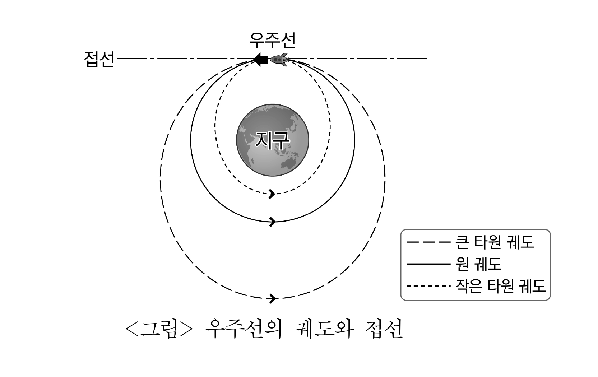
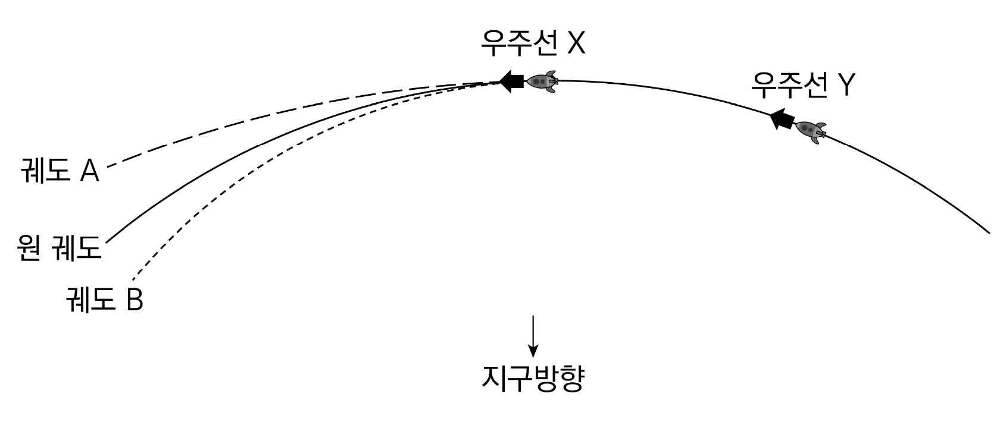

# [01-03] LU (2020)

다음 글을 읽고 물음에 답하시오.

## 제시문

법률은 언어로 기술되어 있다. 따라서 법조문의 의미도 원칙적으로 그 사회의 언어 문법에 따라 이해되어야 한다. 하지만 필요에 따라 법조문의 문법 단위들은 일반적 의미를 넘어서는 개념으로 나아가기도 한다. ‘-물(物)’은 물건이나 물질이라는 사전적 의미를 갖는 형태소인데, ‘창문(窓門)’의 ‘창’이나 ‘문’같이 독자적으로 쓰일 수 있는 자립형태소가 아니라 ‘동화(童話)’의 ‘동’과 ‘화’처럼 다른 어근과 결합할 필요가 있는 의존형태소이다. 이 ‘물’의 의미가 학설과 판례에서 그리고 입법에서도 새롭게 규정되어 가는 모습을 법의 세계에서 발견할 수 있다.

형사소송법은 압수의 대상을 “증거물 또는 몰수할 것으로 사료되는 물건”으로 정하고 “압수물”이라는 표현도 사용하고 있어서, 전통적으로 압수란 유체물(有體物)에 대해서만 가능한 것으로 이해되었다. 그런데 디지털 증거가 등장하고 그 중요성이 날로 높아짐에 따라 변화가 일게 되었다. 디지털 증거는 유체물인 저장 매체가 아니라, 그에 담겨 있으면서 그와 구별되는 무형의 정보 자체가 핵심이다. 또한 저장 매체 속에는 특정 범죄 사실에 관련된 정보 외에 온갖 사생활의 비밀까지 담긴 일도 많다. 그리하여 정보 그 자체를 압수해야 한다는 인식이 생겨났고, 마침내 출력이나 복사도 압수 방식으로 형사소송법에 규정되었다. 민사소송에서 증거조사의 대상이 되는 문서는 문자나 기호, 부호로써 작성자의 일정한 사상을 표현한 유형물이라 이해된다. 이 때문에 문자 정보를 담고 있는 자기 디스크 등을 문서로 볼 수 있는지에 대한 논쟁이 일었다. 이를 해결하기 위해 민사소송법 제374조에 “정보를 담기 위하여 만들어진 물건”에 대한 규정을 두게 되었지만, 여전히 매체 중심의 태도를 유지하고 있어서, 일찍이 정보 자체를 문서로 인정한 다른 여러 법률들과 대비된다. 최근에 제정된 법률에서는 위 조항에 대한 특칙을 두어 정보 자체를 문서로서 증거조사할 수 있는 근거도 마련되었다.

형법은 문서, 필름 등 물건의 형태를 취하는 음란물의 제조와 유포를 처벌하도록 하고 있다. 판례는 음란한 영상을 수록한 디지털 파일 그 자체는 유체물이 아니므로 음란물로 볼 수 없다고 보았다. 하지만 사회 문제로 대두된 아동 포르노그래피의 유포를 차단하기 위해 신설된 법령에서는 필름․비디오물․게임물 외에 통신망 내의 음란 영상에 대하여도 ‘아동․청소년 이용 음란물’로 규제한다. 비디오물과 게임물의 개념도 변화를 겪어 왔다. 과거에 게임 관계 법령에서 비디오물은 “영상이 고정되어 있는 테이프나 디스크 등의 물체”로 정의되었고, 게임물은 이에 포함되었다. 이후에 게임 산업이 발전하면서 새로운 법률을 제정하여 게임물에 대한 독자적 정의를 마련할 때, 유체물에 고정되어 있는지를 따지지 않는 영상물로 규정하기 시작하였다. 이 과정에서 게임물과 개념적으로 분리된 비디오물은 종전처럼 다루어질 수밖에 없었다. 하지만 곧이어 관련 법령이 정비되어 이 또한 “연속적인 영상이 디지털 매체나 장치에 담긴 저작물”이라 정의하게 되었다.

판례는 또한 재산 범죄인 장물죄에서 유통이 금지된 장물의 개념을 재물, 곧 취득한 물건 그 자체로 본다. 그러면서 전기와 같이 ‘관리할 수 있는 동력’은 장물이 될 수 있다고 한다. 그런데 동력에 대하여 재물로 간주하는 형법 제346조를 절도와 강도의 죄, 사기와 공갈의 죄, 횡령과 배임의 죄, 손괴죄에서는 준용하고 있지만, 장물죄에서는 그렇지 않다. 판례는 위 조문이 주의를 불러일으키는 기능을 할 뿐이라 보는 것이다. 그런데 재물을 팔아서 얻은 무언가는 이미 동일성을 상실한 탓에 더 이상 장물이 아니라 하였다. 또한 물건이 아닌 재산상 가치인 것을 취득했다고 해도 그 역시 장물은 아니라고 보았는데, 이에 대해서는 <u>㉠ 비판이</u> 있다. 오늘날 금융 거래 환경에서 금전이 이체된 예금계좌상의 가치가 유체물인 현금과 본질적으로 다르지 않다는 것이다. 언어의 의미는 사전에 쓰인 정의대로 고정되어 있기만 한 것이 아니라, 사람들이 그것을 사용하기에 따라 항상 새롭게 규정되는 것이며, 언어를 통해 비로소 인식되는 법의 의미도 마찬가지라 할 수 있다.

## 01

윗글의 내용과 일치하는 것은?

### 선택지

(1) 디지털 정보는 그것을 담고 있는 매체와 결합되어 있다는 특성 때문에 저장 장치를 압수하는 방식으로 압수 절차가 이루어져야 한다는 한계가 있다.
(2) 전자적 형태의 문자 정보는 문자나 기호로 되어 있지 않은 문서이기 때문에 정보 자체만을 증거조사의 대상으로 삼을 수 없다.
(3) 형법상 음란물은 유체물인 반면에 아동․청소년 이용 음란물은 무체물이란 점에서 양자의 차이가 있다.
(4) 비디오물은 영상이 매체나 장치에 담긴 저작물이라 정의되면서 유체물에 고정되어 있는지를 따질 필요가 없게 되었다.
(5) 게임물에 관한 입법의 변천 과정은 규제의 중심이 콘텐츠에서 매체로 옮겨갔음을 보여 준다.

## 02

㉠의 대상으로 가장 적절한 것은?

### 선택지

(1) 장물을 팔아서 생긴 현금을 장물죄의 적용 대상으로 보지 않는다는 태도
(2) 장물의 개념을 범죄로 취득한 물건 그 자체로 한정하여서는 안 된다는 태도
(3) 관리할 수 있는 전기도 현행 형법상 장물죄에서 규율하는 재물로 인정한다는 태도
(4) 은행 계정에 기록된 자산 가치에 대해서 장물죄의 규정을 적용하지 않는다는 태도
(5) 장물죄에서 형법 제346조의 준용이 없더라도 그 죄에서 규정하는 재물에는 동력이 포함된다는 태도

## 03

윗글을 바탕으로 <보기>를 설명할 때, 가장 적절한 것은?

### 보기

형법 제129조 제1항은 “공무원 또는 중재인이 그 직무에 관하여 뇌물을 수수, 요구 또는 약속한 때에는 5년 이하의 징역 또는 10년 이하의 자격정지에 처한다.”라고 규정한다. 이에 대한 근래의 판결에 “뇌물죄에서 뇌물(賂物)의 내용인 이익이라 함은 금전, 물품 기타의 재산적 이익뿐만 아니라 사람의 수요․욕망을 충족시키기에 족한 일체의 유형․무형의 이익을 포함하며, 제공된 것이 성적 욕구의 충족이라고 하여 달리 볼 것이 아니다.”라는 판시가 있었다.

### 선택지

(1) ‘뇌물’에서의 ‘물’은 사전적 의미보다 축소된 개념으로 해석되는 문법 단위이다.
(2) ‘뇌물’과 ‘장물’에서의 ‘물’은 자립형태소와 결합하지 않았다는 점에서, ‘증거물’에서의 ‘물’과 차이가 있다.
(3) ‘게임물’에서의 ‘물’은 물건에 한정되는 개념으로 변화함으로써 ‘뇌물’에서의 ‘물’보다 좁은 의미를 갖게 되었다.
(4) ‘뇌물’로 보는 대상에는 재물뿐 아니라 광범위한 이익까지 인정되므로, ‘뇌물’에서의 ‘물’과 ‘장물’에서의 ‘물’은 동일한 의미를 가진다.
(5) ‘압수물’의 개념 변화는 압수 방식을 새롭게 해석한 결과라는 점에서, ‘뇌물’에서 ‘물’의 의미 변화가 입법으로 규정한 결과라는 것과 차이가 있다.

# [04-06] LU (2020)

다음 글을 읽고 물음에 답하시오.

## 제시문

고려 말에는 관료들이 동시에 여러 처를 두는 경우나 처와 첩의 구분이 모호한 경우가 많았다. 이 때문에 토지나 봉작(封爵) 등을 누가 받을 것인가를 두고 친족 사이에 소송이 빈번하였다. 이러한 분쟁을 해결하고 성리학적 가족 윤리를 확립하기 위해 조선 태종 때부터 본격적으로 중혼 규제 방침을 정하였다.

1413년(태종 13)에 사헌부에서는, “부부는 인륜의 근본이니 적처와 첩의 분수를 어지럽히면 안 됩니다. 전 왕조 말에 이러한 기강이 무너졌으니 이제라도 바로잡아야 합니다. 앞으로는 혼서(婚書)의 유무와 혼례식 여부로 처와 첩을 구분하고, 처와 첩의 지위를 바꾼 경우에는 처벌 후 원래대로 바꾸며, 처가 있는데도 다시 처를 취한 자는 처벌 후 후처를 이혼시키십시오. 만약 당사자가 이미 죽어 바꾸거나 이혼할 수 없는 경우에는 선처(先妻)를 적처로 삼아 봉작하고 토지를 지급해야 할 것입니다.”라고 아뢰었다. 이것이 받아들여져 <u>㉠ 규제가</u> 시작되었다.

그런데 다음 해인 1414년(태종 14)에 대사헌 유헌 등은 위 규제를 기본으로 다음과 같이 몇 가지 <u>㉡ 수정 보완 기준을</u> 제시하였다. “세월이 많이 지나 증빙 자료가 많지 않습니다. 이제 은의(恩義)가 깊고 얕음과 동거 여부를 고려하여, 선처와는 은의가 약하고 후처와 종신토록 같이 살았다면, 후처라도 작첩(爵牒)과 수신전(守信田)을 주고 노비는 자식에게 균분(均分)하게 하십시오. 만약 처첩의 자식들 사이에 적통을 다투는 경우에는 신분, 혼서 및 혼례를 조사하여 판결하며, 처인지 첩인지에 따라 그 자식에게 노비를 차등 분급하게 하고, 세 명의 처를 둔 경우에는 선후를 논하지 말고, 그중 종신토록 같이 산 자에게 작첩과 수신전을 주되 노비는 세 처의 자식에게 균분하게 하십시오. 영락 11년(태종 13) 3월 11일 이후부터 처가 있는데 또 처를 얻은 자는 엄히 징계하여 후처와 이혼시키되, 그중 드러나지 않다가 아버지가 죽은 후 자손들이 적통을 다투면 선처를 적통으로 삼으십시오.”

이상의 기준은 이후 ｢육전등록｣에도 수록되어 실시되었다. 그런데 이제 자식이 아버지의 다른 처와 어떤 관계로 설정되어야 하는지에 논란이 발생하였다. 세종 때 이담 아들의 사례가 대표적이었다. 이담은 백 씨와 혼인한 상태에서 다시 이 씨에게 장가들었다. 이는 태종 13년 이전의 일이어서 처벌의 대상은 아니었으나, 1448년(세종 30) 이 씨가 사망하면서 새로운 문제가 발생하였다. 백 씨의 아들인 이효손이 이 씨를 위한 상복을 입지 않자, 이 씨의 아들인 이성손이 사헌부에 고발한 것이다. 이효손이 상복을 어떻게 입어야 하는지를 두고 다음과 같이 조정 관료들의 의견이 갈렸다.

<u>ⓐ 집현전에서</u> 아뢰기를, “예에는 두 명의 처를 두지 않는 것이 정도(正道)이지만, 전 왕조 말에 여러 명의 처를 두는 것이 너무 일반적이었으므로 한시적으로 모두 적처로 인정하였습니다. ｢육전등록｣에서 이미 여러 처를 인정하였으니 이효손은 이 씨를 위해서도 상복을 3년 입어야 합니다.”라고 하였다.

<u>ⓑ 예조에서</u> 아뢰기를, “｢육전등록｣에서 여러 처를 모두 인정하기는 하였으나 국가에서 주는 작첩과 수신전은 한 사람에게 그쳤습니다. 이는 국가가 정도를 지향하였음을 보여주는 것입니다. 백 씨는 선처이고 이담과 평생 동거하였으니 그 의리가 이 씨와 같지 않습니다. 이효손이 이 씨를 위해 친모와 똑같이 한다면 친모를 내치는 꼴이 될 것이므로 상복은 1년 입어야 합니다. 이렇게 한다고 해서 이 씨를 첩모로 대우하는 것에 이르지는 않을 것입니다.”라고 하였다.

<u>ⓒ 이조판서 정인지는</u> 아뢰기를, “예에는 두 명의 처를 두지 않는데, ｢육전등록｣에서 은의와 동거 여부를 고려함으로써 문란함을 방기하게 되었습니다. 이를 항구적인 법식으로는 삼을 수는 없으니, 두 아내의 아들들은 각각 자기 어머니에 대해서만 상복을 입게 해야 할 것입니다.”라고 하였다.

<u>ⓓ 경창부윤 정척은</u> 아뢰기를, “이 씨가 이효손에게 계모가 되는 것은 아니지만, ｢육전등록｣상 선처․후처의 법에 의거해서 이를 계모에 견주어 상복을 3년 입고, 훗날 백 씨의 상에는 이성손이 3년을 입게 하는 것이 좋겠습니다.”라고 하였다.

<u>ⓔ 어떤 이는</u> “이제라도 이 씨를 강등하여 첩모로 대우하여 첩모를 위한 상복을 입는 것이 마땅합니다.”라고 하였다.

## 04

윗글의 내용과 일치하는 것은?

### 선택지

(1) ㉠에서는 처와 첩을 구분할 때 생사 여부를 기준으로 하였다.
(2) ㉡에서는 처인지 첩인지에 따라 그 자식들에게 노비를 차등 분급하였다.
(3) ㉠과 달리 ㉡에서는 처를 첩으로 바꾸거나 첩을 처로 바꾸면 처벌을 받았다.
(4) ㉡과 달리 ㉠에서는 다처일 경우 모든 처와 이혼해야 하였다.
(5) ㉠과 ㉡ 모두에서 영락 11년 3월 11일 이후부터 은의와 동거 여부를 중혼 허용의 기준으로 삼았다.

## 05

ⓐ～ⓔ에 대한 설명으로 적절하지 <u>않은</u> 것은?

### 선택지

(1) ⓐ의 논리에 따르면 이성손은 백 씨 사후에 백 씨를 위해 3년간 상복을 입어야 한다.
(2) ⓑ의 논리에 따르면 아버지의 적처라도 경우에 따라 어머니로서의 대우에 대한 판단이 달라야 한다.
(3) ⓑ와 ⓒ 중 어느 쪽의 논리를 따르더라도 백 씨와 이 씨는 모두 적처로 인정된다.
(4) ⓒ와 ⓓ 중 어느 쪽의 논리를 따르는지에 따라 이효손이 이 씨를 위해 상복을 입는 여부가 달라진다.
(5) ⓓ와 ⓔ 중 어느 쪽의 논리에 따르더라도 이효손은 이 씨를 위해 상복을 입지 않아도 된다.

## 06

윗글을 바탕으로 <보기>에 대해 추론할 때, 적절하지 <u>않은</u> 것은?

### 보기

1415년(태종 15) 박일룡은 자신의 어머니를 적처로 인정하고 자신을 적자로 인정해달라며 소(訴)를 제기하였다. 그의 아버지 박길동은 이조판서를 지낸 인물로, 1390년(고려 공양왕 2) 상인(商人) 노덕만의 서녀(庶女)인 노 씨를 혼례 없이 들여 박일룡을 낳았다. 이후 박길동은 1395년(태조 4) 현감 김거정의 딸인 김 씨와 혼서를 교환하고 혼례를 거친 후 그 사이에 박이룡을 낳았다. 한편 김 씨와 혼인한 상태에서 1402년 대사헌 허생의 딸인 허 씨와 혼서를 교환하고 혼례를 거친 후 그 사이에 박삼룡을 낳았다. 김 씨는 친정인 창녕에 거주하였으며, 박길동은 허 씨와 한양에서 평생 동거하였다. 박이룡과 박삼룡 모두 어려서, 집안의 큰일은 첫아들인 박일룡이 실질적으로 도맡았다. 1413년 5월 박길동이 죽었는데, 이때에 이르러 박일룡이 소를 제기한 것이었다.

### 선택지

(1) 박길동 사망 직후에 소가 제기되어 그 해에 판결되었다면, 작첩과 수신전은 김 씨에게 주어졌을 것이다.
(2) 박길동이 소가 제기될 당시까지 생존해 있었다고 해도 중혼에 대해 처벌받지는 않았을 것이다.
(3) 박일룡이 집안의 일을 주관하는 아들이라는 점은 판결에 영향을 주지 않았을 것이다.
(4) 이 소송에서 작첩과 수신전은 은의나 동거 여부를 따져 허 씨에게 주어졌을 것이다.
(5) 이 소송에서는 세 명의 처를 둔 경우의 규정을 적용하여 판결이 내려졌을 것이다.

# [07-09] LU (2020)

다음 글을 읽고 물음에 답하시오.

## 제시문

현대 생명과학의 핵심적인 키워드들 중 하나는 오믹스(omics)이다. 단일 유전자, 단일 단백질의 기능과 구조 분석에 집중하였던 과거의 생명과학과 달리, 오믹스는 거시적인 관점에서 한 개체, 혹은 하나의 세포가 가지고 있는 유전자 전체의 집합인 ‘유전체’를 연구하는 유전체학, RNA 전체 즉 ‘전사체’에 대한 연구인 전사체학, 단백질 전체의 집합인 ‘단백질체’를 연구하는 단백질체학 등의 연구를 통칭한다.

분자생물학 이론에 따르면 DNA가 가지고 있는 유전자 정보의 일부만이 전사 과정을 통해 RNA로 옮겨진다. 그리고 RNA 중의 일부만이 번역 과정을 통해 단백질로 만들어진다. 어떠한 생물 개체나 어떠한 세포와 같은 특정 생명 시스템의 유전체는 그 시스템이 수행 가능한 모든 기능에 대한 유전 정보를 총괄하여 가지고 있다. 한 인간이라는 시스템과 그 인간의 간(肝)세포라는 또 다른 시스템의 유전체는 동일한 정보를 가지고 있지만, 인간의 간세포와 생쥐의 간세포의 유전체는 각각 서로 다른 정보를 가지고 있다. 한편 전사체는 유전체 정보의 일부분 즉 유전체 정보들 중 현재 수행 중일 가능성이 큰 기능에 대한 정보를 가지고 있고, 단백질체는 전사체의 일부분 즉 실제로 수행 중인 기능에 대한 정보를 담고 있다. <u>㉠ 생명체에서 생화학 반응의 촉매 작용과 같은 필수적인 ‘일’을 직접 수행하는 물질은 단백질체를 이루는 단백질들이다.</u>

인간에게는 2만 종 이상의 단백질이 있고, 인체의 세포들은 종류에 따라 전체 단백질 중 일부를 서로 다른 조합으로 가지고 있다. 즉 피부 세포, 신경 세포, 근육 세포 등에서 공통으로 발견되는 단백질도 있고, 한 종류의 세포에서만 발견되는 단백질도 있다. 세포는 외부의 자극이나 내재된 프로그램에 의해 한 종류에서 다른 종류의 세포로 변화하는 과정을 겪는데, 이러한 현상을 ‘분화’라고 한다. 분화를 통해 다른 세포로 변하게 되면 가지고 있는 단백질의 조합도 달라진다. 세포의 분화는 개체 발생 과정에서 주로 관찰되지만, 정상 세포가 암세포로 바뀌는 과정도 분화 과정이라 할 수 있다.

어떤 환자의 암세포와 정상 세포를 대상으로 단백질체학 응용 연구를 수행하는 경우를 생각해 보자. 암세포의 단백질체와 정상 세포의 단백질체를 서로 비교해 보면, 정상 세포에 비하여 암세포에서 양이 변화되어 있는 단백질을 발견할 수 있다. 과학자들은 이러한 단백질을 새로운 암 치료 표적 단백질 후보로 찾아내어 연구를 진행한다. <u>㉡ 암세포에서 정상 세포보다 양이 늘어나 있는 단백질은 발암 단백질의 후보가 될 수 있고, 암세포에서 정상 세포보다 양이 줄어든 단백질은 암 억제 단백질의 후보가 될 수 있다.</u>

그렇다면 이렇게 찾아낸 단백질이 2만 종 이상의 단백질 중 어느 것인지 알아내는 과정은 어떻게 진행될까? 단백질은 20종류의 아미노산이 일렬로 연결된 형태를 가지며, 단백질 하나의 아미노산 개수는 평균 500개 정도이다. 서로 다른 단백질은 서로 다른 아미노산 서열을 가지기 때문에 특정 단백질의 아미노산 서열을 알면 그 단백질이 어떤 단백질인지 알아낼 수 있다.

단백질의 아미노산 서열을 알기 위한 실험 방법은 여러 가지가 있는데, 그중의 하나가 펩타이드의 분자량 분석이다. 미지의 단백질에 트립신을 가하여 평균 10개 정도의 아미노산으로 이루어진 조각인 펩타이드로 자른 후 분자량을 측정한다. 트립신은 특정 아미노산을 인지하여 자르므로 어떤 아미노산과 아미노산 사이가 잘릴 것인지 예측할 수 있다. 실제로 단백질체를 분석한 데이터는 펩타이드의 분자량 값과 펩타이드들 간의 상대적인 양을 숫자로 표현한 값으로 나타난다. 모든 인간 단백질의 아미노산 서열, 아미노산의 분자량이 이미 알려져 있으므로, 암세포 단백질체와 정상 세포 단백질체에 트립신을 가하여 얻은 <u>㉢ 펩타이드의 분자량 분석을 통해 치료용 표적 후보 단백질을 알아낼 수 있다.</u>

## 07

윗글의 내용과 일치하는 것은?

### 선택지

(1) 신경 세포의 모든 RNA는 단백질로 번역된다.
(2) 인간 간세포의 유전체 정보는 인간 간세포의 단백질체 정보의 일부이다.
(3) 인간 간세포의 단백질체 정보는 생쥐 간세포의 단백질체 정보와 동일하다.
(4) 암세포는 피부나 근육의 세포와 달리 정상 세포에서 분화한 것이 아니다.
(5) 암세포의 단백질체 정보는 정상 세포의 단백질체 정보와 동일하지 않다.

## 08

윗글에서 추론한 내용으로 적절하지 <u>않은</u> 것은?

### 선택지

(1) 세포의 분화 과정 동안 세포의 유전체 정보는 변화하지 않는다.
(2) 어떤 단백질에 트립신을 첨가한 후에 생성되는 펩타이드들의 아미노산 서열은 동일하다.
(3) 인간의 신경 세포와 근육 세포의 기능이 서로 다른 이유는 단백질체 정보가 서로 다르기 때문이다.
(4) 어떤 단백질의 아미노산 서열을 알면 트립신 처리 후 그 단백질에서 생성될 펩타이드들의 분자량을 예측할 수 있다.
(5) 어떤 단백질에서 유래한 특정 펩타이드의 양이 정상 세포에서 보다 암세포에서 더 많다면 그 단백질은 발암 단백질의 후보이다.

## 09

㉠～㉢에 대한 <보기>의 설명 중 적절한 것만을 있는 대로 고른 것은?

### 보기

ㄱ. 최초의 생명체가 DNA나 단백질은 가지고 있지 않고 RNA만 가지고 있었다면, ㉠의 설득력은 약화된다.

ㄴ. 양이 많아지면 덩어리를 이루어 오히려 기능이 비활성화되는 단백질이 있다면, ㉡의 설득력은 약화된다.

ㄷ. 트립신을 첨가한 서로 다른 단백질에서 같은 분자량을 지닌 펩타이드가 생성된다면, ㉢의 설득력은 강화된다.

### 선택지

(1) ㄱ
(2) ㄷ
(3) ㄱ, ㄴ
(4) ㄴ, ㄷ
(5) ㄱ, ㄴ, ㄷ

# [10-12] LU (2020)

다음 글을 읽고 물음에 답하시오.

## 제시문

채만식의 소설 ｢탁류｣는 1935년에서 1937년에 이르는 2년간의 이야기로, 궁핍화가 극에 달해 연명에 관심을 가질 수밖에 없었던 조선인의 현실을 중요한 문제로 삼은 작품이다. 그런데 채만식이 ｢탁류｣에서 현실을 대하는 태도에는 식민지 근대화 과정에 대한 작가의 민감한 시선이 들어 있었다. 그는 전 지구적 자본주의 시스템과 토착적 시스템의 갈등에 의해서 만들어진, 게다가 식민지적 상황 때문에 더욱더 굴곡진 수많은 우여곡절에 주목하였다. 채만식의 민감한 시선은 ｢탁류｣에서 집중적으로 그려진 <kbd>‘초봉’의 몰락 과정</kbd>에서도 구체적으로 드러난다. 그것은 인간과 사물을 환금의 가능성으로만 파악하는 자본주의의 기제가 인간의 순수한 영혼을 잠식해 들어가고, 그러면서 그 이윤 추구의 원리를 확대 재생산하는 과정을 보여 준다.

소설의 앞부분에서 초봉은 경제적 어려움에 시달리는 가족을 위해서라면 자기희생을 마다하지 않는 순수한 영혼의 소유자로 등장한다. 태수는 그런 초봉에게 끊임없이 베풀면서 초봉을 그녀의 <u>㉠ 고유한 영토로부터</u> 끌어낸다. 그런 베풂을 순수 증여라고 해도 될까. 아니, 꽤나 검은 의도를 숨기고 행한 증여이니 그것은 사악한 증여라고 해야 할 터이다. 하여간 태수는 끊임없이 증여하고 선물하면서 초봉의 고유한 모럴, 그러니까 노동을 통해 조금씩 무언가를 축적해 가는 삶의 방식을 회의에 빠뜨린다. 그리고 그 증여 행위를 집요하게 반복함으로써 초봉의 호의적인 시선을 얻어낸다. 하지만 그 순간이란 <u>㉡ 하나의 변곡점과도</u> 같은 것이었다. 그때부터 그는 초봉에게 증여한 것의 대가로 무언가를 요구함으로써 초봉을 타락한 교환가치의 세계 속으로 끌어들인다.

초봉이 교환의 정치경제학에 익숙해질 무렵, 제호가 초봉에게 접근한다. 제호는 객관적인 지표를 가지고 초봉의 육체를 돈으로 측량하고 그와의 거래를 제안한다. 초봉 또한 제호가 자신의 상품성을 그만치 높게 봐 주자 이 거래를 흔쾌하게 받아들인다. 비록 그 교환이 서로 간의 의지가 관철된 것이었어도 이 거래 이후로 초봉은 상품으로 전락하게 된다. 그리고 그런 초봉에게 형보가 나타나 초봉과 송희 모녀의 호강을 구실로 가학성을 노골적으로 드러내면서 잉여의 성적 착취를 반복한다. 형보는 이 타락한 사회에 동화된 초봉이 어떠한 고통을 겪게 될지라도 이 세계 바깥으로 나갈 용기를 낼 수 없을 것이라고 확신하고 있었기에 초봉의 거부감을 아랑곳하지 않았다.

‘초봉의 몰락’은 이렇듯 초봉이 교환의 정치경제학을 자기화함으로써 <u>㉢ 영혼이 없는 자동인형으로</u> 전락하는 것으로 귀결되었다. 그리고 그 과정에서 초봉은 아버지 정주사가 미두*로 일확천금을 꿈꾸듯 자신의 인격을 버리고 스스로를 상품으로 만들어 나갔다. 자신에 대한 착취에 강렬한 거부감을 가지기도 하였지만 결국에는 모든 것을 상품화하는, 특히 여성의 몸을 상품화하는 자본주의 기제의 <u>㉣ 노회함과 집요함</u> 앞에 굴복하고 말았다. 그렇다면 ｢탁류｣에는 추악한 세상의 탁류에서 벗어날 가능성이 전혀 없는 것일까? 채만식은 ｢탁류｣에서 그 특유의 냉정한 태도로 한편으로는 부정적인 삶의 양태들을 냉소하고 풍자하는가 하면, 다른 한편으로는 보다 의미 있는 삶의 형식 혹은 보다 나은 미래를 가능케 할 잠재적 가능성이나 가치들을 끈질기게 탐색해 내었다.

“위험이 있는 곳에 구원의 힘도 함께 자란다.”라는 <u>㉤ 횔덜린의 말을</u> 좀 뒤집어 말하자면, ｢탁류｣가 세상을 위험이 가득한 곳으로 묘사할 수 있었던 것은 아마도 그 위험 속에 같이 자라는 구원의 힘을 어느 정도 감지했기 때문이리라. 그 구원의 가능성은 소설의 결말 부분에서 초봉이 형보를 죽였다는 점으로만 한정되지는 않는다. ｢탁류｣에는 개념의 위계를 갖춰 계기가 제시되는 것은 아니나 타락한 교환의 질서 바깥으로 나갈 수 있는 여러 계기들이 곳곳에 흩어져 있다. 딸 송희를 낳으면서 초봉이 어머니 마음을 갖게 되는 것도, 자유주의자이자 냉소주의자인 계봉이 일하는 만큼의 대가를 얻어야 한다는 철칙을 지니고 살아가는 것도, 승재가 남에게 그저 베풀려고 하는 것도 모두 그에 해당하는 것들이다. 이것들 중에서도 초봉과 승재의 삶에서 드러나는 증여의 삶은 ｢탁류｣가 타락한 세계를 넘어설 수 있는 길로 제시하는 것이며, 이를 우리는 ‘증여의 윤리’라고 부를 수 있을 터이다.

* 미두(米豆) : 미곡의 시세를 이용하여 약속으로만 거래하는 일종의 투기 행위

## 10

윗글에 대한 설명으로 가장 적절한 것은?

### 선택지

(1) 시대의 특수성을 고려하여 삶의 양태에 대한 소설가의 비판적 인식을 추적한다.
(2) 인물의 내면 심리에 대한 세밀한 분석을 통해 소설가의 내면 심리를 천착한다.
(3) 궁핍으로 인한 연명의 문제보다 윤리의 문제를 중시한 소설가의 인식을 비판한다.
(4) 인간의 존재론적 모순에 대한 소설가의 염세적 시선에 주목하여 삶의 의미를 반추한다.
(5) 현실을 대하는 소설가의 이중적 태도를 인물들이 표방하는 이념의 분석을 통해 통찰한다.

## 11

<kbd>‘초봉’의 몰락 과정</kbd>과 관련하여 ㉠～㉤을 이해할 때, 적절하지 <u>않은</u> 것은?

### 선택지

(1) ㉠은 자본주의 기제로부터 영향을 받기 이전에 가족에 대한 증여자로서 ‘초봉’이 지녔던 순수한 영혼을 환기한다.
(2) ㉡은 ‘초봉’이 노동에 의해 빈곤에서 벗어날 수 있다는 믿음을 되찾으면서 교환의 정치경제학이라는 틀 속에 빠져들기 시작한다는 점을 알려준다.
(3) ㉢은 ‘초봉’이 물신주의적 가치관을 수용하게 됨으로써 인간과 사물을 환금의 가능성으로만 파악하게 되었음을 나타낸다.
(4) ㉣은 ‘초봉’의 몰락 과정이 순진성의 세계를 끈덕지고도 교활하게 파괴하는 식민지 근대화 과정과 상통함을 보여 준다.
(5) ㉤은 구원의 힘이 역설적 방식으로 존재함을 강조하는 것으로, 왜곡된 자본주의 논리를 벗어날 힘이 ‘초봉’의 몰락 과정에서 생성되어 가기도 함을 시사해 준다.

## 12

윗글을 바탕으로 <보기>를 감상할 때, 적절하지 <u>않은</u> 것은?

### 보기

계봉이는 승재가 오늘도 아침에 밥을 못 하는 눈치를 알고 가서, 더구나 방세가 밀리기는커녕 이달 오월 치까지 지나간 사월달에 들여왔는데, 또 이렇게 돈을 내놓는 것인 줄 잘 알고 있다.

계봉이는 승재의 그렇듯 근경 있는 마음자리가 고맙고, 고마울 뿐 아니라 이상스럽게 기뻤다. 그러나 그러면서도 한편으로는 얼굴이 꼿꼿하게 들려지지 않을 것같이 무색하기도 했다.

“이게 어인 돈이고?”

계봉이는 돈을 받는 대신 뒷짐을 지고 서서 준절히 묻는다.

“그냥 거저…….”

“그냥 거저라니? 방세가 이대지 많을 리는 없을 것이고…….”

“방세구 무엇이구 거저, 옹색하신데 쓰시라구…….”

계봉이는 인제 알았다는 듯이 고개를 두어 번 까댁까댁하더니,

“나는 이 돈 받을 수 없소.”

하고는 입술을 꽉 다문다. 장난엣말로 듣기에는 음성이 너무 강경했다.

승재는 의아해서 계봉이의 얼굴을 짯짯이 건너다본다. 미상불, 여전한 장난꾸러기 얼굴 그대로는 그대로지만, 그러한 중에도 어디라 없이 기색이 달라진 게, 일종 오만한 빛이 드러났음을 볼 수가 있었다.

승재는 분명히 단정하기는 어려우나, 혹시 나의 뜻을 무슨 불순한 사심인 줄 오해나 받은 것이 아닌가 하는 생각도 들었다. 그렇게 생각하고 보니, 비록 마음이야 담담하지만 일이 좀 창피한 것도 같았다. (중략)

계봉이는 문제된 오 원짜리 지전을 내려다본다. 아무리 웃고 말았다고는 하지만 그대로 집어 들고 들어가기가 좀 안되었다. 그러나 그렇다고 종시 안 가지고 가기는 더 안되었다. 잠깐 망설이다가 할 수 없이 그는 돈을 집어 든다.

- 채만식, ｢탁류｣ -

### 선택지

(1) 초봉을 전락시킨 돈은 이윤 추구 원리의 작동을, 승재가 계봉에게 건네는 ‘돈’은 순수 증여를 표상하는 것으로 볼 수 있겠군.
(2) 제호는 속물주의적 논리를 통해 자신의 의지를 관철하고, 승재는 ‘마음’의 가치를 통하여 자신의 선의를 드러낸다고 볼 수 있겠군.
(3) 형보는 돈의 위력을 믿고 초봉의 고통을 아랑곳하지 않고, 계봉은 자존심 때문에 ‘근경 있는 마음자리’에 대해 양가적인 태도를 보인다고 볼 수 있겠군.
(4) 태수의 과잉 증여와는 달리, 승재의 증여는 대가를 바라는 ‘불순한 사심’을 지니지 않은 것이기에 타락한 교환 세계에서 벗어날 희망의 표지로 볼 수 있겠군.
(5) 교환의 정치경제학을 무의식적으로 자기화한 초봉과는 달리, ‘입술’을 꽉 다무는 계봉의 모습은 ‘증여의 윤리’를 의식적으로 수용하려는 태도를 나타낸 것으로 볼 수 있겠군.

# [13-15] LU (2020)

다음 글을 읽고 물음에 답하시오.

## 제시문

‘좋은 세금’의 기준과 관련하여 조세 이론은 공정성과 효율성을 거론하고 있다. 경제주체들이 경제적 능력 혹은 자신이 받는 편익에 따라 세금을 부담하는 경우 공정한 세금이라는 것이다. 또한 조세는 경제주체들의 의사 결정을 왜곡하여 조세 외에 추가로 부담해야 하는 각종 손실 또는 비용, 즉 초과 부담이라는 비효율을 초래할 수 있는데 이러한 왜곡을 최소화하는 세금이 효율적이라는 것이다.

19세기 말 <u>㉠ 헨리 조지가</u> 제안했던 토지가치세는 이러한 기준에 잘 부합하는 세금으로 평가되고 있다. 그는 토지 소유자의 임대 소득 중에 자신의 노력이나 기여와는 무관한 불로소득이 많다면, 토지가치세를 통해 이를 환수하는 것이 바람직하다고 주장했다. 토지에 대한 소유권은 사용권과 처분권 그리고 수익권으로 구성되는데, 사용권과 처분권은 개인의 자유로운 의사에 맡기고 수익권 중 토지 개량의 수익을 제외한 나머지는 정부가 환수하여 사회 전체를 위해 사용하자는 것이 토지가치세의 기본 취지이다. 조지는 토지가치세가 시행되면 다른 세금들을 없애도 될 정도로 충분한 세수를 올려줄 것이라고 기대했다. 토지가치세가 토지단일세라고도 지칭된 것은 이 때문이다. 그는 토지단일세가 다른 세금들을 대체하여 초과 부담을 제거함으로써 경제 활성화에 크게 기여할 것으로 보았다. 토지단일세는 토지를 제외한 나머지 경제 영역에서는 자유 시장을 옹호했던 조지의 신념에 잘 부합하는 발상이었다.

토지가치세는 불로소득에 대한 과세라는 점에서 공정성에 부합하는 세금이다. 조세 이론은 수요자와 공급자 중 탄력도가 낮은 쪽에서 많은 납세 부담을 지게 된다고 설명한다. 토지는 세금이 부과되지 않는 곳으로 옮길 수 없다는 점에서 비탄력적이며 따라서 납세 부담은 임차인에게 전가되지 않고 토지 소유자가 고스란히 떠안게 된다는 점에서 토지가치세는 공정한 세금이 된다. 한편 토지가치세는 초과 부담을 최소화한다는 점에서 효율적이기도 하다. 통상 어떤 재화나 생산요소에 대한 과세는 거래량 감소, 가격 상승과 함께 초과 부담을 유발한다. 예를 들어 자동차에 과세하면 자동차 거래가 감소하고 부동산에 과세하면 지역 개발과 건축업을 위축시켜, 초과 부담이 발생하게 된다. 그러나 토지가치세는 토지 공급을 줄이지 않아 초과 부담을 발생시키지 않는다. 토지가치세 도입에 따른 여타 세금의 축소가 초과 부담을 줄여 경제를 활성화한다는 G7 대상 연구에 따르면, 이러한 세제 개편으로 인한 초과 부담의 감소 정도가 GDP의 14∼50%에 이른다.

하지만 토지가치세는 일부 국가를 제외하고는 현실화되지 못했는데, 여기에는 몇 가지 이유가 있다. 토지가치세는 이론적인 면에서 호소력이 있으나 현실에서는 복잡한 문제가 발생한다. 토지에 대한 세금이 가공되지 않은 자연 그대로의 토지에 대한 세금이어야 하나 이러한 토지는 현실적으로 찾기 어렵다. 토지 가치 상승분과 건물 가치 상승분의 구분이 쉽지 않다는 것도 어려움을 가중한다. 토지를 건물까지 포함하는 부동산으로 취급하여 그에 과세하는 국가에서는 부동산 거래에서 건물을 제외한 토지의 가격이 별도로 인지되는 것이 아니므로, 건물을 제외한 토지의 가치 평가가 어렵다. 조세 저항도 문제가 된다. 재산권 침해라는 비판이 거세지면 토지가치세를 도입하더라도 세율을 낮게 유지할 수밖에 없어, 충분한 세수가 확보되지 않을 수 있다. 토지가치세는 빈곤과 불평등 문제에 대한 조지의 이상을 실현하는 데에도 적절한 해법이 되지 못한다는 비판에 직면하고 있다. 백 년 전에는 부의 불평등이 토지에서 비롯되는 부분이 컸지만, 오늘날 전체 부에서 토지가 차지하는 비중이 19세기 말에 비해 크게 감소했다. 토지 소유의 집중도 또한 조지의 시대에 비해 낮다. 따라서 토지가치세의 소득 불평등 해소 능력에도 의문이 제기된다.

오늘날 토지가치세는 새롭게 주목받고 있는데, 이는 ‘외부 효과’와 관련이 깊다. 첨단산업 분야의 대기업들이 자리를 잡은 지역 주변에는 인구가 유입되고 일자리가 늘어난다. 하지만 임대료가 급등하고 혼잡도 또한 커진다. 이 과정에서 해당 지역의 부동산 소유자들은 막대한 이익을 사유화하는 반면, 임대료 상승이나 혼잡비용 같은 손실은 지역민 전체에게 전가된다. 이러한 상황에서 높은 세율의 토지가치세가 본격적으로 실행에 옮겨질 수 있다면 불로소득에 대한 과세를 통해 외부 효과로 인한 피해를 보상하는 방안이 될 수 있다.

## 13

㉠에 대한 설명으로 가장 적절한 것은?

### 선택지

(1) 개량되지 않은 토지에서 나오는 임대료 수입은 불로소득으로 여겼다.
(2) 토지가치세로는 재정에 필요한 조세 수입을 확보할 수 없다고 보았다.
(3) 토지의 처분권은 보장하되 사용권과 수익권에는 제약을 두자고 주장하였다.
(4) 토지가치세는 경제적 효율성 제고를 통하여 공정성을 높이는 방안이라고 보았다.
(5) 모든 경제 영역에서 시장 원리를 사회적 가치에 부합하게 규제해야 한다고 주장하였다.

## 14

윗글에서 추론한 내용으로 적절하지 <u>않은</u> 것은?

### 선택지

(1) 정부가 높은 세율의 토지가치세를 도입한다면, 외부 효과로 발생한 이익의 사유화를 완화할 수 있을 것이다.
(2) 자동차세의 인상이 자동차 소비자들의 의사 결정에 영향을 미치지 않는다면, 자동차세는 세수 증대에 효과적일 것이다.
(3) 토지가치세가 단일세가 되어 누진세인 근로소득세가 폐지된다면, 고임금 근로자가 저임금 근로자보다 더 많은 혜택을 얻게 될 것이다.
(4) 조지의 이론을 계승하는 학자라면, 부가가치 생산에 기여한 부분에 대해서는 세금을 부과하지 않는 것이 바람직하다고 보았을 것이다.
(5) 부동산에 대해 토지와 건물을 구분하여 과세할 수 있다면, 토지가치세의 도입으로 토지의 공급 감소와 가격 상승 문제가 해소되어 조세 저항이 줄어들 것이다.

## 15

윗글을 바탕으로 <보기>의 사례를 평가할 때, 적절하지 <u>않은</u> 것은?

### 보기

◦ X국은 요트 구매자에게 높은 세금을 부과하는 사치세를 도입하여 부유층의 납세 부담을 늘리려고 하였다. 그러나 부자들은 요트 구매를 줄이고 지출의 대상을 바꾸었다. 반면 요트 생산 시설은 다른 시설로 바꾸기 어려웠고 요트 공장에서 일하던 근로자들은 대량 해고되었다. 아울러 X국은 근로소득세를 인상해서 부족한 세수를 보충하였다.

◦ Y국은 국민의 건강 증진을 위해 담배 소비를 줄이려는 목표로 담배세를 인상하였다. 그러나 담배세 인상으로 인한 담배 가격 상승에도 불구하고 담배 소비는 거의 감소하지 않았다. 정부의 조세 수입은 크게 증가하였지만 소비자들의 불만이 고조되었다.

### 선택지

(1) 공급자에게 부과되는 토지가치세와 달리, X국의 ‘사치세’ 및 Y국의 ‘담배세’는 소비자에게 부과되고 있군.
(2) 초과 부담을 발생시키는 X국의 ‘사치세’와는 달리, Y국의 ‘담배세’ 및 토지가치세는 초과 부담을 거의 발생시키지 않는군.
(3) 과세 대상자 이외의 타인에게 납세 부담이 추가되는 X국의 ‘사치세’와 달리, Y국의 ‘담배세’와 토지가치세에서는 납세 부담이 과세 대상자에게 집중되는군.
(4) 탄력도가 낮은 쪽에서 납세 부담을 지게 만들 수 있는 토지가치세와 달리, X국의 ‘사치세’ 및 Y국의 ‘담배세’는 탄력도가 높은 쪽에서 납세 부담을 지게 하는군.
(5) 조세 개편의 정책 목표를 달성하지 못한 X국의 ‘사치세’ 및 Y국의 ‘담배세’와 달리, 토지가치세는 도입할 때 거둘 수 있는 경제 활성화 효과가 최근 연구에서 확인되고 있군.

# [16-18] LU (2020)

다음 글을 읽고 물음에 답하시오.

## 제시문

20세기 초 프랑스에서 발생한 드레퓌스 사건은 지식인이라는 집단을 조명하고, 억압적 권력에 저항하는 비판적 지식인이라는 이상을 부각하는 계기가 되었다. 신학을 중심으로 지식이 축적되고 수도원의 사제들이 권력을 행사하는 전문가 지식인으로 존재했던 중세에도 아벨라르와 같은 비판적 지식인이 존재했다. 계몽주의 시대에는 특정 분야를 깊이 파고들지 못하더라도 모든 분야를 두루 섭렵할 수 있는 능력을 지닌 사람을 지식인으로 정의하기도 했다. 한 예로 18세기의 백과전서파는 근대적 분류 체계로 지식을 생산해 개인이 시각 매체에 의존하여 지식을 소비하는 문자 문화 시대의 지평을 열었다. 이런 과정에서 지식 권력은 지식의 표준 장악을 둘러싸고 중앙 집중화되었다.

드레퓌스 사건은 근대적 지식인상에 대한 논쟁을 불러일으켰다. <u>㉠ 만하임은</u> 지식인 가운데도 출신, 직업, 재산, 정치적․사회적 지위 등에 차이가 있는 경우가 많기에 지식인을 단일 계급으로 간주할 수 없으며, 지식인은 보편성에 입각해 사회의 다양한 계급적 이해들을 역동적으로 종합하여 최선의 길을 모색해야 한다고 보았다. 반면 <u>㉡ 그람시는</u> 계급으로부터 독립적인 지식인이란 신화에 불과하다고 지적하면서 계급의 이해에 유기적으로 결합하여 그것을 당파적으로 대변하는 유기적 지식인을 대안으로 제시하였다. 이때 소외 계급의 해방을 위한 과제는 역사적 보편성을 지니며, 지식인은 소외 계급에게 혁명적 자의식을 불어넣고 조직하는 역할을 자임한다. <u>㉢ 사르트르는</u> 만하임과 그람시의 지식인 개념 사이에서 긴장을 유지했다. 부르주아 계급에 속한 지식인은 지배 계급이 요구하는 당파적 이해와 지식인이 추구해야 할 보편적 지식 간의 모순을 발견하고, 보편성에 입각하여 소외 계급의 해방을 추구해야 한다. 하지만 그 지식인은 결코 유기적 지식인이 될 수 없는 존재이다. 결국 소외 계급에서 출현한 전문가가 유기적 지식인이 되도록 계급의식을 일깨우는 계몽적 역할이 지식인에게 부여되는 것이다.

오늘날 인터넷의 발달로 가상공간이 열려 <kbd>탈근대적 지식 문화</kbd>와 사회 공간이 창조되면서 지식의 개념도 변하고 있다. 또한 디지털화된 다양한 정보들이 연쇄적으로 재조합되면서 하이퍼텍스트 형태를 띠게 된다. 정해진 시작과 끝이 없고 미로나 뿌리줄기같이 얽혀 있어 독자의 입장에서 어떤 길을 선택하느냐에 따라 텍스트의 복수성이 무한해졌다. 그 결과 지식 생산자에 해당하는 저자의 권위는 사라지고 지식 권력은 탈중심화된다. 하이퍼텍스트와 새로운 독자의 탄생은 집단적이고 감정이입적인 구술 문화가 지녔던 특성들을 지식 문화에서 재활성화한다. 특히 가상공간에서 정보와 지식이 공유와 논박을 거쳐 소멸 또는 확산되는 과정은 새로운 지식을 생산해 내는 기제로서 집단 지성을 출현시킨다. 집단 지성은 엘리트 집단으로부터 지식 권력을 회수하고 새로운 민주주의의 가능성을 열어놓기도 한다. 그러나 이는 대중의 자율성에 기초한 참여와 협업을 전제할 때 가능하며, 참여와 협업이 결여될 때 순응주의가 등장하고 집단 지성은 군중심리로 전락할 수도 있다.

하이퍼텍스트 시대에 집단 지성이 출현함에 따라 기존의 지식인상은 재조명될 필요가 있다. 특히 프랑스 68혁명 이후 등장했던 이론가들을 소환할 만하다. 예를 들어 <u>㉣ 푸코는</u> 대중의 대변자로서의 지식인이 불필요한 시대에서도 여전히 대중의 지식 및 담론을 금지하고 봉쇄하는 권력 체계와 이 권력 체계의 대리인 역할을 자임하는 고전적 지식인의 존재에 주목했다. 푸코는 이들을 보편적 지식인으로 규정한 후 이를 대체할 새로운 지식인상으로 특수적 지식인을 제시했다. 그가 말하는 특수적 지식인은 거대한 세계관이 아니라 특정한 분야에서 전문적인 지식을 지니고 있는 존재이다. 그리고 자신의 분야에 해당하는 구체적인 사안에 정치적으로 개입하면서 일상적 공간에서 투쟁한다. 푸코에 따르면 진실한 담론은 지식과 미시권력 간의 관계에서 발견될 뿐이다.

한편 지식인상의 탈근대적 모색에 있어 근대론적 시각을 더하려는 시도도 있다. <u>㉤ 부르디외에</u> 따르면, 지식인은 사회 총자본의 관점에서 볼 때에는 지배 계급에 속하지만, 경제 자본보다 문화 자본의 비중이 더 큰 문화생산자적 속성을 지니며, 시장의 기제에 따라 부르주아지에 의해 지배받는다. 이런 점에서 볼 때 지식인은 피지배 분파에 속한다. 따라서 이 문화생산자들은 각자의 특수한 영역에 대한 상징적 권위를 가지고 지식인의 자율성을 위협하는 권력에 저항하며 사회 전체에 보편적인 가치를 전파해 나가는 투쟁을 전개할 때에만 비로소 지식인의 범주에 들 수 있다. 부르디외는 이 과정에서 역사적인 따라서 한시적인 보편을 개념화한다. 그리고 지식인은 정치활동을 통하여 권력이 보편적인 것처럼 제시하는 특수성들을 역사화하는 역할과, 보편적인 것, 예컨대 과학․철학․문학․법 등에 접근하는 조건들을 보편화하는 역할을 함께 수행한다.

## 16

윗글의 내용과 일치하는 것은?

### 선택지

(1) 권력에 대한 비판적 지식인은 드레퓌스 사건과 함께 비로소 출현했다.
(2) 계몽주의 시대의 지식인은 특정 분야의 전문가라는 특권적 위상을 지녔다.
(3) 근대의 지식인은 개개인의 차이에도 불구하고 보편성을 추구해야 하는 존재로 인식되었다.
(4) 탈근대의 지식인은 자신의 전문 분야에서 제기되는 문제의 정치적 특성을 인정하지 않으려는 존재이다.
(5) 탈근대의 대중은 자율적인 참여와 협업에 기초하여 권력에 대한 순응주의로부터 벗어났다.

## 17

<kbd>탈근대적 지식 문화</kbd>에 관한 설명으로 가장 적절한 것은?

### 선택지

(1) 구술 문화적 특성을 공유하는 다양한 텍스트들이 형성되고 지식이 전파된다.
(2) 지식의 표준을 장악하려는 경쟁을 통해 중앙 집중적 지식 권력의 영향력이 커진다.
(3) 사회적 지식의 형성에서 지식을 처음 생산한 자의 권위가 이전 시대보다 강화된다.
(4) 문화생산자적 속성을 지닌 지식인의 사회적 지위가 부르주아 계급에서 피지배 계급으로 전락한다.
(5) 집단 지성이 엘리트로부터 지식 권력을 회수하여 대중의 지식 및 담론을 규제하는 새로운 권력 체계를 형성한다.

## 18

㉠∼㉤에 대한 이해로 가장 적절한 것은?

### 선택지

(1) ㉠은 지식인이 전문 지식과 보편적 지식의 종합을 통해 동질적인 계급으로 형성될 수 있는 존재라고 여겼을 것이다.
(2) ㉡은 지식인이 계급적 이해관계와 이성적 사유 사이의 모순으로부터 출발하여 보편성을 향해 부단히 나아가야 하는 불안정한 존재라고 여겼을 것이다.
(3) ㉢은 지식인이 서로 적대 관계에 있는 계급들 중 어느 쪽과 제휴해 있어도 개별 계급의 한계를 딛고 계급적 이해들을 종합할 수 있는 존재라고 여겼을 것이다.
(4) ㉣은 지식인이 자신의 특수 분야와 관계된 미시권력에 저항해 보편적 지식을 전파하는 운동을 전개해야 하는 존재라고 여겼을 것이다.
(5) ㉤은 지식인이 범주의 측면에서 보편적 지식인과 특수적 지식인으로 명확하게 구분할 수 없는 존재라고 여겼을 것이다.

# [19-21] LU (2020)

다음 글을 읽고 물음에 답하시오.

## 제시문

세상은 변화를 겪는다. 사람이 그렇게 여기는 이유는 시간이 흐른다고 생각하기 때문이다. 그런데 4차원주의자는 시간이 흐르지 않는다고 주장한다. 시간이 흐르지 않는다면, 과거, 현재, 미래는 똑같이 존재할 것이다. 이러한 견해를 가진 사람을 <u>㉠ 영원주의자</u>라고 한다. 시간의 흐름 여부에 대한 인식의 차이는 과거, 현재, 미래에 대한 개념 혹은 표상의 차이를 가져 온다. 영원주의자들에게 매 순간은 시간의 퍼즐을 이루는 하나의 조각처럼 이미 주어져 있다. 영원주의자에게 시제는 특별한 의미를 가지지 않으며, 과거, 현재, 미래 사이에는 앞 또는 뒤라는 관계만이 존재한다. 현재는 과거의 뒤이고 동시에 미래의 앞일 뿐이다. 영원주의 세계에서 한 사람은 각 시간 단계를 가지는데, 그 사람이 없던 수염을 기르면 이는 시간의 흐름에 따른 변화가 아니다. 외모의 차이는 단지 그 사람의 서로 다른 단계 사이의 차이일 뿐이다. 반면에 3차원주의자는 시간이 흐른다는 견해를 내세운다. 시간이 흐른다면, 과거, 현재, 미래 시제는 모두 다른 의미나 표상을 지닌다. 이러한 생각을 지니는 이들 중에 오직 현재만이 존재한다고 보는 사람이 바로 현재주의자이다. 그들에게는 이미 지나간 과거와 아직 도래하지 않은 미래는 존재하지 않으므로, 지금 주어진 현재만이 존재한다.

시간여행은 시간에 관한 견해가 첨예하게 대립하는 주제이다. 현재주의자에 따르면, 현재에서 과거, 미래의 특정 시점을 찾아가는 것은 영원주의자의 생각처럼 시간 퍼즐의 여러 조각 중 하나를 찾아가는 것이 아니다. <u>㉡ 현재주의자 중에 다수는</u> 시간여행이 불가능하다고 주장한다. 누군가가 시간여행을 하려면 과거나 미래로 이동할 수 있어야 하지만, 이미 흘러간 과거와 아직 오지 않은 미래는 실재하지 않는다. 이를 도착지 비존재의 문제라고 할 수 있다.

현재주의자 중에도 시간여행이 가능하다고 보는 사람이 있다. 과거로의 시간여행을 시작하는 현재 시점 $T_n$에서 과거의 특정 시점 $T_{n-1}$은 실재가 아니다. 그러나 시간여행자가 $T_{n-1}$에 도착할 때 그 시점은 그에게 현재가 되어 존재하지 않을까? 하지만 이는 과거를 마치 현재인 양 여기게 하는 속임수라고 보는 사람도 있다. 과거 시점 $T_{n-1}$에 도착한다면, 과거는 이제 현재가 된다. 그러나 시간여행의 가능성을 따질 때 우리가 관심을 가지는 현재는 애초에 출발하는 시점인 $T_n$이지 과거의 도착지인 $T_{n-1}$이 아니다. 만일 $T_{n-1}$이 현재가 된다는 것이 중요하다면, $T_{n-1}$에 도착한 사람에게 $T_n$은 이제 미래가 된다는 것 역시 중요하다. 그런데 현재주의자는 미래의 비존재를 주장하므로, $T_{n-1}$에 도착한 시간여행자는 존재하지 않는 미래에서 출발하여 현재에 도착한 셈이다. 이것이 바로 출발지 비존재의 문제이다. 결국 3차원주의 세계에서 시간여행이 가능하다는 점을 보여주려면 출발지 비존재의 문제를 해소해야 한다.

시간여행의 가능성을 믿는 3차원주의자는 ‘출발지 비존재’를 ‘출발지 미결정’으로 보게 되면 문제가 해소된다고 주장할 수 있다. 시간여행자가 과거 $T_{n-1}$에 도착하는 순간, 그는 실재하지 않는 미래로부터 현재로 이동한 것이 아니라 미결정된 미래로부터 현재로 이동한 것이 된다. 그렇다고 하더라도 출발지 비존재의 문제와 마찬가지로, 미래는 아직 존재하지 않기에 전혀 결정되지 않았으며 아직 결정되지 않은 것이 다른 어떤 것의 원인이 될 수 없으므로 시간여행은 여전히 불가능하다는 비판에 직면할 수 있다. 그러나 $T_{n-1}$에 도착하는 사건의 원인이 $T_n$에서의 출발이라는 점을 고려한다면, $T_{n-1}$에 도착하는 순간 미래 사건이 되는 시간여행은 도착 시점에서 이미 결정된 사건으로 여겨질 수 있다. 즉 미래는 계속 미결정된 것이 아니라, 시간여행 여부에 따라 미결정되었다고도 할 수 있고 결정되었다고도 할 수 있다. 이에 <u>㉢ 조건부 결정론자는</u> 출발지 미결정의 문제가 해소되어 시간여행에 걸림돌이 없다고 주장한다. 그러나 시간여행이 3차원주의와 양립할 수 없음을 고수하는 이들은 출발지 비존재의 문제를 출발지 미결정의 문제로 대체하여 이를 해소하는 전략을 받아들이지 않을 것이다.

## 19

㉠∼㉢에 관한 설명으로 가장 적절한 것은?

### 선택지

(1) ㉠과 ㉡은 모두 미래가 이미 결정되어 있는 시간이라고 본다.
(2) ㉠과 ㉡은 모두 시간여행에서 과거에 도착하는 순간 출발지는 더 이상 존재하지 않는다고 본다.
(3) ㉠과 ㉢은 모두 과거로 출발하는 시간여행이 가능하다고 본다.
(4) ㉡과 달리 ㉢은 시제가 특별한 의미를 가지지 않는다고 본다.
(5) ㉢과 달리 ㉡은 시간여행에 필요한 도착지가 존재한다고 본다.

## 20

윗글에서 추론한 내용으로 적절하지 <u>않은</u> 것은?

### 선택지

(1) 3차원주의자 중에는 과거를 거슬러 올라갈 수 없는 시간으로 여기는 사람이 있을 것이다.
(2) 현재주의자는 누군가의 외모가 변한 것을 보면 이는 시간이 흘렀기 때문이라고 생각할 것이다.
(3) 4차원주의자는 도래하지 않은 시간으로부터 이미 지나간 시간으로 시간의 흐름을 거슬러 올라갈 수 있다고 생각할 것이다.
(4) 시간여행이 가능하다고 믿는 3차원주의자는 출발지 미결정의 문제가 해결되면 출발지 비존재의 문제가 해소된다고 생각할 것이다.
(5) 시간여행의 가능성을 부인하는 3차원주의자는 우리가 미래에 도착하는 순간 도착지가 생겨난다는 주장에 대해, 그 경우에도 출발지 비존재의 문제가 남아 있다고 비판할 것이다.

## 21

윗글을 바탕으로 <보기>를 설명할 때, 적절하지 <u>않은</u> 것은?

### 보기

밴드 결성 전, 존 레논은 자신이 유명한 가수가 될 것이라는 예언을 듣는다. 자신의 미래가 궁금해진 레논은 마침 타임머신 실험 소식을 듣고 10년 후의 미래로 가고자 자원하였다. 10년 후, 그의 밴드는 유명해지고 데뷔 이전 머리가 짧았던 그는 긴 머리를 가지게 된다. 만일 10년 후로의 시간여행이 가능하다면, 미래를 방문한 무명의 레논은 장발의 록 스타인 자신을 직접 보게 될 것이다. 그러나 이는 ‘동일한 것은 서로 구별될 수 없다.’라는 <u>ⓐ 원리에</u> 위배된다. 즉 ‘동일한 사람이 무명이면서 동시에 스타이다.’라는 <u>ⓑ 논리적 모순이</u> 발생하는 것이다. 이 문제가 해소되지 않으면 레논은 10년 후로 시간여행을 할 수 없다.

### 선택지

(1) 시간여행의 도착지가 존재하지 않는다는 논리에 따를 경우, ⓐ에 위배되는 사건은 아예 일어나지 않겠군.
(2) 레논의 서로 다른 단계 중에 현재 단계가 뒤의 단계를 방문할 수 있다고 가정하면, 영원주의자에게 ⓑ는 문제가 되지 않겠군.
(3) 조건부 결정론자의 논리에 따를 경우, 레논이 미래에 도착하면 자신의 10년 후 모습을 직접 보기 이전이라도 도착 순간에 이미 출발지 비존재의 문제가 해소되겠군.
(4) 미래에 도착하는 시점의 레논과 미래에 있던 레논이 동일한 외모를 가질 수 있다고 가정하면, 현재주의자는 ⓐ에 위배되는 일이 발생하지 않았다고 주장할 수 있겠군.
(5) 두 사람이 만나는 시간은 제3의 관찰자가 볼 때는 동시인 것처럼 보이지만 각자의 시간 흐름에서는 동시가 아니라고 가정하면, 현재주의자 중에는 ⓑ가 해소될 수 있다고 보는 사람도 있겠군.

# [22-24] LU (2020)

다음 글을 읽고 물음에 답하시오.

## 제시문

우리 행위의 가치를 평가할 때 언제나 우선적이어서 여타의 모든 가치들의 조건을 이루는 선의지라는 개념이 있다. 이 선의지 개념을 발전시키기 위해, 먼저 도덕적 의무라는 개념에 대해 생각해 보자. ‘의무에 어긋나는’ 것으로 인식된 모든 비도덕적인 행위에 대해서는 비록 그런 행위들이 이런저런 의도에는 유용하다고 할지라도 여기서는 고려하지 않겠다. 이런 행위는 의무와 충돌하므로, 과연 그 행위들이 ‘의무에서 비롯하는’ 것일 수 있느냐는 물음이 이 행위 자체에서 아예 발생할 수 없기 때문이다. 의무에서 비롯하는 행위는 어떤 조건도 없이 오로지 당위(當爲)에 의거한 행위이다. 의무에 어긋나는 행위를 의무에서 비롯하는 행위와 구별하는 것은 쉽다. 이와 달리 ‘의무에 맞는’ 행위를 의무에서 비롯하는 행위와 구별하는 것은 어렵다. 의무에 맞는 행위를 유발하는 동인은 다양해서, 어떤 것은 행위자의 이해관계에서 출발하기도 하고, 다른 어떤 것은 사랑이나 동정심 등의 감정에 의해 나타나기도 한다.

예컨대 자신의 이득이 우선인 <u>㉠ 의사가</u> 수입을 늘리기 위해 최선을 다해 진료한다면, 그의 행위는 의무에 맞는 일이다. 하지만 환자가 정당하게 대우받는 것처럼 보인다고 해서 이 행위가 의무에서 비롯하여 행해졌다고 말할 수는 없다. 한편 공감 능력이 뛰어나 이웃의 불행에 발 벗고 나서서 돕는 <u>㉡ 사람이</u> 있다. 그의 행위는 의무에 부합하며 매우 칭찬받을 만하지만 아무런 도덕적 가치를 갖지 못하며 단지 성격적 특성이 발현된 것일 뿐이다. 공감하는 행위가 의무에 맞고 칭찬과 격려를 받을 만하더라도 도덕적 존경의 대상은 아니다. 하지만 이 박애주의자가 뇌 손상으로 공감 능력을 상실하고도 다만 의무로 인식하여 타인을 돕는 경우라면, 그 행위는 비로소 진정한 도덕적 가치를 갖게 된다.

의무에서 비롯하는 행위는 그 도덕적 가치를 행위에서 기대되는 결과에 의존하지 않으며 대신에 행위를 결정하는 동기인 의지에서 구한다. 결과는 다른 원인으로 성취될 수도 있으며, 이성적 존재자의 의지가 요구되지도 않는다. 반면에 무조건적인 최고선은 이성적 존재자의 의지에서 만날 수 있을 뿐이다. 이런 연유로 오직 법칙에 대한 표상, 즉 법칙 자체에 대한 생각만이 우리가 도덕적이라고 부르는 탁월한 선을 이룬다. 물론 기대된 결과가 아닌 법칙의 표상이 의지를 규정하는 근거가 되는 한, 이 표상은 이성적 존재자에게서만 발생한다. 이 탁월한 선은 이미 법칙에 따라 행동하는 인격 자체에 있으므로 우리는 결과에서 이 선을 기대해서는 안 된다. 이러한 탁월한 선에 따르면, <u>㉢ 거짓 약속을 하는 사람의</u> 주관적 원리는 모든 사람을 위한 보편적 법칙이 될 수 없다. 거짓 약속을 하는 행위를 보편적 법칙으로 삼고자 한다면, 그 어떤 약속도 있을 수 없는 모순이 발생한다. 즉 행위자의 주관적 원리는 보편적 법칙이 되자마자 자기 파괴를 겪게 된다.

행위를 규정하는 의지를 단적으로 그리고 제한 없이 선하다고 할 수 있으려면 법칙을 표상할 때 이로부터 기대되는 결과를 고려하지 않고 표상하는 것이 의지를 규정해야만 한다. 어떤 법칙을 준수할 때 의지에서 일어날 수 있는 모든 충동을 의지에서 빼앗는다면, 이제 남아 있는 것이라곤 행위 일반의 보편적 합법칙성뿐이므로, 이것만을 의지를 일으키는 원리로 사용해야 한다. 다시 말해 나는 내 주관적 원리가 보편적 법칙이 되어야 한다고 바랄 수 있도록 오로지 그렇게만 행위를 해야 한다.

## 22

윗글의 내용과 일치하는 것은?

### 선택지

(1) 결과가 이성적 존재자의 공감을 얻는다면 그 행위는 도덕적이다.
(2) 도덕적 가치 판단은 동기인 의지와 품성인 덕을 모두 고려해야 한다.
(3) 어떤 행위가 만인의 보편적 이익을 지향한다면 그 행위는 도덕적이다.
(4) 감정에서 우러나는 자발적 행위라야 진정한 도덕적 가치를 가진다.
(5) 이타적인 동기에서 유발되는 행위 자체는 도덕적 존경의 대상이 될 수 없다.

## 23

윗글에 대한 이해로 적절하지 <u>않은</u> 것은?

### 선택지

(1) ‘의무에 맞는’ 행위는 ‘의무에 어긋나는’ 행위가 될 수도 있다.
(2) ‘의무에 맞는’ 행위는 ‘의무에서 비롯하는’ 행위가 아닐 수도 있다.
(3) ‘의무에서 비롯하는’ 행위는 ‘의무에 맞는’ 행위가 될 수밖에 없다.
(4) ‘의무에 어긋나는’ 행위는 ‘의무에 맞는’ 행위와 유발 동인이 동일할 수도 있다.
(5) ‘의무에서 비롯하는’ 행위는 ‘의무에 어긋나는’ 행위와 달리 이성적 존재자의 선의지에 따른다.

## 24

윗글의 입장에서 ㉠∼㉢을 평가할 때, 가장 적절한 것은?

### 선택지

(1) ㉠이 자신의 평판을 위해서일지라도 모든 환자를 똑같이 대우한다면, 그의 행위는 탁월한 선이 발현된 것으로서 도덕적으로 정당하다.
(2) ㉡이 법칙에 대한 표상만으로 자신의 의지를 규정하여 이웃을 돕는다면, 그의 행위는 도덕적으로 정당하다.
(3) ㉡이 보편적 합법칙성에 부합하도록 인격의 탁월성을 극대화할 수 있다면, 그의 행위는 도덕적으로 정당하다.
(4) ㉢의 주관적 원리가 보편적 법칙과 최고선 사이의 모순을 극복할 수 있다면, 그의 행위는 도덕적으로 정당할 수 있다.
(5) ㉢이 친구를 도우려는 선한 의도에서 자신의 이익에 대한 고려를 완전히 배제할 수 있다면, 그의 행위는 도덕적으로 정당할 수 있다.

# [25-27] LU (2020)

다음 글을 읽고 물음에 답하시오.

## 제시문

1965년 제미니 4호 우주선은 지구 주위를 도는 궤도에서 최초의 우주 랑데부를 시도했다. 궤도에 진입하여 중력만으로 운동 중이던 우주선은 같은 궤도상 전방에 있는 타이탄 로켓과 랑데부하기 위해 접근하고자 했다. 조종사는 속력을 높이기 위해 우주선을 목표물에 향하게 하고 후방 노즐을 통하여 일시적으로 연료를 분사하였다. 하지만 이 후방 분사를 반복할수록 목표물과의 거리는 점점 더 멀어졌고 연료만 소모하자 랑데부 시도를 포기했다.

연료를 분사하면 우주선은 분사 방향의 반대쪽으로 추진력을 받는다. 이는 뉴턴의 제3법칙인 ‘두 물체가 서로에게 작용하는 힘은 항상 크기가 같고, 방향은 반대이다.’로 설명할 수 있다. 질량이 큰 바위를 밀면, 내가 바위를 미는 힘이 작용이고, 바위가 나를 반대 방향으로 미는 힘이 반작용이다. 똑같은 크기의 힘을 주고받았는데 내 몸만 움직이는 이유는 뉴턴의 제2법칙인 ‘같은 크기의 힘을 물체에 가했을 때, 물체의 질량과 가속도는 반비례한다.’로 설명할 수 있다. 연료를 연소해 기체를 분사하는 힘은 작용이고, 그 반대 방향으로 우주선에 작용하는 추진력은 반작용이다. 우주선에 비해 연료 기체의 질량은 작더라도 연료 기체를 고속 분사하면 우주선은 충분한 가속도를 얻는다.

지구 궤도를 도는 우주선은 우주에 자유롭게 떠 있는 것 같지만, 기체 분사에 의한 힘 외에 중력이 작용하고 있어서 그 영향을 고려해야 한다. 우주선은 지구의 중력을 받으며 원 또는 타원 궤도를 빠르게 돈다. 이때 궤도를 한 바퀴 도는 데 걸리는 시간인 주기는 궤도의 지름이 클수록 더 길다. 우주선은 속력과 관련된 운동 에너지($K$)와 중력에 관련된 중력 위치 에너지($U$)를 가진다.

$$K = \frac{1}{2}mv^2,\quad U = -\frac{GMm}{r},$$

$G$ : 만유인력 상수, $M$ : 지구의 질량, $m$ : 우주선의 질량, $r$ : 지구중심과 우주선의 거리, $v$ : 우주선의 속력.

운동 에너지는 우주선 속력의 제곱에 비례한다. 우주선의 중력 위치 에너지는 우주선이 지구에서 무한대 거리에 있으면 0으로 정의되고, 지구에 가까워지면 그 값은 작아지므로 음수이다. 즉, 우주선이 지구에 가까울수록 중력 위치 에너지는 작아지고, 멀수록 중력 위치 에너지는 커진다. 운동 에너지와 중력 위치 에너지의 합인 역학적 에너지($E$)는 $E = K + U$로 표현된다. 지구의 중력만 작용할 때, 궤도 운동하는 우주선의 역학적 에너지는 크기가 일정하게 보존된다. 역학적 에너지가 보존될 때, 궤도 운동하는 우주선이 지구 중심에서 멀어지면 속력이 느려지고 가까워지면 속력이 빠르게 된다. 또한 원 궤도에서 작용하는 중력의 크기가 클수록 속력이 빨라진다. 우주선의 궤도는 연료 분사로 속력을 조절해 <그림>과 같이 바뀔 수 있다. 우주선이 운동하는 방향을 전방, 반대 방향을 후방이라 하자. <그림>의 원 궤도에 있는 우주선이 궤도의 접선 방향으로 후방 분사하여 운동 에너지를 증가시키면, 그만큼 역학적 에너지도 증가하여 우주선은 기존의 원 궤도보다 지구로부터 더 멀리 도달할 수 있는 <그림>의 큰 타원 궤도로 진입한다. 하지만 전방 분사하면, 운동 에너지가 감소하고 <그림>의 작은 타원 궤도로 진입하여 우주선은 기존보다 지구에 더 가까워진다.

<이미지 포함됨>

목표물과 우주선이 같은 원 궤도에서 같은 방향으로 운동할 때, 목표물이 전방에 있는 경우, 우주선이 후방 분사를 하면 궤도의 접선 방향으로 우주선의 속력이 빨라져서 큰 타원 궤도로 진입하게 된다. 따라서 분사가 끝나면, 속력이 주기적으로 변화하고 목표물과의 거리가 더 멀어진다. 반대로, 목표물이 후방에 있는 경우 전방 분사를 하면 <그림>의 작은 타원 궤도로 진입한 우주선의 속력은 원 궤도에서보다 더 느려진 진입 속력과 더 빨라진 최대 속력 사이에서 변화한다. 이때 목표물과의 거리는 더 멀어진다.

랑데부에 성공하려면 우주선을 우리의 직관과 반대로 조종해야 한다. 우주선과 목표물이 같은 원 궤도에서 같은 운동 방향일 때 목표물이 전방에 있다고 하자. 이때 우주선이 일시적으로 전방 분사하면 속력이 느려지고, 기존보다 더 작은 타원 궤도로 진입해서 목표물보다 더 빠른 속력으로 운동할 수 있다. 하지만 궤도가 달라서, 진입한 타원 궤도의 주기가 기존 원 궤도의 주기보다 더 짧다는 것을 이용하여 한 주기 혹은 여러 주기 후 같은 위치에서 만나도록 속력을 조절한다. 목표물보다 낮은 위치에서 충분히 가까워지면, 우주선이 접근하여 랑데부한다.

## 25

윗글의 내용과 일치하지 <u>않는</u> 것은?

### 선택지

(1) 뉴턴의 제3법칙은 우주선 추진의 원리 중 하나이다.
(2) 원 궤도의 지름이 클수록 우주선의 속력이 더 빨라진다.
(3) 타원 궤도 운동 중인 우주선은 역학적 에너지가 보존된다.
(4) 우주선이 분사하는 연료 기체는 우주선보다 가속도가 크다.
(5) 원 궤도에 있는 우주선이 속력을 늦추면 회전 주기가 짧아진다.

## 26

윗글을 바탕으로 추론할 때, <보기>에서 적절한 것만을 있는 대로 고른 것은?

### 보기

ㄱ. 제미니 4호가 원 궤도상에서 후방 분사를 한 경우라면, 후방 분사 이후의 궤도는 지구로부터 더 멀어질 수 있다.

ㄴ. 타원 궤도에 있는 우주선의 운동 에너지 크기와 중력 위치 에너지 크기는 일정하게 유지된다.

ㄷ. 원 궤도에 있는 우주선이 궤도의 접선 방향 분사로 역학적 에너지를 증가시키면, 진입한 궤도에서 우주선의 최대 중력 위치 에너지는 커진다.

### 선택지

(1) ㄱ
(2) ㄴ
(3) ㄱ, ㄷ
(4) ㄴ, ㄷ
(5) ㄱ, ㄴ, ㄷ

## 27

윗글을 바탕으로 <보기>를 이해할 때, 적절하지 <u>않은</u> 것은?

### 보기

<이미지 포함됨>

* 단, 두 우주선의 질량은 같으며, 우주선 Y는 계속 원 궤도로 움직이고 있다.

### 선택지

(1) 전방 분사한 우주선 X가 진입한 궤도에서 가지는 최대 운동 에너지는 우주선 Y보다 더 크다.
(2) 우주선 X는 궤도 A에서의 최소 중력 위치 에너지가 궤도 B에서의 최소 중력 위치 에너지보다 크다.
(3) 후방 분사한 이후의 우주선 X의 중력 위치 에너지의 최솟값은 우주선 Y의 중력 위치 에너지와 같다.
(4) 우주선 X가 궤도 A로 진입한 경우, 지구를 한 바퀴 도는 동안 우주선 Y와 같은 운동 에너지를 가지는 궤도상의 지점은 하나이다.
(5) 우주선 X와 우주선 Y의 가능한 거리 중 최댓값은 우주선 X가 궤도 B로 진입한 경우가 궤도 A로 진입한 경우보다 작다.

# [28-30] LU (2020)

다음 글을 읽고 물음에 답하시오.

## 제시문

과학 기술이 발달하고 일상의 삶에 미치는 영향이 점점 커짐에 따라 법정에서 과학 기술 전문가의 지식을 필요로 하는 사례도 늘고 있다. 유전자 감식에 의한 친자 확인, 디지털 포렌식을 통한 범죄 수사 등은 이미 낯설지 않고, 최근에는 연륜연대학에 기초한 과학적 증거의 활용도 새롭게 관심을 끌고 있다.

연륜연대학이란, 나이테를 분석하여 나무의 역사를 재구성하는 과학이다. 온대림에서 자라는 대부분의 수목은 매년 나이테를 하나씩 만들어 내는데, 그것의 폭, 형태, 화학적 성질 등은 수목이 노출되어 있는 환경의 영향을 받는다. 예를 들어 나이테의 폭은 강수량이 많았던 해에는 넓게, 가물었던 해에는 좁게 형성된다. 따라서 연속된 나이테가 보여 주는 지문과도 같은 패턴은 나무의 생육 연대를 정확히 추산하기 위한 단서가 된다.

[A]

2005년에 400개의 나이테를 가진 400년 된 수목을 베어 냈는데, 그 단면에서 1643년부터 거슬러 1628년까지 16년 동안 넓은 나이테 5개, 좁은 나이테 5개, 넓은 나이테 6개 순으로 연속된 특이 패턴이 보였다고 하자. 한편 인근의 역사 유적에 대들보로 사용된 오래된 목재는 나무의 중심부와 그것을 둘러싼 332개의 나이테를 보여 주지만 베어진 시기를 알 수 없었는데, 만일 그 가장자리 나이테에서 7개째부터 앞서의 수목과 동일한 패턴이 발견된다면 그 목재로 사용된 나무는 1650년경에 베어졌고 1318년경부터 자란 것이라는 결론을 내릴 수 있다. 나아가 그 목재를 유적의 기둥 목재와 비슷한 방식으로 비교하여, 나이테 기록을 보다 먼 과거까지 소급할 수 있다.

이와 같이 나이테를 통한 비교 연대 측정은 예술 작품이나 문화재 등의 제작ㆍ건립 시기를 추정하는 과학적 기법을 제공하기도 하지만, 종종 법률적 사안의 해결에 도움을 주기도 한다. 수목으로 소유지 경계를 표시하던 과거에는 수목의 나이를 확인하는 것이 분쟁 해결에 중요한 역할을 담당하였다. 형사 사건에서도 나이테 분석을 활용한 적이 있다. 1932년 린드버그의 아기를 납치ㆍ살해한 범인을 수목 과학자인 콜러가 밝혀낸 일화는 잘 알려져 있다. 그는 범행 현장에 남겨진 수제 사다리의 목재를 분석함으로써, 그것이 언제 어느 제재소에서 가공되어 범행 지역 인근의 목재 저장소로 운반되었는지를 추적하는 한편, 용의자의 다락방 마루와 수제 사다리의 일부가 본래 하나의 목재였다는 사실도 입증해 냈다.

나이테 분석의 활용 잠재성이 가장 큰 영역은 아마도 환경 소송 분야일 것이다. 과학자들은 나이테에 담긴 환경 정보의 종단 연구를 통해 기후 변동의 역사를 고증하고, 미래의 기후 변화를 예측하는 데 주로 관심을 기울여 왔다. 하지만 나이테에 담긴 환경 정보에는 비단 강수량이나 수목 질병만이 아니라 중금속이나 방사성 오염 물질, 기타 유해 화학 물질에 대한 노출 여부도 포함되므로 이를 분석하면 특정 유해 물질이 어느 지역에 언제부터 배출되었는지를 확인할 수 있을 것이다. 넓은 의미의 연륜연대학 중에서 이처럼 수목의 화학적 성질에 초점을 맞춘 연구만을 따로 연륜화학이라 부르기도 한다.

[B]

한편 과학 기술 전문가의 견해가 법정에서 실제로 유의미하게 활용되기 위해서는 일정한 기준을 충족해야 하는데, 이 점은 나이테 분석도 마찬가지다. 법원으로서는 전문가의 편견 및 오류 가능성이나 특정 이론의 사이비 과학 여부 등에도 신경을 쓸 수밖에 없기 때문이다. 나이테 분석을 통한 환경오염의 해석은 분명 물리적 환경 변화의 해석에서보다 고려해야 할 변수도 많고, 아직 그 역사도 상당히 짧다. 하지만 이 같은 해석 기법이 환경 소송을 주재할 법원의 요구에 부응할 수 있는 과학 기술적 토대를 갖추었다고 평가하는 견해가 점차 늘어나고 있다.

## 28

윗글로 보아 적절하지 <u>않은</u> 것은?

### 선택지

(1) 나이테 분석이 이미 생성된 나이테만을 대상으로 할 수밖에 없다면, 아직 발생하지 않은 변동을 예측하는 데는 사용되지 못할 것이다.
(2) 특정 수목이 소유지 경계 획정 시 성목(成木)으로 심은 것이라면, 그 나이테의 개수가 경계 획정 시기까지 소급한 햇수보다 적지 않을 것이다.
(3) 발생 연도가 확실한 사건에 대한 지식이 추가되면, 비교할 다른 나무가 없어도 특정 수목의 생육 연대를 비교적 정확하게 추산하는 것이 가능하다.
(4) 배후지의 나무와 달리 차로변의 가로수만 특정 나이테 층에서 납 성분이 발견되었다면, 그 시기에는 납을 함유한 자동차 연료가 사용되었다고 추정하는 것이 가능하다.
(5) 가장자리 나이테 층뿐 아니라 심부로도 수분과 양분이 공급되는 종류의 나무라면, 나이테 분석을 통해 유해 화학 물질의 배출 시기를 추산할 때 오차가 발생할 것이다.

## 29

[A]에 대해 추론한 내용으로 옳지 <u>않은</u> 것은?

### 선택지

(1) 2005년에 베어 낸 수목은 1605년경부터 자랐을 것이다.
(2) 대들보로 사용된 목재의 가장자리에서 10번째 나이테는 폭이 넓을 것이다.
(3) 대들보로 사용된 목재의 가장자리에서 20번째 나이테는 폭이 좁을 것이다.
(4) 대들보로 사용된 목재의 가장자리에서 15번째 나이테는 1635년경에 생겼을 것이다.
(5) 대들보로 사용된 목재와 기둥 목재의 나이테 패턴 비교 구간은 1318년경에서 1650년경 사이에 있을 것이다.

## 30

[B]를 참조하여 <보기>의 입장들을 설명할 때, 적절하지 <u>않은</u> 것은?

### 보기

X국에는 과학적 연구 자료를 법적으로 활용하는 기준에 대하여 다음과 같은 입장들이 있다. 각각의 입장에서 전문가의 ‘나이테 분석에 근거한 연구 결과’가 어떻게 이용될지 생각해 보자.

A : 관련 분야 전문가들의 일반적 승인을 얻은 것만을 증거로 활용한다.

B : 사안에 대한 관련성이 인정되는 한 모두 증거로 활용하되, 전문가의 편견 개입 가능성이나 쟁점 혼란 또는 소송 지연 등의 사유가 있을 경우에는 활용하지 않는다.

C : 사안에 대한 관련성이 인정되고, 일정한 신뢰성 요건(검증 가능성, 적정 범위 내의 오차율 등)을 갖춘 것은 모두 증거로 활용한다.

### 선택지

(1) A를 따르는 법원이 수목의 병충해 피해 보상을 판단할 때 해당 연구 결과를 유의미하게 활용한다면, 나이테를 통한 비교 연대 측정 방법은 대체로 인정된다고 추정할 수 있군.
(2) A를 따르는 법원이 공장의 유해 물질 배출로 인한 피해의 배상을 판단할 때 해당 연구 결과를 유의미하게 활용한다면, 연륜화학의 방법은 대체로 인정된다고 추정할 수 있군.
(3) B를 따르는 법원이 방사능 피해 보상 문제에서 해당 연구 결과를 유의미하게 활용한다면, 그 연구의 수행자가 피해 당사자의 입장을 적극 대변하는 인물이라고 추정할 수 있군.
(4) C를 따르는 법원이 장기간의 가뭄으로 인한 농가 피해의 보상을 판단할 때 해당 연구 결과를 유의미하게 활용한다면, 나이테 분석은 사이비 과학이 아니라고 추정할 수 있군.
(5) C를 따르는 법원이 홍수로 인한 농가 피해의 보상을 판단할 때 해당 연구 결과를 유의미하게 활용하지 않는다면, 연륜연대학의 방법이 일정한 신뢰성의 요건을 충족하지 못한다고 추정할 수 있군.
