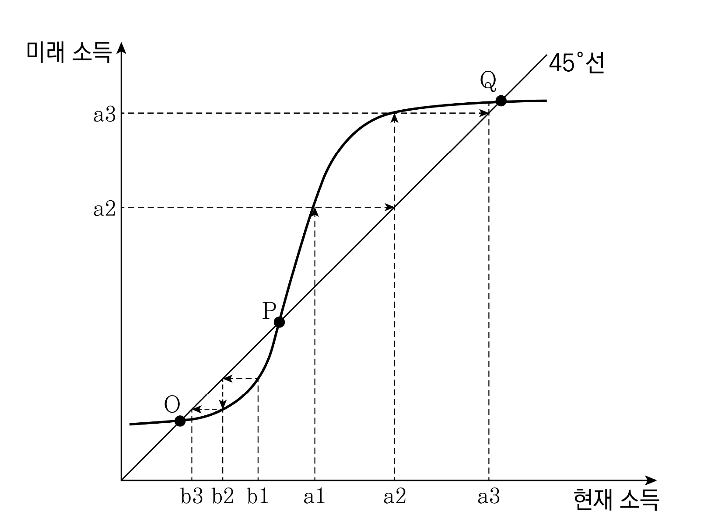

# [01-03] LU (2021)

다음 글을 읽고 물음에 답하시오.

## 제시문

비즈니스 프로세스는 고객 가치 창출을 위해 기업 또는 조직에서 업무를 처리하는 과정을 말한다. 업무 처리 과정을 업무흐름도로 도식화하는 과정을 프로세스 모델링이라 하며, 그 결과물을 프로세스 모델이라고 한다. 프로세스 모델은 업무 처리 활동 및 활동들 간의 경로로 구성된다. 프로세스 모델이 효율적으로 작동하고 있는지를 확인, 분석, 수정․보완, 개선하는 작업이 필요한데, 프로세스 마이닝은 그중 한 기법이다. 프로세스 마이닝은, 시뮬레이션처럼 실제 이벤트 로그 수집 이전에 정립한 프로세스 모델 중심 분석기법과, 데이터 마이닝처럼 프로세스를 고려하지 않는 데이터 중심 분석기법을 연결하는 역할을 한다.

프로세스 마이닝은 정보시스템을 통해 확보한 이벤트 로그에서 프로세스에 관련된 가치 있는 정보를 추출하는 것이다. 이벤트 로그란 정보시스템에 축적된 비즈니스 프로세스 수행 기록인데, 이것이 프로세스 마이닝의 출발점이 된다. 이벤트 로그는 행과 열로 표현되는 이차원 표 형태이다. 업무 활동으로 발생한 이벤트는 행으로 추가되며, 각 열에는 이벤트의 속성들이 기록된다. 이때 기록되는 속성으로 필수적인 것은 사례 ID, 활동명, 발생 시점이며, 다양한 분석을 위해 그 외 속성들도 추가될 수 있다. 이벤트 로그는 사용자에게 도움이 되는 정보를 직접 제공할 수 없는 원데이터이므로, 그것을 우리가 사용할 수 있는 정보로 변환해 주어야 한다. 프로세스 마이닝에는 프로세스 발견, 적합성 검증, 프로세스 향상의 세 가지 유형이 있다.

프로세스 발견이란 프로세스 분석가가 알고리즘을 통해 이벤트 로그로부터 프로세스 모델을 도출하는 것을 말하는데, 이때 분석가는 별다른 업무 지식 없이도 작업을 수행할 수 있다. 만일 도출된 프로세스 모델이 복잡하여 유의미한 분석이 곤란할 경우, 퍼지 마이닝이나 클러스터링 기법을 활용할 수 있다. 퍼지 마이닝은 실행 빈도가 낮은 활동을 제거 또는 병합하거나, 그 활동들 간의 경로를 제거함으로써 프로세스 모델을 단순화해 주는 기법이다. 이때 프로세스 모델에 나타난 활동과 경로에 대한 임곗값을 설정하여 모델의 복잡도를 조절할 수 있다. 클러스터링은 특성이 유사한 사례들을 같은 그룹으로 묶어주는 기법이다. 전체 이벤트 로그를 대상으로 프로세스를 도출할 때 복잡한 프로세스 모델이 도출될 경우, 이 기법을 적용하여 이벤트 로그를 여러 개로 나눌 수 있다. 이렇게 세분화된 이벤트 로그에 프로세스 발견 기법을 적용하면, 프로세스 모델의 복잡도가 줄어든다.

적합성 검증이란 기존의 프로세스 모델과 이벤트 로그 분석에서 도출된 결과를 비교하여 어느 정도 일치하는지를 확인하는 것이다. 이때 기존의 프로세스 모델과 이벤트 로그에서 도출된 결과물이 불일치하는 경우가 발생하는데, 먼저 기존의 프로세스 모델이 적절함에도 불구하고 업무 담당자가 이를 준수하지 않는 경우를 들 수 있다. 이 경우에는 현실 세계의 실제 업무 수행 실태를 교정해야 한다. 이와 달리 이벤트 로그의 분석 결과물이 더 적절한 것으로 판단되는 경우에는 기존의 프로세스 모델을 수정할 필요가 있다.

프로세스 향상에는 두 유형이 있다. 하나는 기존의 프로세스 모델을 ‘수정’하는 것이며, 다른 하나는 업무 수행 시간 및 담당자 등 이벤트 로그 분석에서 얻은 부가적 정보를 추가하여 발견된 프로세스 모델을 ‘확장’하는 것이다. 확장의 예로는 이벤트 로그로부터 도출된 프로세스 모델에 프로세스 내 병목지점과 재작업 흐름을 시각화하는 것을 들 수 있다.

프로세스 마이닝은 데이터 과학에 근거를 두고 프로세스 분석가가 업무 전문가와 협업하여 기업이 수행하는 비즈니스 프로세스에 대한 문제점을 진단하고 개선 방안을 도출하는 데 기여할 수 있다.

## 01

윗글과 일치하는 것은?

### 선택지

(1) 이벤트 로그는 프로세스 마이닝의 출발점이지만 그 자체로는 유용한 정보라 할 수 없다.

(2) 업무 전문가의 충분한 지식 없이 이벤트 로그로부터 프로세스 모델을 도출하기는 어렵다.

(3) 프로세스 발견은 프로세스에 내재된 업무 관련 규정을 이벤트 로그로부터 도출하는 것이다.

(4) 클러스터링은 복잡한 프로세스 모델을 여러 개의 세부 프로세스 모델로 구분해 주는 기법이다.

(5) 이벤트 로그에서 업무 담당자를 파악하여 기존의 프로세스 모델에 활동과 경로를 추가하는 것은 프로세스 수정이다.

## 02

‘프로세스 마이닝’에 대해 추론한 것으로 적절하지 <u>않은</u> 것은?

### 선택지

(1) 프로세스 마이닝을 도입하면 내부 규정의 준수 여부에 대한 감독이 용이해진다.

(2) 프로세스 마이닝을 통해 기존의 프로세스 모델이 실제로 어떻게 수행되는가를 파악할 수 있다.

(3) 프로세스 마이닝은 판에 박힌 단순한 업무뿐 아니라 비정형적인 업무 처리 과정의 분석에도 활용된다.

(4) 프로세스 마이닝은 예상된 이벤트 로그에 적용할 프로세스 모델 중심의 업무 성과 분석 및 개선 기법이다.

(5) 프로세스 마이닝은 기존의 프로세스 모델뿐 아니라 발견으로 도출된 프로세스 모델을 향상하는 데에도 활용된다.

## 03

<보기>의 사례에 프로세스 마이닝을 적용할 때 가장 적절한 것은?

### 보기

◯◯병원에서는 외래 환자의 과도한 대기 시간을 줄이고 의료 서비스의 품질을 개선하기 위해 외래 환자 진료 프로세스를 분석하고자 한다. 이 병원에서는 질환별로 진행해야 하는 표준 진료 프로세스를 임상진료 지침으로 수립해 두고 있다. 프로세스 마이닝 도구를 사용하여 프로세스 모델을 도출하였더니 지나치게 복잡한 프로세스 모델이 도출되어 분석이 곤란한 상황이다. 또한 환자의 민감한 개인 의료정보가 저장된 이벤트 로그를 프로세스 분석가에게 제공할 경우 정보 보호 및 프라이버시 이슈가 존재하고, 병원의 기밀이 유출될 우려가 제기되어 이를 해결하고자 한다.

### 선택지

(1) 복잡도 문제를 해결하기 위해 연령 및 질환을 기준으로 이벤트 로그의 사례를 클러스터링 하려면 필수적 속성만 이벤트 로그에 있어도 된다.

(2) 적합성 검증 결과 기존의 프로세스 모델과 이벤트 로그 분석 결과가 불일치하면 의료진에 대한 제재 조치나 지침 재교육이 필수적이다.

(3) 이벤트 속성의 임곗값을 조절하여 빈번하게 수행되는 진료 프로세스 수행 패턴을 파악할 수 있다.

(4) 환자의 개인정보 보호를 위해 사례 ID를 제외하고 이벤트 로그를 작성해야 한다.

(5) 외래 환자의 대기 시간 분석을 위해서는 프로세스 확장이 필요하다.

# [04-06] LU (2021)

다음 글을 읽고 물음에 답하시오.

## 제시문

15세기 초 브루넬레스키가 제안한 선원근법은 서양의 풍경화에 큰 변화를 가져왔다. 고정된 한 시점에서 대상을 통일적으로 배치하는 기하학적 투시도법으로 인간의 눈에 보이는 대로 자연을 화폭에 담을 수 있게 된 것이다. 문학 비평가 가라타니 고진은 이러한 풍경화의 원리를 재해석한 ‘풍경론’을 통해 특정 문학 사조를 추종하는 문단의 관행을 비판했다.

고진에 따르면, 풍경이란 고정된 시점을 가진 한 사람에 의해 통일적으로 파악되는 대상이다. 내 눈 앞에 펼쳐진 풍경은 있는 그대로 존재하는 자연이 아니라 내가 보았기 때문에 여기 있는 것이며, 그런 점에서 모든 풍경은 내가 새롭게 발견한 대상이 된다. ‘풍경’은 단순히 외부에 존재해서가 아니라 주관에 의해 지각될 때 비로소 풍경이 된다.

고진은 이러한 과정을 ‘풍경의 발견’이라 부르고, 이를 근대인의 고독한 내면과 연결시켰다. 가령, 작가 구니키다 돗포의 소설에는 외로움을 느끼지만 정작 자기 주변의 이웃과 사귀지 않고 산책길에 만난 이름 모를 사람들이나 이제는 만날 일이 없는 추억 속의 존재들을 회상하며 그들에게 자신의 감정을 일방적으로 투사하는 주인공이 등장한다. 죽어갈 운명이라는 점에서는 모두가 동일하다면서, 주인공은 인간이란 누구든 다 친근한 존재들이라 말한다. 실제 이웃과의 관계 맺기를 기피한 채, 주인공은 현실적으로 아무 상관이 없는 사람들과 하나의 세계를 이루어 살고 있다. 고진은 인간마저도 하나의 풍경으로 취급해 버리는 주인공으로부터, 전도(顚倒)된 시선을 통해 풍경을 발견하는 ‘내적 인간’의 전형을 읽는다. 이로부터 고진은 “풍경은 오히려 외부를 보지 않는 자에 의해 발견된 것”이라는 결론을 얻는다.

고진의 풍경론은 한쪽에서는 내면성이나 자아라는 관점을, 다른 한쪽에서는 대상의 사실적 묘사라는 관점을 내세우며 대립하는 문단의 세태를 비판하기 위해 제시되었다. 주관의 재현과 객관의 재현을 내세우기에 마치 상반된 듯 보이지만 사실 두 관점은 서로 얽혀 있다는 것이다. 이미 풍경에 익숙해진 사람은 주관에 의해 배열된 세계를 벗어나지 못하고, 눈에 보이는 것이 본래적인 세계의 모습이라 믿는다. 풍경의 안에 놓여 있으면서도 풍경의 밖에 서 있다고 믿는 것이다. 고진은 만일 이러한 믿음에서 나온 외부 세계의 모사(模寫)를 리얼리즘이라 부른다면 그것이 곧 전도된 시선에서 비롯된 것임을 알아야 한다고 말한다. 리얼리즘의 본질을 ‘낯설게 하기’에서 찾는 러시아 형식주의의 견해 또한 마찬가지이다. 너무 익숙해서 실은 보고 있지 않은 것을 보게 만들어야 한다는 이 견해를 따른다면, 리얼리즘은 항상 새로운 풍경을 창출해야 한다. 따라서 리얼리스트는 언제나 ‘내적 인간’일 수밖에 없다.

물론 자신이 풍경 안에 갇혀 있다는 사실을 자각하는 이가 있을 수도 있다. 작가 나쓰메 소세키는 ‘문학이란 무엇인가’라는 질문을 던졌을 때, 자신이 참고해 온 문학책들이 자신의 통념을 만들고 강화했을 뿐이라는 사실을 깨닫고는 책들을 전부 가방에 넣어 버렸다. “문학 서적을 읽고 문학이 무엇인가를 알려고 하는 것은 피로 피를 씻는 일이나 마찬가지라고 생각했기 때문”이다. 고진은 소세키야말로 자신이 풍경에 갇혀 있다는 사실을 자각했던 것이라 본다. 일단 고정된 시점이 생기면 그에 포착된 모든 것은 좌표에 따라 배치되며 이윽고 객관적 세계의 형상을 취한다. 이 세계를 의심하기 위해서는 결국 자신의 고정된 시점 자체에 질문을 던지며 회의할 수밖에 없다. 이른바 ‘풍경 속의 불안’이 시작되는 것이다.

그렇다면 만일 선원근법에 의존하지 않는 풍경화, 예컨대 서양의 풍경화가 아닌 동양의 산수화를 고려한다면 고진의 풍경론은 달리 해석될까. 기하학적 투시도법을 따르지 않은 산수화에는 그야말로 자연이 있는 그대로 재현된 것처럼 보이니 말이다. 그러나 산수화의 소나무조차도 화가의 머릿속에 있는 소나무라는 관념을 묘사한 것이지 특정 시공간에 실재하는 소나무가 아니다. 요컨대 질문을 던지며 회의한들 그 외의 방식으로는 세계와 대면하는 방법을 알지 못하기에 막연한 불안이 생기는 사태를 막을 수는 없다. 그럼에도 불구하고 문학을 다루는 사람은 자신의 전도된 시선을 의심하는 일에 게을러서는 안 된다. 전도된 시선의 기만적 구도는 풍경 속의 불안을 느끼는 이들에 의해서만 감지될 수 있다. 이 미묘한 앞뒷면을 동시에 살피려는 시도가 없다면, 우리는 풍경의 발견이라는 상황을 보지 못할 뿐 아니라 단지 풍경의 눈으로 본 문학만을 쓰고 해석하게 될 것이다.

## 04

윗글과 일치하지 <u>않는</u> 것은?

### 선택지

(1) 브루넬레스키의 선원근법은 풍경화에 사실감을 부여했다.

(2) 러시아 형식주의자들은 익숙한 세계를 새롭게 인식해야 한다고 주장했다.

(3) 산수화와 풍경화는 기하학적 투시도법의 적용 여부에 따라 대상의 재현 양상이 대비된다.

(4) 나쓰메 소세키는 문학 서적을 통해서 문학을 연구하는 작업이 자기 반복이라고 보았다.

(5) 구니키다 돗포는 공적 관계를 기피하고 사적 관계에 몰두하는 인물을 소설의 주인공으로 삼았다.

## 05

‘전도된 시선’을 설명한 것으로 가장 적절한 것은?

### 선택지

(1) 세계의 미묘한 앞뒷면을 동시에 살피는 것이다.

(2) 내면의 세계를 외부자의 시선으로 발견하는 것이다.

(3) 현실을 취사선택하여 비현실적 세계를 만드는 것이다.

(4) 실재로서 존재했지만 아무도 보지 못했던 풍경을 보는 것이다.

(5) 주관적 시각을 통해 구성된 세계를 객관적 현실이라 믿는 것이다.

## 06

윗글에 따를 때 고진의 관점에서 <보기>에 나타난 최재서의 입장을 해석한 것으로 가장 적절한 것은?

### 보기

최재서는 내면성과 자아의 실험적 표현을 추구하는 이상의 소설을 사실적 묘사라는 관점에서 ‘리얼리즘의 심화’라고 비평한 바 있다. 이상의 「날개」에는 돈을 사용하는 법도 모르고 친구를 사귀지도 않으며 자신의 작은 방을 벗어나지 않는 주인공이 등장한다. 최재서에 따르면, 자폐적으로 자기 세계에 갇혀 지내는 사내의 심리에 주목한 「날개」는 특정 대상의 내면까지도 ‘주관의 막을 제거한 카메라’를 들이대어 투명하게 조망한 사례이다. 대상에 따라 관점은 이동할 수 있다는 것, 문학 작품의 해석에 미리 확정된 관점이나 범주란 없다는 것이 최재서의 결론이다.

### 선택지

(1) 대상에 따라 관점이 이동할 수 있다는 의견은, 고진에게는 작가의 머릿속에 있는 관념이 서양 풍경화의 방식으로 재현되는 것이라 해석되겠군.

(2) 작품 해석에서 미리 확정된 범주란 없다는 의견은, 고진에게는 주관이 외부를 적극적으로 파악하여 풍경 속의 불안을 벗어난 것이라 해석되겠군.

(3) 내면성과 자아의 실험적 표현을 추구하는 작품도 리얼리즘에 속할 수 있다는 의견은, 고진에게는 풍경 안에 갇혀 있음을 자각한 것이라 해석되겠군.

(4) 「날개」가 대상의 내면에 ‘주관의 막을 제거한 카메라’를 들이댔다는 의견은, 고진에게는 주관의 재현과 객관의 재현을 내세우며 대립하는 것이라 해석되겠군.

(5) 이상이 「날개」에서 자폐적으로 자기 세계에 갇혀 지내는 사내를 그렸다는 의견은, 고진에게는 풍경을 지각하지 못하는 ‘내적 인간’의 전형을 그린 것이라 해석되겠군.

# [07-09] LU (2021)

다음 글을 읽고 물음에 답하시오.

## 제시문

평등은 자유와 더불어 근대 사회의 핵심 이념으로 자리 잡고 있다. 인간은 가령 인종이나 성별과 상관없이 누구나 평등하다고 생각한다. 모든 인간은 평등하다고 말하는데, 이 말은 무슨 뜻일까? 그리고 그 근거는 무엇인가? 일단 이 말을 모든 인간을 모든 측면에서 똑같이 대우하는 절대적 평등으로 생각하는 이는 없다. 인간은 저마다 다르게 가지고 태어난 능력과 소질을 똑같게 만들 수 없기 때문이다. 절대적 평등은 개인의 개성이나 자율성 등의 가치와 충돌하기도 한다.

평등에 대한 요구는 모든 불평등을 악으로 보는 것이 아니라 충분한 이유가 제시되지 않은 불평등을 제거하는 데 목표를 두고 있다. ‘이유 없는 차별 금지’라는 조건적 평등 원칙은 차별 대우를 할 때는 이유를 제시할 것을 요구하고 있다. 이것은 어떤 이유가 제시된다면 특정한 부류에 속하는 사람들에게는 평등한 대우를, 그 부류에 속하지 않는 사람들에게는 차별적 대우를 하는 것을 허용한다. 그렇다면 사람들을 특정한 부류로 구분하는 기준은 무엇인가? 이것은 바로 평등의 근거에 대한 물음이다.

근대의 여러 인권 선언에 나타난 평등 개념은 개인들 사이의 평등성을 타고난 자연적 권리로 간주하였다. 하지만 이러한 자연권 이론은 무엇이 자연적 권리이고 권리의 존재가 자명한 이유가 무엇인지 등의 문제에 부딪히게 된다. 그래서 롤스는 기존의 자연권 사상에 의존하지 않는 방식으로 인간 평등의 근거를 마련하려고 한다. 그는 어떤 규칙이 공평하고 일관되게 운영되며, 그 규칙에 따라 유사한 경우는 유사하게 취급된다면 형식적 정의는 실현된다고 본다. 하지만 롤스는 형식적 정의에 따라 규칙을 준수하는 것만으로는 정의를 담보할 수 없다고 생각한다. 그 규칙이 더 높은 도덕적 권위를 지닌 다른 이념과 충돌할 수 있기에, 실질적 정의가 보장되기 위해서는 규칙의 내용이 중요한 것이다.

롤스는 인간 평등의 근거를 설명하면서 영역 성질(range property) 개념을 도입한다. 예를 들어 어떤 원의 내부에 있는 점들은 그 위치가 서로 다르지만 원의 내부에 있다는 점에서 동일한 영역 성질을 갖는다. 반면에 원의 내부에 있는 점과 원의 외부에 있는 점은 원의 경계선을 기준으로 서로 다른 영역 성질을 갖는다. 그는 평등한 대우를 받기 위한 영역 성질로서 ‘도덕적 인격’을 제시한다. 도덕적 인격이란 도덕적 호소가 가능하고 그런 호소에 관심을 기울이는 능력이 있다는 것인데, 이 능력을 최소치만 갖고 있다면 평등한 대우에 대한 권한을 갖게 된다. 도덕적 인격이라고 해서 도덕적으로 훌륭하다는 뜻이 아니라 도덕과 무관하다는 말과 대비되는 뜻으로 쓰고 있다. 그런데 어린 아이는 인격체로서의 최소한의 기준을 충족하고 있는지가 논란이 될 수 있다. 이에 대해 롤스는 도덕적 인격을 규정하는 최소한의 요구 조건은 잠재적 능력이지 그것의 실현 여부가 아니기에 어린 아이도 평등한 존재라고 말한다.

싱어는 위와 같은 롤스의 시도를 비판한다. 도덕에 대한 민감성의 수준은 사람에 따라 다르다. 그래서 도덕적 인격의 능력이 그렇게 중요하다면 그것을 갖춘 정도에 따라 도덕적 위계를 다르게 하지 말아야 할 이유가 분명하지 않다고 말한다. 그리고 평등한 권리를 갖는 존재가 되기 위한 최소한의 경계선을 어디에 그어야 하는지도 문제로 남는다고 본다. 한편 롤스에서는 도덕적인 능력을 태어날 때부터 가지고 있지 않거나 영구적으로 상실한 사람은 도덕적 지위를 가지고 있지 못하게 되는데, 이는 통상적인 평등 개념과 어긋난다. 그래서 싱어는 평등의 근거로 ‘이익 평등 고려의 원칙’을 내세운다. 그에 따르면 어떤 존재가 이익, 즉 이해관계를 갖기 위해서는 기본적으로 고통과 쾌락을 느낄 수 있는 능력을 갖고 있어야 한다. 그리고 그 능력을 가진 존재는 이해관계를 가진 존재이기 때문에 평등한 도덕적 고려의 대상이 된다. 이때 이해관계가 강한 존재를 더 대우하는 것이 가능하다. 반면에 그 능력을 갖지 못한 존재는 아무런 선호나 이익도 갖지 않기 때문에 평등한 도덕적 고려의 대상이 되지 않는다.

## 07

‘평등’을 설명한 것으로 가장 적절한 것은?

### 선택지

(1) 형식적 정의에서는 차별적 대우가 허용되지 않는다.

(2) 조건적 평등과 달리 절대적 평등은 결과적인 평등을 가져온다.

(3) 불평등은 충분한 이유가 있더라도 평등의 이념에 부합하지 않는다.

(4) 규칙에 따라 유사한 경우는 유사하게 취급해도 결과는 불평등할 수 있다.

(5) 인간의 능력은 절대적으로 평등하게 만들 수 있지만 자율성에 어긋날 수 있다.

## 08

롤스와 싱어를 이해한 것으로 적절하지 <u>않은</u> 것은?

### 선택지

(1) 롤스에서 평등의 근거가 되는 특성을 가지지 못한 존재는 부도덕하다.

(2) 롤스에서 영역 성질은 정도의 차를 감안하지 않는 동일함을 가리킨다.

(3) 싱어에서는 인간이 아닌 존재가 느끼는 고통과 쾌락도 도덕적으로 고려해야 한다.

(4) 싱어에서는 도덕적으로 평등하다고 인정받는 사람들도 차별적 대우를 받을 수 있다.

(5) 롤스와 싱어는 도덕에 대한 민감성이 사람마다 다름을 인정한다.

## 09

<보기>에 대한 반응으로 적절하지 <u>않은</u> 것은?

### 보기

◦ 갑은 고통을 느끼는 능력과 도덕적 능력을 회복 불가능하게 상실하였다.
◦ 을은 도덕적 능력을 선천적으로 결여했지만 고통을 느낄 수 있다.
◦ 병은 질병으로 인해 일시적으로 도덕적 능력을 상실하였다.

### 선택지

(1) 갑에 대해 싱어는 도덕적 고려의 대상이 아니라고 보겠군.

(2) 을이 도덕적 능력이 있는 사람보다 더 고통을 느낀다면 싱어는 더 대우를 받아야 한다고 생각하겠군.

(3) 을이 도덕적 고려의 대상임을 설명할 수 있다는 점에서 싱어는 자신의 설명이 통상적인 평등 개념에 부합한다고 생각하겠군.

(4) 병에 대해 롤스는 그 질병에 걸리지 않은 사람과 달리 평등하지 않게 생각하겠군.

(5) 갑과 을에 대해 싱어는 롤스가 도덕적 인격임을 설명하지 못할 것이라고 보겠군.

# [10-12] LU (2021)

다음 글을 읽고 물음에 답하시오.

## 제시문

살펴보건대, <u>㉠ 상고 시대 법에서</u> 오형(五刑)은 중죄인에 대하여 이마에 글자를 새기고(묵형) 코나 팔꿈치, 생식기를 베어 내고(의형, 비형, 궁형), 죽이는(대벽) 형벌이었다. 다만 정상이 애처롭거나 신분과 공로가 높은 경우에는 예외적으로 오형 대신 유배형을 적용하였다. 나머지 경죄는 채찍이나 회초리를 쳤는데 따져볼 여지가 있는 경우에는 돈으로 대속할 수 있도록, 곧 속전(贖錢)할 수 있도록 하였다. 또 과실로 저지른 행위는 유배나 속전 할 것 없이 처벌하지 않았다. 그러나 배경을 믿고 범행을 저질렀거나 재범한 경우에는 유배나 속전 할 사유에 해당하더라도 형을 집행하였다.

형법은 선왕들이 통치에서 전적으로 믿고 의지하는 도구는 아니었지만 교화를 돕는 수단이었고, 백성들이 그른 짓을 하지 않도록 역할을 해 왔다. 그렇다면 신체를 상하게 하여 악을 징계한 것도 당시에는 고심 끝에 차마 어쩔 수 없이 행하는 하나의 통치였던 것이다. <u>㉡ 지금의 법을</u> 보면, 유배형과 노역형이 간악한 이를 효과적으로 막지 못하고 있다. 그렇다고 해서 그보다 더 무거운 형벌로 과도하게 적용하면 죽이지 않아도 될 범죄자를 죽일 수 있어 적당하지 않다. 따라서 예전처럼 의형, 비형을 적용한다면, 신체는 다쳐도 목숨은 보전될 뿐만 아니라 뒷사람에게 경계도 되니 선왕의 뜻과 시의에 알맞은 일이다.

지금은 살인과 상해에 대하여도 속전할 수 있도록 하여, 재물 있는 이들이 사람을 죽이거나 다치게 하도록 만드니, 무고한 피해자에게는 이보다 더 큰 불행이 있겠는가? 그리고 살인자가 마을에서 편안히 살고 있으면, 부모의 원수를 갚으려는 효자가 어떻게 그대로 보겠는가? 변방으로의 유배를 그대로 집행하는 것이 양쪽을 모두 보전하는 일이다. 선왕들이 중죄인에 대하여 죽이거나 베면서 조금도 용서하지 않은 것은 그 죄인도 또한 피해자에게 잔혹히 했기 때문이니, 그 형벌의 시행이 매우 참혹해 보이지만 실상은 마땅히 해야 할 일을 집행한 것이다.

어떤 이가 말하기를, 신체에 가하는 형벌인 육형(肉刑)으로 오형만 있었던 상고 시대에 순임금이 그 참혹함을 차마 볼 수 없어서 유배, 속전, 채찍, 회초리의 형벌을 만들었다고 한다. 그렇다고 하면 요임금 때까지는 채찍이나 회초리에 해당하는 죄에도 묵형이나 의형을 집행했다는 말인가? 그러니 오형에 처하던 것을 순임금이 법을 바로잡아 속전할 수 있도록 하였다는 말은 옳지 않다. 의심스럽다든가 해서 중죄를 속전할 수 있도록 한다면, 부자들은 처벌을 면하고 가난한 이들만 형벌을 받을 것이다.

지금의 사법기관은 응보에 따라 화복(禍福)이 이루어진다는 말을 잘못 알고서, 죄의 적용을 자의적으로 하여 복된 보답을 구하려는 경향이 있다. 죄 없는 이가 억울함을 풀지 못하고 죄 지은 자가 되려 풀려나게 하는 것은 악을 행하는 일일 뿐이니 무슨 복을 받겠는가? 지금의 사법관들은 죄수를 신중히 살핀다는 흠휼(欽恤)을 잘못 이해하여서, 사람의 죄를 관대하게 다루어 법 적용을 벗어나도록 해 주는 것으로 안다. 그리하여 죽여야 할 이들을 여러 구실을 들어 대부분 감형되도록 한다. 참형에 해당하는 것이 유배형이 되고, 유배될 것이 노역형이 되고, 노역할 것이 곤장형이 되고, 곤장 맞을 것을 회초리로 맞게 되니, 이는 뇌물을 받아 법을 가지고 논 것이지 어찌 흠휼이겠는가?

인명은 지극히 중한 것이다. 만약 무고한 사람이 살해되었다면, 법관은 마땅히 자세히 살피고 분명히 조사하여 더는 의심의 여지가 없게 해야 할 것이다. 그리고 이렇게 한 뒤에는 반드시 목숨으로 갚도록 해야 한다. 이로써 죽은 자의 원통한 혼령을 위로할 뿐 아니라, 과부와 고아가 된 이가 원수 갚고자 하는 마음을 위로할 수 있으며, 또한 천리를 밝히고 나라의 기강을 떨치는 일이다. 보는 이들의 마음을 통쾌하게 할 뿐 아니라 후대의 징계도 되니, 또한 좋지 않겠는가.

지금은 교화가 쇠퇴하여 인심이 거짓을 일삼으며, 저마다 자신의 잇속만 챙기면서 풍속도 모두 무너졌다. 극악한 죄인은 죄를 받지 않고, 선량한 백성들은 자의적인 형벌의 적용을 면치 못하기도 한다. 또 강자에게는 법을 적용하지 않고 약자에게는 잔인하게 적용한다. 권문세가에는 너그럽고 한미한 집에는 각박하다. 똑같은 일에 법을 달리하고 똑같은 죄에 논의를 달리하여, 간사한 관리들이 법조문을 농락하고 기회를 잡아 장사하니, 그것은 단지 살인자를 죽이지 않고 형법을 방기하는 잘못에 그치는 일이 아니다. 이 통탄스러움을 이루 말로 다할 수 있겠는가.

\- 윤기, 「논형법(論刑法)」 -

## 10

글쓴이의 입장과 일치하는 것은?

### 선택지

(1) 교화를 중시하고 형벌의 과도한 적용을 삼가야 한다고 생각한다.

(2) 살인을 저지른 중죄인이 유배되는 일은 없어야 한다고 주장한다.

(3) 인명이 소중하므로 사형과 같은 참혹한 형벌의 폐지에 찬성한다.

(4) 형벌로 보복을 대신하려고 하는 응보적인 경향에 대해 반대한다.

(5) 무고하게 살해된 피해자를 고려하면 의형은 합당한 처벌이라고 본다.

## 11

윗글에 따라 ㉠, ㉡을 설명한 것으로 가장 적절한 것은?

### 선택지

(1) ㉠에서는 경미한 죄에도 오형을 적용하도록 되어 있었다.

(2) ㉠에서는 중죄에 대한 형벌을 육형으로 하는 것이 원칙이었다.

(3) ㉡에서는 유배형도 정식의 형벌이므로 속전의 대상이 되지 않는다.

(4) ㉠에서 오형에 해당하지 않는 형벌은 ㉡에서도 집행하지 않는다.

(5) ㉠에서의 오형은 잔혹한 형벌이라 하여 ㉡에서는 모두 사라지게 되었다.

## 12

윗글과 <보기>를 비교 평가한 것으로 적절하지 <u>않은</u> 것은?

### 보기

상고 시대에 유배형은 육형을 가해서는 안 되는 관료에게 베푸는 관용의 수단으로서 공식적인 형벌이 아니라 임시방편과 같은 것이었다. 또 속전은 의심스러운 경우에 적용한 것이지 꼭 가벼운 형벌에만 해당했던 것도 아니었다. 여기서 속은 잇는다[續]는 데서 따다가 대속한다[贖]는 의미로 된 것이니, 육형으로 끊어진 팔꿈치를 다시 붙일 수 없는 참혹함을 받아들이지 못하는 어진 정치에서 비롯한 것임을 알 수 있다. 지금의 법에서 속전은 정황이 의심스럽거나 사면에 해당하는 경우에만 비로소 허용된다. 그에 해당하는 경우가 아니라면 부유함으로 처벌을 요행히 면해서는 안 되며, 해당하는 경우이면 가난뱅이는 속전도 필요 없다. 죽여야 할 사람을 끝없이 살리려고만 한다면 어찌 덕이 되겠는가. 흠휼은 한 사람이라도 죄 없는 자를 죽이지 않으려는 것이지 살리기만 좋아하는 것이 아니다.

### 선택지

(1) 법을 엄격하게 집행해야 한다고 보는 점은 두 글이 같은 태도이다.

(2) 속전의 남용에 대해 흠휼을 오해한 소치로 보는 점은 두 글이 같은 태도이다.

(3) 상고 시대에 중죄를 속전할 수 있었는지에 대해서는 두 글이 서로 달리 보고 있다.

(4) 중죄에 대한 속전이 부자들의 전유물이므로 폐지하자는 것에 대해서는 두 글이 다른 태도를 보일 것이다.

(5) 유배의 효과가 없을 때 의형이나 비형을 되살릴 수 있다는 것에 대해서는 두 글이 같은 태도를 보일 것이다.

# [13-15] LU (2021)

다음 글을 읽고 물음에 답하시오.

## 제시문

68혁명 이후 구조에서 차이로, 착취에서 자유나 배제로 문제 설정이 변화하고, 신자유주의적 반(反)정치의 경향이 강화되었던 1980년대에 <kbd>르포르</kbd>는 ‘정치적인 것’의 활성화를 제기하였다. 그에 앞서 아렌트가 고대 아테네의 시민적 덕성의 복원을 통한 정치적인 것의 활성화를 제기했다면, 르포르는 근대 민주주의 자체의 긴장에 주목하면서 ‘인권의 정치’를 통한 정치적인 것의 부활을 시도하였다. 그는 인권을 공적 공간의 구성 요소로 파악하면서 개인에 내재된 자연권으로 보거나 개인의 이해관계에 기반한 소유권적 관점에서 파악하려는 자유주의적 입장을 거부한다. 르포르는 자유주의가 인간의 권리를 개인의 권리로 환원시킴으로써 사회적 실체에 접근하지 못하고, 결국 민주주의를 개인과 국가의 표상관계를 통해 개인들의 이익의 총합으로서 국가의 단일성을 확보하기 위한 수단으로 볼 뿐이라고 비판한다.

르포르는 1789년 「인권선언」의 조항들이 ‘개인적 자유’보다 ‘관계의 자유’를 의미한다고 본다. 선언의 제4조에서 언급한 ‘타인에게 해를 끼치지 않는 모든 것을 할 수 있는 자유’는 사회적 공간이 권력에 대해 권리들의 자율성을 향유한다는 의미이자, 어떤 것도 그 공간을 지배할 수 없다는 의미이다. 그리고 제11조에서 언급한 ‘생각과 의견의 자유로운 소통의 자유’ 역시 근대 사회의 시민이 자신의 생명과 재산에 대한 위협을 느끼지 않고 의견을 표현할 수 있는 권리를 의미한다. 르포르는 이러한 권리가 개인과 개인의 존엄성에 대한 보호라기보다는 개인들끼리의 공존 형태, 특히 권력의 전능으로 인해 인간 간의 관계가 침탈될 우려에서 비롯된 특정한 공존 형태에 대한 정치적 개념이라고 본다.

르포르는 <u>㉠ 권리와 권력의 관계에</u> 주목한다. 18세기에 형성된 인간의 권리는 사회 위에 군림하는 권력의 표상을 붕괴시키는 자유의 요구로부터 출현했다. 근대에 ‘인간의 권리’는 ‘시민의 권리’로서 존재해 왔다. 인간은 특정 국민국가의 성원으로서 국가권력에 의해 인정될 때, 즉 이방인이었던 아렌트가 포착했던 ‘권리들을 가질 수 있는 권리’가 전제될 때 비로소 권리를 향유할 수 있다. 하지만 르포르가 제기하는 것은 권력이 권리에 순응해야 한다는 점이다. 특히 저항권은 시민 고유의 것이지 결코 국가에게 그것의 보장을 요구할 수 없는 것이다. 그것은 권력에 대한 권리의 선차성이며, 권력이 권리에 어떤 영향도 미칠 수 없다는 것을 의미한다.

하지만 그의 비판자들은 권리가 권력을 통해서만 존재해 온 역사를 르포르가 간과하고 있다고 지적한다. 인권의 정치를 통한 권리의 확장은 권력의 동시적인 확장, 나아가 전체주의적 권력의 등장을 가져올 수 있다는 것이다. 근대 민주주의의 속성인 인민과 대표의 동일시에 따른 대표의 절대화를 통해 ‘하나로서의 인민’과 ‘사회적인 것의 총체로서의 당’에 대한 표상의 일치, 당과 국가의 일치, 결국 ‘일인’ 통치로 귀결된 전체주의가 그 예라고 르포르를 비판한다.

물론 르포르도 새로운 권리의 발생이 국가권력을 강화시킬 수 있음을 인정한다. 따라서 국가권력에 대한 제어와 감시가 필요하며, 억압에 대한 저항으로서 정치적 자유가 강조된다. 공적 영역에서 실현되는 정치적 자유는, 시민들의 관계를 표현하는 장치이자 권력에 대한 통제 수단으로서 정치적인 것의 활성화를 통해 공론장과 같은 민주적 공간을 구성한다. 그러한 민주적 공간을 구성하는 권리로부터 법률이 형성된다. 따라서 권리의 근원은 그 누구에 의해서도 독점되지 않는 권력이어야 한다. 국가권력은 상징적으로는 단일하지만 실제적으로는 민주적으로 공유되어야 함에도, 이를 오해한 것이 전체주의이다.

결국 르포르는 권력이 제어할 수 있는 틀을 넘어 쟁의가 발생하는 장소로서 민주주의 국가를 제시함으로써 법이 인정하는 한에서 권리를 사유하는 자유주의적 법치국가의 한계를 넘어서고자 하며, 역사적으로 다양한 권리들이 권력이 정한 경계를 넘어서 생성되어 왔다는 점을 강조한다. 이때 인권의 정치는 차별과 배제에 대한 저항과 새로운 주체들의 자유를 위한 무기가 된다. 나아가 ‘권리들을 가질 수 있는 권리’라는 관념은 인간의 권리의 실현 조건으로서 국가권력이라는 틀 자체를 거부하면서, 자신이 거주하는 곳에서 권리의 실현을 요구하는 급진적 흐름으로서 세계시민주의의 가능성을 보여준다.

## 13

윗글과 일치하지 <u>않는</u> 것은?

### 선택지

(1) 아렌트는 시민적 덕성의 복원을 통해, 르포르는 인권의 정치를 통해 공적 공간의 민주화에 대해 사유한다.

(2) 르포르는 근대 국가권력의 상징적 측면에서, 자유주의자들은 개인과 국가의 표상관계를 통해 권력의 단일성을 이해한다.

(3) 자유주의자들은 자연권 혹은 소유권적 관점에서 개인의 권리를 파악하면서 민주주의를 개인의 권리들의 관계가 만들어 내는 쟁의의 공간으로 이해한다.

(4) 전체주의는 근대 민주주의가 피통치자로서의 인민과 통치자로서의 대표를 동일시하는 경향이 극단화될 때 나타난다.

(5) 세계시민주의는 인간의 권리가 실현되는 조건으로 국민국가의 성원이라는 전제를 거부할 필요가 있음을 주장한다.

## 14

윗글에 따를 때 ㉠에 대한 르포르의 관점을 이해한 것으로 적절하지 <u>않은</u> 것은?

### 선택지

(1) 국가권력이 보장할 수 없는 시민 고유의 권리가 존재할 수 있다고 본다.

(2) 근대의 민주적 권력은 상징적 및 실제적 권력의 단일성에 근거하여 권리를 확장시켜 왔다고 본다.

(3) 근대국가에서는 국가권력이 개인을 국민이라는 성원으로 인정하는 한에서 권리를 부여해 왔다고 본다.

(4) 국가권력이 설정한 권리의 한계를 극복하면서 국민국가 초기에 인정되지 않았던 권리들이 인정받았다고 본다.

(5) 권리를 사회적 관계의 산물로 이해함으로써 권리는 누구도 독점할 수 없는 민주적 공간을 구성하는 동력이 된다고 본다.

## 15

<kbd>르포르</kbd>와 <보기>의 <kbd>푸코</kbd>를 비교한 것으로 가장 적절한 것은?

### 보기

<kbd>푸코</kbd>는 개인의 삶 자체가 위험이라는 인식하에서 국가가 출생에서 죽음에 이르기까지의 개인의 삶 전체를 관리하는 ‘생명관리권력의 시대’가 등장하였다고 주장한다. 근대에 개인의 권리의 확대는 개인을 위험으로부터 보호하려는 문제의식에서 비롯되었지만, 그것은 동시에 국가가 더 깊이 개인의 삶에 침투하는 권력으로 전환되는 역설을 낳았다. 개인이 권력의 시선, 즉 규율을 내면화함으로써 권력이 만들어 낸 주체가 되어간다는 점에서, 근대의 자율적 주체는 사라져 버렸다. 푸코는 개인에 대한 억압을 강조했던 기존의 권력 관념을 대신하여 국가권력이 생산적 권력임을 강조한다.

### 선택지

(1) 르포르는 권리에 대한 권력의 종속을 비판했다면, 푸코는 개인의 삶에 침투하는 권력의 특성에 주목했다.

(2) 르포르는 인권의 정치를 통해 민주주의의 확장을 주장했다면, 푸코는 권리에 대한 요구를 통해 권력을 제한하려 했다.

(3) 르포르는 권리의 확장이 가져올 수 있는 권력의 비대화 및 독점화를 우려했다면, 푸코는 자율적 주체에 의한 권리의 확장을 주장했다.

(4) 르포르는 권력이 설정한 경계를 넘어 권리의 주체를 형성할 것을 주장했다면, 푸코는 국가권력이 권력의 시선을 내면화하는 주체를 생산하고 관리한다는 점에 주목했다.

(5) 르포르는 전체주의가 될 위험에서 벗어나기 위한 해결책을 근대 민주주의 내에서 찾으려 했다면, 푸코는 권력으로부터 개인의 안전을 확보하기 위한 해결책을 권력 내에서 찾으려 했다.

# [16-18] LU (2021)

다음 글을 읽고 물음에 답하시오.

## 제시문

18세기 후반 이후, 이슬람 세계는 제국주의 침략을 받기 시작했고, 이슬람 신자들은 그에 맞서 저항하였다. 그중 눈에 띄는 것은 수피 종단들이 여러 지역에서 군사적 저항을 주도했다는 점이다. 대표적인 것이 알제리, 리비아, 수단에서의 항쟁이었다. 어떻게 이들이 상당한 기간 동안 열강에 맞서 저항할 수 있었을까?

수피즘은 신과의 영적 합일을 통한 개인적 구원을 추구한다. 수피즘을 따르는 이들인 수피는 속세의 욕심에서 벗어나 모든 것을 신께 의탁하며, 금욕적으로 살고자 했다. 8세기 초에 수피즘이 싹텄고, 9세기에는 독특한 신비주의 의식이 나타났다. 수피가 걷는 개인적인 영적 도정은 길을 잃을 수도, 자아도취에 빠져 버릴 수도 있었기에 위험하기도 했다. 그 때문에 그들은 영적 선배들을 스승으로 모시게 되었고, 거의 맹목적으로 스승을 따라야 했다. 10세기 말 수피들은 종단을 구성하기 시작했다. 수피 종단은 지역과 시기에 따라 성쇠를 거듭했지만, 점차 많은 동조자를 얻었다.

북아프리카의 경우, 수피 종단들은 한동안 쇠락하다가 18세기 이후 강력하게 재조직되어 선교와 교육기관의 역할도 담당했고, 지역 밀착을 통해 생활 공동체를 형성하는 구심점이 되면서 항쟁에 필요한 기반을 이미 갖추고 있었다. 이 지역에서 수피즘 지도자들이 외세에 맞서 부족들 간 이견을 봉합하고 결집시킬 수 있었던 요인 중 하나는 종교적 권위였다. 특히 알제리 항쟁을 이끌었던 압드 알 카디르와 리비아 항쟁 지도자였던 아흐마드 알 샤리프가 성인으로 존경받은 것은 정치적 권위를 확보하는 데 큰 도움이 되었다.

수니파에서 가장 엄격한 와하비즘은 성인을 인정하지 않고, 심지어 은사를 받기 위해 예언자 무하마드의 묘소에서 기도하는 것도 알라 외의 신성을 인정하는 것이라고 보아 배격했다. 하지만 수피즘에서는 성인의 존재를 인정했다. 성인은 왈리라고 불리는데, 질병과 불임을 치료하고 액운을 막는 등의 이적을 행할 수 있다는 것이다. 성인들의 묘소는 순례의 대상이 되었고, 이를 중심으로 설립된 수피즘 수도원은 지역 공동체의 중심이 되는 경우가 많았다.

한편 북서 아프리카의 수피즘 신자들은 혈통을 중시하는 베르베르 토속 신앙의 영향을 짙게 받아 무라비트를 성인으로 숭배했다. 무라비트는 코란 학자, 종교 교사 등을 통칭하는 용어였지만, 이 지역에서는 특정 수피 종단을 이끄는 왈리를 가리킨다. 무라비트는 신의 은총인 바라카를 가졌다고 여겨져 존경을 받았다. 무라비트는 특정 가문 출신 중 영적으로 선택된 소수만이 될 수 있었는데, 대표적으로는 예언자 무하마드의 후손인 샤리프 가문이 있다. 압드 알 카디르와 아흐마드 알 샤리프는 모두 이 가문 출신의 무라비트였다.

북동 아프리카에서 일어난 수단 항쟁의 주역인 무함마드 아흐마드의 경우는 달랐다. 그는 성인 가문 출신은 아니었지만, 당시 만연한 <kbd>마흐디</kbd>의 도래에 대한 기대감을 충족시켜 종교적 권위를 얻고 이를 다시 정치적 권위로 전환시킴으로써 항쟁의 중심이 되었다. 이슬람교에서 마흐디란 종말의 순간 인류를 올바른 길로 인도하고 정의와 평화의 시대를 가져오는 구원자이다. 또한 마흐디는 부정의를 제거하고 신정주의 국가를 건설하는 개혁적 지도자이기도 하다. 마흐디 사상은 민간 신앙에서 출발하여 퍼진 것이었고, 특히 토속 신앙의 영향을 많이 받았던 수피들은 종단 지도자를 마흐디로 쉽게 받아들였다. 1881년, 무함마드 아흐마드는 자신이 예언자 무하마드의 생애와 사건을 재현하는 존재인 마흐디라고 선언했고, 이를 통해 여러 수피 종단과 부족 간의 갈등을 수습하여 외세에 맞서는 결속력을 만들었다.

더불어 수피즘의 의식에 참여한 이들 간에 생기는 형제애는 초국가적 조직망의 형성과 상호 협조를 가능하게 했다. 항쟁의 중심이었던 수피 종단들은 여러 나라에 수도원 중심의 조직을 가지고 있었다. 이들은 정보 교환, 물자 조달, 은신처 제공을 통해 항쟁을 뒷받침했다. 이처럼 영적 권위와 물질적 기반이 어우러져 비폭력 평화주의를 지향하던 종교 집단이 열강에 맞서 오랜 동안 저항할 수 있었던 것이다.

## 16

윗글과 일치하지 <u>않는</u> 것은?

### 선택지

(1) 수피 종단들이 행했던 선교 활동은 알제리와 리비아, 수단에서 성공을 거두었다.

(2) 와하비즘 신봉자들은 예언자 무하마드를 특별한 존재로 받들면 일신교적 원칙을 어긴다고 보았다.

(3) 수피들은 고유한 영적 의식의 참여를 통해 만들어진 연대 의식을 바탕으로 국제적 조직망을 구성했다.

(4) 수피즘은 세속을 떠나 신에게 모든 것을 맡기는 삶을 추구하면서도 지역 공동체와의 협조를 중시했다.

(5) 개인적 구원의 희구와 지도자에 대한 추종 간의 모순은 수피즘의 결과적 쇠락을 초래한 주요 원인이었다.

## 17

<kbd>마흐디</kbd>에 대한 이해로 가장 적절한 것은?

### 선택지

(1) 수단의 수피즘에서 마흐디는 무하마드의 후손으로 받아들여지는 구원자를 의미했다.

(2) 마흐디는 신비주의적 의식을 통해 알라와 하나가 되는 경지에 이르렀을 때 완성된다.

(3) 탁월한 군사적 능력을 지녀 외세를 막아 내는 국가 지도자로 존경받는 인물이 마흐디이다.

(4) 마흐디가 신정주의 국가를 건설할 것이라는 개혁적 개념은 이슬람 경전에서 그 기원을 찾을 수 있다.

(5) 무함마드 아흐마드가 마흐디로 인정받은 것은 당시가 종말의 시대로 여겨지고 있었음을 알려준다.

## 18

<보기>를 바탕으로 윗글에 관해 추론한 것으로 적절하지 <u>않은</u> 것은?

### 보기

“창조주시여, 당신은 현세와 내세에서 나의 반려자이십니다.”라는 코란의 구절을 바탕으로 ‘알라의 반려자’라는 뜻의 왈리를 추앙하는 사상인 윌라야가 나타났다. 성인은 인류와 알라를 가로막는 욕망에서 초탈한 인물이어서 알라와 인류의 중재자로서 권능을 지닌다고 여겨졌고, 사후에도 권위가 남아 있었다. 묘소는 중립 지대였으며, 적대적 부족들도 함께 모이는 장터 역할도 했다. 일부 사람들은 최후의 심판일에 예언자 무하마드가 중재자로서 신도들을 구원할 것이라고 믿었다. 그가 예언자이면서 왈리라고 생각한 것이다.

### 선택지

(1) 초월적 능력은 지니지 않아도 무라비트가 될 수 있는 것은 예언자 무하마드의 혈통을 지녔기 때문일 것이다.

(2) 왈리가 특별한 능력을 시현한다고 믿어졌던 것은 윌라야에 의거해 신과 인간 사이에 중재자가 있다고 믿었기 때문일 것이다.

(3) 왈리의 묘소를 중심으로 설립된 수피즘 수도원이 종종 지역 공동체의 중심이 된 것은 사후에도 권위가 남았기 때문일 것이다.

(4) 압드 알 카디르가 부족 간의 이견을 봉합하고 결집할 수 있었던 것은 그가 욕망에서 초탈한 인물이라고 여겨졌기 때문일 것이다.

(5) 샤리프 가문이 바라카를 지닐 수 있다고 인정되는 가문이 된 것은 예언자 무하마드가 최후의 심판에서 맡을 역할 때문일 것이다.

# [19-21] LU (2021)

다음 글을 읽고 물음에 답하시오.

## 제시문

조선 시대를 관통하여 제례는 왕실부터 민간에 이르기까지 폭넓게 시행되었으며, 그 중심에는 유학자들이 있었다. 그런 만큼 유학자들에게 제사의 대상이 되는 귀신은 주요 논제일 수밖에 없었고, 이들의 귀신 논의는 성리학의 자연철학적 귀신 개념에 유의하여 유학의 합리성과 윤리성의 범위 안에서 제례의 근거를 마련하는 데 비중을 두었다.

성리학의 논의가 본격화되기 전에는 대체적으로 귀신을 인간의 화복과 관련된 신령한 존재로 여겼다. 하지만 15세기 후반 남효온은 귀신이란 리(理)와 기(氣)로 이루어진 자연의 변화 현상으로서 근원적 존재의 차원에 있지는 않지만 천지자연 속에 실재하며 스스로 변화를 일으키는 존재라고 설명하여, 성리학의 자연철학적 입장에서 귀신을 재해석하였다. 이에 따라 귀신은 본체와 현상, 유와 무 사이를 오가는 존재로 이해되었고, 이 개념은 인간의 일에 적용되어 인간의 탄생과 죽음에 결부되었다. 성리학의 일반론에 따르면, 인간의 몸은 다른 사물과 마찬가지로 기로 이루어져 있고, 생명을 다하면 그 몸을 이루고 있던 기가 흩어져 사라진다. 기의 소멸은 곧바로 이루어지지 않고 일정한 시간을 두고 진행된다. 흩어지는 과정에 있는 것이 귀신이므로 귀신의 존재는 유한할 수밖에 없었고, 이는 조상의 제사를 4대로 한정하는 근거가 되었다.

기의 유한성에 근거한 성리학의 귀신 이해는 먼 조상에 대한 제사와 관련하여 문제의 소지를 안고 있었기에 귀신의 영원성에 대한 근거 마련이 필요했다. 이와 관련하여 <u>㉠ 서경덕은</u> 기의 항구성을 근거로 귀신의 영원성을 주장하였다. 모든 만물은 기의 작용에 의해 생성 소멸한다고 전제한 그는 삶과 죽음 사이에는 형체를 이루는 기가 취산(聚散)하는 차이가 있을 뿐 그 기의 순수한 본질은 유무의 구분을 넘어 영원히 존재한다고 설명하였다. 기를 취산하는 형백(形魄)과 그렇지 않은 담일청허(湛一淸虛)로 구분한 그는 기에 유무가 없는 것은 담일청허가 한결같기 때문이라 주장하였다. 나아가 담일청허와 관계하여 인간의 정신이나 지각의 영원성도 주장하였다. 이 같은 서경덕의 기 개념은 우주자연의 보편 원리이자 도덕법칙인 불변하는 리와, 존재를 구성하는 질료이자 에너지인 가변적인 기라는 성리학의 이원적 요소를 포용한 것이었으며, 물질성과 생명성도 포괄한 것이었다.

<u>㉡ 이이는</u> 현상 세계의 모든 존재는 리와 기가 서로 의존하여 생겨난다는 입장을 분명히 하는 한편, 귀신이라는 존재가 지나치게 강조되면 불교의 윤회설로 흐를 수 있고, 귀신의 존재를 무시하면 제사의 의의를 잃을 수 있다는 점에 주목하였다. 그는 불교에서 윤회한다는 마음은 다른 존재와 마찬가지로 리와 기가 합쳐져 일신(一身)의 주재자가 된다고 규정하였다. 마음의 작용인 지각은 몸을 이루는 기의 작용이기 때문에 그 기가 한 번 흩어지면 더 이상의 지각 작용은 있을 수 없다고 지적하여 윤회 가능성을 부정하였다. 아울러 그는 성리학의 일반론을 수용하여 가까운 조상은 그 기가 흩어졌더라도 자손들이 지극한 정성으로 제사를 받들면 일시적으로 그 기가 모이고 귀신이 감통의 능력으로 제사를 흠향할 수 있다고 보았다. 기가 완전히 소멸된 먼 조상에 대해서는 서로 감통할 수 있는 기는 없지만 영원한 리가 있기 때문에 자손과 감통이 있을 수 있다고 주장하였다. 하지만 감통을 일으키는 것이 리라는 그의 주장은 작위 능력이 배제된 리가 감통을 일으킨다는 논리로 이해될 수 있어 논란의 소지가 있는 것이었다.

이이의 계승자인 <kbd>낙론계 유학자들</kbd>은 귀신을 리와 기 어느 쪽으로 해석하는 것이 옳은가라는 문제의식으로 논의를 전개하였다. 김원행은 귀신이 리와 기 어느 것 하나로 설명될 수 없으며, 리와 기가 틈이 없이 합쳐진 묘처(妙處), 즉 양능(良能)에서 그 의미를 찾아야 한다고 주장하였다. 그는 양능이란 기의 기능 혹은 속성이지만 기 자체의 무질서한 작용이 아니라 기에 원래 자재(自在)하여 움직이지 않는 리에 따라 발현하는 것이라 설명하여 귀신을 리나 기로 지목하더라도 상충되는 것이 아니라고 보았다. 김원행의 동문인 송명흠도 모든 존재는 리와 기가 혼융한 것이라고 전제하고, 귀신을 리이면서 기인 것, 즉 형이상에 속하고 동시에 형이하에 속하는 것이라고 설명하였다. 그는 사람들이 귀신을 리로 보지 않는 이유는 양능을 기로만 간주하였기 때문이라 비판하고, 제사 때 귀신이 강림할 수 있는 것은 기 때문이지만 제사 주관자의 마음과 감통하는 주체는 리라고 설명하였다. 이처럼 기의 취산으로 귀신을 설명하면서도 리의 존재를 깊이 의식한 것은 조상의 귀신을 섬기는 의례 속에서 항구적인 도덕적 가치에 대한 의식을 강화하고자 한 것이었다.

## 19

윗글에 대한 이해로 적절하지 <u>않은</u> 것은?

### 선택지

(1) 성리학적 귀신론은 신령으로서의 귀신 이해를 대체하는 것이었다.

(2) 조선 성리학자들은 먼 조상에 대한 제사가 단순한 추념이 아니라고 보았다.

(3) 생성 소멸하는 기를 통해 귀신을 이해하는 것은 윤회설을 반박하는 논거였다.

(4) 귀신의 기가 항구적인 감통의 능력을 가진다는 것은 제사를 지내는 근거였다.

(5) 조선 성리학자들은 귀신이 자연 현상과 관계된 것이라는 공통적인 인식을 가졌다.

## 20

㉠, ㉡에 대한 설명으로 가장 적절한 것은?

### 선택지

(1) ㉠은 형체의 존재 여부를 기의 취산으로 설명하면서 본질적인 기는 유와 무를 관통한다고 보았다.

(2) ㉠은 기를 형백과 담일청허로 이원화하여 삶과 죽음에 각각 대응시켜 인간과 자연을 일원적으로 구조화하였다.

(3) ㉡은 생명이 다하면 기는 결국 흩어져 사라지기 때문에 제사의 주관자라 하더라도 결국에는 조상과 감통할 수 없게 된다고 보았다.

(4) ㉡은 인간의 지각은 리에 근거한 기이지만 기는 소멸하더라도 리는 존재하기 때문에 지각 자체는 사라지지 않는다고 파악하였다.

(5) ㉠과 ㉡은 모두 기의 취산을 통해 삶과 죽음의 영역을 구분하였기 때문에 귀신의 영원성에 대한 근거를 물질성을 지닌 근원적 존재에서 찾았다.

## 21

<kbd>낙론계 유학자들</kbd>의 입장과 부합하는 진술을 <보기>에서 고른 것은?

### 보기

ㄱ. 귀신을 기의 유행으로 말하면 형이하에 속하고, 리가 실린 것으로 말하면 형이상에 속하는 것이다.
ㄴ. 리가 있으면 기가 있고 기가 있으면 리가 있으니 어찌 혼융하여 떨어지지 않는 지극한 것이 아니겠는가.
ㄷ. 기가 오고 가며 굽고 펼치는 것은 기가 스스로 그러한 것이니 귀신이 없음에 어찌 의심이 있을 수 있겠는가.
ㄹ. 제사 때 능히 강림할 수 있게 하는 것은 리이고, 강림하는 것은 기이니, 귀신의 강림은 기의 강림이라 할 수 있지 않겠는가.

### 선택지

(1) ㄱ, ㄴ

(2) ㄱ, ㄷ

(3) ㄴ, ㄷ

(4) ㄴ, ㄹ

(5) ㄷ, ㄹ

# [22-24] LU (2021)

다음 글을 읽고 물음에 답하시오.

## 제시문

빈곤 퇴치와 경제성장에 관해 다양한 견해가 제시되고 있다. 빈곤의 원인으로 지리적 요인을 강조하는 삭스는 가난한 나라의 사람들이 ‘빈곤의 덫’에서 빠져나오기 위해 외국의 원조에 기초한 초기 지원과 투자가 필요하다고 주장한다. 그가 보기에 대부분의 가난한 나라들은 열대 지역에 위치하고 말라리아가 극심하여 사람들의 건강과 노동성과가 나쁘다. 이들은 소득 수준이 너무 낮아 영양 섭취나 위생, 의료, 교육에 쓸 돈이 부족하고 개량종자나 비료를 살 수 없어서 소득을 늘릴 수 없다. 이런 상황에서는, 초기 지원과 투자로 가난한 사람들이 빈곤의 덫에서 벗어나도록 해주어야만 생산성 향상이나 저축과 투자의 증대가 가능해져 소득이 늘 수 있다. 그런데 가난한 나라는 초기 지원과 투자를 위한 자금을 조달할 능력이 없기 때문에 외국의 원조가 필요하다는 것이다.

제도의 역할을 강조하는 경제학자들의 견해는 삭스와 다르다. 이스털리는 정부의 지원과 외국의 원조가 성장에 도움이 되지 않는다고 본다. 그는 ‘빈곤의 덫’ 같은 것은 없으며, 빈곤을 해결하기 위해 경제가 성장하려면 자유로운 시장이 잘 작동해야 한다고 본다. 가난한 사람들이 필요를 느끼지 않는 상태에서 교육이나 의료에 정부가 지원한다고 해서 결과가 달라지지 않으며 개인들이 스스로 필요한 것을 선택하도록 해야 한다고 보기 때문이다. 마찬가지 이유로 이스털리는 외국의 원조에 대해서도 회의적인데, 특히 정부가 부패할 경우에 원조는 가난한 사람들의 처지를 개선하지는 못하고 부패를 더욱 악화시키는 결과만 초래한다고 본다. 이에 대해 삭스는 가난한 나라 사람들의 소득을 지원해 빈곤의 덫에서 빠져나오도록 해야 생활수준이 높아져 시민사회가 강화되고 법치주의가 확립될 수 있다고 주장한다.

빈곤의 원인이 나쁜 제도라고 생각하는 애쓰모글루도 외국의 원조에 대해 회의적이지만, 자유로운 시장에 맡겨 둔다고 나쁜 제도가 저절로 사라지는 것도 아니라고 본다. 그는 가난한 나라에서 경제성장에 적합한 좋은 경제제도가 채택되지 않는 이유가 정치제도 때문이라고 본다. 어떤 제도든 이득을 얻는 자와 손실을 보는 자를 낳으므로 제도의 채택 여부는 사회 전체의 이득이 아니라 정치권력을 가진 세력의 이득에 따라 결정된다는 것이다. 따라서 그는 지속적인 성장을 위해서는 사회 전체의 이익에 부합하는 경제제도가 채택될 수 있도록 정치제도가 먼저 변화해야 한다고 주장한다.

제도의 중요성을 강조한 나머지 외국의 역할과 관련해 극단적인 견해를 내놓는 경제학자들도 있다. 로머는 외부에서 변화를 수입해 나쁜 제도의 악순환을 끊는 하나의 방법으로 불모지를 외국인들에게 내주고 좋은 제도를 갖춘 새로운 도시로 개발하도록 하는 프로젝트를 제안한다. 콜리어는 경제 마비 상태에 이른 빈곤국들이 나쁜 경제제도와 정치제도의 악순환에 갇혀 있으므로 좋은 제도를 가진 외국이 군사 개입을 해서라도 그 악순환을 해소해야 한다고 주장한다.

<kbd>배너지와 뒤플로</kbd>는 일반적인 해답의 모색 대신 “모든 문제에는 저마다 고유의 해답이 있다.”는 관점에서 빈곤 문제에 접근해야 한다고 주장하고 구체적인 현실에 대한 올바른 이해에 기초한 정책을 강조한다. 두 사람은 나쁜 제도가 존재하는 상황에서도 제도와 정책을 개선할 여지는 많다고 본다. 이들은 현재 소득과 미래 소득 사이의 관계를 나타내는 곡선의 모양으로 빈곤의 덫에 대한 견해들을 설명한다. 덫이 없다는 견해는 이 곡선이 가파르게 올라가다가 완만해지는 ‘뒤집어진 L자 모양’이라고 생각함에 비해, 덫이 있다는 견해는 완만하다가 가파르게 오른 다음 다시 완만해지는 ‘S자 모양’이라고 생각한다는 것이다. 현실 세계가 뒤집어진 L자 모양의 곡선에 해당한다면 아무리 가난한 사람이라도 시간이 갈수록 점점 부유해진다. 이들을 지원하면 도달에 걸리는 시간을 조금 줄일 수 있을지 몰라도 결국 도달점은 지원하지 않는 경우와 같기 때문에 도움이 필요하다고 보기 어렵다. 그러나 S자 곡선의 경우, 소득 수준이 낮은 영역에 속하는 사람은 시간이 갈수록 소득 수준이 ‘낮은 균형’으로 수렴하므로 지원이 필요하다. 배너지와 뒤플로는 가난한 사람들이 빈곤의 덫에 갇혀 있는 경우도 있고 아닌 경우도 있으며, 덫에 갇히는 이유도 다양하다고 본다. 따라서 빈곤의 덫이 있는지 없는지 단정하지 말고, 특정 처방 이외에는 특성들이 동일한 복수의 표본집단을 구성함으로써 처방의 효과에 대한 엄격한 비교 분석을 수행하고, 지역과 처방을 달리하여 분석을 반복함으로써 이들이 어떻게 살아가는지, 도움이 필요한지, 처방에 대한 이들의 수요는 어떠한지 등을 파악해야 빈곤 퇴치에 도움이 되는 지식을 얻을 수 있다고 본다. 빈곤을 퇴치하지 못하는 원인이 빈곤에 대한 경제학 지식의 빈곤이라고 생각하는 것이다.

## 22

윗글과 일치하지 <u>않는</u> 것은?

### 선택지

(1) 지리적 요인의 역할을 강조하는 경제학자라면 외국의 원조에 대해 긍정적이다.

(2) 제도의 역할을 강조하는 경제학자라 하더라도 자유로운 시장의 역할을 중시하는 경우도 있다.

(3) 제도의 역할을 강조하는 경제학자라면 정치제도 변화가 경제성장을 위한 전제조건이라고 생각한다.

(4) 제도의 역할을 강조하는 경제학자라 하더라도 외국이 성장에 미치는 역할을 중시하지 않는 경우도 있다.

(5) 지리적 요인의 역할을 강조하는 경제학자만이 빈곤의 덫에서 빠져나오려면 초기 지원이 필요하다고 생각하는 것은 아니다.

## 23

<kbd>배너지와 뒤플로</kbd>의 입장을 설명한 것으로 가장 적절한 것은?

### 선택지

(1) 제도보다 정책을 중시한다는 점에서 애쓰모글루에 동의한다.

(2) 가난한 사람들의 수요를 중시한다는 점에서 이스털리에 동의한다.

(3) 거대한 문제를 우선해서는 안 된다고 보는 점에서 콜리어에 동의한다.

(4) 정부가 부패해도 정책이 성과를 낼 수 있다고 보는 점에서 삭스에 반대한다.

(5) 빈곤 문제를 해결하는 일반적인 해답이 있다고 보는 점에서 로머에 동의한다.

## 24

윗글을 바탕으로 <보기>를 이해한 것으로 적절하지 <u>않은</u> 것은?

### 보기

아래 그래프에서 S자 곡선은 현재 소득과 미래 소득의 관계를 표시한 것이다(45°선은 현재 소득과 미래 소득이 같은 상태를 나타낸다). 특정 시기 t의 소득이 a1이라면 t+1 시기의 소득은 a2이고, t+2 시기의 소득은 a3임을 알 수 있다. S자 곡선에서는 복수의 균형이 존재한다. 여기서 ‘균형’이란 한 번 도달하면 거기서 벗어나지 않을 상태를 말한다. 물론 외부적 힘이 가해질 경우에는 균형에서 벗어날 수도 있다.

<이미지 포함됨>

### 선택지

(1) 배너지와 뒤플로는 점 O를 ‘낮은 균형’이라고 보겠군.

(2) 삭스라면 지원으로 소득을 b3에서 b1으로 이동하도록 해야 한다고 보겠군.

(3) 삭스라면 지원이 없을 경우에는 b3에서는 생산성이 향상되지 않는다고 보겠군.

(4) 이스털리라면 점 P의 왼쪽 영역이 없는 세계를 상정하므로 점 P가 원점이라고 보겠군.

(5) 이스털리라면 a1에서 지원이 이루어진다 해도 균형 상태의 소득 수준은 변하지 않는다고 보겠군.

# [25-27] LU (2021)

다음 글을 읽고 물음에 답하시오.

## 제시문

암세포의 대사 과정은 정상 세포와 다른 것으로 알려져 있다. 오토 바르부르크가 발표한 ‘바르부르크 효과’에 따르면 암세포는 ‘해당작용’을 주된 에너지 획득 기전으로 수행하고 또 다른 에너지 획득 방법인 ‘산화적 인산화’는 억제한다.

세포는 영양분으로 섭취한 큰 분자를 작은 분자로 쪼개는 과정을 통해 $\mathrm{ATP}$를 생성하는데 이 과정을 ‘이화작용’이라고 한다. 또한 $\mathrm{ATP}$와 같은 고에너지 분자의 에너지를 이용하여 세포의 성장과 분열을 위해 작은 분자로부터 단백질, 핵산과 같은 거대 분자를 합성하는 과정을 ‘동화작용’이라고 한다. 이화작용을 통해 $\mathrm{ATP}$를 생산하기 위해 세포는 영양 물질을 내부로 수송하는데, 가장 대표적인 영양 물질인 포도당은 세포 내부로 이동하여 해당작용과 산화적 인산화를 통해 작은 분자로 분해된다. 이론적으로 포도당 1개가 가지고 있는 에너지가 전부 $\mathrm{ATP}$로 전환될 경우 36개 또는 38개의 $\mathrm{ATP}$가 만들어진다. 이 중 2개의 $\mathrm{ATP}$는 세포질에서 일어나는 해당작용을 통해, 나머지는 미토콘드리아에서 대부분 산화적 인산화를 통해 만들어진다.

해당작용과 산화적 인산화는 수행되는 장소도 다르지만 요구 조건도 다르다. 해당작용에는 산소가 필요하지 않지만, 산화적 인산화에는 필수적이다. 세포 내부에 산소가 부족하면 산화적 인산화는 일어나지 못하고 해당작용만 진행되며, 이 경우에는 해당작용의 최종 산물인 피루브산이 젖산으로 바뀌는 젖산 발효가 일어난다. 심폐 기능에 비해 과격한 운동을 하였을 때 근육 세포에서 생성된 젖산이 근육에 축적된다. 젖산 발효 과정은 해당작용에 필요한 조효소 $\mathrm{NAD}^+$의 재생산을 위해 필수적이다. $\mathrm{NAD}^+$로부터 해당작용의 또 다른 생성물인 조효소 $\mathrm{NADH}$가 생성되기 때문이다. 해당작용에서 포도당 1개가 2개의 피루브산으로 분해될 때 $\mathrm{NADH}$가 2개 만들어지고, $\mathrm{NADH}$ 1개당 3개의 $\mathrm{ATP}$를 산화적 인산화를 통해 만들 수 있는데, 젖산 발효를 하는 세포는 $\mathrm{NADH}$를 에너지가 낮은 상태인 $\mathrm{NAD}^+$로 전환하는 손해를 감수한다.

바르부르크 효과는 산소가 있어도 해당작용을 산화적 인산화에 비해 선호하는 암세포 특이적 대사 과정인 ‘유산소 해당작용’을 뜻한다. 암세포가 더 빨리 분열하는 악성 암세포로 변하면 산화적 인산화에 대한 의존을 줄이고 해당작용에 대한 의존이 증가한다. 약물 처리 등으로 그 반대의 경우가 되면, 해당작용에 대한 의존이 줄고 산화적 인산화에 대한 의존이 증가한다. 유산소 해당작용을 수행하는 암세포는 포도당 1개당 $\mathrm{ATP}$ 2개만을 생산하는 효율이 떨어지는 해당작용에 에너지 생산을 대부분 의존하므로 정상 세포에 비해 포도당을 더 많이 세포 내부로 수송하고 젖산을 생산한다.

바르부르크 효과의 원인에 대해 다음 세 가지 설명이 있다. 첫 번째는 암세포의 빠른 성장 때문에 세포의 성장에 필요한 거대 분자를 동화작용을 통해 만들기 위해 해당작용의 중간 생성 물질을 동화작용의 재료로 사용하려고 해당작용에 집중한다는 것이다. 두 번째는 체내에서 암세포의 분열로 암 조직의 부피가 커져서 산소가 그 내부까지 충분히 공급되지 못하기 때문에 암세포가 산소가 없는 환경에 적응하도록 진화했다는 것이다. 세 번째는 미토콘드리아의 기능을 암세포가 억제하여 미토콘드리아에 의해 유발되는 세포 자살 프로그램의 실행을 방해함으로써 스스로의 사멸을 막으려 한다는 이론이다. 바르부르크는 이러한 암세포 특이적 대사과정의 변이를 발암의 원인으로 설명하였다. 그러나 최근의 연구에서는 발암 유전자의 활성화와 암 억제 유전자에 생기는 돌연변이가 주된 발암 원인이고, 바르부르크 효과는 암의 원인이라기보다는 그러한 돌연변이에 의한 결과로 발생하는 것으로 밝혀졌다.

## 25

윗글과 일치하는 것은?

### 선택지

(1) 해당작용의 산물 중 $\mathrm{NADH}$는 미토콘드리아에서 $\mathrm{ATP}$를 추가로 생산하는 데 사용되지 않는다.

(2) 해당과정 중 소비되는 $\mathrm{NADH}$의 재생산은 해당작용의 지속적 수행에 필수적이다.

(3) 심폐기능에 비해 과격한 운동을 하면 근육에서 젖산은 늘어나고 $\mathrm{NAD}^+$는 줄어든다.

(4) 동화작용에서 거대 분자를 만들 때 해당작용의 중간 생성물이 사용된다.

(5) 바르부르크 효과에 의해 암 억제 유전자의 돌연변이가 유발된다.

## 26

윗글에서 추론한 것으로 적절하지 <u>않은</u> 것은?

### 선택지

(1) 미토콘드리아의 기능이 상실되면 $\mathrm{NADH}$로부터 $\mathrm{ATP}$를 만들지 못한다.

(2) 유산소 해당작용을 수행하는 암세포는 산소가 충분히 존재할 때에도 해당과정의 산물을 $\mathrm{NAD}^+$와 젖산으로 전환시킨다.

(3) 포도당 1개가 가지고 있는 에너지가 전부 $\mathrm{ATP}$로 전환될 때 미토콘드리아에서 34개 또는 36개의 $\mathrm{ATP}$가 만들어진다.

(4) 포도당 1개가 피루브산 2개로 분해되었고 이때 생성된 조효소의 에너지도 모두 미토콘드리아에서 $\mathrm{ATP}$로 전환되었다면, 이 과정에서 생성된 $\mathrm{ATP}$는 모두 8개이다.

(5) 암세포의 유산소 해당작용 과정 중 포도당 1개당 생산되는 $\mathrm{ATP}$의 개수는 정상세포의 산소가 있을 때 수행되는 해당작용의 과정 중 포도당 1개당 생산되는 $\mathrm{NADH}$의 개수보다 많다.

## 27

윗글과 <보기>를 바탕으로 한 설명으로 가장 적절한 것은?

### 보기

암을 진단하기 위해 사용되는 PET(양전자 방출 단층촬영)는 방사성 포도당 유도체를 이용하는 핵의학 검사법이다. 방사성 포도당 유도체는 포도당과 구조적으로 유사하여 암 조직과 같은 포도당의 흡수가 많은 신체 부위에 수송되어 축적되므로 단층 촬영을 통해 체내에서 양전자를 방출하는 방사성 포도당 유도체의 분포를 추적할 수 있다.

### 선택지

(1) 피루브산이 젖산으로 전환되는 양이 증가하면 방사성 포도당 유도체의 축적이 줄어들 것이다.

(2) 포도당이 피루브산으로 전환되는 양이 감소하면 방사성 포도당 유도체의 축적이 늘어날 것이다.

(3) 세포 내부의 산소가 줄어들어도 동일한 양의 $\mathrm{ATP}$를 생성하려면 방사성 포도당 유도체의 축적이 늘어날 것이다.

(4) $\mathrm{ATP}$의 생성을 해당작용에 좀 더 의존하도록 대사 과정의 변화가 일어난다면 방사성 포도당 유도체의 축적이 줄어들 것이다.

(5) $\mathrm{ATP}$의 생성을 산화적 인산화에 좀 더 의존하도록 대사 과정의 변화가 일어난다면 방사성 포도당 유도체의 축적이 늘어날 것이다.

# [28-30] LU (2021)

다음 글을 읽고 물음에 답하시오.

## 제시문

법을 해석할 때 반드시 그 문언에 엄격히 구속되어야 하는가를 놓고 오랫동안 논란이 있어 왔다. 한편에서는 법의 제정과 해석이 구별되어야 함을 이유로 이를 긍정하지만, 다른 한편에서는 애초에 법의 제정 자체가 완벽할 수 없는 이상, 사안에 따라서는 문언에 구애되지 않는 편이 더 바람직하다고 본다.

전통적인 법학방법론은 이 문제를 법률 문언의 한계 내에서 이루어지는 해석 외에 ‘법률의 문언을 넘은 해석’이나 ‘법률의 문언에 반하는 해석’을 인정할지 여부와 관련지어 다루고 있다. 학설에 따라서는 이들을 각각 ‘법률내재적 법형성’과 ‘초법률적 법형성’이라 부르며, 전자를 특정 법률의 본래적 구상 범위 내에서 흠결 보충을 위해 시도되는 것으로, 후자를 전체 법질서 및 그 지도 원리의 관점에서 수행되는 것으로 파악하기도 한다. 하지만 이러한 설명이 완전히 만족스러운 것은 아니다. 형식상 드러나지 않는 법률적 결함에 대처하는 것도 일견 흠결 보충이라 할 수 있지만, 이는 또한 법률이 제시하는 결론을 전체 법질서의 입장에서 뒤집는 것과 별반 다르지 않기 때문이다.

한편 종래 법철학적 논의에서는 문언을 이루고 있는 언어의 불확정성에 주목하는 경향이 두드러졌다. 단어는 언어적으로 확정적인 의미의 중심부와 불확정적인 의미의 주변부를 지니며, 중심부의 사안에서는 문언에 엄격히 구속되어야 하지만 주변부의 사안에서는 해석자의 재량이 인정될 수밖에 없다고 보는 견해가 대표적이다. 가령 <u>㉠ 주택가에서 야생동물을 길러서는 안 된다는 규칙이</u> 있을 때, 초원의 사자가 ‘야생동물’에 해당한다는 점에 대해서는 의문이 없지만, 들개나 길고양이, 혹은 여러 종류의 야생동물의 유전자를 조합하여 실험실에서 창조한 동물이 그에 해당하는지는 판단하기 어렵기 때문에 결국 해석자가 재량껏 결정해야 한다는 것이다.

[A] 그러나 이러한 견해에 대해서는 주변부의 사안을 해석자의 재량에 맡기기보다는 규칙의 목적에 구속되게 해야 할 뿐 아니라, 심지어 중심부의 사안에서조차 규칙의 목적에 대한 조회 없이는 문언이 해석자를 온전히 구속할 수 없다는 반론이 제기되고 있다. 인근에서 잡힌 희귀한 개구리를 연구․보호하기 위해 발견 장소와 가장 유사한 환경의 주택가 시설에 둘 수 있을까? 이를 긍정하는 경우에도 그러한 개구리가 의미상 ‘야생동물’에 해당한다는 점 자체를 부인할 수는 없을 것이다.

최근에는 기존의 법학방법론적 논의와 법철학적 논의를 하나의 연결된 구성으로 제시함으로써 각각의 논의에서 드러났던 난점을 극복하려는 시도가 이루어지고 있다. 이에 따르면 문언이 합당한 답을 제공하는 표준적 사안 외에 아무런 답을 제공하지 않는 사안이나 부적절한 답을 제공하는 사안도 있을 수 있는데, 이들이 바로 각각 문언을 넘은 해석과 문언에 반하는 해석이 시도되는 경우라 할 수 있다. 양자는 모두 이른바 <kbd>판단하기 어려운 사안</kbd>이라는 점에서는 공통적이지만, 전자를 판단하기 어려운 까닭은 문언의 언어적 불확정성에 기인하는 것인 반면, 후자는 문언이 언어적 확정성을 갖추었음에도 불구하고 그것이 제공하는 답을 올바른 것으로 받아들일 수 없어 보이는 탓에 판단하기 어려운 것이라는 점에서 서로 구별되어야 한다.

그렇다면 판단하기 어려운 사안에서는 더 이상 문언을 신경 쓰지 않아도 되는 것일까? 그렇지는 않다. 문언이 답을 제공하지 않기 때문에 해석을 통한 보충이 필요한 경우라 하더라도 규칙의 언어 그 자체가 해석자로 하여금 규칙의 목적을 가늠하도록 인도해 줄 수 있으며, 문언이 제공하는 답이 부적절하고 어리석게 느껴질 경우라 하더라도 그러한 평가 자체가 어디까지나 해석자의 주관이라는 한계 속에서 이루어지는 것임을 부정할 수 없기 때문이다.

뻔히 부적절한 결과가 예상되는 경우에도 문언에 구속될 것을 요구하는 것은 일견 합리적이지 않아 보일 수 있다. 그럼에도 불구하고 문언을 강조하는 입장은 ‘재량’이 연상시키는 ‘사람의 지배’에 대한 우려와, 민주주의의 본질에 대한 성찰을 배경으로 하는 것임을 이해할 필요가 있다. 법률은 시민의 대표들이 지난한 타협의 과정 끝에 도출해 낸 결과물이다. 엄밀히 말해 오로지 법률의 문언 그 자체만이 민주적으로 결정된 것이며, 그 너머의 것에 대해서는, 심지어 입법 의도나 법률의 목적이라 해도 동등한 권위를 인정할 수 없다. 이러한 입장에서는 법률 적용의 결과가 부적절한지 여부보다 그것이 부적절하다고 결정할 수 있는 권한을 특정인에게 부여할 것인지 여부가 더 중요한 문제일 수 있다. 요컨대 해석자에게 그러한 권한을 부여하는 것이 바람직하지 않다고 생각하는 한, 비록 부적절한 결과가 예상되는 경우라 하더라도 여전히 문언에 구속될 것을 요구하는 편이 오히려 합리적일 수도 있는 것이다.

## 28

윗글과 일치하는 것은?

### 선택지

(1) 전통적인 법학방법론 학설의 입장에서는 결국 문언을 넘은 해석과 문언에 반하는 해석을 구별하지 않는다.

(2) 종래의 법철학 학설 중 의미의 중심부와 주변부의 구별을 강조하는 입장에서는 해석에 있어 법률의 목적보다 문언에 주목한다.

(3) 민주주의의 본질을 강조하는 입장에서는 비록 법률의 적용에 따른 것이라도 실질적으로 부적절한 결과를 인정할 수는 없다고 본다.

(4) 법률 적용 결과의 합당성을 강조하는 입장에서는 문언이 제공하는 답이 부적절한지 여부는 해석자의 주관에 따라 달라질 수 있다고 주장한다.

(5) 법학방법론과 법철학의 논의를 하나의 연결된 구성으로 제시하는 입장에서는 언어적 불확정성으로 인해 법률이 부적절한 답을 제공하는 사안에 주목한다.

## 29

<kbd>판단하기 어려운 사안</kbd>에 대한 진술로 가장 적절한 것은?

### 선택지

(1) 법률의 문언이 극도로 명확한 경우에는 판단하기 어려운 사안이 발생하지 않는다.

(2) 판단하기 어려운 사안의 해석을 위해 법률의 목적에 구속되어야 하는 것은 아니다.

(3) 문언을 넘은 해석은 문언이 해석자를 전혀 이끌어 주지 못할 때 비로소 시도될 수 있다.

(4) 문언에 반하는 해석은 법률의 흠결이 있을 때 이를 보충하기 위한 것인 한 정당화될 수 있다.

(5) 형식상 드러나 있는 법률의 흠결을 보충하기 위해서도 해당 법률의 본래적 구상보다는 전체 법질서를 고려한 해석이 필요하다.

## 30

[A]의 입장에서 ㉠을 해석한 것으로 가장 적절한 것은?

### 선택지

(1) 규칙의 목적이 야생의 생물 다양성을 보존하기 위한 것이라면, 멸종 위기 품종의 길고양이를 입양하는 것이 허용될 것이다.

(2) 야성을 잃어버린 채 평생을 사람과 함께 산 사자가 ‘야생동물’의 언어적 의미에 부합한다면, 그것을 기르는 것도 허용되지 않을 것이다.

(3) 규칙의 목적이 주민의 안전을 확보하는 것이라면, 길들여지지 않는 야수의 공격성을 지닌 들개를 기르는 것이 금지될 수도 있을 것이다.

(4) 인근에서 잡힌 희귀한 개구리를 관상용으로 키우는 것이 허용되었다면, ‘야생동물’의 언어적 의미를 주거에 두고 감상하기에 적합하지 않은 동물로 보았을 것이다.

(5) 여러 종류의 야생동물의 유전자를 조합하여 실험실에서 창조한 동물을 기르는 것이 금지되었다면, ‘야생동물’의 언어적 의미를 자연에서 태어나 살아가는 동물로 보았을 것이다.
