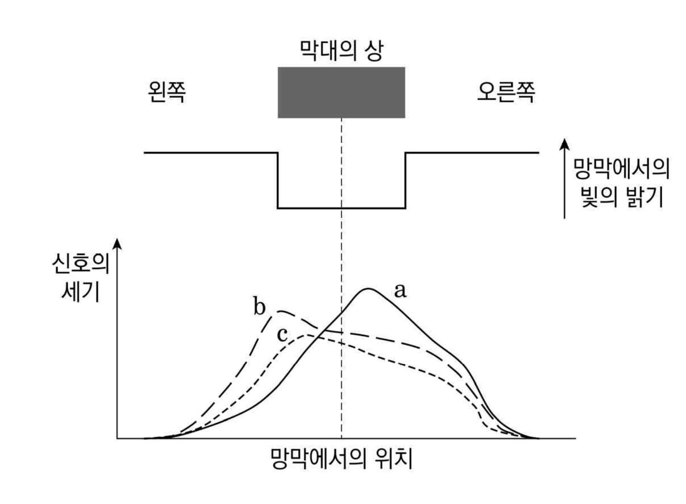
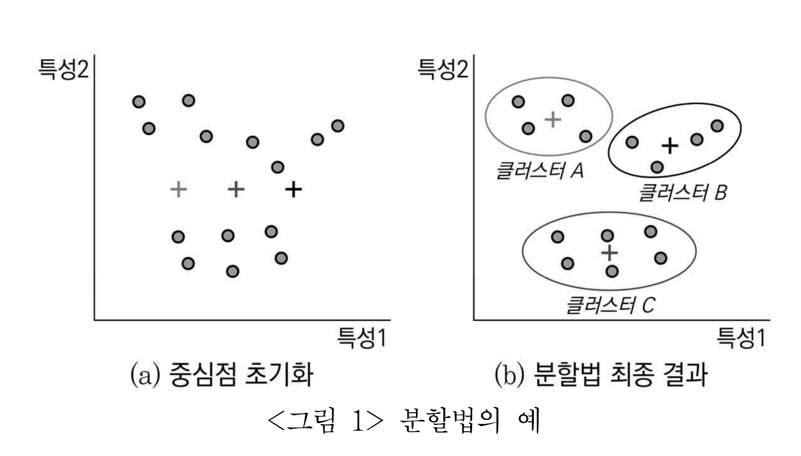
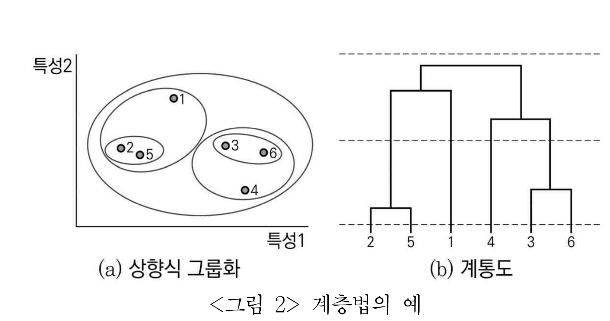

# [01-03] LU (2022)

다음 글을 읽고 물음에 답하시오.

## 제시문

5ㆍ16 군사쿠데타 이후 집권세력은 ‘부랑인’을 일소하여 사회의 명랑화를 도모한다는 명분 아래 사회정화사업을 벌였다. 무직자와 무연고자를 ‘개조’하여 국토 건설에 동원하려는 목적으로 <근로보도법>과 <재건국민운동에 관한 법률>을 제정ㆍ공포했다. 부랑인에 대한 사회복지 법령들도 이 무렵 마련되기 시작했는데, <아동복리법>에 ‘부랑아보호시설’ 관련 규정이 포함되었고 <생활보호법>에도 ‘요보호자’를 국영 또는 사설 보호시설에 위탁할 수 있음이 명시되었다.

실질적인 부랑인 정책은 명령과 규칙, 조례 형태의 각종 하위 법령에 의거하여 수행되었다. 특히 ㉠<내무부훈령 제410호>는 여러 법령에 흩어져있던 관련 규정들을 포괄하여 부랑인을 단속 및 수용하는 근거 조항으로 기능했다. 이는 걸인, 껌팔이, 앵벌이를 비롯하여 ‘기타 건전한 사회 및 도시 질서를 저해하는 자’를 모두 ‘부랑인’으로 규정했다. 헌법, 법률, 명령, 행정규칙으로 내려오는 위계에서 행정규칙에 속하는 훈령은 상급 행정기관이 하급 기관의 조직과 활동을 규율할 목적으로 발하는 것으로서, 원칙적으로는 대외적 구속력이 없으며 예외적인 경우에만 법률의 위임을 받아 상위법을 보충한다. 위 훈령은 복지 제공을 목적으로 한 <사회복지사업법>을 근거 법률로 하면서도 거기서 위임하고 있지 않은 치안 유지를 내용으로 한 단속 규범이다. 이를 통한 인신 구속은 국민의 자유와 권리를 필요한 경우 국회에서 제정한 법률로써 제한하도록 규정한 헌법에 위배되는 것이기도 하다.

1961년 8월 200여 명의 ‘부랑아’가 황무지 개간 사업에 투입되었고, 곧이어 전국 곳곳에서 간척지를 일굴 개척단이 꾸려졌다. 1950년대 부랑인 정책이 일제 단속과 시설 수용에 그쳤던 것과 달리, 이 시기부터 국가는 부랑인을 과포화 상태의 보호시설에 단순히 수용하기보다는 저렴한 노동력으로 개조하여 국토 개발에 활용하고자 했다. 1955년부터 통계 연표에 수록되었던 ‘부랑아 수용보호 수치 상황표’가 1962년에 ‘부랑아 단속 및 조치 상황표’로 대체된 사실은 이러한 변화를 시사한다.

이 같은 정책 시행의 결과로 부랑인은 과연 ‘개조’되었는가? 개척의 터전으로 총진군했던 부랑인 가운데 상당수는 가혹한 노동 조건이나 열악한 식량 배급, 고립된 생활 등을 이유로 중도에 탈출했다. 토지 개간과 간척으로 조성된 농지를 분배 받기를 희망하며 남아 있던 이들은 많은 경우 약속된 땅을 얻지 못했으며, 토지를 분배 받은 경우라도 부랑인 출신이라는 딱지 때문에 헐값에 땅을 팔고 해당 지역을 떠났다. 사회복지를 위한 제도적 기반이 충분히 갖추어져 있지 않은 상황에서 사회법적 ‘보호’ 또한 구현되기 어려웠다. <아동복리법 시행령>은 부랑아 보호시설의 목적을 ‘부랑아를 일정 기간 보호하면서 개인의 상황을 조사ㆍ감별하여 적절한 조치를 취함’이라 규정했으나, 전문적인 감별 작업이나 개별적 특성과 필요를 고려한 조치는 드물었고 규정된 보호 기간이 임의로 연장되기도 했다. 신원이 확실하지 않은 자들을 마구잡이로 잡아들임에 따라 수용자 수가 급증한 국영 또는 사설 복지기관들은 국가보조금과 민간 영역의 후원금으로 운영됨으로써 결국 유사 행정기구로 자리매김했다. 그중 일부는 국가보조금을 착복하는 일도 있었다.

국가는 <근로보도법>과 <재건국민운동에 관한 법률> 등을 제정하여 부랑인을 근대화 프로젝트에 활용할 생산적 주체로 개조하고자 하는 한편, 그러한 생산적 주체에 부합하지 못하는 이들은 <아동복리법>이나 <생활보호법>의 보호 대상으로 삼았다. 또한 각종 하위 법령을 통해 부랑인을 ‘예비 범죄자’나 ‘우범 소질자’로 규정지으며 인신 구속을 감행했다. 갱생과 보호를 지향하는 법체계 내부에 그 갱생과 보호의 대상을 배제하는 기제가 포함되어 있었던 것이다.

국가는 부랑인으로 규정된 개개의 국민을 경찰력을 동원해 단속ㆍ수용하고 복지기관을 통해 규율했을 뿐만 아니라, 국민의 인권과 복리를 보장할 국가적 책무를 상당 부분 민간 영역에 전가시킴으로써 비용 절감을 추구했다. 당시 행정당국의 관심은 부랑인 각각의 궁극적인 자활과 갱생보다는 그가 도시로부터 격리된 채 자활ㆍ갱생하고 있으리라고 여타 사회구성원이 믿게끔 하는 데에 집중되었던 것으로 보인다. 부랑인은 사회에 위협을 가하지 않을 주체로 길들여지는 한편, 국가가 일반 시민으로부터 치안 관리의 정당성을 획득하기 위한 명분을 제공했다.

## 01

윗글의 내용과 일치하는 것은?

### 선택지

(1) 부랑인 정책은 갱생 중심에서 격리 중심으로 초점이 옮겨갔다.
(2) 부랑아의 시설 수용 기간에 한도를 두는 규정이 법령에 결여되어 있었다.
(3) 부랑인의 수용에서 행정기관과 민간 복지기관은 상호 협력적인 관계였다.
(4) 개척단원이 되어 도시를 떠난 부랑인은 대체로 개척지에 안착하여 살아갔다.
(5) 부랑인 정책은 치안 유지를 목적으로 하여 사회복지 제공의 성격을 갖지 않았다.

## 02

㉠에 대한 비판으로 적절하지 <u>않은</u> 것은?

### 선택지

(1) 상위 규범과 하위 규범 사이의 위계를 교란시켰다.
(2) 근거 법령의 목적 범위를 벗어나는 사항을 규율했다.
(3) 법률을 제정하는 국회의 입법권을 행정부에서 침해하는 결과를 초래했다.
(4) 부랑인을 포괄적으로 정의함으로써 과잉 단속의 근거로 사용될 여지가 있었다.
(5) 부랑인 단속을 담당하는 하급 행정기관이 훈령을 발한 상급 행정기관의 지침을 위반하도록 만들었다.

## 03

<보기>의 내용을 윗글에 적용한 것으로 적절하지 <u>않은</u> 것은?

### 보기

국가는 방역과 예방 접종, 보험, 사회부조, 인구조사 등 각종 ‘안전장치’를 통해 인구의 위험을 계산하고 조절한다. 그 과정에서 삶을 길들이고 훈련시켜 효용성을 최적화함으로써 ‘순종적인 몸’을 만들어내는 기술이 동원된다. 이를 통해 정상과 비정상, 건전 시민과 비건전 시민의 구분과 위계화가 이루어지고 ‘건전 사회의 적’으로 상정된 존재는 사회로부터 배제된다. 이는 변형된 국가인종주의의 발현으로 이해할 수도 있다. 고전적인 국가인종주의가 선천적이거나 역사적으로 구별되는 인종을 기준으로 이원 사회로 분할하는 특징이 있다면, 변형된 국가인종주의는 단일 사회가 스스로의 산물과 대립하며 끊임없이 ‘자기 정화’를 추구한다는 점에서 차이가 있다.

### 선택지

(1) 부랑인을 ‘우범 소질’을 지닌 잠재적 범죄자로 규정한 것은 한 사회의 ‘자기 정화’를 보여준다고 할 수 있다.
(2) 부랑인을 ‘개조’하여 국토 개발에 동원하고자 한 것은 삶을 길들이고 훈련시키는 기획을 보여준다고 할 수 있다.
(3) 부랑인을 생산적 주체와 거기에 이르지 못한 주체로 구분 지은 것은 변형된 국가인종주의의 특징을 보여준다고 할 수 있다.
(4) 치안관리라는 명분을 위해 부랑인의 존재를 이용한 것은 건전 시민과 비건전 시민의 구분과 위계화를 보여준다고 할 수 있다.
(5) 부랑인의 갱생을 지향하는 법체계에 배제의 기제가 내재된 것은 ‘순종적인 몸’을 만들어내는 기술과 ‘안전장치’가 배척 관계임을 보여준다고 할 수 있다.

# [04-06] LU (2022)

다음 글을 읽고 물음에 답하시오.

## 제시문

현대의 환경 위기는 인류의 생존 문제일 뿐 아니라 근대 이후 구현되어 온 인본주의적 가치들을 위협할 수 있는 요인이기도 하다. 즉 그것은 ‘생존’을 빌미로 하는 신유형의 독재나 제국주의를 유발함으로써 자유, 인권, 평등의 가치에 근거한 민주주의나 세계 시민주의 등의 이념들을 위기에 처하게 할 수 있다는 점에서도 문제인 것이다. 환경 위기는 특히 ‘철학적 근대’에 관한 담론에서 중요 주제로 부각된다. 이 위기는 자연과 인간을 근본적으로 차별하는 세계관을 사상적 토대로 하고, 또한 그러한 세계관은 인간의 이성적 주체성을 전면에 등장시킨 근대의 철학적 혁명에서 비롯되었기에, 사상사적 맥락에서 가장 큰 책임을 져야 하는 것이 바로 철학적 근대라고 지적되기 때문이다. 그러나 철학적 근대는 경시할 수 없는 미덕을 동시에 지니기 때문에, 그대로의 수용도 원천적 거부도 선택할 수 없는 딜레마적 문제이다. 저 숭고한 인본주의적 가치들은 무엇보다도 인간의 지성적ㆍ실천적 자율성을 주창한 철학적 근대를 통해 정초되었기 때문이다.

철학적 근대는 ㉠<u>데카르트주의</u>의 발흥 및 완성의 과정으로 이루어진다는 것이 일반적 통념이다. 이성적 사유 주체의 절대적 확실성을 철학의 제1 원리로 논증하는 이 사상 체계에서 자연은 주체에 대해 근본적 타자로서, 그 어떤 자기 목적이나 내면도 없는 단적인 물질적 실체, 즉 ‘길이, 넓이, 깊이로 연장된 것’이라는 열등한 존재로 인식된다. 인간과 자연의 이러한 위계적 이원화는 인간의 자연 지배를 정당화하는 토대가 되거니와, 기계론적으로 양화되는 연장의 영역으로 정위된 자연은 인간 마음대로 사용할 수 있는 유용한 자재 창고로 여겨지게 된 것이다.

자연과학적 실험의 보편화는 더욱 과격화된 철학적 자연관의 출현을 촉발한다. 자연은 ‘인식’과 ‘사용’의 대상이던 것에서 나아가 ‘제작’의 대상으로까지 여겨지게 된다. 진리를 발견되는 것이 아니라 만들어지는 것으로 보는 이러한 노선은 ㉡<u>칸트주의</u>에서 특히 전형적으로 대두한다. 즉 의지의 규범인 도덕 준칙과 마찬가지로 지성의 대상인 자연 법칙 또한 그 입법권이 자율적 주체인 인간에게 부여되는 것이다. 자연은 한낱 조야한 질료로서 주어질 뿐, 그 구체적 존재 형식은 인식 주체로서의 인간의 지적 틀에 의해 결정된다는 것이다. 물론 이 사상에서 자연의 자기 목적이 중요한 화두로 제기되기도 하지만, 이 역시 세계를 대하는 인간의 심적 태도의 차원에서 상정될 뿐이다.

이러한 추이로부터 짐작하면, 철학적 근대의 완성판이라 불리는 <u>객관적 관념론</u>은 어떤 노선보다도 강한 이성주의적 면모를 지니는 까닭에, 자연에 대한 억압적 지배를 정당화하는 궁극의 사조라는 죄명을 뒤집어쓸 개연성이 클 것이다. 하지만 이 철학 사조는 그러한 혐의가 근본적 몰이해에서 비롯된 것이라고 항변할 수 있는 상당한 근거를 지니는데, 흥미롭게도 그 근거는 이 사조가 철학적 근대의 핵심 원리인 ‘이성’의 위상을 극한으로 강화한다는 점에 있다. 객관적 관념론은 문자 그대로 관념의, 구체적으로는 이성의 객관적 진리치를 정당화하고자 한다. 중요한 것은 여기서 ‘이성’이 이전의 근대 철학에서와는 사뭇 다른 층위의 의미를 지닌다는 점이다. 즉 ‘이성’은 단지 지적 능력의 특정한 형식이나 단계를 지칭하는 것에서 나아가 근본적으로는 존재론적ㆍ형이상학적 위상까지 지니는 최상위의 범주 또는 섭리를 가리킨다. ‘모든 것은 개념, 판단, 추론이다’라는 헤겔의 말처럼, 이성은 ‘세계의 모든 것에 선행하면서 동시에 그 모든 것을 가능케 하는 조건’, 즉 ‘삼라만상의 선험적인 논리적 구조 내지 원리’라는 절대적 위상을 지니며, 이에 모든 자연사와 인간사는 이러한 절대적 이성이 시공간의 차원으로 외화한 현상적 실재로 설명된다. 즉 자연은 절대적 이성에 따라 존재하고 변화하는 사물 양태의 이성이고, 지성적 주체인 인간은 절대적 이성에 따라 사유하고 성숙하여 절대적 이성의 인식에 도달해 가는 의식 양태의 이성이기에, 양자는 본질적으로 동근원적이라는 것이다.

객관적 관념론은 오히려 최고도로 강화된 이성주의를 통해 철학적 근대의 딜레마에 대한 해결을 모색할 수 있음을 보여준다. 그것은 이성적 주체의 위상을 정당화하면서도 동시에 무분별한 자연 지배를 경계할 수 있는 논거를 제시한다. 그 때문에 현대의 환경 철학 담론에서 근대를 원천적으로 거부하는 포스트모더니즘이 상당한 공감을 얻고 있는 와중에도 객관적 관념론에 기반을 둔 자연철학의 계발이 주목을 받는 것이다.

## 04

윗글에 대한 이해로 가장 적절한 것은?

### 선택지

(1) 가장 강화된 이성주의는 인간에 대한 자연의 형이상학적 우위를 정초한다.
(2) 현대의 환경 위기는 새로운 억압적 정치 체제의 대두와 함께 도래한 것이다.
(3) 포스트모더니즘은 철학적 근대의 딜레마를 이성에 근거하여 해소하고자 한다.
(4) 인본주의적 이념들의 사상적 토대를 제공한 것은 철학적 근대의 주목할 만한 성과이다.
(5) 인간의 이성적 주체성을 옹호하는 철학사적 흐름은 억압적 자연관으로 귀결될 수밖에 없다.

## 05

㉠과 ㉡을 비교한 것으로 적절하지 <u>않은</u> 것은?

### 선택지

(1) ㉠은 ㉡과 달리 자연의 자기 목적을 이성적 인식의 기준으로 설정한다.
(2) ㉡은 ㉠과 달리 인간을 자연 법칙을 수립하는 주체로 승인한다.
(3) ㉠과 ㉡은 모두 자연을 인식과 사용의 대상으로 생각한다.
(4) ㉠과 ㉡은 모두 자연에 대한 인간 이성의 우위를 주장한다.
(5) ㉠과 ㉡은 모두 환경 위기에 대한 철학적 책임이 있는 것으로 평가된다.

## 06

<u>객관적 관념론</u>에 대해 추론한 것으로 적절하지 <u>않은</u> 것은?

### 선택지

(1) 자연 법칙을 탐구하는 자연과학은 의식 양태의 이성이 사물 양태의 이성을 인식하는 것이라고 여길 수 있을 것이다.
(2) 이성의 위상을 지고의 형이상학적 차원까지 높임으로써 자연 법칙을 인간 의식의 투영을 통해 만들어지는 것으로 여길 것이다.
(3) 삼라만상이 절대적 이성의 발현이므로 반이성으로 보이는 어떤 것도 궁극적으로는 이성 영역에 포섭된다고 설명할 수 있을 것이다.
(4) 이성이 절대적 진리치를 지닌다는 관점에 의거하여 모든 역사적 사건도 이성의 법칙에 따라 진행되는 것으로 이해할 수 있을 것이다.
(5) 억압적 자연 지배의 책임을 져야 한다는 비판이 제기된다면 자연과 인간의 동근원성을 강조하는 일원론적 관점을 근거로 반박할 수 있을 것이다.

# [07-09] LU (2022)

다음 글을 읽고 물음에 답하시오.

## 제시문

소설을 읽는다는 것은 이야기를 하는 누군가의 목소리를 듣는다는 것을 뜻한다. 독자에게 특정한 배경 속에서 여러 인물들이 펼치는 사건에 대해 ‘말하는 주체’를 우리는 화자라고 부른다. 그래서 독자는 항상 화자의 목소리를 통해서 허구 세계에 대한 정보를 얻는다. 가령 등장인물의 대화가 직접화법으로 표현된 장면을 떠올려보자. 드라마가 화자 없이 등장인물의 대사로 진행된다는 점에서 이 장면도 드라마와 유사하게 느낄 수 있겠지만, 사실은 화자가 의도적으로 간접화법 대신 직접화법을 채택한 것이어서 독자에게 대화를 직접 듣는다는 착각을 이끌어내려는 책략이라고 보아야 한다. 독자는 화자가 자신의 말로 바꾸었는가 혹은 그렇지 않았는가 상관없이 언제나 그의 목소리를 들을 뿐이다.

화자가 사건에 대해 말하기 위해서는 먼저 사건을 보는 것이 필요하다. ㉠브룩스와 워렌은 순전히 화자가 보는 위치를 기준으로 일인칭과 삼인칭을 구분한 뒤, 목격자로서 사건을 관찰하는지 그렇지 않으면 탐구자로서 사건을 분석하는지에 따라 일인칭 주인공 시점과 일인칭 관찰자 시점, 작가 관찰자 시점과 전지적 작가 시점으로 구분한다. 그렇지만 이들의 논의는 삼인칭 시점에서 ‘화자’의 시점을 ‘작가’의 시점으로 치환하였고, 특정 인물의 내면을 그려내는 것과 모든 인물의 내면을 그려내는 것을 전지적 작가 시점으로 뭉뚱그렸다는 비판을 받았다.

‘보는 주체’로서의 화자의 역할에 대한 또 다른 접근은 ㉡랜서에 의해 이루어졌다. 그는 화자의 역할을 이야기의 내용이나 주제와 결합시켰다. 기존 논의가 ‘시점’이라는 말에서 짐작할 수 있듯이 사건을 보는 위치에 치중했던 것을 반성하고, 사건을 보는 입장도 고려하고자 했다. 화자가 다른 공간적 위치에 서거나 다른 이념적 입장을 가질 때, 같은 사건도 다르게 인식되어 다르게 재현된다는 것이다. 그래서 랜서는 화자를 작가가 창조한 세계를 보여주는 인식틀이라고 언급했다. 독자가 화자를 통해서 이야기를 접한다는 점을 고려할 때, 독자가 바라볼 수 있는 시선과 들을 수 있는 목소리는 항상 화자에 의존한다는 것을 알려준 셈이다.

이와 관련하여 화자가 작품에 개입하는 것과 독자에게 진실을 전달하는 방식을 둘러싼 ㉢플라톤의 고전적인 문제제기는 흥미롭다. 그는 모방을 논하면서 영혼의 진정성 문제를 연결시킨다. 화자의 개입을 최소화하여 독자들이 실재와 가상을 착각하게 만들수록 진정성을 의심한 반면, 주관적인 논평을 섞는 방식으로 화자를 떠올리게 할수록 좀 더 진정성을 지닌 것으로 평가했던 것이다. 이러한 관점을 소설에 비추어 보면 화자를 이야기에 개입하여 객관성을 훼손하는 존재로 바라보던 태도에서 벗어나야 한다는 것을 시사한다. 즉 소설은 화자 때문에 객관성에 도달할 수 없는 것이 아니라 화자 덕분에 다른 양식과 구별되는 독자성을 획득할 수 있었던 것이다.

이렇듯 소설의 화자에 대해 지금까지 다양한 논의가 진행되었지만, 수많은 소설작품을 포괄할 만큼 충분히 정교하지 못한 것은 사실이다. 그리고 개별 작품의 경우에도 하나의 시점을 처음부터 끝까지 유지한 작품을 찾는 것이 쉽지 않다. 우리가 훌륭하다고 손꼽는 작품들 또한 그러하다. 따라서 화자의 위치나 입장, 역할 등을 이론적으로 따지기보다 구체적인 작품 감상과 결부시키는 편이 훨씬 현명하다. 작가 또한 메시지를 전달하는 데 가장 효과적인 방법이 무엇인지를 고민하는 것이다. 소설을 읽는 것을 등장인물, 화자, 독자가 정보량을 둘러싸고 벌이는 일종의 게임으로 바라보자는 견해가 바로 그것이다. 이 견해에 따르면 동일한 사건이라도 누가 정보를 더 많이 갖느냐에 따라 다른 이야기로 변주될 수 있다. 가령 화자가 등장인물이 모르는 정보를 독자에게 제공하는 경우, 자신이 처한 위기를 모르는 등장인물을 지켜보며 독자는 가슴을 졸일 수밖에 없다. 하지만 등장인물과 독자가 동일한 정보를 공유하는 경우, 독자는 인물과 같은 처지에서 작중의 상황을 이해하고 함께 퍼즐을 풀어가는 기분으로 소설을 경험할 것이다. 그리고 등장인물이 독자에게 공개하지 않은 비밀을 숨기고 있는 경우, 독자는 결말에 이르러서야 사건의 전모를 파악하면서 반전의 효과를 체험할 수도 있다. 이처럼 어떤 메시지를 전달하는 데 어울리는 화자를 창조하는 일은 작품의 성공과 실패를 가르는 첫걸음이다.

## 07

윗글의 내용과 일치하는 것은?

### 선택지

(1) 독자가 소설을 감상하고자 할 때, 독자와 접촉하며 정보를 제공하는 존재는 화자이다.
(2) 소설이 진행되는 동안 하나의 시점을 유지하는 것이 예술적으로 성공하는 지름길이다.
(3) 소설에서 등장인물의 대화를 직접화법으로 묘사할 때에는 화자의 목소리가 개입하지 않는다.
(4) 드라마에서는 통상 등장인물의 목소리뿐만 아니라 ‘말하는 주체’의 목소리도 관객에게 직접 들린다.
(5) 이야기되는 사건이 같다면 작가가 화자의 위치나 입장, 독자와의 관계를 변화시켜도 다른 소설로 만들기 어렵다.

## 08

㉠~㉢에 대한 이해로 적절하지 <u>않은</u> 것은?

### 선택지

(1) ㉠은 현실에 존재하는 작가와 작가가 창조한 화자를 개념적으로 구분하지 않고 있다.
(2) ㉡은 화자에 대해 이야기를 수용하는 독자의 입장에 영향을 미치는 인식틀로 작용한다고 보고 있다.
(3) ㉢은 독자들이 실재와 가상을 혼동하지 않도록 하는 것이 진정성 있는 태도라고 판단하고 있다.
(4) ㉠과 ㉡은 ‘말하는 주체’에 선행하는 ‘보는 주체’로서의 화자의 역할을 소설의 내용적 측면에서 분석하고 있다.
(5) ㉡과 ㉢은 화자를 통해서 작가의 입장이나 메시지를 파악할 수 있다고 믿고 있다.

## 09

윗글을 바탕으로 <보기>를 평가한 것으로 적절하지 <u>않은</u> 것은?

### 보기

시내에 나갔다 왔다. 그사이 누군가가 집에 다녀간 흔적이 있다. 조심스러운 손길이었지만 분명히 집을 뒤졌다. 몇몇 물건들은 도저히 찾을 수가 없다. 가져간 것이 분명하다. 도둑일까? 집에 도둑이 든 일은 지금껏 없었다.

저녁에 퇴근한 은희에게 집에 도둑이 들었다고 말했다. 은희는 딱한 얼굴로 나를 바라보며 그런 일은 없었다고 한다. 뭐가 없어졌느냐고 묻는데 생각이 나지 않았다. 그러나 분명히 뭐가 없어졌다. 느낄 수 있다. 그런데 입 밖으로 꺼내 말할 수가 없다.

“치매에 걸리면 다들 그런대요. 며느리도 도둑이라고 하고 간호사도 도둑이라고 하고.”

그래, 그걸 도둑망상이라고들 하지. 나도 그건 알아. 그런데 이건 망상이 아니야. 분명히 뭔가 없어졌다고. 일지와 녹음기는 몸에 지니고 있으니 무사했지만 다른 무언가가 사라졌다.

“그래, 개가 없어졌다. 개가 없어졌어.”

“아빠, 우리 집에 개가 어디 있어요?”

이상하다. 분명히 개가 있었던 것 같은데.

- 김영하, 『살인자의 기억법』 -

### 선택지

(1) 화자가 주인공과 동일한 인물이기 때문에, 독자들은 주인공의 내면 변화를 파악할 수 있겠군.
(2) 화자가 다른 등장인물과 함께 허구세계에 있기 때문에, 독자들은 사건의 전모를 모른 채 상황이 발생할 때마다 긴장감을 경험할 수 있겠군.
(3) 주인공과 화자와 독자의 정보가 일치하기 때문에, 독자들은 주인공과 등장인물들에 대한 화자의 정보를 객관적 사실로 받아들일 수 있겠군.
(4) 주인공인 화자가 다른 등장인물의 내면을 파악할 수 없기 때문에, 독자들은 자신의 상황을 정확히 알지 못하는 주인공을 안타깝게 느낄 수 있겠군.
(5) 모든 등장인물에 대한 정보가 화자의 시선과 목소리로 전달되기 때문에, 독자들은 다른 등장인물의 진실이 뒤늦게 알려지면 이야기의 흐름이 달라지리라 기대할 수 있겠군.

# [10-12] LU (2022)

다음 글을 읽고 물음에 답하시오.

## 제시문

개체의 생존을 위해서는 움직이는 물체의 시각 정보를 효율적으로 처리하는 것이 중요하다. 예를 들어 숲 속을 걸을 때 특별한 주의를 기울이지 않았음에도 복잡한 형태의 나무들 사이에서 작은 동물의 움직임을 재빨리 알아챌 수 있다. 나무는 움직이지 않으므로 시간차를 두고 획득한 두 이미지의 차이를 통해 그 움직임을 간단히 알아낼 수 있을 것 같지만, 실제로는 가만히 한곳을 응시하더라도 안구가 끊임없이 움직이고 있어 망막에 맺히는 이미지 전체가 시간에 따라 변하므로 더 정교한 정보 처리가 필요하다. 최근 미세전극이 일정한 간격으로 촘촘히 배열된 마이크로칩을 이용하여 망막에서 발생하는 전기적 신호를 실시간으로 관찰할 수 있게 되면서 이러한 고차원 시각 정보 처리가 뇌에서 전적으로 이루어지는 것이 아니라 망막에서 시작된다는 증거들이 발견되었다.

망막은 어떻게 전체 이미지가 흔들리는 속에서 작은 동물의 움직임에 대한 정보를 골라내는 것일까? 망막에는 빛에 반응하는 광수용체세포와 일정한 영역에 분포한 여러 광수용체세포에 연결되어 최종 신호를 출력하는 신경절세포가 존재한다. 신경절세포 가운데 특정 종류는 각 세포가 감지하는 부분이 이미지 전체의 이동 경로와 같은 경로를 따라 움직일 때는 전기적 신호를 발생하지 않고 다른 경로를 따라 움직일 때만 신호를 발생한다. 안구의 움직임에 의한 상의 떨림은 망막 위에서 전체 이미지가 같은 방향으로 움직이는 변화를 만드는데, 작은 동물의 상은 이와는 이동 경로가 다르므로 그 부분에 분포한 특정 종류의 신경절세포만이 신호를 발생하게 되어 작은 움직임도 잘 볼 수 있게 된다.

망막의 또 다른 신호 처리의 예로 움직이는 테니스공을 치는 경우를 생각해 보자. 충분한 밝기의 빛이 도달하더라도 망막에서 시각 정보가 처리되는 데 수십 분의 1초가 걸린다. 강하게 친 테니스공은 이 시간 동안 약 2m를 이동할 수 있어서 라켓을 벗어나기에 충분한데도 어떻게 그 공을 정확히 쳐 낼 수 있을까?

이를 알아보기 위해 연구자들은 ㉠마이크로칩 위에 올려진 도롱뇽의 망막에 막대 모양의 상을 맺히게 하고 상의 밝기와 이동 속도 등을 변화시켜가며 망막에서 발생하는 신호를 측정하였다. 폭이 0.13 mm인 막대 모양의 상을 1/60 초 동안만 맺히게 한 후에 상 아래에 위치한 하나의 신경절세포에서 출력되는 신호를 측정한 실험의 경우, 광수용체에서 전기 신호가 발생하고 여러 신경세포를 거치는 과정에서 시간 지연이 일어나므로, 상이 맺힌 순간부터 약 1/20 초 후에 신경절세포에서 신호가 발생하기 시작하여 약 1/20 초 동안 지속되었다. 상을 일정한 속력으로 움직이며 상의 이동 경로에 위치한 여러 신경절세포에서 발생하는 신호를 측정한 실험의 경우, 실제 상이 도달한 위치보다 더 앞에 위치한 신경절세포에서 신호가 발생하기 시작하여 상의 앞쪽 경계와 같은 위치 혹은 이보다 앞선 위치에서 신호가 최대가 되었다.

개별 신경절세포의 시간 지연에도 불구하고 상의 앞쪽 경계에서 최대가 되는 모양의 신호를 만들기 위해서는 특별한 기제가 필요하다. 첫째는 신경절세포 반응의 시간 의존성이다. 즉, 밝기가 변화한 직후 신경절세포의 출력 신호가 최대가 되고 이후 점차 작아진다. 둘째, 신경절세포 신호증폭률의 동적 조절이다. 즉, 물체가 이동할 때 신경절세포는 물체의 이동 방향으로 가장 먼저 자극되는 광수용체의 신호를 크게 증폭하여 받아들이고 곧바로 증폭률을 떨어뜨려 신호의 세기를 줄여버린다. 상의 이동 경로에 위치한 신경절세포들에서 각각 이러한 기제에 따라 발생한 신호들이 합쳐져서 만들어지는 출력 신호는, 그 형태가 상의 앞쪽 경계면 혹은 그보다 앞선 지점에 대응하는 위치에서 그 세기가 최대가 되는 비대칭적인 모양이 된다.

물체와 주변의 밝기 차이가 작거나 속력이 너무 커서 증폭률의 변화가 물체의 이동 속력에 맞추어 재빨리 이루어지지 못하면, 이러한 기제가 잘 작동하지 못하여 시간 지연에 대한 보상이 잘 이루어지지 않는다. 어두울수록, 그리고 테니스공이 빠르게 움직일수록 정확하게 맞히기 어려운 이유도 이와 관련이 있다.

## 10

윗글의 내용과 일치하는 것은?

### 선택지

(1) 신경절세포는 광수용체에서 발생한 전기적 신호를 원래 세기대로 출력한다.
(2) 한곳을 가만히 응시할 때는 망막에 형성된 이미지의 떨림이 발생하지 않는다.
(3) 정지한 물체의 상에 대해 전기적 신호를 출력하지 않는 신경절세포가 존재한다.
(4) 마이크로칩은 망막에 도달한 빛을 전기적 신호로 변환시켜 관찰 가능하게 만든다.
(5) 빛의 밝기가 일정할 때 하나의 신경절세포에서 발생하는 신호의 세기는 일정하다.

## 11

<보기>의 실험에 대한 설명으로 적절한 것만을 있는 대로 고른 것은?

### 보기

다음 그림은 ㉠의 실험에서 어느 순간 망막에 형성된 빛의 밝기 분포와 신경절세포의 출력 신호를 위치에 따라 나타낸 것이다. 그래프 a, b, c는 각각 서로 다른 조건에서 측정한 결과로서, b와 c는 속력이 같고 상과 주변의 밝기 차가 다르고, a는 속력이 다르다. a, b, c 모두 상의 이동 방향은 같다.

<이미지 포함됨>

ㄱ. 상은 오른쪽에서 왼쪽으로 이동하고 있다.
ㄴ. 상의 속력은 a가 b보다 크다.
ㄷ. 상과 주변의 밝기 차는 b가 c보다 작다.

### 선택지

(1) ㄱ
(2) ㄴ
(3) ㄷ
(4) ㄱ, ㄴ
(5) ㄴ, ㄷ

## 12

윗글을 바탕으로 ‘도롱뇽이 파리를 응시하는 상황’을 이해한 것으로 가장 적절한 것은?

### 선택지

(1) 날아가는 파리가 속력을 줄이면 상이 맺힌 위치의 개별 신경절세포에서의 시간 지연이 감소한다.
(2) 아래위로 천천히 움직이는 물체 위에 앉아 있는 도롱뇽은 수평으로 날아가는 파리의 움직임을 알아채지 못한다.
(3) 배경이 밝고 파리의 색이 어두울수록 상의 위치와 신경절세포의 출력 신호가 최대가 되는 위치 사이의 오차가 크다.
(4) 망막에 맺힌 날아가는 파리의 상에서 머리 부분에서 발생하는 신호의 증폭률은 몸통 부분에서 발생하는 신호의 증폭률보다 작다.
(5) 도롱뇽이 눈을 깜박일 때, 정지한 파리의 상이 1/60 초 동안 사라지면 파리의 상이 있던 위치의 신경절세포에서는 1/60 초보다 오래 신호가 지속된다.

# [13-15] LU (2022)

다음 글을 읽고 물음에 답하시오.

## 제시문

파시즘을 규정하기란 쉽지 않다. 본디 파시즘은 1919년에서 1945년까지 무솔리니가 이끈 정치 운동, 체제, 이념만을 지칭하는 용어였다. 그러나 얼마 후 히틀러의 나치즘 역시 파시즘의 하나로 취급되었고, 점차 그 용어가 가리키는 대상도 다양해져 갔다. 이에 따라 파시즘에 대한 해석 및 정의는 용어의 대상만큼이나 넓은 스펙트럼을 가지게 되었다.

비교적 일찍 나타난 것은 기본적으로 계급투쟁 개념에 바탕을 둔 마르크스주의적 해석인데, 대표적인 것은 ㉠‘코민테른 테제’이다. 이에 따르면, 파시즘이란 “금융 자본의 가장 반동적이고 국수주의적이며 제국주의적인 분파의 공공연한 테러 독재”이다. 즉, 파시즘이 자본주의의 도구이며, 대자본의 대리인이라고 파악한 것이다. 하지만 모든 마르크스주의자들이 이 해석을 받아들인 것은 아니다. 톨리아티는 파시즘이 소부르주아적 성격의 대중적 기반 위에 있었다고 파악했으며, 나아가 탈하이머와 바이다는 파시즘이 계급으로부터 상대적으로 자유로운 현상이라고 보았다. 그들에 따르면, 자본과 노동이 대립하면서 어느 쪽도 절대 우위를 갖추지 못하면 제3의 세력이 등장하는데, 파시즘이 그 예라는 것이다. 이러한 마르크스주의적 해석에 대해 오늘날의 연구는 대체로 파시즘과 거대 자본 사이의 조화와 협력보다는 긴장과 갈등 국면을 강조한다. 또한 코민테른 테제는 지나친 단순화의 산물이라는 비판도 제기되었다.

한편 2차 대전 이후에는 냉전의 분위기 속에서 이탈리아의 파시즘, 독일의 나치즘, 소련의 스탈린주의를 뭉뚱그려 전체주의로 범주화하는 경향이 나타났다. 이 경향을 ㉡‘전체주의 이론’이라 칭할 수 있는데, 이 이론은 전체주의의 특징을 메시아 이데올로기, 유일 정당, 비밀경찰의 테러, 대중 매체의 독점, 무력 장악, 경제의 통제로 꼽았다. 이는 전체주의를 ‘문제화’하고 그 위험성을 경고했다는 점에서는 의미가 있었으나, 파시즘과 스탈린주의는 전혀 다른 계급적 토대 위에서 서로 다른 목표를 추구하므로 동일한 범주로 묶일 수 없다는 비판이 제기되었다.

이와 같은 연구사적 전통 속에서 1970년대 이후에는 파시즘을 아예 개별적 사례로만 미시적으로 연구하는 경향이 나타났다. 그러다가 1990년대 말, ㉢그리핀이 새로운 시각에서 일반화된 개념을 제시하여 각국의 유사한 사례들에 적용할 수 있게 했다. 그에 따르면, 파시즘은 근대적 대중 정치의 한 부류로서, 특정한 민족 혹은 종족 공동체의 정치 문화와 사회 문화에 대한 혁명적인 변화를 목적으로 삼는다. 그리고 ‘신화’를 수단으로 삼아 내적 응집력과 대중의 지지라는 추동력을 얻어낸다. 그 ‘신화’란 자유주의 몰락 이후의 질서라는 고난 속에서 쇠퇴의 위기에 처한 민족공동체가 새로운 엘리트의 지도 아래 부활한다는 것이다. 파시스트는 이 신화의 틀 내에서 민족공동체의 구성원을 적대적인 세력과 구분하고, 후자에 대해 폭력을 행사하는 것을 의무로 믿었다. 그들에게 폭력이 곧 죽어가는 민족의 ‘치유’였기 때문이다. 그러나 ‘치유’만으로는 부족했고, 신화가 실현되기 위해서는 구성원이 오직 역동성과 민족에 대한 헌신으로만 무장한 ‘파시즘적 인간’으로 거듭 나는 것이 필요했다. 그는 또 신화의 궁극적인 실현, 즉 ‘민족의 유토피아’를 건설하기 위해 자본주의 경제 체제를 수용하고 과학 문명의 성과를 환영하는 근대적 성격을 보여준 것에 주목하여 파시즘을 일종의 “근대적 혁명”이라고 보았다.

물론 그리핀의 주장에 동의하지 않는 연구자들도 있다. 예를 들어 ㉣팩스턴은 파시즘이 근대적 혁명이라는 주장을 거부하면서, 파시즘을 전통적인 권위주의적 독재의 변종으로 규정한다. 그는 혁명으로 보이는 파시즘이 실은 기성 제도 및 전통적 엘리트 계층과 연합했다는 점을 중시하기 때문이다. 그는 ‘이중 국가’ 개념을 파시즘 체제 분석에 적용시켰다. ‘이중 국가’는 합법성에 따라 관료적으로 움직이는 ‘표준 국가’가 당의 ‘동형 기구’로 만들어진 독단적 ‘특권 국가’와 갈등을 빚으면서도 협력 속에 공존한다는 개념이다. 이탈리아의 경우, 당 지부장은 임명직 시장에, 당 서기는 지사에, 파시스트 민병대는 군대에 해당했다. 팩스턴에 따르면, 파시즘 정권은 형식적 관료주의와 독단적 폭력이 혼합된 기묘한 형태였다. 세부적 차이가 있다면, 특권 국가가 결국 우위를 점한 나치와 달리 무솔리니는 표준 국가의 영역에 더 큰 권력을 허용하였다는 점이다. 최종적으로 1943년 7월 연합국의 진격으로 파시즘이 국가 이익에 더는 부합하지 않는다고 판단한 표준 국가는 ‘지도자’ 무솔리니를 권좌에서 끌어내렸다.

## 13

윗글의 내용과 일치하지 <u>않는</u> 것은?

### 선택지

(1) 마르크스주의자들의 해석 중에는 계급 간 대립을 부인하면서 파시즘을 해석하는 경우도 있다.
(2) 이탈리아와 독일, 소련의 억압적 체제들을 하나의 범주로 파악한 것은 냉전 상황을 배경으로 하고 있다.
(3) 파시즘이라는 용어는 이탈리아에서 특정 시기에 있었던 정치 현상을 가리켰지만, 지시 대상이 점차 확장되었다.
(4) 전체주의 이론은 파시즘과 스탈린주의의 서로 다른 기반과 목적을 간과하고 표면적 특징만을 추출했다는 비판을 받았다.
(5) 파시즘을 국수주의적이며 제국주의적인 성향의 대자본이 폭력을 수단으로 정권을 유지하려 한 정치 체제로 보는 것이 마르크스주의의 대표적 해석이다.

## 14

㉢과 ㉣에 대한 설명으로 적절하지 <u>않은</u> 것은?

### 선택지

(1) ㉢은 파시즘의 최종 목표가 ‘파시즘적 인간’을 완성해 내는 것이고, 폭력의 사용 및 자본과의 협력은 이를 위한 도구였다고 보았다.
(2) ㉢은 파시즘이 역사적 상황의 변화로 인해 맞이한 민족적 고난을 지도적 엘리트에 의해 극복한다는 ‘신화’를 세력의 단결과 체제 유지의 수단으로 삼았다고 보았다.
(3) ㉣은 독일 나치즘에서는 독단적 폭력이, 이탈리아 파시즘에서는 형식적 관료주의가 두드러졌다고 보았다.
(4) ㉣은 파시즘 치하에서 이중적 권력 기구가 갈등 속에서도 병존하는 현상을 권위주의적 독재에서 파생한 것이라고 파악하였다.
(5) ㉢은 파시즘에서 나타난 근대적 성격에 주목하여 혁명적 성격을 가졌다고 파악했고, ㉣은 기득권층과의 연합에 주목하여 혁명적 성격을 가지지 않았다고 파악했다.

## 15

윗글을 바탕으로 <보기>의 (가)~(다)의 입장을 추론한 것으로 가장 적절한 것은?

### 보기

(가) 이탈리아 파시즘 치하에서 소유 관계와 계급 구조는 바뀌지 않았다. 그렇기에 파시스트 ‘혁명’을 굳이 혁명이라고 한다면 아마 문화 혁명 정도가 될 것이다. 동시에 파시즘이 전통 문화와 타협하며 대중의 수동적 동의를 확보하려고 한 것을 보면, 그 문화 혁명이라는 것의 한계도 분명했다.

(나) 무솔리니 내각을 통상의 다른 행정부처럼 분석하는 사람도 있다. 그러나 파시즘은 사회 개혁의 실패, 즉 이탈리아 고유의 민족적 모순의 발현이며, 따라서 ‘민족의 자서전’이다. 투쟁과 경쟁을 통한 진보가 아니라, 나태하게 계급 협력이 가능하다고 믿는 민족은 존중받을 수 없기 때문이다.

(다) 파시즘은 소부르주아의 ‘정치적 육화’이다. 소부르주아는 의회를 파괴한 후에 부르주아 국가도 파괴하고 있다. 그것은 항상 더 큰 규모로 법의 권위를 사적 폭력으로 대체하고, 이 폭력을 혼란스럽게, 더 난폭하게 행사한다.

### 선택지

(1) (가)는 ‘소유 관계’와 ‘계급 구조’에 주목하는 것으로 보아 탈하이머와 바이다의 주장에 동의하는 입장을 보일 것이다.
(2) (가)는 ‘전통문화와 타협’하는 대중의 ‘수동적 동의’를 강조하는 것으로 보아 그리핀의 주장을 비판하는 입장을 보일 것이다.
(3) (나)는 ‘사회 개혁’을 중시하고 ‘민족적 모순’을 언급하는 것으로 보아 그리핀의 주장에 동의하는 입장을 보일 것이다.
(4) (다)는 ‘의회’와 ‘부르주아 국가’를 파괴한다는 점에 주목하는 것으로 보아 팩스턴의 주장에 동조하는 입장을 보일 것이다.
(5) (다)는 ‘정치적 육화’라는 말로 ‘소부르주아’가 파시즘의 수단이라고 강조하는 것으로 보아 톨리아티의 주장을 비판하는 입장을 보일 것이다.

# [16-18] LU (2022)

다음 글을 읽고 물음에 답하시오.

## 제시문

대규모 데이터를 분석하여 데이터 속에 숨어 있는 유용한 패턴을 찾아내기 위해 다양한 기계학습 기법이 활용되고 있다. 기계학습을 위한 입력 자료를 데이터 세트라고 하며, 이를 분석하여 유용하고 가치 있는 정보를 추출할 수 있다. 데이터 세트의 각 행에는 개체에 대한 구체적인 정보가 저장되며, 각 열에는 개체의 특성이 기록된다. 개체의 특성은 범주형과 수치형으로 구분되는데, 예를 들어 ‘성별’은 범주형이며, ‘체중’은 수치형이다.

기계학습 기법의 하나인 클러스터링은 데이터의 특성에 따라 유사한 개체들을 묶는 기법이다. 클러스터링은 분할법과 계층법으로 나뉘는데, 이 둘은 모두 거리 개념에 기초하고 있다. 가장 많이 사용되는 거리 개념은 기하학적 거리이며, 두 개체 사이의 거리는 n차원으로 표현된 공간에서 두 개체를 점으로 표시할 때 두 점 사이의 직선거리이다. 거리를 계산할 때 특성들의 단위가 서로 다른 경우가 많은데, 이런 경우 특성 값을 정규화할 필요가 있다. 예를 들어 특정 과목의 학점과 출석 횟수를 기준으로 학생들을 묶을 경우 두 특성의 단위가 다르므로 두 특성 값을 모두 0과 1 사이의 값으로 정규화하여 클러스터링을 수행한다. 또한 범주형 특성에 거리 개념을 적용하려면 이를 수치형 특성으로 변환해야 한다.

분할법은 전체 데이터 개체를 사전에 정한 개수의 클러스터로 구분하는 기법으로, 모든 개체는 생성된 클러스터 가운데 어느 하나에 속한다. <그림 1>에서 (b)는 (a)에 제시된 개체들을 분할법을 통해 세 개의 클러스터로 묶은 예이다. 분할법에서는 클러스터에 속한 개체들의 좌표 평균을 계산하여 클러스터 중심점을 구한다. 고전적인 분할법인 <u>K-민즈 클러스터링</u>(K-means clustering)에서는 거리 개념과 중심점에 기반하여 다음과 같은 과정으로 알고리즘이 진행된다.

1) 사전에 K개로 정한 클러스터 중심점을 임의의 위치에 배치하여 초기화한다.

2) 각 개체에 대해 K개의 중심점과의 거리를 계산한 후 가장 가까운 중심점에 해당 개체를 배정하여 클러스터를 구성한다.

3) 클러스터 별로 그에 속한 개체들의 좌표 평균을 계산하여 클러스터의 중심점을 다시 구한다.

4) 2)와 3)의 과정을 반복해서 수행하여 더 이상 변화가 없는 상태에 도달하면 알고리즘이 종료된다.

분할법에서는 이와 같이 개체와 중심점과의 거리를 계산하여 클러스터에 개체를 배정하므로 두 개체가 인접해 있더라도 가장 가까운 중심점이 서로 다르면 두 개체는 상이한 클러스터에 배정된다.

<이미지 포함됨>

클러스터링이 잘 수행되었는지 확인하려면 클러스터링 결과를 평가하는 품질 지표가 필요하다. K-민즈 클러스터링의 경우 품질 지표는 개체와 그 개체가 해당하는 클러스터의 중심점 간 거리의 평균이다. K-민즈 클러스터링에서 K가 정해졌을 때 개체와 해당 중심점 간 거리의 평균을 최소화하는 ‘전체 최적해’는 확정적으로 보장되지 않는다. 알고리즘의 첫 번째 단계인 초기화를 어떻게 하느냐에 따라 클러스터링 결과가 달라질 수 있으며, 경우에 따라 좋은 결과를 찾는 데 실패할 수도 있다. 따라서 전체 최적해를 얻을 확률을 높이기 위해, 서로 다른 초기화를 시작으로 클러스터링 알고리즘을 여러 번 수행하여 나온 결과 중에 좋은 해를 찾는 방법이 흔히 사용된다. 그런데 K-민즈 클러스터링 알고리즘의 한 가지 문제는 클러스터의 개수인 K를 미리 정해야 한다는 것이다. K가 커질수록 각 개체와 해당 중심점 간 거리의 평균은 감소한다. 극단적으로 모든 개체를 클러스터로 구분할 경우 개체가 곧 중심점이므로 이들 사이의 거리의 평균값은 0으로 최소화되지만, 클러스터링의 목적에 부합하는 유용한 결과라고 보기 어렵다. 따라서 작은 수의 K로 알고리즘을 시작하여 클러스터링 결과를 구한 다음 K를 점차 증가시키면서 유의미한 품질 향상이 있는지 확인하는 방법이 자주 사용된다.

한편, 계층법은 클러스터 개수를 사전에 정하지 않아도 되는 장점이 있다. <그림 2>와 같이 개체들을 거리가 가까운 것들부터 차근차근 집단으로 묶어서 모든 개체가 하나로 묶일 때까지 추상화 수준을 높여가는 상향식으로 알고리즘이 진행되어 계통도를 산출한다. 따라서 계층법은 개체들 간에 위계 관계가 있는 경우에 효과적으로 적용될 수 있다. 계통도에서 점선으로 표시된 수평선을 아래위로 이동해 가면서 클러스터링의 추상화 수준을 변경할 수 있다.

<이미지 포함됨>

## 16

윗글의 내용과 일치하는 것은?

### 선택지

(1) 클러스터링은 개체들을 묶어서 한 개의 클러스터로 생성하는 기법이다.
(2) 분할법에서는 클러스터링 수행자가 정확한 계산을 통해 초기 중심점을 찾아낸다.
(3) 분할법은 하향식 클러스터링 기법이므로 한 개체가 여러 클러스터에 속할 수 있다.
(4) 계층법으로 계통도를 산출할 때 클러스터 개수는 미리 정하지 않는다.
(5) 계층법의 계통도에서 수평선을 아래로 내릴 경우 추상화 수준이 높아진다.

## 17

<u>K-민즈 클러스터링</u>에 대해 추론한 것으로 적절하지 <u>않은</u> 것은?

### 선택지

(1) 특성이 유사한 두 개체가 서로 다른 클러스터에 배치될 수 있다.
(2) 초기 중심점의 배치 위치에 따라 클러스터링의 품질이 달라질 수 있다.
(3) 클러스터 개수를 감소시키면 클러스터링 결과의 품질 지표 값은 증가한다.
(4) 초기화를 다르게 하면서 알고리즘을 여러 번 수행하면 전체 최적해가 결정된다.
(5) K를 정하여 알고리즘을 진행하면 각 클러스터의 중심점은 결국 고정된 점에 도달한다.

## 18

<보기>의 사례에 클러스터링을 적용할 때 적절하지 <u>않은</u> 것은?

### 보기

OO기업에서는 표적 시장을 선정하여 마케팅을 실행하기 위해 전체 시장을 세분화하고자 한다. 시장 세분화를 위해 특성이 유사한 고객을 묶는 기계학습 기법 도입을 검토 중이다. 이 기업에서는 고객의 거주지, 성별, 나이, 소득 수준 등 인구통계학적인 정보와 라이프 스타일에 관한 정보 등을 보유하고 있다.

### 선택지

(1) 고객 정보에는 수치형이 아닌 것도 있어 특성의 유형 변환이 요구된다.
(2) 고객 특성은 세분화 과정을 통해 계통도로 표현 가능하므로 계층법이 효과적이다.
(3) K-민즈 클러스터링 알고리즘을 실행하려면 세분화할 시장의 개수를 먼저 정해야 한다.
(4) 나이와 소득수준과 같이 단위가 다른 특성을 기준으로 시장을 세분화할 경우 정규화가 필요하다.
(5) 모든 고객을 1명씩 세분화된 시장들로 구분하여 1:1 마케팅을 할 경우 K-민즈 클러스터링의 품질 지표 값은 0이다.

# [19-21] LU (2022)

다음 글을 읽고 물음에 답하시오.

## 제시문

오늘날 교과서적 견해에서 ‘소유와 지배의 분리’라는 개념은 전문 경영인 체제의 확립을 가리키지만 그로 인한 주주와 경영자 사이의 이해 상충을 내포한다. 다시 말해 주식 소유의 분산으로 인해 창업자 가족이나 대주주의 영향력이 약해져 경영자들이 회사 이윤에 대한 유일한 청구권자인 주주의 이익보다 자신들의 이익을 앞세우는 문제의 심각성을 강조하는 개념이다. 그러나 ㉠벌리가 이 개념을 처음 만들었을 때 그 의미는 달랐다. 그는 ‘회사체제’라는 현대 사회의 재산권적 특징을 포착하고자 이 개념을 고안했다. 그에게 있어서 ‘소유’, <u>‘지배’</u>, ‘경영’은 각각 (1) 사업체에 대한 이익을 갖는 기능, (2) 사업체에 대한 권한을 갖는 기능, (3) 사업체에 대한 행위를 하는 기능을 지칭하는 개념이지 각 기능의 담당 주체를 지칭하는 것이 아니다.

벌리에 따르면 산업혁명 이전에는 이 세 기능이 통합된 경우가 일반적이었는데 19세기에 많은 사업체들에서 소유자가 (1)과 (2)를 수행하고 고용된 경영자들이 (3)을 수행하는 방식으로 분리가 일어났다. 20세기 회사체제에서는 많은 사업체들에서 (2)가 (1)에서 분리되었다. 이제 (1)은 사업체의 소유권을 나타내는 증표인 주식을 소유하는 것, 즉 비활동적 재산의 점유가 되었고, (2)는 물적 자산과 사람들로 조직된 살아 움직이는 사업체를 어떻게 사용할지를 결정하는 것, 즉 활동적 재산의 점유가 되었다. 주식 소유가 다수에게 분산된 회사에서 (2)는 창업자나 그 후손, 대주주, 경영자, 혹은 모회사나 지주회사의 지배자 등 이사를 선출할 힘을 가진 다양한 주체에 의해 수행될 수 있다. 사기업에서는 통합되어 있던 위험 부담 기능과 회사 지배 기능이 분리되어 주주와 지배자에게 각각 배치됨으로써 회사라는 생산 도구는 전통적인 사유재산으로서의 의미를 잃게 되었다. 이런 의미에서 벌리는 소유와 지배가 분리된 현대 회사를 준공공회사라고 불렀다.

소유와 지배가 분리된 회사는 누구를 위해 운영되어야 하는가? 벌리는 이 질문에 대해 가능한 세 가지 답을 검토한다. 첫째, 재산권을 불가침의 권리로 간주하는 전통적인 법학의 논리에 입각한다면 회사가 오로지 주주의 이익을 위해서만 운영되어야 한다는 견해가 도출될 수밖에 없다. 그러나 자신의 재산에 대한 지배를 수행하는 소유자가 그 재산으로부터 나오는 이익을 전적으로 수취하는 것이 보호되어야 한다고 해서, 자신의 재산에 대한 지배를 포기한 소유자도 마찬가지로 이익의 유일한 청구권자가 되어야 한다는 결론을 도출하는 것은 잘못이다.

둘째, 전통적인 경제학의 논리에 입각하면 회사는 지배자를 위해 운영되어야 한다는 견해가 도출될 수밖에 없다. 왜냐하면 경제학은 전통적인 법학과 달리 재산권의 보호 자체를 목적으로 보는 것이 아니라 재산권의 보호를 사회적으로 바람직한 목적을 위한 수단으로 보기 때문이다. 재산권을 보호하는 이유가 재산의 보장 자체가 아니라 부를 얻으려는 노력을 유발하는 사회적 기능 때문이라면, 회사가 유용하게 사용되도록 하기 위해서는 회사를 어떻게 사용할지를 결정하는 지배자의 이익을 위해 회사가 운영되어야 한다. 그러나 위험을 부담하지 않는 지배자를 위해 회사가 운영되는 것은 최악의 결과를 낳는다.

셋째, 이처럼 법학과 경제학의 전통적인 논리를 소유와 지배가 분리된 회사체제에 그대로 적용했을 때 서로 다른 그릇된 결론들이 도출된다는 것은 두 학문의 전통적인 논리들이 전제하고 있는 19세기의 자유방임 질서가 회사체제에 더 이상 타당하지 않음을 보여준다. 자유방임 질서가 기초하고 있던 사회가 회사체제 사회로 변화된 상황에서는, 회사가 ‘지배자를 위해 운영되어야 한다’는 견해는 최악의 대안이고 ‘주주를 위해 운영되어야 한다’는 견해는 차악의 현실적인 대안일 뿐이다. 결국 회사체제에서 회사는 공동체의 이익을 위해 운영되어야 한다는 것이 벌리의 결론이다.

하지만 이를 뒷받침할 법적 근거가 마련되지 않거나, 이를 실현할 합리적인 계획들을 공동체가 받아들일 준비가 안 된 상황에서는, 회사법 영역에서 경영자의 신인의무의 대상, 즉 재산을 자신에게 믿고 맡긴 사람의 이익을 자신의 이익보다 우선해야 하는 의무의 대상을 주주가 아닌 다른 이해 관계자들로 확장해서는 안 된다고 벌리는 주장했다. 이 때문에 그는 회사가 주주를 위해 운영되어야 한다는 견해를 지지했던 것으로 흔히 오해된다. 그러나 회사법에서 주주 이외에 주인을 인정하지 않아야 한다고 그가 주장한 이유는 그렇게 할 경우 경영자들이 누구도 섬기지 않게 되고 회사가 경제적 내전에 빠지게 될 것이며 경제력이 집중된 회사 지배자들의 사회적 권력을 키워주는 결과를 낳을 것이라고 보았기 때문이다. 그는 회사법 영역에서 주주에 대한 신인의무를 경영자뿐 아니라 지배자에게도 부과하여 지배에 의한 회사의 약탈로부터 비활동적 재산권을 보호하는 것이 회사가 공동체의 이익을 위해 운영되도록 하기 위한 출발점이라고 보았다. 그리고 소득세법이나 노동법, 소비자보호법, 환경법 등과 같은 회사법 바깥의 영역에서 공동체에 대한 회사의 의무를 이행하도록 하는 현실적인 시스템을 마련하고 정착시킴으로써 사회의 이익에 비활동적 재산권이 자리를 양보하도록 만들 수 있다고 보았다.

## 19

윗글의 내용에 비추어 볼 때 적절하지 <u>않은</u> 것은?

### 선택지

(1) 소유와 지배의 분리에 대한 오늘날 교과서적 견해는 전통적인 법학 논리에 입각한 견해를 받아들이고 있다.
(2) 벌리는 회사법에서 회사의 사회적 책임을 강조할 경우 회사 지배자들의 권력을 키워 주는 결과를 낳는다고 보았다.
(3) 전통적인 경제학의 논리에 따르면 사회적으로 가장 좋은 결과를 낳을 수 있도록 재산권이 인정되는 것이 바람직하다.
(4) 벌리에 따르면 주주가 회사 이윤에 대한 유일한 청구권자가 아니기 때문에 경영자의 신인의무 대상을 주주로 한정해서는 안 된다.
(5) 벌리와 달리 오늘날 교과서적 견해에 따르면 대주주의 영향력이 강해지는 것이 소유와 지배의 분리에 따른 문제를 해결하는 데 도움이 될 수 있다.

## 20

<u>지배</u>에 대한 ㉠의 생각으로 적절하지 <u>않은</u> 것은?

### 선택지

(1) 준공공회사에서는 공동체의 이익을 위해 수행되는 기능이다.
(2) 전통적인 의미의 사유재산에서는 소유자가 수행하는 기능이다.
(3) 회사체제의 회사에서 이 기능의 담당자는 위험을 부담하지 않는다.
(4) 회사체제의 회사에서는 활동적 재산을 점유한 자가 수행하는 기능이다.
(5) ‘경영’의 담당자에 의해 수행될 수도 있다고 인정하지만 ‘경영’과 동일시하지 않는다.

## 21

<보기>의 ‘뉴딜’에 대해 ㉠이 보일 반응으로 적절하지 <u>않은</u> 것은?

### 보기

금융개혁에 초점을 맞춘 1차 뉴딜은 경영자들과 지배자들에게 주주에 대한 신인의무를 부과함으로써 주주의 재산권을 엄격하게 보호하는 원칙을 확립했다. 노사관계와 사회보장 등의 분야로 개혁을 확장했던 2차 뉴딜은 노동조합을 통한 노동자들의 제반 권리를 합법화했고 실업수당의 보장 수준과 기간을 강화했으며 사회보장제도를 확립했다. 이러한 1차 뉴딜과 2차 뉴딜의 차이점 때문에 뉴딜은 흔히 체계적인 청사진 없이 임기응변식으로 마련된 일관성 없는 정책들의 연속이었다고 평가받는다.

### 선택지

(1) 1차 뉴딜은 지배에 의해 회사가 약탈되는 것을 막기 위한 회사법 영역의 개혁이라고 볼 수 있다.
(2) 1차 뉴딜은 주주의 이익을 위해 회사가 운영되도록 하는 원칙을 확립한 개혁이라고 볼 수 있다.
(3) 2차 뉴딜은 주주의 재산권이 사회의 이익에 자리를 양보하도록 만드는 개혁이라고 볼 수 있다.
(4) 2차 뉴딜은 회사가 공동체의 이익을 위해 운영되기 위한 회사법 바깥 영역의 개혁이라고 볼 수 있다.
(5) 1차 뉴딜과 2차 뉴딜은 준공공회사로의 변화를 추구한다는 점에서 일관성이 있다고 볼 수 있다.

# [22-24] LU (2022)

다음 글을 읽고 물음에 답하시오.

## 제시문

미국 헌법은 권력 기관 간 견제와 균형의 원리에 기초한 대통령제를 규정하고 있다. 이는 특정 정치인이나 집단이 권력을 독식하거나 남용하지 못하도록 하여 민주주의를 지키도록 설계된 것이다. 이러한 제도 설계는 미국 역사에서 상당 기간 성공적으로 기능했다. 그러나 헌법이라는 보호 장치는 그 자체로 민주주의 정치 체제를 지키기에 충분치 않다. 여기에는 헌법이나 법률에 명문화되지 않은 민주주의 규범도 중요한 역할을 해왔다.

민주주의 규범이 무너지면 민주주의도 위태로워진다. 민주주의 유지에 핵심적 역할을 하는 두 규범은 민주주의보다 오랜 역사를 가진 ‘상호 관용’과 ‘제도적 자제’이다. 상호 관용은 경쟁자가 권력을 차지할 권리를 나와 동등하게 가진다는 사실을 인정하는 것이다. 반면 상대를 위협적인 적으로 인식할 때는 모든 수단을 동원해 이기려 한다. 제도적 자제는 제도적으로 허용된 권력을 신중하게 행사하는 태도이다. 합법적 권력 행사라도 자제되지 않을 경우 기존 체제를 위태롭게 할 수 있다. 제도적 자제의 반대 개념은 ‘헌법적 권력의 공격적 활용’이다. 이는 규칙을 벗어나지 않으면서도 그것을 최대한 활용하여 경쟁자를 경쟁의 장 자체에서 제거하려는 태도를 의미한다.

이 두 가지 규범은 상호 연관되어 있다. 상대를 경쟁자로 받아들일 때, 제도적 자제도 기꺼이 실천한다. 제도적 자제의 실천은 관용적인 집단이라는 이미지를 갖게 함으로써 선순환이 이뤄진다. 반면 서로를 적으로 간주할 때 상호 관용의 규범은 무너진다. 이러한 상황에서 정치인은 제도가 부여한 법적 권력을 최대한 활용하려 하며, 이는 상호 관용의 규범을 잠식해 경쟁자가 적이라는 인식을 심화하는 악순환을 가져온다.

민주주의 규범이 약화되면 견제와 균형에 기초한 민주주의는 두 가지 상황에서 위기를 맞게 된다. 첫 번째 상황은 야당이 입법부를 장악하면서 행정부 권력과 입법부 권력이 분열되었을 때이다. 이 경우 야당은 대통령을 공격하기 위해 헌법에서 부여한 권력을 최대한 휘두른다. 두 번째는 여당이 입법부를 장악함으로써 권력이 집중되는 상황이다. 여당은 민주주의 규범을 무시하고 대통령의 권력 강화를 위해 노력하며, 야당을 제거하기 위한 대통령의 탄압적 행위를 묵인하기도 한다.

미국 민주주의는 건국 이후 두 번의 큰 위기를 겪는다. ㉠첫 번째 위기는 남북 전쟁으로 초래되었다. 노예제를 찬성한 남부의 백인 농장주들, 그리고 그들과 입장을 같이 한 민주당은 당시 노예제 폐지를 주장한 공화당을 심각한 위협으로 인식했다. 남부는 미국 연방에서 탈퇴했고 결국 내전이 일어났다. 민주주의 규범이 다시 형성되기 시작한 것은 북부의 공화당과 남부의 민주당이 인종 문제를 전후 협상 대상에서 제외하면서부터이다. 전쟁에서 승리한 북부는 연방의 유지 등 정치적 필요에 의해 남부에서 군대를 철수하고 흑인의 인권 보장 노력도 중단한다. 민주당은 남부에서 흑인 인권을 억누르면서 그 지역에서 일당 지배의 기반을 구축한다. 이러한 일련의 사건으로 공화당에 대한 민주당의 적대감은 완화되었고, 그 결과 상호 관용의 규범도 회복된다. 역설적이게도 남북 전쟁 이후의 민주주의 규범은 인종 차별을 묵인한 비민주적인 타협의 산물이었다. 그리고 오랜 기간 백인 중심으로 작동했던 민주주의를 유지하는 데 기여했다.

㉡두 번째 위기는 1960년대 이후 민주주의의 확대와 함께 일어났다. 흑인의 참정권이 제도적으로 보장되었고, 대규모 이민으로 다양한 민족과 인종이 정치 체제로 유입되었다. 공화당과 민주당은 각기 다른 집단의 이익과 가치를 대변하게 되었다. 이후 양당 간 경쟁은 ‘당파적 양극화’로 치달았다. 보수와 진보 간 정책적 차이뿐만 아니라 인종과 종교, 삶의 방식을 기준으로 첨예하게 나뉘어 정당 간 경쟁이 적대적 갈등으로까지 확대되었다. 이러한 상황에서 인종 차별에 의존한 기존의 민주주의 규범은 한계를 보이면서 붕괴했다. 따라서 미국 민주주의가 건강하게 작동하기 위해서는 새로운 민주주의 규범을 확립할 필요가 있다.

## 22

윗글의 내용과 일치하는 것은?

### 선택지

(1) 상호 관용이 강화되면 제도적 자제는 약화되고 상호 관용이 약화되면 제도적 자제는 강화된다.
(2) 대통령과 입법부의 권력 행사가 합법적인 한, 민주주의 정치 체제 보호에 긍정적으로 작용한다.
(3) 민주주의 규범은 민주주의 이념으로부터 탄생한 것으로 민주주의 제도의 확립을 통해 발전된다.
(4) 민주주의 규범은 헌법이나 법률로 성문화될 때 민주주의 정치 체제를 보호하는 효과가 극대화된다.
(5) 견제와 균형의 원리를 통해 민주주의를 보호하고자 한 헌법의 목적을 실현 가능하게 한 것은 민주주의 규범이다.

## 23

㉠, ㉡에 대한 설명으로 가장 적절한 것은?

### 선택지

(1) ㉠을 거치면서 상호 관용과 제도적 자제의 규범이 건국 이후 처음으로 형성되었다.
(2) ㉠ 이후 형성된 민주주의 규범은 인종 차별적 특성으로 인해 정치 체제를 안정시키는 역할을 하지 못했다.
(3) ㉡은 민주주의의 확대로 촉발된 당파적 양극화가 기존의 민주주의 규범을 붕괴시켰다는 데 그 원인이 있다.
(4) ㉡은 다양한 집단의 정치 참여를 제도적으로 보장하는 방향으로 민주주의가 확대되면서 점차 완화되었다.
(5) ㉡에서는 ㉠에서와는 달리 정당별 지지 집단이 뚜렷이 구분되는 현상이 나타났다.

## 24

윗글을 바탕으로 <보기>에 대해 반응한 것으로 적절하지 <u>않은</u> 것은?

### 보기

칠레는 성공적인 대통령제 민주주의 국가였다. 좌파에서 우파에 이르기까지 다양한 정당이 있었지만, 20세기 초 이후 민주주의 규범이 자리 잡고 있었기 때문이다. 그러나 1960년대에 이념적 대립에 따른 ㉠당파적 양극화가 심화되었다. ㉡좌파와 우파 세력은 서로를 위협적인 적으로 인식했다. 대통령으로 선출된 좌파 정당의 아엔데는 사회주의 정책 추진을 위해 의회의 협조가 필요했으나 여당은 의회 과반 의석을 확보하지 못한 상태였다. ㉢그는 의회를 우회하여 국민투표를 실시하고자 했다. 이에 ㉣우파 야당은 과반 의석을 바탕으로 불신임 결의안을 잇달아 통과시켜 장관들을 해임했다. 칠레 헌법은 의회가 불신임 결의를 극히 예외적인 상황에서만 사용하도록 규정하고 있었고 ㉤1970년 이전까지 그것이 사용된 적은 거의 없었다. 결국 1973년 8월 칠레 의회는 아엔데 행정부가 헌법을 위반했다는 결의안을 통과시켰고, 곧이어 군부 쿠데타가 발생함으로써 칠레 민주주의는 붕괴했다.

### 선택지

(1) ㉠은 좌ㆍ우 이념을 중심으로 심화되었다는 점에서 1960년대 이후 미국에서 심화된 당파적 양극화와 성격이 다르군.
(2) ㉡으로 인해 1960년대 이후 칠레에서는 상호 관용의 규범이 붕괴되는 과정이 일어났겠군.
(3) ㉢으로 볼 때, 아엔데 대통령은 권력을 법의 테두리 내에서 행사함으로써 제도적 자제 규범을 실천하고자 했었군.
(4) ㉣로 볼 때, 민주주의 규범이 붕괴된 상황에서 대통령 소속 정당이 의회 소수당인 경우 야당이 헌법적 권력을 공격적으로 활용할 가능성이 높군.
(5) ㉤로 볼 때, 1970년 이전의 칠레 정치인들은 민주주의 규범을 존중함으로써 민주주의의 정착에 기여했겠군.

# [25-27] LU (2022)

다음 글을 읽고 물음에 답하시오.

## 제시문

알파고가 인간 바둑 최고수를 이긴 사건은 자연 세계에서 인간의 특권적 지위를 문제 삼고, 윤리학의 인간 중심적 전통에 도전한다. 우리는 이제 인간과 같은 또는 더 뛰어난 지능을 지닌 인공 지능도 도덕적 고려의 대상으로 인정해야 하는지의 물음에 직면하는 것이다. 이 물음에 선뜻 동의하지 못하는 사람들은 인간성의 핵심을 지적인 능력이 아니라 기쁨과 슬픔, 공포와 동정심 등의 감정적인 부분에서 찾으려 한다. 예컨대 알파고는 경쟁에서 이겨도 스스로 기뻐하지 못하며, 우리도 알파고를 축하하며 함께 축배를 들 수 없다. 인간의 특정 작업이 인공 지능을 갖춘 로봇에 의해 대체되더라도 인간의 감정을 읽고 인간과 상호작용하는 작업은 대체되지 못하리라는 것이다.

하지만 최근에는 감정을 가진 로봇, 곧 인공 감정을 제작하려는 열망이 뜨겁다. 인간의 돌봄과 치료 과정을 돕는 로봇은 사용자의 세밀한 필요에 더 잘 부응할 것이다. 사람들은 인간과 정서적 교감을 하는 로봇을 점점 가족 구성원처럼 여기게 될지도 모른다. 그러면 로봇은 인간과 같은 감정을 가지고 인간과 상호작용하는 존재가 될 것인가? 로봇을 도덕 공동체에 받아들여야 하는가? 이 물음에 답하려면 인간에게 감정의 핵심적인 역할은 무엇인지 생각해 보아야 한다. 인공 지능의 연구도 그렇지만, 인공 감정의 연구도 인간의 감정을 닮은 기계를 만들려는 시도이면서 동시에 감정 과정에 대한 계산 모형을 통해 인간의 감정을 더 깊이 이해하는 과정이기도 하다.

감정은 인지 과정과는 달리 적은 양의 정보로도 개체의 생존과 항상성 유지를 가능하게 해 주는 역할을 한다. 또 무엇을 추구하고 회피할지 판단하도록 하는 동기의 역할을 한다. 한편 우리는 사회적 상호작용에서 서로의 신체 반응이나 표정을 통해 미묘한 감정을 읽어내고 그에 적절히 반응하며, 그런 정서적 교감을 통해 공동체를 유지한다.

그러나 로봇이 정말로 이러한 감정 경험을 하는지 판단하기는 쉽지 않다. 철학자들은 인공 지능이 인간과 똑같은 인지적 과제를 수행했다고 하더라도 그것은 의미를 이해하지 못하기 때문에 진정한 지능이 아니라고 주장했다. 인공 감정에 대해서도 마찬가지로, 감정을 입력 자극에 대한 적절한 반응을 내놓는 행동들의 패턴이 아니라 내적인 감정 경험으로 이해한다면 인공 감정이 곧 인간의 감정이라고 말할 수 없다. 인간만 보더라도 행동의 동등성은 심성 상태의 동등성을 함축하지 않기 때문에, 동일한 행동을 하는 두 사람이 서로 다른 감정을 느낄 수 있고 그 역도 가능하다. 로봇의 경우에는 행동의 동등성이 곧 심성 상태의 존재성조차도 함축하지 않는다.

로봇이 감정을 가지기 위해서는 감정을 인식하고 표현하는 데 그쳐서는 안 되고 내적인 감정을 생성할 수 있어야 한다. 그러나 거기에는 현실적으로 상당히 어려운 전제 조건이 만족되어야 한다. 첫째, 감정을 가진 개체는 기본적인 충동이나 욕구를 가진다고 전제된다. 목마름, 배고픔, 피로감 등의 본능이나 성취욕, 탐구욕 등이 없다면 감정도 없다. 둘째, 인간과 사회적으로 상호작용하기 위해 인간이 가지는 것과 같은 감정을 가지려면, 로봇은 최소한 고등 동물 이상의 일반 지능을 가지고, 생명체들처럼 복잡하고 예측 불가능한 환경에 적응할 수 있어야 한다. 그런데 복잡한 환경에 적응하여 행위할 수 있는 일반 지능을 가진 인공 지능에 도달하는 길은 아직 멀다. 현재 인공 지능이 제한적인 영역에서 주어진 과제를 얼마나 효율적으로 산출하는지 이외의 문제들은 부차적인 것으로 치부되고 있기 때문이다. 그렇다면 ㉠진정한 감정이 없는 로봇을 도덕 공동체에 받아들일 이유는 없다.

## 25

윗글에 대한 이해로 적절하지 <u>않은</u> 것은?

### 선택지

(1) 인공 지능과 인공 감정을 연구하면 인간의 지능과 감정까지 더 잘 알게 된다.
(2) 인공 지능에서 행동이 하는 역할은 인공 감정에서 내적인 감정 경험이 맡는다.
(3) 인공 지능에 회의적인 철학자는 의미의 이해가 지능의 본질적 요소라고 생각한다.
(4) 인간성의 핵심이 로봇에게도 있다면 로봇을 도덕적 고려의 대상으로 인정해야 한다.
(5) 인공 감정은 현실적으로 만들기가 어렵고 만들어도 인간과 같은지 판단하기가 어렵다.

## 26

윗글을 바탕으로 <보기>의 상황에 대해 추론한 것으로 적절하지 <u>않은</u> 것은?

### 보기

로봇 A가 바둑에서 최고수를 꺾고 우승한 뒤 기뻐하는 모습을 보고 인간 B가 함께 기쁨을 표현했다.

### 선택지

(1) A에게 누군가를 이기려는 본능이 있다면 A의 기쁨이 진정한 감정일 가능성이 있겠군.
(2) A의 기쁨이 적절한 입력 자극과 출력에 의한 것이라면 A의 기쁨은 진정한 감정이라고 말할 수 있겠군.
(3) A가 바둑 이외의 다양한 영역에서도 인간처럼 업무를 잘 수행한다면 A의 기쁨이 진정한 감정일 가능성이 있겠군.
(4) A와 B 모두 기쁘지 않으면서도 겉으로는 기뻐하는 행동을 보일 수 있겠군.
(5) B가 A의 기쁨을 알게 된 것은 A의 신체 반응이나 표정 때문이겠군.

## 27

㉠에 대해 문제를 제기한 것으로 가장 적절한 것은?

### 선택지

(1) 로봇이 감정에 휩싸인다면 복잡하고 예측 불가능한 환경에 잘 적응할 수 없지 않을까?
(2) 인간처럼 감정을 인식하고 표현하는 인공 감정 연구는 이미 상당한 수준에 올라 있지 않을까?
(3) 인공 지능도 인간의 감정을 이해하고 배려한다면 인공 지능이 도덕적 고려를 할 수 있지 않을까?
(4) 도덕 공동체에 있으면 내적 감정을 갖겠지만, 내적 감정을 갖는다고 해서 꼭 도덕 공동체에 포함해야 할까?
(5) 비행기와 새의 비행 방식이 다르듯, 로봇은 인간과 다른 방식으로 감정의 핵심 역할을 수행할 수 있지 않을까?

# [28-30] LU (2022)

다음 글을 읽고 물음에 답하시오.

## 제시문

윤리규범과 법규범은 인간에게 요구되는 행위가 무엇인지를 단순히 기술하는 것이 아니라 그러한 행위로 나아갈 것을 지시하는 규범적 성격을 지닌다는 점에서 유사하다. 하지만 보다 구체적인 측면에서는 양자가 서로 명확하게 구별되는 특징을 지니고 있는 것도 사실이다. 칸트는 이 차이를 매우 분명한 형태로 지적하고 있다. 그의 설명에 따르면 법규범은 윤리규범과 달리 행위의 외적인 측면에 대해서만 관여할 뿐, 행위자가 어떤 심정에서 그러한 행위로 나아간 것인지에 대해서는 상관하지 않는다. 법은 결국 모든 사람이 공존하는 가운데 각자의 의지가 자유로이 표출될 수 있게 보장하기 위한 외적인 형식에 관심이 있을 뿐이다.

㉠칸트의 설명 체계에 의하면 법규범에 대하여 다음과 같은 세부 명제가 성립하게 된다. 첫째, 법규범은 사람들에게 무엇을 해야 하고 무엇을 하지 말아야 하는지를 지시해 주는 처방을 담고 있다는 규정성 명제, 둘째, 법규범은 사람들에게 오로지 외적으로 그것에 부합하게끔 행동할 것을 요구할 뿐, 그것을 따르는 것 자체가 행위의 이유가 될 것까지 요구하지는 않는다는 <u>외면성 명제</u>, 셋째, 법규범은 특정한 목적을 공유하는 사람만이 아니라 그 관할 아래 놓여 있는 모든 사람을 구속한다는 무조건성 명제가 바로 그것이다.

하지만 칸트의 설명 체계에서 외면성 명제는 심각한 역설을 유발하는 것으로 보인다는 지적이 있다. 이 점은 법규범이 어떤 종류의 명령으로 표현될 수 있을 것인지를 생각하는 과정에서 드러난다. 우선 법규범은 그것을 따르는 사람들의 실질적 목적이나 필요를 전제로 하지 않으며, 오로지 외적인 자유만을 전제로 한다는 점에서 무조건적이며 단적으로 명령의 성격을 지닌다. 따라서 일견 정언 명령만이 법규범을 표현할 수 있을 듯하다.

그런데 정언 명령에 복종하는 유일한 방식은 그것이 명령하고 있다는 이유에서 그것에 따르는 것이다. 명령이기 때문에 하는 행위와 그저 명령에 부합하는 행위는 구별되어야 한다. 가령 형벌의 두려움 때문에 어쩔 수 없이 정언 명령이 요구하는 행위로 나아갔다면, 이를 정언 명령에 복종한 것이라고 말할 수는 없다. 따라서 외면성 명제가 성립하는 한, 법규범이 정언 명령으로 표현된다는 것은 불가능할 것이다. 법규범은 그것을 따르는 내면의 동기까지 요구하지는 않는다는 점에서 윤리규범과 달라야 하기 때문이다.

그렇다면 법규범은 가언 명령으로 발하여질 것인가? 그렇지 않을 것이다. 가언 명령이란 “만일 당신이 강제와 형벌의 위협을 피하고자 한다면, 법이 지시하는 바를 행하라.”와 같은 구조를 취하게 될 텐데, 이 경우 사실상 법규범은 강제와 형벌의 위험을 피하고자 하는 사람들에 대해서만 그것이 지시하는 바를 행하게 할 뿐이어서, 앞에서 살펴본 무조건성 명제에 반하게 되기 때문이다.

결국 윤리규범과 법규범에 대해 일견 통용되는 것으로 보이는 규정성 명제와 무조건성 명제 외에 법규범에 특유한 외면성 명제를 도입하는 순간, 법규범은 정언 명령으로도 가언 명령으로도 표현될 수 없게 됨으로써 종국적으로는 법규범에 한하여 규정성 명제를 인정할 수 없게 되는 역설적인 결과를 낳는다. 다시 말해서 법규범이 어떤 행위가 요구되고 어떤 행위가 금지되는지를 단순히 기술하는 수준에 머물지는 않는다 하더라도, 역설적이게도 그에 따라 행하도록 지시ㆍ명령ㆍ요구할 수는 없게 된다는 것이다.

하지만 윤리규범과 법규범의 차이를 오로지 법칙 수립 형식 내지 의무 강제 방식에서의 자율성과 타율성에서 찾는 칸트의 설명 체계에서 외면성 명제의 도입을 포기하기도 쉽지 않다. 그는 법칙 수립의 개념 자체를 규범과 동기라는 두 요소를 통해 정의하고 있기 때문에, 법규범에 관해서도 모종의 동기 자체는 요구될 수 있어야 한다. 그리고 그가 말하는 법규범에 어울리는 동기란 바로 타율적 강제라는 외적인 동기이다. 따라서 법규범은 윤리규범과 달리 누가 스스로 그것을 지키지 않을 때 그것을 지키도록 다른 사람이 강제할 수 있게 되는 것이다. 이렇듯 외면성이 법규범의 핵심적 징표를 이루고 있는 한, 칸트의 설명 체계에서 이를 무시하기는 어려울 것이며, 결국 외면성 명제의 도입에 따른 법적 명령의 역설도 쉽사리 해소될 수는 없을 것이다.

## 28

<u>외면성 명제</u>에 관한 내용으로 적절하지 <u>않은</u> 것은?

### 선택지

(1) 외면성 명제는 윤리규범과 법규범의 차이를 나타내는 것이다.
(2) 외면성 명제가 법규범을 기술적 명제로 환원시키는 것은 아니다.
(3) 외면성 명제와 규정성 명제를 유지하는 한 무조건성 명제를 유지하기 어렵다.
(4) 외면성 명제와 무조건성 명제를 유지하는 한 규정성 명제를 유지하기 어렵다.
(5) 외면성 명제에 따르면 법칙 수립 과정에서 윤리규범은 의무 강제와 결합하지 않게 된다.

## 29

㉠에 대해 추론한 것으로 적절하지 <u>않은</u> 것은?

### 선택지

(1) 윤리규범과 법규범의 내용은 서로 동일할 수 있을 것이다.
(2) 규범의 규정적 성격은 명령의 형태로 표현되어야 할 것이다.
(3) 정언 명령에 부합하는 행위를 아무 이유 없이 할 수는 없을 것이다.
(4) 윤리적 이유가 아닌 다른 이유에서 법규범을 준수할 수 있어야 할 것이다.
(5) 윤리규범과 법규범은 공동체의 모든 구성원에 대하여 효력을 지닐 것이다.

## 30

윗글을 바탕으로 <보기>를 설명한 것으로 가장 적절한 것은?

### 보기

칸트는 외면성 명제를 현실 세계의 법규범에 관한 실용적 지식이 아니라 법규범의 개념에 내재한 필연성을 밝히는 분석적 진리로서 의도한 것이었지만, 이후의 전체주의 체제에 대한 역사적 경험에 비추어 볼 때, 그것은 정당한 국가 권력이 갖춰야 할 실질적 조건을 의미하는 것으로 드러났다.

### 선택지

(1) 칸트의 외면성 명제는 법적 명령의 역설을 초래함으로써 국가 권력의 정당성 기반을 약화시켰다.
(2) 칸트의 외면성 명제는 국가 권력이 사람들의 내면의 자유에 개입하려 해서는 안 된다는 것을 함의한다.
(3) 칸트는 법규범의 독자성을 인정하고 이를 국가 권력의 정당성을 확보하기 위한 정치적 지도 원리로 삼고자 했다.
(4) 칸트에 의거할 때 사람들이 법에 대한 심정적 지지 없이 단지 법에 부합하는 행위만을 할 때 전체주의 체제가 도래할 위험이 있다.
(5) 칸트에 의거할 때 국가 권력의 행사는 사람들이 실제로 어떠한 이유에서 법을 준수하거나 위반하는지를 정확히 파악한 토대 위에서 이루어질 필요가 있다.
