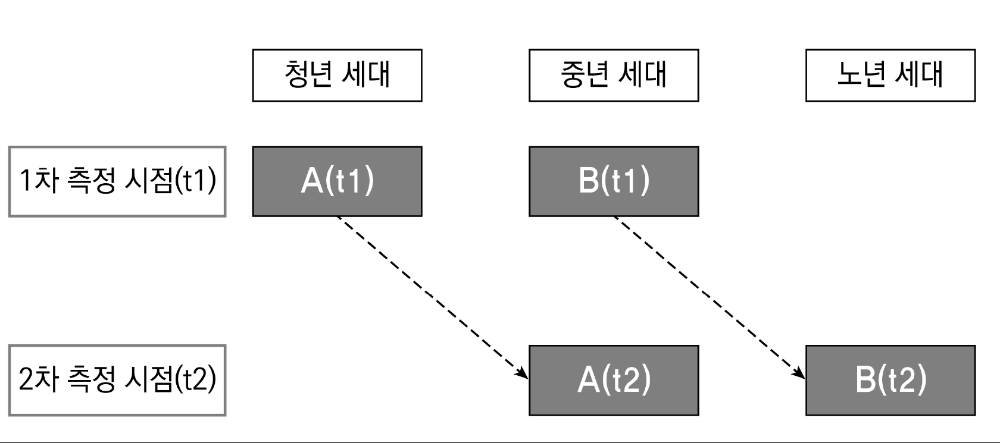
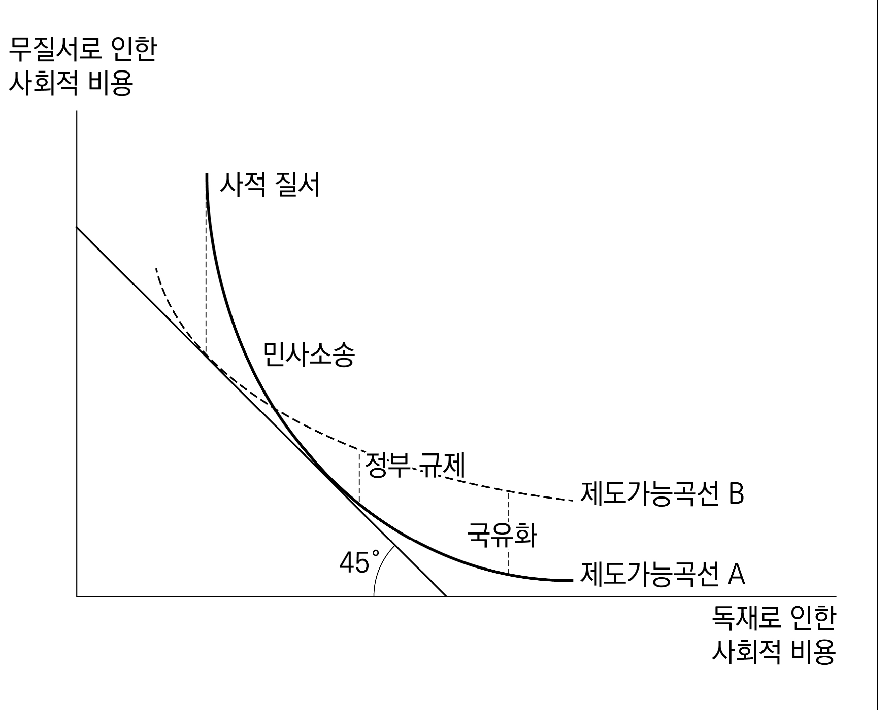
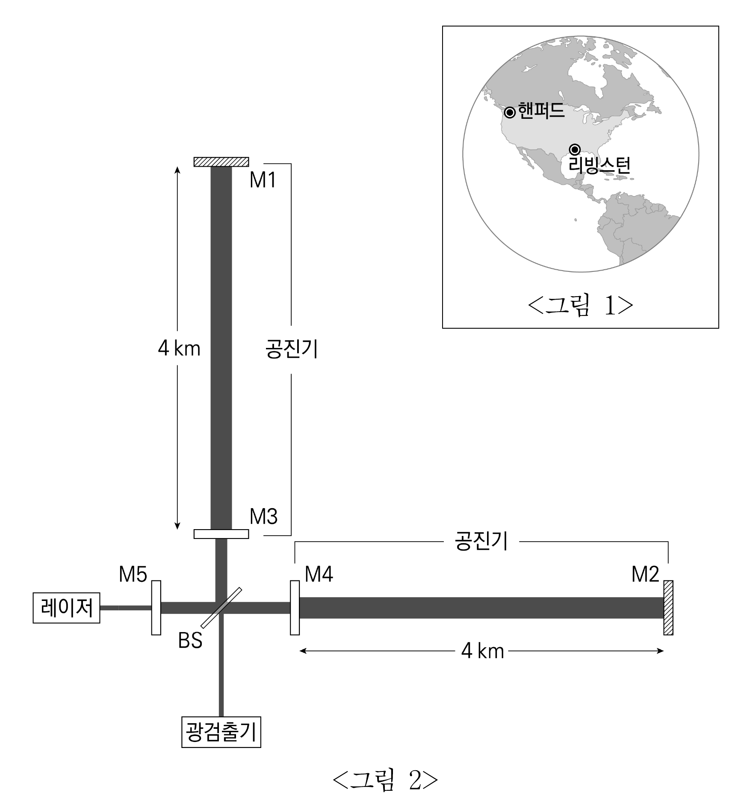
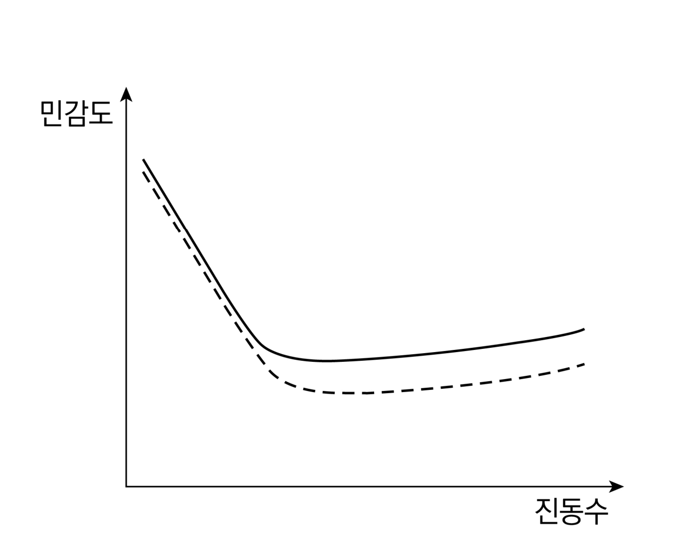

# [01-03] LU (2023)

다음 글을 읽고 물음에 답하시오.

## 제시문

판사에게 진솔함이 요구되는가 하는 문제가 논의되고 있다. 현대의 민주국가는 판사가 내리는 판결에 강제력을 부여하지만, 사법권의 행사에 민주적 통제가 미치도록 판결에 이유를 밝힐 것을 요구한다. 이때 판사는 판결의 핵심적인 근거에 관해 허위나 감춤 없이 자신이 믿는 바와 판단 과정을 분명히 드러내야 한다. 이에 대해서는 ‘반대론’이 있다. 법원은 사회적 갈등과 긴장의 해소를 임무로 하므로 사형이나 낙태 문제와 같이 논란이 큰 사안을 다룰 때는 판사들의 의견이 일치된 것처럼 보이는 편이 바람직하며, 필요하면 내심의 근거와 다른 것을 판결 이유로 들거나 모호하게 핵심을 회피하는 편이 낫다는 견해가 대표적이다. 이런 반대론은 시민들이 진실을 다룰 능력이 부족하다고 전제하고 있어 민주주의 원리에 반하므로 동의하기 어렵다.

다만 판사도 거짓말을 선택해야 할 예외 상황이 존재한다는 주장은 검토해 볼 만하다. 법과 양심에 따라 재판해야 하는 판사에게 양심은 곧 법적 양심을 의미하므로 법과 양심이 충돌할 일은 거의 없다. 하지만 노예제도가 인정되던 시절에 노예제를 허용하지 않는 주(州)로 탈출한 노예에 대해 소유주가 소유권을 주장하는 것처럼 법적 권리와 도덕적 권리가 충돌할 뿐 아니라 법적 결론이 지극히 부정의한 결과를 초래하는 상황에서는 사정이 다르다. 이런 사안에서는 법적 권리를 무효로 할 근거는 찾기 어렵고, 그렇다고 법을 그대로 적용하는 것은 도덕적으로 옳지 않다. 판사는 도덕적 양심에 반해 법률을 적용하거나 도덕적 양심을 우선해 법률을 적용하지 않을 수 있을 것이다. 그러나 전자는 판사의 양심을 부정하고, 후자는 판사의 직업상 의무를 위반한다. 사임하는 것은 누구에게도 도움이 되지 않으므로 도덕적 권리를 지지하는 판사에게 남은 선택은 그 법적 권리를 자신이 믿는 바와 다르게 당사자에게 표명하는 것밖에 없다. 즉, 판사는 법적으로 인정되는 권리임을 부인할 수 없음에도 다른 합법적인 법해석을 만들어내고는 그런 법해석의 결과로 법적 권리가 부정되는 것처럼 판결함으로써 은밀하게 곤경에서 벗어나는 것이다.

하지만 이런 논의가 판사의 진솔 의무를 부정하지는 못한다. 오늘날 법과 도덕의 극단적인 괴리 현상은 드물며, 진실을 분별하고 지지하는 민주사회라면 판사가 묘책을 찾아야 하는 상황을 만들어내지 않을 것이다. 하지만 법-도덕의 딜레마와 진솔 의무는 노예제와 함께 완전히 사라지지 않았다. 판사가 특정 법률에 도덕적 저항감을 느끼는 일은 현대에도 계속되고 있다. 여기서 판사의 선택은 정의와 민주주의, 사법의 정당성에 지속적으로 영향을 미친다.

진솔함의 중요성은 최근에는 다른 차원에서 제기되고 있다. 먼저 판사의 진솔함은 사법의 정당성을 수호하는 중요한 방책이 된다. ㉠ 어떤 판사는 법이 모호하고 선례도 없어 판단이 매우 어려운 사안에서 창의적인 법해석을 한 경우에도 그런 사정을 감춘다. 이때 판사는 자신이 진정으로 믿는 법해석을 근거로 판결한 것이지만, 패소한 당사자를 설득하기 위해 판사들 사이의 상투적 표현법을 써서 이렇게 말하는 편이 더 좋다고 생각한다. “판사는 법을 만들지 않으며, 법을 발견하고, 법률을 기계적으로 적용할 뿐이다.” 더 심각한 것은 판사가 법 외적인 사정에 무관심하고 오직 법의 문언에 충실한 결과인 듯 판결 이유를 제시하지만, 실제로는 어떤 결과를 도출할 것인지 먼저 선택한 다음에 자신이 선호하는 결과를 보장하는 해석론을 개발해 제시하는 경우이다. 이때도 판사는 으레 동일한 표현법을 활용한다. 하지만 이런 방편에는 큰 위험이 도사리고 있다. 판사의 거짓말은 국민을 자율적 판단 능력을 갖춘 시민으로 존중하지 않음을 의미하며, 사법적 판단 과정의 실상이 드러나는 순간 사법의 권위와 정당성은 실추될 것이다. 법원이 이런 위험에서 벗어나는 길은 진솔함으로 국민을 대하는 것이다. 이런 인식을 바탕으로 법-도덕 딜레마 상황에서 거짓이 정당화된다는 견해도 재검토되고 있다. 거짓으로 이룰 수 있는 것은 진솔함으로도 이룰 수 있다.

## 01

윗글의 내용과 일치하지 <u>않는</u> 것은?

### 선택지

(1) 판사의 진솔함은 법-도덕 딜레마와 민주주의를 서로 연결 짓는다.

(2) 판사의 진솔 의무를 지지하는 견해는 판사가 판결에 이르는 과정에서 법 외적인 요소들을 고려하는 것을 허용한다.

(3) 법-도덕 딜레마 상황에서 거짓말하기를 선택한 판사는 정의를 위해 행동하는 듯하지만, 사실은 법을 위해 법에 더 충실한 선택을 한다.

(4) 판사의 진솔함이 사법의 정당성을 뒷받침한다는 견해에 의하면 법-도덕 딜레마 사안에서 판사는 더 이상 거짓말하기를 선택해서는 안 된다.

(5) 판사가 판결 이유를 밝혀야 한다는 것과 판결 이유를 진솔하게 작성해야 한다는 것은 별개이지만 모두 민주주의 원리에서 공통의 근거를 찾을 수 있다.

## 02

㉠에 대한 설명으로 가장 적절한 것은?

### 선택지

(1) 판사의 법해석은 법적 판단이 어렵다는 사정 때문에 상당한 재량이 행사된 결과이지만, 판사는 공식적으로는 그렇게 말하지 않을 것이다.

(2) 판사의 법해석은 기존 판례의 답습이 아니라 새로운 해석을 통한 것이며, 또한 판사도 공식적으로 그렇게 말할 것이다.

(3) 판사의 법해석은 합법적인 해석 권한을 벗어난 것이지만, 판사는 공식적으로는 벗어나지 않았다고 말할 것이다.

(4) 판사의 법해석은 선례의 도움 없이도 충분히 가능한 법 발견이었으며, 또한 판사도 그렇게 말할 것이다.

(5) 판사의 법해석은 법률을 기계적으로 적용한 결과이며, 또한 판사도 공식적으로 그렇게 말할 것이다.

## 03

<보기>의 입장에서 윗글에 대해 추론한 것으로 적절하지 <u>않은</u> 것은?

### 보기

미국의 사법적 판단 과정을 설명하는 대표적인 이론으로 ‘법형식주의’와 ‘법현실주의’가 거론된다. 전자에 의하면 판사는 중립적 심판자로서 사안에 법을 그대로 적용할 뿐이다. 여기에는 어떤 정치적 고려의 여지가 없으며, 판사에게는 엄격하게 법을 적용할 의무만 있다. 후자에 의하면 법은 곧 정치이고 판사는 법복 입은 정치인이다. 판사는 재판 중에 법 외적 고려에 따라 자신이 만든 법을 적용한다. 하지만 이런 표현은 판사가 판결에 이르기까지 실제 사법적 판단 과정의 양면을 극단적으로 단순화한 것이며, 실제의 과정을 제대로 설명할 수 없다. 문제는 판사들이 사법의 권위와 정당성을 중립적 재판기구라는 점에서 찾으면서 단순화된 이론이 표방하는 문구를 그대로 사용한다는 점이다. 판사의 진솔함이 판사의 권력 남용을 저지하는 필수불가결한 요소라고 보는 ‘비판론자’는 판사들이 실제 사법적 판단 과정을 사실대로 말한 것이 아니라는 점을 지적하기 위해 그런 문구를 ‘고상한 거짓말’이라고 비판한다.

### 선택지

(1) 사법적 판단 과정도 민주적 통제의 대상이 된다고 보는 입장에서는 대중이 사법적 판단 과정의 실제를 정확하게 알아야 한다고 볼 것이다.

(2) 법현실주의자는 특정한 정치적 성향이 밝혀진 판사가 특정한 사건에서 어떤 판결을 내릴지 예상되는 것을 자연스럽게 여길 것이다.

(3) 법형식주의자는 판사의 기본적 역할이자 임무는 도덕의 지배가 아닌 법의 지배를 관철하는 것이라고 보는 견해를 지지할 것이다.

(4) 비판론자는 결과를 먼저 선택한 다음 이를 지지하는 법해석을 찾아내는 판사가 사용한 표현 문구에 대해 ‘고상한 거짓말’이라고 비판할 것이다.

(5) 비판론자는 타당한 결과를 도출했더라도 이를 감추기 위해 거짓을 선택하는 것을 법의 왜곡과 법 발전의 정체가 초래되지는 않는다는 이유로 수긍할 것이다.

# [04-06] LU (2023)

다음 글을 읽고 물음에 답하시오.

## 제시문

도덕 공동체의 구성원은 도덕적 고려의 대상이 되는 존재로서 도덕 행위자와 도덕 피동자로 구분된다. 도덕 행위자는 도덕 행위의 주체로서 자신의 행위에 따른 결과에 대해 책임질 수 있는 존재이다. 반면에 도덕 피동자는 영유아처럼 이성이나 자의식 등이 없기에 도덕적 행동을 할 수 없는 존재이다. 그럼에도 영유아는 도덕적 고려의 대상이라는 것이 우리의 상식인데, 영유아라고 해도 쾌락이나 고통을 느끼는 감응력이 있기 때문이다. 쾌락이나 고통을 느끼기에 그것을 좇거나 피하려고 한다는 도덕적 이익을 가지고 있으므로 도덕적 고려의 대상이 되어야 한다는 것이다. 싱어와 커루더스를 비롯한 많은 철학자들은 이러한 이유로 감응력을 도덕적 고려의 기준으로 삼는다. 싱어는 영유아뿐만 아니라 동물도 감응력이 있으므로 동물도 도덕 공동체에 포함해야 한다고 주장한다. 반면에 커루더스는 고차원적 의식을 감응력의 기준으로 보아 동물을 도덕 공동체에서 제외하는데, 이 주장을 따르게 되면 영유아도 도덕적 고려의 대상에서 제외되고 만다. 영유아는 언젠가 그런 의식이 나타날 것이므로 잠재적 구성원이라고 주장할 수도 있다. 그러나 문제는 그런 잠재성도 없는 지속적이고 비가역적인 식물인간의 경우이다.

식물인간은 고차원적 의식은 물론이고 감응력도 없다고 생각되는데 그렇다면 도덕적 공동체에서 제외되어야 하는가? 식물인간을 흔히 의식이 없는 상태라고 판단하는 것은 식물인간이 어떤 자극에도 반응하지 못한다는 행동주의적 관찰 때문이다. 이런 관찰은 식물인간이 그 자극에 대한 질적 느낌, 곧 현상적 의식을 가지지 않는다고 결론 내린다. 어떤 사람이 현상적 의식이 없는 경우 그는 감응력이 없을 것이다. 그런데 거꾸로 감응력이 없다고 해서 꼭 현상적 의식을 가지지 못하는 것은 아니다. 즉, <kbd>현상적 의식</kbd>과 <kbd>감응력</kbd>의 개념은 일치하지 않는다. 외부 자극에 좋고 싫은 적극적인 의미가 없어도 어떠한 감각 정보가 접수된다는 수동적인 질적 느낌을 가질 수 있기 때문이다. 반면 감응력은 수동적인 측면을 넘어서 그런 정보를 바라거나 피하고 싶다는 능동적인 측면을 포함한다. 이것은 자신이 어떻게 취급받는지에 신경 쓸 수 있다는 뜻이므로, 감응력을 도덕적 고려의 기준으로 삼는 철학자들은 여기에 도덕적 고려를 해야 한다고 생각하는 것이다. 행동주의적 기준으로 포착되지 않는 심적 상태는 도덕적 고려의 대상으로 여기지 않는 것이다.

그렇다면 감응력이 없고 현상적 의식만 있는 식물인간은 도덕적 고려의 대상이 아닐까? 도덕적 고려는 어떤 존재가 가지고 있는 도덕적 속성으로 결정되는 것이 아니라, 도덕적 행위자가 그 존재와 맺는 구체적 관계에 의해 결정된다는 주장도 있다. 다양한 존재들은 일상에서 상호작용하는데, 도덕 공동체의 가입 여부는 그러한 관계에 따라 정해진다는 것이다. 그러나 이런 관계론적 접근은 우리와 더 밀접한 관계를 갖는 인종이나 성별을 우선해서 대우하는 차별주의를 옹호할 수 있다. 그리고 똑같은 식물인간이 구체적 관계의 여부에 따라 도덕 공동체에 속하기도 하고 속하지 않기도 하는 문제도 생긴다. 결국 식물인간을 도덕적으로 고려하려면 식물인간에게서 도덕적으로 의미 있는 속성을 찾아야 한다.

감응력이 전혀 없이 오직 현상적 의식의 수동적 측면만을 가진 사람, 즉 ‘감응력 마비자’를 상상해 보자. 그는 현상적 의식을 가지고 있기는 하지만 못에 발을 찔렸을 때 괴로워하거나 비명을 지르지는 않는다. 그러나 안전한 상황에서 걸을 때와는 달리 발에 무언가가 발생했다는 정보는 접수할 것이다. 이런 상태는 얼핏 도덕적 고려의 대상이 되기에 무언가 부족해 보인다. 하지만 감응력 마비자는 사실상 감응력이 있는 인간의 일상생활의 모습을 보여 준다. 예컨대 컴퓨터 자판을 오래 사용한 사람은 어느 자판에 어느 글자가 있는지를 보지 않고도 문서를 작성할 수 있다. 이 사람은 특별한 능동적인 주의력이 필요한 의식적 상태는 아니지만, 외부의 자극에 대한 정보가 최소한 접수되는 정도의 수동적인 의식적 상태에 있다고 해야 할 것이다. 정도가 미약하다는 이유만으로는 그 상태를 도덕적으로 고려할 수 없다는 주장은 설득력이 부족하다. ㉠이와 마찬가지로 식물인간이 고통은 느끼지 못하지만 여전히 주관적 의식 상태를 가질 수 있다면, 이는 도덕 공동체에 받아들일 수 있는 여지가 있다는 것을 보여 준다.

## 04

윗글에 대한 이해로 적절하지 <u>않은</u> 것은?

### 선택지

(1) 도덕적 행위를 할 수 없는 존재도 도덕 공동체에 들어올 수 있다.

(2) 도덕 피동자는 능동적인 주의력은 없지만 수동적인 의식적 상태는 있다.

(3) 관계론적 접근에서는 동물이 도덕적 고려의 대상이 아닐 수도 있다.

(4) 식물인간이 고통을 느끼지 못한다고 판단하는 것은 자극에 반응이 없기 때문이다.

(5) 식물인간은 도덕 공동체의 구성원이 되어도 스스로 책임질 수 있는 존재는 아니다.

## 05

<kbd>현상적 의식</kbd>과 <kbd>감응력</kbd>에 대해 추론한 것으로 가장 적절한 것은?

### 선택지

(1) ‘감응력 마비자’는 현상적 의식을 가지고 있지 못하다.

(2) 감응력은 정보 접수적 측면은 없지만 능동적 측면은 있다.

(3) 현상적 의식과 달리 감응력은 행동주의적 기준으로 포착되지 않는다.

(4) 커루더스는 현상적 의식이 있지만 감응력이 없는 존재를 고차원적 의식이 없다고 생각한다.

(5) 싱어는 감응력 없이 현상적 의식의 상태에 있는 대상에게 위해를 가하는 것을 비윤리적이라고 주장할 것이다.

## 06

㉠에 대한 비판으로 가장 적절한 것은?

### 선택지

(1) 감응력이 있는 현상적 의식을 가진 존재만을 도덕적으로 고려하면 고통과 쾌락을 덜 느끼는 사람을 차별하게 되지 않을까?

(2) 도덕 피동자가 책임질 수 있는 도덕적 행동을 할 수 없더라도 도덕 행위자는 도덕 피동자에게 도덕적 의무를 져야 하는 것 아닐까?

(3) 외부의 자극에 대한 수동적인 의식적 상태는 자신이 어떻게 취급받는지에 신경 쓰지 않는다는 뜻인데 여기에 도덕적 고려를 할 필요가 있을까?

(4) 식물인간의 도덕적 고려 여부는 식물인간이 누구와 어떤 관계를 맺느냐가 아니라 어떤 도덕적 속성을 가지고 있느냐를 보고 판단해야 하지 않을까?

(5) 일상에서 특별한 능동적인 주의력이 필요한 의식 상태라고 하는 것도 알고 보면 외부 자극에 대한 정보가 최소한 접수되는 정도의 의식적 상태가 아닐까?

# [07-09] LU (2023)

다음 글을 읽고 물음에 답하시오.

## 제시문

세포는 현미경으로 관찰하면 작은 물방울처럼 보이지만 세포 내부는 기름 성분으로 이루어진 칸막이에 의해 여러 구획으로 나누어져 있다. 서랍 속의 칸막이가 없으면 물건이 뒤섞여 원하는 것을 찾기 힘들어지듯이 세포 안의 구획이 없으면 세포 안의 구성물, 특히 단백질이 마구 섞이게 되어 세포의 기능에 이상이 생길 수 있다. 그러므로 각각의 단백질은 저마다의 기능에 따라 세포 내 소기관들, 세포질, 세포 외부나 세포막 중 필요한 장소로 수송되어야 한다. 세포 외부로 분비된 단백질은 호르몬처럼 다른 세포에 신호를 전달하는 역할을 하고, 세포막에 고정되어 위치하는 단백질은 외부의 신호를 안테나처럼 받아들이는 수용체 역할을 하거나 물질을 세포 내부로 받아들이는 통로 역할을 수행한다. 반면 세포 내 소기관으로 수송되는 단백질이나 세포질에 존재하는 단백질은 각각 세포 내 소기관 또는 세포질에서 수행되는 생화학 반응을 빠르게 진행하도록 하는 촉매 역할을 주로 수행한다.

단백질은 mRNA의 정보에 의해 리보솜에서 합성된다. 리보솜은 세포 내부를 채우고 있는 세포질에 독립적으로 존재하다가 mRNA와 결합하여 단백질 합성이 개시되면 세포질에 머물면서 계속 단백질 합성을 진행하거나 세포 내부의 소기관인 소포체로 이동하여 소포체 위에 부착하여 단백질 합성을 계속한다. 리보솜이 이렇게 서로 다른 세포 내 두 장소에서 단백질 합성을 수행하는 이유는 합성이 끝난 단백질을 그 기능에 따라 서로 다른 곳으로 보내야 하기 때문이다. 세포질에서 독립적으로 존재하는 리보솜에서 완성된 단백질은 주로 세포질, 세포핵·미토콘드리아와 같은 세포 내 소기관으로 이동하여 기능을 수행한다. 반면 소포체 위의 리보솜에서 합성이 끝난 단백질은 세포 밖으로 분비되든지, 세포막에 위치하든지, 또는 세포 내 소기관들인 소포체나 골지체나 리소솜으로 이동하기도 한다. 소포체·골지체·리소솜은 모두 물리적으로 연결되어 있으므로 소포체 위의 리보솜에서 만들어진 단백질의 이동이 용이하다. 또한 세포막에 고정되어 위치하거나 세포막을 뚫고 분비되는 단백질은 소포체와 골지체를 거쳐 소낭에 싸여 세포막 쪽으로 이동한다. 소포체 위의 리보솜에서 완성된 단백질은 소포체와 근접한 거리에 있는 또 다른 세포 내 소기관인 골지체로 이동하여 골지체에서 추가로 변형된 후 최종 목적지로 향하기도 한다. 이 단백질 합성 후 추가 변형 과정은 아미노산이 연결되어서 만들어진 단백질에 탄수화물이나 지질 분자를 붙이는 과정으로서 아미노산만으로는 이루기 힘든 단백질의 독특한 기능을 부여해준다. 일부 소포체에서 기능하는 효소는 소포체 위의 리보솜에서 단백질 합성을 완료한 후 골지체로 이동하여 변형된 다음 소포체로 되돌아온 단백질이다.

과연 단백질은 어떻게 자기가 있어야 할 세포 내 위치를 찾아갈 수 있을까? 그것을 설명하는 것이 ‘신호서열 이론’이다. 어떤 단백질은 자기가 배송되어야 할 세포 내 위치를 나타내는 짧은 아미노산 서열로 이루어진 신호서열을 가지고 있다. 예를 들어 KDEL 신호서열은 소포체 위의 리보솜에서 합성된 후 골지체를 거쳐 추가 변형 과정을 거친 다음 소포체로 되돌아오는 단백질이 가지고 있는 신호서열이다. 또한 NLS는 세포질에 독립적으로 존재하는 리보솜에서 합성되어 세포핵으로 들어가는 단백질이 가지고 있는 신호서열이고 NES는 반대로 세포핵 안에 존재하다가 세포질로 나오는 단백질이 가지고 있는 신호서열이다. 그리고 세포질에 독립적으로 존재하는 리보솜에서 만들어진 단백질을 미토콘드리아로 수송하기 위한 신호서열인 MTS도 있다. 이러한 신호서열 이론을 증명하는 여러 실험이 수행되었다. ㉠ KDEL 신호서열을 인위적으로 붙여준 단백질은 원래 있어야 할 곳 대신 소포체에 위치하는 것으로 관찰되어 KDEL이 소포체로의 단백질 수송을 결정하는 신호서열이라는 결론이 내려졌다. ㉡ 소포체에 부착한 리보솜에서 만들어진 어떤 단백질이 특정한 신호서열이 있어서 세포 밖으로 분비되는 것인지, 아니면 그 단백질이 신호서열을 전혀 가지고 있지 않아서 세포 밖으로 분비되는 것인지 확인하는 실험도 수행되었는데 세포의 종류에 따라 각기 다르다는 결론이 내려졌다. ㉢ 세포 내 특정 장소로 가기 위한 신호서열을 가지고 있지 않은 단백질이 어떻게 특정 장소로 이동하는지를 확인하는 실험을 한 결과 특정 장소로 수송하기 위한 신호서열을 가지고 있는 단백질과의 결합을 통해 신호서열이 지정하는 특정 장소로 이동할 수 있다는 결론을 얻었다.

## 07

윗글의 내용과 일치하지 <u>않는</u> 것은?

### 선택지

(1) 세포막에서 수용체 역할을 하는 단백질은 소포체 위의 리보솜에서 합성된 것이다.

(2) 세포질 안에서 사용되는 단백질은 세포질에 독립적으로 존재하는 리보솜에서 합성된 것이다.

(3) 골지체에서 변형된 후 소포체로 돌아온 단백질은 소포체 위의 리보솜에서 합성된 것이다.

(4) 세포핵으로 수송되는 단백질은 세포 밖으로 분비되는 단백질과 다른 곳에 위치한 리보솜에서 합성된 것이다.

(5) 미토콘드리아로 수송되는 단백질과 세포막에 위치하는 단백질은 같은 곳에 위치한 리보솜에서 합성된 것이다.

## 08

윗글을 바탕으로 추론한 것으로 적절하지 <u>않은</u> 것은?

### 선택지

(1) KDEL 신호서열을 가지고 있는 단백질은 NLS가 없을 것이다.

(2) KDEL 신호서열을 가지고 있는 소포체로 최종 수송된 단백질은 골지체에서 변형을 거쳤을 것이다.

(3) NLS가 없는 세포핵 안에 존재하는 단백질은 NLS가 있는 다른 단백질과 결합하여 세포핵 안으로 수송되었을 것이다.

(4) NLS가 있으나 NES가 없는 단백질은 합성 후 세포핵에 위치한 다음 NES가 있는 단백질과 결합하면 다시 세포핵 밖으로 나갈 수 있을 것이다.

(5) NLS와 NES를 모두 가졌으나 세포 외부에서 발견되는 단백질은 세포질에 독립적으로 존재하는 리보솜에서 합성된 단백질과 결합하여 세포 외부로 이동하였을 것이다.

## 09

㉠~㉢에 대한 평가로 적절한 것만을 <보기>에서 있는 대로 고른 것은?

### 보기

ㄱ. KDEL 신호서열이 있는 어떤 단백질의 KDEL 신호서열을 인위적으로 제거하면 소포체로 이동하지 않는다는 실험 결과는 ㉠의 결론을 강화한다.

ㄴ. NLS를 가진 어떤 단백질의 NLS를 인위적으로 제거하면 세포 밖으로 분비된다는 실험 결과는 ㉡의 결론을 강화한다.

ㄷ. MTS가 없는 어떤 단백질이 MTS가 있는 단백질과 결합하여 미토콘드리아에서 발견된다는 실험 결과는 ㉢의 결론을 강화한다.

### 선택지

(1) ㄱ

(2) ㄴ

(3) ㄱ, ㄷ

(4) ㄴ, ㄷ

(5) ㄱ, ㄴ, ㄷ

# [10-12] LU (2023)

다음 글을 읽고 물음에 답하시오.

## 제시문

농업 중심의 사회를 벗어나면서 급속한 산업화와 도시화에 따른 갈등이 나타나고 있던 19세기 말 미국에서는 터너가 이끌었던 혁신주의 역사학이 대두했다. 혁신주의 역사학의 특징은 역사의 핵심을 갈등이라고 본 점에 있다. 예컨대, 야만과 문명이 공존하는 프런티어야말로 미국 발전의 근원이라고 주장한 터너는 산업이 발달한 북부와 농업이 지배적인 남부 사이의 갈등을 강조했다. 혁신주의 역사가 베커는 미국혁명이 과세를 둘러싼 아메리카 식민지와 모국 간의 투쟁임과 동시에 상층 상인과 지주를 비롯한 보수적이고 봉건적인 식민지 유력자와 하층 수공업자 및 노동자 사이에서 벌어진 권력 다툼이었다는 사실을 밝혀냄으로써 이중혁명론을 제시했다. 혁신주의 역사학은 헌법을 금융업자, 상인 등으로 구성된 동산소유집단과 채무에 시달리던 소농 출신의 부동산소유집단 사이의 싸움에서 전자가 승리하면서 만들어진 비민주적 문서로 파악하였다. 혁신주의 역사학은 1940년대까지 미국 역사학의 주류를 이루었다.

제2차 세계대전 이후에 나치 독일의 인권 탄압과 공산주의의 팽창에 놀란 보수적 미국인들은 혁신주의 역사학이 비판했던 미국적 가치, 즉 사유재산의 신성시, 개인주의, 경제적 자유주의에 대해 재평가하기 시작했다. 게다가 냉전질서에서 미국의 정체성을 보존하기 위해서는 국민적 단결이 필요했다. 이러한 배경에서 합의사학이 등장했는데, 그것의 특징은 미국사를 합의와 연속성의 시각에서 이해했다는 점이다. 혁신주의 역사가는 보수적인 유산자들과 하층민 간의 극적인 투쟁으로 미국혁명을 파악했으나, 합의사학을 대변하는 호프스태터는 미국적 가치를 공동이념으로 삼은 미국인들은 사회적 동질성을 유지하면서 갈등을 극소화했다고 주장했다. 이처럼 미국사는 기본적으로 혁명으로 인한 단절이나 중단 없이 연속성을 보여주었다는 데 합의사학은 주목하였다. 그러므로 미국혁명은 상당히 제한적인 것이라고 평가되었다. 하츠가 미국에는 봉건적 과거가 없다는 토크빌의 지적에 공감하면서 주장하듯이, 구세계의 봉건적 압제로부터 도피한 사람들은 자유롭게 태어난 사람들이기에 자유로운 세계를 만들기 위해 굳이 혁명을 일으킬 필요는 없었기 때문이다. 비어드와 같은 혁신주의 역사가가 헌법의 제정을 계급적 갈등으로 파악했다면, 합의사학은 헌법 제정이 중산층의 합의를 통해 이루어졌다는 데 보다 많은 주의를 기울였다. 합의사학은 제헌의회에 참가한 대표들의 경제적 이해관계보다는 그들의 합의를 강조한 셈이다. 부어스틴은 미국인의 관대함과 타협의 정신을 프런티어에서 찾기도 했다. 개혁 사상에 대해 비판적인 태도를 유지하면서 미국의 자유주의적 전통과 국민적 합의를 강조한 합의사학은 50~60년대 미국 사학계를 주도했다.

1960년대 중반 이후 미국은 베트남전쟁과 민권운동으로 대변되는 이념적 격동기를 맞이했다. 이 같은 현실은 합의사학이 제시했던 미국의 밝은 과거상과 현재상에 대해 회의심을 갖게 했다. 합의사학과는 달리, 하지만 혁신주의 역사학과 마찬가지로 갈등과 빈곤에 주목한 경향이 등장했는데, 이를 신좌파 역사학이라고 한다. 이러한 움직임을 선도한 역사가로는 외교사가 윌리엄스를 꼽을 수 있다. 합의사학은 정책 결정자들이 19세기 말엽 이후에는 제국주의적 팽창정책으로부터 거리를 두었다고 보면서 1898년 식민지를 둘러싼 미국-스페인 전쟁을 “거대한 일탈”이라고 규정했다. 윌리엄스는 이런 해석을 비판하며 정치인들이 국내의 분열을 호도하기 위해 혹은 자본의 이익을 위해 문호개방이라는 이름으로 해외 팽창정책을 주도했다고 주장했다. 하워드 진과 같은 신좌파 역사가는 혁신주의 역사학에 동조하면서 역사학을 이데올로기적 요구에도 부응해야 하는 학문으로 보았다. 하지만 혁신주의 역사학과 달리 신좌파 역사학은 역사를 물질적인 조건이나 계급 갈등으로 환원시키지는 않았다. 미국혁명과 헌법에 대한 연구에서 다수의 신좌파 역사가들은 유산계급과 무산계급 사이의 갈등 이외에도 민중의 역사와 권력관계에 주목했다. 흑인들의 민권운동과 소수민족인 아메리카 원주민, 여성, 빈민들의 운동을 배경으로 태동했던 신좌파 역사학은 이러한 피지배집단이 혁명전쟁과 헌법 제정 과정에서 행한 능동적인 행위를 복원하는 데 주의를 기울였다.

## 10

윗글의 내용과 일치하지 <u>않는</u> 것은?

### 선택지

(1) 19세기 후반 미국은 농업 중심의 사회에서 산업화 사회로의 이행이 진행되고 있었다.

(2) 19세기 말 국외로 세력을 확장하려는 미국의 정책은 스페인과 무력 충돌을 일으켰다.

(3) 제2차 세계대전 직후에 보수 성향의 미국인들은 미국의 전통적 가치를 부활시키고자 했다.

(4) 베트남전쟁은 미국인들이 경제적 자유주의에 대한 보편적 합의를 이루는 역사적 계기가 되었다.

(5) 1960년대 이후 미국에서는 다양한 소수집단과 관련된 연구가 대두하였다.

## 11

윗글을 바탕으로 추론한 것으로 가장 적절한 것은?

### 선택지

(1) 터너는 부어스틴과 마찬가지로 프런티어가 미국 역사 발전에서 긍정적인 역할을 하였다고 볼 것이다.

(2) 베커는 하츠와 달리, 혁신주의적 개혁을 위한 국민적 합의가 미국사의 원동력이라고 볼 것이다.

(3) 호프스태터는 유력 세력이 혁명에서 승리함으로써 갈등이 극소화되었다고 볼 것이다.

(4) 윌리엄스는 19세기 말 미국의 국제적 영향력 행사를 예외적 현상으로 파악할 것이다.

(5) 하워드 진은 윌리엄스와 마찬가지로 역사적 분석범위를 넓히면서 역사학의 정치화를 경계했을 것이다.

## 12

윗글을 바탕으로 <보기>를 평가한 것으로 적절하지 <u>않은</u> 것은?

### 보기

영국이 시행한 인지세법 등에 맞서 1774년 식민지 대표들이 필라델피아에 모여 제1차 대륙회의를 개최하면서 영국에 대한 조직적인 저항이 시작되었다. 당시 식민지 뉴욕의 정치는 상층 상인과 지주들과 같은 유력자들이 장악하고 있었는데, 독립전쟁은 하층 수공업자와 노동자 출신의 급진주의자들이 정치의 장으로 들어가도록 문을 열어 주었다. 독립전쟁은 1781년 뉴욕 요크타운 전투에서 영국군이 패배하면서 막을 내리게 되었다. 전쟁 이후 미국은 1787년 필라델피아에 모여 헌법의 제정을 논의하기에 이르렀다. 당시 가장 중요한 전제는, 강력하지만 동시에 주정부의 권리를 침해하지 않는 연방정부를 수립하는 것이었다. 필라델피아 제헌의회에는 해밀턴, 매디슨 등 소위 연방주의자와 제퍼슨 등의 반연방주의자 간의 대립이 있었고, 현상적으로는 연방주의자들의 승리로 볼 만했다.

### 선택지

(1) 혁신주의 역사학자라면, 필라델피아 제헌의회는 새로운 헌법에 의해 경제적 이익을 받을 수 있는 집단이 지배하고 있었다는 사실을 덧붙이려 하겠군.

(2) 합의사학자라면, 제1차 대륙회의와 요크타운 전투에 대해 봉건적 체제를 타파하는 시민혁명에서 미국의 가치와 동질성이 실현되는 과정이었다고 파악하겠군.

(3) 합의사학자라면, 제퍼슨, 매디슨, 해밀턴 사이의 차이를 과장하지 않고, 헌법 제정에 대하여 연방주의자들의 승리라기보다는 정치적 합의를 도출한 사건으로 보겠군.

(4) 신좌파 역사학자라면, 독립전쟁 당시 하층민들의 급진주의적 정치에서 여성이 차지한 역할을 새롭게 규명할 필요성을 제기하겠군.

(5) 혁신주의 역사학자나 신좌파 역사학자라면, 독립혁명에서 식민지 뉴욕의 상층 부르주아지와 하층 수공업자들의 대립을 주요하게 취급하는 데 대하여 반대하지 않겠군.

# [13-15] LU (2023)

다음 글을 읽고 물음에 답하시오.

## 제시문

나이의 정치적 효과를 분석하는 데 있어 가장 중요한 쟁점은 생애주기 효과(A), 기간 효과(P), 코호트 효과(C)를 구분하는 것이다. APC 효과의 관점에서 보면, 개인이 특정 시점에 갖는 정치 성향은 그가 속한 코호트, 조사 시점의 정치 사회 환경, 그리고 나이가 들며 변화해 가는 생애주기 효과에 의해 종합적으로 구성된다.

우선 생애주기 효과는 “나이가 들수록 보수화된다.”는 가설에 기반한다. 생애주기 효과가 말하는 보수화에는 비단 정치적 보수화뿐만 아니라 인지적 경직성과 권위주의적 성향의 증가도 포함된다. 트루엣은 약 30,000명의 버지니아 주민들을 대상으로 생애주기별 보수주의 점수를 측정하면서 50세 이후에는 보수화 성향이 지속되는 것을 확인하였다. 그에 따르면 성별, 거주지별, 교육수준별로 약간의 차이는 있지만 20～30대에는 낮은 보수주의 점수가 안정적으로 이어지는 반면, 30～40대를 거치면서 이 점수가 급격히 높아지며, 50세 이후부터 생애주기의 끝까지 높은 보수주의 점수가 유지된다.

다음으로 기간 효과는 특정 조사 시점의 영향을 받아 나타나는 차이를 의미한다. 즉, 특정 시점에 발생한 역사적 사건이나 급격한 사회변동이 전 연령 집단의 사고방식이나 인식에 포괄적, 보편적 영향을 미치는 효과이다. 특정 시기의 사회화 과정이나 일부 세대에서 나타나는 효과가 아니라, 1987년 민주화나 1997년 IMF 구제금융 사례처럼 전 세대가 공유하는 경험에 따른 태도 변화를 지칭한다. 그리고 코호트 효과는 정치사회화가 주로 이루어지는 청년기에 유권자들이 특정한 역사적 경험을 공유하면서 유사한 정치적 성향을 형성하고 그 독특성이 해당 연령 집단을 중심으로 이후에도 유지되는 현상을 의미한다. 이렇게 형성된 정치 세대, 즉 코호트란 유사한 정치적 태도를 보이고 이념 성향을 공유하는 연령 집단을 의미한다. 정치사회화 과정에서 형성된 정치적 세대 의식은 나이가 들면서 완고성이 증가하여 큰 변화 없이 지속되게 된다. 이는 중장년기보다 성년 초기 시점이 사회 변화나 역사적 사건들로부터 영향을 받기 더 쉽다는 사실을 전제로 한다. 예컨대, 영국에서 2차 세계대전 이후 노동당 지지 성향이 강한 진보적 코호트가 등장하였다면 1980년대에는 대처 총리 집권기의 영향을 받아 보수적 코호트가 형성되었다는 연구들이 존재한다. 한편 국내 선행 연구에 따르면, 한국전쟁 직후 등장한 소위 전후세대는 여타 코호트 집단에 비해 권위주의적 성향과 보수적 정치 성향이 더 강하다고 알려져 있으며, 한국 민주화 운동의 대명사라 할 수 있는 86세대나 탈권위를 유행시켰던 X세대의 경우 나이가 들어서도 보수화되는 경향이 상대적으로 완만한 것으로 나타났다.

이 세 효과는 개념적으로는 쉽게 구분되지만, 경험적으로는 이들을 구별하기 어렵다. 세 개념 자체가 밀접하게 연관되어 있고, 독립적으로 개별 효과를 측정할 지표 역시 충분히 갖고 있지 않기 때문이다. 이러한 근본적 제약 속에서 나이 관련 변수들이 만들어내는 합성 효과를 구별하는 것이 지금까지 사회과학적 세대 연구의 핵심 과제였고 이를 해결하기 위한 다양한 연구 방법들이 고안되었다. APC의 합성 효과를 구분해 개별 효과를 비교하기 위해서는 동일 코호트의 시간 흐름에 따른 태도 차이를 측정하는 종단면 디자인, 동일 시점에서 정치 세대 간의 태도 차이를 측정하는 횡단면 디자인, 다른 시점의 동일 연령대 집단의 태도 차이를 측정하는 시차 연구 디자인의 조합이 필요하다. 일반적으로 연령 집단은 조사 당시 나이, 기간 효과는 조사 연도, 코호트는 출생 연도와 같은 변수들로 측정된다. 그러나 연구의 난관은 우리가 혼재된 나이 효과를 구별하는 데 있어 식별 문제에 직면하게 된다는 것이다. 즉, 셋 중 두 정보로부터 다른 항의 값이 자동 도출되므로, 3개의 미지수(효과값)와 3개의 정보(변수)가 있는 듯 보이지만, 실제로는 정보 하나가 부족한 셈이 된다. 위의 연구 디자인을 적용하여 APC 효과를 통제된 하나의 개별 효과와 나머지 두 개가 이루는 합성 효과로 나누어 파악할 수는 있지만, 3개의 개별 효과값으로 명확하게 구분해 내기 어렵다. 이러한 한계가 나이와 정치 성향의 관계에 대한 경험적 연구를 오랜 기간 가로막아 왔다. 기술적으로 완전한 극복 방안은 없으며, 불완전하나마 여러 가지 수단을 통해 이 관계를 엿볼 수 있었을 뿐이다. 대부분 추정 모형에 일정한 제약을 가해서 문제를 피해 갔다. 부가정보를 이용해 세 효과 중 하나를 제외하거나, 아니면 한 효과가 고정되도록 설정하여 개입을 통제하는 방식으로 이 문제에서 벗어날 수 있다. 그 밖에도 세 변수 중 하나를 다른 대리변수로 대체하는 방법도 있다. 하지만 이러한 방법 모두 임기응변일 뿐이고, 매우 특수한 조건에서만 활용 가능해 주의가 필요하다.

## 13

윗글의 내용과 일치하지 <u>않는</u> 것은?

### 선택지

(1) 조사 시기와 조사 당시 연령을 알면 코호트 집단을 특정할 수 있다.

(2) 트루엣의 연구에 따르면 생애주기 효과는 개인의 사회경제적 배경과는 무관하다.

(3) 식별 문제의 해결을 위한 방편으로 추정 모형에 제약 조건을 적용하기도 한다.

(4) 문제 해결을 위해 세 변수 중 하나를 다른 대리변수로 대체하는 방법을 사용하기도 한다.

(5) 나이와 정치 성향과의 관계 연구에서 APC의 개별 효과를 각각 구분해 내는 방법은 아직 없다.

## 14

윗글을 바탕으로 추론한 것으로 적절한 것만을 <보기>에서 있는 대로 고른 것은?

### 보기

ㄱ. 한국 유권자들을 대상으로 2022년 7월 24일에 정치의식 조사를 실시한다면, X세대의 권위주의 성향 점수가 한국 전후 세대보다 평균적으로 낮게 나올 것이다.

ㄴ. 1980년대에 50대였던 영국 전후 세대와 비교해 2010년대에 같은 50대가 된 대처 세대가 평균적으로 더 진보적 정치 성향을 드러내는 조사 결과가 존재한다면, 기간 효과가 주요하게 작용했다고 판단해 볼 수 있다.

ㄷ. 영국의 대처 세대가 30대 때였던 1990년도 조사에서보다 50대가 되어서인 2010년 조사에서 이념적으로 덜 보수적이라는 결과가 나왔다면, 2010년 조사 당시 영국의 다른 정치 코호트들 또한 진보적 분위기의 시대적 영향을 받았을 수 있다.

### 선택지

(1) ㄱ

(2) ㄷ

(3) ㄱ, ㄴ

(4) ㄴ, ㄷ

(5) ㄱ, ㄴ, ㄷ

## 15

윗글을 바탕으로 <보기>의 내용을 이해한 것으로 가장 적절한 것은?

### 보기

아래 그림은 나이의 정치적 효과를 측정하기 위한 연구 디자인을 도식화한 것이다. 조사는 t1, t2의 시점에 이루어졌다. A(t1)와 B(t1)는 각각 t1 기준 청년 코호트와 중년 코호트를 나타내며, 시간이 경과한 t2에는 각각 중년기와 노년기에 이르게 된다.

<이미지 포함됨>

### 선택지

(1) A(t1)와 A(t2)의 차이는 코호트를 고정한 채 도출해 낸, 기간 효과와 코호트 효과의 합성 효과이다.

(2) A(t1)와 B(t1)의 차이는 동일 시간대의 다른 코호트 간 차이를 측정하는 종단면적 연구 디자인을 적용하여 알 수 있다.

(3) A(t2)와 B(t2)의 차이는 조사 시점을 고정하여 얻은 코호트 간 차이로서 생애주기 효과의 개입이 통제되고 있다.

(4) B(t1)와 A(t2)의 차이는 다른 시점의 동일 연령대 집단의 태도 차이를 비교하는 시차 연구 디자인을 적용하여 알 수 있지만, 기간 효과와 코호트 효과를 구분하기 어렵다.

(5) B(t1)와 B(t2)의 차이는 동일 연령대 집단의 태도 차이를 측정하는 시차 연구 디자인을 적용하여 알 수 있다.

# [16-18] LU (2023)

다음 글을 읽고 물음에 답하시오.

## 제시문

(가)

1960년대 근대화 담론은 해방과 분단으로 공고화된 민족주의를 경제성장의 동력으로 동원한다. 민족주의에 기반한 근대화를 비판하는 것이 용인되지 않았던 분위기에서, 김자림의 희곡 「이민선」(1964)은 이민과 여성을 매개로 시대의 단층을 드러낸다. 당시 브라질 영농 이민은 경제성장뿐 아니라 인구 억제를 위해 산업화 과정에서 도태된 국민들을 겨냥하고 있었다. 「이민선」의 중심 서사를 이루는 창수네 일가를 살펴보자. 창수에게 브라질은 사탕무를 심어 부를 일구는 미래다. 해방을 맞아 귀국하던 감격을 잊지 못하는 창수댁은 이민으로 고향을 떠나야 하는 회한에서 쉽게 벗어나지 못한다. 아들 만세는 농업에는 관심이 없고 이민을 통해 예술로 “세계 속에 한국을 이해시키는 정신적 지주”가 되기를 바란다. 딸 소라는 성인임에도 원숭이 인형을 들고 다니며 유년기의 감상에서 벗어나지 못한 인물로, 이민을 ‘속일 줄도 속을 줄도 모르는 그대로의’ 존재인 인형의 고향에 가는 여정으로 생각한다. 창수의 처남 덕보는 제대 후 실업자로 있다가 속이고 미워하는 아수라장 같은 이 땅에 지쳐 이민을 결심한다. 이민단의 다른 가족도 사정이 있다. 득찬은 실업 상태를 견디다 못해 아내와 자식, 아버지와 동생까지 데리고 왔다. 월남민 피양댁은 이민을 위해 깡패 물개와 복덕방 영감을 끌어들여 가족을 급조하고 돈으로 좌지우지한다. 피양댁의 친딸 보비도 이민단에 동참하나 조국에서 추방되는 듯하여 소극적이다. 세 일가가 부산에 도착해 이민을 축하하는 파티까지 열었지만, 창수네 일가는 빚보증 때문에, 피양댁 일가는 물개에 얽힌 투서 때문에 이민선을 타지 못하고 보름 가량을 보낸다. 그동안 보비는 만세의 포부에 감동하고 그의 연인이자 이민의 지지자가 된다. 창수는 피양댁의 요구대로 헐값에 땅을 팔려 하나 무산되었다. 이민선이 출항하기 전날, 창수는 다른 해결의 실마리를 찾았고, 소라는 그녀를 백치로 여기던 물개에게 겁탈당한 뒤 바다에 투신한다. 이에 이민을 포기하려 했던 만세는 이상을 포기하지 말라는 보비의 독려로 의지를 회복하지만, 창수댁은 이민선 탑승 직전 소라의 버려진 인형을 발견하고 착란을 일으켜 지금을 해방 후 귀국하던 날로 안다. 애국가의 주악 소리를 배경으로 창수 일가는 착란 상태의 창수댁을 부축하여 승선한다. 「이민선」은 근대화를 이민으로 은유하면서도 여성에 대한 억압과 배제의 모습을 출항하는 이민선의 얼룩처럼 남겨둔다. 개인들의 합의를 유보한 채 미래의 환상을 내세워 이민을 이끌어가는 남성들의 강박이 암시되는 것이다. 여성인물들은 전쟁을 거치며 요구되었던 가정과 국가에 헌신하는 ‘좋은’ 여성의 상과, 비난의 대상이던 성적 만족과 이익을 좇다 파멸하는 ‘나쁜’ 여성의 상 사이의 다양한 빛깔로 남아 있다. 그럼에도 작품에서 여성인물들은 자기 안에 잠재된 사회·역사적 비판의 가능성을 충분히 펼치지는 못했다. 창수댁의 정신 착란이나 소라의 인형 등이 얼룩처럼 남지만 이민선은 가족을 태우고 출항한다. 바로 여기에서 여성인물을 통해 당대를 문제시하면서도, 한편으로 그에 대한 회의를 접어두고 근대화 논리에 수긍하는 여성 극작가의 모순된 정체성을 읽을 수 있다.

(나)

[부산에 도착한 첫날 밤 세 가족은 파티를 연다.]

창수댁 : (한쪽이 터진 트렁크를 들고) 여보, 이것 좀 보세요. 뚜껑을 덮으니까 또 터지겠죠. (돌아보지 않는 창수를 보고) 아니 여보, 당신은 남의 것을 보듯 거들떠보지도 않는구려. (창수, 외면하고 서 있다.)

창수 : 인젠 제에발 그 구질구질한 짐짝을 끌구 다니지 말자구 했잖소. [……] 바다 깊이 때 묻은 과거를 수장해 버리란 말요. 새로운 옷을 입으려거든 낡은 것을 미련 없이 벗어버려야 하는 거야.

창수댁 : (트렁크를 빼앗으며) 안 돼요. 하나두 버릴 수 없어요. 이것들은 지난 세월을 말해 주는 웃음과 울음과 한숨이 섞여 부서진 감정의 파편들이에요.

창수 : (끌어 올리며) 지지리 못난 여편네야. (점점 흥분된 어조로) 우리는 내일 새벽 떠나는 거야. 우리의 이민선 쨍카호를 타고 신천지를 향해 저 푸른 바다를 뚫구 나가는 거야. 예수가 죽음에서 부활하듯이 우리도 다시 사는 거야. (돌아보며) 그러니 그 구질구질한 과거는 저 바다에 처넣으란 말이야. (광적인 몸부림으로) 자 여러분 술, (컵을 들고) 이 번쩍이는 소망에 행운이 있으라.

모두 : (술잔을 처들고) 브라보!

창수댁 : 만세야, 이 노끈으로 같이 얽어매 보자. 손을 빌려라.

득찬 : 자 누구든지 나와 춤을 춰요. 소리두 하구.

영찬 : 내 소리 한 마디 하겠어요.

모두 : 여—(좋아라 박수를 친다.)

영찬, 장타령*을 하며 신나게 엉덩이춤을 춘다. 모두들 손뼉으로 박자를 맞춘다.

창수 : 여보게들, 우리 이다음엔 상파울루 제일가는 호텔에서 만나세. 거기서 우린 샴페인을 펑펑 터뜨리구 갓 구운 칠면조 고기를 뜯으면서 우리들의 성공담을 신나게 지껄여 보세나, 하하…….

일동, 왁자지껄 웃어 댄다.

덕보 : (불쑥 튀어나오더니 목멘 소리로) 그, 그만들 하슈, 그만. (괴로운 듯 머리를 움켜쥐며) 제에발 부탁이오. [……] 그렇지 않아도 우린 거, 거지 떼……. (영찬, 천천히 일어선다.)

모두 : 뭐?

덕보 : (고개를 처들며) 유쾌한 거지 떼지 뭡니까?

— 김자림, 「이민선」—

* 장타령 : 동냥하는 사람이 돌아다니며 구걸을 할 때 부르는 노래

## 16

윗글의 내용에 대한 이해로 적절하지 <u>않은</u> 것은?

### 선택지

(1) 만세는 이민선에 오를 때까지 적극적인 이민 의지로 일관한 반면, 보비는 이민에 소극적인 태도를 지녔다가 변화한다.

(2) 창수는 브라질에 대한 환상을 바탕으로 이민의 현실을 낙관하는 반면, 덕보는 이민의 현실을 비판적으로 본다.

(3) 덕보는 사회의 비정함을 비관하며 이민에 접근하는 반면, 소라는 순수함을 동경하며 이민에 접근한다.

(4) 창수는 경제적인 성공이 이민의 목표인 반면, 만세는 예술을 통한 국위 선양이 이민의 목표이다.

(5) 피양댁은 이민을 위해 가족을 새로 구성하는 반면, 득찬은 기존의 가족 관계를 유지한다.

## 17

여성인물을 형상화하는 극작가의 관점을 추론한 것으로 적절하지 <u>않은</u> 것은?

### 선택지

(1) 경제적 이해타산을 중시했던 피양댁을 통해 남성중심적 근대화가 요구하는 ‘좋은’ 여성상을 형상화한다.

(2) 물개에게 폭력을 당한 소라를 통해 남성중심적 근대화에서 희생되는 전후 여성의 현실을 형상화한다.

(3) 이민을 함께 하지 못하게 된 소라를 통해 성장 지향의 근대화에서 낙오된 전후 여성의 일면을 형상화한다.

(4) 민족적 열정을 지닌 남성 주체와 관계를 맺고 있는 보비를 통해 근대화의 논리에 젖어드는 전후 여성의 양상을 형상화한다.

(5) 정신 착란에 빠진 채 이민선에 타게 되는 창수댁을 통해 근대화 과정에 강제로 참여할 수밖에 없었던 전후 여성의 모습을 형상화한다.

## 18

(가)를 바탕으로 (나)를 감상할 때 가장 적절한 것은?

### 선택지

(1) ‘한쪽이 터진 트렁크’는 과거의 경험에 대한 등장인물들의 유사한 태도를 보여주는군.

(2) ‘바다’는 등장인물이 육체적 죽음을 극복하고 정신의 재생을 꿈꾸는 공간이군.

(3) ‘이민선’은 격정적인 기억 속의 ‘신천지’로 등장인물을 인도하는 상징이군.

(4) ‘노끈’은 등장인물의 파편화된 기억을 원래대로 복원하려는 의지를 보여주는군.

(5) ‘장타령’은 낙관적인 기대에 부푼 등장인물들이 현재의 처지를 환기하도록 하는 계기이군.

# [19-21] LU (2023)

다음 글을 읽고 물음에 답하시오.

## 제시문

제도의 선택에 대한 설명에는, 합리적인 주체인 사회 구성원들이 사회 전체적으로 가장 이익이 되는 제도를 채택한다고 보는 효율성 시각과 이데올로기·경로의존성·정치적 과정 등으로 인해 효율적 제도의 선택이 일반적이지 않다고 보는 시각이 있다. 효율성 시각은 어떤 제도가 채택되고 지속될 때는 그만한 이유가 있을 것이라는 직관적 호소력을 갖지만, 전통적으로는 특정한 제도가 한 사회에 가장 이익이 되는 이유를 제시하는 설명에 그치고 체계적인 모델을 제시하지는 못했다고 할 수 있다. 이런 난점들을 극복하려는 <kbd>제도가능곡선 모델</kbd>은, 해결하려는 문제에 따라 동일한 사회에서 다른 제도가 채택되거나 또는 동일한 문제를 해결하기 위해 사회에 따라 다른 제도가 선택되는 이유를 효율성 시각에서도 설명할 수 있게 해준다.

바람직한 제도에 대한 전통적인 생각은 시장과 정부 가운데 어느 것을 선택해야 할 것인가를 중심으로 이루어졌다. 그러나 제도가능곡선 모델은 자유방임에 따른 무질서의 비용과 국가 개입에 따른 독재의 비용을 통제하는 데에는 기본적으로 상충관계가 존재한다는 점에 착안한다. 힘세고 교활한 이웃이 개인의 안전과 재산권을 침해할 가능성을 줄이려면 국가 개입에 의한 개인의 자유 침해 가능성이 증가하는 것이 일반적이라는 것이다. 이런 상충관계에 주목하여 이 모델은 무질서로 인한 사회적 비용(무질서 비용)과 독재로 인한 사회적 비용(독재 비용)을 합한 총비용을 최소화하는 제도를 효율적 제도라고 본다.

가로축과 세로축이 각각 독재 비용과 무질서 비용을 나타내는 평면에서 특정한 하나의 문제를 해결하기 위한 여러 제도들을 국가 개입 정도 순으로 배열한 곡선을 생각해 보자. 이 곡선의 한 점은 어떤 제도를 국가 개입의 증가 없이 도달할 수 있는 최소한의 무질서 비용으로 나타낸 것이다. 이 곡선은 한 사회의 제도적 가능성, 즉 국가 개입을 점진적으로 증가시키는 제도의 변화를 통해 얼마나 많은 무질서를 감소시킬 수 있는지를 나타내므로 ㉠ 제도가능곡선이라 부를 수 있다. 이때 무질서 비용과 독재 비용을 합한 총비용의 일정한 수준을 나타내는 기울기 -1의 직선과 제도가능곡선의 접점에 해당하는 제도가 선택되는 것이 효율적 제도의 선택이다. 이 모델은 기본적으로 이 곡선이 원점 방향으로 볼록한 모양이라고 가정한다.

제도가능곡선 위의 점들 가운데 대표적인 제도들을 공적인 통제의 정도에 따라 순서대로 나열하자면 1) 각자의 이익을 추구하는 경제주체들의 동기, 즉 시장의 규율에 맡기는 사적 질서, 2) 피해자가 가해자에게 소(訴)를 제기하여 일반적인 민법 원칙에 따라 법원에서 문제를 해결하는 민사소송, 3) 경제주체들이 해서는 안 될 것과 해야 할 것, 위반 시 처벌을 구체적으로 명기한 규제법을 규제당국이 집행하는 정부 규제, 4) 민간 경제주체의 특정 행위를 금지하고 국가가 그 행위를 담당하는 국유화 등을 들 수 있다. 이 네 가지는 대표적인 제도들이고 현실적으로는 이들이 혼합된 제도도 가능하다.

무질서와 독재로 인한 사회적 총비용의 수준은 곡선의 모양보다 위치에 의해 더 크게 영향을 받는데, 그 위치를 결정하는 것은 구성원들 사이에 갈등을 해결하고 협력을 달성할 수 있는 한 사회의 능력, 즉 시민적 자본이다. 따라서 불평등이 강화되거나 갈등 해결 능력이 약화되는 역사적 변화를 경험하면 이 곡선이 원점에서 멀어지는 방향으로 이동한다. 이러한 능력이 일종의 제약 조건이라면, 어떤 제도가 효율적일 것인지는 제도가능곡선의 모양에 의해 결정된다. 그런데 동일한 문제를 해결하기 위한 제도가능곡선이라 하더라도 그 모양은 국가나 산업마다 다르기 때문에 같은 문제를 해결하기 위한 제도가 국가와 산업에 따라 다를 수 있다. 예컨대 국가 개입이 동일한 정도로 증가했을 때, 개입의 효과가 큰 정부를 가진 국가(A)는 그렇지 않은 국가(B)에 비해 무질서 비용이 더 많이 감소한다. 그러므로 전자가 후자에 비해 곡선의 모양이 더 가파르고 곡선상의 더 오른쪽에서 접점이 형성된다.

<이미지 포함됨>

제도가능곡선 모델의 제안자들은 효율적 제도가 선택되지 않는 경우도 많다는 것을 인정한다. 그러나 자생적인 제도 변화의 이해를 위해서는 효율성의 개념을 재정립한 제도가능곡선 모델을 통해 효율성 시각에서 제도의 선택에 대해 체계적인 설명을 제시하는 것이 중요하다고 본다.

## 19

윗글의 내용과 일치하는 것은?

### 선택지

(1) 제도가능곡선 모델은 시장과 정부를 이분법적으로 파악하는 전통에서 탈피하여 제도의 선택을 이해한다.

(2) 제도가능곡선 모델에 따르면 어떤 제도가 효율적인지는 문제의 특성이 아니라 사회의 특성에 의해 결정된다.

(3) 제도가능곡선 모델 제안자들은 항상 효율적 제도가 선택된다고 보아 효율적 제도의 선택에 대한 설명에 집중한다.

(4) 제도가능곡선 모델은 특정한 제도가 선택되는 이유를 설명하지만, 제도가 채택되는 일반적인 체계에 대한 설명을 제시하지는 않는다.

(5) 제도가능곡선 모델은 효율성 시각에 속하지만, 사회 전체적으로 가장 이익이 되는 제도가 선택된다고 설명하지는 않는다는 점에서 효율성 개념을 재정립한다.

## 20

㉠에 대한 설명을 바탕으로 추론한 것으로 적절하지 <u>않은</u> 것은?

### 선택지

(1) 민사소송과 정부 규제가 혼합된 제도가 효율적 제도라면, 민사소송이나 정부 규제는 이 제도보다 무질서 비용과 독재 비용을 합한 값이 더 클 수밖에 없다.

(2) 시민적 자본이 풍부한 사회에서 비효율적인 제도보다 시민적 자본의 수준이 낮은 사회에서 효율적인 제도가 무질서와 독재로 인한 사회적 총비용이 더 클 수 있다.

(3) 정부에 대한 언론의 감시 및 비판 기능이 잘 작동하여 개인의 자유에 대한 침해 가능성이 낮은 사회는 그렇지 않은 사회보다 곡선상의 더 왼쪽에 위치한 제도가 효율적이다.

(4) 교도소 운영을 국가가 아니라 민간이 맡았을 때 재소자의 권리가 유린되거나 처우가 불공평해질 위험이 너무 커진다면 곡선이 가팔라져 접점이 곡선의 오른쪽에서 형성되기 쉽다.

(5) 경제주체들이 교활하게 사적 이익을 추구함으로써 평판이 나빠져 장기적인 이익이 줄어들 것을 염려해 스스로 바람직한 행위를 선택할 가능성이 큰 산업의 경우에는 접점이 곡선의 왼쪽에서 형성되기 쉽다.

## 21

<kbd>제도가능곡선 모델</kbd>을 바탕으로 <보기>에 대해 반응한 것으로 적절하지 <u>않은</u> 것은?

### 보기

19세기 후반에 미국에서는 새롭게 발달한 철도회사와 대기업들이 고객과 노동자들에게 피해를 주고 경쟁자들의 진입을 막으며 소송이 일어나면 값비싼 변호사를 고용하거나 판사를 매수하는 일이 다반사로 일어났다. 이에 대한 대응으로 19세기 말~20세기 초에 진행된 진보주의 운동으로 인해 규제국가가 탄생하였다. 소송 당사자들 사이에 불평등이 심하지 않았던 때에는 민사소송이 담당했던 독과점, 철도 요금 책정, 작업장 안전, 식품 및 의약품의 안전성 등과 같은 많은 문제들에 대한 사회적 통제를, 연방정부와 주정부의 규제당국들이 담당하게 된 것이다.

### 선택지

(1) 철도회사와 대기업이 발달하면서 제도가능곡선이 원점에 더 가까워지는 방향으로 이동했군.

(2) 철도회사와 대기업이 발달하기 전에는 많은 문제의 해결을 민사소송에 의존하는 것이 효율적이었군.

(3) 규제국가의 탄생으로 인해 무질서 비용과 독재 비용을 합한 사회적 총비용이 19세기 후반보다 줄었군.

(4) 규제국가는 많은 문제에서 제도가능곡선의 모양과 위치가 변화한 것에 대응하여 효율적 제도를 선택한 결과였군.

(5) 철도회사와 대기업이 발달한 이후에 소송 당사자들 사이의 불평등과 사법부의 부패가 심해짐에 따라 제도가능곡선의 모양이 더욱 가팔라졌군.

# [22-24] LU (2023)

다음 글을 읽고 물음에 답하시오.

## 제시문

헤겔에게서 ‘낭만’은 일차적으로는 예술의 형식과 역사 및 장르를 유형학적으로 단계화하는 미학적 맥락에서 등장하지만, 그 실질적 내용 면에서는 <u>㉠ 그의 정신철학 전체의 핵심을 정확하게 드러내는 개념</u>이라 할 수 있다. 이 개념은 그 명칭이 주는 익숙함으로 인해 종종 오해를 불러일으킨다. 따라서 정확한 이해를 위해서는 이 개념을 ‘낭만적인 것’이라는 범주로 좀 더 엄밀하게 규정하고, 이것이 특히 예술적 내지 사상적 노선으로 공인된 ‘낭만주의’와 어떤 관계를 지니는지를 밝혀야 한다. 주목할 것은, ‘낭만적인 것’이 일차적으로 그 단어적 인접성에서 보이듯이 낭만주의를 하나의 하위범주로 포괄하지만, 궁극적으로는 낭만주의와 대립 관계를 보이기까지 한다는 점이다.

이성주의의 가장 강한 형태의 판본을 구축하려는 헤겔의 관점에서 볼 때 무한한 상상력과 감수성이 핵심인 낭만주의는 응당 극복되어야 할 전형적인 지적 미성숙의 상태이다. 그런데 흥미롭게도 그는 인간 지성이 정점에 이른 단계에 대해서도, 즉 엄밀한 개념에 의거하여 최고도의 사유를 수행하는 사변적 이성 및 그러한 이성의 활동장인 철학까지도 종종 ‘낭만적’이라고 부를 뿐 아니라, 사변적 이성과 철학을 가장 완전한 의미에서 ‘낭만적인 것’이라고 평가한다. ‘낭만적인 것’의 정점은 낭만주의의 대척인 이성적 사변인 반면, 낭만주의는 그 명칭이 무색하게 오히려 ‘낭만적인 것’의 저급한 미완 단계로 평가되는 것이다.

이러한 착종된 용어법을 이해하기 위해서는 그가 몇몇 지점에서 ‘낭만적인 것’을 ‘기독교적인 것’과 같은 의미로 사용하고 있다는 점에 유의해야 한다. ‘낭만적인 것’과 낭만주의의 관계에서와 유사하게, ‘기독교적인 것’은 비록 언어적으로 종교적 색채를 풍기기는 하지만, 제도화된 신앙 및 교리 체계로서의 기독교를 넘어서는 정신철학적 범주이다. 그에 따르면 정신의 가장 저급한 단계는 객체에 대한 주체의 의존성이 가장 지배적인 감각적 지각의 단계이며, 가장 고급한 단계는 그러한 대상 의존성을 완전히 극복한 정신적 주체의 순수하고 내면적인 재귀적 작동인 ‘반성’, 즉 이성적 사유이다. 이는 절대자, 곧 ‘신’이 어떤 인격체가 아니라 세계의 근본적 존재 구조 내지 원리로서의 ‘이성’이라고 보는 그의 절대적 관념론에 의거한다. 절대자 그 자체가 완전한 이성적 구조, 즉 개념의 엄밀하고도 완전한 자기 운동 체계이므로, 그것에 호응하는 인간 지성의 형식 역시 개념적 사유 능력인 이성이어야 한다는 것이다. 여기서 ‘기독교적인 것’이란, 어떤 물리적 대상을 매개로 절대자와 만나려는 원시적 지성성을 극복하여 순수한 내면적 정신성을 성취하는 지성의 단계를 통칭한다. 따라서 가장 완전한 의미에서 ‘기독교적인 것’은 순수한 개념적 반성을 통해 진리를 인식하는 철학에서 달성된다. 반면 기독교는 자연적 대상의 숭배 또는 매개를 넘어섰다는 점에서 ‘기독교적인 것’이기는 하지만, 개념적 반성을 필요조건으로 하는 지성의 완전한 순수 내면성에는 미치지 못하기에, ‘기독교적인 것’의 불완전한 단계로 평가된다. 이상을 근거로 할 때 ‘기독교적인 것’을 ‘내면적 지성성’으로 바꾸어 부를 때 그 본질적 의미가 제대로 드러난다. 내면적 지성성에는 여러 단계가 있고 그 완전한 단계는 개념적 사유를 통한 철학인 한에서, ‘기독교적인 것’은 ‘기독교’와 단순 등치될 수 없는 것이다.

‘기독교적인 것’을 이렇게 이해할 때 ‘낭만적인 것’과 낭만주의의 관계가 밝혀진다. 감성과 상상력의 무제한적 발산, 즉 ‘가슴속의 모든 것을 표출할 수 있는 자유’를 지향하는 낭만주의가 주어진 경험 세계를 넘어서는 지적 주체의 내면적 작동을 중심 원리로 하는 것은 분명하기에 낭만주의는 의심할 바 없이 ‘낭만적인 것’의 하나이다. 그러나 낭만주의가 달성하는 정신의 내면성은 개념적 반성성에 의거한 철학적 사유의 내면성에는 아직 이르지 못한 열등한 것이며, 이에 낭만주의는 ‘낭만적인 것’의 완전한 전형이 될 수 없다. 진정으로 ‘낭만적인 것’은 철학적 사유에서 비로소 성취된다.

## 22

헤겔의 관점을 이해한 것으로 가장 적절한 것은?

### 선택지

(1) ‘낭만주의’와 ‘기독교’는 서로 바꾸어 쓸 수 있는 동의어이다.

(2) ‘기독교’는 정신적 작동 방식의 측면에서 ‘낭만적인 것’에 속한다.

(3) ‘낭만주의’와 ‘기독교’는 모두 완전한 형태의 내면적 지성성을 획득한다.

(4) 최고도의 ‘기독교적인 것’은 예술사조로서의 ‘낭만주의’를 통해 성취된다.

(5) ‘낭만적인 것’과 ‘기독교적인 것’은 모든 단계에서 순수한 개념적 반성을 통해 수행된다.

## 23

㉠에 대해 추론한 것으로 가장 적절한 것은?

### 선택지

(1) 정신의 재귀적 작동은 신앙과 예술의 영역에서 최고도로 이루어진다고 생각할 것이다.

(2) 참된 인식의 수행 방식은 인식의 궁극적 대상의 존재 구조에 대응해야 한다고 생각할 것이다.

(3) 개념의 연쇄를 통한 논리적 추론보다는 구체적 현실에 대한 체험을 인식의 출처로 평가할 것이다.

(4) 절대적 진리에 대한 최고의 인식은 인격화된 절대자의 존재를 증명하는 데서 이루어진다고 여길 것이다.

(5) 구체적 경험보다는 정신 내면의 자유로운 상상력의 작동에서 최고의 지적 탁월성이 달성된다고 여길 것이다.

## 24

윗글을 바탕으로 <보기>를 해석한 것으로 가장 적절한 것은?

### 보기

헤겔은 회화를 ‘낭만적’ 예술 장르로 분류한다. 이는 일반적 장르 구분 관행과 큰 차이를 보이는 것으로서, 통상 건축·조각과 함께 조형예술 영역에 편성되던 회화를 음악·시문학과 동일한 장르군으로 위치 이동시킨 것이다. 그는 특히 17세기의 네덜란드 장르화를 높이 평가한다. 장르화에는 위대한 정신성, 즉 자연의 위협을 극복하고 외세의 침공을 격퇴하고 종교와 사상의 자유를 위해 투쟁하는 등의 역사적 과정을 통해 형성되고 강화된 네덜란드인들 고유의 자기 확신과 자유 지향성이 평범한 일상의 사실적 묘사 속에 깊이 스며듦으로써 ‘인간적인 것 그 자체’가 형상화되고 있다고 보기 때문이다. 이에 따라 양식적으로 사실주의 미술의 하나로 분류되는 네덜란드 장르화가 그에게서는 ‘낭만적인 것’으로 기술된다.

### 선택지

(1) 어떤 예술 장르를 ‘낭만적’이라고 부르는 것은 예술이 철학적 사변의 한계를 넘어섬으로써 ‘낭만적인 것’을 더욱 높이 추동시킨다는 생각에서 비롯된다.

(2) 네덜란드 장르화에서 ‘인간적인 것 그 자체’가 형상화된다는 진술은 인간의 본질을 세속의 미시적 현실에서 찾아야 한다는 인식의 전환을 사상적 모태로 한다.

(3) 양식상 사실주의로 분류되는 장르화를 ‘낭만적인 것’으로 부르는 것은 일상의 사실적 묘사 속에 기독교의 교리가 확고부동한 삶의 규범으로 함축되어 있다는 판단에서 비롯된다.

(4) 회화를 ‘낭만적’ 장르로 분류하는 방식은 회화적 표현이 근본적으로 주체의 정신적 내면성에 의거한다는 점에서 건축·조각보다는 음악·시문학과 더 동질적이라는 생각을 근거로 한다.

(5) 네덜란드 장르화를 ‘낭만적인 것’으로 설명하는 것은 상상력의 무제한적 발산을 추구하는 낭만주의의 미적 전략이 이 부류의 회화 작품에 가장 모범적으로 작용하고 있다는 평가에 바탕을 둔다.

# [25-27] LU (2023)

다음 글을 읽고 물음에 답하시오.

## 제시문

블랙홀 쌍성계와 같은 천체에서 발생한 중력파가 지구를 지나가는 동안, 지구 위에서는 중력파의 진행 방향과 수직인 방향으로 공간이 수축 팽창하는 변형이 시간에 따라 반복적으로 일어난다.

<이미지 포함됨>

최초로 중력파를 검출한 ‘라이고(LIGO)’는 <그림 1>과 같이 미국 핸퍼드와 리빙스턴에 위치하며, <그림 2>와 같은 레이저 간섭계를 사용한다. 레이저에서 나온 빛은 빔가르개(BS)에 의해 두 개의 경로로 나뉘고 각 경로의 끝에 있는 거울(M1, M2)에 의해 반사되어 되돌아와 다시 BS에 의해 각각 두 갈래로 나뉘며 광검출기에서 서로 중첩된다. 두 경로 사이에 미세한 길이 차이가 발생하면 중첩된 빛의 세기에 차이가 발생하는데, 간섭계가 놓인 면을 중력파가 통과하며 공간의 수축과 팽창이 반복되면 빛이 지나는 두 경로의 길이 차가 시간에 따라 변화하고 광검출기에서 측정되는 빛의 세기가 그에 따라 변화한다. 이를 측정하면 중력파의 세기와 진동수를 알아낼 수 있다.

중력파는 공간을 일정한 비율로 변형시키므로 간섭계의 경로 길이를 되도록 크게 하는 것이 길이의 변화량을 크게 할 수 있어 유리하지만 약 4 km가 건설할 수 있는 한계이다. 이를 극복하기 위해 라이고에서는 기본적인 간섭계에 두 개의 거울(M3, M4)을 추가하여 ‘공진기’를 구성하고 각 공진기의 두 거울 사이를 빛이 여러 번 왕복하도록 함으로써 유효 경로 길이를 늘리는 방법을 사용하였다. <그림 2>에서 M1과 M3, M2와 M4 사이에 공진기가 형성되고, M1과 M2의 반사율은 100%인 반면 M3, M4는 약 1%의 투과율을 갖도록 하여 빛이 출입할 수 있도록 하였다. 이 경우 공진기 밖으로 나온 빛은 두 거울 사이를 수백 번 왕복한 셈이고 따라서 유효 길이가 1,000 km 이상에 이른다. 하지만 유효 길이의 변화량은 여전히 원자 크기의 십만분의 일 정도에 불과한데, 어떻게 중력파의 검출이 가능하였던 것일까?

원자의 크기보다도 한참 작은 미세한 길이 변화의 측정이 가능한 이유는 여러 번 측정하여 평균을 취하면 측정값의 정확도를 향상할 수 있다는 사실에 있다. 간섭계는 결국 광검출기에서 빛의 세기를 측정하는 것인데 양자 물리에서 빛은 ‘광자’라고 부르는 입자로 여겨지며 이때 빛의 세기는 광자의 개수에 비례한다. 즉, 광검출기는 광자의 개수를 측정하는 것이며 측정할 때마다 무작위로 달라지는 광자 개수의 요동이 간섭신호의 잡음으로 나타나게 되는데 이를 ‘산탄 잡음’이라고 한다. 빛의 세기 측정에서 신호의 크기는 광자의 개수 $N$에 비례하고, 광자 개수의 요동에 의한 잡음은 $N$의 제곱근($\sqrt{N}$)에 비례한다. 따라서 ‘신호대잡음비(신호크기/잡음크기)’는 $\sqrt{N}$에 비례하여 증가한다. 예를 들어 광자의 개수가 1개일 때에 비해 100개일 때, 신호는 100배 증가하지만 잡음은 10배만 증가하므로 신호대잡음비는 10배 증가하게 된다. 따라서 광자의 개수를 늘리면 산탄 잡음에 의한 신호대잡음비를 증가시킬 수 있는데 공진기는 그 안에 레이저 빛을 가둠으로써 간섭계 내부의 광자 개수를 증가시키는 역할도 한다. 하지만 이 정도로는 원하는 신호대잡음비를 얻기에 부족하고 레이저의 출력을 높이는 데에 한계가 있다. 이를 해결하기 위해 <그림 2>에서와 같이 BS에서 레이저 쪽으로 되돌아가는 빛을 반사하여 다시 간섭계로 보내는 출력 재활용 거울(M5)을 설치하여 간섭계에 사용되는 유효 레이저 출력을 원하는 수준으로 높인다.

빛의 입자적 성질은 간섭신호에 ‘복사압 잡음’이라고 불리는 또 다른 잡음을 일으키는데, 광자가 거울에 충돌하며 ‘복사압’이라는 힘을 작용하여 거울이 미세하게 움직이기 때문이다. 광자 개수의 요동이 거울의 요동과 그에 따른 간섭계 경로 길이의 요동을 유발하여 간섭신호의 잡음으로 나타나는데, 거울의 질량이 클수록 거울의 요동이 작아진다. 그러므로 복사압 잡음에 의한 신호대잡음비는 광자 개수의 요동이 작을수록, 거울의 질량이 클수록 커진다. 또한 거울의 요동은 힘이 작용하는 시간이 길수록 더 커지므로 복사압 잡음에 의한 신호대잡음비는 진동수가 작을수록 급격히 감소하며, 산탄 잡음에 의한 신호대잡음비는 진동수가 클수록 완만히 감소한다. 따라서 두 잡음의 합으로 결정되는 신호대잡음비가 가장 크게 되는 진동수 대역이 존재하며, 중력파의 진동수가 이 영역에 들어올 때 중력파가 검출될 확률이 가장 높다.

## 25

윗글의 내용과 일치하지 <u>않는</u> 것은?

### 선택지

(1) 중력파는 레이저 간섭계의 경로 길이 변화로 감지한다.

(2) 공진기는 간섭계 내부에서 빛의 세기를 증가시키는 역할을 한다.

(3) 산탄 잡음에 의한 신호대잡음비는 레이저 출력이 클수록 작아진다.

(4) 복사압 잡음은 광자 개수의 요동 때문에 발생한다.

(5) 복사압 잡음에 의한 신호대잡음비는 진동수가 클수록 커진다.

## 26

윗글을 바탕으로 추론한 것으로 적절한 것만을 <보기>에서 있는 대로 고른 것은?

### 보기

ㄱ. 중력파가 검출될 때, 광검출기에서 측정되는 빛의 세기는 일정하다.

ㄴ. 출력 재활용 거울의 반사율을 감소시키면 간섭신호에서 복사압 잡음이 감소한다.

ㄷ. 각 공진기를 구성하는 두 거울 사이의 거리를 늘리면 중력파에 의한 경로 길이 변화량이 늘어난다.

### 선택지

(1) ㄱ

(2) ㄴ

(3) ㄷ

(4) ㄱ, ㄴ

(5) ㄴ, ㄷ

## 27

<보기>에서 <kbd>특정한 물리량</kbd>에 해당하는 것만을 있는 대로 고른 것은?

### 보기

다음 그래프는 어떤 중력파검출기의 민감도(1/신호대잡음비)를 진동수에 따라 나타낸 것이다. 여기서 신호대잡음비는 산탄 잡음과 복사압 잡음 모두에 의한 것이다. <kbd>특정한 물리량</kbd>을 증가시킴으로써 현재 실선으로 나타난 민감도를 점선과 같은 민감도로 개선하고자 한다.

<이미지 포함됨>

ㄱ. 거울의 질량

ㄴ. 레이저의 출력

ㄷ. 출력 재활용 거울의 투과율

### 선택지

(1) ㄱ

(2) ㄷ

(3) ㄱ, ㄴ

(4) ㄴ, ㄷ

(5) ㄱ, ㄴ, ㄷ

# [28-30] LU (2023)

다음 글을 읽고 물음에 답하시오.

## 제시문

벤야민은 폭력이 모든 합법적 권력의 탄생과 구성 과정에 개입함을, 그리고 그것이 금지하고 처벌하는 방식뿐만 아니라 법 자체를 제정하고 부과하며 유지하는 방식으로도 작동함을 밝히고자 했다. 「폭력 비판을 위하여」에서 그는 목적의 정의로움과 수단의 정당성에 대한 ㉠ 자연법론과 ㉡ 법실증주의의 입장 차이를 논의의 출발점으로 삼았다.

벤야민에 따르면, 고전적인 자연법론은 법 창출과 존속의 근거를 신이나 자연, 혹은 이성과 같은 형이상학적이고 외부적인 실체의 권위로부터 구한다. 또한 합당한 자격을 부여받은 외적 실체의 정당한 목적을 위해 사용되는 폭력은 문제가 되지 않는다고 본다. 반면 법실증주의는 폭력을 수단으로 사용하기 위한 절차적 정당성이 확보되었는지 여부에 주목한다. 벤야민은 자연법론보다는 법실증주의가 폭력 비판의 가설적 토대로 더 적합하다고 판단했다. 근본규범으로 전제된 헌법으로부터 법 효력의 근거를 도출하는 법실증주의는 법체계의 자기정초적 성격을 강조함으로써 법 제정 과정의 폭력을 읽어낼 단서를 제공해 주어, 폭력 보존의 계보에 대한 비판적 탐색을 가능케 하기 때문이다.

그렇지만 벤야민은 법실증주의가 목적과 수단의 관계에 대한 잘못된 전제를 자연법론과 공유한다고 보았다. 정당화된 수단이 목적의 정당성을 보증한다고 보는 경우든 정당한 목적을 통해 수단이 정당화될 수 있다고 보는 경우든, 목적과 수단의 상호지지적 관계를 전제로 폭력의 정당성을 판단한다. 그러나 법의 관심은 이러저러한 목적 혹은 수단을 평가하는 데 있는 것이 아니라 법의 폭력 자체를 수호하는 데 있다고 파악했다. 또한 법이 스스로 저지르는 폭력만을 정당한 ‘강제력’으로 상정하고 다른 모든 형태의 폭력적인 것들은 ‘폭력’으로 치부하는 문제에 관해 양편 모두 충분한 관심을 두지 않아 왔음을 지적했다.

벤야민은 자연법과 법실증주의가 감추어 온 법의 내재적 폭력성을 설명하기 위해 법정립적 폭력과 법보존적 폭력을 새롭게 개념화했다. 전자의 사례로 무정부적 위력이나 전쟁 등을, 후자의 사례로 행형제도와 경찰제도 등을 제시한 점에서 이들이 각각 근대 국가의 입법 권력과 행정 권력에 대응하는 한정된 개념으로 사용되었다고 보기 어렵다. 법정립적 폭력은 법 목적을 위한 강제력이 정당화된 폭력의 위치를 독점하는 과정을 보여준다. 여기서 폭력은 법 제정의 수단으로 복무하지만, 목적한 바가 법으로 정립되는 순간 퇴각하는 것이 아니라 자신의 도구적 성격을 넘어서 힘 자체가 된다. 그렇기에 법과 폭력의 관계는 목적과 수단의 관계 또는 선후관계로 편입될 수 없다. 한편 법보존적 폭력은 이미 만들어진 법을 확인하고 적용하고자 하는, 그리고 이로써 법의 규율 대상에 대한 구속력을 유지하고자 하는 반복적이고 제도화된 노력들이다. 법은 구속적인 것으로 확언됨으로써 보존되며, 그 보존을 통한 재확인이 다시금 법을 구속하는 것이다. 더 나아가 그는 법정립과 법보존의 이러한 순환 회로를 신화적 폭력이라 명명하면서 그것을 신적 폭력과 구별 짓는다. 신적 폭력은 법을 허물어뜨리는 순수하고 직접적인 폭력이다. 벤야민은 이것이 신화적 폭력의 순환 회로를 폭파하고 새로운 질서로 나아가게끔 하는 적극적 동력임을 주장한다.

출간 당시엔 크게 주목받지 못한 「폭력 비판을 위하여」가 반세기 넘게 지나 법과 폭력의 관계를 규명하려는 연구자들의 관심을 끌게 된 데에는 데리다의 비판적 독해가 주요한 계기를 제공했다. 데리다는 「법의 힘」에서 합법화된 폭력을 소급적으로 정립하는 법의 발화수반적 힘을 분석했다. 그는 법 언어 행위를 통해 적법한 권력과 부정의한 폭력 사이의 경계가 비로소 그어진다고 설명했다. 또한 법보존적 폭력은 법정립적 폭력에 이미 내재되어 있다고 보았다. 정립은 자기보존적인 반복에 대한 요구를 내포하며, 자신이 정립했다고 주장하는 것을 보존하기 위해 재정립되어야 하기 때문이다. 더 나아가 그는 법을 정립하고 보존하는 신화적 폭력과 법을 허물어뜨리는 신적 폭력이 뚜렷이 구분될 수 없으며, 만일 후자를 벤야민이 지지했던 방식으로 이해할 경우 자칫 메시아주의로 귀결되거나 전체주의에 복무하는 것으로 해석될 여지가 있음을 지적했다.

## 28

윗글의 내용과 일치하는 것은?

### 선택지

(1) 벤야민은 법정립적 폭력을 신화적 폭력에, 법보존적 폭력을 신적 폭력에 각각 속하는 것으로 규정한다.

(2) 벤야민은 신적 폭력이 도래함으로써 법 정립과 법 보존의 순환 회로가 더 강고해질 수 있음을 우려한다.

(3) 벤야민은 법의 수단으로 사용되는 폭력은 자신의 목적을 달성하는 순간 힘을 상실하여 소거된다고 주장한다.

(4) 데리다는 폭력의 적법성이 법 언어 행위를 통해 사후적으로 정립되지 않는다고 본다.

(5) 데리다는 법을 보존하기 위한 반복적이고 제도화된 폭력들이 법정립적 폭력에 포함되어 있다고 이해한다.

## 29

윗글을 바탕으로 ㉠과 ㉡을 이해한 것으로 적절하지 <u>않은</u> 것은?

### 선택지

(1) ㉠은 정당성 판단의 준거가 될 법적 권위를 법 바깥에서 구한다.

(2) ㉡은 수단의 절차적 정당화 여부에 따라 법의 폭력성을 판단해야 한다고 주장한다.

(3) ㉠과 ㉡은 목적이나 수단 중 어느 한쪽이 정당화되면 다른 쪽의 정당성도 보증된다고 전제한다.

(4) ㉠보다 ㉡이 법의 정립과 보존 과정에 내재된 폭력을 발견하는 데 더 유용하다.

(5) ㉠과 달리 ㉡은 법적으로 승인된 폭력이 자신을 법 바깥의 폭력들과 차등화하는 문제에 주목한다.

## 30

윗글을 바탕으로 <보기>를 평가한 것으로 가장 적절한 것은?

### 보기

A : 민주적 정치체제에서 법 제정 권력을 다룰 때, 논의 대상은 의회의 입법권으로 좁혀져야 한다. 정치적 자유의 행사를 통해 구성된 권력이 아닌 강제적 힘에 의해 정초된 법은 처음부터 불법이다. 따라서 국가법이 제정되고 유지되는 과정에 폭력이 난입할 여지는 없다.

B : 국가법은 불법체류자 등을 법적 보호로부터 배제하는 동시에 바로 그 배제를 통해 규율 대상으로 포획한다. 이때 법과 폭력은 안과 바깥이 구분되지 않는 ‘뫼비우스의 띠’ 안에서 무한히 순환한다. 우리는 더 나은, 혹은 덜 나쁜 법의 정립을 입법권의 자장 안에서 고민하기보다는 신화적 폭력을 넘어서 국가법 자체를 탈정립할 신적 폭력을 지지할 필요가 있다.

### 선택지

(1) A는 법 정립 과정에 폭력이 개입하지 않는다고 본 데서, 벤야민과 관점을 같이한다.

(2) A는 적법한 강제력과 적법하지 않은 폭력이 처음부터 다른 기원을 가진다고 주장한 데서, 벤야민과는 견해를 달리하고 데리다와는 견해를 같이한다.

(3) B는 법과 폭력의 순환 고리를 끊어낼 순수하고 직접적인 폭력을 지지한 데서, 벤야민과 입장을 같이한다.

(4) B는 신적 폭력과 신화적 폭력의 구분을 전제한 데서, 벤야민과는 견해를 달리하고 데리다와는 견해를 같이한다.

(5) A와 B는 모두 법 정립 권력을 입법 권력에만 한정 지은 데서, 벤야민과 입장을 같이한다.
