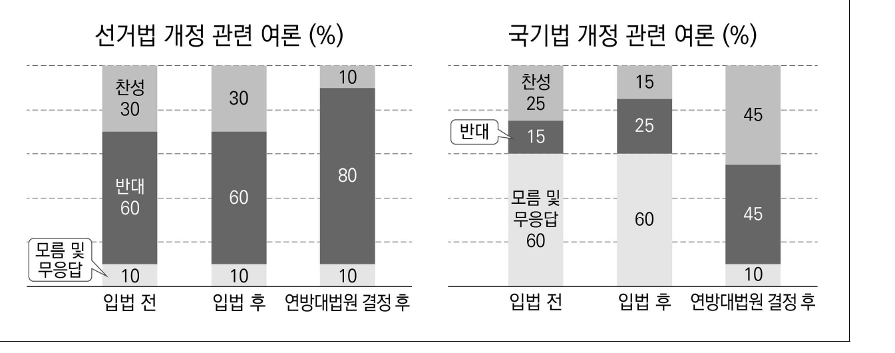
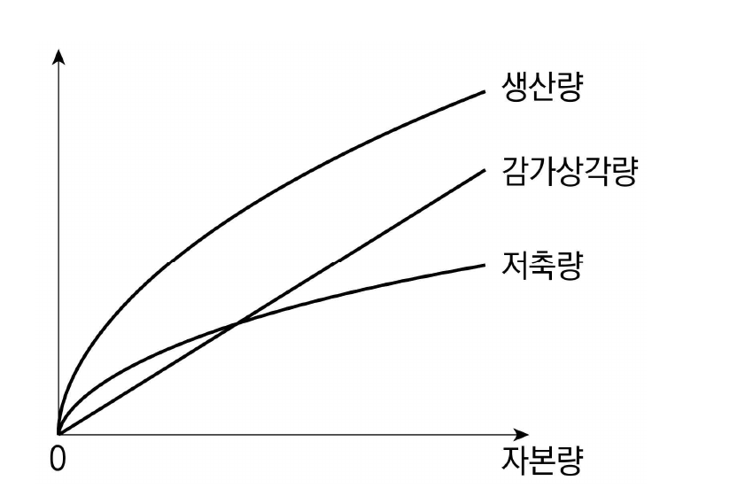
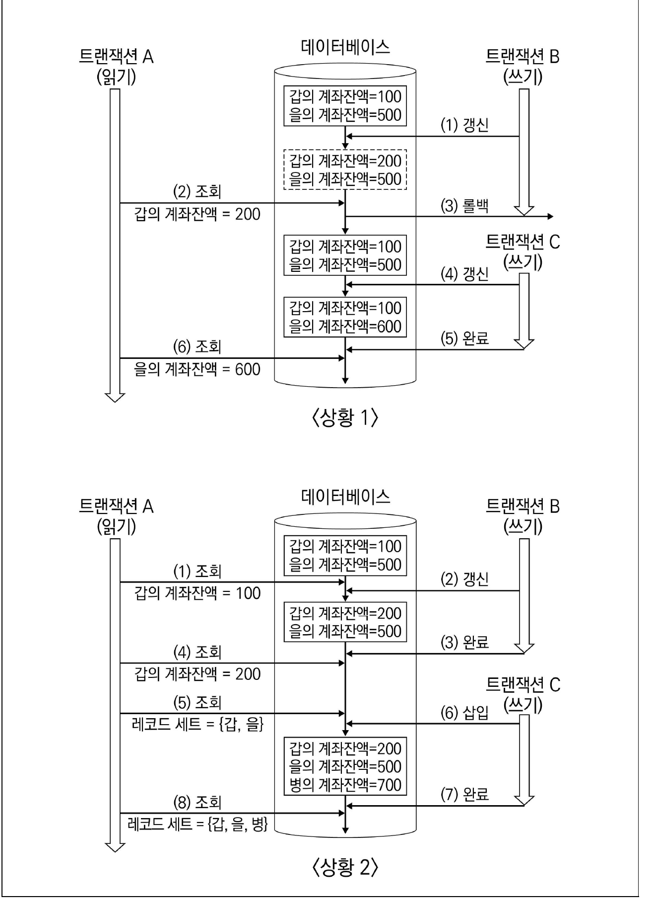

# [01-03] LU (2025)

다음 글을 읽고 물음에 답하시오.

## 제시문

문학이 사회와 그 구성원의 삶을 반영한다는 명제는 법의 영역에도 적용된다. 문학적 서사는 한 시대의 법인식과 정의관을 비추는 거울이다. 문학 속의 법은 비윤리나 무질서와 대비되는 규범․규율의 상징, 또는 ‘언제 열릴지 모르지만 열리길 기다릴 수밖에 없는 문’ 같은 대상으로 그려진다. 문학의 감성적 호소력은 독자를 일정한 행위 방향으로 이끌어 법의 제․개정을 추동하기도 한다. 1830년대 영국에서 유행한 범죄소설은 이러한 법과 문학의 상호작용을 잘 보여 준다. 범죄자 처형기록부인 『뉴게이트 캘린더』에서 인물과 소재를 차용해 ‘뉴게이트 소설’이라 불린 이 시기 범죄 문학 장르는 재판 관행 및 행형 실태 개선을 촉구하는 캠페인의 산물이었다. 그것은 동시에 당대의 지배적 범죄 담론에 대한 대항 담론을 선전․유포하여 형법 개혁의 원동력이 되기도 했다.

불워-리턴의 『폴 클리퍼드』는 뉴게이트 소설 열풍의 서막을 연 작품이다. 그 서두에서 작가는 소설 집필의 동기가 영국 형법의 두 가지 근본적 야만성, 즉 수감자를 교화하기보단 타락하게 만드는 행형, 그리고 단순 절도범마저 공동체로 복귀할 기회를 박탈하는 ㉠ 피에 굶주린 형법전에 대한 교정임을 밝혔다. 범죄자가 들끓는 술집에서 유년기를 보낸 클리퍼드는 소매치기 누명으로 체포되어 수감 생활을 거듭한다. 법정에 선 그는 죄 없는 소년으로 감옥에 갔던 자신이 법을 깨뜨릴 준비가 된 남자로 그곳을 나왔다며, “당신들의 법이 나를 지금의 나로 만들더니 이젠 죽이려 든다.”라는 항변으로 독자의 공감을 유발한다. 법은 범죄자를 만드는 계급과 처벌하는 계급만을 위해 존재할진대, 생존의 막다른 골목에 놓인 빈민을 ㉡ 자연의 제일법칙에 입각한 선택지만 남은 상황으로 내몬 다음 그 선택지를 집었다는 이유로 교수형에 처하는 것이 과연 정의일 수 있는지 소설은 질문한다.

뉴게이트 소설은 범죄자를 신비화하고, ‘참회하는 자’와 ‘자비를 베푸는 자’ 또는 ‘추궁당하는 자’와 ‘추궁하는 자’의 역할을 전도시키는 데까지 나아갔다. 불워-리턴의 후속작 『유진 아람』엔 주인공의 범행 사실을 밝혀낸 자가 도리어 공동체의 지탄을 받고 주인공의 용서를 청하는 장면이 나온다. 대중적 인기를 끌었던 에인즈워스의 『룩우드』 또한 영웅의 일대기처럼 범죄 서사를 구성하고 노상강도의 삶을 낭만적으로 묘사한다. 범죄자에 대한 온정적 묘사나 형법 개혁의 메시지에 대해선 평가를 유보했던 지배계급은 이런 전복적 설정에 대해서는 ㉢ 교수대에 낭비된 감수성이라 격렬히 비난했다. 소설이 연극으로 만들어져 중산계급에서 노동계급으로 수용층이 넓어지자 불온한 열광에 대한 우려는 증폭되었다.

작가는 ㉣ 문학적 공범자가 되어선 안 되며 무뢰한의 타락상을 정확히 보여 줘야 한다고 주장한 새커리는 『뉴게이트 캘린더』에서 한 여성 범죄자를 발굴하여 『캐서린』을 집필했다. 범죄자를 주인공으로 하여 개인사를 부여한 지점까지 이 소설은 뉴게이트 소설의 통상적인 문법을 따랐다. 하지만 범죄의 사회경제적 요인을 찾고자 인물의 유년기를 조명했던 앞선 작가들과 달리, 새커리는 범죄성이 개인의 병증이나 타고난 악함에 의한 것임을 밝혀 독자의 공감을 차단하려 했다. 주인공의 처형 장면은 기사 인용 형태로 건조하게 기술되었다. 처벌은 악인의 참회와 독자의 눈물을 위한 최소한의 유예를 허락하지 않은 채 가해짐으로써 ㉤ 봉쇄된 정의를 실현했다. 하지만 작가의 손을 떠난 작품은 독자에 의해 매 순간 새롭게 읽히기 마련이다. 수전노로 악명 높은 남편과의 결혼생활을 끝내고 사랑하는 사람과 결합하고자 살인을 조력한 주인공의 욕망은 독자에게 뜻밖의 호소력이 있었다. 범죄에 대한 구토를 유발하고 사회의 건강을 회복시킬 약물을 투입하겠다는 작가의 기획은 온전한 성공을 거두진 못했다.

비슷한 시기에 출간된 디킨스의 『올리버 트위스트』 역시 범죄소설의 자장 안에서 읽힌다. 범죄자의 삶을 세밀히 묘사하는 작법은 여기서도 사용되었으며, 익살스럽고 입체적인 악역들은 오락적 요소를 배가했다. 악인 대신 어린 올리버가 주인공으로 설정됐으며, 그 주변 인물인 소매치기들은 자기 삶을 ‘로맨스와 열정이 가득한 유쾌한 것’이라 말하지만 실상 그 삶이 교수대에 가까이 있음을 감지하고 있다. 반면 올리버는 구빈원에서 단지 죽을 더 달라고 했다는 이유로 예비 범죄자로 낙인찍혔음에도 탁월한 통제력으로 범죄 유혹을 물리쳤고 마침내 사회로부터 보상받는다. 뉴게이트 소설의 시대가 저문 후에도 이 소설이 꾸준히 읽힌 데엔 법의 부정의를 고발하되 해학과 권선징악이라는 안전장치를 두어 법질서 자체를 교란하지는 않았던 작가적 선택이 한몫했을지도 모른다.

## 01

윗글의 내용과 일치하지 <u>않는</u> 것은?

### 선택지

(1) 형법 개혁 운동은 범죄소설 열풍의 계기이자 성과였다.

(2) 뉴게이트 소설은 범죄를 질병으로, 형벌을 치료로 이해한 당대 범죄 담론을 강화했다.

(3) 『캐서린』에 대한 독자들의 반응은 문학작품이 항상 작가의 의도대로 읽히는 것은 아님을 보여 준다.

(4) 기득권층은 뉴게이트 소설의 대중적 전파력 확대가 기존 사회 체제의 안정을 저해할 것이라 여겼다.

(5) 『폴 클리퍼드』의 경우와 달리 『올리버 트위스트』는 범행 착수의 기로에 선 개인의 선택과 의지력을 강조했다.

## 02

㉠∼㉤에 대한 이해로 적절하지 <u>않은</u> 것은?

### 선택지

(1) ㉠은 죄에 비해 과한 형을 구형하거나 사형 선고를 남발하는 현상을 가리킨다.

(2) ㉡은 살아남기 위해 주어진 계급적 위치와 역할에 순응해야 하는 운명을 가리킨다.

(3) ㉢은 범죄자와 유대감을 형성하여 범법과 준법의 경계를 허물려는 감수성을 가리킨다.

(4) ㉣은 대중의 기대에 따라 범죄자를 이상화하는 방식으로 그려 내는 작가를 가리킨다.

(5) ㉤은 범죄자에 대한 독자의 감정이입을 차단한 상태에서 구현되는 정의를 가리킨다.

## 03

윗글에서 추론한 것으로 가장 적절한 것은?

### 선택지

(1) 디킨스는 법의 부조리에 대한 비판과 범죄의 해악에 대한 훈계를 한 작품에서 동시에 수행할 수 없다고 보았을 것이다.

(2) 불워-리턴과 디킨스 모두 뉴게이트 소설의 작법에 따라 범죄자에게 자기 정당화의 기회를 많이 주었을 것이다.

(3) 에인즈워스와 새커리 모두 범죄소설의 목적은 범죄자의 교화나 참회를 통해 독자에게 교훈을 주는 것이라고 보았을 것이다.

(4) 불워-리턴은 개인의 잠재된 범죄 성향을 찾기 위해, 그리고 에인즈워스는 영웅적 면모를 강조하기 위해 범죄자의 유년기를 다루었을 것이다.

(5) 불워-리턴은 새커리와 달리 범죄자와 독자 대중의 심정적 거리를 좁히고자 했을 것이다.

# [04-06] LU (2025)

다음 글을 읽고 물음에 답하시오.

## 제시문

동서양의 전설에 나오는 귀신 중 흡혈귀는 문학의 소재로 오래 활용되었다. 특히 흡혈귀는 슬라브 또는 헝가리의 전설에 자주 등장하는데, 이런 전설이 생겨난 원인 중 하나로 포르피린증이라는 질환이 종종 언급된다. 혈액 안의 적혈구가 가지고 있는 단백질인 헤모글로빈은 산소와 결합할 수 있는 분자인 헴(heme)을 가지고 있는데, 헴은 여러 단계의 복잡한 생합성 경로에 의해 만들어진다. 이 헴 합성 경로에 관여하는 효소의 이상으로 포르피린으로 통칭되는 헴 합성 중간물질 및 부산물들이 적혈구, 체액, 간에 축적되는 질환이 포르피린증이다.

헤모글로빈 같은 단백질은 아미노산이 연결되어 만들어지는데, 아미노산만으로는 주어진 단백질의 기능을 완성하기 어려울 때 보철그룹이라 부르는 아미노산 이외의 다른 분자를 단백질에 추가로 결합시킨다. 헴은 단백질의 대표적인 보철그룹으로, 적혈구 안에서 산소를 운반하는 데 참여하는 헤모글로빈뿐 아니라 근육에 존재하는 미오글로빈, 미토콘드리아에 많이 존재하는 시토크롬 등의 단백질에서도 산소와 결합하는 능력을 부여하는 보철그룹으로 작용한다. 운동을 통해 근육이 수축될 때 산소가 많이 필요하므로 미오글로빈은 헤모글로빈과 마찬가지로 산소를 결합하고 있다가 필요할 때 방출한다.

포르피린증은 돌연변이로 이상이 나타난 헴 합성 경로의 효소가 무엇이냐에 따라 여러 종류로 나뉜다. 그중 하나인 ‘선천성 조혈기성 포르피린증’은, 헴 합성 경로 효소 중 하나의 결함으로 생겨난 유로포르피리노젠 I이 다음 단계 효소의 작용을 통해 전환되어 생성된 코프로포르피리노젠 I에 의해 발생한다. 코프로포르피리노젠 I은 환자의 몸에 축적되는데, 치아에 자외선을 비추면 붉은색 형광이 나타나게 하고 피부를 자외선에 민감하게 만들어 햇빛에 노출될 경우 발진을 발생시킨다. 또한 소변으로 배출되어 소변을 붉은색으로 변하게 한다.

선천성 조혈기성 포르피린증 환자는 불면증이 있으며 햇빛을 피하려 주로 밤에 활동하고 피를 마신 것처럼 붉은색 소변을 본다. 그래서 선천성 조혈기성 포르피린증 환자는 공통된 증세를 보이는 흡혈귀 전설의 모델이 되었다는 것이다. 하지만 흡혈귀 전설이 유행하였던 18세기 유럽에서 선천성 조혈기성 포르피린증은 아주 희귀한 질병이었으므로 포르피린증과 흡혈귀의 연관성을 논하는 것은 무리라는 의견도 있다.

포르피린증과 관련된 또 하나의 논란은 영국 왕 조지 3세와 관련한 것이다. 매캘파인과 헌터는 문헌 사례 조사를 통해 발표한 연구에서 조지 3세의 성격이상, 불면증, 정신이상이 포르피린증의 하나인 ‘혼합 포르피린증’과 관련이 있을 것이라고 주장하였다. 하지만 이러한 보고는 동시대 의사들에게 널리 받아들여지지 않았고 양극성 장애가 좀 더 가능성 있는 설명이라는 의견도 많았다.

조지 3세의 질환과 관련된 논란이 계속되자 콕스는 조지 3세의 모발을 분석하여 헴 합성과 연관된 유전자의 결함을 찾으려고 하였으나 유전자 분석에 성공하지는 못했다. 하지만 그는 모발에서 고농도의 비소를 발견하였고, 비소가 헴 대사를 저해한다는 사실에 착안하여 다시 조지 3세의 포르피린증 관련 논란을 촉발시켰다. 그럼에도 조지 3세가 정말 포르피린증 환자였다는 증거는 충분하지 않다는 의견도 많다.

## 04

윗글의 내용과 일치하지 <u>않는</u> 것은?

### 선택지

(1) 코프로포르피리노젠 I은 포르피린의 한 종류이다.

(2) 미오글로빈과 시토크롬은 헴을 보철그룹으로 가지고 있는 단백질이다.

(3) 근육의 미오글로빈도 혈액의 헤모글로빈과 마찬가지로 산소와 결합한다.

(4) 전설 속 흡혈귀의 특징과 공통점이 있는 포르피린증은 혼합 포르피린증이다.

(5) 유로포르피리노젠 I에서 코프로포르피리노젠 I을 만드는 효소에 일어난 결함은 선천성 조혈기성 포르피린증의 원인이 아니다.

## 05

윗글에서 추론한 내용으로 가장 적절한 것은?

### 선택지

(1) 미오글로빈은 적혈구 안에서 산소를 운반하는 데 참여할 것이다.

(2) 미토콘드리아의 시토크롬에 존재하는 헴은 산소와 결합할 수 없을 것이다.

(3) 매캘파인과 헌터의 연구 결과에 의하면 비소는 헴의 대사를 저해할 것이다.

(4) 조지 3세는 불면증과 정신이상을 보였지만 붉은색 소변은 보지 않았을 것이다.

(5) 콕스는 조지 3세의 모발에서 비소 대사와 관련된 효소 유전자의 결함을 찾고자 하였을 것이다.

## 06

<보기>를 바탕으로 본문을 이해할 때, 가장 적절한 것은?

### 보기

헴 합성은 (가)와 같은 다단계 효소 촉매 과정에 의하여 일어난다. 효소는 ‘기질’의 화학적 구조를 변화시키는 반응을 촉매하여 ‘산물’을 만드는데, 특정 효소가 저해되면 다단계 효소 촉매 과정에서 특정 효소의 기질이 축적되어 전체 반응이 저해될 수 있다. 헴 합성 다단계 효소촉매 과정에 관여하는 효소와 그 기질과 산물, 그리고 그 효소에 이상이 생겼을 경우 발병하는 포르피린증의 종류를 (나)의 표에 표시하였다. 단, 효소 ㉢에 이상이 생겨 효소 ㉢의 기질인 포르피린 B가 포르피린 C로 전환되지 못하면, 축적된 포르피린 B는 자발적인 반응을 통해 유로포르피리노젠 I로 바뀐다.

(가) 델타아미노레불린산 → 포르피린 A → 포르피린 B → 포르피린 C → 포르피린 D → 포르피린 E → 포르피린 F → 헴

(나)

| 효소 | 기질 | 산물 | 효소 결핍 시 발병하는 포르피린증 |
|---|---|---|---|
| ㉠ | 델타아미노레불린산 | 포르피린 A | 도스포르피린증 |
| ㉡ | 포르피린 A | 포르피린 B | 급성 간헐성 포르피린증 |
| ㉢ | 포르피린 B | 포르피린 C | 선천성 조혈기성 포르피린증 |
| ㉣ | 포르피린 C 유로포르피리노젠 I | 포르피린 D 코프로포르피리노젠 I | 만발성 피부 포르피린증 |
| ㉤ | 포르피린 D | 포르피린 E | 유전성 코포르피린증 |
| ㉥ | 포르피린 E | 포르피린 F | 혼합 포르피린증 |
| ㉦ | 포르피린 F | 헴 | 조혈기성 프로토포르피린증 |

### 선택지

(1) 효소 ㉠, ㉡의 산물은 도스포르피린증 환자의 체내에 축적될 것이다.

(2) 효소 ㉢의 산물이 코프로포르피리노젠 I로 전환되는 반응은 만발성 피부 포르피린증 환자의 체내에서 원활히 이루어질 것이다.

(3) 효소 ㉣과 ㉤이 결핍되어도 흡혈귀와 공통점이 있는 포르피린증의 원인 물질이 만들어지지 않을 것이다.

(4) 효소 ㉥의 산물은 조혈기성 프로토포르피린증 환자의 체내에 축적되지 않을 것이다.

(5) 효소 ㉦의 기질은 매캘파인과 헌터가 조지 3세가 앓았을 것으로 추정한 포르피린증 환자의 몸에 많이 축적될 것이다.

# [07-09] LU (2025)

다음 글을 읽고 물음에 답하시오.

## 제시문

기존의 역사가들이 민주주의, 노예제와 같은 정치․사회제도의 모델을 찾기 위해 고대 그리스와 로마에 주목했다면, 최근에는 성(性)의 역사라는 맥락에서 서양 고대사를 다루는 경향도 있다. 그중 일부 학자는 혐오스러운 아동 학대라고 할 수 있는 소년애에 대해 고대 그리스와 로마 사회가 비교적 관용의 태도를 보였다는 점에 주목한다.

그리스어 파이데라스티아는 파이스(pais, 소년)와 에란(eran, 사랑하다)의 합성어로 소년애를 뜻한다. 소년애 관계에서 사랑의 대상인 자유민 소년은 에로메노스로 불리며, 이들의 나이는 17세 이하였다. 소년의 연인은 에라스테스로 불리며, 흔히 18～30세 사이의 남성이 이 역할을 수행했다. 고전기 아테네 사람들은 소년을 육체적 아름다움의 추구 대상이자 동시에 지적 대화의 동반자라고 생각했다. 플라톤도 “소년을 사랑하는 사람들은 아무 소년이나 사랑하는 것이 아니라 이성(理性)을 갖기 시작한 나이의 소년들만을 사랑한다.”라고 서술한다. 실제로 그리스인들은 소년을 대상으로 한 교육과 육체적 쾌락이 양립할 수 있다고 믿었다. 그렇기에 파이데라스티아는 육체적 탐미와 사회적 교육, 우정의 조합이라 간주되었다. 아테네의 노예제와 동성애를 연구한 골든이 주장하듯이, 에라스테스와 에로메노스의 육체적 관계도 소년의 명예와 존엄을 배려하는 성격을 띠고 있었다.

스파르타에서는 에로메노스의 역할이 30세까지 지속되었다. 크세노폰은 남성과 소년이 친구가 될 수는 있지만 “남성이 명백히 소년의 육체에 매혹되었다면, 이는 불명예스러운 것”이라고 비판했다. 플루타르코스도 에라스테스와 에로메노스 사이의 관계는 교육적이며, 정신적 사랑의 의미가 더 크다고 보았다. 현대의 역사가 카틀리지는 소년애가 지녔던 정치적 엘리트 충원 역할에 주목했다. 그에 따르면, 세력 있는 집안 출신인 소년의 에라스테스가 된다는 것은 소년의 가장 가깝고 믿을 만한 조언자, 동료가 된다는 것을 뜻하였다. 물론 이런 해석들은 파이데라스티아의 본질인 ‘육체적 아름다움에 대한 매혹’을 과소평가한 것이다.

로마 공화정 후기인 기원전 3세기에서 기원전 1세기까지 동성애를 원하는 자유민 남성들에게 ‘준비된 손쉬운 사랑’의 대상은 주로 노예였다. 호라티우스의 시구에 등장하는 “난 준비된 손쉬운 사랑을 좋아하거든”이라는 표현은 상류층의 노예주가 노예 남녀를 성욕 충족의 도구로 삼는 데 아무런 장애가 없었음을 보여 준다. 이 경우 노예주들은 종종 미소년을 찾는 경향을 보였는데, 그러한 소년 노예는 델리카투스라 불렸다. 하지만 기원전 6～5세기의 아테네와 달리 기원전 2세기의 로마는 성인 남성과 자유민 소년과의 관계를 처벌하고 있었다. 이에 대해 로마사가 폴 벤느는 로마인이 시민의 능동성과 남성성에 대해 결벽적이었기 때문에 장차 시민이 될 소년과의 관계를 거부한 것이라고 설명했다. 나아가 미셸 푸코는 소년애를 억제한 결과 신분에 구애받을 필요가 없는 젊은 노예들과의 동성애가 로마에서 널리 행해졌다고 주장하였다.

로마 제정 초기인 기원전 1세기에서 서기 1세기까지 로마에는 그리스의 생활 방식을 숭상하는 헬레니즘이 번져 있었다. 그 일환으로 소년애가 로마에 흘러든 것은 결코 놀라운 일이 아니다. 당대의 지식인 키케로가 “이 우정의 사랑이란 대체 무엇인가? 내가 보기에 이 습속은 그리스인들의 김나시움에서 생겨난 듯하다.”라고 논평했듯이, 로마의 지식인들은 젊은 남성들이 연무장에서 벗은 몸으로 운동하는 것을 의심에 찬 눈초리로 바라보았다. 로마사 연구자 윌리엄스는 로마인이 그리스인에게 소년애를 배울 필요가 없었다고 하지만, 여러 정황을 고려하면 로마의 소년애는 그 뿌리가 그리스에 있는 것으로 보인다. 그런데 다른 풍토에 이식된 문화는 원산지에서와는 다르게 생장하는 법이다. 로마의 소년애도 그랬다. 구애의 절차와 관계의 목표 모두 그리스에서와는 달리 명예로운 편이 아니었다. 소년들을 육체적으로 정복하고자 하는 욕망의 충족이 소년애의 궁극적 목표였으며, 이는 잠재적 시민의 명예에 대한 배려와는 거리가 멀었다.

## 07

윗글에 대한 이해로 적절하지 <u>않은</u> 것은?

### 선택지

(1) 플라톤은 파이데라스티아의 대상을 일정한 지적 성장 단계의 소년으로 한정했다.

(2) 크세노폰은 에라스테스를 소년의 육체를 차지하려는 불명예스러운 자로 한정했다.

(3) 플루타르코스는 성년 남자와 자유민 소년 간의 관계에서 정신적인 것을 중시했다.

(4) 호라티우스의 시구에는 공화정 후기 로마인들과 델리카투스 사이의 성 풍속이 암시되어 있다.

(5) 키케로는 헬레니즘을 통해 확산된 소년과의 그리스적 우정에 대해 비판적이었다.

## 08

윗글로 보아 다음 설명 중 가장 적절한 것은?

### 선택지

(1) 아테네와 스파르타에서는 모두 이십 대 청년이 에로메노스에서 배제되었다.

(2) 아테네에서와 달리 스파르타에서의 에라스테스는 소년과의 육체적 관계를 거부했다.

(3) 그리스에서와 달리 공화정 후기의 로마에서는 자유민 소년과의 소년애가 억제되었다.

(4) 그리스에서와 달리 제정 초기의 로마에서는 소년애가 수행하는 사회화 기능에 주목했다.

(5) 공화정 후기의 로마에서와 마찬가지로 제정 초기의 로마에서 소년애는 소년의 명예를 배려하였다.

## 09

윗글과 <보기>를 연결하여 평가할 때, 가장 적절한 것은?

### 보기

고대 그리스 도자기에 묘사된 소년애 장면은 이성애 장면에 비해 훨씬 덜 노골적이다. 이는 자유민 소년이 성적 권력관계에서 욕망의 대상으로만 인식되는 것에 대해 그리스 사회가 지닌 거부감을 보여 준다. 한편, 기원전 2세기 로마의 상류사회에서 노예는 성적 대상이기도 했다. 법적 보호를 받을 수 없었던 노예 소년과의 관계를 즐기는 문화가 확산되자 시민들은 자칫하면 자기 자식도 소년애의 대상이 될 수 있다는 생각에 불안해했다. 거리에서 미성년 남성에게 치근덕거리는 행위를 금했던 공화정 후기의 성추행 관련 칙령은 이런 불안감의 결과였다. 공화정이 붕괴하고 평화의 시기가 도래하자 그리스적 사랑이 확산되었다. 로마의 현실을 일정하게 반영하고 있는 연가(戀歌) 역시 그리스적 사랑의 이식을 잘 보여 주었다.

### 선택지

(1) 도자기에 그려진 장면은 에로메노스와 에라스테스 관계에 대한 골든의 해석과 상충하는군.

(2) 그리스 도자기의 소년애 장면은 소년애를 정치 엘리트 충원 기능과 연결하는 카틀리지의 해석과 상충하지 않겠군.

(3) 그리스인이 느낀 ‘거부감’과 로마인이 지닌 결벽적 태도가 상충한다는 점에서 벤느의 해석은 비판받을 수 있겠군.

(4) 젊은 노예의 법적 지위는 노예를 상대로 한 동성애 확산으로 인해 소년애가 줄었다는 푸코의 주장을 뒷받침할 만하군.

(5) 제정 초기 로마의 연가는 소년애가 그리스로부터 유입된 것이 아니라는 윌리엄스의 주장을 뒷받침할 만하군.

# [10-12] LU (2025)

다음 글을 읽고 물음에 답하시오.

## 제시문

사법심사는 다수주의의 예외로 간주되기도 한다. 민주적 절차로 선출된 의회나 행정부의 결정이 합헌 여부를 기준으로 무효화될 수 있기 때문이다. 게다가 사법심사의 주체가 임명직이라는 점에서 정통성 문제가 대두된다. 반대로 사법심사는 민주주의의 내재적 한계를 극복하려는 고육지책이라는 옹호론도 있다. 사회적 약자에 해당하는 소수자 집단은 다수결 논리에 의해 형성되거나 해체되는 의회나 행정부로부터 보호받기 어렵다는 것이다.

위의 논의들은 사법심사의 정치적 독립성을 전제하지만, 현실 정치에서의 완전한 독립은 늘 의심받는다. 이에 로버트 달은 미국의 연방대법원이 반다수주의를 추구하는 사법심사 기구가 아니라 대통령, 의회와 함께 지배 연합의 필수불가결한 부분으로 작동한다고 분석했다. 의회의 힘 있는 입법 다수가 최근에 제정한 법률을 연방대법원이 뒤집는 경우는 거의 없다는 것이다. 선출직 의원들은 재선 때문에 여론에 민감하게 반응하고 의회 내 입법 다수는 전국 여론의 축소판이어서, 이에 영향을 받는 사법심사는 원래 취지와 달리 소수의 이익을 보호하지 못하는 다수주의적 난제에 직면한다. 사법심사가 반다수주의적 난제를 떠안았다는 기존의 견해를 뒤집은 달의 이런 주장은 여론조사 기법의 발달로 대중의 선호가 사법적 판단에 미치는 영향에 대한 연구가 본격화되면서 설득력이 커졌다. 그중에는 사법심사 결과와 여론조사 결과가 60% 이상 일치한다는 연구 결과도 있었다. 즉 정책 영역에 따라 일치도의 차이는 있지만, 연방대법원 역시 대체로 의회나 대통령처럼 여론에 반응한다는 것이다.

반대로 사법심사의 결과가 여론에 영향을 미치는 방향도 상정할 수 있다. 즉, 사법심사 결정 후 그 결정에 찬성하는 여론이 증가 혹은 감소할 수도 있고, 여론이 양분되거나 사법심사 결정에도 불구하고 여론에 변동이 없는 경우도 예상할 수 있는 것이다. 미국 정치를 배경으로 한 기존 연구는 이 상황을 크게 <kbd>네 가지 모델</kbd>로 구분해 설명한다.

우선 ‘긍정적 반응 모델’이다. 이 모델은 어떤 사안에 대해 반대 의견을 가졌던 사람들도 연방대법원의 결정이 나온 후에는 기존 의견을 수정해 그 결정을 수용하는 경우가 많다는 현상에 주목한다. 이때 찬반 의견의 변경은 그 사안에 대해 대중의 관여도가 비교적 낮아 발생한 것으로 설명된다. 대중은 대체로 연방대법원의 전문성과 공정성을 신뢰하고, 그 결과 연방대법원의 결정은 미국 사회에서 안정적으로 수용된다. 자신과 특별한 이해관계가 없는 한, 대중은 연방대법원의 결정을 수용하는 방향으로 여론을 형성하게 되므로 이 모델은 많은 사례를 잘 설명할 수 있다고 평가된다.

‘반발 모델’은 사법심사 결과에 불복하는 그룹들이 반대 의사를 적극 표출하고 이것이 전체 여론으로 확산하는 현상에 주목한다. 연방대법원이 동성혼을 합헌으로 결정하자 동성혼에 대한 지지는 물론 성적 소수자를 포용하는 여론이 도리어 감소했음을 밝혀낸 연구가 그 사례이다. 한편, 사법심사 결과에 대한 반발은 시간 경과에 따라 줄어드는 경우가 있어 이 모델은 내구성이 약하다고 평가되기도 한다. 일시적 반발이 잠잠해지면 사법심사의 결과를 수용하는 방향으로 여론 변화가 나타나기 때문이다.

‘양극화 모델’은 여론의 주목을 받지 못하던 사안들이 사법심사를 계기로 본격적인 쟁점으로 전환되어 대중의 찬반 여론이 극명하게 갈리는 현상에 주목한다. 낙태 이슈에 대한 사법심사 결정이 오히려 미국 사회의 갈등을 증폭한 것이 그 예이다. 실제로 사법심사 결정은 특정 집단 내에서 여론의 강도를 높이는 경우가 있다. 특정 사안에 관심이 없거나 태도가 모호했던 대중이 사법심사 결정 이후 양극단에 집결하고 응집도도 높아지기 때문이다. 앞에서 말한 낙태 이슈는 사법심사 과정에서 대중에게 전달되는 관련 정보를 증가시켰고 이 정보에 노출된 대중은 기존의 모호한 태도를 버리고 특정 입장에 집결하고 세력화하였다.

마지막으로 ‘무반응 모델’은 사법심사 결정 후에도 기존의 여론 지형도가 지속되는 무반응 현상에 주목한다. 사법심사가 의회의 결정을 지지하는 경우, 언론의 주목도나 여론의 관심도는 대체로 낮다. 주로 폭넓은 사회적 합의가 있었거나 대중의 관심도가 낮았던 특정 사안이 의회에서 입법화되고 사법심사가 이를 추인한 것이기 때문이다. 이런 점에서 ‘무반응 모델’은 미국의 정치 현실을 폭넓게 설명할 수 있는 모델로 평가될 만하다.

## 10

<kbd>네 가지 모델</kbd>에 대한 설명으로 가장 적절한 것은?

### 선택지

(1) 긍정적 반응 모델은 연방대법원의 전문성과 공정성에 대한 대중의 불신을 반영한다.

(2) 연방대법원의 결정을 여론이 즉각 수용할 경우, 반발 모델은 설득력이 커진다.

(3) 반발 모델이 예상하는 반응은 시간이 지나면서 긍정적 반응 모델이 예상하는 반응으로 수렴되는 경향이 있다.

(4) 낮았던 여론의 관심도가 사법심사 결정 이후 높아졌다면, 양극화 모델은 설득력이 줄어든다.

(5) 의회의 결정을 수용하는 연방대법원의 결정에 대해 여론의 관심이 높을 경우, 무반응 모델로 이를 설명할 수 있다.

## 11

윗글에서 추론한 내용으로 적절하지 <u>않은</u> 것은?

### 선택지

(1) 반다수주의자들은 사법심사권자를 선거로 뽑는 것에 대해 우려를 제기할 것이다.

(2) 로버트 달의 견해는 입법 다수가 대중의 선호를 제대로 반영한다는 것을 전제로 도출되었을 것이다.

(3) 소수자 보호에 적극적인 사람이라면, 사법심사와 입법 활동 모두 대중의 여론을 있는 그대로 반영해야 한다는 주장에 찬성할 것이다.

(4) 의회 결정 무효화가 부당하다고 보는 사람은, 사법심사로 인해 민주주의가 다수주의적 난제에 직면했다는 의견에 동의하지 않을 것이다.

(5) 사법심사의 대상이 된 법률을 입법했던 의회 다수당이 선거에서 패배했다면, 달은 그 사안에 대한 연방대법원의 위헌 결정 가능성이 높아진다고 예상할 것이다.

## 12

윗글을 바탕으로 <보기>의 X국 상황을 평가할 때, 적절하지 <u>않은</u> 것은?

### 보기

X국의 사법심사를 담당하는 연방대법원은 최근 두 건의 사법심사 결과를 발표했다.

(가) 의회가 개정한 선거법은 위헌이다.

(나) 의회가 개정한 국기법(國旗法)은 합헌이다.

사법심사 결정의 전 단계에서 언론은 (가)의 법에 대해 집중 보도했고, 상대적으로 (나)의 법에 대해서는 주목하지 않았으나 결정 이후 보도량을 대폭 늘렸다. 아래 그림은 관련된 여론 변화를 나타낸다.

<이미지 포함됨>

### 선택지

(1) ‘선거법 개정’과 관련한 찬반 구성의 변화 추이가 연방대법원에 대한 X국 국민의 신뢰를 반영한다는 점에서, 긍정적 반응 모델로 (가)에 대한 대중의 반응을 설명할 수 있겠군.

(2) 반발 모델로는 (가)의 결정 직후 대중이 ‘선거법 개정’에 반발한 점을 설명할 수 있지만, 관여도가 낮았던 대중이 (나)의 결정 직후 입법 찬성으로 선회한 점은 설명할 수 없겠군.

(3) ‘국기법 개정’에 대한 반응이 연방대법원 결정 이후의 시점에 팽팽한 찬반 대립으로 나타났다는 점에서, 양극화 모델로 X국의 사회적 갈등의 증폭을 설명할 수 있겠군.

(4) (가)와 (나) 두 사안에 대해 ‘모름 및 무응답’ 비율의 변화 추세가 다르다는 점에서, 양극화 모델로 정보 제공량과 대중의 관심도 간의 양의 상관관계를 설명할 수 있겠군.

(5) 무반응 모델로는 (가)와 (나)로 인한 여론 추이를 설명하기 힘들지만, 사회적 합의가 부족한 상태에서 의회가 입법 활동을 했음을 지적할 수는 있겠군.

# [13-15] LU (2025)

다음 글을 읽고 물음에 답하시오.

## 제시문

공리주의에서 도덕적으로 옳은 것은 공리를 극대화하는 결과를 산출하는 것이다. 반인권적인 행위나 제도라도 결과적으로 더 많은 공리를 산출한다면, 공리주의는 그것을 지지해야 한다. 가령 병원에 건강 검진을 받으러 온 한 사람을 죽여 다섯 명의 환자에게 장기를 이식하는 경우, 더 많은 공리는 산출되겠지만 한 명의 생명이 갖는 권리를 침해하게 된다.

도덕적 권리들이 존재하는 것이 틀림없다고 전제하는 피시킨은 이 권리들을 인정하지 않는 윤리 이론은 거부되어야 한다고 주장한다. ‘무엇이 공리를 극대화하는 결과를 낳을 것인가’는 경험적인 문제이므로, 권리에 적대적인 행위가 권리를 존중하는 것보다 더 많은 공리를 산출한다는 이유로 지지되는 공리주의는 권리의 확실한 토대를 제공할 수 없다고 주장한다. 위의 행위가 허용되면 사람들이 공포를 느끼고 의료 시스템에 대한 신뢰가 무너지는 등 나쁜 결과가 초래될 것이므로, 공리주의자도 그 행위를 반대할 것이다. 그러나 피시킨은, 무작위 추첨에 의한 반자의적 장기 기증 시스템에서는 사람들이 강제 기증자가 될 위험에 대한 공포보다 자신들도 수혜자가 될 수 있다는 기대가 더 크다면 공리주의자는 공리 극대화의 한 방법으로 그 시스템을 승인할 것이라고 비판한다.

공리주의는 ‘권리의 규범적 힘’을 인정할 수 없기에 권리를 수용하기 어렵다고 라이언스는 비판한다. 그에 따르면 내가 어떤 것을 할 권리를 가진다는 사실은 타인의 간섭에 반대하는 근거를 제공할 뿐만 아니라, 권리 침해를 옹호하는 논변이 넘어야 하는 ‘논증의 문턱’을 제공한다. 그런데 공리주의는 행위의 도덕적 평가에서 일관되게 공리의 극대화를 기준으로 삼기 때문에, 권리의 규범적 힘을 인정할 수 없다.

한편, 반공리주의 논변에 맞서 브란트는 공리주의와 권리 사이의 부정합성은 단지 행위 공리주의에만 있을 뿐, 규칙 공리주의에는 없다고 주장한다. 개별 행위의 공리를 계산하는 행위 공리주의와 달리, 규칙 공리주의는 한 사회의 도덕률은 그것을 채택하지 않았을 때보다 채택했을 때 더 큰 공리를 산출하는 경우에만 옳으며, 어떤 개별 행위는 그 도덕률에 의해 정당화될 때 도덕적으로 옳다고 본다. 이때 도덕률 위반 행위가 공리를 증가시키더라도 그 도덕률은 준수되어야 한다. 이처럼 브란트는 규칙 공리주의가 권리의 규범적 힘을 수용할 수 있다고 주장한다. 하지만 라이언스는 규칙 공리주의도 권리들의 규범적 힘을 수용하지 못한다고 주장한다. 공리주의에서는 공리에 대한 위협 없이 규칙을 위반하는 것이 가능하기에, 공리주의적 정당화는 공리주의자에게 규칙 유지의 이유를 제공할 수는 있어도 그 규칙을 준수해야 할 이유는 제시하지 못한다는 것이다.

헤어는 공리주의와 권리의 도덕적 힘 사이의 부정합성은 ‘직관적 수준’과 ‘비판적 수준’으로 이루어진 자신의 두 수준 공리주의 이론을 따를 때 해소된다고 주장한다. 직관적 수준의 사유란 우리가 이미 주어진 것으로 간주하고 의문을 제기하지 않는 마음의 습관이나 원리 등을 개별적 사안에 적용할 때의 사유로서, 규칙 공리주의적으로 사유하는 것을 가리킨다. 이에 견줘 비판적 수준의 사유는 행위 공리주의적으로 사유하는 것이다. 헤어는 직관적 사유를 이끄는 간단하고 일반적인 도덕 원리는 그것을 위반했을 때 죄의식이나 회한 같은 도덕적 감정을 수반한다고 본다. 이는 규칙을 과거의 경험에서 일반화한 일종의 ‘대략의 규칙’으로 보는 행위 공리주의의 생각과 다르다. 헤어에 의하면 권리는 일반적 도덕 원리의 일종이다. 직관적 사유가 다룰 수 없는 특수한 상황에서는 비판적 사유가 적용될 것이다. 그 결과, 권리 침해가 최적의 행위라고 결론이 난다면, 일관된 공리주의자의 입장에서는 권리의 침해가 도덕적으로 옳다. 그러나 여기서 헤어는 인간의 오류 가능성과 한계를 언급하면서, 신중한 공리주의자는 직관을 저버리기보다는 따르는 것이 최선이 될 가능성이 크다고 여길 것이라고 주장한다.

## 13

윗글의 내용과 일치하는 것은?

### 선택지

(1) ‘논증의 문턱’을 넘으면 권리 침해가 용인된다.

(2) 행위 공리주의자는 ‘대략의 규칙’을 인정하지 않는다.

(3) 규칙 공리주의자는 개별적 행위의 옳고 그름을 판단하지 않는다.

(4) 공리와 권리 간의 부정합성은 ‘비판적 수준’에서는 발생하지 않는다.

(5) 반공리주의자는 반자의적 장기 기증 시스템이 유발하는 공포를 인정하지 않는다.

## 14

윗글에 제시된 입장들을 이해한 내용으로 적절하지 <u>않은</u> 것은?

### 선택지

(1) 피시킨은 경험이나 결과에 의존하지 않고도 권리가 존재한다고 전제할 수 있느냐고 비판받을 수 있을 것이다.

(2) 피시킨은 권리를 보호하는 규칙의 효용성이 경험적으로 드러나더라도 그 규칙은 권리의 확실한 토대를 제공할 수 없다고 주장할 것이다.

(3) ‘규칙 준수의 이유를 제시하더라도 규칙 공리주의는 결과를 계산하지 않는 권리론과 다를 바 없다.’라고 주장하는 사람은 라이언스의 브란트 비판에 동조할 것이다.

(4) 규칙의 규범적 힘을 공리의 극대화를 통해 수용할 수 있다면 규칙 유지는 결국 규칙 준수와 다르지 않다고 브란트는 주장할 수 있을 것이다.

(5) 헤어는 권리가 가지는 논증의 문턱이 직관적 수준에서는 규범적 힘을 발휘하기에 너무 높다고 비판받을 것이다.

## 15

윗글을 바탕으로 다음 <보기>를 이해할 때, 적절하지 <u>않은</u> 것은?

### 보기

인간을 궁극적으로 행복하게 만들어서 최종적으로 인간에게 평화와 안식을 줄 목적으로 네가 인간 운명의 기본 구조를 만들고 있다고 상상해 봐. 그러나 작은 아기를 죽을 때까지 고문하고 그 아기의 한 서린 눈물 위에 그 구조물을 세우는 것이 필수적이고 불가피하다고 상상해 봐. 너는 이런 조건에서 그것의 건설에 동의하겠니?

- 도스토옙스키, 『카라마조프가의 형제들』 -

### 선택지

(1) 행위 공리주의자는 ‘상상’을 실현할 수 있다면 ‘아기’의 권리에 대한 침해에 동의할 것이다.

(2) ‘아기’의 권리가 선험적으로 확실하다면, 피시킨은 ‘아기’의 고통과 인간들의 ‘평화와 안식’을 저울질하는 것이 무의미하다고 생각할 것이다.

(3) ‘아기’를 고문함으로써 더 많은 이익이 생긴다고 할지라도, 라이언스는 ‘아기’가 ‘한 서린 눈물’을 흘리지 않도록 고문이 금지되어야 한다고 생각할 것이다.

(4) ‘아기’의 ‘행복’을 존중하는 규칙을 채택하는 것보다 채택하지 않는 것이 더 큰 공리를 산출하더라도, 브란트는 ‘아기’의 권리는 존중되어야 한다고 생각할 것이다.

(5) ‘구조물’의 건설이 실제로 공리를 극대화할지 판단할 확실한 정보가 없다면, 헤어는 ‘아기’의 권리를 보호해야 한다는 직관을 따라야 한다고 생각할 것이다.

# [16-18] LU (2025)

다음 글을 읽고 물음에 답하시오.

## 제시문

한 사회의 소비나 인프라 수준은 생산 능력에 달려있기 때문에, 생산 능력의 장기적인 변동으로 정의되는 경제성장은 경제학자와 정책입안자의 중요한 관심 사항이다. 솔로우 성장모형은 저축과 인구의 변동, 기술의 진보가 시간의 흐름에 따라 생산과 소비에 어떤 영향을 주는지를 동태적으로 분석하는 대표적인 성장모형이다. 인구와 기술 수준의 변동을 고려하지 않는 ‘단순한’ 솔로우 성장모형에서 생산량($y$)은 자본량($k$)의 증가 함수이다. 단, 자본이 한 단위 증가할 때 생산이 늘어나는 정도는 자본 수준이 높아질수록 작아진다고 가정한다. 자본을 이용하여 만들어진 생산은 소비($c$)나 자본재 구입을 위한 투자($i$)로 사용될 수 있다. 따라서 ‘생산량 = 소비량 + 투자량’의 관계가 언제나 성립한다.

생산에서 소비하지 않고 남은 부분, 즉 저축이 투자의 재원이 되므로 투자와 저축은 언제나 일치한다. 저축률($s$)은 저축이 생산에서 차지하는 비율로 정의되며 0과 1 사이의 값을 갖는 상수이다. 감가상각은 자본 사용 정도에 비례하여 자본재의 일부가 마모되어 더 이상 사용할 수 없게 되는 것으로, 감가상각량은 자본량과 0과 1 사이의 값을 갖는 상수인 감가상각률($d$)의 곱으로 결정된다. 생산량을 비롯하여 저축량, 감가상각량, 투자량 등은 총량을 고정된 인구수로 나눈 1인당 개념이다.

솔로우 성장모형에 따르면 자본량의 변동은 다음과 같은 <식>으로 표현된다.

$$
\Delta k = i - dk
$$

여기서 $\Delta$는 경제 변수가 전기 대비 변동하는 크기를 나타내는 기호이다. 이 식은 자본량의 변동 방향을 결정하는 두 요인을 설명하는데, 신규 투자는 자본량을 늘리는 반면 감가상각은 자본량을 줄이는 방향으로 작용하게 된다. 앞선 논의를 종합하면 솔로우 성장모형에서 생산량, 저축량, 감가상각량은 다음 <그림>과 같이 궁극적으로 자본량 수준에 의해 결정된다.

<이미지 포함됨>

솔로우 성장모형에서 중요한 개념인 ‘정태상태’는 투자량과 감가상각량이 정확하게 일치하여 자본량의 변화가 없는 상태를 일컫는다. 자본량의 변동이 없으므로 생산량의 변동도 없고 저축과 소비도 일정하게 유지된다. 정태상태에 있지 않은 경제는 시간이 지남에 따라 정태상태로 이동하는 특성을 갖는다. 예를 들어, 만약 투자량이 감가상각량을 상회하고 있다면 <식>에 의해 자본량은 시간이 지남에 따라 증가하게 된다. 자본량이 늘어나면 생산량이 늘어나고 생산량의 일정 비율인 투자도 증가한다. 또한 자본량의 일정 비율인 감가상각량도 늘어난다. 다만, 감가상각량의 증가 속도는 자본량의 변화 속도와 언제나 같은 반면 투자량의 증가 속도는 차츰 감소하는데, 이는 자본이 늘어남에 따라 생산이 늘어나는 속도가 줄어들기 때문이다. 이러한 원리로 결국 어느 시점에서는 투자량과 감가상각량이 같아지면서 경제가 정태상태에 도달하게 되며, 이후에 다른 외생적인 변화가 없다면 경제는 이 정태상태를 그대로 유지하게 된다. 경제가 도달하는 정태상태 자본량은 각 경제의 기초여건인 저축률 및 감가상각률 수준과 생산함수에 의해 결정된다.

[A] 솔로우 성장모형에서는 소비가 최대가 되는 정태상태 자본량 수준을 최선의 자본량이라는 의미에서 황금률 자본량이라고 부른다. 생산함수와 감가상각률이 고정되어 있다고 하면, 저축률 변동을 통해 경제가 황금률 수준의 자본량을 달성하거나 또는 황금률에 보다 가까운 수준의 자본량을 보유하도록 경제상태를 이동시킬 수 있다. 예를 들어, 정태상태에 있는 어느 경제의 자본량이 황금률 수준을 하회하고 있는 상태에서 저축률을 상승시키는 경제 정책이 시행되었다고 하자. 정책이 시행된 시점에는 저축률 상승으로 인해 소비가 즉각 줄어든다. 그러나 시간이 지나면서 투자와 자본량 증대가 생산 수준을 점차 더 높이게 된다. 따라서 생산의 일정 비율인 소비도 점차 증가하여 궁극적으로는 정책 변경 이전보다 높은 수준으로 수렴하게 된다. 이러한 정책의 결과로 새로운 정태상태에서 미래 세대는 정책 변경이 없었던 경우와 비교하여 더 높은 수준의 소비를 누릴 수 있으므로 효용이 증가한다. 반면 현재 세대, 특히 기대 잔여 수명이 얼마 남지 않은 고령층의 경우에는 미래 시점에서의 소비 증가 혜택을 얻을 가능성은 낮으나 현재의 소비 감소로 인한 효용 감소는 분명하므로 청년층에 비해 이와 같은 정책에 반대할 가능성이 높다.

## 16

윗글에 대한 이해로 적절하지 <u>않은</u> 것은?

### 선택지

(1) 생산함수는 정태상태에 영향을 주지 않는다.

(2) 투자와 감가상각이 다르다면 자본량은 변동한다.

(3) 자본량이 늘어나면 생산량은 필연적으로 증가한다.

(4) 저축이 투자를 상회하는 경우는 결코 발생할 수 없다.

(5) 자본이 한 단계 증가할 때 생산 증가의 폭은 자본 수준이 높을수록 작아진다.

## 17

윗글에서 추론한 것으로 적절하지 <u>않은</u> 것은?

### 선택지

(1) 저축률을 비롯한 기초여건은 동일하지만 초기 생산량이 다른 두 국가 경제는 소비 격차가 좁혀지지 않는다.

(2) 저축률을 변경시키는 정책에 대한 찬반 여부는 세대 간 기대 잔여 수명의 차이에 영향을 받는다.

(3) <그림>에 의하면 자본 마모 속도가 빨라지는 경우 저축량과 감가상각량이 일치하는 자본량은 작아진다.

(4) <그림>에 의하면 저축률의 상승은 투자량과 감가상각량이 일치하는 자본량을 확대시킨다.

(5) 황금률 자본량을 보유하고 있는 경제의 생산량은 다른 조건의 변화가 없다면 변동하지 않는다.

## 18

[A]를 바탕으로 <보기>의 X국 경제 정책을 평가할 때, 적절하지 <u>않은</u> 것은?

### 보기

현재 X국에서는 투자량과 감가상각량이 일치하며, 자본량이 황금률 수준을 상회하고 있다. 이에 주목한 정부는 황금률 자본량을 달성하기 위해 국민의 소비를 장려하는 정책을 시행하였다. (단, 다른 조건의 변동은 없다.)

### 선택지

(1) 정책 시행 이후 현재 세대 중 고령층과 청년층 모두의 효용 수준은 높아진다.

(2) 정책 시행 이후 새로운 정태상태에 도달할 때까지 소비는 점차 증가한다.

(3) 미래 세대의 효용 수준은 정책이 시행되지 않는 경우보다 높아진다.

(4) 감가상각량은 정책 시행 이전보다 낮은 수준으로 수렴한다.

(5) 자본량은 정책 시행 이전보다 낮은 수준으로 수렴한다.

# [19-21] LU (2025)

다음 글을 읽고 물음에 답하시오.

## 제시문

보조생식술의 발전에 따라 난임 부부도 자기 생식세포를 이용한 체외수정으로 배아를 생성한 뒤 이를 모체에 이식하여 임신할 수 있게 되었다. 이 발전은 시술 뒤에 남은 배아를 어떻게 처리할 것인지에 대한 윤리적 논란도 유발하였다. 잔여 배아를 예외 없이 폐기해야 한다는 견해와, 난치병 연구를 위해 사용할 수 있게 해야 한다는 견해가 맞서고 있는 것이다.

이와 관련하여 독일에서는 배아보호법을 제정하였다. 이 법은 대다수 국가의 법령들처럼 임신을 목적으로 하지 않는 배아의 생성을 애초에 불허하고 있지만, 다른 나라의 입법례와는 달리 가급적 잔여 배아 자체가 만들어지지 않게 하는 것이 최선이라는 시각을 반영한 ㉠ 엄격한 기준을 규정하여 배아 생성자의 자기결정권을 제한한다. 이에 따르면 1회의 시술 주기 내에 난자를 3개까지만 수정시킬 수 있고, 같은 시술 주기 내에 배아를 3개까지만 이식할 수 있다. 게다가 1회의 시술 주기 내에 이식할 배아의 수보다 많이 난자를 수정시켜서는 안 되고, 이식 후 배아의 온전한 착상 전에 그것을 채취해도 안 된다.

임신 성공률을 높이려면 가급적 많은 배아를 확보해야 하는 까닭에 잔여 배아가 생긴다. 그런데도 독일 법은 결국 한 번의 시술로 이식할 만큼만 수정하게 하고, 수정 후에는 남김없이 이식하게 하며, 심지어 배아를 회수할 목적으로 착상을 방해할 가능성마저 없애고 있다. 배아 보존 자체는 금지하지 않지만 보존될 배아가 애초에 거의 생기지 않게 하려는 것이다.

그러나 이 배아보호법으로 인해 오히려 배아가 죽게 되는 역설적 상황이 초래되었다. 이 상황은 배아를 이용한 체외수정 시술의 특수성에서 비롯된다. 체외수정 시술을 위해서는 가장 건강한 배아 하나만을 골라 이식하는 ‘선택적 단일 배아 이식’, 몇 개의 배아를 동시에 이식한 뒤 살아남은 배아를 성장시키는 ‘다배아 이식’ 등의 방법이 사용된다. 임신 확률을 높이려면 배아의 건강 상태, 산모의 나이, 다태아 출산의 위험성 등에 비추어 가장 적합한 시술 방식을 선택해야 한다. 그런데 이 법을 따르면 선택적 단일 배아 이식의 방식을 취하기가 어렵게 된다. 하나를 제외한 나머지 배아에 모두 결함이 있어 불가피하게 배제될 경우가 아니라면, 충분히 건강한 한두 개의 배아를 다음 시술 시기를 위해 남겨 두지 못하기 때문이다. 그 결과 모든 배아를 일단 착상시킨 후 가장 건강한 하나만을 남기고 나머지 한두 개는 모체에서 제거하는 일이 종종 일어난다. 그래서 법제 개선을 촉구하는 독일학술원의 성명에서는 잔여 배아 보존이 가능하게 하고 배아 생성자가 그 기간을 결정하도록 하자고 제안하였다.

한국 법에서도 출산을 목적으로 할 때만 생식세포를 제공하여 배아를 생성할 수 있다. 일단 배아가 생성되면, 이식 횟수의 결정, 배아의 보존 여부, 난치병 연구를 위한 사용 여부 등에 대해 배아 생성자에게 의사 결정을 맡긴다. 다만 배아의 보존 기간은 5년 이내로만 정할 수 있고, 이 기간이 지나면 잔여 배아는 배아 생성자의 의사와 무관하게 원칙적으로 폐기해야 한다. 한편, 배아 생성자의 자기결정권을 제한하는 것에 대한 헌법소원심판도 있었는데, 헌법재판소는 배아가 배아 생성자의 기본권으로부터 도출되는 자기결정권의 대상이라고 판단했다. 배아는 비록 기본권의 주체는 아니지만 특별한 헌법적 지위를 가지는 존재이기에 그 배아의 보호를 위해 배아 생성자의 기본권을 제한할 수 있다는 등의 이유를 들어, 보존 기간의 제한은 합헌이라고 본 것이다.

## 19

윗글의 내용과 일치하는 것은?

### 선택지

(1) 잔여 배아란, 착상된 후 의학적 판단에 따라 제거된 배아를 말한다.

(2) 독일학술원 성명에는 잔여 배아 발생을 억제하기 위한 제안이 담겨 있다.

(3) 다배아 이식 시술은 선택적 단일 배아 이식 시술보다 임신 성공 확률이 높다.

(4) 한국 법과 독일 법은 모두 배아를 보존하는 것 자체를 금지하지는 않고 있다.

(5) 잔여 배아를 무조건 폐기하도록 강제하는 것은 비윤리적이라는 데 견해가 일치되어 있다.

## 20

㉠에 대한 해석으로 가장 적절한 것은?

### 선택지

(1) 1회의 시술 주기 내에는 3개의 한도 내에서 이식할 배아의 수만큼만 난자를 수정시킬 수 있다.

(2) 배아 생성자의 요청이 있어도 이미 착상된 배아를 모체에서 분리하는 것이 엄격히 금지된다.

(3) 생성한 배아를 동일 시술 주기 내에 이식할 수 없는 경우에는 반드시 폐기해야 한다.

(4) 생성할 배아의 수보다 더 많은 난자를 채취하여 보관하는 것을 금지하고 있다.

(5) 생성한 배아의 수보다 적게 이식하는 것은 어떤 경우에도 허용될 수 없다.

## 21

윗글을 바탕으로 <보기>를 이해할 때, 적절하지 <u>않은</u> 것은?

### 보기

갑과 을 부부는 자신들의 생식세포를 이용하여 배아를 인공적으로 생성한 후, 이 배아를 아내인 을에게 이식하기 위한 시술을 1회 진행하였으나 착상에는 이르지 못하였다. 모든 시술은 정상적으로 진행되었으며, 배아에는 결함이 없었다.

### 선택지

(1) 독일 법이 적용되는 경우, 한국 법이 적용되는 경우와 달리 갑과 을이 원하더라도 착상 전에는 배아가 채취되지 못했겠군.

(2) 독일 법이 적용되는 경우, 한국 법이 적용되는 경우와 달리 갑과 을은 배아의 생성에 관한 문제에 대해 자기결정권을 행사할 수 없겠군.

(3) 독일 법이 적용되는 경우, 갑과 을이 다시 배아 이식 시술을 받으려면 한국 법이 적용되는 경우와 달리 난자를 수정시키는 시술을 다시 진행해야 하겠군.

(4) 한국 법이 적용되는 경우, 독일 법이 적용되는 경우와 달리 갑과 을 부부의 남은 배아를 연구 목적을 위해 사용할 수 있겠군.

(5) 한국 법이 적용되는 경우, 독일 법이 적용되는 경우와 달리 갑과 을의 의사에 따라 남은 배아를 보존하지 않도록 결정할 수 있겠군.

# [22-24] LU (2025)

다음 글을 읽고 물음에 답하시오.

## 제시문

플라톤의 두 작품 『소크라테스의 변론』(이하 『변론』)과 『크리톤』에 대해서는 해석상의 문제가 있다. 『변론』에서 소크라테스는 국가가 자신에게 철학적 활동을 그만두라고 명령한다면 사형에 처해지더라도, 그 명령에 불복하겠다고 강변한다. 그래서 소크라테스는 국가권력에 대해 개인 양심이 우선함을 주장한 철학적 순교자이자 시민불복종 정신의 선례로 이해된다.

그런데 『크리톤』에서 소크라테스는 탈옥을 종용하는 친구 크리톤에게 자신이 국가의 명령에 복종하여 사형을 받아들여야 함을 논증한다. 소크라테스는 부정의한 일을 하는 것이 어떤 상황에서도, 심지어 부정의한 일을 당한 경우에도 올바르지 않다는 원칙에 동의하는지 크리톤에게 묻고, 그 원칙에 따라 탈옥은 판결이 부당했더라도 부정의하다고 설파한다. 국민으로서 자신을 태어나고 자랄 수 있게 한 국가의 명령에 불복하는 것은 국가의 존립 근거를 해치는 부정의한 일이며, 따라서 국가의 명령이 비록 부당하더라도 복종하는 것이 옳다는 것이다. 여기서 국가의 명령이 부당하다는 것은 법률의 내용이 아니라 판결이 부당함을 뜻한다. 만약 국가의 명령에는 무조건 복종해야 한다는 권위주의적 주장을 『크리톤』의 소크라테스가 하는 것이라면, 『변론』의 소크라테스와는 상치된 주장을 하는 셈이다.

일관성의 문제는 『크리톤』 내부에 대해서도 제기될 수 있다. 크리톤이 논변의 중요 대목에서 소크라테스의 말을 이해하지 못하겠다며 대답을 회피하자, 돌연 소크라테스는 의인화된 아테네 법률을 등장시켜 그 입을 빌려 탈옥 반대 논증을 이어간다. 후반부의 이런 방식의 대화 진행은 『크리톤』의 독특한 전개 방식이다. 전반부에 제시된 논증의 전제들이 소크라테스가 여러 대화편에서 일관되게 주창해왔던 원칙들인 반면, 후반부에는 권위주의적 주장으로 읽힐 내용이 많다. 그래서 후반부 논증이 과연 소크라테스 자신의 견해를 나타낸다고 이해해야 할지가 문제시된다.

이에 대해 다양한 해석이 존재한다. 먼저 두 작품에 개진된 각각의 입장 사이에 해소될 수 없는 모순이 있다고 주장하며 한 입장을 옹호하고 다른 입장을 비판하는 견해가 있다. 베트남 전쟁에 반대해 징집에 불복한 청년들을 옹호했던 하워드 진은 『변론』의 소크라테스가 영웅적으로 보여주었던 비판과 저항의 정신을 『크리톤』의 소크라테스는 포기했다고 주장하면서 우리는 전자를 본받아야 한다고 역설했다.

그로트는 텍스트상의 모순을 플라톤의 저술 동기를 통해 설명한다. 『변론』의 소크라테스는 자신을 아테네 법 위에 놓는 오만한 자라는 인상을 주는데, 이는 그가 국법을 무시하도록 조장했다는 고발의 내용을 확증해 주는 것이었다. 따라서 플라톤은 『크리톤』에서 소크라테스를 애국심에 대한 호소로 충만한 법의 수호자로 묘사하여 부정적 인상을 불식시키고자 했고, 바로 여기서 모순이 생겼다는 것이다.

한편 개리 영은 소크라테스의 철학 방법론에 주목하여 모순을 설명한다. 소크라테스의 대화법에서 논의 수준은 대화 상대자에 따라 조절되는데, 철학적 영민함을 갖추지 못한 크리톤을 엄밀한 이성적 방식으로 설득하는 데 실패하자 소크라테스가 후반부에는 ‘법률’을 내세워 그를 단지 감동시키고 있다는 것이다. 이 해석에 따르면 『크리톤』 후반부의 논증은 소크라테스 자신이 받아들이지 않는, 단지 크리톤 같은 사람들을 설득하기 위한 맞춤 논증일 뿐이다.

반면 앨런은 『크리톤』에서의 소크라테스의 논증을 자세히 분석하면 『변론』과의 모순은 실제로는 존재하지 않는다고 주장한다. ‘부정의를 저지르는 것’, 즉 윤리적 원칙에 의거해 절대적으로 하지 말아야 하는 것과, ‘부정의를 감수하는 것’, 예컨대 소크라테스의 경우 잘못된 판결의 해악을 감수하는 것을 개념적으로 구별하면서 텍스트를 읽으면, 『크리톤』 후반부도 권위주의적 주장과는 거리가 먼 것으로 해석될 수 있다는 것이다.

유벤도 『크리톤』이 『변론』과는 상충되는 권위주의적 주장을 대변하지 않고 오히려 철학과 정치 간의 갈등을 극적으로 드러낸다고 본다. 소크라테스가 “부정의를 저지르기보다는 당하는 편이 낫고 어떤 경우라도 타인에게 의도적으로 해를 가해서는 안 된다.”라는 자신의 가르침이 진리임을 입증하고자 적극적으로 죽음을 받아들였다는 것이다. 탈옥하지 않고 국가의 명령에 복종하여 사형을 감내하는 것이 불완전한 현실 국가에서 살아가는 철학자가 오히려 도덕적 우위에 서서 부당한 권력에 저항하는 방식이라는 것이다.

## 22

윗글의 내용과 일치하는 것은?

### 선택지

(1) 소크라테스의 작품 내 일관성에 대한 논란은 『변론』에 한정된다.

(2) 『크리톤』의 후반부는 소크라테스가 의인화된 존재에게 말을 건네는 형식으로 진행된다.

(3) 『크리톤』의 소크라테스는 법에 대한 복종의 근거를 법률의 구체적 내용에서 찾고 있다.

(4) 시민불복종을 지지하는 사람들은 일반적으로 『변론』과 『크리톤』의 소크라테스를 모범으로 삼는다.

(5) 『변론』과 『크리톤』에 대한 논란은 국가의 권위에 대한 소크라테스의 태도가 비일관적으로 보인다는 것에서 기인한다.

## 23

윗글에 제시된 해석들에 대한 평가로 적절하지 <u>않은</u> 것은?

### 선택지

(1) 『크리톤』의 소크라테스도 부당한 권력에 저항한 것으로 판명된다면, 하워드 진의 『크리톤』 해석은 출발점에서부터 철회되어야 하겠군.

(2) 다른 작품에 나오는 소크라테스의 대화 상대자들과 크리톤 사이에 철학적 능력 면에서 명확한 차이가 없다면 개리 영의 해석은 설득력을 잃겠군.

(3) ‘부정의를 감수하는 것’이 결국 ‘부정의를 저지르는 것’이라고 여기는 사람에게는 앨런의 해석은 설득력이 없겠군.

(4) 그로트의 해석과 달리 유벤의 해석은 새로운 근거가 추가 제시되지 않으면 단지 추측에 바탕을 둔 것이라고 비판될 수 있겠군.

(5) 그로트는 텍스트 외부 인물의 동기에, 개리 영은 텍스트 내부 인물의 동기에 천착하여 각각 텍스트상의 모순을 설명할 방법을 제시하고 있군.

## 24

윗글을 바탕으로 <보기>를 설명할 때, 가장 적절한 것은?

### 보기

X국은 전쟁에 필요한 재원 마련을 위해 특별세를 부과했다. 갑은 이 전쟁이 정의롭지 않고 특별세 납부는 간접적 참전이라고 여겨 특별세를 내지 않았다. X국은 특별세를 내지 않는 사람을 구류에 처했고, 갑은 구류를 사느라 특별세 금액보다 더 큰 경제적 손해를 보게 되었다. 갑의 친구 을은 갑을 반(反)애국적이라고 비난하는 우중(愚衆)에게 갑의 결정은 국가가 잘못된 방향으로 가는 것을 막으려는 애국적 결정이었다고 두둔했다.

### 선택지

(1) 하워드 진은, 특별세 납부 대신 구류를 선택한 갑의 결정을 국가에 대한 저항 정신을 포기한 것이라고 비판할 것이다.

(2) 타인들에게 갑을 변호하기 위해 갑의 동기를 언급한 을은, 소크라테스를 변호하기 위해 소크라테스의 동기를 언급하는 그로트에 비견된다.

(3) 개리 영은, 경제적 손해를 감수하는 것이 애국심을 보여 주는 증거라는 을의 논증을 어리석은 사람을 설득하고자 노력하는 소크라테스의 논증과 대비된다고 볼 것이다.

(4) 앨런은, 갑의 결정이 『변론』에서의 소크라테스뿐만 아니라 『크리톤』에서의 소크라테스의 태도와도 상치된다고 볼 것이다.

(5) 유벤은, 특별세 납부는 거부했지만 순순히 구류를 산 갑의 결정이 불복종 행위의 도덕적 순수함을 보여 주었다고 평가할 것이다.

# [25-27] LU (2025)

다음 글을 읽고 물음에 답하시오.

## 제시문

최근 빅데이터, 소셜 네트워크 서비스 등 대용량 웹서비스를 제공하기 위해 비관계형 데이터베이스가 도입되고 있지만, 정형 데이터를 안정적으로 처리하기 위해서 가장 많이 활용되고 있는 것은 관계형 데이터베이스이다. 관계형 데이터베이스 및 정보 시스템 개발 과정에서 데이터베이스의 체계적 관리를 위한 소프트웨어인 DBMS가 어느 것인지에 상관없이, 데이터를 관리할 수 있도록 표준 질의언어인 SQL이 활용되고 있다.

데이터베이스 트랜잭션은 계좌이체, 주문 처리 등과 같이 한꺼번에 처리해야 하는 논리적 업무 단위를 말한다. 트랜잭션에는 SQL의 조회․삽입․삭제․갱신 등의 작업이 포함된다. 조회작업으로만 구성된 트랜잭션은 데이터베이스 내용을 변화시키지 않는다. 트랜잭션의 개념은 데이터베이스의 안전성을 유지하는 데 필수적이다. 예를 들어 계좌이체의 경우, 도중에 오류가 발생하여 출금 계좌에서 돈이 빠져나갔지만 입금 계좌에는 돈이 안 들어온 상황이 발생해서는 안 된다. 입출금 작업이 모두 성공적으로 종료되어야 이를 완전한 거래로 승인하여 ‘완료’하고, 일부라도 오류가 발생했을 때는 거래를 아예 진행하지 않은 상태로 ‘롤백’하여 거래의 안전을 확보해야 하는 것이다.

트랜잭션이 반드시 충족해야 하는 특성으로 원자성․일관성․격리성 등이 있다. 원자성은 계좌이체의 예에서 설명한 바와 같이 트랜잭션의 모든 작업이 성공적으로 완료되거나 아예 아무것도 실행되지 않아야 한다는 특성을 말한다. 일관성은 트랜잭션의 실행 전과 후 모두 데이터베이스에 정의된 무결성 제약조건을 충족하여 논리적으로 일관된 상태를 유지해야 함을 의미한다. 격리성은 둘 이상의 트랜잭션을 동시에 실행할 때 상호 간섭에 의한 문제를 일으키지 않는 성질로, 이를 만족한다면 트랜잭션의 동시 실행의 결과는 트랜잭션을 순차적으로 실행하였을 때의 결과와 같다.

㉠ 트랜잭션의 동시성 제어는 다중 사용자 환경에서 트랜잭션의 일관성과 격리성을 보장하기 위해 DBMS가 제공하는 기능이다. 동시성 제어를 하지 않으면 트랜잭션이 서로 충돌하여 갱신 분실 문제와 모순된 읽기 문제가 발생할 수 있다. 두 트랜잭션이 동일 데이터를 동시에 갱신할 때 한 트랜잭션의 갱신이 다른 트랜잭션이 갱신한 내용을 덮어 쓸 수 있는데, 이를 갱신 분실이라 한다. 모순된 읽기에는 오염된 읽기․반복 불가능한 읽기․팬텀 읽기가 있다. 오염된 읽기는 두 트랜잭션이 동시에 같은 데이터에 접근할 때 한 트랜잭션이 데이터를 갱신한 후 이를 완료하기 전에 다른 트랜잭션이 이 데이터를 읽었으나 이후 데이터 갱신작업을 롤백할 경우 발생하는 문제이다. 반복 불가능한 읽기는 한 트랜잭션 내에서 같은 데이터를 여러 번 조회하는 도중에 다른 트랜잭션이 해당 데이터값을 갱신한 후 완료하면 같은 질의의 결과가 서로 달라지는 문제를 말한다. 팬텀 읽기는 한 트랜잭션에서 질의를 통해 레코드 세트를 읽었지만 다른 트랜잭션이 레코드를 삽입한 후 같은 질의를 반복할 때, 이전과 다른 레코드 세트를 조회하는 현상을 말한다.

한편 SQL에서는 트랜잭션의 동시성 제어를 위한 네 단계의 격리성 수준을 정의한다. 가장 낮은 단계인 미완료 읽기는 완료되지 않은 데이터도 읽을 수 있어 모든 유형의 모순된 읽기가 발생할 수 있다. 다음으로 완료 읽기는 미완료 데이터를 읽지 못하도록 하여 오염된 읽기를 막을 수 있다. 세 번째 단계인 반복 가능 조회는 한 트랜잭션에서 하나의 스냅숏만 사용하도록 하여 오염된 읽기와 반복 불가능한 읽기는 발생하지 않으나, 팬텀 읽기를 막을 수는 없다. 마지막 단계인 직렬화 가능 실행은 2단계 잠금과 같은 기법을 사용하여 트랜잭션의 순차적 실행을 보장함으로써 최고 수준의 격리성을 제공한다. 잠금의 기본 원리는 한 트랜잭션이 자신이 먼저 접근한 데이터를 잠가 다른 트랜잭션의 접근을 막고, 작업을 마치면 이를 풀어 다른 트랜잭션이 사용할 수 있도록 하는 것이다. 이러한 기본 방식의 잠금은 데이터의 독점적 사용으로 인해 동시성을 현저히 저해하며, 또한 트랜잭션의 직렬화 가능 실행을 보장하지 못한다. 이 두 문제를 해결하기 위해 등장한 2단계 잠금은 항상 직렬화 가능 트랜잭션 실행을 보장한다. 일반적으로 격리성 수준이 높을수록 트랜잭션의 독립성이 강해지지만, 성능 및 동시성은 저하된다.

## 25

윗글의 내용과 일치하는 것은?

### 선택지

(1) 조회작업으로 구성된 두 트랜잭션이 동시에 진행되면 모순된 읽기는 발생하지 않는다.

(2) 트랜잭션의 격리성 수준을 완료 읽기로 설정하면 트랜잭션의 원자성을 충족할 수 있다.

(3) SQL 표준을 사용하여 형태가 정해지지 않은 대용량 데이터를 체계적으로 관리할 수 있다.

(4) DBMS는 트랜잭션의 원자성을 보장하기 위해 제약조건을 위배하는 트랜잭션을 거부해야 한다.

(5) 두 트랜잭션이 동일 데이터 영역을 넘나들며 진행되어도 모순된 읽기 문제는 발생하지 않는다.

## 26

㉠에 대한 추론으로 적절하지 <u>않은</u> 것은?

### 선택지

(1) 격리성 수준을 가장 높게 설정하면 갱신 분실 문제가 발생하지 않는다.

(2) 격리성 수준 중 동시성이 가장 높은 단계는 모순된 읽기를 방지할 수 없다.

(3) 격리성 수준을 직렬화 가능 실행에서 미완료 읽기로 변경하면 독립성이 약해진다.

(4) 갱신작업으로만 구성된 두 트랜잭션이 동시에 진행할 경우 팬텀 읽기는 발생하지 않는다.

(5) 데이터를 독점적으로 사용하는 잠금 기법을 적용함으로써 완전한 격리성을 보장할 수 있다.

## 27

윗글의 내용을 바탕으로 <보기>를 이해할 때, 적절하지 <u>않은</u> 것은?

### 보기

다음 그림의 각 상황에서 트랜잭션 A는 읽기작업을, 트랜잭션 B와 C는 쓰기작업을 표시된 번호 순서대로 수행한다.

<이미지 포함됨>

### 선택지

(1) <상황 1>에서 트랜잭션 A가 조회한 갑의 계좌잔액은 오염된 값이나, 을의 계좌잔액은 오염된 값이 아니다.

(2) <상황1>의 모순성을 방지하려면 트랜잭션 A가 미완료 데이터를 조회하는 것을 허용해서는 안 된다.

(3) <상황 1>, <상황 2>에서 확인할 수 있는 모순된 읽기의 유형은 모두 3가지이다.

(4) <상황 2>는 세 트랜잭션을 순차적으로 실행하여 발생한 모순된 읽기를 보여 준다.

(5) <상황 2>의 모순성을 방지할 수 있도록 격리성 수준을 설정하면 <상황 1>의 모순성도 발생하지 않는다.

# [28-30] LU (2025)

다음 글을 읽고 물음에 답하시오.

## 제시문

역사적으로 희곡과 공연의 관계에 대한 탐색은 연극의 고유한 특성에 대한 물음과 이어져 있다. 아리스토텔레스는 비극은 단지 읽기만 해도 그 성질을 알 수 있다는 전제에서 비극의 창작술을 플롯을 중심으로 논했다. 다만 비극의 또 다른 요소인 ‘볼거리’는 비록 창작술과 거리가 멀지만 쾌감을 산출한다고 보았다. 고전주의 시대를 경과하면서 희곡의 대사는 작가의 사상과 플롯을 집약하는 공연의 중심 요소로 각인되었다.

이러한 위계는 연극학자 혼비가 희곡과 공연의 첫 번째 관계 유형으로 언급한 <kbd>심포니 모델</kbd>과 유사하다. 지휘자와 연주자의 개성이 존중되며 매번 다른 연주가 펼쳐지지만, 음표․선율 등을 지시한 악보의 존재는 절대적이다. 현대 연극은 다른 관계를 모색하는데, 무대 창작자들의 위상과 제작 과정에 따라 두 유형으로 나뉜다. <kbd>시네마 모델</kbd>은 희곡과 공연의 관계를 영화 제작에 비유한다. 감독은 시나리오를 골격으로 삼되 이를 촬영 대본으로 고친다. 영화는 리허설 상황, 현장 여건, 스태프의 요구 등을 고려하여 대본을 조금씩 수정하며 제작된다. <kbd>조각 모델</kbd>에서 연출가는 조각가에 비유된다. 조각가는 작업장에 있는 대리석 덩어리를 염두에 두며 작품을 구상한다. 적당한 아이디어가 떠오르면 작업이 시작되지만, 영감은 과정 중에도 찾아온다. 조각가는 애초의 아이디어와 새로운 영감을 견주어 좋은 점을 선택하면서 작업해 나가며, 조각품이 그의 상상력을 오롯이 반영하였는지는 마지막에서야 파악된다. 온전한 ‘작품’으로서의 희곡은 대본으로 대체되거나 단지 많은 공연 요소 중 하나로 취급되기도 하는 셈이다.

희곡의 위상이 조정되는 과정은 20세기 연극인들의 논의에 힘입었다. 아르토는 연극에서 발화와 대화 상황을 우선한 나머지 연극적 표현은 그동안 억압되어 왔다고 분석한 후, 이제 연극의 독자적인 표현 수단을 회복하여야 하며 대사 역시 무대효과와 무대적 규칙 등과 유기적으로 연결해야 한다고 주장하였다. 이 주장은, ‘글로 쓰인 자료’에서 출발하여 무대에 실제 구축되는 ‘기호들의 두께’, 혹은 제스처․어조․공간의 간격․오브제․조명 등에 대한 총괄적 지각을 가리키는 ‘연극성’에 대한 바르트의 논의와도 상통한다.

일반적으로 대사는 몸짓․어투․말소리의 크기와 같은 다양한 표현 안에 놓여 있고, 무대․조명․음향․소품 등은 희곡 안에 응축되어 있다. 그런 까닭에 독자들은 희곡만 읽어도 연극성을 확인할 수 있다. 하지만 앞의 연극성 논의는 극의 대사나 무대 지시문이 불러일으키는 상상이 무대적 전이보다 우선되는 ‘문학성 풍부한 희곡’이나 사실주의 연극관과 마찰하면서 논의의 지평을 넓혔다.

그렇다면 연극성은 희곡의 무대화 과정에서 어떻게 창조되는가. 현대 연출가들은 현실을 모형화하거나 상황과 감정의 본질적 특성들을 압축시켜 일정한 형식으로 표현하는 ‘양식화’에 대해 깊이 고민한다. 희곡의 플롯에 대한 분석을 토대로 극작가가 제안한 메시지를 무대에 구현하는 방식을 우선하는 ㉠ 해석적 연출가와 달리, ㉡ 창조적 연출가는 자신만의 미적 원칙 또한 중요하게 고려한다. 그래서 해석적 연출가는 희곡의 역사․사회적 맥락과 극작가의 사상 속에서 희곡을 검토하고 무대 기호의 확장을 고민하지만, 창조적 연출가는 플롯 이면의 숨겨진 의미나 이중의 메시지에도 관심을 둔다. 두 부류의 연출가들은 연극적 표현을 구체화하기 위해 여타 무대 창작자들과 함께 희곡을 양식화 안에서 재차 분석한다. 해석적 연출가는 통합적 무대 기호의 사용을 우선하지만, 창조적 연출가는 희곡의 지시 사항에서 다소 자유로운 표현에 대한 의견에 귀를 기울이며 공연 요소의 상호작용도 검토한다. 창조적 연출가의 작업에서 플롯의 전개와 호응하는 연극적 표현은 양식화의 원리와 충돌하지 않으면 일순 변형될 수 있고, 무대와 관객 간의 약속 또한 장면 안에서 재구축할 수 있다. 특정한 무대 기호를 부각하거나 무대 기호들의 의미가 서로 충돌하여 연출가의 관점과 극작가의 관점이 긴장하는 장면 역시 시도될 수 있다.

## 28

윗글에 대한 이해로 적절하지 <u>않은</u> 것은?

### 선택지

(1) 고전주의 연극에서는 극사건의 전개를 효과적으로 재현하는 것이 중요시되었다.

(2) 대사 전달을 중시한 희곡을 읽을 때에도 무대 구성의 상상은 존중되어야 한다.

(3) 아리스토텔레스는 볼거리가 창작술과 거리가 있으나 플롯을 구성하는 일부라 보았다.

(4) 바르트는 희곡 안의 언어도 연극성을 구현하는 기호의 두께를 드러내는 요소로 보았다.

(5) 아르토는 대사 행위와 연결되지 않은 공연 요소를 축소하려는 시도에 대해 부정적이었다.

## 29

<kbd>심포니 모델</kbd>, <kbd>시네마 모델</kbd>, <kbd>조각 모델</kbd>에 대한 추론으로 적절하지 <u>않은</u> 것은?

### 선택지

(1) 심포니 모델에서 지시문에 기술된 인물의 감정은 연기 창조를 제약하는 요소이다.

(2) 시네마 모델에서 대사는 조명, 음향, 무대장치의 구성에 참조하는 요소이다.

(3) 시네마 모델에서 고전 희곡은 극장 규모를 고려하여 내용을 각색하여 공연될 수 있다.

(4) 조각 모델에서 무대지시문에 기술된 ‘작가의 말’은 연출적 구상에서 확고한 지침이 된다.

(5) 조각 모델에서 연출가에게 영감을 주는 배우의 즉흥적 몸짓은 공연용 대본의 재구성에 활용될 수 있다.

## 30

<보기>의 무대화를 구상할 때, 윗글의 내용으로 보아 적절하지 <u>않은</u> 것은?

### 보기

[앞부분의 줄거리: 황야의 망루. 위에서 ‘이리떼다!’라고 외치면 아래의 파수꾼은 양철북을 쳐야 한다. ‘나’는 외로움 끝에 새로 충원을 요청했고 ‘다’가 유일한 지원자였다.]

황혼이 점점 짙어진다. 해설자, 슬그머니 등장, 마분지로 만든 초승달을 하늘에 걸어놓고 퇴장. 두 파수꾼은 어깨를 나란히 하고 앉아 있다.

나 : 야, 하늘 곱다. 그지?
다 : 네.
나 : 어제 저녁 네가 올 때도 이랬다. 난 평생 그 광경을 잊지 못할 거다. (잠시 침묵) 어떠냐, 너 양철북 치는 방법을 배우지 않을래?
다 : 배우겠어요.
나 : 그러면서도 넌 망루 위만 바라보는구나. 그렇게도 올라가고 싶으냐?
다, 고개를 떨군다.
나 : 양철북 치는 것두 괜찮은 거란다. 소리가 요란하긴 하지만 귀에 익으면 그 재미를 알게 된다. 자아, 우선 여러 가지 박자 만드는 법을 가르쳐 주마. (그는 강약을 두어 양철북을 두드린다) 재미있지? 이 박자치기에 맛 들이면 어느새 이리떼같은 건 다 잊어버린다. 자, 너도 쳐보아라.
다 : (나를 따라 양철북을 치다가 갑자기 겁에 질려서 나의 등 뒤에 숨는다) 저기, 저기…….
나 : 왜 그러니?
다 : 이리가 오구 있어요.

해설자, 식량 운반인이 되어 등장. 이리 껍질을 썼다. 유모차 비슷한 작은 손수레를 밀며 들어온다.

- 이강백, 「파수꾼」 -

### 선택지

(1) ㉠과 ㉡은 모두 불그스름한 조명과 ‘나’의 대사, 황야의 바람 소리를 동시에 연출하여, 희곡에 등장하는 시공간을 풍요롭게 표현할 수 있겠군.

(2) ㉠과 ㉡은 모두 ‘침묵’을 무대화할 때 ‘망루’를 보는 ‘다’와 ‘다’를 보는 ‘나’의 시선을 어긋나게 배치하여, 인물의 지향이 서로 어긋나 있음을 보여줄 수 있겠군.

(3) ㉠이라면 ‘다’의 ‘양철북’ 소리를 기계 음향으로 대체하고, ‘손수레’가 등장할 때까지 점차 빨라지는 북소리를 연출하여 희곡 속의 불안과 긴장감을 고조할 수 있겠군.

(4) ㉡이라면 ‘해설자’가 관객을 인도하여 ‘초승달’을 걸게 하는 장면을 연출하여, 공연은 관객과 배우 사이의 약속된 놀이라는 관점을 드러낼 수 있겠군.

(5) ㉡이라면 ‘손수레’를 고급 승용차처럼 꾸며 무대 위에 연출하여, 희곡에서 다루지 않았던 새로운 의미망을 조직할 수 있겠군.
