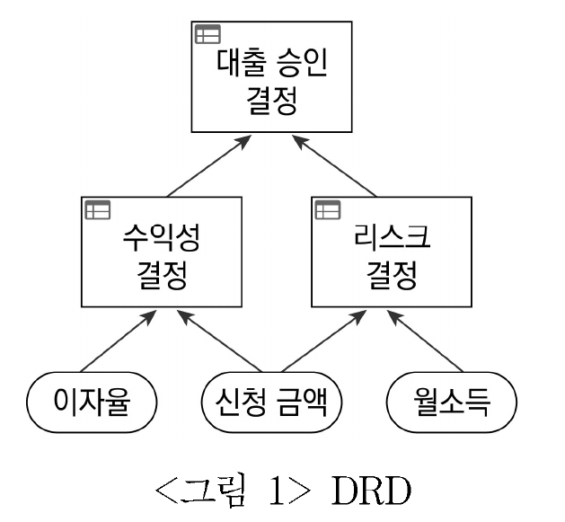
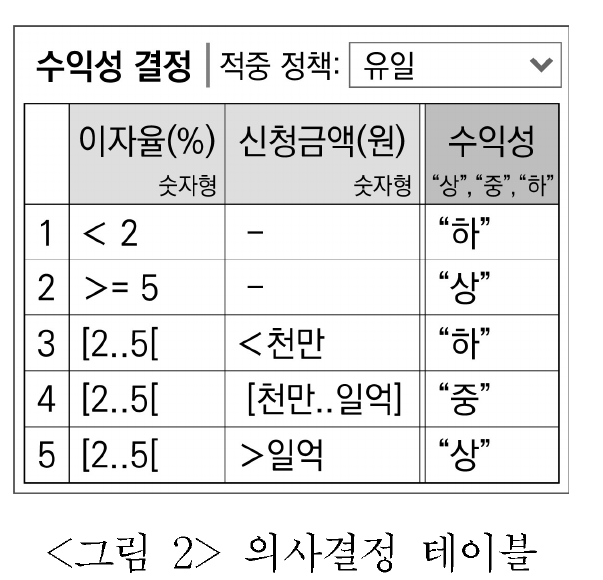
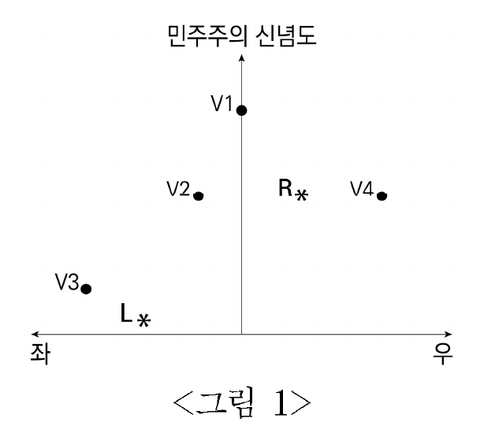
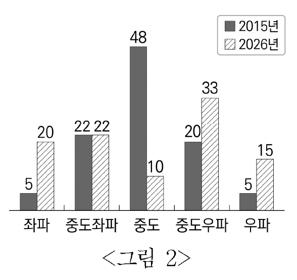
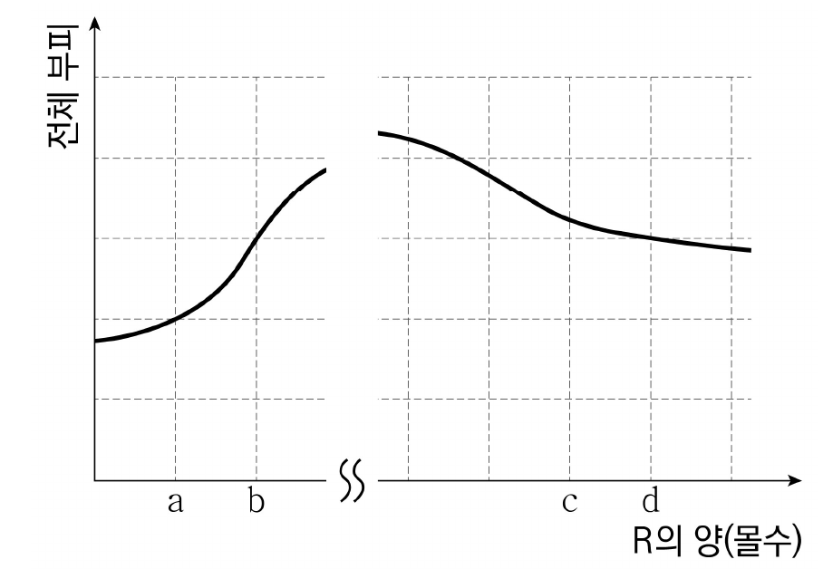

# [01-03] LU (2026)

다음 글을 읽고 물음에 답하시오.

## 제시문

법학 전통에서 대체로 자연은 인간에게 유용한 것들의 총체이자 집단 혹은 개인의 자산으로 간주된다. 소유 대상으로서의 자연은 그것을 둘러싼 인간 상호 간의 권리의무관계를 위해 존재한다. 생태사상가 베리는 인간이 세계 전체 혹은 타자와 맺는 관계 양식이 인간중심의 법규범에 반영되어온 동시에 그러한 법규범에 의해 강화되어 왔음을 지적한다. 법적 인격만을 권리와 의무의 주체로 보고 인격 아닌 모든 존재자는 행위의 객체인 물건으로 보는 법은 자연의 가치를 인간의 손익과 관련지어 평가할 뿐 존중하진 않았다. 최장 시간에 걸쳐 최대 다수에게 이익을 가져다 주는 방식으로 자연자원을 향유하기 위해 보호해야 한다는 보전주의적 관점 역시 근본적으로 인간을 중심에 둔다. 베리가 주창한 지구법학은 생태계를 구성하는 모든 존재의 권리를 지구권으로 정립하려 한 급진적인 법사상이다.

비인간 존재자에게 권리를 인정할 수 있는가에 관해서는 그간 다양한 논의가 진행되어 왔다. 가령 레건은 살아있음을 넘어 스스로가 삶의 주체임을 경험할 수 있는 존재는 상대적으로 더 월등한 존재의 이익을 위해 자신의 이익을 희생당하지 않아야 한다는 논거로써 동물의 권리를 옹호한다. 모든 생명체는 자신의 선을 가지며 그 고유한 가치의 잠재성이 실현되어야 한다고 본 테일러는 식물을 포함한 생명체까지를 권리의 주체로 이해한다. 더 나아가 지구법학은 우주의 질서 안에 무언가가 존재한다는 사실 자체에서 그것이 권리를 가진다는 규범적 결론을 끌어낸다. 이에 따르면 물리적으로 지속되는 실체를 갖거나 일정한 지리적 영역을 점하는 존재자인 무생물의 권리도 인정된다. 지구법학의 지향을 ‘야생의 법’이라 표현한 컬리넌은 다양한 창조물들의 생존과 안녕은 인간이 아니라 지구 행성으로부터 주어지는 것임을 강조하며 권리 주체에 대한 과감한 인식 전환을 촉구한다. 인류는 그간 법에서 억눌러 왔던 감성과 감각을 되살려 지구공동체의 춤에 참여하고, 그 박자에 스스로 몸짓을 맞추어야 한다는 것이다. 지구권은 존재할 권리, 서식지에 관한 권리, 지구공동체가 부단히 새로워지는 과정에서 자기 역할과 기능을 수행할 권리 등으로 구체화된다. 강은 강의 권리를, 새는 새의 권리를, 인간은 인간의 권리를 가지며, 각 권리의 존재 양태는 저마다 다르다.

이러한 권리 개념을 수용하여 구체적인 법의 근거로 채택한 ㉠ 사례도 없진 않다. 전문에서부터 ‘우리가 그 일부이자 우리의 생존에 필수적인 어머니 지구’와의 조화를 언급한 에콰도르 헌법이 그 예이다. 헌법에 환경권을 명시한 국가들 대부분이 국민의 더 나은 삶과 인류의 지속가능성만 환경을 보전․관리할 목적이라 본 데 반해, 에콰도르는 ‘생명의 순환과 진화 과정을 유지하고 재생을 존중받을 권리’와 ‘자연이 스스로를 원상회복할 권리’를 헌법에 규정한다. 또한, 누구든 청원권을 행사하여 자연의 권리를 집행할 수 있음을 명시한다. 볼리비아는 <어머니 지구의 권리에 관한 법>에서 자연의 고유한 권리를 인정하고 생태계가 본성 그대로 유지․회복하는 과정을 도울 국민의 의무를 규정한다. 한편 뉴질랜드는 전체로서의 자연의 권리를 보호하는 방식 대신 특정 생태계나 종의 권리를 개별적으로 보호하는 방식을 택한다. ‘내가 강이고 강이 나다.’라는 마오리족의 믿음을 존중하여 황거누이강을 법적 인격체로 규정하고, 그 권리는 법이 정한 후견인이 강의 이름으로 강을 대리하여 집행할 것을 명시한 <테 아와 투푸아법>이 그 예이다. 흐르던 물길이 가로막힌 강이나 서식지를 침범당한 새의 권리는 사회적 관심을 환기하려는 환경운동의 기획을 넘어 구체적인 법리 구성 단계에서도 다루어지게 되었다.

## 01

윗글의 내용과 일치하는 것은?

### 선택지

(1) 인간중심적 법규범은 자연의 권리 근거를 ‘존재함’ 자체에서 구한다.

(2) 지구법학은 모든 개체의 권리가 동일한 존재 양태를 가진다고 이해한다.

(3) 보전주의적 관점에는 법적 권리 주체에 대한 근본적인 인식 전환이 전제되어 있다.

(4) 지구권을 인정하는 입장에서는 지리적 영역을 점한다는 사실에서 권리 주체성을 도출한다.

(5) 컬리넌은 인간과 비인간 존재의 감응 능력을 중시하는 기존 법학을 지구법학과 조율하려고 했다.

## 02

㉠에 대한 설명으로 적절하지 <u>않은</u> 것은?

### 선택지

(1) 에콰도르는 자연의 권리를 포괄적으로 규정하는 데 비해 뉴질랜드는 사안별로 규정한다.

(2) <어머니 지구의 권리에 관한 법>과 달리, <테 아와 투푸아법>은 자연의 권리 주체성을 인정한다.

(3) 에콰도르와 볼리비아 모두 지구공동체의 유지 및 재생을 도울 인간의 역할에 관해 법에 명시한다.

(4) 에콰도르 헌법에서는 누구나 자연을 법적으로 대변할 수 있지만, <테 아와 투푸아법>에서는 특정인만이 특정 생태계를 법적으로 대변할 수 있다.

(5) 에콰도르 헌법과 <어머니 지구의 권리에 관한 법>은 모두 침해된 자연에서 살아가는 인간의 권리와 별도로 자연도 회복할 권리를 갖는다고 본다.

## 03

윗글을 바탕으로 <보기>의 판결을 이해할 때, 적절하지 <u>않은</u> 것은?

### 보기

[A] 도로 확장공사 중 다량의 흙과 돌이 강에 매립되어 강폭이 좁아지고 강물이 범람하자, 마을 주민은 훼손된 강을 대리하여 소를 제기했다. 법원은 강의 권리주체성을 부정하여 청구를 각하했다.

[B] 수로 공사 중 지역 원주민들에게 문화적으로 특별한 상징성을 지닌 야생 벼 서식지가 수몰되자, 원주민 대표는 벼를 대리하여 소를 제기했다. 법원은 공사의 중단을 명령했다.

[C] 동물권리보호협회는 동물원 실태 조사 후, 오랑우탄이 자기 본성에 맞는 장소에서 살 권리를 가짐을 주장하며 갇힌 오랑우탄을 대리하여 소를 제기했다. 법원은 적절한 거주 조건을 제공할 것을 명령했다.

### 선택지

(1) [A]에 대해 레건은 동의하고 컬리넌은 동의하지 않겠군.

(2) [B]에 대해 베리는 동의하고 레건은 동의하지 않겠군.

(3) [C]에 대해 베리는 동의하고 테일러는 동의하지 않겠군.

(4) [A]와 [B] 모두에 대해 테일러는 동의하겠군.

(5) [B]와 [C] 모두에 대해 컬리넌은 동의하겠군.

# [04-06] LU (2026)

다음 글을 읽고 물음에 답하시오.

## 제시문

업무 프로세스를 시각적으로 표현하는 모델링 언어 표준인 BPMN을 제정한 표준화 단체에서, 의사결정을 명시적으로 모델링하는 표준인 DMN을 발표하였다. BPMN으로 전체 업무 처리 과정을 모델링하고, DMN으로는 의사결정과 관련한 사항을 모델링할 수 있다. BPMN으로 복잡한 의사결정을 관리하는 데 한계가 있어, 별도 표준인 DMN을 개발하였다. BPMN 모델의 비즈니스 규칙 태스크에서 DMN 모델의 의사결정 테이블을 호출하는 방식으로 두 표준이 연동되어 활용된다. 그런데 전략적 의사결정은 의사결정 규칙이 불명확하고, 다양한 분석이 요구되므로 모델링하여 자동화하기는 매우 어렵다. 예를 들어 조직의 성패를 결정할 신제품 개발이나 기업의 인수합병과 같이 불확실성이 크고 위험을 수반하는 의사결정에 DMN을 적용하는 것은 부적절하다. DMN은 은행의 대출 승인 결정이나 보험회사의 보상금 결정과 같이 정해진 절차와 규칙에 따라 수행되는 일상적인 운영 의사결정을 자동화하는 데 효과적이다.

기존에는 개발자가 의사결정과 관련한 로직을 프로그래밍 언어로 코딩하여 애플리케이션으로 구현하였다. 이 방식에서는 애플리케이션 코드에 의사결정 로직을 구성하는 여러 규칙이 혼재해 의사결정 로직의 가시성이 낮으며, 로직이 복잡할수록 구현의 난도가 높아진다. 또한 경영 환경이 변하면 의사결정 로직도 신속하게 변경해야 하지만, 개발자가 코드를 수정해야 하므로 즉각적인 반영이 어렵다. 이 문제는 DMN을 사용하면 그래픽 다이어그램과 테이블 형태로 의사결정을 명시적으로 모델링하여 해결할 수 있다. 이처럼 의사결정 로직을 애플리케이션에서 분리하여 모델링하면, 개발자에게 의존하지 않고 업무 담당자가 자신이 주관하는 업무 규칙을 빠르고 유연하게 변경할 수 있다.

㉠ DMN 모델링을 통해서는 의사결정 요구 다이어그램(DRD)과 의사결정 로직을 작성한다. DRD는 의사결정 모델링의 시작점으로 불리는데, <그림 1>과 같이 맨 하위에 ▭로 표시된 입력 데이터와 그 상위에 □로 표시된 의사결정 노드 간 연결선으로 의사결정의 전체 구조를 표현한다. 입력 데이터는 의사결정 노드의 입력으로 제공되며, 하위 의사결정 노드의 결과로 생성된 데이터는 상위 노드의 입력으로 전달된다. 각 노드의 의사결정 로직은 의사결정 테이블로 세부 규칙을 작성하는데, 이를 위해 간단하고 직관적인 문법을 제공하여 업무 담당자와 개발자가 모두 쉽게 활용할 수 있는 언어인 FEEL을 사용한다. 의사결정 테이블에서는 각 규칙을 행으로 나열하고 규칙의 조건과 결과를 구분하여 열로 정의한다. 규칙의 조건 열에는 의사결정의 입력을 표기하며, 조건 열이 여럿인 경우 각 조건을 AND로 해서 논릿값을 계산한다. 각 규칙은 자신의 조건이 참일 경우 테이블에 규정된 출력을 결과 열에 산출한다.

<그림 2>의 의사결정 테이블은 이자율과 신청 금액에 따라 수익성을 결정하는 의사결정 로직을 보여 준다. 입력 셀에는 FEEL로 조건식을 기술하는데, 문자열 값의 단순 비교부터 숫자의 크기 비교, 숫자 구간 등의 다양한 조건식이 사용된다. 이 예에서는 이자율과 신청 금액이라는 숫자형 변수가 조건 열에 사용되는데, ‘<’와 ‘>=’는 값의 크기를 비교하는 연산자이며, ‘[p..q]’는 경곗값을 포함하는 숫자 구간을 나타낸다. 예를 들어 [2..5]는 2 이상 5 이하, ]2..5[는 2 초과 5 미만의 구간을 의미한다. 입력 셀에 ‘-’라고 표기된 경우 해당 조건은 항상 참으로 간주한다. 의사결정 테이블의 상단에는 여러 규칙이 동시에 만족될 때 이를 어떻게 처리할지를 설정하기 위한 적중 정책을 표기한다. 오버랩을 허용하지 않고 동시에 하나의 규칙만 만족되도록 규칙을 관리하는 방식인 ‘유일’ 정책이 기본값이다. 한 번에 여러 규칙이 적용 가능한 경우에는 처음으로 만족되는 규칙을 적용하는 ‘최초’ 정책과 규칙의 우선순위 값에 따라 적용 규칙을 선정하는 방식인 ‘우선순위’ 정책 등 상황에 따라 적절한 적중 정책을 지정한다.

<이미지 포함됨>

<이미지 포함됨>

## 04

윗글의 내용과 일치하는 것은?

### 선택지

(1) 전략적 의사결정은 경영 성과 창출에 미치는 영향이 크므로 확정된 규칙에 따라 수행해야 한다.

(2) DMN을 사용하여 의사결정 로직을 애플리케이션과 따로 모델링하면 규칙의 구현, 유지보수가 쉽다.

(3) 의사결정 테이블의 조건부에서 경곗값을 포함하지 않는 구간을 조건식으로 나타낼 수 없다.

(4) 운영 의사결정을 자동화하려면 의사결정 테이블에 BPMN 비즈니스 규칙 태스크를 포함하여 조건식을 작성해야 한다.

(5) 의사결정 로직이 단순한 경우 규칙의 변경이 요구될 때 업무 담당자가 FEEL로 애플리케이션 코드를 쉽게 수정할 수 있다.

## 05

㉠에 대해 추론한 것으로 적절한 것은?

### 선택지

(1) 같은 입력값으로 여러 규칙이 동시에 만족될 수 있는 경우 적중 정책을 기본값으로 설정할 수 없다.

(2) 의사결정 테이블의 입력이 여러 개일 경우, 어떤 규칙의 조건식 중 어느 하나가 참이면 그 규칙은 만족된다.

(3) 어떤 의사결정 로직의 입력으로 사용되는 데이터는 다른 의사결정 로직의 입력으로 활용될 수 없다.

(4) 최상위의 의사결정 노드에 직접 연결되지 않은 최하위의 입력 데이터는 최상위의 의사결정에 영향을 미치지 않는다.

(5) 의사결정 노드가 여러 계층으로 구성될 경우, 상위 의사결정 노드의 출력을 하위 의사결정 노드에서 사용할 수 있다.

## 06

<보기>의 사례에서 DMN을 활용할 때 적절하지 <u>않은</u> 것은?

### 보기

P사는 자동차 보험료 산정을 위한 위험도 결정 업무를 자동화하기 위해 다음의 세 단계로 의사결정 모델링을 수행한다.

단계 1: DRD 작성

Ⓐ 입력 데이터로 운전 경력, 자동차 가격, 자동차 출력(HP)을 제공함.
Ⓑ 자동차 가격과 출력을 기준으로 자동차 유형을 결정함.
Ⓒ 운전 경력과 자동차 유형을 기준으로 위험도를 결정함.

단계 2: 자동차 유형 의사결정 로직 정의

Ⓐ 2억 원 초과의 자동차는 럭셔리카로 분류함.
Ⓑ 5백만 원 미만의 자동차는 스크랩카로 분류함.
Ⓒ 5백만 원 이상 2억 원 이하면 자동차 출력을 기준으로 분류함.
∙120 HP 초과: 스포츠카
∙120 HP 이하: 패밀리카

단계 3: 위험도 의사결정 로직 정의

Ⓐ 3년 이하의 운전 경력이거나 럭셔리카: 위험도 5
Ⓑ 패밀리카이고, 3년 초과의 운전 경력: 위험도 2
Ⓒ 스포츠카이면 운전 경력에 따라 다음과 같이 결정함.
∙5년 초과: 위험도 2
∙3년 초과 5년 이하: 위험도 3
Ⓓ 스크랩카: 운전 경력과 무관하게 위험도 1

### 선택지

(1) 단계 1에서 작성한 DRD에 포함된 2개의 의사결정 노드는 단계 2와 단계 3을 통해 구체화된다.

(2) 단계 2와 단계 3에서 작성하는 각 의사결정 테이블은 입력으로 2개의 열을, 결과로 1개의 열을 포함한다.

(3) 단계 2의 결과가 스포츠카로 결정되는 경우 단계 3의 Ⓒ가 요구하는 규칙을 작성하려면, 의사결정 테이블에 2개의 행이 요구된다.

(4) 단계 2의 Ⓒ가 요구하는 자동차 출력 조건식과 단계 3의 Ⓑ가 요구하는 운전 경력 조건식에서 모두 숫자 구간이 사용된다.

(5) 적중 정책이 ‘유일’일 때 단계 3에서 Ⓓ를 고려하여 Ⓐ가 요구하는 규칙을 완성하려면, 운전 경력 조건식과 자동차 유형 조건식이 포함된 규칙을 작성해야 한다.

# [07-09] LU (2026)

다음 글을 읽고 물음에 답하시오.

## 제시문

선출된 정치인이 합법적으로 민주적 가치를 잠식하는 민주주의 퇴행도 급격하고 폭력적인 방식의 쿠데타 못지않게 심각한 민주주의의 위기이다. 집권자는 ‘조작’을 감행할 능력을 갖추고 있다. 여기서 조작이란 명백한 위법행위가 아니라, 선거권이나 피선거권 규정의 개정이나 미디어 규제를 통한 여론 개입, 국가기구에 대한 당파적 영향력 증대 등과 같이 불법성이 명확하지 않지만 정치 과정을 불공정하게 만들어 집권 가능성을 높이려는 행위들을 일컫는다. 집권자의 조작과 유권자의 대응이 결합하여 민주주의가 퇴행하는 것을 설명하는 두 가지 모델을 살펴보자.

우선, ㉠ 스볼릭 모델에서 유권자는 후보자의 정책이념과 자신의 정책이념 사이의 거리와 반비례하는 효용의 크기에 따라 지지 후보를 선택하는데, 후보자 가운데 집권자를 판단할 때는 그가 행한 조작의 정도에 비례하여 생기는 효용의 감소를 계산에 넣는다. 다시 말해 유권자는 민주주의 가치에 대해서도 내재적으로 선호한다고 가정된다.

예를 들어, 어떤 나라에서 우파 집권자가 조작을 행한 경우, 온건 우파 유권자는 민주주의 훼손에서 생기는 효용의 감소가 좌파 도전자의 집권으로 생기는 이념 관련 효용의 감소보다 커서 집권자를 지지하지 않을 가능성이 크다. 반면 극단적인 우파 유권자는 좌파 도전자의 집권이라는 최악의 상황을 피하려고 민주주의 훼손을 감수하고라도 집권자에게 투표할 가능성이 훨씬 크다. 한편 자신의 재집권을 위해 조작을 행한 집권자는 조작으로 득표가 늘어나는 대신 조작에 따른 민주주의 훼손으로 인해 득표가 감소하는 상황에 직면한다. 이때 득표 감소는 주로 중도 혹은 중도우파 유권자 집단에서 발생한다. 결국 집권자는 득실을 비교하여 선거에서 가장 많이 득표할 수준에서 조작의 정도를 결정하게 된다.

한편, ㉡ 루오와 쉐보르스키 모델에서 유권자들은 후보자의 정책이나 능력 등을 보고 주관적으로 평가한 ‘매력’에 기초해서 투표한다. 이처럼 시민들이 민주주의 자체에 내재적인 가치를 부여하지 않는 경우라도, 더 매력적인 정치인들에게 통치받고 싶어 할 것이므로 시민들은 누구에게 통치받을지를 자신들이 결정할 수 있는 능력을 중시한다. 이는 그 사회의 민주주의 역량에 가치를 부여한다는 것이다. 선거에 당면하여 유권자들은 현재 선택되는 후보자의 매력, 즉 선거로 들어설 정부의 질로부터 얻는 효용과 미래의 민주주의 역량, 즉 시민들이 미래에 더 나은 도전자가 등장할 때 언제든지 선거로 집권당을 교체할 수 있는 능력으로부터 얻는 효용 사이의 트레이드오프에 직면한다.

더욱 매력적인 도전자가 등장하면 시민들은 집권자의 교체를 원할 것이기 때문에 권위주의 성향의 지도자들은 집권기에 조작을 택하고, 그 결과 시민들의 반대에도 불구하고 권력을 유지할 가능성, 즉 집권자 프리미엄이 커지게 된다. 프리미엄이 0인 상태에서 시작하여 지도자와 유권자 사이에 게임이 반복되는 상황을 상정한 이 모델에 따르면, 잠재적 도전자가 가질 매력의 기댓값에 비해 집권자의 매력이 매우 높거나 매우 낮은 경우에 민주주의가 위협받게 된다. 집권자의 매력이 높아서 시민들이 집권자에 매우 만족하고 도전자가 더 매력적일 가능성이 작을 때, 집권자는 조작에 거리낌을 갖지 않는데 이를 ‘지지 속의 퇴행’이라 한다. 반면 집권자의 매력이 낮은 경우에는 집권자가 운 좋게 몇 차례 선거에 승리해서 집권자 프리미엄이 일정 수준을 넘어서면 집권의 장기화를 우려하는 시민들은 설사 당면 선거에서 도전자의 매력이 더 낮더라도 정권교체를 원하게 된다. 이를 예상하는 집권자가 프리미엄을 더욱 높이고자 가능한 모든 조작을 취하는 것을 ‘반대 속의 퇴행’이라 한다. 두 가지 퇴행에서 모두 쿠데타나 민중봉기와 같은 수단에 의해 교체될 위험을 감수할 정도까지 권위주의 성향의 집권자는 퇴행으로 치닫는다.

## 07

윗글의 내용과 일치하는 것은?

### 선택지

(1) 민주주의 퇴행을 설명하는 모델들에서는 유권자들이 민주주의 자체에 내재적 가치를 부여한다.

(2) 유권자와 집권자는 모두 선거에서 전략적 선택이 필요한 상황에 직면할 수 있다.

(3) 중도 성향의 유권자는 자신의 정책이념을 투표 선택에 반영하지 않는다.

(4) ‘지지 속의 퇴행’은 집권 정부의 매력이 매우 낮을 때 일어난다.

(5) ‘집권자 프리미엄’은 게임이 반복됨에 따라 0에 수렴한다.

## 08

윗글에서 추론한 내용으로 가장 적절한 것은?

### 선택지

(1) ㉠과 ㉡에서 모두 미래에 등장할 잠재적 도전자의 집권 가능성은 유권자가 고려할 대상에서 제외된다.

(2) ㉠에서는 집권자와 도전자의 이념성향이 비슷할 때, ㉡에서는 집권자와 도전자의 매력도가 비슷할 때 민주주의의 퇴행이 심해질 가능성이 높다.

(3) ㉠에서 유권자는 정책이념과 민주주의 가치 사이의 트레이드오프에, ㉡에서 유권자는 새 정부의 매력과 미래 민주주의 역량 사이의 트레이드오프에 직면할 수 있다.

(4) 집권자가 조작의 정도를 결정할 때, ㉠에서는 조작에 따라 기대되는 득표와 감표의 차이를, ㉡에서는 기존에 축적된 프리미엄과 앞으로 형성될 프리미엄 간의 차이를 따질 것이다.

(5) ㉠에서는 후보자와의 이념적 친밀도 때문에, ㉡에서는 도전자의 높은 매력도 때문에, 시민이 조작을 용인한 결과로 권력 교체가 불가능해져 민주주의 퇴행이 나타날 수 있다.

## 09

㉠의 관점에서 <보기>를 평가한 것으로 적절하지 <u>않은</u> 것은?

### 보기

2026년 선거를 앞둔 X국에서 좌파 성향의 집권당 L 후보는 최근 관권선거를 주도했다는 비판을 받고 있다. 온건 우파 성향의 도전자 R 후보는 비교적 민주적 절차를 중시하는 것으로 평가받고 있다. <그림 1>은 유권자 V1∼V4 관점에서 인식된 자신들과 후보자들의 정책이념 및 민주주의 신념도의 위치를 나타낸다. 세로축은 민주주의 가치에 대한 신념의 정도를, 가로축은 이념성향의 정도를 나타낸다. <그림 2>는 X국 유권자들의 이념성향 분포(%)의 변화를 나타낸다.

<이미지 포함됨>

<이미지 포함됨>

### 선택지

(1) <그림 1>에서, V2가 R 후보를 지지할 가능성은 V3가 R 후보를 지지할 가능성보다 클 것이다.

(2) <그림 1>의 V4는 정책 효용과 민주주의 효용을 동시에 고려하여 L 후보의 재집권을 허용하려 하지 않을 것이다.

(3) <그림 2>에서 동일한 수준의 조작 때문에 생기는 집권자의 손실은 2015년의 경우보다 2026년의 경우가 작을 것이다.

(4) <그림 1>의 L 후보가 <그림 2>의 2026년 선거에서 승리하면, 이는 민주주의의 훼손 정도를 감내하더라도 정책 관련 효용의 증가가 크다고 여긴 유권자가 감소한 결과일 것이다.

(5) <그림 2>에서, <그림 1>의 V1에 해당하는 유권자의 비율 변화는 L 후보가 조작하는 정도를 높이려는 요인이 될 것이다.

# [10-12] LU (2026)

다음 글을 읽고 물음에 답하시오.

## 제시문

1518년 6월 중종은 “내가 정사를 돌보면서부터 태평한 통치를 바라여 널리 인재를 구한 지 열 해 남짓이나 효과 없이 한탄만 할 뿐이니, 많은 현능한 이들이 추천되어 어진 교화를 도울 수 있도록 할 방법을 의논하라.” 하고 명하였다. 조선은 시험으로 재목을 선발하여 관리로 등용하는 과거제도를 고려로부터 이어 받아 운영하고 있었다. 유학적 소양을 선발 기준으로 하는 과거는 성리학을 표방한 국가에 매우 적합한 제도였다. 학업을 바탕으로 한 등용 방식은 학문 발전과 사회 교육에도 이바지하였다. 하지만 시험만을 위한 경전 암기와 모범 답안 위주의 학습이 진정한 학문은 아니라는 비판이 일었다. 그런 공부로는 또 다른 소양이라 할 품행과 덕성을 키우지 못한다고도 하였다. 중종의 하교는 이러한 인식과도 맥이 닿아 있다.

조광조가 주도하는 사림 세력은 기존의 과거가 글재주만 시험할 뿐 관료로서의 재능이나 인품, 행실 등은 보지 못한다고 하면서, 진정한 교화를 실현하기 위한 보완으로서 과거제도에 천거제인 현량과를 도입하기를 청하였다. 덧붙여 현행 제도는 권세가의 자녀가 합격하기에 유리하여 초야에 숨은 인재들을 발굴하는 데 한계가 있다는 지적도 하였다. 과거제도는 실력 위주의 인재 등용 방식이었고, 노비가 아니라면 백성은 누구든지 응시할 수 있는, 형식적으로는 평등하고 공정한 시험이었다. 그러나 현실적으로 과거 응시를 위한 학업에 경제적 뒷받침은 필수적이었다. 또한, 과거의 최종 합격은 벼슬할 자격만 주어지는 것이라서, 급제한 뒤에 실직을 받아 관료로 성장하려면 어느 정도의 후원과 인맥이 필요했다. 시간이 지나면서 과거시험은 지배계층의 지위를 유지하는 기능도 갖게 된 것이다.

과거는 매우 힘든 시험이기도 했다. 그 꽃이라 할 수 있는 문과는 경전의 암기와 해석뿐 아니라 작문과 논술의 능력까지 평가한다는 점에서도 어렵지만, 시험 과정도 굽이굽이 고갯길이다. 우선 경전 이해 중심의 생원시와 글 짓는 능력을 보는 진사시도 초시와 복시를 거쳐야 한다. 원칙적으로 생원이나 진사라야 문과에 응시할 수 있다. 문과에서도 경전, 작문, 논술로 초시 3단계, 복시 3단계를 거쳐 최종 33명이 뽑힌다. 이들이 다시 치르는 전시는 품계를 내리기 위해 등수를 정하는 논술 필기고사로서 임금이 주관한다. 성적에 따라 정7품, 정8품, 정9품을 받고, 장원은 종6품이다. 이렇게 열리는 출세의 길 때문에, 소수의 정원만 뽑히는 험난한 시험에 지원자가 구름처럼 몰려 경쟁이 치열했다. 등급 때문에 다시 과거를 보기도 했다. 그런데 현량과는 덕망과 행실로 각처에서 천거된 이들로 한 번의 논술 시험을 치러 합격자를 선발하는 방식인 것이다. 게다가 급제자들에게는 일반 과거보다도 높은 품계를 주려 하였다.

이런 천거제에 대하여 훈구 세력의 반발은 컸다. 시험 없이 쉽게 관리가 되는 것은 공정성의 원칙을 무너뜨리는 것이고, 추천으로 선발하는 것이 오히려 부당한 특혜로 작용한다는 비판을 제기하였다. 우여곡절 끝에 1519년 현량과가 시행되었다. 천거된 이들을 선별하여 근정전에서 논술로 시험하였고, 12명의 관직 보유자가 포함된 28명의 문과 합격자가 나왔다. 다수가 서울 지역 거주자였다. 장원은 조광조와 친분이 두터운 김식이었고, 사림파의 후원자로 알려진 안당은 세 아들이 모두 합격하였다. 자파 세력 키우기라는 정적들의 비난은 피할 수 없었다. 그리하여 훈구파를 견제하는 데 사림을 이용하려 했던 중종도 지나친 당파 형성이라는 의심을 하게 되었다. 현량과는 결국 기묘사화의 주요한 계기와 명분으로도 작용하였고, 사화 직후 현량과의 문과 합격은 취소되었다. 이후 현량과는 다시 시행되지 않았으며 과거제도 자체는 조선 말기까지 유지되다가 1894년 갑오개혁으로 폐지되었다.

## 10

윗글에 대한 이해로 가장 적절한 것은?

### 선택지

(1) 현량과는 성리학적 소양을 갖춘 인재를 등용하여 통치를 돕는다는 과거제의 목적을 표방하였다.

(2) 어렵게 성사된 현량과의 실시로 초야에 묻힌 지방 선비들이 대거 품계를 받아 관직에 진출하게 되었다.

(3) 생원과 진사는 관직을 받을 자격만 주어지는 것이어서 실제로 벼슬을 하려면 문과의 초시와 복시를 거쳐야 했다.

(4) 과거는 논리적으로 서술하는 시험이 아니라 암기 위주의 평가로 되어 있어 덕성을 평가하지 못하는 한계가 있었다.

(5) 조선에 사는 이라면 누구든지 과거에 응시할 수 있었지만 실제로 일반인이 합격하여 고위관료로 성장하기는 쉽지 않았다.

## 11

윗글에서 추론한 내용으로 적절하지 <u>않은</u> 것은?

### 선택지

(1) 과거를 치른 경험이 있는 관료가 다시 과거에 응시하여 더 높은 품계를 받을 수 있었다.

(2) 양반 지배층은 정보와 인맥, 재력을 활용하여 과거를 통한 출세 기회를 높일 수 있었다.

(3) 현량과의 시험은 품계를 받을 총원을 정했다는 점에서 전시를 치른 것과 마찬가지였다.

(4) 추천제 관료 선발의 도입은 사림 세력을 일거에 등용하려 한 의도였다고 비판을 받았다.

(5) 훈구파는 관리 등용이 편파적일 가능성을 우려하면서 실력 위주의 과거제를 옹호하였다.

## 12

윗글을 바탕으로 <보기>의 상황을 이해할 때 가장 적절한 것은?

### 보기

중 종 : 선왕의 등용 제도는 항구적이나 별도로 시험하는 법도 있는 것이니 방안을 제시할 것이며, 추천에서는 명과 실이 어긋날 염려가 있음을 명심하라.

조광조 : 재주만으로 선발하면 그 행실을 알 수 없는 폐단이 있으므로, 덕행까지 감안하여 뽑는 천거제가 이상적입니다.

정광필 : 재주와 행실을 모두 갖추지 못하는 문제가 천거에서는 생기지 않겠습니까? 선왕대부터 내려오는 아름다운 법제를 경솔히 고칠 수는 없습니다.

남 곤 : 현행 과거는 이미 현량과를 시행한 한나라에서의 실패를 거친 끝에 정착한 제도입니다. 잘못된 천거라 하여 천거자를 처벌하기도 어렵습니다.

김 정 : 사소한 폐단에 얽매여 나아가지 않는다면 진정한 교화는 언제 이룰 수 있겠습니까?

조광조 : 재주 있는 이도 여전히 뽑힐 수 있으므로 천거제 시행에는 문제가 없습니다.

### 선택지

(1) 중종은 추천제 방식의 도입을 지시하면서도 천거로 말미암을 폐단에 대한 인식과 경계를 드러낸다.

(2) 조광조는 정광필, 남곤, 김정의 반대에도 현량과의 도입을 관철하고자 고군분투한다.

(3) 정광필은 관리 선발의 시험제도를 천거제로 대체하려는 조광조의 주장에 대해 어느 것이나 폐단이 있기는 매한가지라는 입장이다.

(4) 남곤은 현량과 시행에는 찬성하지만 역사적 경험을 고려한 개선이 필요하다는 의견을 제시한다.

(5) 김정은 경전의 학습에만 치우치는 폐단에 크게 구애받지 말라고 주문한다.

# [13-15] LU (2026)

다음 글을 읽고 물음에 답하시오.

## 제시문

해가 서쪽에서 뜬다고 믿고 싶다고 맘대로 그렇게 믿을 수 있을까? 그렇게 상상하거나 또는 그렇게 믿는 듯이 행동하는 것은 원하기만 하면 할 수 있다. 하지만 무엇을 믿는다는 것은 그것이 참이라고 믿는 것인데, 원한다고 해서 “해는 서쪽에서 뜬다.”라는 명제가 참이라고 실제로 믿을 수 있을까? 최소한 어떤 믿음은 인간이 수의적으로 즉, 자기 뜻대로 즉각적으로 믿을 수 있다는 입장을 ㉠ 인식적 수의주의라 하고 그런 믿음은 없다는 입장을 ㉡ 인식적 불수의주의라 한다.

수의주의가 옳으냐는 질문은 우리가 자신의 믿음에 대해 의무나 책임을 질 수 있느냐는 질문과 연관된다. 사람들은 종종 판단이나 믿음을 평가하고 심지어 비난하기도 한다. “너는 그렇게 쉽게 결론을 내리지 말아야 해.”, “그런 인종차별적 믿음은 버려야 해.” 등이 그 예이다. 그런데 “당위는 능력을 함축한다.”라는 칸트의 원칙에 따르면, 우리는 어떤 행위를 할지 안 할지 선택할 능력을 지닌 경우에만 그 행위에 대한 의무나 책임을 질 수 있다. 이 원칙을 믿음에 적용하면, 우리는 오직 자신의 믿음을 뜻대로 선택할 능력이 있는 경우에만 믿음에 대한 의무나 책임을 질 수 있다. 따라서 불수의주의가 옳다면 우리는 각자가 가진 믿음에 대해 의무나 책임을 질 수 없다.

수의주의에 반대하는 다양한 논변이 있다. 올스턴은 인간 심리에 근거해 수의주의에 반대한다. 그는 “해는 서쪽에서 뜬다.”처럼 거짓임이 분명한 명제의 경우에는 누구도 수의적으로 믿을 수 없다는 것이 명백한 경험적 사실이라고 주장한다. 그리고 명제 p를 지지하는 증거와 반대하는 증거가 증거력이 비슷해서 참․거짓 여부가 분명하지 않은 경우에도 올스턴은 p를 수의적으로 믿을 수 없다고 주장한다. 그 상황에서 p를 정말로 믿게 되었다면, 이는 그 순간 p가 조금이나마 더 그럴듯해 보였기 때문에 믿음이 생겨난 것이다. 그렇지 않고 양쪽 증거력이 정확히 같은 경우 어떤 사람이 한쪽을 믿기로 결심했다고 주장한다면 그는 그 명제를 진정으로 믿게 된 것이라기보다 그저 그 명제가 참이라고 가정하고 행위의 근거로 사용하기로 한 것이다. 우리가 장기적인 행위나 습관 형성을 통해 자신의 믿음에 간접적 영향을 줄 수는 있지만, 올스턴에 따르면 이는 수의적으로 믿음을 변경한 것이 아니다.

믿음의 개념 분석에 기반한 불수의주의도 있다. 윌리엄스에 따르면, 명제 p를 수의적으로 믿는다는 것은 p가 참인지와 무관하게 p를 믿을 능력을 필요로 한다. 그리고 누가 이 능력을 사용했다면 그는 스스로가 이 능력을 지닌다는 것을 알 수밖에 없다. 그런데 우리는 스스로가 지닌 어떤 믿음에 대해서도 그것이 참․거짓 여부와 무관하게 형성된 것이라고 생각할 수 없다. 믿음의 개념상 p를 믿는다는 것은 곧 p가 참이라고 믿는 것이기 때문이다. 따라서 우리 자신이 명제의 참․거짓 여부와 무관하게 명제를 믿을 능력이 있다고 우리가 알게 되는 경우는 있을 수 없고 결국 어떤 믿음을 수의적으로 가진다는 것은 불가능하다.

히로니미 역시 ‘수의성’과 ‘믿음’의 정의에 기반해 수의주의에 반대한다. 그의 정의에 따르면, 어떤 행위가 수의적이라는 것은 그것이 실천적인 이유에 따라 즉각 행해질 수 있다는 것이며, p라고 믿는다는 것은 “p가 참인가?”라는 의문을 해결함으로써 갖게 되는 태도라는 의미에서 참을 목표로 하는 태도이다. 또한 그는 믿음을 지지할 수 있는 이유를 내용 관련 이유와 태도 관련 이유로 구별한다. 전자는 믿음의 내용, 즉 “p가 참인가?”라는 질문에 대답하는 이유이며, 이는 곧 믿음이 참임을 보여주는 증거이다. 반면, 후자는 “p라는 믿음을 갖는 것이 좋은가?”라는 질문에 대답하는 이유이고 내용의 참․거짓을 보이는 것과 무관하다는 의미에서 외부적 이유이다. 가령 내일 비가 온다는 믿음의 경우, 일기예보에서 그렇게 예측했다는 사실은 전자이지만, 비가 온다고 믿으면 내 기분이 좋아질 것이라는 사실은 후자이다. 그런데 명제 p를 수의적으로 믿을 능력은 외부적 이유에 따라 p가 참임을 믿을 능력을 필요로 하고 이것은 “p가 참인가?”라는 질문에, 그 질문과 무관한 이유에 따라 답할 능력을 요구한다. 우리에게 이런 능력은 있을 수 없으므로 수의적 믿음은 불가능하다.

## 13

윗글의 내용과 일치하는 것은?

### 선택지

(1) 오래 걸리더라도 자기 뜻대로 변화시킨 믿음은 수의적이다.

(2) 원하는 대로 상상하는 것보다 원하는 대로 믿는 것이 어렵다.

(3) 믿음이 평가의 대상이 될 수 있다는 데에는 학문적 다툼이 없다.

(4) 모든 불수의주의자는 심리적 근거에 기반해 수의주의에 반대한다.

(5) 칸트에 따르면 날지 못한다는 이유로 어떤 인간을 비난할 수 있다.

## 14

㉠과 ㉡에 대한 이해로 적절하지 <u>않은</u> 것은?

### 선택지

(1) ㉠은 “당위는 능력을 함축한다.”라는 원칙을 믿음에도 적용한다.

(2) ㉡에 따르면, 해가 서쪽에서 뜬다고 뜻대로 믿을 수 있다고 말하는 사람은 수의적으로 그 믿음을 형성한 것이 아니다.

(3) ㉠은 모든 믿음이 수의적이라고, ㉡은 모든 믿음이 불수의적이라고 주장한다.

(4) ㉠과 ㉡ 모두, 무엇인가를 믿는다는 것은 믿는 내용이 참이라고 생각함을 전제한다.

(5) ㉠은 ㉡에 비해, 사람들의 믿음을 비난하는 우리의 언어 관행에 대해 더 직관적인 설명을 제공한다.

## 15

윗글을 바탕으로 <보기>를 설명할 때 적절하지 <u>않은</u> 것은?

### 보기

갑은 시험을 앞두고 그간의 경험과 노력을 돌아보았다. 자신이 합격할 것이라고 믿을 근거와 불합격할 것이라고 믿을 근거는 대등해 보였다. 갑은 자신의 성격상 합격한다고 믿으면 덜 긴장해 실제로 합격할 것이라 생각했다. 갑은 Ⓐ 자신이 합격할 것이라는 믿음을 가지기로 했고 그 믿음에 따라 시험을 치렀다.

### 선택지

(1) 올스턴은, 만약 Ⓐ가 진정한 믿음으로서 형성되었다면 근거 간 증거력 차이가 조금이라도 있었기 때문이라고 판단할 것이다.

(2) 윌리엄스는, 만약 갑이 참․거짓과 무관하게 Ⓐ를 갖는다고 한다면 갑이 있을 수 없는 능력을 갖는 셈이라고 비판할 것이다.

(3) 히로니미는, 갑이 Ⓐ를 참으로 만들려고 한다는 점에서 갑의 믿음은 참을 목표로 하고 있다고 주장할 것이다.

(4) 히로니미는, Ⓐ를 가지면 실제로 좋은 결과가 있을 것이라는 갑의 생각은 믿음의 태도 관련 이유에 해당한다고 볼 것이다.

(5) 윌리엄스와 히로니미는, 갑이 설사 초인적인 존재라고 해도 Ⓐ를 수의적으로 형성한 것은 아니라고 생각할 것이다.

# [16-18] LU (2026)

다음 글을 읽고 물음에 답하시오.

## 제시문

2024년 노벨경제학상은 경제성장의 원인이 제도임을 밝힌 ㉠ 아제모을루와 두 동료에게 수여되었다. 성장의 원인을 제도에서 찾는 시도는 오랜 전통을 가진 것이다. 하지만 제도의 발전과 경제의 번영 사이에 높은 상관관계가 있음을 확인하는 것만으로는 제도가 성장의 원인이라는 주장을 지지하기 어렵다. 좋은 제도가 성장을 초래하기도 하지만 경제가 성장하여 제도가 개선되는 거꾸로 된 인과관계도 존재하기 때문이다. 아제모을루 등은 도구변수를 사용하여 제도와 성장 사이의 인과관계를 명확하게 하였다.

$x$가 $y$의 원인이라는 증거를 제시하기 위해 흔히 사용하는 통계적 방법은, 둘 사이에 선형관계가 있다고 보고 두 변수의 표본으로부터 추정한 기울기가 0이라는 가설을 기각하는 추론이 신뢰할 만하다는 것을 보이는 것이다. 그런데 $x$가 $y$에 영향을 주지만 $y$도 $x$에 영향을 미치거나, $x$와 $y$ 모두와 상관관계가 있는데 미처 고려하지 못한 제3의 요인이 존재하거나, 혹은 $x$의 관측값이 정확하게 측정되지 않은 값일 경우에는, 추정한 기울기가 $x$의 변화에 따른 $y$의 변화를 제대로 반영하지 못한다. 이런 경우에는 $x$와 상관관계가 크지만 $x$ 외에 $y$에 영향을 주는 다른 어떤 요인과도 상관관계가 없는 도구변수 $z$를 찾아서, $z$와 $x$의 표본으로부터 추정한 $x$값, 다시 말해 $z$로부터 예측한 $x$값인 $\hat{x}$를 구하고 이를 사용해 인과관계를 살펴보아야 한다. 다시 말해 거꾸로 된 인과관계나 제3의 요인의 영향, 측정오차 등에 영향을 받는, 표본에서 관측한 $x$값이 아니라 $x$와의 관계를 제외하면 $y$와 연관되지 않는 도구변수로부터 추정한 $\hat{x}$에 따른 $y$의 기울기를 추정하여 그것이 0이 아니라는 신뢰할 만한 추론을 할 수 있어야 한다.

아제모을루 등은 제도가 성장의 원인이라는 주장의 증거를 찾기 위해 근대 이후에 유럽의 식민지를 경험한 지역들에 주목했다. 식민지가 되기 전에 부유했던 지역은 오늘날 가난하고, 가난했던 지역은 오늘날 부유한 경향이 있음을 확인한 이들은, 이러한 번영의 역전이 제도적 역전의 결과라고 보았다. 유럽인들이 상대적으로 발전된 문명을 만난 지역에서는 광물과 농작물을 빼앗아 가기 위해 착취적 제도를 세웠고, 발전되지 못하고 인구가 희박한 지역에서는 대규모 정착을 선택하여 유럽인 이민을 불러들이기 위해 포용적 제도를 발전시켰던 것이 번영의 역전을 낳았다는 것이다. 여기서 각 지역의 제도 발전 수준과 1인당 소득 수준 사이의 선형관계에서 양의 기울기를 보이는 것만으로는, 어떤 지역은 착취적 제도의 발달로 인해 정체하거나 더디게 성장한 반면 다른 지역은 포용적 제도의 발달로 인해 빠르게 성장했다는 주장을 뒷받침하지 못한다. 아제모을루 등은 식민지 초기 유럽인 정착민들의 사망률을 도구변수로 사용해 추정한 오늘날 제도적 발전 수준의 예측값과 오늘날 소득 수준의 관측값 사이의 높은 상관관계를 인과관계의 증거로 제시했다.

그렇다면 식민지 초기 유럽인들의 사망률은 좋은 도구변수인가? 첫째, 이 사망률이 오늘날의 제도 발달 수준과 상관관계가 높지 않다고 비판할 수 있다. 이에 대해 아제모을루 등은 식민지 초기 유럽인들의 사망률에 영향을 받아 채택된 식민지 전략을 반영하여 과거에 형성된 제도들은 많은 변화에도 불구하고 오늘날의 제도 발달 수준과 높은 상관관계를 가질 정도로 지속성이 있었다고 반박한다. 둘째, 이 사망률이 1인당 소득 수준에 영향을 주는 여러 요인들과 상관관계가 있다고 비판할 수 있다. 이에 대해 아제모을루 등은 과거 유럽인 사망률이 제도를 통한 영향을 제외하면 오늘날의 소득 수준과 상관관계가 없다고 반박한다. 예컨대 이 사망률도 오늘날의 경제 활동에 영향을 주는 기후나 지리적 환경과 상관관계가 있다는 비판에 대해 당시 원주민 사망률이나 오늘날 사망률이 아니므로 문제가 없다고 주장한다.

## 16

윗글의 내용과 일치하지 <u>않는</u> 것은?

### 선택지

(1) 포용적 제도가 착취적 제도보다 발전 수준이 더 높은 제도이다.

(2) 번영의 역전은 과거와 오늘날의 1인당 소득 수준이 반비례한다는 것을 말한다.

(3) 제도적 역전은 부유했던 지역에 비해 가난했던 지역에서 후에 제도가 더 발전했다는 것을 말한다.

(4) 두 변수의 표본으로부터 추정한 기울기가 0이 아니라면 둘 사이에 인과관계가 있다고 추론하는 것이 타당하다.

(5) $x$와 $y$ 모두와 상관관계가 있는 제3의 요인이 존재하는 경우, $x$와 $y$ 사이의 상관관계가 인과관계를 의미하지는 않는다.

## 17

윗글을 바탕으로 ㉠의 생각을 추론할 때 가장 적절한 것은?

### 선택지

(1) 오늘날 각 지역의 사망률과 1인당 소득 수준 사이에 상관관계가 없다고 볼 것이다.

(2) 식민지 초기 원주민 사망률과 정착 유럽인 사망률은 별로 차이가 없다고 볼 것이다.

(3) 오늘날 각 지역에서 관측되는 제도 발달 수준은 식민지 정책에 의해 이미 결정되었다고 볼 것이다.

(4) 과거 유럽인의 사망률을 이용하여, 현재의 제도 발달 수준을 관측한 값에서 경제성장으로부터 영향받은 부분을 제거할 수 없다고 볼 것이다.

(5) 초기 정착민의 사망률이 낮은 지역의 경우, 유럽인의 대규모 이주로 발전된 기술이 도입되어 기술이 진보했을 가능성을 중요하게 보지 않을 것이다.

## 18

윗글을 바탕으로 <보기>의 ‘경제학자 A’에 대해 평가한 것으로 적절하지 <u>않은</u> 것은?

### 보기

1968년 4월 4일에 마틴 루터 킹 목사가 암살되자 미국 여러 도시에서 흑인 폭동이 일어났다. 경제학자 A는, 각 도시의 당시 폭동 수준에 따른 오늘날 흑인들의 소득 수준의 기울기가 음(－)인 선형관계를 관찰하였다. 이에 당시 흑인들의 소득 수준이 낮은 도시일수록 폭동이 더 심각함에 따라 발생하는 인과관계상의 추론 문제를 검토하기 위해 각 도시의 1968년 4월 강우량을 도구변수로 사용하였다.

### 선택지

(1) 1968년 4월의 강우량이 당시 폭동 수준과 상관관계가 높다고 보는군.

(2) 오늘날 흑인들의 소득 수준이 낮은 도시에서 당시 폭동 수준도 높았을 가능성이 크다고 보는군.

(3) 1968년 4월의 강우량은 당시 폭동 수준을 통해서만 오늘날 흑인들의 소득 수준과 연관된다고 보는군.

(4) 흑인들의 당시 소득 수준과 오늘날 소득 수준 사이에 음의 상관관계가 높을 가능성이 크다고 보는군.

(5) 1968년 4월 강우량으로 추정한 폭동 수준과 오늘날 흑인들의 소득 수준 사이에 상관관계가 높아야 둘 사이의 인과관계를 인정할 수 있다고 보는군.

# [19-21] LU (2026)

다음 글을 읽고 물음에 답하시오.

## 제시문

[앞부분의 내용] 유럽에서 유학 중인 ‘그’는 한 노파에게 관심을 갖게 된다. 그러던 중 같은 학교의 H가 찾아와 대화를 나눈다.

[A]

“성녀?”

“음, 벌써 여기 산 지가 이십 년이 넘는데 젊었을 때는 간호부였다는군. 그밖의 일은 아무도 몰라.”

“저 책은?”

“**성경**이야. 그래서 수호성녀던데, 성녀치곤 좀 달라.”

“다르다니?”

“보통 성녀는 선행이 본업 아닌가? 그런데 그녀는 사람 만나기를 싫어해. 늘 저렇게 성경만 부둥켜안고 있지.”

“성경책에 선행을 쌓는 모양이군.”

“글쎄, 책이면 읽어야 할 텐데 읽는 것보다 그저 부둥켜안고 있는 거지. 밤이나 낮이나. 그녀가 저 책을 손에 들지 않은 것을 본 사람이 없다니깐. 일종의 고행이겠지. 대단한 성녀지 뭔가.”

그의 생각은 H의 것과 달랐지만 그 다른 점을 설명하자면 미상불 많은 시간을 들여야 하리라고 생각하고 그는 입을 다물었던 것이다. 성녀(聖女)는 여전히 꼼짝도 않고 햇볕 속에서 고행을 계속하고 있었다.

이렇게 해서 그는 H와 알게 되었다. H는 공과계통의 학생답게, 너무 까다롭게 문화나 전통을 생각하는 이방인 친구를 가끔 놀려댔다. H는 인간은 모두 같으며 동양 사람의 결점은 자기들의 전통 속에서 보편성을 찾으려 하지 않는 ‘겸손한’ 점이라고 말했다.

그러면 ‘**겸손한 이방인**’은 그것은 수학이나 물리학을 하는 사람에게는 그렇게 쉽사리 말할 수 있을지 모르나 자기로서는 여전히 이르는 곳마다 **육중한 벽**을 보며, 성경책을 고양이처럼 애완하는 그 노파가 바로 그 예라고 반박한다.

“말하자면 ‘수호성녀’(그들은 노파를 그렇게 불렀다.)의 저 성경책은 합리적으로 분석하거나 논증하기 위한 것이 아니고 애완하는 고양이처럼, **살아있는 물건**이 아닌가? 그녀가 결코 읽지는 않는다고 했지? 그럴 거야. 고양이를 읽는 사람은 없을 테니까. 그녀에게 다른 고양이는 무의미할 거야. 그보다 설사 더 좋은 고양이더라도 발톱에 긁히우면서도 손때를 올린 그 고양이어야 할 거야. 종교란 그런 것이지. 그 철의 유행에 따라 옷을 입듯이 그렇게는 안 된다는 걸세. 자연과학은 예증(例證)을 취급하고 정신과학은 개성을 기록하는 거야. 하물며 그 개성을 사는 인간은 완고한 벽과 같은 거지. 개성이 다른 경우 말이 안 통하는 …….”

“이것 보게 그럼 자넨 인종차별론자군 그래.”

“아니 문화차별론자라 부르게.”

[생략된 부분의 내용] 몇 달 뒤 그는 아파트 계단에서 노파와 마주친다.

[B]

그녀의 눈길이 못박혀있는 곳, 그의 발밑에 한 권의 자그마한 책이 떨어져 있다. 그것이 굴러떨어진 소리였다. 흔히 있을 수 있는 일이었으나 그의 눈에 비친 늙은 여자의 표정, 계단 중간에 멈춰선 채 이쪽을 보고 있는 여자의 표정은 흔히 있는 표정이 아니었다. 왜냐하면 그 순간 그는 에누리없이 가슴이 덜컥 내려앉았기 때문이다. …(중략)… 그것은 아주 얇은 누런 가죽으로 포장한 자그마한 성경책이었다. 그는 집어든 책을 뜻 없이 한 바퀴 손안에서 돌리며 훑어본 다음, 그것을 여인에게 내밀었다. 그때 또 뜻밖의 일이 일어났다. 장승처럼 서 있던 여자가 그가 책을 내미는 순간 퍼뜩 정신이 든 듯이 젊은 여학생처럼 거칠게 계단을 뛰어내려오더니 그의 손에서 책을 홱 나꿔챘다. 그는 멍하니 노파와 마주섰다. 성경을 가슴에 안은 노파의 팔은 후들후들 떨고 있었다. **얼굴**. 크게 뜬 회색 눈과 씰룩거리는 입언저리는 **두려움과 미움**을 한껏 나타내 보이고 있었다. 그러자 세 번째로 그를 놀라게 하는 일이 일어났다. 노파의 얼굴에서 갑자기 힘이 빠졌다. 그리고 낮은, 힘없는 목소리가 이렇게 말하는 것을 그는 들었다.

“미안해요, 외국 학생. 미안해요 …….”

[생략된 부분의 내용] 그는 귀국 이후 H의 편지를 받는다.

[C]

자네, ‘수호성녀’를 잊지는 않았겠지. 그녀가 얼마 전에 죽었어. 그런데 임종의 자리에서 놀라운 사실을 털어놨단 말일세. 그녀는 몇 개 단체의 회원이기도 하고 워낙 여러 해를 그 아파트에서 산 탓으로 임종의 자리에 모인 동숙자들도 많아서 목사 말고도 꽤 여러 사람 모인 자리에서 그 사람들을 향해 사죄를 겸한 고백을 했어. 그녀는 말하기를, 나는 여러분을 삼십 년 동안 속여왔다. 나는 성서보급협회의 위원될 자격이 가장 없는 사람이다. 나는 성경에 아무 관심도 없었다. 이 성경(그 순간에도 그녀는 성경을 가슴에 품고 있었다고 하네)－이 성경을 포장한 이 가죽을 지키기 위하여 나는 성경을 이용했을 뿐이다. 이 가죽은 사십 년 전에 사고로 죽은 내 애인의 가죽이다. 애인은 내가 근무하는 병원에서 운명했다. 그가 파묻히는 전날 밤 나는 시체실에서 애인의 몸의 일부를 벗겨냈다. …(중략)… 이 방법으로 나는 어디서든지 언제든지 **사랑하는** 사람과 함께 지낼 수 있었다. 삶을 마치는 자리에서 나는 이 큰 죄를 고백하지 않고는 견딜 수 없다. 주여, 이 죄인을 용서하소서－이렇게 말했다는 거야.

어떤가 놀랍지 않은가? 그보다도 자네는 늘 그 노파를 유럽인의, 그러니까 기독교의 상징처럼 말하곤 했는데 그녀의 일생에 걸친 그 집요한 행위는 기독교와는 아무 관계도 없는 것이었단 말일세. 그것은 사랑이라는 가장 인간적인 동기에서 나오고 그것으로 지탱된 것이었어.

- 최인훈, 「크리스마스 캐럴 Ⅳ」 -

## 19

윗글의 내용과 일치하는 것은?

### 선택지

(1) 노파는 고양이와 함께 시간을 보내곤 했다.

(2) ‘그’는 H와 같은 전공으로 동문수학하고 있다.

(3) H는 노파의 임종에 관해 전해 들은 말을 전하였다.

(4) 노파는 애인이 죽은 슬픔을 신앙을 통해 극복하려 하였다.

(5) ‘그’와 H의 교류는 노파의 행동에 대한 논쟁을 계기로 시작되었다.

## 20

[A]∼[C]의 관계에 대한 설명으로 가장 적절한 것은?

### 선택지

(1) [A]에 제시된 인물들의 성격은 [B]의 경험을 통해 변화한다.

(2) [A]와 [B]에 제시된 노파의 태도는 [C]의 복선으로 기능한다.

(3) [A]의 노파의 행동에 대한 H의 의문은 [C]의 고백을 통해 심화된다.

(4) [B]에 제시된 사건은 [C]에서 다른 서술자의 관점을 통해 재진술된다.

(5) [B]에서 형성된 인물 사이의 갈등은 [C]에 제시된 사건을 통해 심화된다.

## 21

<보기>를 바탕으로 윗글을 이해한 것으로 적절하지 <u>않은</u> 것은?

### 보기

이 작품에서 ‘그’는 보편적이라 여겼던 서구의 관념이 실은 그들의 견고한 전통에 기초함을 발견한다. 이 발견은 서구의 지식과 문화를 그 토대가 결여된 채 받아들였던 한국적 근대의 부박함에 대한 인식과, 우리는 결코 보편적인 것에 닿지 못할 것이라는 주변부 지식인의 절망감으로 이어진다. 이 작품은 그가 유학 중 겪은 소외를 통해 이 절망감을 드러내면서도, 서구적 보편성을 특수한 것으로 상대화하는 한편, 서구적 기원으로 환원되지 않는 인간적 보편성을 탐색하려는 주제 의식을 표출하고 있다.

### 선택지

(1) 노파가 ‘성경’을 ‘살아있는 물건’처럼 여긴다고 보는 ‘그’의 시선은, 한국에 근대 문화의 뿌리가 없다는 ‘겸손한 이방인’의 비판적 인식으로 연결되고 있군.

(2) 마주치는 모든 것에 대해 ‘육중한 벽’을 느낀다는 ‘그’의 진술에서, 서구와의 문화적 차이 때문에 보편성에의 접근에 어려움을 겪고 있는 ‘그’의 좌절감을 떠올릴 수 있군.

(3) 자신을 ‘문화차별론자’라고 자조하는 ‘그’의 말에서, 서구와 달리 보편적 관념에 대응되는 전통이 부재한다고 느끼는 동양인 유학생의 자괴감을 엿볼 수 있군.

(4) 노파의 ‘얼굴’ 표정에서 ‘그’가 ‘두려움과 미움’을 떠올리는 것에서, 주변부 지식인으로서 서구 문화로부터 배제되고 있다는 느낌을 받는 ‘그’의 고뇌를 엿볼 수 있군.

(5) 성경에 대한 노파의 애착이 실제로는 ‘사랑’ 때문이었다는 전언에서, 인간적 보편성을 서구의 특수한 문화적 전통에 불과한 것으로 상대화하려는 주제 의식을 읽어낼 수 있군.

# [22-24] LU (2026)

다음 글을 읽고 물음에 답하시오.

## 제시문

어떤 상황에서 요구되는 행위를 하지 않는 ‘무위’는 ‘행위’보다 도덕적으로 덜 비난받는다. 예컨대 누군가를 죽게 내버려 두는 것은 누군가를 죽이는 것만큼 비난받지 않는다. 한편 행위자가 달리 행동할 수 있었을 경우에만 행위에 책임이 있다는 ‘대안 가능성의 원칙’도 상식적으로 받아들여진다. 누군가를 죽였다고 하더라도 달리할 수 없는 강요로 했다면 도덕적인 비난을 받지 않거나 덜 받는 것이다.

하지만 다음과 같은 두 사례는 이 원칙이 행위와 무위의 경우에 똑같이 적용되지 않음을 보여 준다.

<사례 1> 나는 아이를 죽이기로 결심하고 아이를 물속으로 밀어 넣어 죽였다. 사악한 신경과학자는 나도 모르게 뇌에 칩을 삽입하여, 내가 아이를 죽이기로 한 마음이 흔들렸다면 나의 뇌 활동을 조작하는 방식으로 방해했을 것이다.

<사례 2> 아이가 연못에 빠졌는데, 나는 아이를 쉽게 구할 수 있음을 알면서도 그렇게 하지 않았고 아이는 결국 죽었다. 그런데 나는 몰랐지만 연못에는 악어가 떼 지어 있어서 내가 아이를 구하려고 했어도 못하게 방해했을 것이다.

‘프랭크퍼트 스타일 사례’라고 불리는 <사례 1>의 경우, 대안 가능성이 없어도 도덕적 책임을 부여하는 것이 우리의 직관이다. 나는 죽이기로 자유의사로 결심했고 그에 따라 자유롭게 행동했기 때문이다. 반면 <사례 2>에서는 대안 가능성이 없기에 나는 아이의 죽음에 책임이 없다. 아이를 구하지 않기로 결심한 것은 나에게 책임이 있고 그래서 나쁜 사람이라고 비난받을 수는 있지만, 나는 아이의 죽음에는 책임이 없다.

이렇게 행위는 그 결과가 실제와 다를 수 없는 경우에도 행위자가 그 행위에 책임이 있을 수 있지만, 무위는 그 결과가 실제와 다를 수 없는 경우 무위자는 무위에 책임이 있을 수 없다. 이런 주장을 ‘행위와 무위의 비대칭성 논제’라 한다. 이 논제는 행위와 무위가 구분된다는 직관을 더 잘 받아들이게 한다. 그러나 이 논제를 비판하는 사람들은 <사례 2>를 다음과 같이 프랭크퍼트 스타일로 바꾸면 비대칭성이 사라진다고 말한다.

<사례 3> 연못에 악어는 없지만 사악한 신경과학자는 아이를 구하지 않으려는 내 마음이 흔들리면 내가 구하지 않도록 뇌를 조작했을 것이다.

<사례 2>와 <사례 3>은 모두 아이를 구할 수 없었다. 그러나 <사례 2>에서는 내가 아이를 구하기로 결심했다고 하더라도 악어 때문에 아이를 구할 수 없었지만, <사례 3>에서는 내가 애초에 그렇게 결심했다면 아이를 구하려고 할 수 있었을 것이다. 신경과학자의 방해가 뒤따르겠지만, 그럼에도 결심했다면 아이를 구하려고 할 수 있었다. 나는 내 결심에 책임이 있으므로 나는 아이의 죽음에 책임이 있다는 결론이 나온다.

철학자 <kbd>사토리오</kbd>는 이런 결론에 반대한다. 그는 프랭크퍼트 스타일의 사례를 통해 비대칭성에 반대하는 사람들의 논변을 다음과 같이 정리한다.

(1) <사례 3>에서, 나는 아이를 구하지 않기로 결심한 데 책임이 있다.

(2) 아이를 구하지 않기로 결심한 것은 아이의 죽음의 원인이다.

(3) 내가 X에 책임이 있고 X가 Y의 원인이라면, 나는 Y에 책임이 있다.

(4) 따라서 나는 아이의 죽음에 책임이 있다.

전제 (3)에는 Y가 X로부터 나온다는 것을 예측할 수 있어야 한다는 조건이 숨어 있다. <사례 3>에서 아이를 구하지 않기로 한 나의 결심에서 아이의 죽음이 초래된다는 것은 충분히 예측 가능하다. 사토리오는 전제 (2)가 틀렸다고 주장한다. <사례 3>에서 아이가 죽은 원인은 내가 구하지 ‘않기로 결심해서’가 아니라 구하겠다고 ‘결심하지 않아서’인데, 둘은 전혀 다른 심적 상태이기 때문이다. 후자는 구할지 말지 고민만 하면서 아무 결심을 하지 않아도 성립한다. 내가 아이를 구하지 않기로 결심한 것이 아니라, 내가 아이를 구하겠다고 결심하지 않은 것이 아이가 죽은 원인인 것이다. 그러면 프랭크퍼트 스타일의 사례를 통해 비대칭성에 반대하는 사람들은 전제 (2)를 내가 아이를 구하겠다고 결심하지 않은 것이 아이가 죽은 원인이라는 전제로 바꿀 것이다. 이 전제는 참이다. 그러나 이 전제가 참이려면 (1)을 내가 아이를 구하겠다고 결심하지 않은 것에 책임이 있다는 전제로 바꿔야 하는데, 이 전제는 논란거리이다. 내가 아이를 구하지 않기로 결심한 것은 심적 행위이지만 내가 아이를 구하겠다고 결심하지 않은 것은 심적 무위인데, 행위와 달리 무위에 책임이 있느냐는 증명이 필요한 논란거리로서 그것을 증명 없이 가정할 수 없기 때문이다. 그래서 사토리오는 <사례 3>은 행위와 무위의 비대칭성 논제에 대한 반례가 될 수 없다고 주장한다.

## 22

윗글의 내용과 일치하는 것은?

### 선택지

(1) 무위는 행위와 달리 도덕적으로 비난받지 않는다.

(2) 달리 행동할 수 없는 행위인데도 도덕적으로 비난받는 사례가 있다.

(3) 행위와 무위의 비대칭성 논제에서 무위와 달리 행위는 대안 가능성이 없다.

(4) 프랭크퍼트 스타일 사례는 애초에 행위와 무위가 대칭적임을 보여 주기 위한 것이다.

(5) 대안 가능성의 원칙과 달리, 행위와 무위의 비대칭성 논제는 상식적으로 받아들여진다.

## 23

<사례 1>∼<사례 3>에 대한 이해로 적절하지 <u>않은</u> 것은?

### 선택지

(1) <사례 1>에서는 책임을 묻고 <사례 2>에서는 묻지 않는 것은 대안 가능성 여부 때문이다.

(2) <사례 1>은 행위에, <사례 3>은 무위에 책임을 묻기 위한 것이다.

(3) <사례 1>과 <사례 3> 모두에서 실제로는 신경과학자가 개입할 필요가 없었다.

(4) <사례 3>은 <사례 2>와 달리, 아이의 죽음이 나의 결심에 달려 있음을 보이려는 것이다.

(5) <사례 1>, <사례 2>, <사례 3> 모두 행위나 무위는 나의 자유로운 결심에 의한 것이다.

## 24

<kbd>사토리오</kbd>에 대한 반론으로 옳은 것을 <보기>에서 고른 것은?

### 보기

ㄱ. 무엇인가를 하겠다고 결심하지 않은 것이 어떤 사건의 원인이더라도, 무엇인가를 하겠다고 결심하지 않은 것에 책임이 없다.

ㄴ. 아이의 죽음이 초래되는 것은 아이를 구하지 않기로 한 나의 결심에서는 예측 가능하지만, 내가 아이를 구하겠다고 결심하지 않은 것에서는 예측 불가능하다.

ㄷ. 결과가 달라질 것을 알면서도 무엇인가를 하겠다고 결심하지 않은 것은, 무엇인가를 하지 않겠다고 결심한 것이 단초가 되었기 때문에 일어날 수 있는 일이다.

ㄹ. 아이를 돌볼 의무가 있는 부모가 그러지 않았을 때 책임을 지는 사례처럼, 무엇인가를 하겠다고 결심하지 않은 것이 곧 무엇인가를 하지 않겠다고 결심하는 것과 동일하다고 평가될 때가 있다.

### 선택지

(1) ㄱ, ㄴ

(2) ㄱ, ㄹ

(3) ㄴ, ㄷ

(4) ㄴ, ㄹ

(5) ㄷ, ㄹ

# [25-27] LU (2026)

다음 글을 읽고 물음에 답하시오.

## 제시문

물과 기름은 혼합되지 않고 두 층으로 상(phase)이 분리되지만 물과 에탄올은 완전히 섞인 혼합물이 된다. 이러한 현상은 깁스 에너지 변화를 통해 설명할 수 있다. 화학 반응이나 변화는 깁스 에너지가 작아지는 방향이 자발적이다. 우리가 고찰하거나 실험하는 대상, 즉 계(system)에서의 혼합 시에 깁스 에너지 변화는 엔트로피 변화에 절대 온도를 곱한 값을 혼합열에서 뺀 값이다. 열이 계에서 주위로 나가는 발열이 일어나면 혼합열은 음(－)의 값이며, 열이 주위로부터 계로 들어오는 흡열은 양(＋)의 값이다. 엔트로피 변화는 계가 무질서한 상태로 변화하면 양의 값이다.

한 순물질이 다른 순물질과 혼합물을 이루면 계의 엔트로피, 즉 무질서도가 증가한다. 위의 예시인 물과 에탄올이 혼합물을 이루는 과정은 발열 과정이다. 따라서 이 과정의 깁스 에너지 변화는 온도에 상관없이 항상 음수이므로, 이 과정은 항상 자발적이다. 계의 깁스 에너지 변화는 혼합뿐 아니라 화학 반응의 자발성도 결정한다. 또한 어떤 반응이 자발적이면 그 역반응은 비자발적이다.

한편 혼합 후의 전체 부피는 화학식이 서로 다른 물질로 이루어진 어떤 혼합물이든 혼합 전 부피의 산술적 합이 아니다. 25℃에서 순수한 물에 물 1몰*을 첨가하면 총부피는 $18.1\ \mathrm{cm}^3$만큼 증가한다. 따라서 순수한 물 1몰의 부피는 $18.1\ \mathrm{cm}^3/\mathrm{mol}$이며 특정 온도에서 어떤 순수한 물질 1몰의 부피는 물질마다 고유하다. 그런데 큰 부피의 순수한 에탄올에 물 1몰을 넣으면 총부피는 약 $14\ \mathrm{cm}^3$만 증가한다. 이러한 차이는 같은 수의 물 분자라 하더라도 그것들의 점유 부피는 그들을 둘러싼 분자들의 종류에 따라 다르기 때문이다. 매우 많은 에탄올에 소량의 물이 섞일 때는 각 물 분자가 에탄올 분자로 둘러싸인다. 순수한 물에서는 물 분자들을 특정 거리로 유지해 주던 수소 결합 네트워크가 여기서는 깨진다. 이는 수소 결합에 기인한 물 분자들 간의 인력보다 물과 에탄올 분자의 인력이 더 크기 때문이며, 깨어진 수소 결합 네트워크로 인해 전체 부피 증가가 덜하다. 그 증가량 $14\ \mathrm{cm}^3/\mathrm{mol}$이 이 상황에서 물의 분몰 부피이다. 또한 물이 1몰 첨가될 때 부피 증가는 혼합물을 구성하는 물과 에탄올의 비율에 따라서도 다르게 된다. 물과 에탄올의 혼합물과는 달리 혼합 시에 이종 분자 간에 반발력이 작용한다면, 첨가한 부피보다 혼합물의 부피가 더 증가한다. 이때에도 혼합물 부피의 증가 정도는 혼합물 구성 성분의 비율에 따라 달라진다. 이러한 개념을 일반화하면 어떤 성분 $i$의 분몰 부피($\bar{V}_i$)는 $\left(\frac{\partial V}{\partial n_i}\right)_{T,P,n_j\ne i}$로 정의된다. 이 식은 성분 $i$의 분몰 부피가 온도(T), 압력(P), 다른 성분 $j$의 몰수가 일정할 때, 혼합물의 부피(V)를 성분 $i$의 몰수 $n_i$로 미분한 값이라는 뜻이다. 이는 성분 $i$의 몰수에 따른 혼합물의 부피 그래프에서 접선의 기울기를 의미한다.

2가지 성분의 혼합물 계에서 한 물질의 분몰 부피는 다른 물질의 분몰 부피와 관계를 갖는데, 이를 설명하는 식이 깁스-뒤엠 식으로, $n_i d\bar{V}_i + n_j d\bar{V}_j = 0$이다. 여기서 $n_i$와 $n_j$는 혼합물의 성분 $i$와 $j$의 몰수이며, $d\bar{V}_i$와 $d\bar{V}_j$는 각각 성분 $i$와 $j$ 각각의 분몰 부피 변화량이다. 이 관계식에 의하면 두 성분의 분몰 부피는 비율이 변함에 따라 독립적으로 변할 수 없으며 증감의 방향은 서로 반대이다. 한편 한 성분이 희석된 상태에서의 다른 성분의 분몰 부피 변화의 관계도 알 수 있다. 물의 비율이 매우 작은 영역에서는 물 분자를 둘러싼 에탄올이 물 분자의 수소 결합 네트워크를 깨는 양이 많아져 물의 분몰 부피가 급격히 변하지만, 에탄올의 분몰 부피는 물의 상대적인 양이 극도로 작으므로 완만한 변화를 보인다. 반면, 에탄올이 많이 희석된 상태에서는 에탄올의 분몰 부피가 급격히 변하며 물의 분몰 부피는 그렇지 않다.

순수한 물질 1몰의 부피와 달리, 분몰 부피는 음수인 경우도 있다. 가령 순수한 물에 황산마그네슘(MgSO$_4$)을 극소량 첨가했을 때 황산마그네슘의 분몰 부피는 $-1.4\ \mathrm{cm}^3/\mathrm{mol}$이고, 이는 많은 양의 물에 황산마그네슘 1몰을 넣으면 부피가 $1.4\ \mathrm{cm}^3$ 감소한다는 것을 의미한다. 이것은 물에서 황산마그네슘이 Mg$^{2+}$와 SO$_4^{2-}$ 이온이 되어 물 분자와 결합하면서 물 분자들이 형성하고 있는 구조를 수축시키기 때문이다.

\* 1몰 : 원자나 분자 $6.02 \times 10^{23}$개

## 25

윗글의 내용과 일치하지 <u>않는</u> 것은?

### 선택지

(1) 물이 순수한 물질일 때 물 분자 간에는 수소 결합이 존재한다.

(2) 어떤 반응이 자발적이면 그 역반응은 자발적으로 일어나지 않는다.

(3) 순수한 물 1몰의 부피는 순수한 에탄올 1몰의 부피와 다른 값을 갖는다.

(4) 깁스-뒤엠 식은 서로 다른 성분의 분몰 부피 사이의 관계를 수학식으로 나타낸 것이다.

(5) 이종 분자 간 반발력이 작용하는 혼합물의 분몰 부피는 구성 성분의 비율에 영향을 받지 않는다.

## 26

윗글에서 추론한 내용으로 가장 적절한 것은?

### 선택지

(1) 질량을 부피로 나눈 값인 밀도가 다른 두 종류의 순물질을 서로 같은 부피로 섞어 균질한 혼합물을 만들면, 혼합물의 밀도는 두 순물질 밀도의 평균값을 갖는다.

(2) 동일한 몰수의 황산마그네슘과 에탄올 극소량을 각각 많은 양의 물에 혼합하면, 두 경우 모두 혼합물의 부피는 혼합 전 이종 물질의 부피 합보다 작다.

(3) 분몰 부피가 음수가 되는 혼합의 경우는 분몰 부피가 양수인 경우와 달리, 혼합 후에 엔트로피가 증가한다.

(4) 순수한 물에서 분자들 간 거리의 평균보다 물과 에탄올 혼합물에서 분자들 간 거리의 평균이 크다.

(5) 깁스 에너지의 단위에 절대 온도의 단위를 곱하면 엔트로피의 단위와 동일한 단위가 된다.

## 27

윗글을 바탕으로 <보기>에 대해 탐구한 내용으로 적절하지 <u>않은</u> 것은?

### 보기

상온과 상압에서 액체로 존재하는 순물질 S와 R은 완전히 혼합된다. 상온과 상압을 유지하며 순물질 S $1.0 \times 10^3$몰에 순물질 R을 조금씩 첨가하니 혼합액의 전체 부피가 아래의 그래프처럼 변화했다. (단 a는 $1.0 \times 10^{-3}$몰이다.)

<이미지 포함됨>

### 선택지

(1) a에서보다 b에서 R의 분몰 부피는 더 크겠군.

(2) a와 b 사이의 구간에서 S의 분몰 부피는 감소하겠군.

(3) a에서 b로 R의 양이 늘어 가면서 R의 분몰 부피 변화의 급격한 정도는 S의 분몰 부피 변화의 급격한 정도와 같겠군.

(4) b와 c 사이의 구간에는 R을 소량 첨가했을 때 혼합물의 전체 부피가 변하지 않는 지점이 있겠군.

(5) c와 d에서 동일한 극소량의 R이 R과 S의 혼합물에 첨가될 때, 혼합물의 부피가 줄어드는 정도는 c보다 d에서 더 작겠군.

# [28-30] LU (2026)

다음 글을 읽고 물음에 답하시오.

## 제시문

대한제국기 지식인은 대체로 군민공치(君民共治) 체제를 주장했다. 이들은 유교를 기반으로 서구 학문을 받아들였기에 급격한 체제 변화를 경계했다. 입헌군주국인 일본을 통해 헌정질서에 대한 서구 지식을 수용한 점, 전제군주국에서 군주제 부정이 정치적 반역이라는 점도 있었으나, 민주공화제를 채택하기에는 일반 국민의 정치적 능력이 불완전하다는 인식도 컸기 때문이다.

황제와 관료들의 무능과 변절로 국권을 잃어가는 상황이 이어지자 일반 국민의 각성과 능력 배양을 통해 국권을 회복해야 한다는 자각이 일면서 국민주권론이 등장했다. 1909년 이상설의 신한민보 논설은 이런 인식 변화를 잘 드러낸다. 유교적 세계관을 지닌 관료 출신 이상설은 유럽을 순방하며 파악한 서구 정치체제를 소개했다. 임금을 위해 나라를 세운 것이 아니라 나라를 위해 임금을 둔 것이며, 임금은 인민의 사무를 위한 공복일 뿐이니 그 직책을 다하지 못하면 상전인 인민의 책망을 면할 수 없다. 또 주권이 있는 나라라야 임금이 있을 수 있는데도 우리 인민은 나라가 망해도 임금에게 복종하는 것만 생각하고 주권이 없어져도 임금이 있다고 믿는다. 인민의 이런 인식 때문에 임금만 굴복시키면 인민은 자연 복종할 것으로 일제가 생각한 것이다. 그럼에도 이상설은 군주제 부정을 주장하지는 않았는데, 그에게는 입헌군주제가 유일한 선택지였다.

대한제국 정부의 기능이 마비되어가자 국권 회복을 위해 망명정부 수립이 유력한 방법으로 대두되었다. 국내외 국민을 결집하기 쉽고 외국의 도움도 받을 수 있기 때문이었다. 13도의군의 도총재 유인석은 이상설과 함께 1910년 7월 고종에게 연해주로 가서 망명정부를 세우고 독립운동을 영도해 줄 것을 청했다. 유인석은 임금의 절대적 권위를 인정하고 서양의 입헌정치에는 반대했다. 평등과 자유에 의한 무질서보다 신분의 차별을 인정하는 질서가 바람직하다고 보았다.

독립운동진영은 제1차 세계대전의 발발로 동양에서 중․일전쟁과 독․일전쟁이 벌어질 것을 예견하고 이를 독립의 기회로 삼으려 했다. 1915년 3월 상하이에서 결성된 ㉠ 신한혁명당은 국내외를 연결한 독립전쟁을 위해 군비를 정비하면서 중국과 군사원조동맹을 체결하려고 했는데, 이 조약의 국제 보증을 독일에서 구하려 했다. 그런데 독일이 제국이고 중국에서도 위안스카이가 세력을 확장할 것이 예상되므로 독립전쟁에서 두 나라의 지지를 얻으려면 제정(帝政)을 표방하는 것이 유리하다고 보았다. 이런 이유로 신한혁명당은 고종을 당수이자 미래 정부의 원수로 추대했다. 그러나 제1차 세계대전에서 독일이 패배하여 오히려 일본이 승전국이 되었고, 신한혁명당의 노력은 좌절되었다.

신한혁명당이 독립에 유리하다는 이유로 군주제를 지지했다는 것은 독립운동가들에게는 아직 군주제와 공화정이 선택 가능한 제도로 논의되고 있었음을 보여준다. 그런데 이 시기에 일어난 신해혁명은 만주족의 지배에 저항하는 혁명인 동시에 군주정체를 전복하는 혁명이었다. 이는 독립운동가들이 ‘반일 및 공화 혁명’이라는 이중 혁명을 지향하는 데에 영향을 주었다.

국내 독립운동단체에서는 1915년 여름에 결성된 ㉡ 대한광복회가 공화제를 지향하였다. 대한광복회는 독립군 양성을 위한 군자금 모집과 무기 구입 및 친일부호 처단 등의 활동을 수행했다. 이들은 국내외 기지를 건설하고 독립군을 양성한 후 일본의 국제적 고립을 기다렸다가 일시에 혁명을 일으켜 독립을 쟁취한다는 계획을 추진했다. 대한광복회가 전제군주제를 폐지하고 민주공화의 독립국 건설을 목표로 한 것은 체포된 회원의 재판기록에 나타나는데, 이들은 광복회의 목적이 국권 회복과 공화정 수립에 있다는 것, 나라에 왕이 없으므로 민국을 세운 것이라 진술했다. 1917년 대동단결선언도 국민주권론을 기초로 헌법을 제정하고 공화제 정부를 건설하자는 주장을 체계적으로 제시했다. 황제가 주권을 포기한 날은 곧 우리가 주권을 계승한 날이라는 것이다. 이러한 흐름 속에서 1919년 대한민국임시정부는 다음과 같이 대한민국임시헌장 제1조에 공화제를 명시했다.

“대한민국은 민주공화제로 함.”

## 28

윗글의 내용과 일치하지 <u>않는</u> 것은?

### 선택지

(1) 대동단결선언에서는 국민주권주의와 입헌공화제를 선포하였다.

(2) 군주제 유지가 필요하다는 데에 이상설과 유인석은 같은 의견이었다.

(3) 대한제국 시기에 망명정부 수립을 추진한 세력은 군주제를 선호하였다.

(4) 신한혁명당은 신해혁명의 이중 혁명의 내용을 제도적으로 실현하려 했다.

(5) 대한제국 시기에 유교적 전통의 지식인들은 대체로 공화제에는 부정적인 입장이었다.

## 29

윗글에서 추론한 내용으로 가장 적절한 것은?

### 선택지

(1) 대동단결선언에는 황실에서 국민으로 주권이 이양된 셈이라는 취지가 나타난다.

(2) 대한제국 시기의 입헌주의자들은 급격한 변화를 경계하여 국민주권을 부정하였다.

(3) 군민공치론에서는 군주제, 입헌주의, 국민주권주의, 공화주의의 사상적 혼용을 보인다.

(4) 유인석이 고종의 망명을 청한 것은 국민주권론 세력을 견제할 필요가 있었기 때문이었다.

(5) 이상설은 인민이 국왕의 사무를 제대로 보좌하지 못한 것을 망국의 주된 원인으로 삼았다.

## 30

㉠과 ㉡에 관한 설명으로 가장 적절한 것은?

### 선택지

(1) ㉠은 주권이 황제에게 있다고 보아 군주제를 부정하지 않았다는 점에서 이상설과 입장을 같이 한다.

(2) ㉡은 새로운 정부 체제로서 공화제를 지향함으로써 입헌군주제와는 분명히 선을 그었다.

(3) ㉠은 ㉡과 마찬가지로, 제정을 부정하고 망명정부의 수립을 지향하였다.

(4) ㉡은 ㉠과 달리, 독립을 위해 무력 투쟁까지 준비하고 있었다.

(5) ㉡은 ㉠과 달리, 일본의 국제적 고립을 이용하여 독립을 쟁취하고자 하였다.
